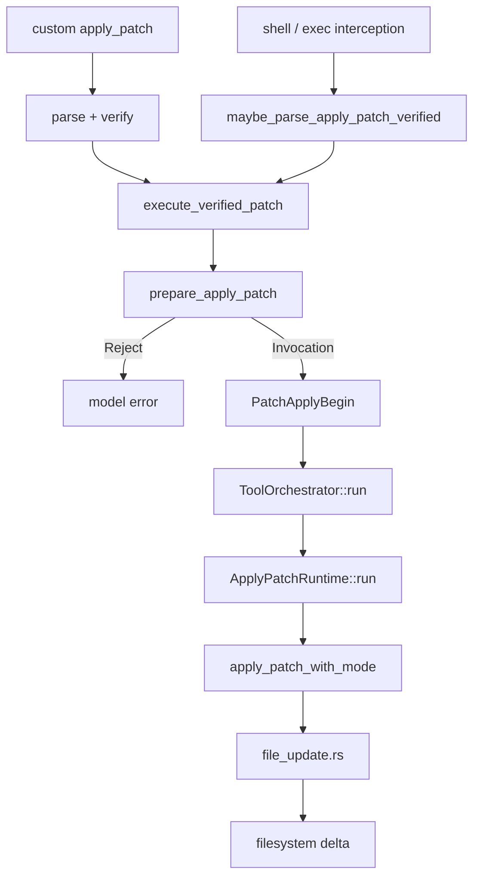

> direct custom tool 与 shell/exec interception 都先得到 verified patch，随后汇合到 `execute_verified_patch`。该统一 helper 计算权限、调用 `prepare_apply_patch`，并把获准 invocation 交给 orchestrator/runtime；底层 crate 才执行真实文件修改。`Feature::ApplyPatchPreserveLineEndings` 打开时走 `file_update.rs` 的 PreserveLineEndings 路径，否则仍归一化为 LF。[E: codex-rs/core/src/tools/handlers/apply_patch.rs:360][E: codex-rs/core/src/tools/handlers/apply_patch.rs:420][E: codex-rs/core/src/tools/handlers/apply_patch.rs:547][E: codex-rs/core/src/tools/runtimes/apply_patch.rs:176][E: codex-rs/apply-patch/src/file_update.rs:43]

```mermaid
flowchart TD
    DIRECT["custom apply_patch"] --> VERIFY1["parse + verify"]
    SHELL["shell / exec interception"] --> VERIFY2["maybe_parse_apply_patch_verified"]
    VERIFY1 --> SHARED["execute_verified_patch"]
    VERIFY2 --> SHARED
    SHARED --> PREP["prepare_apply_patch"]
    PREP -->|Reject| MODEL["model error"]
    PREP -->|Invocation| BEGIN["PatchApplyBegin"]
    BEGIN --> ORCH["ToolOrchestrator::run"]
    ORCH --> RUNTIME["ApplyPatchRuntime::run"]
    RUNTIME --> LIB["apply_patch_with_mode"]
    LIB --> UPDATE["file_update.rs"]
    UPDATE --> FS["filesystem delta"]
```

## 端到端步骤

1. direct handler 只接受 custom payload，解析 patch、选择 environment、取得 filesystem，并按 cwd/sandbox 验证参数；验证时传入 `apply_patch_file_update_mode(turn)`，随后调用共享 `execute_verified_patch`。[E: codex-rs/core/src/tools/handlers/apply_patch.rs:375][E: codex-rs/core/src/tools/handlers/apply_patch.rs:404][E: codex-rs/core/src/tools/handlers/apply_patch.rs:420]
2. `apply_patch_file_update_mode` 读取 `Feature::ApplyPatchPreserveLineEndings`：开启则为 `PreserveLineEndings`，否则 `NormalizeToLf`。该 feature 当前是 UnderDevelopment、默认关闭。[E: codex-rs/core/src/tools/handlers/apply_patch.rs:60][E: codex-rs/features/src/lib.rs:1006][E: codex-rs/features/src/lib.rs:1009]
3. shell 与 UnifiedExec 路径调用同一个 interception helper；只有 `maybe_parse_apply_patch_verified_with_mode` 返回 verified body 才转入共享 patch path，否则继续普通 command 执行。[E: codex-rs/core/src/tools/handlers/shell.rs:147][E: codex-rs/core/src/tools/handlers/unified_exec/exec_command.rs:314][E: codex-rs/core/src/tools/handlers/apply_patch.rs:500][E: codex-rs/core/src/tools/handlers/apply_patch.rs:514][E: codex-rs/core/src/tools/handlers/apply_patch.rs:523]
4. `execute_verified_patch` 先计算 changed paths 与额外文件写权限，再调用 `prepare_apply_patch`。[E: codex-rs/core/src/tools/handlers/apply_patch.rs:547][E: codex-rs/core/src/tools/handlers/apply_patch.rs:554][E: codex-rs/core/src/tools/handlers/apply_patch.rs:558]
5. helper 把 patch action 转成 protocol file changes，创建 environment-aware emitter 并发送 begin event，然后构造 `ApplyPatchRequest` 交给 `ToolOrchestrator::run`。[E: codex-rs/core/src/tools/handlers/apply_patch.rs:564][E: codex-rs/core/src/tools/handlers/apply_patch.rs:576][E: codex-rs/core/src/tools/handlers/apply_patch.rs:578][E: codex-rs/core/src/tools/handlers/apply_patch.rs:589]
6. runtime 的 approval key 由 environment id 与变更路径组成，并向 orchestrator 暴露 request 自带的 approval requirement。[E: codex-rs/core/src/tools/runtimes/apply_patch.rs:123][E: codex-rs/core/src/tools/runtimes/apply_patch.rs:144]
7. runtime 从 turn environment 取得 filesystem 和 sandbox attempt，调用 `codex_apply_patch::apply_patch_with_mode`；成功后把 committed delta 追加到 runtime output。[E: codex-rs/core/src/tools/runtimes/apply_patch.rs:165][E: codex-rs/core/src/tools/runtimes/apply_patch.rs:172][E: codex-rs/core/src/tools/runtimes/apply_patch.rs:176][E: codex-rs/core/src/tools/runtimes/apply_patch.rs:194]
8. `apply_patch_with_mode` 把 update mode 交给 `file_update.rs`。`NormalizeToLf` 按 `\n` 切行并写回 LF；`PreserveLineEndings` 用 `SourceFile` 保留原文件换行，并用该文件的 preferred ending 写新行。[E: codex-rs/apply-patch/src/lib.rs:341][E: codex-rs/apply-patch/src/file_update.rs:25][E: codex-rs/apply-patch/src/file_update.rs:43][E: codex-rs/apply-patch/src/file_update.rs:64]
9. sandbox denial 被规范化后返回；无论 orchestrator 成功或失败，helper 都保留 committed delta 并由 emitter 发送 finish。[E: codex-rs/core/src/tools/runtimes/apply_patch.rs:203][E: codex-rs/core/src/tools/runtimes/apply_patch.rs:215][E: codex-rs/core/src/tools/handlers/apply_patch.rs:597]

## 关键边界

- `prepare_apply_patch` 只决定 rejection 或 runtime invocation；真正写文件的是 `codex-rs/apply-patch`。[E: codex-rs/core/src/apply_patch.rs:22][E: codex-rs/core/src/apply_patch.rs:36][E: codex-rs/core/src/apply_patch.rs:57][E: codex-rs/apply-patch/src/lib.rs:341]
- direct 与 intercepted path 共享同一个 permission、approval、events、sandbox 和 committed-delta 实现，不存在两套写文件逻辑。[E: codex-rs/core/src/tools/handlers/apply_patch.rs:420][E: codex-rs/core/src/tools/handlers/apply_patch.rs:531][E: codex-rs/core/src/tools/handlers/apply_patch.rs:547]
- 换行保留是 feature-gated 的 file-update 语义，不是独立 patch engine。standalone/arg0 apply-patch 进程通过 `CODEX_APPLY_PATCH_PRESERVE_LINE_ENDINGS` env 选择同一套 mode。[E: codex-rs/core/src/tools/handlers/apply_patch.rs:60][E: codex-rs/apply-patch/src/lib.rs:71][E: codex-rs/apply-patch/src/lib.rs:61]

## Sources

- `codex-rs/core/src/tools/spec_plan.rs`
- `codex-rs/core/src/tools/handlers/apply_patch.rs`
- `codex-rs/core/src/tools/handlers/shell.rs`
- `codex-rs/core/src/tools/handlers/unified_exec/exec_command.rs`
- `codex-rs/core/src/apply_patch.rs`
- `codex-rs/core/src/tools/runtimes/apply_patch.rs`
- `codex-rs/core/src/tools/orchestrator.rs`
- `codex-rs/core/src/tools/events.rs`
- `codex-rs/apply-patch/src/lib.rs`
- `codex-rs/apply-patch/src/file_update.rs`
- `codex-rs/features/src/lib.rs`

## 相关

- [工具调用解剖](tool-call-anatomy.md)
- [shell exec flow](shell-exec-flow.md)
- [apply_patch 工具](../surface/tools/apply-patch.md)
