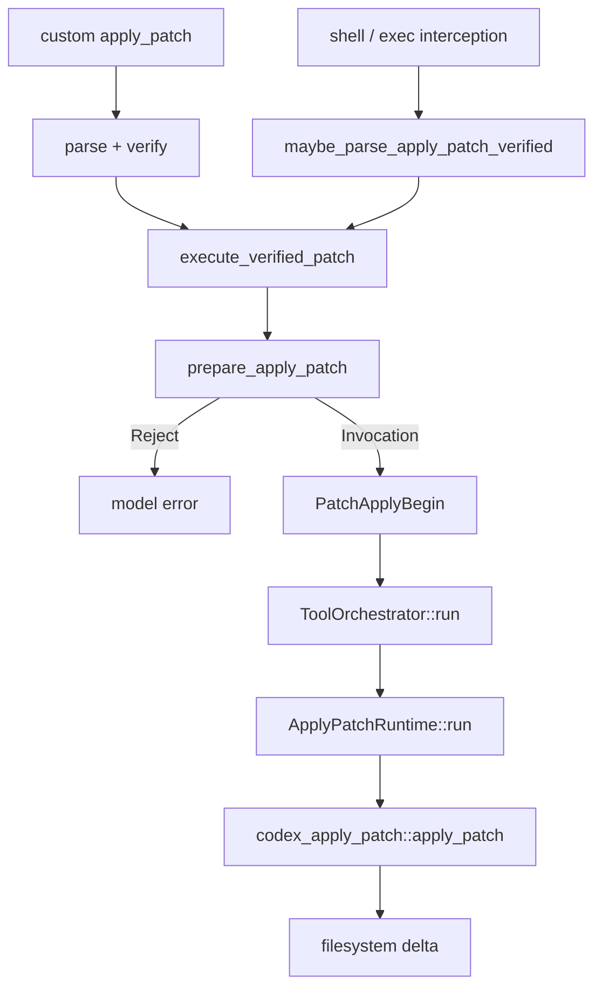

> direct custom tool 与 shell/exec interception 都先得到 verified patch，随后汇合到 `execute_verified_patch`。该统一 helper 计算权限、调用 `prepare_apply_patch`，并把获准 invocation 交给 orchestrator/runtime；底层 crate 才执行真实文件修改。[E: codex-rs/core/src/tools/handlers/apply_patch.rs:358][E: codex-rs/core/src/tools/handlers/apply_patch.rs:402][E: codex-rs/core/src/tools/handlers/apply_patch.rs:482][E: codex-rs/core/src/tools/handlers/apply_patch.rs:505][E: codex-rs/core/src/tools/handlers/apply_patch.rs:522][E: codex-rs/core/src/tools/runtimes/apply_patch.rs:236]

```mermaid
flowchart TD
    DIRECT["custom apply_patch"] --> VERIFY1["parse + verify"]
    SHELL["shell / exec interception"] --> VERIFY2["maybe_parse_apply_patch_verified"]
    VERIFY1 --> SHARED["execute_verified_patch"]
    VERIFY2 --> SHARED
    SHARED --> PREP["prepare_apply_patch"]
    PREP -->|Reject| MODEL["model error"]
    PREP -->|Invocation| BEGIN["PatchApplyBegin"]
    BEGIN --> ORCH["ToolOrchestrator::run"]
    ORCH --> RUNTIME["ApplyPatchRuntime::run"]
    RUNTIME --> LIB["codex_apply_patch::apply_patch"]
    LIB --> FS["filesystem delta"]
```

## 端到端步骤

1. direct handler 只接受 custom payload，解析 patch、选择 environment、取得 filesystem，并按 cwd/sandbox 验证参数；验证后调用共享 `execute_verified_patch`。[E: codex-rs/core/src/tools/handlers/apply_patch.rs:358][E: codex-rs/core/src/tools/handlers/apply_patch.rs:363][E: codex-rs/core/src/tools/handlers/apply_patch.rs:371][E: codex-rs/core/src/tools/handlers/apply_patch.rs:384][E: codex-rs/core/src/tools/handlers/apply_patch.rs:402][E: codex-rs/core/src/tools/handlers/apply_patch.rs:409]
2. shell 与 UnifiedExec 路径调用同一个 interception helper；只有 `maybe_parse_apply_patch_verified` 返回 verified body 才转入共享 patch path，否则继续普通 command 执行。[E: codex-rs/core/src/tools/handlers/shell.rs:141][E: codex-rs/core/src/tools/handlers/unified_exec/exec_command.rs:316][E: codex-rs/core/src/tools/handlers/apply_patch.rs:482][E: codex-rs/core/src/tools/handlers/apply_patch.rs:498][E: codex-rs/core/src/tools/handlers/apply_patch.rs:505]
3. `execute_verified_patch` 先计算 changed paths 与额外文件写权限，再调用 `prepare_apply_patch`。[E: codex-rs/core/src/tools/handlers/apply_patch.rs:522][E: codex-rs/core/src/tools/handlers/apply_patch.rs:529][E: codex-rs/core/src/tools/handlers/apply_patch.rs:538][E: codex-rs/core/src/tools/handlers/apply_patch.rs:539]
4. `prepare_apply_patch` 对 safety 结果做唯一决策：AutoApprove 生成 `ExecApprovalRequirement::Skip` invocation；AskUser 生成 `NeedsApproval` invocation；Reject 直接返回 model-facing error。[E: codex-rs/core/src/apply_patch.rs:21][E: codex-rs/core/src/apply_patch.rs:34][E: codex-rs/core/src/apply_patch.rs:37][E: codex-rs/core/src/apply_patch.rs:42][E: codex-rs/core/src/apply_patch.rs:49][E: codex-rs/core/src/apply_patch.rs:55]
5. helper 把 patch action 转成 protocol file changes，创建 environment-aware emitter 并发送 begin event，然后构造 `ApplyPatchRequest` 交给 `ToolOrchestrator::run`。[E: codex-rs/core/src/tools/handlers/apply_patch.rs:544][E: codex-rs/core/src/tools/handlers/apply_patch.rs:556][E: codex-rs/core/src/tools/handlers/apply_patch.rs:558][E: codex-rs/core/src/tools/handlers/apply_patch.rs:563][E: codex-rs/core/src/tools/handlers/apply_patch.rs:567]
6. runtime 的 approval key 由 environment id 与变更路径组成，并向 orchestrator 暴露 request 自带的 approval requirement。[E: codex-rs/core/src/tools/runtimes/apply_patch.rs:123][E: codex-rs/core/src/tools/runtimes/apply_patch.rs:198][E: codex-rs/core/src/tools/runtimes/apply_patch.rs:202]
7. runtime 从 turn environment 取得 workspace roots/filesystem 和 sandbox attempt，调用 `codex_apply_patch::apply_patch`；成功后把 committed delta 追加到 runtime output。[E: codex-rs/core/src/tools/runtimes/apply_patch.rs:217][E: codex-rs/core/src/tools/runtimes/apply_patch.rs:218][E: codex-rs/core/src/tools/runtimes/apply_patch.rs:236][E: codex-rs/core/src/tools/runtimes/apply_patch.rs:244][E: codex-rs/core/src/tools/runtimes/apply_patch.rs:249][E: codex-rs/core/src/tools/runtimes/apply_patch.rs:253]
8. sandbox denial 被规范化后返回；无论 orchestrator 成功或失败，helper 都保留 committed delta 并由 emitter 发送 finish。[E: codex-rs/core/src/tools/runtimes/apply_patch.rs:262][E: codex-rs/core/src/tools/runtimes/apply_patch.rs:264][E: codex-rs/core/src/tools/handlers/apply_patch.rs:579][E: codex-rs/core/src/tools/handlers/apply_patch.rs:589]

## 关键边界

- `prepare_apply_patch` 只决定 rejection 或 runtime invocation；旧的 `apply_patch::apply_patch` / `DelegateToRuntime` union 已不存在。[E: codex-rs/core/src/apply_patch.rs:15][E: codex-rs/core/src/apply_patch.rs:21]
- direct 与 intercepted path 共享同一个 permission、approval、events、sandbox 和 committed-delta 实现，不存在两套写文件逻辑。[E: codex-rs/core/src/tools/handlers/apply_patch.rs:402][E: codex-rs/core/src/tools/handlers/apply_patch.rs:505][E: codex-rs/core/src/tools/handlers/apply_patch.rs:522]
- 真正写文件的是 `codex-rs/apply-patch`；core handler/runtime 负责环境、策略、协议与生命周期。[E: codex-rs/apply-patch/src/lib.rs:276][E: codex-rs/apply-patch/src/lib.rs:311][E: codex-rs/core/src/tools/runtimes/apply_patch.rs:236]

## Sources

- `codex-rs/core/src/tools/handlers/apply_patch.rs`
- `codex-rs/core/src/apply_patch.rs`
- `codex-rs/core/src/tools/runtimes/apply_patch.rs`
- `codex-rs/apply-patch/src/lib.rs`

## 相关

- [工具调用解剖](tool-call-anatomy.md)
- [shell exec flow](shell-exec-flow.md)
- [apply_patch 工具](../surface/tools/apply-patch.md)
