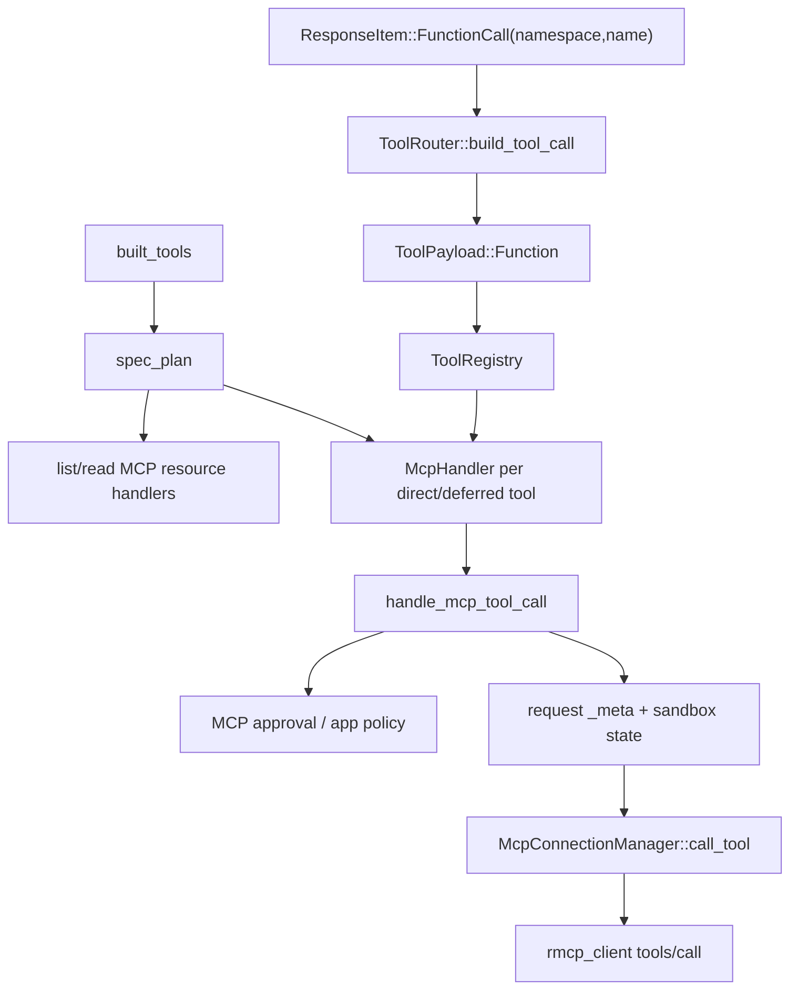

> MCP call trace 从 `built_tools` 把 direct/deferred MCP tool info 交给 `spec_plan` 注册开始；模型返回 namespaced `FunctionCall` 后，registry 命中 `McpHandler`，再由 `handle_mcp_tool_call` 处理 approval、request metadata、`McpConnectionManager::call_tool` 和 result sanitization。[E: codex-rs/core/src/session/turn.rs:1083][E: codex-rs/core/src/tools/spec_plan.rs:885][E: codex-rs/core/src/tools/router.rs:115][E: codex-rs/core/src/tools/handlers/mcp.rs:120][E: codex-rs/core/src/mcp_tool_call.rs:114]

## 能回答的问题

- MCP resource tools 与 MCP runtime tools 在 `spec_plan.rs` 中如何注册？
- 当前 router 是否生成专门的 MCP payload？
- `McpHandler` 如何把 Function payload 转成 MCP tool call？
- MCP approval、metadata、sandbox state 和 image sanitization 在哪里发生？
- 最终 JSON-RPC `tools/call` 从哪里发出？

## 端到端步骤

1. `run_sampling_request` 调用 `built_tools`，tool router 随后用于 prompt build；该入口把当前 turn 的 MCP exposure 纳入工具系统。[E: codex-rs/core/src/session/turn.rs:1083][E: codex-rs/core/src/session/turn.rs:1111]
2. `add_mcp_resource_tools` 在 `context.mcp_tools.is_some()` 时注册 list resources、list resource templates 和 read resource handlers。[E: codex-rs/core/src/tools/spec_plan.rs:699][E: codex-rs/core/src/tools/spec_plan.rs:700][E: codex-rs/core/src/tools/spec_plan.rs:701][E: codex-rs/core/src/tools/spec_plan.rs:702][E: codex-rs/core/src/tools/spec_plan.rs:703]
3. `add_mcp_runtime_tools` 对 direct MCP tools 调 `McpHandler::new(tool.clone())` 并 direct 注册；对 deferred MCP tools 用同一 handler 加 `ToolExposure::Deferred`。[E: codex-rs/core/src/tools/spec_plan.rs:885][E: codex-rs/core/src/tools/spec_plan.rs:888][E: codex-rs/core/src/tools/spec_plan.rs:889][E: codex-rs/core/src/tools/spec_plan.rs:898][E: codex-rs/core/src/tools/spec_plan.rs:901]
4. `ToolRouter::build_tool_call` 对 `ResponseItem::FunctionCall { name, namespace, arguments, call_id }` 构造 `ToolName::new(namespace, name)` 和 `ToolPayload::Function { arguments }`；当前 MCP 身份由 registry 中的 `McpHandler` 处理。[E: codex-rs/core/src/tools/router.rs:113][E: codex-rs/core/src/tools/router.rs:115][E: codex-rs/core/src/tools/router.rs:122][E: codex-rs/core/src/tools/router.rs:126]
5. `McpHandler::new` 生成 tool spec；handler 的 `tool_name()` 返回 `tool_info.canonical_tool_name()`，因此 registry 用 canonical MCP tool name 匹配 router 产出的 namespaced `ToolName`。[E: codex-rs/core/src/tools/handlers/mcp.rs:37][E: codex-rs/core/src/tools/handlers/mcp.rs:39][E: codex-rs/core/src/tools/handlers/mcp.rs:67][E: codex-rs/core/src/tools/handlers/mcp.rs:69]
6. `McpHandler` 只接受 `ToolPayload::Function`；它把 arguments、server name、server-local tool name 和 hook tool name 传入 `handle_mcp_tool_call`。[E: codex-rs/core/src/tools/handlers/mcp.rs:120][E: codex-rs/core/src/tools/handlers/mcp.rs:134][E: codex-rs/core/src/tools/handlers/mcp.rs:145][E: codex-rs/core/src/tools/handlers/mcp.rs:149][E: codex-rs/core/src/tools/handlers/mcp.rs:151]
7. `handle_mcp_tool_call` 解析 JSON arguments；空字符串允许为 None，无效 JSON 直接返回 error text result。[E: codex-rs/core/src/mcp_tool_call.rs:114][E: codex-rs/core/src/mcp_tool_call.rs:127][E: codex-rs/core/src/mcp_tool_call.rs:127][E: codex-rs/core/src/mcp_tool_call.rs:130][E: codex-rs/core/src/mcp_tool_call.rs:134]
8. handler 查询 MCP metadata，并对 Codex Apps MCP server 用 app tool policy evaluator 计算 policy input。[E: codex-rs/core/src/mcp_tool_call.rs:148][E: codex-rs/core/src/mcp_tool_call.rs:157][E: codex-rs/core/src/mcp_tool_call.rs:161][E: codex-rs/core/src/mcp_tool_call.rs:162]
9. MCP begin item 在 approval 前发送；`notify_mcp_tool_call_started` 构造 `TurnItem::McpToolCall`，状态为 `InProgress`。[E: codex-rs/core/src/mcp_tool_call.rs:227][E: codex-rs/core/src/mcp_tool_call.rs:236][E: codex-rs/core/src/mcp_tool_call.rs:876][E: codex-rs/core/src/mcp_tool_call.rs:888][E: codex-rs/core/src/mcp_tool_call.rs:900]
10. `maybe_request_mcp_tool_approval` 在 permission prompt 自动批准时返回 None；如果 annotations 不要求 approval 且 mode 不是 Prompt，也返回 None；否则会走 permission hooks、guardian 或 prompt options。[E: codex-rs/core/src/mcp_tool_call.rs:1203][E: codex-rs/core/src/mcp_tool_call.rs:1215][E: codex-rs/core/src/mcp_tool_call.rs:1222][E: codex-rs/core/src/mcp_tool_call.rs:1225][E: codex-rs/core/src/mcp_tool_call.rs:1227][E: codex-rs/core/src/mcp_tool_call.rs:1243][E: codex-rs/core/src/mcp_tool_call.rs:1273][E: codex-rs/core/src/mcp_tool_call.rs:1295]
11. approved/no-prompt path 会 rewrite OpenAI file inputs，构造 request meta，然后进入 `execute_mcp_tool_call`；completed path 会发送 MCP completion event 并记录 metrics。[E: codex-rs/core/src/mcp_tool_call.rs:381][E: codex-rs/core/src/mcp_tool_call.rs:397][E: codex-rs/core/src/mcp_tool_call.rs:399][E: codex-rs/core/src/mcp_tool_call.rs:431][E: codex-rs/core/src/mcp_tool_call.rs:444]
12. `execute_mcp_tool_call` 把 thread id 写入 request meta，并在 server 支持 sandbox-state capability 时注入 permission profile、linux sandbox exe、cwd 和 legacy landlock flag。[E: codex-rs/core/src/mcp_tool_call.rs:566][E: codex-rs/core/src/mcp_tool_call.rs:577][E: codex-rs/core/src/mcp_tool_call.rs:712][E: codex-rs/core/src/mcp_tool_call.rs:719][E: codex-rs/core/src/mcp_tool_call.rs:734]
13. MCP call 最终通过 `McpConnectionManager::call_tool(server, tool, arguments, meta)` 委托到 managed RMCP client；rmcp client 要求 arguments 和 `_meta` 都是 JSON object，随后发 `tools/call` service operation。[E: codex-rs/core/src/mcp_tool_call.rs:591][E: codex-rs/core/src/mcp_tool_call.rs:592][E: codex-rs/codex-mcp/src/connection_manager.rs:735][E: codex-rs/codex-mcp/src/connection_manager.rs:751][E: codex-rs/rmcp-client/src/rmcp_client.rs:599][E: codex-rs/rmcp-client/src/rmcp_client.rs:607][E: codex-rs/rmcp-client/src/rmcp_client.rs:616][E: codex-rs/rmcp-client/src/rmcp_client.rs:628]
14. result 回来后，`sanitize_mcp_tool_result_for_model` 按模型是否支持 image input 处理结果；event copy 还会被 `truncate_mcp_tool_result_for_event` 控制大小。[E: codex-rs/core/src/mcp_tool_call.rs:600][E: codex-rs/core/src/mcp_tool_call.rs:832][E: codex-rs/core/src/mcp_tool_call.rs:842][E: codex-rs/core/src/mcp_tool_call.rs:859]
15. skip/error path 会在需要时补发 begin，再发送 completed item，并返回 error text。[E: codex-rs/core/src/mcp_tool_call.rs:2191][E: codex-rs/core/src/mcp_tool_call.rs:2202][E: codex-rs/core/src/mcp_tool_call.rs:2212]

## 关键决策点

- MCP approval 没有复用 shell/apply_patch 的 `ToolOrchestrator`；approval、app policy、permission hooks 和 guardian flow 在 `mcp_tool_call.rs` 内部实现。[E: codex-rs/core/src/mcp_tool_call.rs:236][E: codex-rs/core/src/mcp_tool_call.rs:1203][I]
- MCP direct tool 的 model-visible shape 是 namespaced Function tool，runtime handler identity 来自 `ToolInfo::canonical_tool_name()`。[E: codex-rs/core/src/tools/router.rs:122][E: codex-rs/core/src/tools/handlers/mcp.rs:69][I]
- sandbox state 是 request metadata 的一部分，只有 server capability 显示支持时才注入。[E: codex-rs/core/src/mcp_tool_call.rs:719][E: codex-rs/core/src/mcp_tool_call.rs:723]

## 深挖入口

- `spine.tool-call-anatomy` 解释 FunctionCall 到 registry dispatch 的通用路径。
- `tool.list-mcp-resources` 解释 MCP resource list/read tools。
- `ref.protocol-event-lifecycle` 列出 MCP begin/end/approval 相关事件。

## Sources

- codex-rs/core/src/session/turn.rs
- codex-rs/core/src/tools/spec_plan.rs
- codex-rs/core/src/tools/router.rs
- codex-rs/core/src/tools/handlers/mcp.rs
- codex-rs/core/src/mcp_tool_call.rs
- codex-rs/codex-mcp/src/connection_manager.rs
- codex-rs/rmcp-client/src/rmcp_client.rs

## 相关

- [工具调用解剖](tool-call-anatomy.md)
- [一次 turn 端到端](turn-end-to-end.md)
- [list_mcp_resources 工具](../surface/tools/list-mcp-resources.md)
- 索引 id：`ref.protocol-event-lifecycle`
