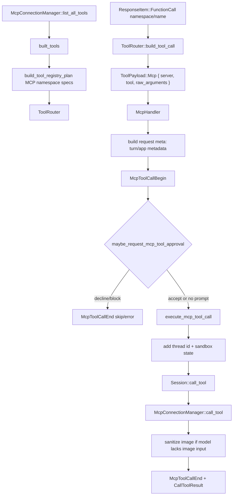

> MCP tool call trace 从 `built_tools` 暴露 MCP namespace/spec 开始，经 `ToolRouter::build_tool_call` 转成 `ToolPayload::Mcp`，再由 `McpHandler` 发 begin/end events、审批、metadata、manager call 和 result sanitization。[I]

## 能回答的问题

- MCP tools 怎样进入模型可见工具列表？
- `FunctionCall` 为什么会在 router 阶段变成 `ToolPayload::Mcp`？
- MCP approval、app tool policy、safety monitor 在哪里发生？
- request metadata 如何携带 turn metadata、thread id、sandbox state？
- MCP result 中的 image 为什么可能被替换成 text？

该 flowchart 是后续编号步骤的视觉索引；具体控制流事实以编号步骤中的源码证据为准。[I]

## 端到端步骤

1. `built_tools` 读取 `mcp_connection_manager.list_all_tools()`，调用 `build_mcp_tool_exposure`，并在 `ToolRouter::from_config` 参数里传入 exposure 输出的 direct/deferred MCP tools 和 parallel MCP server names；direct/deferred 的具体分类规则由 `build_mcp_tool_exposure` 实现。[E: codex-rs/core/src/session/turn.rs:1171][E: codex-rs/core/src/session/turn.rs:1174][E: codex-rs/core/src/session/turn.rs:1252][E: codex-rs/core/src/session/turn.rs:1259][E: codex-rs/core/src/session/turn.rs:1260][E: codex-rs/core/src/session/turn.rs:1276][E: codex-rs/core/src/session/turn.rs:1291][E: codex-rs/core/src/session/turn.rs:1292][E: codex-rs/core/src/session/turn.rs:1294][I]
2. `build_tool_registry_plan` 在 `params.mcp_tools.is_some()` 时加入 MCP resources/list/read tools，并注册 `McpResource` handler。[E: codex-rs/tools/src/tool_registry_plan.rs:193][E: codex-rs/tools/src/tool_registry_plan.rs:195][E: codex-rs/tools/src/tool_registry_plan.rs:200][E: codex-rs/tools/src/tool_registry_plan.rs:205][E: codex-rs/tools/src/tool_registry_plan.rs:209][E: codex-rs/tools/src/tool_registry_plan.rs:210][E: codex-rs/tools/src/tool_registry_plan.rs:211]
3. plan 收到的 direct MCP tools 必须带 namespace；每个转换成功的 MCP tool 会注册 `ToolHandlerKind::Mcp`，同 namespace 下的 converted tools 被放进 `ToolSpec::Namespace`。[E: codex-rs/tools/src/tool_registry_plan.rs:502][E: codex-rs/tools/src/tool_registry_plan.rs:503][E: codex-rs/tools/src/tool_registry_plan.rs:504][E: codex-rs/tools/src/tool_registry_plan.rs:505][E: codex-rs/tools/src/tool_registry_plan.rs:506][E: codex-rs/tools/src/tool_registry_plan.rs:532][E: codex-rs/tools/src/tool_registry_plan.rs:535][E: codex-rs/tools/src/tool_registry_plan.rs:548][E: codex-rs/tools/src/tool_registry_plan.rs:549][E: codex-rs/tools/src/tool_registry_plan.rs:550][E: codex-rs/tools/src/tool_registry_plan.rs:551]
4. `McpConnectionManager::list_all_tools` 遍历 managed clients 的 listed tools，并用 `qualify_tools(tools)` 生成 canonical tool map。[E: codex-rs/codex-mcp/src/mcp_connection_manager.rs:925][E: codex-rs/codex-mcp/src/mcp_connection_manager.rs:927][E: codex-rs/codex-mcp/src/mcp_connection_manager.rs:931][E: codex-rs/codex-mcp/src/mcp_connection_manager.rs:933]
5. 当模型返回 `ResponseItem::FunctionCall` 时，`ToolRouter::build_tool_call` 先构造 `ToolName::new(namespace, name)`；如果 `session.resolve_mcp_tool_info(&tool_name).await` 命中，就创建 `ToolPayload::Mcp { server, tool, raw_arguments }`。[E: codex-rs/core/src/tools/router.rs:178][E: codex-rs/core/src/tools/router.rs:185][E: codex-rs/core/src/tools/router.rs:186][E: codex-rs/core/src/tools/router.rs:190][E: codex-rs/core/src/tools/router.rs:191][E: codex-rs/core/src/tools/router.rs:192][E: codex-rs/core/src/tools/router.rs:193]
6. `McpHandler` 只接受 `ToolPayload::Mcp`，拆出 server/tool/raw_arguments 后调用 `handle_mcp_tool_call`。[E: codex-rs/core/src/tools/handlers/mcp.rs:30][E: codex-rs/core/src/tools/handlers/mcp.rs:31][E: codex-rs/core/src/tools/handlers/mcp.rs:35][E: codex-rs/core/src/tools/handlers/mcp.rs:37][E: codex-rs/core/src/tools/handlers/mcp.rs:43][E: codex-rs/core/src/tools/handlers/mcp.rs:47]
7. `handle_mcp_tool_call` 把 raw arguments 解析成 JSON value；空字符串是 `None`，无效 JSON 会直接返回 error text result。[E: codex-rs/core/src/mcp_tool_call.rs:74][E: codex-rs/core/src/mcp_tool_call.rs:84][E: codex-rs/core/src/mcp_tool_call.rs:87][E: codex-rs/core/src/mcp_tool_call.rs:91]
8. `handle_mcp_tool_call` 查询 MCP metadata、计算 app tool policy 或 custom MCP approval mode；Codex apps MCP server 且 app policy disabled 时会调用 `notify_mcp_tool_call_skip(..., already_started=false)`，发送 begin/end events，并返回 error result。[E: codex-rs/core/src/mcp_tool_call.rs:102][E: codex-rs/core/src/mcp_tool_call.rs:107][E: codex-rs/core/src/mcp_tool_call.rs:124][E: codex-rs/core/src/mcp_tool_call.rs:130][E: codex-rs/core/src/mcp_tool_call.rs:131][E: codex-rs/core/src/mcp_tool_call.rs:138][E: codex-rs/core/src/mcp_tool_call.rs:147][E: codex-rs/core/src/mcp_tool_call.rs:1747][E: codex-rs/core/src/mcp_tool_call.rs:1748][E: codex-rs/core/src/mcp_tool_call.rs:1753][E: codex-rs/core/src/mcp_tool_call.rs:1756][E: codex-rs/core/src/mcp_tool_call.rs:1763]
9. MCP begin event 在任何 approval prompt 前发送，事件是 `EventMsg::McpToolCallBegin`，字段包含 call_id、invocation 和 mcp app resource URI。[E: codex-rs/core/src/mcp_tool_call.rs:165][E: codex-rs/core/src/mcp_tool_call.rs:166][E: codex-rs/core/src/mcp_tool_call.rs:167][E: codex-rs/core/src/mcp_tool_call.rs:168][E: codex-rs/core/src/mcp_tool_call.rs:170]
10. `maybe_request_mcp_tool_approval` 在 permission prompt 自动批准时返回 None；如果 annotations 不要求 approval 且 mode 不是 Prompt，也返回 None。[E: codex-rs/core/src/mcp_tool_call.rs:812][E: codex-rs/core/src/mcp_tool_call.rs:820][E: codex-rs/core/src/mcp_tool_call.rs:824][E: codex-rs/core/src/mcp_tool_call.rs:827][E: codex-rs/core/src/mcp_tool_call.rs:829][E: codex-rs/core/src/mcp_tool_call.rs:830]
11. approval mode 为 Approve 时，MCP safety monitor 可能返回 Ok、AskUser 或 SteerModel；SteerModel 会变成 `BlockedBySafetyMonitor` decision。[E: codex-rs/core/src/mcp_tool_call.rs:833][E: codex-rs/core/src/mcp_tool_call.rs:834][E: codex-rs/core/src/mcp_tool_call.rs:836][E: codex-rs/core/src/mcp_tool_call.rs:846][E: codex-rs/core/src/mcp_tool_call.rs:847][E: codex-rs/core/src/mcp_tool_call.rs:850][E: codex-rs/core/src/mcp_tool_call.rs:851]
12. 如果 approval decision 存在并且是 Accept/AcceptForSession/AcceptAndRemember，handler 会 mark memory polluted、调用 `execute_mcp_tool_call`、发送 `McpToolCallEnd` 并记录 metrics。[E: codex-rs/core/src/mcp_tool_call.rs:182][E: codex-rs/core/src/mcp_tool_call.rs:183][E: codex-rs/core/src/mcp_tool_call.rs:184][E: codex-rs/core/src/mcp_tool_call.rs:185][E: codex-rs/core/src/mcp_tool_call.rs:186][E: codex-rs/core/src/mcp_tool_call.rs:190][E: codex-rs/core/src/mcp_tool_call.rs:218][E: codex-rs/core/src/mcp_tool_call.rs:225][E: codex-rs/core/src/mcp_tool_call.rs:290]
13. 如果没有 approval prompt，handler 同样 mark memory polluted、调用 `execute_mcp_tool_call`、发送 end event、track app used 和 metrics。[E: codex-rs/core/src/mcp_tool_call.rs:302][E: codex-rs/core/src/mcp_tool_call.rs:306][E: codex-rs/core/src/mcp_tool_call.rs:334][E: codex-rs/core/src/mcp_tool_call.rs:342][E: codex-rs/core/src/mcp_tool_call.rs:348][E: codex-rs/core/src/mcp_tool_call.rs:351]
14. `execute_mcp_tool_call` 先 rewrite OpenAI file inputs，再把 thread id 写进 request meta，并按 server capability 注入 sandbox state meta。[E: codex-rs/core/src/mcp_tool_call.rs:464][E: codex-rs/core/src/mcp_tool_call.rs:473][E: codex-rs/core/src/mcp_tool_call.rs:480][E: codex-rs/core/src/mcp_tool_call.rs:483][E: codex-rs/core/src/mcp_tool_call.rs:487]
15. sandbox state meta 包含 sandbox policy、linux sandbox executable、sandbox cwd 和 legacy landlock flag；只有 server 支持 sandbox-state meta capability 时才注入。[E: codex-rs/core/src/mcp_tool_call.rs:509][E: codex-rs/core/src/mcp_tool_call.rs:514][E: codex-rs/core/src/mcp_tool_call.rs:517][E: codex-rs/core/src/mcp_tool_call.rs:518][E: codex-rs/core/src/mcp_tool_call.rs:521][E: codex-rs/core/src/mcp_tool_call.rs:522][E: codex-rs/core/src/mcp_tool_call.rs:523][E: codex-rs/core/src/mcp_tool_call.rs:524][E: codex-rs/core/src/mcp_tool_call.rs:525]
16. `execute_mcp_tool_call` 通过 `Session::call_tool(server, tool_name, rewritten_arguments, request_meta)` 发起实际 MCP call。[E: codex-rs/core/src/mcp_tool_call.rs:487][E: codex-rs/core/src/session/mcp.rs:177][E: codex-rs/core/src/session/mcp.rs:184][E: codex-rs/core/src/session/mcp.rs:188]
17. `Session::call_tool` 持有 session-owned connection manager read guard，并委托 `McpConnectionManager::call_tool`。[E: codex-rs/core/src/session/mcp.rs:184][E: codex-rs/core/src/session/mcp.rs:186][E: codex-rs/core/src/session/mcp.rs:188]
18. `McpConnectionManager::call_tool` 先按 server 找 client，再用 tool filter 检查工具是否 allowed，最后调用 underlying MCP client 的 `call_tool(tool, arguments, meta, timeout)`。[E: codex-rs/codex-mcp/src/mcp_connection_manager.rs:1124][E: codex-rs/codex-mcp/src/mcp_connection_manager.rs:1131][E: codex-rs/codex-mcp/src/mcp_connection_manager.rs:1132][E: codex-rs/codex-mcp/src/mcp_connection_manager.rs:1138][E: codex-rs/codex-mcp/src/mcp_connection_manager.rs:1139][E: codex-rs/codex-mcp/src/mcp_connection_manager.rs:1140]
19. manager 将 rmcp result 的 content 序列化成 JSON，保留 structured_content 和 is_error；meta 会尝试序列化为 JSON 后携带，序列化失败时为 None，最后返回 core `CallToolResult`。[E: codex-rs/codex-mcp/src/mcp_connection_manager.rs:1144][E: codex-rs/codex-mcp/src/mcp_connection_manager.rs:1148][E: codex-rs/codex-mcp/src/mcp_connection_manager.rs:1153][E: codex-rs/codex-mcp/src/mcp_connection_manager.rs:1155][E: codex-rs/codex-mcp/src/mcp_connection_manager.rs:1156][E: codex-rs/codex-mcp/src/mcp_connection_manager.rs:1157]
20. `sanitize_mcp_tool_result_for_model` 在模型不支持 image input 时，把 content type 为 `"image"` 的 block 替换成 text placeholder。[E: codex-rs/core/src/mcp_tool_call.rs:490][E: codex-rs/core/src/mcp_tool_call.rs:491][E: codex-rs/core/src/mcp_tool_call.rs:492][E: codex-rs/core/src/mcp_tool_call.rs:493][E: codex-rs/core/src/mcp_tool_call.rs:494][E: codex-rs/core/src/mcp_tool_call.rs:561][E: codex-rs/core/src/mcp_tool_call.rs:565][E: codex-rs/core/src/mcp_tool_call.rs:574][E: codex-rs/core/src/mcp_tool_call.rs:575][E: codex-rs/core/src/mcp_tool_call.rs:577][E: codex-rs/core/src/mcp_tool_call.rs:578][E: codex-rs/core/src/mcp_tool_call.rs:579]

## 关键设计点

- MCP tool 的 model-visible shape 是 namespace tool，runtime payload 是 server/tool/raw_arguments；router 负责从 canonical `ToolName` 找回 server-local tool identity。[E: codex-rs/tools/src/tool_registry_plan.rs:548][E: codex-rs/tools/src/tool_registry_plan.rs:551][E: codex-rs/core/src/tools/router.rs:186][E: codex-rs/core/src/tools/router.rs:190][E: codex-rs/core/src/tools/router.rs:191][E: codex-rs/core/src/tools/router.rs:192][E: codex-rs/core/src/tools/router.rs:193]
- MCP approval 实现在 `handle_mcp_tool_call` 内部，按 app policy、custom server config、annotations 和 safety monitor 决定；“不复用 shell/apply_patch 的 `ToolOrchestrator`”是从调用路径缺失该 orchestrator 的源码归纳。[E: codex-rs/core/src/mcp_tool_call.rs:107][E: codex-rs/core/src/mcp_tool_call.rs:124][E: codex-rs/core/src/mcp_tool_call.rs:127][E: codex-rs/core/src/mcp_tool_call.rs:172][E: codex-rs/core/src/mcp_tool_call.rs:827][E: codex-rs/core/src/mcp_tool_call.rs:828][E: codex-rs/core/src/mcp_tool_call.rs:836][E: codex-rs/core/src/mcp_tool_call.rs:851][I]
- request metadata 在 call 前合成 turn metadata、Codex apps meta、thread id 和 sandbox state；把这些 metadata 称为 MCP call 的隐式 control plane 是架构归纳。[E: codex-rs/core/src/mcp_tool_call.rs:693][E: codex-rs/core/src/mcp_tool_call.rs:700][E: codex-rs/core/src/mcp_tool_call.rs:707][E: codex-rs/core/src/mcp_tool_call.rs:711][E: codex-rs/core/src/mcp_tool_call.rs:713][E: codex-rs/core/src/mcp_tool_call.rs:480][E: codex-rs/core/src/mcp_tool_call.rs:487][E: codex-rs/core/src/mcp_tool_call.rs:521][I]
- MCP result sanitization 以模型 input modality 为准；这让同一个 MCP server 可以返回 image content，但不支持 image input 的模型只收到 text placeholder。[E: codex-rs/core/src/mcp_tool_call.rs:490][E: codex-rs/core/src/mcp_tool_call.rs:494][E: codex-rs/core/src/mcp_tool_call.rs:561][E: codex-rs/core/src/mcp_tool_call.rs:565][E: codex-rs/core/src/mcp_tool_call.rs:575][E: codex-rs/core/src/mcp_tool_call.rs:577][E: codex-rs/core/src/mcp_tool_call.rs:579]

## 深挖入口

- `spine.tool-call-anatomy` 解释 MCP payload 进入 `ToolRegistry::dispatch_any` 的通用路径。
- `tool.list-mcp-resources` 应解释 list/read resource tools 和 `McpResourceHandler`。
- 索引 id：`ref.protocol-event-lifecycle` 应列出 `McpToolCallBegin`、`McpToolCallEnd`、MCP approval 相关事件。

## Sources

- codex-rs/tools/src/tool_registry_plan.rs
- codex-rs/core/src/session/turn.rs
- codex-rs/core/src/tools/router.rs
- codex-rs/core/src/tools/handlers/mcp.rs
- codex-rs/core/src/mcp_tool_call.rs
- codex-rs/core/src/session/mcp.rs
- codex-rs/codex-mcp/src/mcp_connection_manager.rs

## 相关

- [工具调用解剖](tool-call-anatomy.md)
- [一次 turn 端到端](turn-end-to-end.md)
- [list_mcp_resources 工具](../surface/tools/list-mcp-resources.md)
- 索引 id：`ref.protocol-event-lifecycle`
