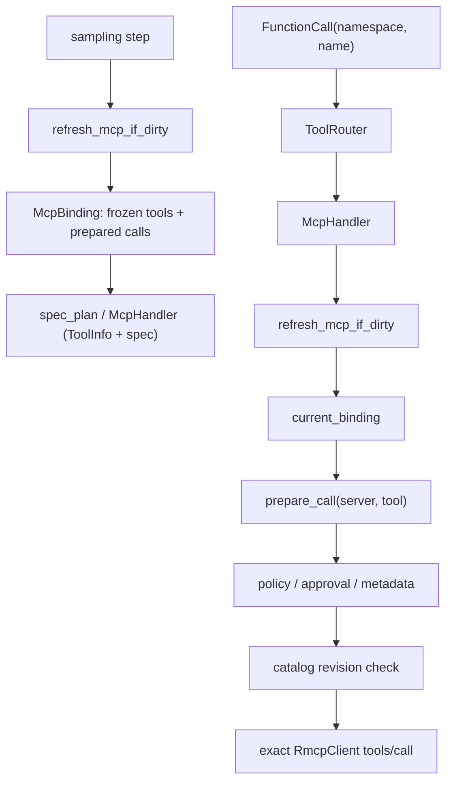

> 一次 MCP tool call 有两个 binding 边界：sampling step 的 binding 决定模型看到的 tool spec；执行前会再次 refresh，并从 call-time current binding 解析同名 tool 的 approval metadata、config 与 exact client。revision guard 只保护后一个 prepared call 到发送之间的窗口。

## 流程

```mermaid
flowchart TD
    STEP["sampling step"] --> REFRESH["refresh_mcp_if_dirty"]
    REFRESH --> BINDING["McpBinding: frozen tools + prepared calls"]
    BINDING --> PLAN["spec_plan / McpHandler (ToolInfo + spec)"]
    MODEL["FunctionCall(namespace, name)"] --> ROUTER["ToolRouter"]
    ROUTER --> HANDLER["McpHandler"]
    HANDLER --> REFRESH2["refresh_mcp_if_dirty"]
    REFRESH2 --> CURRENT["current_binding"]
    CURRENT --> PREPARED["prepare_call(server, tool)"]
    PREPARED --> APPROVAL["policy / approval / metadata"]
    APPROVAL --> REVISION["catalog revision check"]
    REVISION --> RMCP["exact RmcpClient tools/call"]
```

## 端到端步骤

1. `mcp_runtime_for_step` 比较 selected capability roots，必要时标记 runtime dirty，等待 refresh 完成后捕获最新 `McpBinding`；这一步发生在 model-visible tools 被构建之前。[E: codex-rs/core/src/session/mcp.rs:258][E: codex-rs/core/src/session/mcp.rs:279]
2. binding 保存该 step 的冻结 `tools` 与 prepared-call map；planner 用 `tools` 创建 model-visible specs，但后续普通 MCP handler 不携带这个 binding。[E: codex-rs/codex-mcp/src/binding.rs:30][E: codex-rs/codex-mcp/src/binding.rs:36][E: codex-rs/codex-mcp/src/binding.rs:79][E: codex-rs/core/src/tools/handlers/mcp.rs:32]
3. `add_mcp_resource_tools` 只在 binding 有 server 时注册 list/read resource handlers；`add_mcp_runtime_tools` 把 direct/deferred `ToolInfo` 注册为 `McpHandler`。[E: codex-rs/core/src/tools/spec_plan.rs:722][E: codex-rs/core/src/tools/spec_plan.rs:726][E: codex-rs/core/src/tools/spec_plan.rs:919][E: codex-rs/core/src/tools/spec_plan.rs:935]
4. 模型返回 namespaced `FunctionCall` 后，router 用 namespace/name 构造 `ToolName` 与 function payload；registry 通过 canonical MCP tool name 命中对应 handler。[E: codex-rs/core/src/tools/router.rs:128][E: codex-rs/core/src/tools/router.rs:141][E: codex-rs/core/src/tools/handlers/mcp.rs:67][E: codex-rs/core/src/tools/handlers/mcp.rs:69]
5. `McpHandler` 只保存 `ToolInfo/spec`；收到 function payload 后只把 arguments、server 与 server-local tool name 交给 `handle_mcp_tool_call`，没有传 step binding 或 prepared call。[E: codex-rs/core/src/tools/handlers/mcp.rs:32][E: codex-rs/core/src/tools/handlers/mcp.rs:120][E: codex-rs/core/src/tools/handlers/mcp.rs:145][E: codex-rs/core/src/tools/handlers/mcp.rs:151]
6. `handle_mcp_tool_call` 解析 JSON 后先 `refresh_mcp_if_dirty()`，从 runtime 的 `current_binding()` 重新 `prepare_call(server, tool)`；最新 catalog 已无该 tool 时，在任何 started item 前返回 unavailable result。[E: codex-rs/core/src/mcp_tool_call.rs:119][E: codex-rs/core/src/mcp_tool_call.rs:143][E: codex-rs/core/src/mcp_tool_call.rs:144][E: codex-rs/core/src/mcp_tool_call.rs:145][E: codex-rs/core/src/mcp_tool_call.rs:149][E: codex-rs/core/src/mcp_tool_call.rs:157]
7. 若 call-time lookup 成功，core 使用该 `PreparedMcpCall` 的 Apps policy、approval metadata、permission hooks/guardian/prompt，并准备 OpenAI file inputs、request `_meta` 与可选 sandbox state。[E: codex-rs/core/src/mcp_tool_call.rs:167][E: codex-rs/core/src/mcp_tool_call.rs:169][E: codex-rs/core/src/mcp_tool_call.rs:182][E: codex-rs/core/src/mcp_tool_call.rs:221][E: codex-rs/core/src/mcp_tool_call.rs:235][E: codex-rs/core/src/mcp_tool_call.rs:396][E: codex-rs/core/src/mcp_tool_call.rs:414][E: codex-rs/core/src/mcp_tool_call.rs:723][E: codex-rs/core/src/mcp_tool_call.rs:747]
8. irreversible preparation 与发送进入 call-time `PreparedMcpCall::call_with_preparation`。prepared call 建立后、revision read guard 获取前若 catalog revision 已变化就拒绝；匹配时在 guard 内完成参数准备与 exact `ManagedClient` call，使 replacement 等待发送结束。[E: codex-rs/codex-mcp/src/binding.rs:248][E: codex-rs/codex-mcp/src/binding.rs:258][E: codex-rs/codex-mcp/src/binding.rs:265][E: codex-rs/codex-mcp/src/binding.rs:273]
9. RMCP result 转成 Codex `CallToolResult` 后，core 按模型 image capability sanitize，并为 event copy 做大小截断，再发送 completed item。[E: codex-rs/codex-mcp/src/binding.rs:277][E: codex-rs/codex-mcp/src/binding.rs:290][E: codex-rs/core/src/mcp_tool_call.rs:850][E: codex-rs/core/src/mcp_tool_call.rs:877]

## 决策点

- approval authority、server metadata、plugin provenance 与 client identity 来自执行前 current binding 生成的 prepared call，而不是广告时 binding。read guard 避免的是 prepare 后的 catalog replacement 穿透，不是整个 sampling step 的 refresh。[E: codex-rs/core/src/mcp_tool_call.rs:143][E: codex-rs/core/src/mcp_tool_call.rs:167][E: codex-rs/codex-mcp/src/binding.rs:258][I]
- MCP approval 仍在 `mcp_tool_call.rs` 内实现，没有复用 shell/apply-patch 的 `ToolOrchestrator`。[E: codex-rs/core/src/mcp_tool_call.rs:235][E: codex-rs/core/src/mcp_tool_call.rs:1275][I]
- resource tools 走 step binding，extension resource client follow latest，而普通 MCP call 在执行前 refresh 并取 current binding；见 `subsys.mcp.client`。[I]

## Sources

- `codex-rs/core/src/session/mcp.rs`
- `codex-rs/core/src/tools/spec_plan.rs`
- `codex-rs/core/src/tools/router.rs`
- `codex-rs/core/src/tools/handlers/mcp.rs`
- `codex-rs/core/src/mcp_tool_call.rs`
- `codex-rs/codex-mcp/src/runtime.rs`
- `codex-rs/codex-mcp/src/binding.rs`
- `codex-rs/codex-mcp/src/rmcp_client.rs`

## 相关

- [MCP client runtime](../subsystems/mcp/client.md)
- [工具调用解剖](tool-call-anatomy.md)
- [一次 turn 端到端](turn-end-to-end.md)
