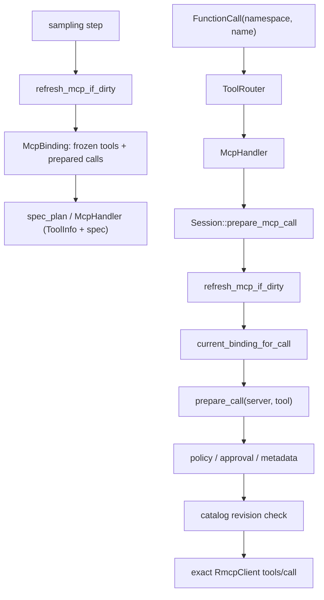

> 一次 MCP tool call 有两个 binding 边界：sampling step 的 binding 决定模型看到的 tool spec；执行前 `Session::prepare_mcp_call` 会再次 refresh，并从 call-time current binding 解析同名 tool 的 approval metadata、config 与 exact client。revision guard 只保护后一个 prepared call 到发送之间的窗口。

## 流程

```mermaid
flowchart TD
    STEP["sampling step"] --> REFRESH["refresh_mcp_if_dirty"]
    REFRESH --> BINDING["McpBinding: frozen tools + prepared calls"]
    BINDING --> PLAN["spec_plan / McpHandler (ToolInfo + spec)"]
    MODEL["FunctionCall(namespace, name)"] --> ROUTER["ToolRouter"]
    ROUTER --> HANDLER["McpHandler"]
    HANDLER --> PREP["Session::prepare_mcp_call"]
    PREP --> REFRESH2["refresh_mcp_if_dirty"]
    REFRESH2 --> CURRENT["current_binding_for_call"]
    CURRENT --> PREPARED["prepare_call(server, tool)"]
    PREPARED --> APPROVAL["policy / approval / metadata"]
    APPROVAL --> REVISION["catalog revision check"]
    REVISION --> RMCP["exact RmcpClient tools/call"]
```

## 端到端步骤

1. `mcp_runtime_for_step` 比较 selected capability roots，必要时标记 runtime dirty，等待 refresh 完成后捕获最新 `McpBinding`；这一步发生在 model-visible tools 被构建之前。[E: codex-rs/core/src/session/mcp.rs:290][E: codex-rs/core/src/session/mcp.rs:304]
2. binding 保存该 step 的冻结 `tools` 与 prepared-call map；planner 用 `tools` 创建 model-visible specs，但后续普通 MCP handler 不携带这个 binding。[E: codex-rs/codex-mcp/src/binding.rs:30][E: codex-rs/codex-mcp/src/binding.rs:36][E: codex-rs/codex-mcp/src/binding.rs:79][E: codex-rs/core/src/tools/handlers/mcp.rs:47]
3. `add_mcp_resource_tools` 只在 binding 有 server 时注册三种 list/read resource handlers；`build_tool_router` 则通过 `mcp_handler_cache.append_mcp_tools` 把 binding 的 tool catalog 按 search gate 以 direct/deferred `McpHandler` 注册进同一个 registry。Guardian reviewer turn 跳过整段 MCP 注册。[E: codex-rs/core/src/tools/spec_plan.rs:1025][E: codex-rs/core/src/tools/spec_plan.rs:1027][E: codex-rs/core/src/tools/spec_plan.rs:147][E: codex-rs/core/src/tools/spec_plan.rs:151]
4. 模型返回 namespaced `FunctionCall` 后，router 用 namespace/name 构造 `ToolName` 与 function payload；registry 通过 canonical MCP tool name 命中对应 handler。[E: codex-rs/core/src/tools/router.rs:154][E: codex-rs/core/src/tools/router.rs:164][E: codex-rs/core/src/tools/handlers/mcp.rs:117]
5. `McpHandler` 只保存 `ToolInfo/spec`；收到 function payload 后把 arguments、server 与 server-local tool name 交给 `handle_mcp_tool_call`，没有传 step binding 或 prepared call。[E: codex-rs/core/src/tools/handlers/mcp.rs:47][E: codex-rs/core/src/tools/handlers/mcp.rs:183][E: codex-rs/core/src/tools/handlers/mcp.rs:193]
6. `handle_mcp_tool_call` 解析 JSON 后调 `sess.prepare_mcp_call(server, tool)`；后者先 `refresh_mcp_if_dirty()`，再从 runtime 的 `current_binding_for_call` 重新 `prepare_call`。最新 catalog 已无该 tool 时，在任何 started item 前返回 unavailable result。[E: codex-rs/core/src/mcp_tool_call.rs:111][E: codex-rs/core/src/mcp_tool_call.rs:146][E: codex-rs/core/src/session/mcp_runtime.rs:52][E: codex-rs/core/src/session/mcp_runtime.rs:57]
7. 若 call-time lookup 成功，core 使用该 `PreparedMcpCall` 的 Apps policy、approval metadata、permission hooks/guardian/prompt，并准备 OpenAI file inputs、request `_meta` 与可选 sandbox state。[E: codex-rs/core/src/mcp_tool_call.rs:165][E: codex-rs/core/src/mcp_tool_call.rs:168][E: codex-rs/core/src/mcp_tool_call.rs:228][E: codex-rs/core/src/mcp_tool_call.rs:233]
8. irreversible preparation 与发送进入 call-time `PreparedMcpCall::call_with_preparation`。prepared call 建立后、revision read guard 获取前若 catalog revision 已变化就拒绝；匹配时在 guard 内完成参数准备与 exact `ManagedClient` call，使 replacement 等待发送结束。[E: codex-rs/codex-mcp/src/binding.rs:266][E: codex-rs/codex-mcp/src/binding.rs:272][E: codex-rs/codex-mcp/src/binding.rs:279][E: codex-rs/codex-mcp/src/binding.rs:280]
9. RMCP result 转成 Codex `CallToolResult` 后，core 按模型 image capability sanitize，并为 event copy 做大小截断，再发送 completed item。[E: codex-rs/codex-mcp/src/binding.rs:291]

## 决策点

- approval authority、server metadata、plugin provenance 与 client identity 来自执行前 current binding 生成的 prepared call，而不是广告时 binding。read guard 避免的是 prepare 后的 catalog replacement 穿透，不是整个 sampling step 的 refresh。[E: codex-rs/core/src/session/mcp_runtime.rs:52][E: codex-rs/core/src/mcp_tool_call.rs:146][E: codex-rs/codex-mcp/src/binding.rs:272][I]
- MCP approval 仍在 `mcp_tool_call.rs` 内实现，没有复用 shell/apply-patch 的 `ToolOrchestrator`。[E: codex-rs/core/src/mcp_tool_call.rs:233][I]
- resource handlers 以 step binding 为入口，但这是“尽量固定”而非绝对快照：指定 server 若存在 captured client 就使用它，缺失时会回退该 binding 持有的 live connection set；all-server 汇总只遍历 captured clients。普通 MCP call 则执行前 refresh 后取 current binding。[E: codex-rs/codex-mcp/src/binding.rs:94][E: codex-rs/codex-mcp/src/binding.rs:99][E: codex-rs/codex-mcp/src/binding.rs:106][I]

## Sources

- `codex-rs/core/src/session/mcp.rs`
- `codex-rs/core/src/session/mcp_runtime.rs`
- `codex-rs/core/src/session/step_context.rs`
- `codex-rs/core/src/tools/spec_plan.rs`
- `codex-rs/core/src/tools/router.rs`
- `codex-rs/core/src/tools/handlers/mcp.rs`
- `codex-rs/core/src/mcp_tool_call.rs`
- `codex-rs/core/src/session/turn.rs`
- `codex-rs/codex-mcp/src/runtime.rs`
- `codex-rs/codex-mcp/src/binding.rs`
- `codex-rs/codex-mcp/src/rmcp_client.rs`

## 相关

- [MCP client runtime](../subsystems/mcp/client.md)
- [工具调用解剖](tool-call-anatomy.md)
- [一次 turn 端到端](turn-end-to-end.md)
