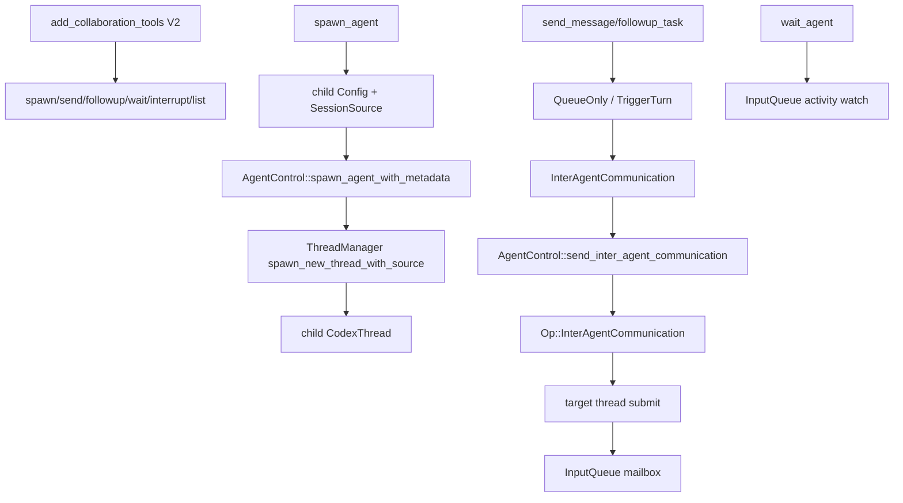

> MultiAgent V2 的 subagent trace 是一组 collaboration tools 调用共享 `AgentControl`：`spawn_agent` 创建新的 Codex thread，`send_message`/`followup_task` 投递 `Op::InterAgentCommunication`，`wait_agent` 等待 input queue activity。[E: codex-rs/core/src/tools/spec_plan.rs:795][E: codex-rs/core/src/tools/handlers/multi_agents_v2/spawn.rs:107][E: codex-rs/core/src/agent/control.rs:188][E: codex-rs/core/src/session/input_queue.rs:35][E: codex-rs/core/src/tools/handlers/multi_agents_v2/wait.rs:69]

## 能回答的问题

- MultiAgent V2 tools 如何在 `spec_plan.rs` 中注册？
- `spawn_agent` 创建的是 task 还是新的 Codex thread？
- `send_message` 与 `followup_task` 的源码差异是什么？
- inter-agent communication 如何进入目标 thread 的 SQ/input queue？
- `wait_agent` 等的是 message body 还是 activity signal？

## 端到端步骤

1. `add_collaboration_tools` 在 collab tools enabled 且 MultiAgent V2 enabled 时注册 `SpawnAgentHandlerV2`、`SendMessageHandlerV2`、`FollowupTaskHandlerV2`、`WaitAgentHandlerV2`、interrupt 和 list handlers。[E: codex-rs/core/src/tools/spec_plan.rs:792][E: codex-rs/core/src/tools/spec_plan.rs:794][E: codex-rs/core/src/tools/spec_plan.rs:795][E: codex-rs/core/src/tools/spec_plan.rs:808][E: codex-rs/core/src/tools/spec_plan.rs:822][E: codex-rs/core/src/tools/spec_plan.rs:826][E: codex-rs/core/src/tools/spec_plan.rs:831][E: codex-rs/core/src/tools/spec_plan.rs:837][E: codex-rs/core/src/tools/spec_plan.rs:841]
2. `spawn_agent` V2 handler 的 tool name 是 plain `spawn_agent`，spec 是 `create_spawn_agent_tool_v2`，handle path 是 `handle_spawn_agent`。[E: codex-rs/core/src/tools/handlers/multi_agents_v2/spawn.rs:25][E: codex-rs/core/src/tools/handlers/multi_agents_v2/spawn.rs:27][E: codex-rs/core/src/tools/handlers/multi_agents_v2/spawn.rs:30][E: codex-rs/core/src/tools/handlers/multi_agents_v2/spawn.rs:34]
3. `handle_spawn_agent` 解析 Function arguments 为 `SpawnAgentArgs`，字段包括 message、task_name、agent_type、model、reasoning_effort、service_tier、fork_turns 和 fork_context。[E: codex-rs/core/src/tools/handlers/multi_agents_v2/spawn.rs:49][E: codex-rs/core/src/tools/handlers/multi_agents_v2/spawn.rs:50][E: codex-rs/core/src/tools/handlers/multi_agents_v2/spawn.rs:187][E: codex-rs/core/src/tools/handlers/multi_agents_v2/spawn.rs:188]
4. spawn handler 从 parent turn 构建 child config，应用 model/reasoning/role/service-tier/runtime overrides，再用 `thread_spawn_source` 生成 subagent session source。[E: codex-rs/core/src/tools/handlers/multi_agents_v2/spawn.rs:62][E: codex-rs/core/src/tools/handlers/multi_agents_v2/spawn.rs:74][E: codex-rs/core/src/tools/handlers/multi_agents_v2/spawn.rs:82][E: codex-rs/core/src/tools/handlers/multi_agents_v2/spawn.rs:93][E: codex-rs/core/src/tools/handlers/multi_agents_v2/spawn.rs:95]
5. `thread_spawn_source` 用 parent thread id、parent agent path、depth、role 和 task_name 构造 `SessionSource::SubAgent(ThreadSpawn { ... })`。[E: codex-rs/core/src/tools/handlers/multi_agents_common.rs:137][E: codex-rs/core/src/tools/handlers/multi_agents_common.rs:144][E: codex-rs/core/src/tools/handlers/multi_agents_common.rs:154]
6. 对纯文本 initial operation，spawn handler 把 `Op::UserInput` 改写为 `Op::InterAgentCommunication`，并把 `spawn_source` 作为 child spawn metadata 传入 `spawn_agent_with_metadata`。[E: codex-rs/core/src/tools/handlers/multi_agents_v2/spawn.rs:107][E: codex-rs/core/src/tools/handlers/multi_agents_v2/spawn.rs:111][E: codex-rs/core/src/tools/handlers/multi_agents_v2/spawn.rs:121][E: codex-rs/core/src/tools/handlers/multi_agents_v2/spawn.rs:122][E: codex-rs/core/src/tools/handlers/multi_agents_v2/spawn.rs:126]
7. Protocol 的 `InterAgentCommunication` 包含 author、recipient、other_recipients、content、optional metadata/encrypted content 和 `trigger_turn`。[E: codex-rs/protocol/src/protocol.rs:728][E: codex-rs/protocol/src/protocol.rs:729][E: codex-rs/protocol/src/protocol.rs:731][E: codex-rs/protocol/src/protocol.rs:732][E: codex-rs/protocol/src/protocol.rs:735][E: codex-rs/protocol/src/protocol.rs:738][E: codex-rs/protocol/src/protocol.rs:739]
8. `AgentControl` 持有 weak ThreadManager state、agent registry、V2 residency 和 execution limiter。[E: codex-rs/core/src/agent/control.rs:93][E: codex-rs/core/src/agent/control.rs:100][E: codex-rs/core/src/agent/control.rs:101][E: codex-rs/core/src/agent/control.rs:102][E: codex-rs/core/src/agent/control.rs:103]
9. `spawn_agent_with_metadata` 进入 `spawn_agent_internal`；普通 V2 thread-spawn path 调 `ThreadManagerState::spawn_new_thread_with_source` 创建新 thread，而不是只创建一个 task。[E: codex-rs/core/src/agent/control/spawn.rs:106][E: codex-rs/core/src/agent/control/spawn.rs:197][E: codex-rs/core/src/agent/control/spawn.rs:280][E: codex-rs/core/src/agent/control/spawn.rs:281]
10. message tools 的 wrapper 差异只有 delivery mode：`send_message` 传 `QueueOnly`，`followup_task` 传 `TriggerTurn`；`MessageDeliveryMode::apply` 把该 mode 写进 `InterAgentCommunication.trigger_turn`。[E: codex-rs/core/src/tools/handlers/multi_agents_v2/send_message.rs:31][E: codex-rs/core/src/tools/handlers/multi_agents_v2/send_message.rs:33][E: codex-rs/core/src/tools/handlers/multi_agents_v2/followup_task.rs:31][E: codex-rs/core/src/tools/handlers/multi_agents_v2/followup_task.rs:33][E: codex-rs/core/src/tools/handlers/multi_agents_v2/message_tool.rs:12][E: codex-rs/core/src/tools/handlers/multi_agents_v2/message_tool.rs:19]
11. shared message flow 解析目标 agent、确保目标 loaded，构造 communication，然后调用 `AgentControl::send_inter_agent_communication`。[E: codex-rs/core/src/tools/handlers/multi_agents_v2/message_tool.rs:59][E: codex-rs/core/src/tools/handlers/multi_agents_v2/message_tool.rs:72][E: codex-rs/core/src/tools/handlers/multi_agents_v2/message_tool.rs:92][E: codex-rs/core/src/tools/handlers/multi_agents_v2/message_tool.rs:103][E: codex-rs/core/src/tools/handlers/multi_agents_v2/message_tool.rs:104]
12. `AgentControl::send_inter_agent_communication` 把 communication 包成 `Op::InterAgentCommunication`，检查 execution capacity，然后通过 `ThreadManagerState::send_op` 投递到目标 thread；`send_op` 最终调用 `thread.submit(op)`。[E: codex-rs/core/src/agent/control.rs:188][E: codex-rs/core/src/agent/control.rs:188][E: codex-rs/core/src/agent/control.rs:189][E: codex-rs/core/src/agent/control.rs:191][E: codex-rs/core/src/thread_manager.rs:1148][E: codex-rs/core/src/thread_manager.rs:1155]
13. 目标 session 的 `submission_loop` 在 `Op::InterAgentCommunication` 分支调用 handler；handler 把 communication enqueue 到 `InputQueue`，如果 `trigger_turn` 为 true 还会尝试启动 pending work turn。[E: codex-rs/core/src/session/handlers.rs:766][E: codex-rs/core/src/session/handlers.rs:767][E: codex-rs/core/src/session/handlers.rs:279][E: codex-rs/core/src/session/handlers.rs:285][E: codex-rs/core/src/session/handlers.rs:288]
14. `InputQueue` 用 `mailbox_pending_mails` 保存 communication，并用 watch channel 发 `InputQueueActivity::Mailbox`；drain 时把 mails 转成 `TurnInput::InterAgentCommunication`。[E: codex-rs/core/src/session/input_queue.rs:35][E: codex-rs/core/src/session/input_queue.rs:36][E: codex-rs/core/src/session/input_queue.rs:37][E: codex-rs/core/src/session/input_queue.rs:72][E: codex-rs/core/src/session/input_queue.rs:80][E: codex-rs/core/src/session/input_queue.rs:95][E: codex-rs/core/src/session/input_queue.rs:100]
15. `maybe_start_turn_for_pending_work_with_sub_id` 只在存在 `trigger_turn` mailbox item 且 session idle 时创建 synthetic regular turn。[E: codex-rs/core/src/tasks/mod.rs:469][E: codex-rs/core/src/tasks/mod.rs:473][E: codex-rs/core/src/tasks/mod.rs:477]
16. `wait_agent` 解析 timeout，订阅 input queue activity，发送 waiting begin event，等待 activity/deadline，再发送 waiting end event；返回值来自 wait outcome，不直接携带 mailbox body。[E: codex-rs/core/src/tools/handlers/multi_agents_v2/wait.rs:49][E: codex-rs/core/src/tools/handlers/multi_agents_v2/wait.rs:69][E: codex-rs/core/src/tools/handlers/multi_agents_v2/wait.rs:78][E: codex-rs/core/src/tools/handlers/multi_agents_v2/wait.rs:92][E: codex-rs/core/src/tools/handlers/multi_agents_v2/wait.rs:96]

## 关键决策点

- V2 child agent 是新的 Codex thread，使用 ThreadManager 创建和注册；它不是 parent turn 内的轻量 coroutine。[E: codex-rs/core/src/agent/control/spawn.rs:280][E: codex-rs/core/src/thread_manager.rs:1505][E: codex-rs/core/src/thread_manager.rs:1640][E: codex-rs/core/src/thread_manager.rs:1648][I]
- `send_message` 与 `followup_task` 共享 message flow；`followup_task` 使用 `TriggerTurn`，会把 `trigger_turn` 写为 true，并在 shared handler 中禁止 targeting root agent。[E: codex-rs/core/src/tools/handlers/multi_agents_v2/message_tool.rs:21][E: codex-rs/core/src/tools/handlers/multi_agents_v2/message_tool.rs:25][E: codex-rs/core/src/tools/handlers/multi_agents_v2/message_tool.rs:78][E: codex-rs/core/src/tools/handlers/multi_agents_v2/message_tool.rs:84]
- 当前 mailbox 机制落在 `session/input_queue.rs` 的 `InputQueue`，本 trace 以该路径为 evidence path。[E: codex-rs/core/src/session/input_queue.rs:35][I]

## 深挖入口

- `spine.sq-eq-architecture` 解释 target thread `submit(op)` 后如何进入 SQ。
- `tool.spawn-agent-v2`、`tool.send-message`、`tool.followup-task`、`tool.wait-agent-v2` 应列出各工具 schema 和 edge cases。

## Sources

- codex-rs/protocol/src/protocol.rs
- codex-rs/core/src/tools/spec_plan.rs
- codex-rs/core/src/tools/handlers/multi_agents_v2/spawn.rs
- codex-rs/core/src/tools/handlers/multi_agents_v2/send_message.rs
- codex-rs/core/src/tools/handlers/multi_agents_v2/followup_task.rs
- codex-rs/core/src/tools/handlers/multi_agents_v2/message_tool.rs
- codex-rs/core/src/tools/handlers/multi_agents_v2/wait.rs
- codex-rs/core/src/tools/handlers/multi_agents_common.rs
- codex-rs/core/src/agent/control.rs
- codex-rs/core/src/agent/control/spawn.rs
- codex-rs/core/src/thread_manager.rs
- codex-rs/core/src/session/handlers.rs
- codex-rs/core/src/session/input_queue.rs
- codex-rs/core/src/tasks/mod.rs

## 相关

- [工具调用解剖](tool-call-anatomy.md)
- [SQ/EQ 双队列架构](sq-eq-architecture.md)
- [spawn_agent V2 工具](../surface/tools/spawn-agent-v2.md)
- [send_message 工具](../surface/tools/send-message.md)
- [followup_task 工具](../surface/tools/followup-task.md)
- [wait_agent V2 工具](../surface/tools/wait-agent-v2.md)
