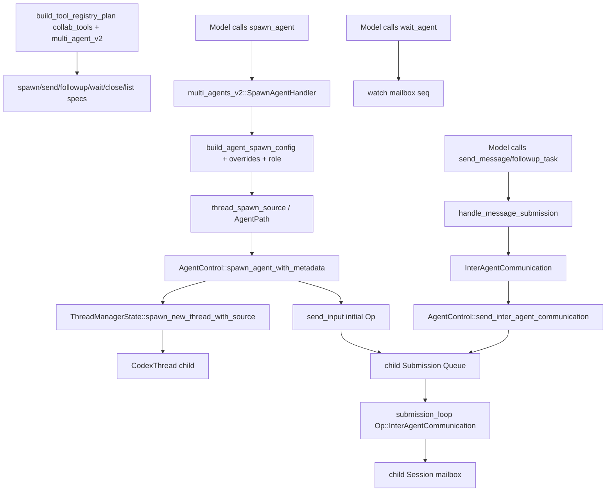

> subagent trace 展示 MultiAgent V2 的 control plane：tool schema 暴露 `spawn_agent/send_message/followup_task/wait_agent`，handler 调用共享 `AgentControl` 创建 thread、投递 `InterAgentCommunication`，mailbox watch 驱动 wait。[I]

## 能回答的问题

- `spawn_agent` V2 的输入字段和输出字段是什么？
- 子 agent thread 什么时候真正创建并进入 ThreadManager？
- `send_message` 和 `followup_task` 的差异是什么？
- `wait_agent` 等待的到底是 agent 输出还是 mailbox sequence？
- parent/child 之间消息如何转成 `Op::InterAgentCommunication`？

该 flowchart 是后续编号步骤的视觉索引；具体控制流事实以编号步骤中的源码证据为准。[I]

## 端到端步骤

1. `build_tool_registry_plan` 在 `config.collab_tools` 且 `config.multi_agent_v2` 时创建 V2 collab specs，并注册 `spawn_agent`、`send_message`、`followup_task`、`wait_agent`、`close_agent`、`list_agents` handlers。[E: codex-rs/tools/src/tool_registry_plan.rs:392][E: codex-rs/tools/src/tool_registry_plan.rs:393][E: codex-rs/tools/src/tool_registry_plan.rs:397][E: codex-rs/tools/src/tool_registry_plan.rs:408][E: codex-rs/tools/src/tool_registry_plan.rs:413][E: codex-rs/tools/src/tool_registry_plan.rs:418][E: codex-rs/tools/src/tool_registry_plan.rs:423][E: codex-rs/tools/src/tool_registry_plan.rs:428][E: codex-rs/tools/src/tool_registry_plan.rs:432][E: codex-rs/tools/src/tool_registry_plan.rs:433][E: codex-rs/tools/src/tool_registry_plan.rs:434][E: codex-rs/tools/src/tool_registry_plan.rs:435][E: codex-rs/tools/src/tool_registry_plan.rs:436][E: codex-rs/tools/src/tool_registry_plan.rs:437]
2. `create_spawn_agent_tool_v2` 要求 `task_name` 和 `message`，并可包含 `agent_type`、`model`、`reasoning_effort`、`fork_turns` 相关 common properties；输出 schema 包含 canonical `task_name`，可选显示 `nickname`。[E: codex-rs/tools/src/agent_tool.rs:53][E: codex-rs/tools/src/agent_tool.rs:56][E: codex-rs/tools/src/agent_tool.rs:68][E: codex-rs/tools/src/agent_tool.rs:79][E: codex-rs/tools/src/agent_tool.rs:333][E: codex-rs/tools/src/agent_tool.rs:351][E: codex-rs/tools/src/agent_tool.rs:355][E: codex-rs/tools/src/agent_tool.rs:546][E: codex-rs/tools/src/agent_tool.rs:549][E: codex-rs/tools/src/agent_tool.rs:553][E: codex-rs/tools/src/agent_tool.rs:557][E: codex-rs/tools/src/agent_tool.rs:564][E: codex-rs/tools/src/agent_tool.rs:570]
3. `create_send_message_tool` 要求 target/message，描述语义是发送字符串消息但不触发新 turn。[E: codex-rs/tools/src/agent_tool.rs:122][E: codex-rs/tools/src/agent_tool.rs:125][E: codex-rs/tools/src/agent_tool.rs:131][E: codex-rs/tools/src/agent_tool.rs:139][E: codex-rs/tools/src/agent_tool.rs:140][E: codex-rs/tools/src/agent_tool.rs:144][E: codex-rs/tools/src/agent_tool.rs:146][E: codex-rs/tools/src/agent_tool.rs:147]
4. `create_followup_task_tool` 要求 target/message，并可传 `interrupt`；description 明确它会触发目标 agent turn，`interrupt=true` 会立即 redirect work。[E: codex-rs/tools/src/agent_tool.rs:153][E: codex-rs/tools/src/agent_tool.rs:168][E: codex-rs/tools/src/agent_tool.rs:176][E: codex-rs/tools/src/agent_tool.rs:178][E: codex-rs/tools/src/agent_tool.rs:182]
5. `create_wait_agent_tool_v2` 暴露 `wait_agent`，输出 wait result schema；`WaitAgentTimeoutOptions` 定义 default/min/max timeout，并把这些数值写进 `timeout_ms` description。[E: codex-rs/tools/src/agent_tool.rs:21][E: codex-rs/tools/src/agent_tool.rs:23][E: codex-rs/tools/src/agent_tool.rs:24][E: codex-rs/tools/src/agent_tool.rs:25][E: codex-rs/tools/src/agent_tool.rs:217][E: codex-rs/tools/src/agent_tool.rs:219][E: codex-rs/tools/src/agent_tool.rs:225][E: codex-rs/tools/src/agent_tool.rs:749][E: codex-rs/tools/src/agent_tool.rs:750]
6. 生产符号 `multi_agents_v2::SpawnAgentHandler` re-export 到 `spawn::Handler`；它的 `handle` 解析 arguments、`SpawnAgentArgs` 和 fork mode；`fork_context` 在 V2 中被拒绝，`fork_turns` 支持 `none`、`all` 或正整数。[E: codex-rs/core/src/tools/handlers/multi_agents_v2.rs:34][E: codex-rs/core/src/tools/handlers/multi_agents_v2/spawn.rs:14][E: codex-rs/core/src/tools/handlers/multi_agents_v2/spawn.rs:27][E: codex-rs/core/src/tools/handlers/multi_agents_v2/spawn.rs:35][E: codex-rs/core/src/tools/handlers/multi_agents_v2/spawn.rs:36][E: codex-rs/core/src/tools/handlers/multi_agents_v2/spawn.rs:37][E: codex-rs/core/src/tools/handlers/multi_agents_v2/spawn.rs:241][E: codex-rs/core/src/tools/handlers/multi_agents_v2/spawn.rs:242][E: codex-rs/core/src/tools/handlers/multi_agents_v2/spawn.rs:243][E: codex-rs/core/src/tools/handlers/multi_agents_v2/spawn.rs:254][E: codex-rs/core/src/tools/handlers/multi_agents_v2/spawn.rs:257][E: codex-rs/core/src/tools/handlers/multi_agents_v2/spawn.rs:261][E: codex-rs/core/src/tools/handlers/multi_agents_v2/spawn.rs:266][E: codex-rs/core/src/tools/handlers/multi_agents_v2/spawn.rs:267][E: codex-rs/core/src/tools/handlers/multi_agents_v2/spawn.rs:272]
7. spawn handler 将 message 变成 initial operation，检查 child depth 不超过 `agent_max_depth`，然后发送 `CollabAgentSpawnBeginEvent`。[E: codex-rs/core/src/tools/handlers/multi_agents_v2/spawn.rs:44][E: codex-rs/core/src/tools/handlers/multi_agents_v2/spawn.rs:48][E: codex-rs/core/src/tools/handlers/multi_agents_v2/spawn.rs:49][E: codex-rs/core/src/tools/handlers/multi_agents_v2/spawn.rs:50][E: codex-rs/core/src/tools/handlers/multi_agents_v2/spawn.rs:58]
8. child config 从 parent turn 构建：`build_agent_spawn_config` 复制 base instructions，`apply_spawn_agent_runtime_overrides` 复制 approval policy、shell env、cwd、sandbox policy、filesystem/network sandbox。[E: codex-rs/core/src/tools/handlers/multi_agents_common.rs:203][E: codex-rs/core/src/tools/handlers/multi_agents_common.rs:208][E: codex-rs/core/src/tools/handlers/multi_agents_common.rs:256][E: codex-rs/core/src/tools/handlers/multi_agents_common.rs:261][E: codex-rs/core/src/tools/handlers/multi_agents_common.rs:262][E: codex-rs/core/src/tools/handlers/multi_agents_common.rs:263][E: codex-rs/core/src/tools/handlers/multi_agents_common.rs:267][E: codex-rs/core/src/tools/handlers/multi_agents_common.rs:269][E: codex-rs/core/src/tools/handlers/multi_agents_common.rs:273][E: codex-rs/core/src/tools/handlers/multi_agents_common.rs:277][E: codex-rs/core/src/tools/handlers/multi_agents_common.rs:278]
9. spawn handler 应用 requested model/reasoning/role overrides、runtime overrides 和 spawn overrides，并把 `SpawnAgentInstructions` 追加进 child developer instructions。[E: codex-rs/core/src/tools/handlers/multi_agents_v2/spawn.rs:77][E: codex-rs/core/src/tools/handlers/multi_agents_v2/spawn.rs:85][E: codex-rs/core/src/tools/handlers/multi_agents_v2/spawn.rs:89][E: codex-rs/core/src/tools/handlers/multi_agents_v2/spawn.rs:90][E: codex-rs/core/src/tools/handlers/multi_agents_v2/spawn.rs:91][E: codex-rs/core/src/tools/handlers/multi_agents_v2/spawn.rs:97]
10. `thread_spawn_source` 用 parent thread id、parent source-derived agent path、child depth、agent role 和 task_name 生成 `SessionSource::SubAgent(ThreadSpawn { ... agent_path ... })`。[E: codex-rs/core/src/tools/handlers/multi_agents_common.rs:136][E: codex-rs/core/src/tools/handlers/multi_agents_common.rs:143][E: codex-rs/core/src/tools/handlers/multi_agents_common.rs:147][E: codex-rs/core/src/tools/handlers/multi_agents_common.rs:153][E: codex-rs/core/src/tools/handlers/multi_agents_common.rs:154][E: codex-rs/core/src/tools/handlers/multi_agents_common.rs:155][E: codex-rs/core/src/tools/handlers/multi_agents_common.rs:156][E: codex-rs/core/src/tools/handlers/multi_agents_common.rs:158]
11. 对纯文本 initial operation，spawn handler 会把 `Op::UserInput` 改写成 `Op::InterAgentCommunication`，recipient 是新 agent path，`trigger_turn` 为 true。[E: codex-rs/core/src/tools/handlers/multi_agents_v2/spawn.rs:116][E: codex-rs/core/src/tools/handlers/multi_agents_v2/spawn.rs:117][E: codex-rs/core/src/tools/handlers/multi_agents_v2/spawn.rs:120][E: codex-rs/core/src/tools/handlers/multi_agents_v2/spawn.rs:122][E: codex-rs/core/src/tools/handlers/multi_agents_v2/spawn.rs:127][E: codex-rs/core/src/tools/handlers/multi_agents_v2/spawn.rs:130]
12. `InterAgentCommunication` 的协议字段是 author、recipient、other_recipients、content、trigger_turn。[E: codex-rs/protocol/src/protocol.rs:740][E: codex-rs/protocol/src/protocol.rs:741][E: codex-rs/protocol/src/protocol.rs:742][E: codex-rs/protocol/src/protocol.rs:744][E: codex-rs/protocol/src/protocol.rs:745][E: codex-rs/protocol/src/protocol.rs:746]
13. `AgentControl::spawn_agent_with_metadata` 调用 `spawn_agent_internal`；它保留 spawn slot，准备 session source/metadata，然后通过 `ThreadManagerState::spawn_new_thread_with_source` 或 fork path 创建新 thread；fork helper 最终也进入 `spawn_thread_with_source`。[E: codex-rs/core/src/agent/control.rs:178][E: codex-rs/core/src/agent/control.rs:185][E: codex-rs/core/src/agent/control.rs:197][E: codex-rs/core/src/agent/control.rs:204][E: codex-rs/core/src/agent/control.rs:212][E: codex-rs/core/src/agent/control.rs:230][E: codex-rs/core/src/agent/control.rs:242][E: codex-rs/core/src/agent/control.rs:400][E: codex-rs/core/src/agent/control.rs:401][E: codex-rs/core/src/thread_manager.rs:849][E: codex-rs/core/src/thread_manager.rs:859][E: codex-rs/core/src/thread_manager.rs:908][E: codex-rs/core/src/thread_manager.rs:961]
14. spawn 后，AgentControl commit metadata，notify thread created，持久化 spawn edge，并用 `send_input(new_thread.thread_id, initial_operation)` 把初始 op 投递到 child thread；ThreadManager spawn path 会用 `Codex::spawn` 创建 `CodexThread` 并登记到 thread map。[E: codex-rs/core/src/agent/control.rs:255][E: codex-rs/core/src/agent/control.rs:256][E: codex-rs/core/src/agent/control.rs:304][E: codex-rs/core/src/agent/control.rs:306][E: codex-rs/core/src/agent/control.rs:313][E: codex-rs/core/src/thread_manager.rs:937][E: codex-rs/core/src/thread_manager.rs:982][E: codex-rs/core/src/thread_manager.rs:987][E: codex-rs/core/src/thread_manager.rs:988]
15. `AgentControl::send_input` 调用 `ThreadManagerState::send_op(agent_id, initial_operation)`，`send_op` 取出目标 thread 并调用 `thread.submit(op).await`，成功后更新 last task message。[E: codex-rs/core/src/agent/control.rs:590][E: codex-rs/core/src/agent/control.rs:597][E: codex-rs/core/src/agent/control.rs:601][E: codex-rs/core/src/agent/control.rs:604][E: codex-rs/core/src/agent/control.rs:606][E: codex-rs/core/src/thread_manager.rs:749][E: codex-rs/core/src/thread_manager.rs:750][E: codex-rs/core/src/thread_manager.rs:756]
16. spawn handler 发送 `CollabAgentSpawnEndEvent`，并返回 `SpawnAgentResult`；当 `hide_spawn_agent_metadata` 为 false 时返回 `task_name` 和 `nickname`。[E: codex-rs/core/src/tools/handlers/multi_agents_v2/spawn.rs:185][E: codex-rs/core/src/tools/handlers/multi_agents_v2/spawn.rs:188][E: codex-rs/core/src/tools/handlers/multi_agents_v2/spawn.rs:215][E: codex-rs/core/src/tools/handlers/multi_agents_v2/spawn.rs:219]
17. `send_message` wrapper 把 mode 设为 `MessageDeliveryMode::QueueOnly`，`followup_task` wrapper 把 mode 设为 `MessageDeliveryMode::TriggerTurn`；两者共用 `handle_message_string_tool`，mode 最终把 `trigger_turn` 写成 false 或 true。[E: codex-rs/core/src/tools/handlers/multi_agents_v2/send_message.rs:23][E: codex-rs/core/src/tools/handlers/multi_agents_v2/send_message.rs:25][E: codex-rs/core/src/tools/handlers/multi_agents_v2/followup_task.rs:23][E: codex-rs/core/src/tools/handlers/multi_agents_v2/followup_task.rs:25][E: codex-rs/core/src/tools/handlers/multi_agents_v2/message_tool.rs:20][E: codex-rs/core/src/tools/handlers/multi_agents_v2/message_tool.rs:24][E: codex-rs/core/src/tools/handlers/multi_agents_v2/message_tool.rs:60]
18. message submission 解析目标 agent，followup 对 root agent 会被拒绝；`interrupt=true` 会先调用 `agent_control.interrupt_agent(receiver_thread_id)`。[E: codex-rs/core/src/tools/handlers/multi_agents_v2/message_tool.rs:90][E: codex-rs/core/src/tools/handlers/multi_agents_v2/message_tool.rs:96][E: codex-rs/core/src/tools/handlers/multi_agents_v2/message_tool.rs:97][E: codex-rs/core/src/tools/handlers/multi_agents_v2/message_tool.rs:98][E: codex-rs/core/src/tools/handlers/multi_agents_v2/message_tool.rs:100][E: codex-rs/core/src/tools/handlers/multi_agents_v2/message_tool.rs:102][E: codex-rs/core/src/tools/handlers/multi_agents_v2/message_tool.rs:106][E: codex-rs/core/src/tools/handlers/multi_agents_v2/message_tool.rs:110]
19. message submission 发送 begin/end interaction events，并通过 `AgentControl::send_inter_agent_communication` 投递 `Op::InterAgentCommunication` 到目标 thread。[E: codex-rs/core/src/tools/handlers/multi_agents_v2/message_tool.rs:114][E: codex-rs/core/src/tools/handlers/multi_agents_v2/message_tool.rs:117][E: codex-rs/core/src/tools/handlers/multi_agents_v2/message_tool.rs:141][E: codex-rs/core/src/tools/handlers/multi_agents_v2/message_tool.rs:149][E: codex-rs/core/src/tools/handlers/multi_agents_v2/message_tool.rs:152][E: codex-rs/core/src/agent/control.rs:627][E: codex-rs/core/src/agent/control.rs:639]
20. `Mailbox` 用 unbounded mpsc 保存 `InterAgentCommunication`，receiver 侧用 `pending_mails` 缓存未消费消息，并用 watch channel sequence 通知等待者；`Mailbox::send` 递增 seq、发送 communication、`send_replace(seq)`。[E: codex-rs/core/src/agent/mailbox.rs:12][E: codex-rs/core/src/agent/mailbox.rs:18][E: codex-rs/core/src/agent/mailbox.rs:19][E: codex-rs/core/src/agent/mailbox.rs:24][E: codex-rs/core/src/agent/mailbox.rs:25][E: codex-rs/core/src/agent/mailbox.rs:43][E: codex-rs/core/src/agent/mailbox.rs:44][E: codex-rs/core/src/agent/mailbox.rs:45][E: codex-rs/core/src/agent/mailbox.rs:46]
21. `wait_agent` handler 订阅 mailbox seq，发送 waiting begin event，等待 `wait_for_mailbox_change` 到 deadline，再发送 waiting end event；返回值只有 timed_out/message，不包含 mailbox 内容。[E: codex-rs/core/src/tools/handlers/multi_agents_v2/wait.rs:40][E: codex-rs/core/src/tools/handlers/multi_agents_v2/wait.rs:45][E: codex-rs/core/src/tools/handlers/multi_agents_v2/wait.rs:55][E: codex-rs/core/src/tools/handlers/multi_agents_v2/wait.rs:56][E: codex-rs/core/src/tools/handlers/multi_agents_v2/wait.rs:62][E: codex-rs/core/src/tools/handlers/multi_agents_v2/wait.rs:83][E: codex-rs/core/src/tools/handlers/multi_agents_v2/wait.rs:84][E: codex-rs/core/src/tools/handlers/multi_agents_v2/wait.rs:85]
22. `Op::InterAgentCommunication` 在 `submission_loop` 中进入 `inter_agent_communication`；写入通过 `Session::enqueue_mailbox_communication -> Mailbox::send` 完成；`get_pending_input` 会 drain mailbox 并转成 response input item，turn stream 的 mailbox preemption 会设置 `needs_follow_up: true`，后续 pending-input drain 消费 mailbox。[E: codex-rs/core/src/session/handlers.rs:1102][E: codex-rs/core/src/session/handlers.rs:1103][E: codex-rs/core/src/session/handlers.rs:273][E: codex-rs/core/src/session/handlers.rs:274][E: codex-rs/core/src/session/mod.rs:2971][E: codex-rs/core/src/session/mod.rs:2972][E: codex-rs/core/src/agent/mailbox.rs:43][E: codex-rs/core/src/agent/mailbox.rs:45][E: codex-rs/core/src/agent/mailbox.rs:46][E: codex-rs/core/src/session/mod.rs:3017][E: codex-rs/core/src/session/mod.rs:3019][E: codex-rs/core/src/session/mod.rs:3021][E: codex-rs/core/src/session/turn.rs:387][E: codex-rs/core/src/session/turn.rs:388][E: codex-rs/core/src/session/turn.rs:464][E: codex-rs/core/src/session/turn.rs:470][E: codex-rs/core/src/session/turn.rs:2020][E: codex-rs/core/src/session/turn.rs:2022][E: codex-rs/core/src/tasks/mod.rs:272][E: codex-rs/core/src/tasks/mod.rs:273][E: codex-rs/core/src/tasks/mod.rs:286][E: codex-rs/core/src/tasks/mod.rs:287]

## 关键设计点

- MultiAgent V2 的 `send_message` 是 queue-only，`followup_task` 是 trigger-turn；两者共享 message submission 代码，区别由 wrapper 传入的 `MessageDeliveryMode` 写入 `InterAgentCommunication.trigger_turn`。[E: codex-rs/tools/src/agent_tool.rs:140][E: codex-rs/tools/src/agent_tool.rs:178][E: codex-rs/core/src/tools/handlers/multi_agents_v2/send_message.rs:25][E: codex-rs/core/src/tools/handlers/multi_agents_v2/followup_task.rs:25][E: codex-rs/core/src/tools/handlers/multi_agents_v2/message_tool.rs:20][E: codex-rs/core/src/tools/handlers/multi_agents_v2/message_tool.rs:24]
- child agent 不是轻量 task，而是新的 Codex thread；AgentControl 通过 ThreadManager 创建 thread，再把 initial operation 交给目标 thread 的 `submit` path；进入 child SQ 是结合 `spine.sq-eq-architecture` 的推断。[E: codex-rs/core/src/agent/control.rs:242][E: codex-rs/core/src/thread_manager.rs:937][E: codex-rs/core/src/thread_manager.rs:982][E: codex-rs/core/src/thread_manager.rs:988][E: codex-rs/core/src/agent/control.rs:313][E: codex-rs/core/src/thread_manager.rs:749][E: codex-rs/core/src/thread_manager.rs:756][I]
- V2 wait 不读取 agent message content，只等待 mailbox sequence 改变；内容消费由 session 的 pending-input drain 路径完成。[E: codex-rs/core/src/tools/handlers/multi_agents_v2/wait.rs:40][E: codex-rs/core/src/tools/handlers/multi_agents_v2/wait.rs:56][E: codex-rs/core/src/tools/handlers/multi_agents_v2/wait.rs:83][E: codex-rs/core/src/session/mod.rs:3017][E: codex-rs/core/src/session/mod.rs:3021]
- `AgentControl` 持有共享 state，并把同一个 control handle clone 传给 child spawn path；“root thread tree scoped registry”是对这些共享 handle 的归纳。[E: codex-rs/core/src/agent/control.rs:133][E: codex-rs/core/src/agent/control.rs:138][E: codex-rs/core/src/agent/control.rs:244][E: codex-rs/core/src/agent/control.rs:256][I]

## 深挖入口

- `spine.sq-eq-architecture` 解释 child thread 的 SQ/EQ 与 parent thread 的关系。
- `tool.spawn-agent-v2` 应列出 spawn_agent V2 的完整 schema、fork_turns 语义、输出 schema。
- `tool.wait-agent-v2` 应列出 timeout clamp、waiting events 和返回字段。

## Sources

- codex-rs/tools/src/agent_tool.rs
- codex-rs/tools/src/tool_registry_plan.rs
- codex-rs/core/src/tools/handlers/multi_agents_v2.rs
- codex-rs/core/src/tools/handlers/multi_agents_v2/spawn.rs
- codex-rs/core/src/tools/handlers/multi_agents_v2/send_message.rs
- codex-rs/core/src/tools/handlers/multi_agents_v2/followup_task.rs
- codex-rs/core/src/tools/handlers/multi_agents_v2/message_tool.rs
- codex-rs/core/src/tools/handlers/multi_agents_v2/wait.rs
- codex-rs/core/src/tools/handlers/multi_agents_common.rs
- codex-rs/core/src/agent/control.rs
- codex-rs/core/src/agent/mailbox.rs
- codex-rs/core/src/session/handlers.rs
- codex-rs/core/src/session/mod.rs
- codex-rs/core/src/session/turn.rs
- codex-rs/core/src/tasks/mod.rs
- codex-rs/core/src/thread_manager.rs
- codex-rs/protocol/src/protocol.rs

## 相关

- [工具调用解剖](tool-call-anatomy.md)
- [SQ/EQ 双队列架构](sq-eq-architecture.md)
- [spawn_agent V2 工具](../surface/tools/spawn-agent-v2.md)
- [send_message 工具](../surface/tools/send-message.md)
- [followup_task 工具](../surface/tools/followup-task.md)
- [wait_agent V2 工具](../surface/tools/wait-agent-v2.md)
