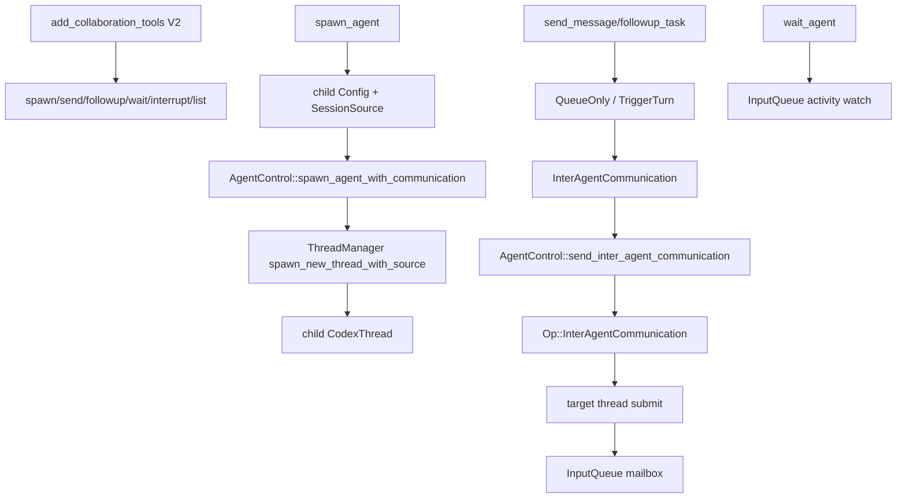

> MultiAgent V2 的 subagent trace 是一组 collaboration tools 调用共享 `AgentControl`：`spawn_agent` 创建新的 Codex thread（默认继承完整 history），`send_message`/`followup_task` 投递 `Op::InterAgentCommunication`，`wait_agent` 等待 input queue activity。[E: codex-rs/core/src/tools/spec_plan.rs:789][E: codex-rs/core/src/tools/handlers/multi_agents_v2/spawn.rs:108][E: codex-rs/core/src/tools/handlers/multi_agents_v2/spawn.rs:194][E: codex-rs/core/src/agent/control.rs:188][E: codex-rs/core/src/session/input_queue.rs:35][E: codex-rs/core/src/tools/handlers/multi_agents_v2/wait.rs:68]

## 能回答的问题

- MultiAgent V2 tools 如何在 `spec_plan.rs` 中注册？
- `spawn_agent` 创建的是 task 还是新的 Codex thread？
- `send_message` 与 `followup_task` 的源码差异是什么？
- inter-agent communication 如何进入目标 thread 的 SQ/input queue？
- `wait_agent` 等的是 message body 还是 activity signal？

```mermaid
flowchart TD
    SPEC["add_collaboration_tools V2"] --> TOOLS["spawn/send/followup/wait/interrupt/list"]
    SPAWN["spawn_agent"] --> CONFIG["child Config + SessionSource"]
    CONFIG --> CONTROL["AgentControl::spawn_agent_with_communication"]
    CONTROL --> THREAD["ThreadManager spawn_new_thread_with_source"]
    THREAD --> CHILD["child CodexThread"]
    MSG["send_message/followup_task"] --> MODE["QueueOnly / TriggerTurn"]
    MODE --> IAC["InterAgentCommunication"]
    IAC --> SEND["AgentControl::send_inter_agent_communication"]
    SEND --> OP["Op::InterAgentCommunication"]
    OP --> TARGET["target thread submit"]
    TARGET --> QUEUE["InputQueue mailbox"]
    WAIT["wait_agent"] --> ACTIVITY["InputQueue activity watch"]
```

## 端到端步骤

1. `add_collaboration_tools` 在 collab tools enabled 且 MultiAgent V2 enabled 时注册 `SpawnAgentHandlerV2`、`SendMessageHandlerV2`、`FollowupTaskHandlerV2`、`WaitAgentHandlerV2`、interrupt 和 list handlers。[E: codex-rs/core/src/tools/spec_plan.rs:786][E: codex-rs/core/src/tools/spec_plan.rs:788][E: codex-rs/core/src/tools/spec_plan.rs:789][E: codex-rs/core/src/tools/spec_plan.rs:804][E: codex-rs/core/src/tools/spec_plan.rs:821][E: codex-rs/core/src/tools/spec_plan.rs:825][E: codex-rs/core/src/tools/spec_plan.rs:830][E: codex-rs/core/src/tools/spec_plan.rs:836][E: codex-rs/core/src/tools/spec_plan.rs:840]
2. `spawn_agent` V2 handler 的 tool name 是 plain `spawn_agent`，spec 是 `create_spawn_agent_tool_v2`，handle path 是 `handle_spawn_agent`。[E: codex-rs/core/src/tools/handlers/multi_agents_v2/spawn.rs:25][E: codex-rs/core/src/tools/handlers/multi_agents_v2/spawn.rs:27][E: codex-rs/core/src/tools/handlers/multi_agents_v2/spawn.rs:30][E: codex-rs/core/src/tools/handlers/multi_agents_v2/spawn.rs:34]
3. `handle_spawn_agent` 解析 Function arguments 为 `SpawnAgentArgs`。`fork_turns` 接受 `none`、`all` 或 positive integer string，缺省为 `all`；legacy `fork_context` 在 V2 明确报错。full-history fork 禁止同时覆盖 agent type。[E: codex-rs/core/src/tools/handlers/multi_agents_v2/spawn.rs:49][E: codex-rs/core/src/tools/handlers/multi_agents_v2/spawn.rs:175][E: codex-rs/core/src/tools/handlers/multi_agents_v2/spawn.rs:188][E: codex-rs/core/src/tools/handlers/multi_agents_v2/spawn.rs:194][E: codex-rs/core/src/tools/handlers/multi_agents_v2/spawn.rs:201][E: codex-rs/core/src/tools/handlers/multi_agents_v2/spawn.rs:208]
4. spawn handler 从 parent turn 构建 child config，应用 model/reasoning/role/service-tier/runtime overrides，再用 `thread_spawn_source` 生成 subagent session source。[E: codex-rs/core/src/tools/handlers/multi_agents_v2/spawn.rs:61][E: codex-rs/core/src/tools/handlers/multi_agents_v2/spawn.rs:70][E: codex-rs/core/src/tools/handlers/multi_agents_v2/spawn.rs:82][E: codex-rs/core/src/tools/handlers/multi_agents_v2/spawn.rs:88][E: codex-rs/core/src/tools/handlers/multi_agents_v2/spawn.rs:90]
5. `thread_spawn_source` 用 parent thread id、parent agent path、depth、role 和 task_name 构造 `SessionSource::SubAgent(ThreadSpawn { ... })`。[E: codex-rs/core/src/tools/handlers/multi_agents_common.rs:107][E: codex-rs/core/src/tools/handlers/multi_agents_common.rs:114][E: codex-rs/core/src/tools/handlers/multi_agents_common.rs:124]
6. handler 把 initial text 变成 typed `InterAgentCommunication`，并连同 `AgentCommunicationContext::Spawn`、`spawn_source` 与 fork options 传入 `spawn_agent_with_communication`。[E: codex-rs/core/src/tools/handlers/multi_agents_v2/spawn.rs:95][E: codex-rs/core/src/tools/handlers/multi_agents_v2/spawn.rs:98][E: codex-rs/core/src/tools/handlers/multi_agents_v2/spawn.rs:100][E: codex-rs/core/src/tools/handlers/multi_agents_v2/spawn.rs:106][E: codex-rs/core/src/tools/handlers/multi_agents_v2/spawn.rs:114]
7. Protocol 的 `InterAgentCommunication` 包含 author、recipient、other_recipients、content、optional metadata/encrypted content 和 `trigger_turn`。[E: codex-rs/protocol/src/protocol.rs:741][E: codex-rs/protocol/src/protocol.rs:742][E: codex-rs/protocol/src/protocol.rs:744][E: codex-rs/protocol/src/protocol.rs:745][E: codex-rs/protocol/src/protocol.rs:748][E: codex-rs/protocol/src/protocol.rs:751][E: codex-rs/protocol/src/protocol.rs:752]
8. `AgentControl` 持有 weak ThreadManager state、agent registry、V2 residency 和 execution limiter。[E: codex-rs/core/src/agent/control.rs:95][E: codex-rs/core/src/agent/control.rs:102][E: codex-rs/core/src/agent/control.rs:103][E: codex-rs/core/src/agent/control.rs:104][E: codex-rs/core/src/agent/control.rs:105]
9. `spawn_agent_with_communication` 进入 `spawn_agent_internal`。`fork_turns=none` 走 `spawn_new_thread_with_source`；其余模式先 flush parent、加载 parent model context，并按 all / last-N 截取后走 `fork_thread_with_source`。若 parent 是 paginated history，child 也使用 paginated mode，并过滤只为 legacy event history 服务的投影事件。[E: codex-rs/core/src/agent/control/spawn.rs:254][E: codex-rs/core/src/agent/control/spawn.rs:397][E: codex-rs/core/src/agent/control/spawn.rs:449][E: codex-rs/core/src/agent/control/spawn.rs:612][E: codex-rs/core/src/agent/control/spawn.rs:635][E: codex-rs/core/src/agent/control/spawn.rs:680][E: codex-rs/core/src/agent/control/spawn.rs:723]
10. message tools 的 wrapper 差异只有 delivery mode：`send_message` 传 `QueueOnly`，`followup_task` 传 `TriggerTurn`；`MessageDeliveryMode::apply` 把该 mode 写进 `InterAgentCommunication.trigger_turn`。[E: codex-rs/core/src/tools/handlers/multi_agents_v2/send_message.rs:31][E: codex-rs/core/src/tools/handlers/multi_agents_v2/send_message.rs:33][E: codex-rs/core/src/tools/handlers/multi_agents_v2/followup_task.rs:31][E: codex-rs/core/src/tools/handlers/multi_agents_v2/followup_task.rs:33][E: codex-rs/core/src/tools/handlers/multi_agents_v2/message_tool.rs:13][E: codex-rs/core/src/tools/handlers/multi_agents_v2/message_tool.rs:20]
11. shared message flow 解析目标 agent、确保目标 loaded，构造 communication，然后调用 `AgentControl::send_inter_agent_communication`。[E: codex-rs/core/src/tools/handlers/multi_agents_v2/message_tool.rs:60][E: codex-rs/core/src/tools/handlers/multi_agents_v2/message_tool.rs:73][E: codex-rs/core/src/tools/handlers/multi_agents_v2/message_tool.rs:93][E: codex-rs/core/src/tools/handlers/multi_agents_v2/message_tool.rs:104][E: codex-rs/core/src/tools/handlers/multi_agents_v2/message_tool.rs:110]
12. `AgentControl::send_inter_agent_communication` 把 communication 包成 `Op::InterAgentCommunication`，检查 execution capacity，然后通过 `ThreadManagerState::send_op` 投递到目标 thread；`send_op` 最终调用 `thread.submit(op)`。[E: codex-rs/core/src/agent/control.rs:188][E: codex-rs/core/src/agent/control.rs:188][E: codex-rs/core/src/agent/control.rs:189][E: codex-rs/core/src/agent/control.rs:191][E: codex-rs/core/src/thread_manager.rs:1210][E: codex-rs/core/src/thread_manager.rs:1217]
    send/receive 两端还用 shared communication id 发 `codex.agent_communication` tracing event；context 区分 spawn/message/followup/result，并保留 sender/receiver thread ids。[E: codex-rs/core/src/agent_communication.rs:6][E: codex-rs/core/src/agent_communication.rs:9][E: codex-rs/core/src/agent_communication.rs:37][E: codex-rs/core/src/agent_communication.rs:63]
13. 目标 session 的 `submission_loop` 在 `Op::InterAgentCommunication` 分支调用 handler；handler 把 communication enqueue 到 `InputQueue`，如果 `trigger_turn` 为 true 还会尝试启动 pending work turn。[E: codex-rs/core/src/session/handlers.rs:774][E: codex-rs/core/src/session/handlers.rs:775][E: codex-rs/core/src/session/handlers.rs:288][E: codex-rs/core/src/session/handlers.rs:294][E: codex-rs/core/src/session/handlers.rs:298]
14. `InputQueue` 用 `mailbox_pending_mails` 保存 communication，并用 watch channel 发 `InputQueueActivity::Mailbox`；drain 时把 mails 转成 `TurnInput::InterAgentCommunication`。[E: codex-rs/core/src/session/input_queue.rs:35][E: codex-rs/core/src/session/input_queue.rs:36][E: codex-rs/core/src/session/input_queue.rs:37][E: codex-rs/core/src/session/input_queue.rs:72][E: codex-rs/core/src/session/input_queue.rs:80][E: codex-rs/core/src/session/input_queue.rs:95][E: codex-rs/core/src/session/input_queue.rs:100]
15. `maybe_start_turn_for_pending_work_with_sub_id` 只在存在 `trigger_turn` mailbox item 且 session idle 时创建 synthetic regular turn。[E: codex-rs/core/src/tasks/mod.rs:474][E: codex-rs/core/src/tasks/mod.rs:478][E: codex-rs/core/src/tasks/mod.rs:482]
16. `wait_agent` 解析 timeout，订阅 input queue activity，发送 waiting begin event，等待 activity/deadline，再发送 waiting end event；返回值来自 wait outcome，不直接携带 mailbox body。[E: codex-rs/core/src/tools/handlers/multi_agents_v2/wait.rs:48][E: codex-rs/core/src/tools/handlers/multi_agents_v2/wait.rs:68][E: codex-rs/core/src/tools/handlers/multi_agents_v2/wait.rs:77][E: codex-rs/core/src/tools/handlers/multi_agents_v2/wait.rs:95][E: codex-rs/core/src/tools/handlers/multi_agents_v2/wait.rs:99]

## 关键决策点

- V2 child agent 是新的 Codex thread，使用 ThreadManager 创建和注册；它不是 parent turn 内的轻量 coroutine。[E: codex-rs/core/src/agent/control/spawn.rs:448][E: codex-rs/core/src/thread_manager.rs:1584][E: codex-rs/core/src/thread_manager.rs:1718][E: codex-rs/core/src/thread_manager.rs:1727][I]
- `fork_turns` 默认不是空上下文，而是 `all`；需要 clean-context child 时必须显式传 `none`。full-history fork 会保留 reference context，last-N 则只截取最近 N 个 user turns。[E: codex-rs/core/src/tools/handlers/multi_agents_v2/spawn.rs:194][E: codex-rs/core/src/tools/handlers/multi_agents_v2/spawn.rs:201][E: codex-rs/core/src/agent/control/spawn.rs:635][E: codex-rs/core/src/agent/control/spawn.rs:660]
- `send_message` 与 `followup_task` 共享 message flow；`followup_task` 使用 `TriggerTurn`，会把 `trigger_turn` 写为 true，并在 shared handler 中禁止 targeting root agent。[E: codex-rs/core/src/tools/handlers/multi_agents_v2/message_tool.rs:22][E: codex-rs/core/src/tools/handlers/multi_agents_v2/message_tool.rs:26][E: codex-rs/core/src/tools/handlers/multi_agents_v2/message_tool.rs:79][E: codex-rs/core/src/tools/handlers/multi_agents_v2/message_tool.rs:85]
- 当前 mailbox 机制落在 `session/input_queue.rs` 的 `InputQueue`，本 trace 以该路径为 evidence path。[E: codex-rs/core/src/session/input_queue.rs:35][I]

## 深挖入口

- `spine.sq-eq-architecture` 解释 target thread `submit(op)` 后如何进入 SQ。
- `tool.spawn-agent-v2`、`tool.send-message`、`tool.followup-task`、`tool.wait-agent-v2` 应列出各工具 schema 和 edge cases。

## Sources

- codex-rs/protocol/src/protocol.rs
- codex-rs/core/src/agent_communication.rs
- codex-rs/core/src/tools/spec_plan.rs
- codex-rs/core/src/tools/handlers/multi_agents_v2/spawn.rs
- codex-rs/core/src/tools/handlers/multi_agents_v2/send_message.rs
- codex-rs/core/src/tools/handlers/multi_agents_v2/followup_task.rs
- codex-rs/core/src/tools/handlers/multi_agents_v2/message_tool.rs
- codex-rs/core/src/tools/handlers/multi_agents_v2/wait.rs
- codex-rs/core/src/tools/handlers/multi_agents_common.rs
- codex-rs/core/src/agent/control.rs
- codex-rs/core/src/agent/control/spawn.rs
- codex-rs/core/src/thread_manager.rs
- codex-rs/core/src/session/handlers.rs
- codex-rs/core/src/session/input_queue.rs
- codex-rs/core/src/tasks/mod.rs

## 相关

- [工具调用解剖](tool-call-anatomy.md)
- [SQ/EQ 双队列架构](sq-eq-architecture.md)
- [spawn_agent V2 工具](../surface/tools/spawn-agent-v2.md)
- [send_message 工具](../surface/tools/send-message.md)
- [followup_task 工具](../surface/tools/followup-task.md)
- [wait_agent V2 工具](../surface/tools/wait-agent-v2.md)
