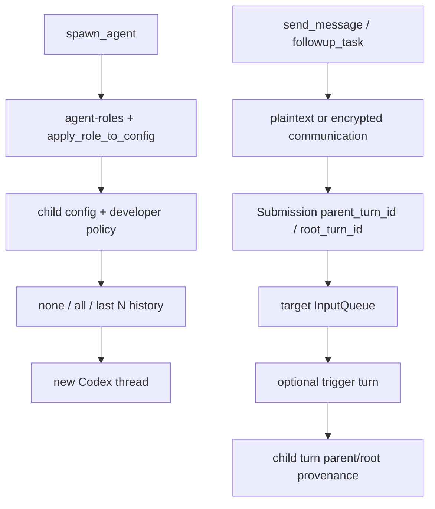

> MultiAgent V2 的关键变化不只在 tool schema：spawn 继承当前 environment selections 与 parent/root turn provenance，并可经 `agent-roles` crate 收紧 child config；direct collaboration tool arguments 以 plaintext assistant-role envelope 进入目标上下文。V2 usage hint / mode policy 优先读 model catalog 的 `model_messages.multi_agent`，再回落到 config 或 bundled 文本。fork/compaction 还会专门清理旧 AgentMessage。[E: codex-rs/core/src/tools/handlers/multi_agents_v2/spawn.rs:216][E: codex-rs/core/src/session/multi_agents.rs:67][E: codex-rs/core/src/agent/control/spawn.rs:949][E: codex-rs/core/src/compact_remote_v2.rs:76]

```mermaid
flowchart TD
    SPAWN["spawn_agent"] --> ROLE["agent-roles + apply_role_to_config"]
    ROLE --> CONFIG["child config + developer policy"]
    CONFIG --> FORK["none / all / last N history"]
    FORK --> CHILD["new Codex thread"]
    MESSAGE["send_message / followup_task"] --> SOURCE["plaintext or encrypted communication"]
    SOURCE --> SUBMIT["Submission parent_turn_id / root_turn_id"]
    SUBMIT --> QUEUE["target InputQueue"]
    QUEUE --> TURN["optional trigger turn"]
    TURN --> META["child turn parent/root provenance"]
```

## Spawn

1. V2 handler 解析 `fork_turns`：默认 `all`，也可用 `none` 或正整数字符串。`fork_context` 被显式拒绝。非 full-history fork **或** 显式 `agent_type` 才会调用 `apply_spawn_agent_role`；full-history 且 role 后仍无 developer instructions 时回填 parent。V1 的 `reject_full_fork_agent_type_override` 仍挡 V1，不挡 V2。[E: codex-rs/core/src/tools/handlers/multi_agents_v2/spawn.rs:291][E: codex-rs/core/src/tools/handlers/multi_agents_v2/spawn.rs:303][E: codex-rs/core/src/tools/handlers/multi_agents_v2/spawn.rs:136][E: codex-rs/core/src/tools/handlers/multi_agents/spawn.rs:94]
2. shared config 以 live turn 的 model/provider/reasoning/developer instructions 为基线。若配置了 `subagent_developer_instructions`，它替换普通 developer instructions。角色文件由 `codex-rs/agent-roles` 按 config layer 低→高合并；`apply_role_to_config` 只能收紧 parent（关部分 feature、禁 skill），不能替换 parent 权威。[E: codex-rs/core/src/tools/handlers/multi_agents_common.rs:355][E: codex-rs/core/src/agent/role.rs:51][E: codex-rs/agent-roles/src/loader.rs:29]
3. 可 persist 配置了 `config_file` 的 `default` role，以便冷 reload 重放限制。[E: codex-rs/core/src/tools/handlers/multi_agents_v2/spawn.rs:148]
4. V1/V2 spawn 都把当前 `StepContext` 的 environment selections、parent thread id、parent turn id、root turn id 以及 `cyber_access_program` 放进 `SpawnAgentOptions`。[E: codex-rs/core/src/tools/handlers/multi_agents_v2/spawn.rs:216][E: codex-rs/core/src/tools/handlers/multi_agents/spawn.rs:121]
5. full-history V2 spawn 还会按 child 实际模型解析 catalog：`model_messages.multi_agent.role` 交给 `resolve_usage_hints`，再写入 `SpawnAgentOptions.multi_agent_v2_usage_hints`。config 覆盖优先；空 catalog/config 角色会抑制 bundled fallback。[E: codex-rs/core/src/tools/handlers/multi_agents_v2/spawn.rs:180][E: codex-rs/core/src/session/multi_agents.rs:98]
6. full fork 同时清理 top-level 与 compacted replacement history：所有 inherited `AgentMessage` 被剔除；parent usage-hint developer fragment 被过滤；若 reference context 没有可替换 fragment，child override 最多补入一次。[E: codex-rs/core/src/agent/control/spawn.rs:949][E: codex-rs/core/src/agent/control/spawn.rs:901]

## Message source 与 envelope

router 只把 namespace 为 `collaboration` 且 `encrypted_function_args` 为空的 direct V2 `spawn_agent`、`send_message`、`followup_task` 标记为 `DirectPlaintextMessage`。其他来源调用同一 runtime 时，communication body 保留 encrypted form。[E: codex-rs/core/src/tools/router.rs:46][E: codex-rs/core/src/tools/handlers/multi_agents_v2.rs:65]

plaintext envelope 根据 `trigger_turn` 使用 `NEW_TASK` 或 `MESSAGE`，正文包含 Message Type、Task name、Sender 与 Payload。它作为 **assistant-role** contextual fragment 注入，不伪装成用户消息。[E: codex-rs/core/src/tools/handlers/multi_agents_v2.rs:77][E: codex-rs/core/src/context/inter_agent_message.rs:50][E: codex-rs/core/src/context/inter_agent_message.rs:63]

`send_message` 只入队，`followup_task` 设置 `trigger_turn=true`；shared message handler 通过 `AgentControl` 提交相同的 `Op::InterAgentCommunication`。`parent_turn_id` 仅 TriggerTurn 路径带上；`root_turn_id` 始终从 turn metadata 传。[E: codex-rs/core/src/tools/handlers/multi_agents_v2/message_tool.rs:111][E: codex-rs/core/src/tools/handlers/multi_agents_v2/message_tool.rs:122][E: codex-rs/core/src/agent/control.rs:225]

## Parent / root turn provenance

`Submission` 显式携带 optional `parent_turn_id` 与 `root_turn_id`。mailbox drain **先取最后一个 trigger mail 的 `start_options`**，再对所有 trigger mail 的 parent/root 做 reduce：只有与 last-trigger 一致的非空 id 才归并为 child turn provenance。[E: codex-rs/protocol/src/protocol.rs:202][E: codex-rs/core/src/session/input_queue.rs:160][E: codex-rs/core/src/session/input_queue.rs:166]

queue-only message 不会单独创建 child turn；trigger 路径才走 `ensure_execution_capacity_for_turn_start`。[E: codex-rs/core/src/agent/control.rs:225]

## Registry 与 compaction

`AgentRegistry` 同时维护 live tree（`agent_tree`）与 canonical `thread_paths`；lookup/sync/migrate/replace 都维护二者一致。[E: codex-rs/core/src/agent/registry.rs:32][E: codex-rs/core/src/agent/registry.rs:33]

remote compaction V2 对 retained messages 使用 64k token 总预算，单条 AgentMessage 上限 10k，并排除 descendant `MESSAGE` 进度邮件与 `FINAL_ANSWER`。child fork 随后仍会剔除 inherited AgentMessage。[E: codex-rs/core/src/compact_remote_v2.rs:76][E: codex-rs/core/src/compact_remote_v2.rs:77][E: codex-rs/core/src/compact_remote_v2.rs:540][E: codex-rs/core/src/agent/control/spawn.rs:949]

## Sources

- `codex-rs/core/src/tools/spec_plan.rs`
- `codex-rs/core/src/tools/router.rs`
- `codex-rs/core/src/tools/handlers/multi_agents/spawn.rs`
- `codex-rs/core/src/tools/handlers/multi_agents_v2.rs`
- `codex-rs/core/src/tools/handlers/multi_agents_v2/spawn.rs`
- `codex-rs/core/src/tools/handlers/multi_agents_v2/message_tool.rs`
- `codex-rs/core/src/tools/handlers/multi_agents_common.rs`
- `codex-rs/core/src/agent/role.rs`
- `codex-rs/agent-roles/src/loader.rs`
- `codex-rs/core/src/agent/control.rs`
- `codex-rs/core/src/agent/control/spawn.rs`
- `codex-rs/core/src/agent/registry.rs`
- `codex-rs/core/src/session/input_queue.rs`
- `codex-rs/core/src/session/multi_agents.rs`
- `codex-rs/core/src/compact_remote_v2.rs`
- `codex-rs/core/src/context/inter_agent_message.rs`
- `codex-rs/protocol/src/protocol.rs`

## 相关

- [spawn_agent V2](../surface/tools/spawn-agent-v2.md)
- [send_message](../surface/tools/send-message.md)
- [followup_task](../surface/tools/followup-task.md)
- [wait_agent V2](../surface/tools/wait-agent-v2.md)
- [Collaboration modes](../subsystems/core/collaboration-modes.md)
