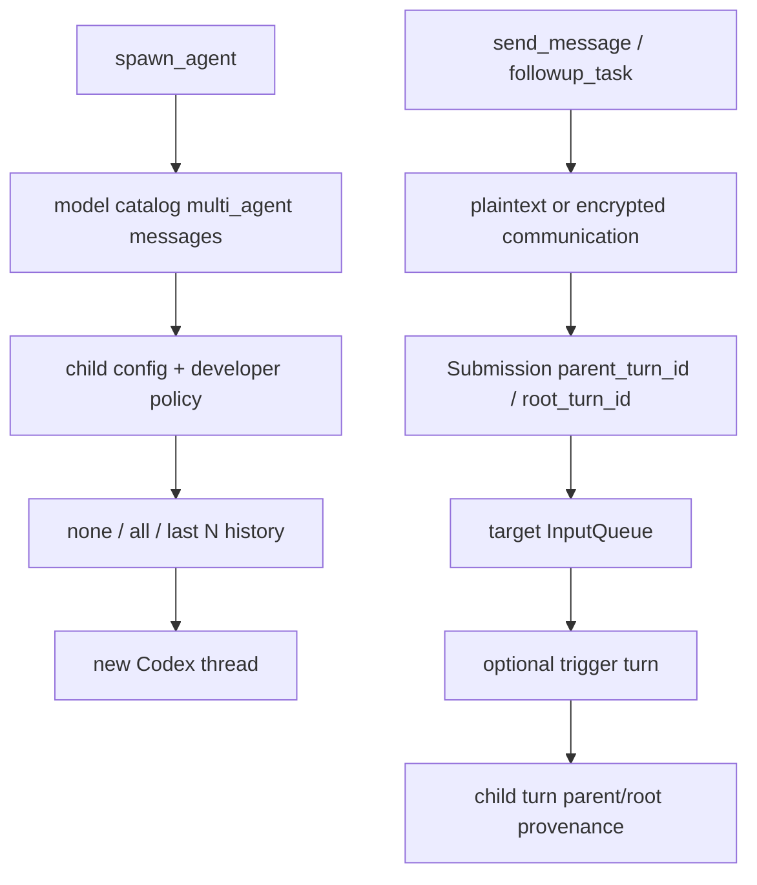

> MultiAgent V2 的关键变化不只在 tool schema：spawn 继承当前 environment selections 与 parent/root turn provenance，可替换 child developer instructions；direct collaboration tool arguments 以 plaintext assistant-role envelope 进入目标上下文。V2 usage hint / mode policy 优先读 model catalog 的 `model_messages.multi_agent`，再回落到 config 或 bundled 文本。fork/compaction 还会专门清理旧 AgentMessage。[E: codex-rs/core/src/tools/handlers/multi_agents_v2/spawn.rs:139][E: codex-rs/core/src/session/multi_agents.rs:75][E: codex-rs/core/src/agent/control/spawn.rs:629][E: codex-rs/core/src/compact_remote_v2.rs:65]

```mermaid
flowchart TD
    SPAWN["spawn_agent"] --> CATALOG["model catalog multi_agent messages"]
    CATALOG --> CONFIG["child config + developer policy"]
    CONFIG --> FORK["none / all / last N history"]
    FORK --> CHILD["new Codex thread"]
    MESSAGE["send_message / followup_task"] --> SOURCE["plaintext or encrypted communication"]
    SOURCE --> SUBMIT["Submission parent_turn_id / root_turn_id"]
    SUBMIT --> QUEUE["target InputQueue"]
    QUEUE --> TURN["optional trigger turn"]
    TURN --> META["child turn parent/root provenance"]
```

## Spawn

1. V2 handler 解析 `fork_turns`：默认 `all`，也可用 `none` 或正整数字符串。full-history fork 仍可带 `agent_type` 并调用 `apply_spawn_agent_role`；V1 的 `reject_full_fork_agent_type_override` 不再挡 V2。[E: codex-rs/core/src/tools/handlers/multi_agents_v2/spawn.rs:232][E: codex-rs/core/src/tools/handlers/multi_agents_v2/spawn.rs:244][E: codex-rs/core/src/tools/handlers/multi_agents_v2/spawn.rs:73][E: codex-rs/core/src/tools/handlers/multi_agents/spawn.rs:98]
2. shared config 以 live turn 的 model/provider/reasoning/developer instructions 为基线。若 V2 配置了 `subagent_developer_instructions`，它替换普通 developer instructions，而不是追加在 parent 指令后。[E: codex-rs/core/src/tools/handlers/multi_agents_common.rs:200][E: codex-rs/core/src/tools/handlers/multi_agents_common.rs:213][E: codex-rs/core/src/tools/handlers/multi_agents_common.rs:221]
3. role reload 可以声明保留 caller instructions；当 subagent override 存在但 role layer 没有自己的 developer instructions 时，该策略会恢复 caller 版本。[E: codex-rs/core/src/agent/role.rs:188][E: codex-rs/core/src/agent/role.rs:193]
4. V1/V2 spawn 都把当前 `StepContext` 的 environment selections、parent thread id、parent turn id 与 root turn id 放进 `SpawnAgentOptions`，child 因而沿用当前执行环境选择，而不是重新从全局默认推断。[E: codex-rs/core/src/tools/handlers/multi_agents_v2/spawn.rs:159][E: codex-rs/core/src/tools/handlers/multi_agents_v2/spawn.rs:165][E: codex-rs/core/src/tools/handlers/multi_agents/spawn.rs:134][E: codex-rs/core/src/tools/handlers/multi_agents/spawn.rs:139]
5. full-history V2 spawn 还会按 child 实际模型解析 catalog：`model_messages.multi_agent.role` 交给 `resolve_usage_hints`，再写入 `SpawnAgentOptions.multi_agent_v2_usage_hints`。config 覆盖优先；空 catalog/config 角色会抑制 bundled fallback。[E: codex-rs/core/src/tools/handlers/multi_agents_v2/spawn.rs:127][E: codex-rs/core/src/tools/handlers/multi_agents_v2/spawn.rs:139][E: codex-rs/core/src/session/multi_agents.rs:94][E: codex-rs/core/src/session/multi_agents.rs:98][E: codex-rs/protocol/src/openai_models.rs:577]
6. full fork 同时清理 top-level 与 compacted replacement history：所有 inherited `AgentMessage` 被剔除；parent developer fragment 被 child override 替换或删除；若 reference context 没有可替换 fragment，child override 最多补入一次。[E: codex-rs/core/src/agent/control/spawn.rs:629][E: codex-rs/core/src/agent/control/spawn.rs:809]

## Message source 与 envelope

router 只把 direct V2 `spawn_agent`、`send_message`、`followup_task` function calls 标记为 `DirectPlaintextMessage`；它们的 plaintext arguments 可安全转换为可读 inter-agent envelope。其他来源调用同一 runtime 时，communication body 保留 encrypted form。[E: codex-rs/core/src/tools/router.rs:40][E: codex-rs/core/src/tools/router.rs:51][E: codex-rs/core/src/tools/handlers/multi_agents_v2.rs:64][E: codex-rs/core/src/tools/handlers/multi_agents_v2.rs:68]

plaintext envelope 根据 `trigger_turn` 使用 `MESSAGE` 或 `NEW_TASK`，正文包含 message type、task name、sender 与 payload。它作为 assistant-role contextual fragment 注入，不伪装成用户消息。[E: codex-rs/core/src/tools/handlers/multi_agents_v2.rs:76][E: codex-rs/core/src/tools/handlers/multi_agents_v2.rs:81][E: codex-rs/core/src/context/inter_agent_message.rs:44]

`send_message` 只入队，`followup_task` 设置 `trigger_turn=true`；shared message handler 通过 `AgentControl` 提交相同的 `Op::InterAgentCommunication`，并只在 trigger 路径带上 parent/root turn id。[E: codex-rs/core/src/tools/handlers/multi_agents_v2/message_tool.rs:103][E: codex-rs/core/src/tools/handlers/multi_agents_v2/message_tool.rs:110][E: codex-rs/core/src/agent/control.rs:210][E: codex-rs/core/src/agent/control.rs:219]

## Parent / root turn provenance

`Submission` 现在显式携带 optional `parent_turn_id` 与 `root_turn_id`。collaboration submit path 只把 provenance 传给会触发 turn 的 submission；queue 保存每条 mail 的 parent/root id，drain 时只有所有 trigger mails 的非空 parent/root 分别一致才归并为 child turn provenance。[E: codex-rs/protocol/src/protocol.rs:194][E: codex-rs/protocol/src/protocol.rs:196][E: codex-rs/core/src/session/input_queue.rs:82][E: codex-rs/core/src/session/input_queue.rs:151][E: codex-rs/core/src/session/input_queue.rs:160][E: codex-rs/core/src/session/input_queue.rs:166]

queue-only message 不会单独创建 child turn；trigger 路径才走 `ensure_execution_capacity_for_turn_start`。[E: codex-rs/core/src/agent/control.rs:219][E: codex-rs/core/src/session/input_queue.rs:206]

## Registry 与 compaction

`AgentRegistry` 同时维护 live tree 与 canonical `thread_paths`；release 会同步清理 path mapping，lookup/sync/migrate/replace 都维护二者一致。[E: codex-rs/core/src/agent/registry.rs:31][E: codex-rs/core/src/agent/registry.rs:32][E: codex-rs/core/src/agent/registry.rs:102]

remote compaction V2 对 retained messages 使用 64k token 总预算，单条 AgentMessage 上限 10k。child fork 随后仍会剔除 inherited AgentMessage，避免把 parent 的旧协作邮件复制给新 agent。[E: codex-rs/core/src/compact_remote_v2.rs:65][E: codex-rs/core/src/compact_remote_v2.rs:66][E: codex-rs/core/src/agent/control/spawn.rs:629]

## Sources

- `codex-rs/core/src/tools/spec_plan.rs`
- `codex-rs/core/src/tools/router.rs`
- `codex-rs/core/src/tools/handlers/multi_agents/spawn.rs`
- `codex-rs/core/src/tools/handlers/multi_agents_v2.rs`
- `codex-rs/core/src/tools/handlers/multi_agents_v2/spawn.rs`
- `codex-rs/core/src/tools/handlers/multi_agents_v2/message_tool.rs`
- `codex-rs/core/src/tools/handlers/multi_agents_common.rs`
- `codex-rs/core/src/agent/role.rs`
- `codex-rs/core/src/agent/control.rs`
- `codex-rs/core/src/agent/control/spawn.rs`
- `codex-rs/core/src/agent/registry.rs`
- `codex-rs/core/src/session/input_queue.rs`
- `codex-rs/core/src/session/multi_agents.rs`
- `codex-rs/core/src/tasks/mod.rs`
- `codex-rs/core/src/compact_remote_v2.rs`
- `codex-rs/core/src/context/inter_agent_message.rs`
- `codex-rs/protocol/src/protocol.rs`
- `codex-rs/protocol/src/openai_models.rs`

## 相关

- [spawn_agent V2](../surface/tools/spawn-agent-v2.md)
- [send_message](../surface/tools/send-message.md)
- [followup_task](../surface/tools/followup-task.md)
- [wait_agent V2](../surface/tools/wait-agent-v2.md)
