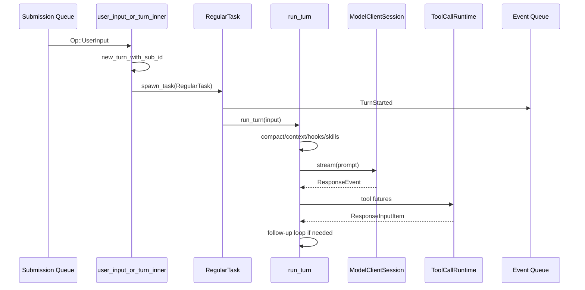

> 一次 regular turn 从 `Op::UserInput` 进入 `submission_loop` 开始，经 `user_input_or_turn_inner` 创建 `TurnContext` 和 `RegularTask`，再由 `run_turn` 构造 prompt、stream 模型、调度工具 future，最后由 task lifecycle 发送完成事件。[E: codex-rs/core/src/session/handlers.rs:753][E: codex-rs/core/src/session/handlers.rs:183][E: codex-rs/core/src/session/handlers.rs:260][E: codex-rs/core/src/tasks/regular.rs:72][E: codex-rs/core/src/session/turn.rs:1049]

## 能回答的问题

- `Op::UserInput` 如何变成 turn-scoped settings 和 `TurnInput`？
- `TurnStarted`、context update、prompt build、model stream、tool futures 的顺序是什么？
- tool call 为什么会导致 follow-up sampling？
- pending input 和 auto compact 如何影响 turn loop？

## 端到端步骤

1. `submission_loop` 在 `Op::UserInput` 分支调用 `user_input_or_turn(&sess, sub.id.clone(), sub.op, sub.client_user_message_id)`。[E: codex-rs/core/src/session/handlers.rs:753][E: codex-rs/core/src/session/handlers.rs:754]
2. `user_input_or_turn_inner` 只接受 `Op::UserInput`，拆出 items、final output schema、Responses metadata、additional context 和 thread settings；thread settings 非默认时先转成 `SessionSettingsUpdate`。[E: codex-rs/core/src/session/handlers.rs:183][E: codex-rs/core/src/session/handlers.rs:189][E: codex-rs/core/src/session/handlers.rs:199][E: codex-rs/core/src/session/handlers.rs:200]
3. Handler 调用 `sess.new_turn_with_sub_id(sub_id.clone(), updates)` 创建 turn context；如果当前已有 active turn，后续 `steer_input` 可以把输入注入 active turn。[E: codex-rs/core/src/session/handlers.rs:207][E: codex-rs/core/src/session/handlers.rs:220][E: codex-rs/core/src/session/handlers.rs:221]
4. 没有 active turn 时，handler 合并 additional context，构造 `TurnInput::ResponseItem` 和 `TurnInput::UserInput`，再 `spawn_task(..., RegularTask::new())`。[E: codex-rs/core/src/session/handlers.rs:233][E: codex-rs/core/src/session/handlers.rs:245][E: codex-rs/core/src/session/handlers.rs:249][E: codex-rs/core/src/session/handlers.rs:255][E: codex-rs/core/src/session/handlers.rs:260]
5. `TurnInput` enum 明确 regular turn 可消费用户输入、response item 和 inter-agent communication 三类输入。[E: codex-rs/core/src/session/input_queue.rs:13][E: codex-rs/core/src/session/input_queue.rs:18][E: codex-rs/core/src/session/input_queue.rs:19]
6. `RegularTask::run` 在调用 `run_turn` 前发送 `EventMsg::TurnStarted`，然后循环调用 `run_turn`；如果 session input queue 仍有 pending input，会以空 input 继续下一轮 sampling。[E: codex-rs/core/src/tasks/regular.rs:46][E: codex-rs/core/src/tasks/regular.rs:49][E: codex-rs/core/src/tasks/regular.rs:72][E: codex-rs/core/src/tasks/regular.rs:83]
7. `run_turn` 先建立或复用 turn-scoped `ModelClientSession`，再执行 pre-sampling compact、context update、skills/plugins build、session-start hooks 和 input recording。[E: codex-rs/core/src/session/turn.rs:148][E: codex-rs/core/src/session/turn.rs:154][E: codex-rs/core/src/session/turn.rs:162][E: codex-rs/core/src/session/turn.rs:165][E: codex-rs/core/src/session/turn.rs:168][E: codex-rs/core/src/session/turn.rs:171]
8. 每次 sampling 前，`run_turn` 从 cloned history 调 `for_prompt` 构造模型输入；`ContextManager::for_prompt` 会 normalize history 并按模型 input modalities 过滤不适配 items。[E: codex-rs/core/src/session/turn.rs:221][E: codex-rs/core/src/session/turn.rs:223][E: codex-rs/core/src/context_manager/history.rs:107][E: codex-rs/core/src/context_manager/history.rs:111]
9. `run_sampling_request` 调 `built_tools` 得到 `ToolRouter`，创建 `ToolCallRuntime`，再用 prompt input、router、turn context 和 base instructions 构造 `Prompt`。[E: codex-rs/core/src/session/turn.rs:1059][E: codex-rs/core/src/session/turn.rs:1063][E: codex-rs/core/src/session/turn.rs:1087]
10. `try_run_sampling_request` 调 `client_session.stream(...)` 发起 provider stream，并用 `FuturesOrdered` 保存 in-flight tool futures。[E: codex-rs/core/src/session/turn.rs:1885][E: codex-rs/core/src/session/turn.rs:1899]
11. stream 收到 `ResponseEvent::OutputItemDone(item)` 时，`try_run_sampling_request` 构造 `HandleOutputCtx` 并调用 `handle_output_item_done`；产生 tool future 时推入 `in_flight`。[E: codex-rs/core/src/session/turn.rs:1961][E: codex-rs/core/src/session/turn.rs:2002][E: codex-rs/core/src/session/turn.rs:2031][E: codex-rs/core/src/session/turn.rs:2039]
12. `handle_output_item_done` 调 `ToolRouter::build_tool_call`；识别到工具调用后先记录 model-emitted item，再创建 `tool_runtime.handle_tool_call(...)` future，并把 `needs_follow_up` 设为 true。[E: codex-rs/core/src/stream_events_utils.rs:413][E: codex-rs/core/src/stream_events_utils.rs:432][E: codex-rs/core/src/stream_events_utils.rs:436][E: codex-rs/core/src/stream_events_utils.rs:442]
13. provider `ResponseEvent::Completed` 只结束一次 sampling request：它记录 token usage，设置 token-count/turn-diff 标志，并返回 `SamplingRequestResult { needs_follow_up, last_agent_message }`。[E: codex-rs/core/src/session/turn.rs:2165][E: codex-rs/core/src/session/turn.rs:2177][E: codex-rs/core/src/session/turn.rs:2184]
14. sampling 后，`run_turn` 合并 model follow-up 和 pending input；如果 token limit reached 且仍需 follow-up，会执行 mid-turn auto compact 后继续 loop。[E: codex-rs/core/src/session/turn.rs:255][E: codex-rs/core/src/session/turn.rs:266][E: codex-rs/core/src/session/turn.rs:305][E: codex-rs/core/src/session/turn.rs:306]

## 关键决策点

- 当前 regular turn 入口名是 `Op::UserInput`；turn settings 通过 `ThreadSettingsOverrides` 嵌在 `UserInput` 内。[E: codex-rs/protocol/src/protocol.rs:533][E: codex-rs/protocol/src/protocol.rs:544]
- `TurnComplete` 是 task lifecycle 事件，不是 provider `response.completed` 的直接别名；provider completed 只结束本次 sampling request。[E: codex-rs/core/src/session/turn.rs:2165][E: codex-rs/core/src/tasks/mod.rs:557]
- 工具调用的 follow-up 是 runtime 需要把工具输出写回 history 后再让模型继续推理的结果；该判断落在 `handle_output_item_done` 的 `needs_follow_up` 字段上。[E: codex-rs/core/src/stream_events_utils.rs:442][I]

## 深挖入口

- `spine.tool-call-anatomy` 展开 tool router、registry、parallel runtime。
- `spine.context-and-compaction` 展开 history normalization、context diff、auto compact。
- `ref.protocol-event-lifecycle` 解释 turn events 与 streaming events。

## Sources

- codex-rs/protocol/src/protocol.rs
- codex-rs/core/src/session/handlers.rs
- codex-rs/core/src/session/input_queue.rs
- codex-rs/core/src/tasks/mod.rs
- codex-rs/core/src/tasks/regular.rs
- codex-rs/core/src/session/turn.rs
- codex-rs/core/src/stream_events_utils.rs
- codex-rs/core/src/session/mod.rs
- codex-rs/core/src/context_manager/history.rs

## 相关

- [Codex 源码总览](overview.md)
- [SQ/EQ 双队列架构](sq-eq-architecture.md)
- [工具调用解剖](tool-call-anatomy.md)
- [Context 与 compaction](context-and-compaction.md)
- 索引 id：`ref.protocol-op`
- 索引 id：`ref.protocol-event-lifecycle`
