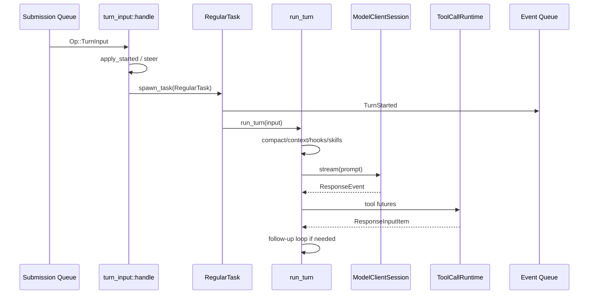

> 一次 regular turn 从 `Op::TurnInput` 进入 `submission_loop` 开始，经 `turn_input::handle` 决定 start/steer/reject 并创建 `TurnContext` 和 `RegularTask`，再由 `run_turn` 构造 prompt、stream 模型、调度工具 future；turn 结束后可按 `model_post_turn_compact_threshold_percent` 做 post-turn compact。[E: codex-rs/core/src/session/handlers.rs:485][E: codex-rs/core/src/session/turn_input.rs:205][E: codex-rs/core/src/session/turn_input.rs:365][E: codex-rs/core/src/tasks/regular.rs:105][E: codex-rs/core/src/session/turn.rs:163][E: codex-rs/core/src/session/turn.rs:710]

## 能回答的问题

- `Op::TurnInput` 如何变成 turn-scoped settings 和 session `TurnInput`？
- `TurnStarted`、context update、prompt build、model stream、tool futures 的顺序是什么？
- tool call 为什么会导致 follow-up sampling？
- pending input 和 auto compact 如何影响 turn loop？

```mermaid
sequenceDiagram
    participant SQ as Submission Queue
    participant Handler as turn_input::handle
    participant Task as RegularTask
    participant Turn as run_turn
    participant Model as ModelClientSession
    participant Tool as ToolCallRuntime
    participant EQ as Event Queue
    SQ->>Handler: Op::TurnInput
    Handler->>Handler: apply_started / steer
    Handler->>Task: spawn_task(RegularTask)
    Task->>EQ: TurnStarted
    Task->>Turn: run_turn(input)
    Turn->>Turn: compact/context/hooks/skills
    Turn->>Model: stream(prompt)
    Model-->>Turn: ResponseEvent
    Turn->>Tool: tool futures
    Tool-->>Turn: ResponseInputItem
    Turn->>Turn: follow-up loop if needed
```

## 端到端步骤

1. `submission_loop` 在 `Op::TurnInput` 分支调用 `turn_input::handle`，传入 boxed `TurnInputRequest`、`TurnInputMode` 和 submission id，再把路由结果写入 oneshot reply。[E: codex-rs/core/src/session/handlers.rs:485][E: codex-rs/core/src/session/handlers.rs:490][E: codex-rs/core/src/session/turn_input.rs:205]
2. `turn_input::handle` 按 mode 分流：`StartOrSteer` 调 `start_or_steer`，`StartIfIdle` / `ContinueIfIdle` 调 `start_if_idle`，`Steer { expected_turn_id }` 调 `steer`。`Op::RecoverTurn` 走独立 `handle_recovery`。[E: codex-rs/core/src/session/turn_input.rs:211][E: codex-rs/core/src/session/turn_input.rs:213][E: codex-rs/core/src/session/turn_input.rs:231][E: codex-rs/core/src/session/handlers.rs:494][E: codex-rs/core/src/session/turn_input.rs:254]
3. `start_or_steer` 只接受 submitted `TurnInput::UserInput` 或 standalone function-call output，拆出 items、thread settings、`TurnStartOptions`、additional context 和 Responses metadata。`PreparedTurnInputSettings::prepare` 始终先跑；thread settings 非默认时才 `preview_settings`，但不立即应用。[E: codex-rs/core/src/session/turn_input.rs:276][E: codex-rs/core/src/session/turn_input.rs:290][E: codex-rs/core/src/session/turn_input.rs:102][E: codex-rs/core/src/session/turn_input.rs:107][E: codex-rs/core/src/session/turn_input.rs:303]
4. 若已有 active turn，`steer_input` 成功则只 `apply_steered` 并返回 `TurnInputSubmission::Steered`。没有 active turn 时 `apply_started` 调 `sess.new_turn_with_sub_id` 创建 turn context，写入 parent/root provenance，再 `spawn_task(..., RegularTask::new())`。[E: codex-rs/core/src/session/turn_input.rs:305][E: codex-rs/core/src/session/turn_input.rs:316][E: codex-rs/core/src/session/turn_input.rs:125][E: codex-rs/core/src/session/turn_input.rs:365]
5. Session 侧 `TurnInput` enum 明确 regular turn 可消费用户输入、function-call output、response item 和 inter-agent communication 四类输入。[E: codex-rs/core/src/session/input_queue.rs:36][E: codex-rs/core/src/session/input_queue.rs:37][E: codex-rs/core/src/session/input_queue.rs:29][E: codex-rs/core/src/session/input_queue.rs:46][E: codex-rs/core/src/session/input_queue.rs:47]
6. `RegularTask::run` 在调用 `run_turn` 前通过 `sess.emit_turn_started` 发送 `EventMsg::TurnStarted`，然后循环调用 `run_turn`；如果 session input queue 仍有 pending input，会以空 input 继续下一轮 sampling。[E: codex-rs/core/src/tasks/regular.rs:51][E: codex-rs/core/src/session/mod.rs:2319][E: codex-rs/core/src/tasks/regular.rs:105][E: codex-rs/core/src/tasks/regular.rs:120][E: codex-rs/core/src/tasks/regular.rs:123]
7. `run_turn` 先建立或复用 turn-scoped `ModelClientSession`，再执行 pre-sampling compact、context update、skills/plugins build、session-start hooks 和 input recording。[E: codex-rs/core/src/session/turn.rs:178][E: codex-rs/core/src/session/turn.rs:183][E: codex-rs/core/src/session/turn.rs:282][E: codex-rs/core/src/session/turn.rs:308][E: codex-rs/core/src/session/turn.rs:320][E: codex-rs/core/src/session/turn.rs:366]
8. 每次 sampling 前，`run_turn` 从 cloned history 调 `for_prompt` 构造模型输入；`ContextManager::for_prompt` 会 normalize history 并按模型 input modalities 过滤不适配 items。[E: codex-rs/core/src/session/turn.rs:514][E: codex-rs/core/src/session/turn.rs:517][E: codex-rs/core/src/context_manager/history.rs:581]
9. `run_sampling_request` 复用 `StepContext.tool_router`，创建 `ToolCallRuntime`，再用 prompt input、router、turn context 和 base instructions 构造 `Prompt`。[E: codex-rs/core/src/session/turn.rs:1592][E: codex-rs/core/src/session/turn.rs:1612][E: codex-rs/core/src/session/turn.rs:1569]
10. `try_run_sampling_request` 调 `client_session.stream(...)` 发起 provider stream，并用 `FuturesOrdered` 保存 in-flight tool futures。[E: codex-rs/core/src/session/turn.rs:2499][E: codex-rs/core/src/session/turn.rs:2539][E: codex-rs/core/src/session/turn.rs:2556]
11. stream 收到 `ResponseEvent::OutputItemDone(item)` 时构造 `HandleOutputCtx` 并调用 `handle_output_item_done`；产生 tool future 时推入 `in_flight`。[E: codex-rs/core/src/session/turn.rs:2655][E: codex-rs/core/src/session/turn.rs:2715][E: codex-rs/core/src/session/turn.rs:2747][E: codex-rs/core/src/session/turn.rs:2755]
12. `handle_output_item_done` 调 `ToolRouter::build_tool_call`；识别到工具调用后先记录 model-emitted item，再创建 `tool_runtime.handle_tool_call(...)` future，并把 `needs_follow_up` 设为 true。[E: codex-rs/core/src/stream_events_utils.rs:315][E: codex-rs/core/src/stream_events_utils.rs:323][E: codex-rs/core/src/stream_events_utils.rs:346][E: codex-rs/core/src/stream_events_utils.rs:353][E: codex-rs/core/src/stream_events_utils.rs:356]
13. provider `ResponseEvent::Completed` 先经 `record_observed_response_completed` 发出含 response id 与 usage 的 `RawResponseCompleted` event，再记录 token usage、设置 token-count/turn-diff 标志并返回 `SamplingRequestResult { needs_follow_up, last_agent_message }`。它只结束一次 sampling request。[E: codex-rs/core/src/session/turn.rs:2911][E: codex-rs/core/src/session/turn.rs:2934][E: codex-rs/core/src/session/mod.rs:4773][E: codex-rs/core/src/session/turn.rs:2941][E: codex-rs/core/src/session/turn.rs:2956]
14. sampling 后，`run_turn` 合并 model follow-up 和 pending input；如果 token limit reached 且仍需 follow-up，会执行 mid-turn auto compact 后继续 loop。[E: codex-rs/core/src/session/turn.rs:564][E: codex-rs/core/src/session/turn.rs:599][E: codex-rs/core/src/session/turn.rs:611]
15. 当 turn 不再 follow-up 时，若 `model_post_turn_compact_threshold_percent > 0` 且未开 `Feature::TokenBudget`、context window 达到 turn-end 阈值、且无 pending input，则跑 `CompactionPhase::PostTurn` compact。[E: codex-rs/core/src/session/turn.rs:710][E: codex-rs/core/src/session/turn.rs:727][E: codex-rs/config/src/config_toml.rs:188]

## 关键决策点

- 当前 regular turn 入口名是 `Op::TurnInput`；旧 `Op::UserInput` 已不存在。turn settings 通过 `ThreadSettingsOverrides` 嵌在 `TurnInputRequest` 内，也可单独走 `Op::ThreadSettings`；单 turn 的运行中覆盖走 `Op::TurnSettings`。`Op` 共 **29** 个变体，含 `InterruptIfNoPendingInput`。[E: codex-rs/protocol/src/protocol.rs:625][E: codex-rs/protocol/src/protocol.rs:647][E: codex-rs/protocol/src/protocol.rs:657][E: codex-rs/protocol/src/protocol.rs:597]
- `RawResponseCompleted` 是 provider response boundary，`TurnComplete` 才是 task lifecycle boundary；一次 turn 可能包含多次 sampling response。[E: codex-rs/core/src/session/mod.rs:4773][E: codex-rs/core/src/tasks/mod.rs:843]
- 工具调用的 follow-up 是 runtime 需要把工具输出写回 history 后再让模型继续推理的结果；该判断落在 `handle_output_item_done` 的 `needs_follow_up` 字段上。[E: codex-rs/core/src/stream_events_utils.rs:356][I]

## 深挖入口

- `spine.tool-call-anatomy` 展开 tool router、registry、parallel runtime。
- `spine.context-and-compaction` 展开 history normalization、context diff、auto compact。
- `ref.protocol-event-lifecycle` 解释 turn events 与 streaming events。

## Sources

- codex-rs/protocol/src/protocol.rs
- codex-rs/core/src/session/handlers.rs
- codex-rs/core/src/session/turn_input.rs
- codex-rs/core/src/session/input_queue.rs
- codex-rs/core/src/tasks/mod.rs
- codex-rs/core/src/tasks/regular.rs
- codex-rs/core/src/session/turn.rs
- codex-rs/core/src/stream_events_utils.rs
- codex-rs/core/src/session/mod.rs
- codex-rs/core/src/context_manager/history.rs
- codex-rs/config/src/config_toml.rs

## 相关

- [Codex 源码总览](overview.md)
- [SQ/EQ 双队列架构](sq-eq-architecture.md)
- [工具调用解剖](tool-call-anatomy.md)
- [Context 与 compaction](context-and-compaction.md)
- 索引 id：`ref.protocol-op`
- 索引 id：`ref.protocol-event-lifecycle`
