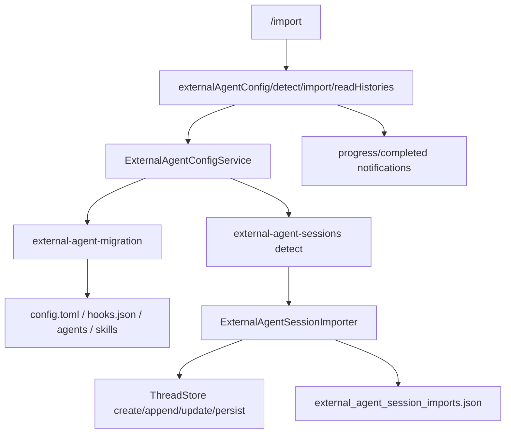

> external-agent import surface 把 Claude Code 风格的 `.claude/`、`.mcp.json`、hooks、slash-command markdown、sub-agent markdown 和 recent JSONL sessions 转成 Codex config、skills、agents、hooks 与 persisted thread history；TUI 入口是 `/import`，app-server RPC 入口是 `externalAgentConfig/*`。[E: codex-rs/app-server/src/config/external_agent_config.rs:37][E: codex-rs/external-agent-migration/src/lib.rs:15][E: codex-rs/external-agent-migration/src/lib.rs:16][E: codex-rs/tui/src/slash_command.rs:29][E: codex-rs/app-server-protocol/src/protocol/common.rs:1109]

## 能回答的问题

- `/import` 在 slash command catalog 中怎样暴露？
- `.mcp.json` 和 `.claude.json` 中的 MCP server 怎样迁移到 Codex `config.toml`？
- Claude Code hooks、slash commands 和 sub-agents 分别写到 Codex 的哪些目标？
- external-agent JSONL session 如何变成 Codex `ThreadStore` history？
- app-server 的 detect/import/readHistories 协议类型和 notification 是哪些？

## 入口与协议面

`SlashCommand::Import` 是 built-in slash command variant，description 是 "import setup, this project, and recent chats from Claude Code"，并且 `available_during_task()` 把 `Import` 放在不可运行列表中。[E: codex-rs/tui/src/slash_command.rs:12][E: codex-rs/tui/src/slash_command.rs:29][E: codex-rs/tui/src/slash_command.rs:103][E: codex-rs/tui/src/slash_command.rs:202]

app-server protocol 的 request 方法是 `externalAgentConfig/detect`、`externalAgentConfig/import`、`externalAgentConfig/import/readHistories`；server notification 还包括 `externalAgentConfig/import/progress` 和 `externalAgentConfig/import/completed`。[E: codex-rs/app-server-protocol/src/protocol/common.rs:1109][E: codex-rs/app-server-protocol/src/protocol/common.rs:1114][E: codex-rs/app-server-protocol/src/protocol/common.rs:1119][E: codex-rs/app-server-protocol/src/protocol/common.rs:1659][E: codex-rs/app-server-protocol/src/protocol/common.rs:1660]

协议类型把 migration item 分成 `AGENTS_MD`、`CONFIG`、`SKILLS`、`PLUGINS`、`MCP_SERVER_CONFIG`、`SUBAGENTS`、`HOOKS`、`COMMANDS`、`SESSIONS`；detect params 提供 `include_home` 和 repo-scoped `cwds`，import params 提供 migration items 和 optional source。[E: codex-rs/app-server-protocol/src/protocol/v2/config.rs:552][E: codex-rs/app-server-protocol/src/protocol/v2/config.rs:579][E: codex-rs/app-server-protocol/src/protocol/v2/config.rs:679][E: codex-rs/app-server-protocol/src/protocol/v2/config.rs:691]

`ExternalAgentConfigRequestProcessor::detect` 调用 `ExternalAgentConfigService::detect` 并把 core migration item 转成 protocol `ExternalAgentConfigMigrationItem`；`ExternalAgentConfigRequestProcessor::import` 先分配 `import_id`，验证 pending sessions，调用同步 import，然后发 `ExternalAgentConfigImportResponse`。[E: codex-rs/app-server/src/request_processors/external_agent_config_processor.rs:110][E: codex-rs/app-server/src/request_processors/external_agent_config_processor.rs:114][E: codex-rs/app-server/src/request_processors/external_agent_config_processor.rs:123][E: codex-rs/app-server/src/request_processors/external_agent_config_processor.rs:209][E: codex-rs/app-server/src/request_processors/external_agent_config_processor.rs:214][E: codex-rs/app-server/src/request_processors/external_agent_config_processor.rs:224][E: codex-rs/app-server/src/request_processors/external_agent_config_processor.rs:226][E: codex-rs/app-server/src/request_processors/external_agent_config_processor.rs:230]

## 配置与文件迁移

`external-agent-migration` 是配置迁移 helper crate，workspace entry 暴露该 crate，迁移源码把外部 agent 名固定为 `claude`，外部 MCP 配置文件名固定为 `.mcp.json`，外部 hooks 子目录固定为 `hooks`。[E: codex-rs/Cargo.toml:60][E: codex-rs/external-agent-migration/src/lib.rs:15][E: codex-rs/external-agent-migration/src/lib.rs:16][E: codex-rs/external-agent-migration/src/lib.rs:17]

`build_mcp_config_from_external` 先读 `source_root/.mcp.json` 和 `source_root/.claude.json`，如果提供 external-agent home 还会读其 parent 下的 `.claude.json` project entries，再按 settings 中的 enabled/disabled server 列表筛选，最终生成 `mcp_servers` TOML table。[E: codex-rs/external-agent-migration/src/lib.rs:43][E: codex-rs/external-agent-migration/src/lib.rs:48][E: codex-rs/external-agent-migration/src/lib.rs:53][E: codex-rs/external-agent-migration/src/lib.rs:64][E: codex-rs/external-agent-migration/src/lib.rs:80][E: codex-rs/external-agent-migration/src/lib.rs:225][E: codex-rs/external-agent-migration/src/lib.rs:230][E: codex-rs/external-agent-migration/src/lib.rs:235][E: codex-rs/external-agent-migration/src/lib.rs:257][E: codex-rs/external-agent-migration/src/lib.rs:261][E: codex-rs/external-agent-migration/src/lib.rs:281][E: codex-rs/external-agent-migration/src/lib.rs:284][E: codex-rs/external-agent-migration/src/lib.rs:1357][E: codex-rs/external-agent-migration/src/lib.rs:1358] 具体 server 转换支持 stdio `command/args/env` 和 HTTP `url/headers`，但含 `${...}` placeholder 的 command、args、url 或 unsupported transport 会被跳过。[E: codex-rs/external-agent-migration/src/lib.rs:337][E: codex-rs/external-agent-migration/src/lib.rs:355][E: codex-rs/external-agent-migration/src/lib.rs:359][E: codex-rs/external-agent-migration/src/lib.rs:376][E: codex-rs/external-agent-migration/src/lib.rs:383]

hooks 迁移从 `settings.json` 和 `settings.local.json` 读 `hooks` 配置；如果 `disableAllHooks` 为 true 就返回空迁移；只有 command-type、非 async、字段受支持且 command 非空的 hook 会被转换到 target `hooks.json`，并复制 `hooks/` 脚本目录时跳过已存在文件。[E: codex-rs/external-agent-migration/src/lib.rs:504][E: codex-rs/external-agent-migration/src/lib.rs:510][E: codex-rs/external-agent-migration/src/lib.rs:524][E: codex-rs/external-agent-migration/src/lib.rs:545][E: codex-rs/external-agent-migration/src/lib.rs:553][E: codex-rs/external-agent-migration/src/lib.rs:570][E: codex-rs/external-agent-migration/src/lib.rs:573][E: codex-rs/external-agent-migration/src/lib.rs:586][E: codex-rs/external-agent-migration/src/lib.rs:599][E: codex-rs/external-agent-migration/src/lib.rs:862][E: codex-rs/external-agent-migration/src/lib.rs:871][E: codex-rs/external-agent-migration/src/lib.rs:880]

sub-agents 迁移读取 source `agents/*.md`，要求 frontmatter 中有非空 `name` 和 `description`，再渲染成 target `agents/<stem>.toml`，保留 description、developer instructions，并映射 effort/permission mode 到 Codex 字段。[E: codex-rs/external-agent-migration/src/lib.rs:157][E: codex-rs/external-agent-migration/src/lib.rs:165][E: codex-rs/external-agent-migration/src/lib.rs:172][E: codex-rs/external-agent-migration/src/lib.rs:175][E: codex-rs/external-agent-migration/src/lib.rs:1046][E: codex-rs/external-agent-migration/src/lib.rs:1050][E: codex-rs/external-agent-migration/src/lib.rs:1057][E: codex-rs/external-agent-migration/src/lib.rs:1072][E: codex-rs/external-agent-migration/src/lib.rs:1098]

slash-command migration 递归收集 source `commands/**/*.md`，把唯一且受支持的 command markdown 迁成 `$target_skills/source-command-*/SKILL.md`；当前不支持 `$ARGUMENTS`、编号参数、`{{...}}`、bang shell include 和 `@file` placeholders。[E: codex-rs/external-agent-migration/src/lib.rs:197][E: codex-rs/external-agent-migration/src/lib.rs:204][E: codex-rs/external-agent-migration/src/lib.rs:210][E: codex-rs/external-agent-migration/src/lib.rs:216][E: codex-rs/external-agent-migration/src/lib.rs:921][E: codex-rs/external-agent-migration/src/lib.rs:943][E: codex-rs/external-agent-migration/src/lib.rs:1116][E: codex-rs/external-agent-migration/src/lib.rs:1163][E: codex-rs/external-agent-migration/src/lib.rs:1177]

`ExternalAgentConfigService::detect_migrations` home scope 使用 `CODEX_HOME/config.toml`、`CODEX_HOME/hooks.json`、`CODEX_HOME/agents`、`CODEX_HOME/AGENTS.md`，但 home-scope skills/commands 目标是 `CODEX_HOME` parent 下的 `.agents/skills`；repo scope 目标写到 repo `.codex` / `.agents`：MCP/config 进入 `.codex/config.toml`，hooks 进入 `.codex/hooks.json`，commands/skills 进入 `.agents/skills`，subagents 进入 `.codex/agents`，`CLAUDE.md` 迁到 `AGENTS.md`。[E: codex-rs/app-server/src/config/external_agent_config.rs:441][E: codex-rs/app-server/src/config/external_agent_config.rs:452][E: codex-rs/app-server/src/config/external_agent_config.rs:453][E: codex-rs/app-server/src/config/external_agent_config.rs:454][E: codex-rs/app-server/src/config/external_agent_config.rs:494][E: codex-rs/app-server/src/config/external_agent_config.rs:539][E: codex-rs/app-server/src/config/external_agent_config.rs:540][E: codex-rs/app-server/src/config/external_agent_config.rs:541][E: codex-rs/app-server/src/config/external_agent_config.rs:566][E: codex-rs/app-server/src/config/external_agent_config.rs:570][E: codex-rs/app-server/src/config/external_agent_config.rs:571][E: codex-rs/app-server/src/config/external_agent_config.rs:597][E: codex-rs/app-server/src/config/external_agent_config.rs:598][E: codex-rs/app-server/src/config/external_agent_config.rs:600][E: codex-rs/app-server/src/config/external_agent_config.rs:625][E: codex-rs/app-server/src/config/external_agent_config.rs:627][E: codex-rs/app-server/src/config/external_agent_config.rs:628][E: codex-rs/app-server/src/config/external_agent_config.rs:653][E: codex-rs/app-server/src/config/external_agent_config.rs:659][E: codex-rs/app-server/src/config/external_agent_config.rs:660][E: codex-rs/app-server/src/config/external_agent_config.rs:661][E: codex-rs/app-server/src/config/external_agent_config.rs:757][E: codex-rs/app-server/src/config/external_agent_config.rs:760]

## JSONL session migration

`external-agent-sessions` 是 session history parser/export helper crate，workspace entry 暴露该 crate，public API 暴露 `detect_recent_sessions`、`prepare_validated_session_import`、`record_completed_session_imports` 和 `ExternalAgentSessionMigration/ImportedExternalAgentSession/PendingSessionImport` 数据模型。[E: codex-rs/Cargo.toml:61][E: codex-rs/external-agent-sessions/src/lib.rs:13][E: codex-rs/external-agent-sessions/src/lib.rs:17][E: codex-rs/external-agent-sessions/src/lib.rs:24][E: codex-rs/external-agent-sessions/src/lib.rs:31][E: codex-rs/external-agent-sessions/src/lib.rs:39][E: codex-rs/external-agent-sessions/src/lib.rs:45]

`detect_recent_sessions` 只扫描 `external_agent_home/projects` 下最近 30 天的 `.jsonl`，最多保留 50 个候选，并用 ledger state 跳过已导入且未变的文件。[E: codex-rs/external-agent-sessions/src/detect.rs:13][E: codex-rs/external-agent-sessions/src/detect.rs:14][E: codex-rs/external-agent-sessions/src/detect.rs:16][E: codex-rs/external-agent-sessions/src/detect.rs:20][E: codex-rs/external-agent-sessions/src/detect.rs:45][E: codex-rs/external-agent-sessions/src/detect.rs:57][E: codex-rs/external-agent-sessions/src/detect.rs:68][E: codex-rs/external-agent-sessions/src/detect.rs:75]

`records::summarize_session` 逐行读 JSONL，跳过空行/不可解析行，提取 `cwd`、custom/AI title 和对话摘要；`read_session_import` 也逐行读取，但额外 hash 原始行并返回 `content_sha256`、完整 messages 和 source title；message parser 排除 `isMeta` 或 `isSidechain` records。[E: codex-rs/external-agent-sessions/src/records.rs:33][E: codex-rs/external-agent-sessions/src/records.rs:43][E: codex-rs/external-agent-sessions/src/records.rs:49][E: codex-rs/external-agent-sessions/src/records.rs:52][E: codex-rs/external-agent-sessions/src/records.rs:58][E: codex-rs/external-agent-sessions/src/records.rs:64][E: codex-rs/external-agent-sessions/src/records.rs:86][E: codex-rs/external-agent-sessions/src/records.rs:96][E: codex-rs/external-agent-sessions/src/records.rs:110][E: codex-rs/external-agent-sessions/src/records.rs:130][E: codex-rs/external-agent-sessions/src/records.rs:134][E: codex-rs/external-agent-sessions/src/records.rs:138][E: codex-rs/external-agent-sessions/src/records.rs:158][E: codex-rs/external-agent-sessions/src/records.rs:163]

`export::load_session_for_import_with_content_sha256` 要求 parsed session 有 `cwd` 且能生成非空 rollout items；导出会按 user message 开启 synthetic turn，assistant messages 作为 agent messages/response items，最后追加 `<EXTERNAL SESSION IMPORTED>` marker、token count 和 turn complete。[E: codex-rs/external-agent-sessions/src/export.rs:31][E: codex-rs/external-agent-sessions/src/export.rs:35][E: codex-rs/external-agent-sessions/src/export.rs:44][E: codex-rs/external-agent-sessions/src/export.rs:59][E: codex-rs/external-agent-sessions/src/export.rs:74][E: codex-rs/external-agent-sessions/src/export.rs:84][E: codex-rs/external-agent-sessions/src/export.rs:102][E: codex-rs/external-agent-sessions/src/export.rs:115][E: codex-rs/external-agent-sessions/src/export.rs:116][E: codex-rs/external-agent-sessions/src/export.rs:117]

duplicate prevention is content-based: ledger file name is `external_agent_session_imports.json`，records store canonical source path、content sha256、imported thread id、import timestamp and optional source modified time; `has_current_session_been_imported` hashes the current source file before deciding if it was already imported.[E: codex-rs/external-agent-sessions/src/ledger.rs:15][E: codex-rs/external-agent-sessions/src/ledger.rs:24][E: codex-rs/external-agent-sessions/src/ledger.rs:46][E: codex-rs/external-agent-sessions/src/ledger.rs:118][E: codex-rs/external-agent-sessions/src/ledger.rs:130][E: codex-rs/external-agent-sessions/src/ledger.rs:131]

## App-server import execution

Detect only adds `Sessions` for home-scoped import; it calls `detect_recent_sessions(&external_agent_home, &codex_home)` and stores the returned sessions in migration details.[E: codex-rs/app-server/src/config/external_agent_config.rs:731][E: codex-rs/app-server/src/config/external_agent_config.rs:732][E: codex-rs/app-server/src/config/external_agent_config.rs:734][E: codex-rs/app-server/src/config/external_agent_config.rs:742]

The synchronous `ExternalAgentConfigService::import` handles config/skills/AGENTS.md/MCP/subagents/hooks/commands and local plugin imports directly; remote plugin imports become pending background work, while `Sessions` returns `Ok(())` and session import is handled by `ExternalAgentSessionImporter` in the request processor background flow.[E: codex-rs/app-server/src/config/external_agent_config.rs:238][E: codex-rs/app-server/src/config/external_agent_config.rs:252][E: codex-rs/app-server/src/config/external_agent_config.rs:324][E: codex-rs/app-server/src/config/external_agent_config.rs:348][E: codex-rs/app-server/src/config/external_agent_config.rs:364][E: codex-rs/app-server/src/config/external_agent_config.rs:377][E: codex-rs/app-server/src/config/external_agent_config.rs:391][E: codex-rs/app-server/src/config/external_agent_config.rs:403][E: codex-rs/app-server/src/config/external_agent_config.rs:415][E: codex-rs/app-server/src/request_processors/external_agent_config_processor.rs:253][E: codex-rs/app-server/src/request_processors/external_agent_config_processor.rs:268][E: codex-rs/app-server/src/request_processors/external_agent_config_processor.rs:282]

`ExternalAgentSessionImporter::import_sessions` limits concurrent session persistence to 5 within one background import and records successful imports in the external-agent session ledger after processing.[E: codex-rs/app-server/src/request_processors/external_agent_session_import.rs:34][E: codex-rs/app-server/src/request_processors/external_agent_session_import.rs:64][E: codex-rs/app-server/src/request_processors/external_agent_session_import.rs:81][E: codex-rs/app-server/src/request_processors/external_agent_session_import.rs:86][E: codex-rs/app-server/src/request_processors/external_agent_session_import.rs:110]

Persisting one imported session loads config for the session cwd, creates a fresh `ThreadId`, builds `CreateThreadParams`, filters persisted rollout items, then calls `ThreadStore::create_thread`, `append_items`, `update_thread_metadata`, `persist_thread` and `shutdown_thread`.[E: codex-rs/app-server/src/request_processors/external_agent_session_import.rs:163][E: codex-rs/app-server/src/request_processors/external_agent_session_import.rs:173][E: codex-rs/app-server/src/request_processors/external_agent_session_import.rs:197][E: codex-rs/app-server/src/request_processors/external_agent_session_import.rs:207][E: codex-rs/app-server/src/request_processors/external_agent_session_import.rs:233][E: codex-rs/app-server/src/request_processors/external_agent_session_import.rs:255][E: codex-rs/app-server/src/request_processors/external_agent_session_import.rs:262][E: codex-rs/app-server/src/request_processors/external_agent_session_import.rs:273][E: codex-rs/app-server/src/request_processors/external_agent_session_import.rs:281][E: codex-rs/app-server/src/request_processors/external_agent_session_import.rs:285]

If there are pending sessions or pending plugin imports, request processor returns the import response first, then runs background imports and emits progress/completed notifications from the spawned task.[E: codex-rs/app-server/src/request_processors/external_agent_config_processor.rs:253][E: codex-rs/app-server/src/request_processors/external_agent_config_processor.rs:282][E: codex-rs/app-server/src/request_processors/external_agent_config_processor.rs:287][E: codex-rs/app-server/src/request_processors/external_agent_config_processor.rs:290][E: codex-rs/app-server/src/request_processors/external_agent_config_processor.rs:330][E: codex-rs/app-server/src/request_processors/external_agent_config_processor.rs:335][E: codex-rs/app-server/src/request_processors/external_agent_config_processor.rs:559][E: codex-rs/app-server/src/request_processors/external_agent_config_processor.rs:574]

## Sources

- `codex-rs/Cargo.toml`
- `codex-rs/external-agent-migration/src/lib.rs`
- `codex-rs/external-agent-sessions/src/lib.rs`
- `codex-rs/external-agent-sessions/src/detect.rs`
- `codex-rs/external-agent-sessions/src/export.rs`
- `codex-rs/external-agent-sessions/src/ledger.rs`
- `codex-rs/external-agent-sessions/src/records.rs`
- `codex-rs/app-server/src/config/external_agent_config.rs`
- `codex-rs/app-server/src/request_processors/external_agent_config_processor.rs`
- `codex-rs/app-server/src/request_processors/external_agent_session_import.rs`
- `codex-rs/tui/src/slash_command.rs`
- `codex-rs/app-server-protocol/src/protocol/common.rs`
- `codex-rs/app-server-protocol/src/protocol/v2/config.rs`

## 相关

- [CLI 子命令 catalog](subcommands.md)
- [工具与集成命令](../slash-commands/tools-integrations.md)
- [config/account/model/system 方法](../app-server/config-account-methods.md)
- [server notifications: system](../app-server/notifications-system.md)
- [配置加载](../../subsystems/config-auth/config-loading.md)
- [Skills 系统](../../subsystems/config-auth/skills.md)
- [Plugins 系统](../../subsystems/config-auth/plugins.md)
- [MCP client](../../subsystems/mcp/client.md)
