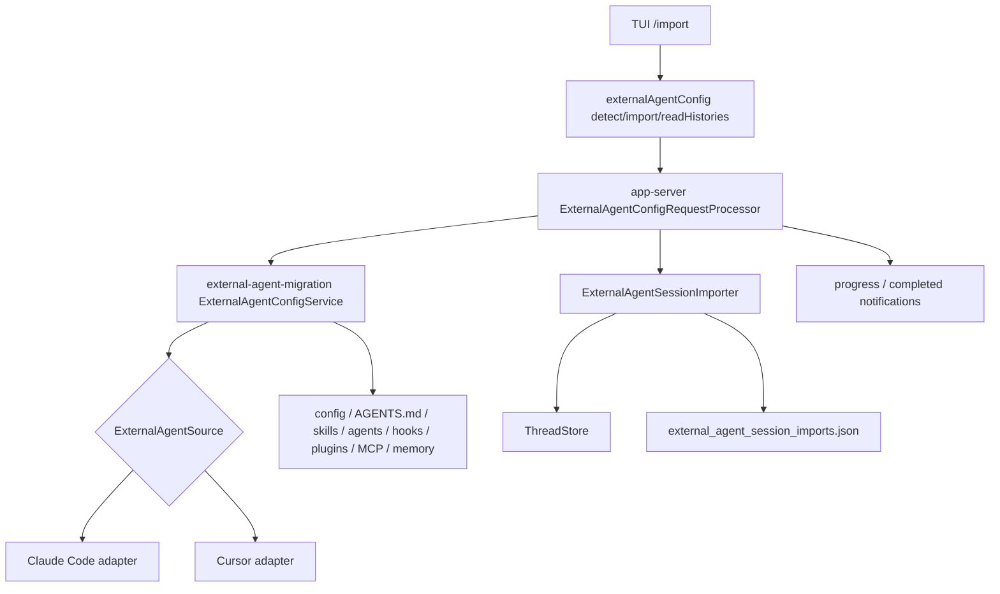

> external-agent migration 把 Claude Code 或 Cursor 的配置、instructions、skills、commands、subagents、hooks、plugins、MCP servers 和 recent JSONL sessions 导入 Codex；Claude Code 还可迁移 memory。TUI 入口是 `/import`，app-server 入口是 `externalAgentConfig/*`。[E: codex-rs/external-agent-migration/src/migration_source.rs:46][E: codex-rs/external-agent-migration/src/migration_source.rs:53][E: codex-rs/external-agent-migration/src/model.rs:12][E: codex-rs/tui/src/slash_command.rs:29][E: codex-rs/app-server-protocol/src/protocol/common.rs:1139]

## 能回答的问题

- `/import` 和三个 `externalAgentConfig/*` RPC 怎样连接到 migration service？
- `migrationSource` 怎样在 Claude Code 与 Cursor 两套 source adapter 之间切换？
- home/repository scope 各把 config、skills、agents、hooks 与 instructions 写到哪里？
- Claude/Cursor JSONL 怎样转成 Codex `ThreadStore` history，并如何防重复导入？
- memory、plugin 后台导入和 progress/completed notification 怎样门控与收尾？

```mermaid
flowchart TD
    TUI["TUI /import"] --> RPC["externalAgentConfig detect/import/readHistories"]
    RPC --> PROCESSOR["app-server ExternalAgentConfigRequestProcessor"]
    PROCESSOR --> SERVICE["external-agent-migration ExternalAgentConfigService"]
    SERVICE --> SOURCE{"ExternalAgentSource"}
    SOURCE --> CLA["Claude Code adapter"]
    SOURCE --> CUR["Cursor adapter"]
    SERVICE --> FILES["config / AGENTS.md / skills / agents / hooks / plugins / MCP / memory"]
    PROCESSOR --> IMPORTER["ExternalAgentSessionImporter"]
    IMPORTER --> THREADSTORE["ThreadStore"]
    IMPORTER --> LEDGER["external_agent_session_imports.json"]
    PROCESSOR --> NOTIFY["progress / completed notifications"]
```

## 入口与协议

`SlashCommand::Import` 的 wire name 是 `import`，popup description 仍写作从 Claude Code 导入；该命令不能在 task 运行期间执行。[E: codex-rs/tui/src/slash_command.rs:11][E: codex-rs/tui/src/slash_command.rs:103][E: codex-rs/tui/src/slash_command.rs:188][E: codex-rs/tui/src/slash_command.rs:202]

app-server 暴露 `externalAgentConfig/detect`、`externalAgentConfig/import`、`externalAgentConfig/import/readHistories`；前两者按 global `config` 串行，history read 使用 shared-read serialization。服务器发送 `externalAgentConfig/import/progress` 与 `externalAgentConfig/import/completed` 两种 notification。[E: codex-rs/app-server-protocol/src/protocol/common.rs:1139][E: codex-rs/app-server-protocol/src/protocol/common.rs:1144][E: codex-rs/app-server-protocol/src/protocol/common.rs:1149][E: codex-rs/app-server-protocol/src/protocol/common.rs:1695][E: codex-rs/app-server-protocol/src/protocol/common.rs:1696]

migration item 有 `AGENTS_MD`、`CONFIG`、`SKILLS`、`PLUGINS`、`MCP_SERVER_CONFIG`、`SUBAGENTS`、`HOOKS`、`COMMANDS`、`MEMORY`、`SESSIONS` 十类。[E: codex-rs/app-server-protocol/src/protocol/v2/config.rs:556][E: codex-rs/app-server-protocol/src/protocol/v2/config.rs:559][E: codex-rs/app-server-protocol/src/protocol/v2/config.rs:562][E: codex-rs/app-server-protocol/src/protocol/v2/config.rs:565][E: codex-rs/app-server-protocol/src/protocol/v2/config.rs:568][E: codex-rs/app-server-protocol/src/protocol/v2/config.rs:571][E: codex-rs/app-server-protocol/src/protocol/v2/config.rs:574][E: codex-rs/app-server-protocol/src/protocol/v2/config.rs:577][E: codex-rs/app-server-protocol/src/protocol/v2/config.rs:580][E: codex-rs/app-server-protocol/src/protocol/v2/config.rs:583][E: codex-rs/app-server-protocol/src/protocol/v2/config.rs:586] detect 接受 `includeHome`、repo `cwds` 和 `migrationSource`；协议仍保留旧 `source` 字段。[E: codex-rs/app-server-protocol/src/protocol/v2/config.rs:688][E: codex-rs/app-server-protocol/src/protocol/v2/config.rs:691][E: codex-rs/app-server-protocol/src/protocol/v2/config.rs:694][E: codex-rs/app-server-protocol/src/protocol/v2/config.rs:698][E: codex-rs/app-server-protocol/src/protocol/v2/config.rs:701] detect processor 只用 `migrationSource`、`includeHome` 和 `cwds` 构造 service/options。[E: codex-rs/app-server/src/external_agent_migration/processor.rs:117][E: codex-rs/app-server/src/external_agent_migration/processor.rs:121][E: codex-rs/app-server/src/external_agent_migration/processor.rs:122][E: codex-rs/app-server/src/external_agent_migration/processor.rs:123][E: codex-rs/app-server/src/external_agent_migration/processor.rs:125] 据此，旧 `source` 不参与 detection。[I] import 也用 `migrationSource` 选择 service，并返回新建的 `importId`。[E: codex-rs/app-server/src/external_agent_migration/processor.rs:159][E: codex-rs/app-server/src/external_agent_migration/processor.rs:161][E: codex-rs/app-server/src/external_agent_migration/processor.rs:163][E: codex-rs/app-server/src/external_agent_migration/processor.rs:183][E: codex-rs/app-server/src/external_agent_migration/processor.rs:184]

## Crate 重组后的职责边界

旧 `external-agent-sessions` 已并入 `external-agent-migration::sessions`；crate 根现在只组织 source adapters、detect、service、memory、plugins、rewrite 与 sessions，并从 `service`/`sessions` 重导出公共 API。[E: codex-rs/external-agent-migration/src/lib.rs:3][E: codex-rs/external-agent-migration/src/lib.rs:18][E: codex-rs/external-agent-migration/src/lib.rs:50][E: codex-rs/external-agent-migration/src/lib.rs:59][E: codex-rs/external-agent-migration/src/lib.rs:66]

app-server 旧 `config/external_agent_config.rs` 和 `request_processors/external_agent_config_processor.rs` 的职责重定位为 `external_agent_migration/processor.rs`：processor 构造 `ExternalAgentConfigService` 与 `ExternalAgentSessionImporter`，负责 RPC 参数校验、响应、后台任务和通知；core/protocol 类型转换独立在 `protocol.rs`，session persistence 独立在 `session_importer.rs`。[E: codex-rs/app-server/src/external_agent_migration/processor.rs:54][E: codex-rs/app-server/src/external_agent_migration/processor.rs:77][E: codex-rs/app-server/src/external_agent_migration/processor.rs:90][E: codex-rs/app-server/src/external_agent_migration/protocol.rs:30][E: codex-rs/app-server/src/external_agent_migration/session_importer.rs:45]

## Source adapter 与 scope

`ExternalAgentSource::from_migration_source` 仅把大小写不敏感的 `cursor` 选成 Cursor，其余值都回落到 Claude Code。Claude source 用 `.claude/settings.json`，Cursor source 用 home `~/.cursor/cli-config.json` 或 repo `.cursor/cli.json`；memory 只支持 Claude，recent sessions 两者都支持。[E: codex-rs/external-agent-migration/src/migration_source.rs:53][E: codex-rs/external-agent-migration/src/migration_source.rs:70][E: codex-rs/external-agent-migration/src/migration_source.rs:77][E: codex-rs/external-agent-migration/src/migration_source.rs:121]

`ExternalAgentConfigService::detect` 可扫描 home 与多个 repo scope；memory 额外要求 `include_home`、`include_memory` 且 source 支持 memory。每个 scope 都只为目标中尚缺的内容生成 migration item。[E: codex-rs/external-agent-migration/src/detect/mod.rs:38][E: codex-rs/external-agent-migration/src/detect/mod.rs:43][E: codex-rs/external-agent-migration/src/detect/mod.rs:48][E: codex-rs/external-agent-migration/src/detect/mod.rs:58][E: codex-rs/external-agent-migration/src/detect/mod.rs:83][E: codex-rs/external-agent-migration/src/detect/mod.rs:100]

home scope 把 config/MCP 写入 `CODEX_HOME/config.toml`、hooks 写入 `CODEX_HOME/hooks.json`、subagents 写入 `CODEX_HOME/agents`、instructions 写入 `CODEX_HOME/AGENTS.md`；skills 与 migrated commands 写入 `CODEX_HOME` 的 parent 下 `.agents/skills`。repo scope 对应写入 `<repo>/.codex/config.toml`、`.codex/hooks.json`、`.codex/agents`、`<repo>/AGENTS.md` 与 `<repo>/.agents/skills`。[E: codex-rs/external-agent-migration/src/service.rs:395][E: codex-rs/external-agent-migration/src/service.rs:490][E: codex-rs/external-agent-migration/src/service.rs:538][E: codex-rs/external-agent-migration/src/service.rs:576][E: codex-rs/external-agent-migration/src/service.rs:594][E: codex-rs/external-agent-migration/src/service.rs:617][E: codex-rs/external-agent-migration/src/service.rs:636][E: codex-rs/external-agent-migration/src/service.rs:676]

Claude MCP import 合并 repo `.mcp.json`、`.claude.json` 及 home-side `.claude.json` project entry，再应用 enabled/disabled server filters；Cursor 直接解析 `.cursor/mcp.json`。转换结果是 `mcp_servers` TOML，只接收兼容的 stdio 或 HTTP 配置，并拒绝 command/args 中的环境 placeholder。[E: codex-rs/external-agent-migration/src/mcp.rs:13][E: codex-rs/external-agent-migration/src/mcp.rs:22][E: codex-rs/external-agent-migration/src/mcp.rs:42][E: codex-rs/external-agent-migration/src/mcp.rs:74][E: codex-rs/external-agent-migration/src/mcp.rs:186][E: codex-rs/external-agent-migration/src/mcp.rs:204][E: codex-rs/external-agent-migration/src/mcp.rs:214]

subagent importer 只枚举非 README 的 `*.md`，跳过缺有效 metadata 或目标已存在的文件，并输出同 stem 的 `.toml`；service 对 skills 也采用“只复制目标不存在的目录”语义。[E: codex-rs/external-agent-migration/src/subagents.rs:56][E: codex-rs/external-agent-migration/src/subagents.rs:71][E: codex-rs/external-agent-migration/src/subagents.rs:88][E: codex-rs/external-agent-migration/src/subagents.rs:102][E: codex-rs/external-agent-migration/src/subagents.rs:111][E: codex-rs/external-agent-migration/src/service.rs:650][E: codex-rs/external-agent-migration/src/service.rs:660]

## Memory migration

Claude memory discovery 递归扫描 `.claude/projects/<project>/memory/**/*.md` 并拒绝 symlink。[E: codex-rs/external-agent-migration/src/memory.rs:8][E: codex-rs/external-agent-migration/src/memory.rs:9][E: codex-rs/external-agent-migration/src/memory.rs:20][E: codex-rs/external-agent-migration/src/memory.rs:39][E: codex-rs/external-agent-migration/src/memory.rs:55][E: codex-rs/external-agent-migration/src/memory.rs:115][E: codex-rs/external-agent-migration/src/memory.rs:126][E: codex-rs/external-agent-migration/src/memory.rs:129][E: codex-rs/external-agent-migration/src/memory.rs:133] 它还尝试从同 project 的 recent JSONL 解析并 canonicalize cwd。[E: codex-rs/external-agent-migration/src/memory.rs:65][E: codex-rs/external-agent-migration/src/memory.rs:77][E: codex-rs/external-agent-migration/src/memory.rs:84][E: codex-rs/external-agent-migration/src/memory.rs:85][E: codex-rs/external-agent-migration/src/memory.rs:98][E: codex-rs/external-agent-migration/src/memory.rs:99][E: codex-rs/external-agent-migration/src/memory.rs:104][E: codex-rs/external-agent-migration/src/memory.rs:107] memory import 要求非空选择集和可用 state DB，将资源同步进 Codex memory workspace；workspace 改变后会 enqueue global consolidation。[E: codex-rs/external-agent-migration/src/memory_import.rs:53][E: codex-rs/external-agent-migration/src/memory_import.rs:63][E: codex-rs/external-agent-migration/src/memory_import.rs:69][E: codex-rs/external-agent-migration/src/memory_import.rs:75][E: codex-rs/external-agent-migration/src/memory_import.rs:76][E: codex-rs/external-agent-migration/src/memory_import.rs:79][E: codex-rs/external-agent-migration/src/memory_import.rs:80][E: codex-rs/external-agent-migration/src/memory_import.rs:81][E: codex-rs/external-agent-migration/src/memory_import.rs:84]

app-server 只有在 `Feature::ExternalAgentMemoryImport` 启用时才检测/接受 `MEMORY`；请求缺少所选 memory 时直接返回 invalid request。[E: codex-rs/app-server/src/external_agent_migration/processor.rs:140][E: codex-rs/app-server/src/external_agent_migration/processor.rs:148][E: codex-rs/app-server/src/external_agent_migration/processor.rs:314][E: codex-rs/app-server/src/external_agent_migration/processor.rs:329]

## JSONL session migration

Claude detector 扫描 `.claude/projects/*/*.jsonl` 并要求解析出的 cwd 仍是目录；Cursor detector 扫描 `.cursor/projects/*/agent-transcripts`，排除 `subagents` 子树，并允许用 encoded project path 作为 fallback cwd。[E: codex-rs/external-agent-migration/src/detect/sessions/cla.rs:10][E: codex-rs/external-agent-migration/src/detect/sessions/cla.rs:20][E: codex-rs/external-agent-migration/src/detect/sessions/cla.rs:45][E: codex-rs/external-agent-migration/src/detect/sessions/cur.rs:11][E: codex-rs/external-agent-migration/src/detect/sessions/cur.rs:29][E: codex-rs/external-agent-migration/src/detect/sessions/cur.rs:37][E: codex-rs/external-agent-migration/src/detect/sessions/cur.rs:53]

共享 detector 只收最近 30 天、最多 50 条候选；它用 ledger 的 modified time/content state 跳过未变化的已导入文件。session parser 逐行容忍空行和坏 JSON，提取 cwd、custom/AI/fallback title、messages、content SHA-256 与 MCP attribution ids。[E: codex-rs/external-agent-migration/src/detect/sessions/common.rs:14][E: codex-rs/external-agent-migration/src/detect/sessions/common.rs:22][E: codex-rs/external-agent-migration/src/detect/sessions/common.rs:42][E: codex-rs/external-agent-migration/src/detect/sessions/common.rs:53][E: codex-rs/external-agent-migration/src/detect/sessions/common.rs:65][E: codex-rs/external-agent-migration/src/sessions/records.rs:57][E: codex-rs/external-agent-migration/src/sessions/records.rs:63][E: codex-rs/external-agent-migration/src/sessions/records.rs:121][E: codex-rs/external-agent-migration/src/sessions/records.rs:140][E: codex-rs/external-agent-migration/src/sessions/records.rs:148][E: codex-rs/external-agent-migration/src/sessions/records.rs:174]

`prepare_validated_session_import_with_metadata_mode` 先以 ledger 去重，再按 `Embedded` 或 `MigrationFallback` 决定是否接纳 detector 的 cwd；只有 cwd 仍存在且 rollout 非空才产出 `PendingSessionImport`。[E: codex-rs/external-agent-migration/src/sessions/mod.rs:37][E: codex-rs/external-agent-migration/src/sessions/mod.rs:78][E: codex-rs/external-agent-migration/src/sessions/mod.rs:83][E: codex-rs/external-agent-migration/src/sessions/mod.rs:95][E: codex-rs/external-agent-migration/src/sessions/mod.rs:100][E: codex-rs/external-agent-migration/src/sessions/mod.rs:105]

exporter 把每条 user message 变成 synthetic turn start/user event/response item，assistant message 只在已有 turn 时加入；末尾追加 `<EXTERNAL SESSION IMPORTED>`、估算 token count 和 turn complete。[E: codex-rs/external-agent-migration/src/sessions/export.rs:77][E: codex-rs/external-agent-migration/src/sessions/export.rs:87][E: codex-rs/external-agent-migration/src/sessions/export.rs:98][E: codex-rs/external-agent-migration/src/sessions/export.rs:118][E: codex-rs/external-agent-migration/src/sessions/export.rs:137][E: codex-rs/external-agent-migration/src/sessions/export.rs:146][E: codex-rs/external-agent-migration/src/sessions/export.rs:175][E: codex-rs/external-agent-migration/src/sessions/export.rs:190]

`ExternalAgentSessionImporter` 串行化整个 import batch，但 batch 内最多并发 5 个 session；成功后把 source path/hash、thread id、modified time 与 detected connector names 写入 `external_agent_session_imports.json`。单个 session 通过 `ThreadStore::create_thread`、`append_items`、`update_thread_metadata`、`persist_thread`、`shutdown_thread` 落盘，append 失败会 discard 新 thread。[E: codex-rs/app-server/src/external_agent_migration/session_importer.rs:37][E: codex-rs/app-server/src/external_agent_migration/session_importer.rs:67][E: codex-rs/app-server/src/external_agent_migration/session_importer.rs:94][E: codex-rs/app-server/src/external_agent_migration/session_importer.rs:103][E: codex-rs/app-server/src/external_agent_migration/session_importer.rs:171][E: codex-rs/app-server/src/external_agent_migration/session_importer.rs:354][E: codex-rs/app-server/src/external_agent_migration/session_importer.rs:363][E: codex-rs/app-server/src/external_agent_migration/session_importer.rs:372][E: codex-rs/app-server/src/external_agent_migration/session_importer.rs:379][E: codex-rs/app-server/src/external_agent_migration/session_importer.rs:392][E: codex-rs/app-server/src/external_agent_migration/session_importer.rs:401][E: codex-rs/external-agent-migration/src/sessions/ledger.rs:16][E: codex-rs/external-agent-migration/src/sessions/ledger.rs:81]

## 同步、后台任务与 history

processor 先验证 sessions、同步执行普通迁移、必要时刷新 config runtime，然后立即回 `importId`。remote plugins 与 sessions 放进同一个 spawned background task 并并行等待；每类结果发送 progress，最终合并成 completed notification，plugin import 后清 plugins/skills cache。[E: codex-rs/app-server/src/external_agent_migration/processor.rs:172][E: codex-rs/app-server/src/external_agent_migration/processor.rs:174][E: codex-rs/app-server/src/external_agent_migration/processor.rs:177][E: codex-rs/app-server/src/external_agent_migration/processor.rs:180][E: codex-rs/app-server/src/external_agent_migration/processor.rs:203][E: codex-rs/app-server/src/external_agent_migration/processor.rs:233][E: codex-rs/app-server/src/external_agent_migration/processor.rs:289][E: codex-rs/app-server/src/external_agent_migration/processor.rs:296][E: codex-rs/app-server/src/external_agent_migration/processor.rs:300]

`readHistories` 从 state DB 读取 import success/failure records，同时从 session ledger 聚合 connector candidate 与 session count；response 的 `connectors` source 固定为 `RemoteMcpServersConfig`。[E: codex-rs/app-server/src/external_agent_migration/processor.rs:332][E: codex-rs/app-server/src/external_agent_migration/processor.rs:339][E: codex-rs/app-server/src/external_agent_migration/processor.rs:347][E: codex-rs/app-server/src/external_agent_migration/processor.rs:354][E: codex-rs/app-server-protocol/src/protocol/v2/config.rs:770][E: codex-rs/app-server-protocol/src/protocol/v2/config.rs:778]

## 拆分判断

当前单节点虽已不只是 CLI 小入口，但它从 `/import`/RPC 一直贯穿 source adapters、file/config migration、memory、session conversion/persistence 与 app-server orchestration，并已完整登记新 crate 的关键 source，因此本轮无需为“未覆盖新增面”再建节点。[I] 若后续 migration source 或独立消费方继续增加，可再拆出 `subsys.config-auth.external-agent-migration`，让本页只保留入口 flow。

## Sources

- `codex-rs/Cargo.toml`
- `codex-rs/external-agent-migration/src/lib.rs`
- `codex-rs/external-agent-migration/src/model.rs`
- `codex-rs/external-agent-migration/src/migration_source.rs`
- `codex-rs/external-agent-migration/src/detect/mod.rs`
- `codex-rs/external-agent-migration/src/detect/sessions/common.rs`
- `codex-rs/external-agent-migration/src/detect/sessions/cla.rs`
- `codex-rs/external-agent-migration/src/detect/sessions/cur.rs`
- `codex-rs/external-agent-migration/src/mcp.rs`
- `codex-rs/external-agent-migration/src/service.rs`
- `codex-rs/external-agent-migration/src/subagents.rs`
- `codex-rs/external-agent-migration/src/memory.rs`
- `codex-rs/external-agent-migration/src/memory_import.rs`
- `codex-rs/external-agent-migration/src/sessions/mod.rs`
- `codex-rs/external-agent-migration/src/sessions/export.rs`
- `codex-rs/external-agent-migration/src/sessions/ledger.rs`
- `codex-rs/external-agent-migration/src/sessions/records.rs`
- `codex-rs/app-server/src/external_agent_migration/processor.rs`
- `codex-rs/app-server/src/external_agent_migration/protocol.rs`
- `codex-rs/app-server/src/external_agent_migration/session_importer.rs`
- `codex-rs/tui/src/slash_command.rs`
- `codex-rs/app-server-protocol/src/protocol/common.rs`
- `codex-rs/app-server-protocol/src/protocol/v2/config.rs`

## 相关

- [CLI 子命令 catalog](subcommands.md)
- [工具与集成命令](../slash-commands/tools-integrations.md)
- [config/account/model/system 方法](../app-server/config-account-methods.md)
- [server notifications: system](../app-server/notifications-system.md)
- [配置加载](../../subsystems/config-auth/config-loading.md)
- [Skills 系统](../../subsystems/config-auth/skills.md)
- [Plugins 系统](../../subsystems/config-auth/plugins.md)
- [MCP client](../../subsystems/mcp/client.md)
