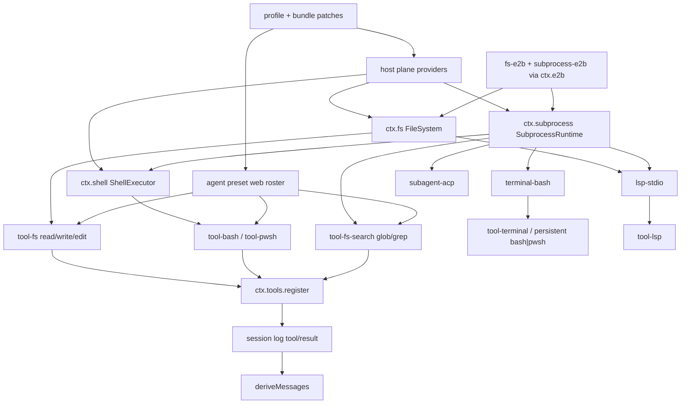

> DSH 的 **capability seam** 是一条可替换能力，三角角色是 **Definition**（声明 `ctx.*` 接口）、**Provider**（实现并 `provide`）、**Consumer**（`inject` 后调用）。它属于 Cordis 组合运行时（`profile → bundle → agent preset`），不是「coding agent 内置了一堆工具」：换掉一条 host 面 provider，挂在该 `ctx` 键上的 consumer 整组改世界，模型可见的 tool 名与 schema 仍由 consumer 写进 `ctx.tools`，再经 session log 投影。

## 能回答的问题

- 一条 capability seam 的 Definition / Provider / Consumer 分别是哪个包、怎么挂上 `ctx`？
- 默认 `dsh web` 以及 `dsh --profile headless|sdk|sdk-minimal|acp` 组合里 `ctx.fs` / `ctx.shell` / `ctx.subprocess` 各是哪个 provider？host 面与 agent-preset 面怎么切？
- 只换 `ctx.fs`、只换 `ctx.subprocess`、还是两个一起换，分别带走哪些 consumer（Bash / PTY / LSP / `glob`/`grep`）？
- 为什么 preset 里 publish 服务必须带 `isolate`，而 `tool-bash` / `tool-fs` 行可以不带？
- 模型看见的 `bash` / `write` 结果怎样保证能从 session log 重建（model-visible ⟺ logged）？

## 主路径

1. `FileSystem`@packages/fs/fs/src/index.ts 是 `ctx.fs` 的 Definition：augmentation 声明 `Context.fs`，抽象类构造时把自身登记为名为 `fs` 的 Cordis service。[E: packages/fs/fs/src/index.ts:46] [E: packages/fs/fs/src/index.ts:88]
2. `ShellExecutor`@packages/shell/shell/src/index.ts 与 `SubprocessRuntime`@packages/subprocess/subprocess/src/index.ts 用同一模式分别占住 `ctx.shell` 与 `ctx.subprocess`。[E: packages/shell/shell/src/index.ts:41] [E: packages/shell/shell/src/index.ts:66] [E: packages/subprocess/subprocess/src/index.ts:73] [E: packages/subprocess/subprocess/src/index.ts:114]
3. `Service`@vendor/cordis/src/service.ts 在构造里调用 `ctx.reflect.provide(name, self, …)`；提供 fiber `dispose` 后 `ctx.fs` 变为 `undefined`。同一 realm 再挂第二个同名 service 会抛。[E: vendor/cordis/src/service.ts:57] [E: packages/fs/fs/tests/service.spec.ts:108] [E: packages/fs/fs/tests/service.spec.ts:101] [E: packages/shell/shell/tests/service.spec.ts:82]
4. `dsh-base`@packages/bundle/base/cordis.patch.yml 在 host 进程挂默认 Provider：`ctx.subprocess` = `@deepseek-ai/dsh-subprocess-local`，`ctx.shell` = `@deepseek-ai/dsh-bash-sandbox`（`disabled` 在 win32），win32 启用 `@deepseek-ai/dsh-pwsh-sandbox`，`ctx.fs` = `@deepseek-ai/dsh-fs-sandbox`。五个 shipped profile 里，`web` / `headless` / `sdk` / `acp` 叠 `dsh-base`；`sdk-minimal` 的 `bundles` 只有 `@deepseek-ai/dsh-sdk-minimal`。[E: packages/bundle/base/cordis.patch.yml:206] [E: packages/bundle/base/cordis.patch.yml:221] [E: packages/bundle/base/cordis.patch.yml:222] [E: packages/bundle/base/cordis.patch.yml:227] [E: packages/bundle/base/cordis.patch.yml:493] [E: packages/boot/app-boot/src/profile.ts:137] [E: packages/boot/app-boot/src/profile.ts:155]
5. `SandboxedFileSystem`@packages/fs/fs-sandbox/src/index.ts 继承 `LocalFileSystem`，`inject` host 上的 `sandboxPolicy`；模型侧 `tool-fs` 不用改。[E: packages/fs/fs-sandbox/src/index.ts:56] [E: packages/fs/fs-sandbox/src/index.ts:58]
6. `SandboxBashExecutor`@packages/shell/bash-sandbox/src/index.ts 继承 `LocalBashExecutor`，`inject` 为 `subprocess` + `sandbox` + `sandboxPolicy`，同样登记成唯一的 `ctx.shell`。[E: packages/shell/bash-sandbox/src/index.ts:44] [E: packages/shell/bash-sandbox/src/index.ts:45]
7. `LocalBashExecutor`@packages/shell/bash-local/src/index.ts 是 `ctx.shell` 的本地实现，也是 `ctx.subprocess` 的 Consumer：`static inject = ['subprocess']`，`run` / `start` 把 `bash -c` 交给 `this.ctx.subprocess.spawn`。`PwshLocalExecutor` 同样 `inject` `subprocess`。[E: packages/shell/bash-local/src/index.ts:103] [E: packages/shell/bash-local/src/index.ts:214] [E: packages/shell/bash-local/src/index.ts:259] [E: packages/shell/pwsh-local/src/index.ts:129]
8. `apply`@packages/fs/tool-fs/src/index.ts 是 `ctx.fs` 的模型面 Consumer：`inject = ['tools', 'fs', 'systemPrompt']`。`applyWriteTool` 在 execute 里 `ctx.fs.resolve` 再 `ctx.fs.writeText`，并先走 `fs/write-intent` waterfall。[E: packages/fs/tool-fs/src/index.ts:22] [E: packages/fs/tool-fs/src/write.ts:107] [E: packages/fs/tool-fs/src/write.ts:110] [E: packages/fs/tool-fs/src/write.ts:113]
9. `apply`@packages/shell/tool-bash/src/index.ts 是 `ctx.shell` 的模型面 Consumer：`inject = ['tools', 'shell', 'systemPrompt', 'shellEnv']`，`defineTool({ name: 'bash' })` 后 `ctx.shell.run(ctx.shell.resolve(…))`。没有 `ctx.shell` 时插件挂起，`ctx.tools.schemas()` 为空。[E: packages/shell/tool-bash/src/index.ts:30] [E: packages/shell/tool-bash/src/index.ts:242] [E: packages/shell/tool-bash/src/index.ts:379] [E: packages/shell/tool-bash/tests/tools.spec.ts:422]
10. `apply`@packages/terminal/terminal-bash/src/index.ts 把 PTY 接到 `ctx.subprocess`：`inject = ['terminals', 'sandboxPolicy', 'sessionProjections', 'subprocess']`，默认 `spawnTerminal` 就是 `ctx.subprocess.spawnTerminal`。它不 `inject` `fs`。[E: packages/terminal/terminal-bash/src/index.ts:27] [E: packages/terminal/terminal-bash/src/index.ts:182]
11. `apply`@packages/lsp/lsp-stdio/src/index.ts 同时吃两条 seam：`inject = ['fs', 'lsp', 'subprocess']`。load 时 `ctx.subprocess.resolveExecutable`，每个 provider 持有 `ctx.fs`，进程用 `ctx.subprocess.spawn`。[E: packages/lsp/lsp-stdio/src/index.ts:47] [E: packages/lsp/lsp-stdio/src/index.ts:146] [E: packages/lsp/lsp-stdio/src/index.ts:154] [E: packages/lsp/lsp-stdio/src/index.ts:156]
12. `tool-fs-search`@packages/fs/tool-fs-search/src/index.ts 的 `glob` / `grep` **不**走 `ctx.fs`：`inject = ['tools', 'systemPrompt', 'subprocess']`，`runRipgrep` 直接 `ctx.subprocess.spawn` 固定 ripgrep argv。[E: packages/fs/tool-fs-search/src/index.ts:70] [E: packages/fs/tool-fs-search/src/search-core.ts:234]
13. 进程外 subagent 后端同样 `inject` `subprocess`（例如 `subagent-acp`），换 `ctx.subprocess` 会改它们的 spawn 世界。[E: packages/subagent/subagent-acp/src/index.ts:24]
14. 远程 one-world 的配对是 `ctx.e2b` + 两个 Provider：`E2BRuntime` 提供 `ctx.e2b`；`E2BFileSystem` 与 `E2BSubprocessRuntime` 都 `static inject = ['e2b']`。测试夹具 `packages/e2b/e2b/tests/fixtures/composition/cordis.yml` 插入 `e2b`、`subprocess-e2b`、`fs-e2b`（以及本地 `bash-local`）。live e2e 断言同沙箱里 `bashRead`/`fsRead` 交叉可见，并断言 `hover` 与 `terminal` 字段。[E: packages/e2b/e2b/src/index.ts:91] [E: packages/e2b/fs-e2b/src/index.ts:172] [E: packages/e2b/subprocess-e2b/src/index.ts:53] [E: packages/e2b/e2b/tests/fixtures/composition/cordis.yml:10] [E: packages/e2b/e2b/tests/fixtures/composition/cordis.yml:18] [E: packages/e2b/e2b/tests/composition.e2e.ts:149] [E: packages/e2b/e2b/tests/composition.e2e.ts:150] [E: packages/e2b/e2b/tests/composition.e2e.ts:161]
15. **host 面 vs agent-preset 面（client 不持有这些键）。** `PROFILE_TEMPLATES` 有五个名字：`web`（唯一 `live`）、`headless` / `sdk` / `sdk-minimal` / `acp`（`startup`）。`dsh web` 是 CLI 子命令，把 profile 名硬编码为 `web`；其余走 `dsh --profile <name>`。`ctx.fs` / `ctx.shell` / `ctx.subprocess` / `ctx.sandbox` / persistence / webserver 是 **host 进程** 的 service。`dsh-web-app` 把 base 里的 `tool-bash` / `tool-fs` 行 `disabled: true`，再插入 `agent-presets`（`default: standard`）。四个 shipped preset 目录是 `minimal` / `standard` / `ptc` / `cordis`（旧名 `code` 即 PTC）。`standard` 再按会话挂回 `tool-bash` / `tool-fs` 等同名 tool 行，它们只 `register` 进 host 的 `ctx.tools`，自身不 `provide` service，所以不必 `isolate`。headless / sdk / acp overlay **不**挂 `agent-presets`，因此跑 base 上仍启用的 host-plane tool 行。[E: packages/boot/app-boot/src/profile.ts:137] [E: packages/boot/app-boot/src/profile.ts:142] [E: packages/boot/app-boot/src/profile.ts:144] [E: apps/cli/src/args.ts:156] [E: apps/cli/src/args.ts:168] [E: packages/bundle/web-app/cordis.patch.yml:320] [E: packages/bundle/web-app/cordis.patch.yml:339] [E: packages/bundle/web-app/cordis.patch.yml:443] [E: packages/preset/agent-presets/presets/standard/agent.cordis.yml:45] [E: packages/preset/agent-presets/presets/standard/agent.cordis.yml:57]
16. 若 preset **publish** 一个 service，必须进带 `isolate` 的 `cordis:group`，否则 `mountPreset` 在 subtree settle 后用 `leakedServices` 视为泄漏到 root realm 并拒绝。`minimal` 给自己隔离一份 `ctx.fs`（`isolate.fs: true` + `dsh-fs-local`），只影响加入该 preset 的 agent，host 上的 `fs-sandbox` 仍给别的会话用。[E: packages/preset/agent-presets/src/mount.ts:378] [E: packages/preset/agent-presets/src/mount.ts:407] [E: packages/preset/agent-presets/src/mount.ts:410] [E: packages/preset/agent-presets/presets/minimal/agent.cordis.yml:77] [E: packages/preset/agent-presets/presets/minimal/agent.cordis.yml:81]
17. **model-visible ⟺ logged。** Consumer 把模型名（`bash`、`write`）登记到 `ctx.tools`；能进入模型历史的 surface 类型是 `user/message`、`assistant/message`、`tool/result`，且事件必须带 `surfaceOp`。`agent-loop` 的 invariant 在 `llm/stream` 上把请求里的 `messages` 与 `session.deriveMessages()` 做 JSON 相等检查，对不上就 fail。[E: packages/core/session/src/surface.ts:23] [E: packages/core/session/src/surface.ts:42] [E: packages/core/agent-loop/src/invariant.ts:21] [E: packages/core/agent-loop/src/invariant.ts:39] [E: packages/core/agent-loop/src/invariant.ts:40]
18. 政策不一定换 Provider：`fs-observation-policy` 的 `apply(ctx)` 不声明 `inject`，只监听 `fs/write-intent` / `fs/edit-intent` / `fs/observed`。`tool-fs` 的 `ctx.waterfall('fs/write-intent', …)` 把单槽决定交给该插件；卸掉它，provider 就回到无条件 write/edit。[E: packages/fs/fs-observation-policy/src/index.ts:106] [E: packages/fs/fs-observation-policy/src/index.ts:119]

## 关键决策点

- **三角缺一就不是 seam。** Definition 包只声明 `ctx` 键与抽象方法；Provider 必须是可加载插件且独占该键；Consumer 通过 `inject` 等到 service，而不是 import 某个 `*-local` 实现。换世界 = 换 bundle / `--patch` 行，不改 `tool-bash` / `tool-fs`。
- **`ctx.fs` 与 `ctx.subprocess` 没有运行时耦合。** Bash / PTY / `glob`/`grep` / 进程外 subagent 只 `inject` `subprocess`（Bash 还隔着 `ctx.shell`）。LSP 是少数同时 `inject` 两条的 consumer。只换 `ctx.fs` 不会把 `bash -c` 搬到远程；只换 `ctx.subprocess` 会让 `read`/`write` 与 spawn 分属两个执行世界。E2B 用共享的 `ctx.e2b` 把两个 Provider 绑成 one-world。
- **换 `ctx.fs` + `ctx.subprocess` 一起带走的集合（源码/测试核过）：** `tool-fs`（及 `str_replace_editor` 一类只吃 `ctx.fs` 的工具）、`tool-fs-search`、`ctx.shell` 执行器（因此 `tool-bash` / `tool-pwsh`）、`terminal-bash`（因此 PTY 与 persistent `bash` / `pwsh` 工具）、`lsp-stdio`（因此 `tool-lsp`）、以及 `inject: ['subagents', 'subprocess']` 的进程外 subagent 后端。官方 architecture 文案把「指到远程 sandbox」写成一句话带走 Bash/PTY/LSP；代码要求的是**成对替换**，不是单独换 `ctx.fs`。
- **host 面 vs preset 面。** Provider、sandbox/approval、persistence、`ctx.shellEnv`、`ctx.jobs` 注册表留在 host（进程级，session 出现之前就要 `inject`）。Preset 贡献的是 tools / persona / 必须 `isolate` 的 per-agent service。浏览器 client 是另一进程，不实现 `FileSystem` / `ShellExecutor` / `SubprocessRuntime`。五个 profile 里，只有 **web** 把 agent-plane 工具行关掉后交给 `packages/preset/agent-presets/presets/{minimal,standard,ptc,cordis}/`。
- **默认 Web 组合不是「base 里的 tool 行」。** `dsh-base` 仍列出 `tool-bash` / `tool-fs`，`dsh-web-app` 把它们关掉，改由 `packages/preset/agent-presets/presets/*/agent.cordis.yml` 按会话挂上。成员资格以这些 yml 为准。
- **Companion 事件 ≠ 新 Provider。** `fs/*` waterfall 必须有人 `next()` 或占槽返回；`fs-observation-policy` 占 `fs/write-intent` 且不调用 `next()`。这与换 `SandboxedFileSystem` 是正交的两层。

## 指向后续 T1/T2

- `ref.capability-seams` — 全部 `ctx.*` 键的 Definition / Provider / Consumer 清单（本页只走 `fs` / `shell` / `subprocess` 三条把机制讲清）。
- `subsys.execution.fs` — `FileSystem` 原语、`FsTarget` / version、sandbox fence、`fs/*` 事件。
- `spine.composition-boot` — 空入口表如何叠 bundle / home / `--patch`；`dsh --dump-config` 看真树。
- `spine.tool-call-anatomy` — 模型 `tool_use` 进入 `executeToolCalls` 与 `tools/pre-execute → execute → post-execute`。
- `spine.session-log` — append-only log、`deriveMessages()`、`surfaceOp`。
- `surface.presets.overview` — `minimal` / `standard` / `ptc` / `cordis` 成员与 `isolate` 域（wiki id `surface.presets.code` 仍是 PTC 预设的稳定别名）。
- `subsys.execution.sandbox-policy` — host 上那份被 `fs-sandbox` 与 `bash-sandbox` 共同阅读的 mode + workspace root。

## Sources

- packages/fs/fs/src/index.ts
- packages/shell/shell/src/index.ts
- packages/subprocess/subprocess/src/index.ts
- vendor/cordis/src/service.ts
- packages/fs/fs/tests/service.spec.ts
- packages/shell/shell/tests/service.spec.ts
- packages/fs/fs-sandbox/src/index.ts
- packages/fs/tool-fs/src/index.ts
- packages/fs/tool-fs/src/write.ts
- packages/fs/tool-fs-search/src/index.ts
- packages/fs/tool-fs-search/src/search-core.ts
- packages/fs/fs-observation-policy/src/index.ts
- packages/shell/bash-local/src/index.ts
- packages/shell/bash-sandbox/src/index.ts
- packages/shell/pwsh-local/src/index.ts
- packages/shell/tool-bash/src/index.ts
- packages/shell/tool-bash/tests/tools.spec.ts
- packages/bundle/base/cordis.patch.yml
- packages/bundle/web-app/cordis.patch.yml
- packages/boot/app-boot/src/profile.ts
- apps/cli/src/args.ts
- packages/terminal/terminal-bash/src/index.ts
- packages/lsp/lsp-stdio/src/index.ts
- packages/e2b/e2b/src/index.ts
- packages/e2b/fs-e2b/src/index.ts
- packages/e2b/subprocess-e2b/src/index.ts
- packages/e2b/e2b/tests/composition.e2e.ts
- packages/e2b/e2b/tests/fixtures/composition/cordis.yml
- packages/preset/agent-presets/presets/standard/agent.cordis.yml
- packages/preset/agent-presets/presets/minimal/agent.cordis.yml
- packages/preset/agent-presets/src/mount.ts
- packages/core/session/src/surface.ts
- packages/core/agent-loop/src/invariant.ts
- packages/subagent/subagent-acp/src/index.ts

## 相关

- [spine.overview](overview.md) — 组合运行时全仓地图与 host / preset 两面。
- [ref.capability-seams](../reference/capability-seams.md) — 全部 seam 键与三角角色表。
- [subsys.execution.fs](../subsystems/execution/fs.md) — `ctx.fs` 子系统（原语、围栏、观察策略）。
