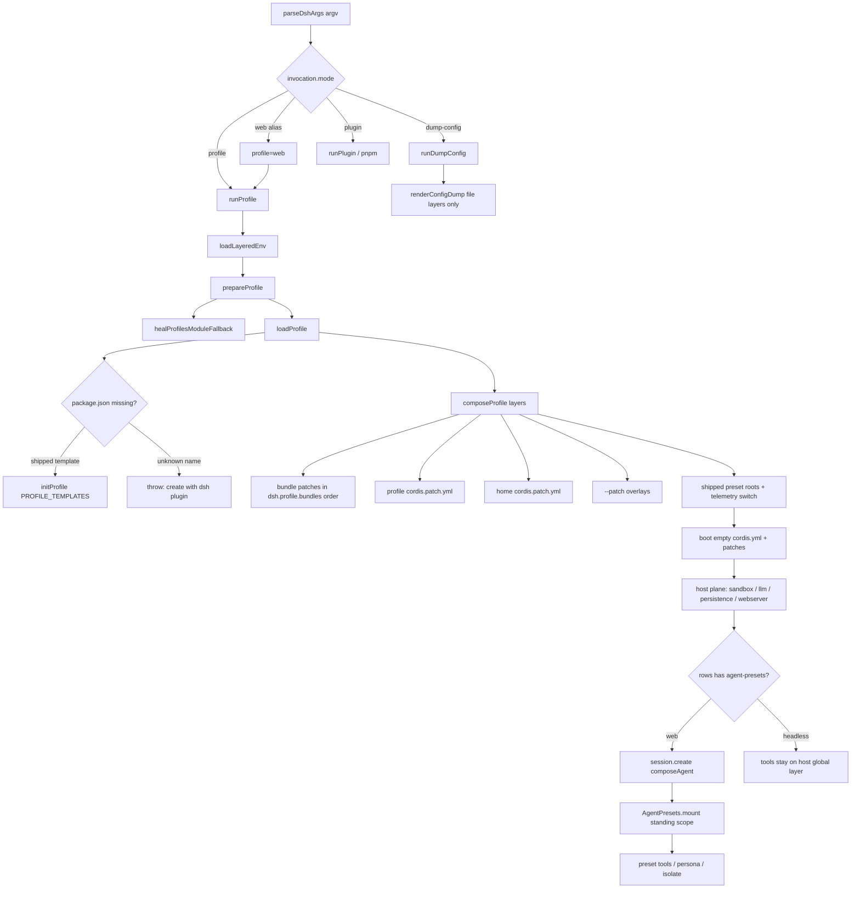

> DSH 是 **Cordis 组合运行时**：一次启动把空的 Loader 入口表叠成 `profile → bundle → agent preset`。进程级 **host 面**（webserver / persistence / sandbox / subagent backends）先 settle；会话级 **agent-preset 面**（tools / persona / isolate）在 Agent factory 的 `setup` 里 join。模型看见的 preset 必须写进 session log（`model-visible ⟺ logged`）。本仓没有 shipped TUI 包；默认产品路径是 `dsh web`。

## 能回答的问题

- `dsh` / `dsh web` / `dsh --profile headless` 怎样变成一次 profile boot，inner args 归谁解析？
- 空的 `$DSH_HOME/profiles/<name>/cordis.yml` 按什么层序叠成有效入口表？`composeProfile` 和 `composeEntries` 各在哪一层？
- shipped `PROFILE_TEMPLATES` 的 `web` 与 `headless` 差哪一层 bundle？host 面和 agent-preset 面怎么切开？
- Web 会话何时 `AgentPresets.mount`？headless 为什么不挂 roster？子代理怎么 `composeFrom`？
- `dsh --dump-config` / `--dump-default-config` 看到的是哪几层？launcher 注入的 shipped preset root 与 `DSH_TELEMETRY_DISABLED` 会不会出现在 dump 里？

## 端到端步骤

1. `parseDshArgs@apps/cli/src/args.ts` 只吃 launcher 旗标：`--profile`、可重复 `--patch`、`--dump-config` / `--dump-default-config`。第一个它不认识的 token 起全部是 inner args，交给已 boot 的 app 自己解析（含 app 的 `-h`）。子命令 `web` 硬编码为 `profile: 'web'`，与 `dsh --profile web` 同一条 boot 路径。缺 `--profile` 且不是 `web`/`plugin` 则报错退出。本仓没有 shipped TUI 包；help 里的 `--profile tui` 只是自定义 profile 示例。 [E: apps/cli/src/args.ts:168] [E: apps/cli/src/args.ts:140] [E: apps/cli/tests/args.spec.ts:28]

2. `bin` switch@apps/cli/src/bin.ts 按 `invocation.mode` 动态 import：`profile` → `runProfile`；`dump-config` → `runDumpConfig`；`plugin` → `runPlugin` 后 `process.exit`。profile 路径在进树之前调用 `loadLayeredEnv('dsh')`：继承环境优先，再补 invoking-directory `.env`，再补 `$DSH_HOME/.env`（不覆盖已有名）；`DSH_*`、`DEEPSEEK_BASE_URL` 等 bootstrap-only 名禁止出现在发现到的 `.env` 里。 [E: apps/cli/src/bin.ts:33] [E: packages/boot/app-boot/src/index.ts:190] [E: packages/boot/app-boot/src/index.ts:157]

3. `runProfile@apps/cli/src/profile-boot.ts` 先走模块内 `composeProfile`（**未 export**；`dsh-app-boot` 导出的是 `composeEntries` / `loadProfile` / `initProfile`，launcher 导出的是 `runProfile` / `prepareProfile`。index 种子名 `composeProfile` 指这个本地函数）。`prepareProfile` 调 `healProfilesModuleFallback(INSTALL_ANCHOR)`，把安装树依赖闭包扁平 symlink 到 `$DSH_HOME/profiles/node_modules`，再 `loadProfile`，并**每次**把 profile 目录里的 `cordis.yml` 重写成 `PROFILE_ROOT_CONFIG`（正文是空入口表 `[]`）——Loader 需要真实 include 根来锚定 `baseUrl`，但 vendored Loader 的 write-back 会把已叠好的行烤进该文件，下次 boot 就会把 bundle insert 再插一遍。 [E: apps/cli/src/profile-boot.ts:142] [E: apps/cli/src/profile-boot.ts:101] [E: apps/cli/src/profile-boot.ts:60]

4. `loadProfile@packages/boot/app-boot/src/profile.ts` 解析 `$DSH_HOME/profiles/<name>/package.json` 的 `dsh.profile.bundles`。目录尚不存在时，仅当 `name` 落在 `PROFILE_TEMPLATES` 才 `initProfile`：`web` = `@deepseek-ai/dsh-base` + `@deepseek-ai/dsh-web-app`；`headless` = `@deepseek-ai/dsh-base` + `@deepseek-ai/dsh-headless`。其它名字必须先 `dsh plugin --profile <name> add …`；`dsh plugin` 对无模板名用 `DEFAULT_PROFILE_BUNDLES = ['@deepseek-ai/dsh-base']`。每个 bundle 必须在自己的 `package.json` 声明 `dsh.bundle.patch`（`dsh-base` / `dsh-web-app` / `dsh-headless` 都是 `./cordis.patch.yml`），否则 fail loud。bundle 解析 **installation-first，profile-second**，保证 in-box bundle 永远来自正在跑的这份 dsh，而不是 profile-local 副本。 [E: packages/boot/app-boot/src/profile.ts:115] [E: packages/boot/app-boot/src/profile.ts:116] [E: packages/boot/app-boot/src/profile.ts:383] [E: packages/boot/app-boot/src/profile.ts:347] [E: packages/bundle/base/package.json:38] [E: packages/bundle/web-app/package.json:43] [E: packages/bundle/headless/package.json:43] [E: apps/cli/src/plugin.ts:124]

5. `composeEntries@packages/boot/app-boot/src/profile.ts` 从**空数组**出发，把各层 `PatchOptions[]` flatten 成一次 `applyEntryPatches` 调用。`applyEntryPatches@vendor/include/src/index.ts` 按 id 找行：无 `id` 的 `insert` 追加到根；带 `id` 的 patch 把 `config` / `disabled` 等键**整键覆盖**（不是 deep-merge）；同一 flattened 列表里后写的 insert 立刻入索引，所以后一层可以改前一层刚插的行；匹配不到的 patch 只 warn、不抛。测试钉死「后层 `config` 赢、缺行被跳过」。 [E: packages/boot/app-boot/src/profile.ts:416] [E: vendor/include/src/index.ts:123] [E: packages/boot/app-boot/tests/profile.spec.ts:207]

6. `composeProfile` 的应用顺序是 `bundlePatches → profile.patches → homePatches → overlays`。profile 层是 `$DSH_HOME/profiles/<name>/cordis.patch.yml`（缺文件 = 空层）；home 层是 `$DSH_HOME/cordis.patch.yml`，机器级、压过每个 profile 自己的层。`--patch` 文件按 argv 顺序 `loadOverlayPatches`（**缺文件抛错**，与用户层「缺文件=无层」相反）。叠完之后，若行表里已有 `agent-presets`，launcher 再推一条 overlay，把 `apps/cli/config/agent-presets/` 写成 `trust: 'system'` 的 shipped root；若 `DSH_TELEMETRY_DISABLED` 非空且存在 `session-telemetry-otel` 行，再推 `{ id, disabled: true }`（`'0'`/`'false'` 也关——隐私开关偏 off-by-mistake）。shipped root 路径是 `apps/cli/config/agent-presets/`，随 CLI `files` 里的 `config` 一起发布。 [E: apps/cli/src/profile-boot.ts:124] [E: apps/cli/src/profile-boot.ts:164] [E: apps/cli/src/profile-boot.ts:82] [E: apps/cli/tests/telemetry-switch.spec.ts:11] [E: apps/cli/package.json:19]

7. `runProfile` 调 `boot@packages/boot/app-boot/src/index.ts`：`new Context` → `provide('dshHomePath')` → `ctx.plugin(Loader)` → `prepare` 回调里 `provide` 冻结的 `LaunchEnvironmentSnapshot` 和 `provideCmdline`（`ctx.cmdlineArgs` + `ctx.appExit`）→ `mountRootInclude` 把空 `cordis.yml` 加上整叠 patches。app 旗标不是 launcher 的事：`dsh web --host …` 的 `--host` 在 inner args 里，由 web-startup 解析后再喂给 `!!js ctx.webStartup.host`。树 settle 后，若组合没留下 HMR（web-app 把共享 `hmr` 行 `disabled: true`），launcher 会挂一个 `root: []` 的 watch-only HMR，让两份用户 `cordis.patch.yml` 热重载；重载时 `composeLive` 仍是「bundle 在下、overlays 在上」，用户编辑挤不走 shipped 层。 [E: apps/cli/src/profile-boot.ts:252] [E: apps/cli/src/profile-boot.ts:255] [E: packages/boot/cmdline/src/index.ts:70] [E: packages/bundle/web-app/cordis.patch.yml:23]

8. **host 面 vs agent-preset 面在这一步切开。** `dsh-base` 用**一条**根 `insert` 放下共享核心：`llm` / `llm-deepseek` / `llm-pi-ai`（零 route 直到 Settings 加 profile）、`session` 与 jsonl persistence、`sandbox` + `sandbox-policy` + `approval`、`tools` 注册表、`agent-loop`（`agents: []`，Web 不在进程级造 Agent）、shell 双栈（`disabled: !!js process.platform`）。`dsh-web-app` 叠在 base 之后：插入 `webserver` / `web-runtime` / `api-gateway` / client roster，并把 **model-facing** 行（`tool-bash` / `tool-fs` / `plan-mode` / `tool-subagent` / `compaction-basic` …）全部 `disabled: true`，再 `insert` `agent-presets`（`default: standard`）。权限与执行缝留在 host：`sandbox` / `approval` / `fs-sandbox` / `permission` 不被 disable——换一条 seam 的 Definition/Provider 会带走其 Consumer，但那是 host 组合问题，不是 per-session preset。`dsh-headless` 只插 `headless-startup` + `headless-runner`（外加 code-runtime），**不**插 `agent-presets`，也 **不** disable base 的工具行。 [E: packages/bundle/base/cordis.patch.yml:439] [E: packages/bundle/web-app/cordis.patch.yml:294] [E: packages/bundle/web-app/cordis.patch.yml:424] [E: packages/bundle/headless/cordis.patch.yml:32] [E: apps/cli/tests/windows-shell.spec.ts:63]

9. **preset 按会话挂上（仅当 host 组合了 roster）。** Web 的 `composeAgent@packages/host/apiproxy/src/api-proxy.ts` 在 `ctx.agents.create` **之前** `presets.resolve`，把 id 写进 session header 的 `agentPreset`（header 在 async `setup` 开始前就被 snapshot）；真正的 `AgentPresets.mount` 发生在 factory `setup`，失败则整次 create 回滚。`mount` 对每个 preset id **single-flight 一份 standing scope**（`createScope({ agentPreset })` + `mountPreset`），再 `bindScopeParent` 让这个 Agent 看见那份注册。同一 preset 的多个 session 共享一份插件实例，session 状态仍由插件按 Session/Agent 自己 key。组合文件名是目录下的 `agent.cordis.yml`；用户自写 preset 落在 `$DSH_HOME/.agent-presets`。`ctx.get('agentPresets') === undefined`（headless 默认）时 `composeAgent` 只装 model selection，工具走 host 全局层。 [E: packages/host/apiproxy/src/api-proxy.ts:1245] [E: packages/host/apiproxy/src/api-proxy.ts:1675] [E: packages/preset/agent-presets/src/index.ts:286] [E: packages/preset/agent-presets/src/discovery.ts:26] [E: packages/preset/agent-presets/src/discovery.ts:41] [E: packages/bundle/headless/src/index.ts:111]

10. `mountPreset@packages/preset/agent-presets/src/mount.ts` 把 `agent.cordis.yml` 当 Include 树插进 scoped context。preset 行若把 service publish 进 **root realm**，mount 拒绝——第二个 session 会撞名；需要私有实例的行必须放进 `cordis:group` + `isolate: { …: true }`（`standard` 对 `planMode` / `compaction` / `workflowEngine` 就是这样）。只往 host `ctx.tools` 注册、自己 `provide` 空的工具行不必 isolate。shipped 成员资格以 `apps/cli/config/agent-presets/{minimal,standard,code,cordis}/agent.cordis.yml` 为准，不以 package 在不在 workspace 为准：`standard` 里 `tool-subagent-codex` / `tool-subagent-claude-code` 行在、但 `disabled: true`；base bundle **没有**把 Codex/Claude 后端当默认层装上。 [E: packages/preset/agent-presets/src/mount.ts:365] [E: apps/cli/config/agent-presets/standard/agent.cordis.yml:108] [E: apps/cli/config/agent-presets/standard/agent.cordis.yml:205]

11. **model-visible ⟺ logged。** 创建时 header 记下 `agentPreset`；空白窗口里 `agentPreset.select` 走 `recompose` 后必须 `session.append('agent-preset/selected', …)`。`resolveSessionPreset` 从事件尾往头找最后一次 selection，找不到才回落 header——resume / fork / 冷读一律读这条，禁止只信 header，否则会用创建时的工具集重放已经换过 preset 的历史。子代理不重新 `resolve` id，而是 `applyChildComposition` → `agentPresets.composeFrom(childCtx, parent.ctx)`，加入**父进程已经 standing 的那一代**，避免父启动后有人改了 preset 文件导致孩子拿到另一代。 [E: packages/preset/agent-presets/src/session.ts:51] [E: packages/host/apiproxy/src/api-proxy.ts:3113] [E: packages/subagent/subagent/src/child-agent.ts:168]

12. `runDumpConfig@apps/cli/src/dump-config.ts` **不 boot、不求值 `!!js`**。它 `prepareProfile` 后把「每个 bundle 一层 +（非 `--dump-default-config` 时）profile 用户层 + home 层 + 每个 `--patch`」交给 `renderConfigDump`，锚在同一份空 `cordis.yml` 上，注释标出每段来自哪个文件。`--dump-default-config` 设 `userLayer: false` 且禁止再带 `--patch`，用来诊断坏掉的用户层。dump **不含** launcher 注入的 shipped preset `roots` 和 `DSH_TELEMETRY_DISABLED` disable 行——那两刀只活在 `composeProfile` 的 boot 叠层里。Home 取非空 `$DSH_HOME`，否则 `~/.dsh`。 [E: apps/cli/src/dump-config.ts:51] [E: packages/boot/app-boot/tests/config-dump.spec.ts:80] [E: packages/util/home-paths/src/index.ts:89]

## 关键决策点

- **空根 + 后写覆盖。** 有效树不是一份手写的大 `cordis.yml`，而是 `[]` 上按 bundles → profile patch → home patch → `--patch` → launcher overlay 做一次 `applyEntryPatches`。`config` 整键替换，所以 mode bundle 必须重述它改的那一行的全部键；跨 mode 会变的值不准放进 `dsh-base`。
- **installation-first 的 bundle 解析。** `@deepseek-ai/dsh-base` 等 in-box 包永远来自当前安装；profile `node_modules` 只承载 out-of-tree 插件。`healProfilesModuleFallback` 用 app 依赖闭包（含 peer）铺平 symlink，让任意 profile 的 parent-walk 都能 `import` in-box 名。
- **模板只认两个 shipped 名。** `PROFILE_TEMPLATES` 只有 `web` / `headless`。恰好等于旧三元组 `base + web-app + headless` 的 `headless` manifest 会被 `normalizeShippedProfile` 写成现行二元组；带额外 custom bundle 的列表视为用户所有，不动。 [E: packages/boot/app-boot/src/profile.ts:310] [E: packages/boot/app-boot/src/profile.ts:121]
- **Web 把 agent 面从进程挪到 preset。** host 留下 webserver、persistence、sandbox/approval、subagent **backends**、jobs/goals/skills **registry**、token-meter；preset 决定这个 Agent 看见哪些 tools / persona / isolate 域。headless 组合无 roster，工具留在 host 全局层，一次任务一个进程。
- **standing mount，不是每会话复制一棵树。** 每个 preset id 一份 scoped 组合；session 用 scope parentage join。换 preset 只允许在空白 session（调用方查历史，`recompose` 自己不读 log），并且必须打 `agent-preset/selected`。
- **dump 看文件真树，不是 launcher 真树。** `dsh --profile web --dump-config` 与 boot 共用 parser / `applyEntryPatches` / 空根，但看不到 shipped `roots` 与 telemetry hard-disable。要对齐 boot，还得读 `composeProfile` 后半段。
- **与 peer 的一句话差。** Claude Code / Codex 的工具目录是进程内写死的；DSH 的模型可见集是 Cordis 组出来的，以 shipped `agent.cordis.yml` 加用户 `$DSH_HOME/.agent-presets` 为准。

## 指向后续 T1/T2

- `surface.cli.overview`（[../surface/cli/overview.md](../surface/cli/overview.md)）— `parseDshArgs` 旗标边界与 `dsh plugin`。
- `surface.profiles.web`（[../surface/profiles/web.md](../surface/profiles/web.md)）/ `surface.profiles.headless`（[../surface/profiles/headless.md](../surface/profiles/headless.md)）— 两个 shipped profile 的 host 行与 startup 旗标。
- `surface.presets.overview`（[../surface/presets/overview.md](../surface/presets/overview.md)）以及 `surface.presets.minimal` / `standard` / `code` / `cordis` — 各 preset 装了哪些 wire 工具。
- `subsys.composition.app-boot`（[../subsystems/composition/app-boot.md](../subsystems/composition/app-boot.md)）— `boot` / fail-loud / HMR 用户层 / env snapshot。
- `subsys.composition.bundle-base`（[../subsystems/composition/bundle-base.md](../subsystems/composition/bundle-base.md)）/ `subsys.composition.bundle-web-app`（[../subsystems/composition/bundle-web-app.md](../subsystems/composition/bundle-web-app.md)）/ `subsys.composition.bundle-headless`（[../subsystems/composition/bundle-headless.md](../subsystems/composition/bundle-headless.md)）— 各 bundle 行表。
- `subsys.composition.agent-presets`（[../subsystems/composition/agent-presets.md](../subsystems/composition/agent-presets.md)）— discovery、`includeUserRoot`、authoring copy/delete。
- `spine.trace-web-first-prompt`（[trace-web-first-prompt.md](trace-web-first-prompt.md)）— `dsh web` 到第一轮 turn；`spine.trace-headless-turn`（[trace-headless-turn.md](trace-headless-turn.md)）— argv 任务到进程退出。
- `spine.capability-seams`（[capability-seams.md](capability-seams.md)）— Definition / Provider / Consumer 三角；本页只标 host 面留下哪些 seam。
- `surface.misc.home`（[../surface/misc/home.md](../surface/misc/home.md)）— `$DSH_HOME` / `~/.dsh`。

## Sources

- packages/boot/app-boot/src/profile.ts
- packages/boot/app-boot/src/index.ts
- packages/bundle/base/cordis.patch.yml
- packages/bundle/web-app/cordis.patch.yml
- packages/bundle/headless/cordis.patch.yml
- apps/cli/src/bin.ts
- apps/cli/src/profile-boot.ts
- apps/cli/src/dump-config.ts
- apps/cli/src/args.ts
- apps/cli/src/plugin.ts
- apps/cli/package.json
- apps/cli/config/agent-presets/standard/agent.cordis.yml
- packages/boot/app-boot/tests/profile.spec.ts
- packages/boot/app-boot/tests/config-dump.spec.ts
- apps/cli/tests/args.spec.ts
- apps/cli/tests/telemetry-switch.spec.ts
- apps/cli/tests/windows-shell.spec.ts
- packages/bundle/base/package.json
- packages/bundle/web-app/package.json
- packages/bundle/headless/package.json
- packages/boot/cmdline/src/index.ts
- packages/util/home-paths/src/index.ts
- packages/preset/agent-presets/src/index.ts
- packages/preset/agent-presets/src/mount.ts
- packages/preset/agent-presets/src/session.ts
- packages/preset/agent-presets/src/discovery.ts
- packages/host/apiproxy/src/api-proxy.ts
- packages/bundle/headless/src/index.ts
- packages/subagent/subagent/src/child-agent.ts
- vendor/include/src/index.ts

## 相关

- [spine.overview](overview.md) — DSH 全仓地图与 host / preset / client 边界总览。
- [subsys.composition.app-boot](../subsystems/composition/app-boot.md) — `boot`、`loadProfile`、用户 patch 热更新与 fail-loud 的子系统细节。
- [subsys.composition.bundle-base](../subsystems/composition/bundle-base.md) — `@deepseek-ai/dsh-base` 那条共享 insert 的逐行职责。
- [surface.presets.overview](../surface/presets/overview.md) — shipped / 用户 preset 的发现、默认 `standard`、以及各 preset 的模型可见工具集。
