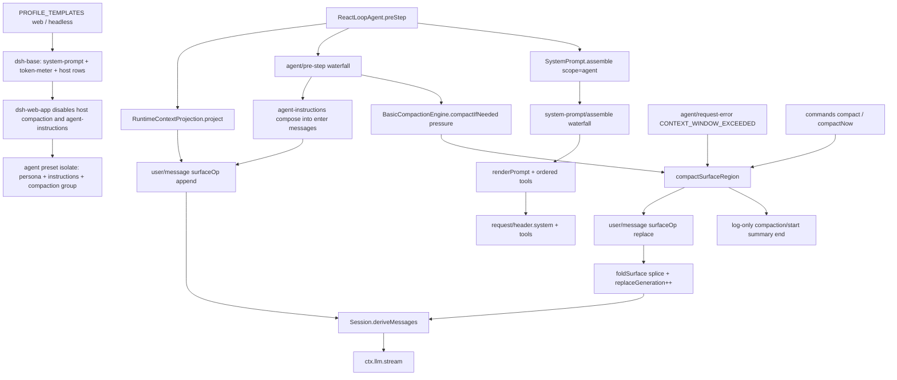

> 每一步发给模型的 `system` / tools / runtime snapshot 由 host 上的 `ctx.systemPrompt.assemble()` 装配；工作区 `AGENTS.md` 一类经 `agent-instructions` 写成 user 角色 surface 节点；压力或 overflow 触发的 compaction 只追加 `surfaceOp: { op: 'replace', start, end }`。append-only `SessionEvent` 日志没有 delete。这是 Cordis 组合运行时的上下文管道（`profile → bundle → agent preset`），不是另一个 coding agent 的内置 history rewriter。

## 能回答的问题

- 一步模型请求里的 system prompt、tool schemas、`{{variable}}` 分别从哪条 seam 装出来？
- `dsh web` 默认路径上，`agent-instructions` / `compaction-basic` 挂在 host 面还是 agent-preset 面？
- `AGENTS.md` / `CLAUDE.md` / `$DSH_HOME/AGENTS.md` 何时、以什么 `source.kind` 进入 `deriveMessages()`？
- `thresholdRatio` / `retainRatio` 默认值是多少？压力触发与 `CONTEXT_WINDOW_EXCEEDED` 恢复差在哪？
- 成功压缩落地时，哪些事件只有日志、哪一条才改 surface？为什么没有 delete？
- 人命令 `/compact` 与 step 边界自动压缩如何共用 `compactSurfaceRegion`？

## 端到端步骤

1. `PROFILE_TEMPLATES@packages/boot/app-boot/src/profile.ts` 把默认安装拆成两条进程组合：`web` = `dsh-base` + `dsh-web-app`；`headless` = `dsh-base` + `dsh-headless`。`dsh web` 是默认产品面（本地 Web GUI），不是 TUI。 [E: packages/boot/app-boot/src/profile.ts:115]

2. `dsh-base@packages/bundle/base/cordis.patch.yml` 在 host 面插入 `system-prompt`（部署 persona 槽，默认空串）、`token-meter`、`agent-instructions`（`maxBytes: 65536`）、`compaction-basic`、`command-compact`、`tool-result-pruner`。`ctx.systemPrompt` 与 `ctx.tokenMeter` 是进程级 registry / 计量器。 [E: packages/bundle/base/cordis.patch.yml:235] [E: packages/bundle/base/cordis.patch.yml:285] [E: packages/bundle/base/cordis.patch.yml:432]

3. `dsh-web-app@packages/bundle/web-app/cordis.patch.yml` 把 host 上的 `compaction-basic`、`command-compact`、`tool-result-pruner`、`agent-instructions` 标 `disabled: true`。多会话 Web 不允许这些服务落在 root realm：第二个 session 会撞名，且浏览器读到的 meter 投影必须跟「当前挂了哪个 preset」解耦。 [E: packages/bundle/web-app/cordis.patch.yml:359] [E: packages/bundle/web-app/cordis.patch.yml:402]

4. `standard` / `code` / `cordis` 的 `agent.cordis.yml` 在 **agent-preset 面** 重新挂回：`dsh-persona` 用同名 `deployment:persona` 遮蔽 host 槽；`agent-instructions` 再写一遍 `maxBytes: 65536`；`compaction` 组 `isolate.compaction` + `isolate.toolResultPruner`，组内是 `compaction-basic` + `command-compact` + `tool-result-pruner`。`tokenMeter` 故意不进 isolate，解析 host 那一个实例。`minimal` 不挂 compaction 组，并把 persona 标 `complete: true`、关掉 runtime snapshot。 [E: apps/cli/config/agent-presets/standard/agent.cordis.yml:141] [E: apps/cli/config/agent-presets/standard/agent.cordis.yml:145] [E: apps/cli/config/agent-presets/code/agent.cordis.yml:152] [E: apps/cli/config/agent-presets/cordis/agent.cordis.yml:133] [E: packages/preset/persona/src/index.ts:62] [E: apps/cli/config/agent-presets/minimal/agent.cordis.yml:12] [E: apps/cli/config/agent-presets/minimal/agent.cordis.yml:13]

5. `SystemPrompt@packages/core/system-prompt/src/index.ts` 构造时注册两个内置 section：`harness:identity`（`order: -100`，默认真）与 `PERSONA_SECTION = 'deployment:persona'`（`order: 0`）。插件用 `section` / `context` / `tools` / `variable` 往 global 或 agent scope 层投递；同名 scoped 条目遮蔽 global。 [E: packages/core/system-prompt/src/index.ts:128] [E: packages/core/system-prompt/src/index.ts:361] [E: packages/core/system-prompt/src/index.ts:365]

6. `ReactLoopAgent.preStep@packages/core/agent-loop/src/agent.ts` 每步先 `systemPrompt.assemble(assembleContextFor(this, signal))`。`assembleContextFor` 把 `agent` 与 `scope: agent` 绑在一起，避免只传 agent 却丢掉 scope 过滤。 [E: packages/core/agent-loop/src/agent.ts:230] [E: packages/core/agent/src/dispatch.ts:175]

7. `SystemPrompt.assemble@packages/core/system-prompt/src/index.ts` 合并 scope 链：variables 近者覆盖远者；sections / contexts 按 `order` 排序；tool providers 收集 schema 后走 `toolOrder` 或字典序。然后跑 `system-prompt/assemble` waterfall。若存在恰好一个 `complete: true` section，waterfall 之后把它恢复成**唯一** prompt section（`minimal` 靠这条把 identity / 工具说明全部裁掉）。多个 complete 直接抛错。 [E: packages/core/system-prompt/src/index.ts:533] [E: packages/core/system-prompt/src/index.ts:539]

8. `ReactLoopAgent.step@packages/core/agent-loop/src/agent.ts` 用 `renderPrompt(assembly)` 得到 `system` 字符串（严格插值 `{{name}}`，空 section 丢弃，段间空行拼接）。`dsh-agent-loop` 在 factory 上注册 `provider` / `model` / `cwd` 三个变量，所以 preset persona 里的 `{{model}}` / `{{cwd}}` 有值。`assembly.tools` 原样进入请求信封。 [E: packages/core/agent-loop/src/agent.ts:337] [E: packages/core/agent-loop/src/index.ts:352]

9. 同一 `preStep` 把 `renderContextSections(assembly)` 交给 `RuntimeContextProjection.project`：动态 `PromptContext`（sandbox policy、approval 等）合成一条 user 角色 snapshot，文案以 `Current runtime context. This snapshot supersedes…` 开头；文本没变就不再投。这条 snapshot 与 inbox 声明一起进入 `agent/pre-step` 的默认 `enter` 决策。 [E: packages/core/agent-loop/src/agent.ts:233] [E: packages/core/agent-loop/src/runtime-context.ts:68] [E: packages/core/system-prompt/src/index.ts:239]

10. `apply@packages/context/agent-instructions/src/index.ts` 也挂在 `agent/pre-step`：先 `next()` 拿到内层决策，再 `compose` 工作区指令。`compose` 要求 `maxBytes > 0` 且 `ctx.fs` 存在；从 session `cwd` 向上找第一个 `.git`（可配）作为 project root，加载 user-global `$DSH_HOME/AGENTS.md`，再沿 root→cwd 目录链加载 `AGENTS.md` / `CLAUDE.md` 及其 `.local` overlay。同目录 trimmed 内容去重，UTF-8 字节预算裁切后包进 `<system-reminder>`。 [E: packages/context/agent-instructions/src/index.ts:326] [E: packages/context/agent-instructions/src/index.ts:329] [E: packages/context/agent-instructions/src/config.ts:11] [E: packages/context/agent-instructions/src/config.ts:12] [E: packages/context/agent-instructions/src/files.ts:185] [E: packages/context/agent-instructions/src/render.ts:98] [E: packages/context/agent-instructions/src/render.ts:242]

11. 指令**不是** system section。`compose` 产出的是 `createUserMessage`，`source.kind === 'agent-instructions'`（baseline 还带 `baseline: true` 与 `baselineIdentity`）。`pre-step` 把它插到 claimed 用户消息之后、loop 追加的 runtime snapshot 之前；随后 `ReactLoopAgent` 以 `surfaceOp: 'append'` 写入 log。成功的 `read` / `write` / `edit`（参数含 `file_path`）在 `step/end` 后异步 reconcile 嵌套或变更的指令。 [E: packages/context/agent-instructions/src/index.ts:215] [E: packages/context/agent-instructions/src/index.ts:347] [E: packages/context/agent-instructions/src/index.ts:70] [E: packages/core/agent-loop/src/agent.ts:283]

12. `ReactLoopAgent.buildRequest@packages/core/agent-loop/src/agent.ts` 把 `system` + tools 打进 `request/header`，`messages` 取 `session.deriveMessages()`。模型看见的历史 = 当前 surface 折叠，不是整本 log。`model-visible ⟺ logged`：能进请求的 system / tools 也落在 `request/header`；能进 messages 的节点必须带着 `surfaceOp`。 [E: packages/core/agent-loop/src/agent.ts:341] [E: packages/core/agent-loop/src/agent.ts:488] [E: packages/core/session/src/index.ts:726]

13. `BasicCompactionEngine._registerAutomaticCompaction@packages/compaction/compaction-basic/src/index.ts` 在 `config.auto ?? true` 时监听 `agent/pre-step`：先 `compactIfNeeded(agent, 'pressure')` 再 `next()`。压力失败只 warn，继续本 turn。另一条 `agent/request-error` 只认 `failure.code === CONTEXT_WINDOW_EXCEEDED_CODE`。 [E: packages/compaction/compaction-basic/src/config.ts:95] [E: packages/compaction/compaction-basic/src/index.ts:153] [E: packages/compaction/compaction-basic/src/index.ts:183]

14. `resolveConfig@packages/compaction/compaction-basic/src/config.ts` 的服务默认是 `thresholdRatio = 0.8`、`retainRatio = 0.16`（互斥的 `retainTokens` 可覆盖后者）、`maxTokens = 8192`、`compactionRetries = 1`、`maxOverflowRetries = 1`。`resolveCompactSpec` 把比例乘到该路由的 `contextWindow` 上：`thresholdTokens = floor(window × 0.8)`，`retainTokens = floor(window × 0.16)`。测试把空配置钉死在这组数。 [E: packages/compaction/compaction-basic/src/config.ts:20] [E: packages/compaction/compaction-basic/src/config.ts:23] [E: packages/compaction/compaction-basic/src/config.ts:144] [E: packages/compaction/compaction-basic/tests/compaction-basic.spec.ts:292]

15. `compactIfNeeded@packages/compaction/compaction-basic/src/index.ts` 没有已路由 `provider/model` 时直接 `null`。`pressure`：用 host `ctx.tokenMeter.measure(session).totalTokens` 与 `thresholdTokens` 比较；可选 `ctx.get('toolResultPruner')` 先做 model-free 裁剪再量一次；仍超阈则按 `retainTokens` 选头段，最多 `compactionRetries + 1` 轮。`context-overflow` 跳过阈值，用 `retainTokens = 0` 逼出一段可压区间。 [E: packages/compaction/compaction-basic/src/index.ts:264] [E: packages/compaction/compaction-basic/src/index.ts:304] [E: packages/compaction/compaction-basic/src/index.ts:288] [E: packages/llm/token-meter/src/index.ts:143]

16. `selectCompactableRange@packages/compaction/compaction-basic/src/region.ts` 从 surface 尾部累加 token，保留不少于 `retainTokens` 的近期尾巴；边界必须 `toolPairingBalancedBefore`，避免切断 assistant tool-call 与 `tool/result`。选不到（整表都得留）就 `null`。 [E: packages/compaction/compaction-basic/src/region.ts:118] [E: packages/compaction/compaction-basic/src/region.ts:124]

17. `compactSurfaceRegion@packages/compaction/compaction-basic/src/region.ts` 是唯一落地事务：校验配对边界 → 同步追加 log-only `compaction/start`（这把锁）→ 用最近一次 `requestHeader()` 的 system/tools 加上被遮挡区间的 `deriveEventMessage` 做 summarizer 前缀 → `ctx.llm.stream(..., purpose: 'compaction')` → 摘要必须比被遮挡区间更短 → 追加 log-only `compaction/summary` → **唯一的 surface 变更**：`user/message` 携带 `compactCheckpointSource(compactionId)` 与 `surfaceOp: { op: 'replace', start, end }` → `compaction/end`。自动路径 `owner: 'current-turn'` 且要求整表 surface 在摘要期间不变；`/compact` 走 `compactNow` → `runMaintenance`，`owner: null`，只要求选中 span 稳定，成功后 `sessions.flush`。 [E: packages/compaction/compaction-basic/src/region.ts:189] [E: packages/compaction/compaction-basic/src/region.ts:463] [E: packages/compaction/compaction-basic/src/index.ts:355] [E: packages/compaction/compaction-basic/src/index.ts:392] [E: packages/compaction/compaction/src/checkpoint.ts:38] [E: packages/compaction/compaction-basic/src/summarizer.ts:161] [E: packages/compaction/command-compact/src/index.ts:66]

18. `SurfaceOp@packages/core/session/src/types.ts` 只有 `'append'` 与 `{ op: 'replace'; start; end }`。只有 `user/message` / `assistant/message` / `tool/result` 属于 `SurfaceEventType`，所以 `compaction/*` 不能带 `surfaceOp`、不能上 surface。`foldSurface` 对 replace 做 `splice` 并把 `replaceGeneration` 加一；`deriveMessages` 在 generation 变化时整表重投。被遮挡的原始 surface 节点仍在 append-only log 里，只是不再进入模型历史。`ToolResultPruner.pruneSession` 同样只对单条 `tool/result` 发 `surfaceOp: { op: 'replace', start: seq, end: seq }`。 [E: packages/core/session/src/types.ts:343] [E: packages/core/session/src/types.ts:372] [E: packages/core/session/src/surface.ts:369] [E: packages/compaction/compaction-tool-result-pruner/src/index.ts:171] [E: packages/compaction/compaction/src/types.ts:23]

19. overflow 恢复看 `session.surface.replaceGeneration` 是否前进：prune 或 replace 只要落下一笔，即使后续 summary 失败也可以 `{ kind: 'retry' }`；没有 durable 进展则把原始 `CONTEXT_WINDOW_EXCEEDED` 交回。次数受 `maxOverflowRetries` 限制。这与 peer harness 在采样前改写内存 history 不同：DSH 把压缩写成可重建的 surface 事件。 [E: packages/compaction/compaction-basic/src/index.ts:201]

## 关键决策点

- **组合面，不是 loop 内置。** `CompactionEngine` 是 `ctx.compaction` Definition；`BasicCompactionEngine` 是可替换 Provider。`dsh web` 默认把 Provider 放进 preset isolate，host 只留 `tokenMeter` 与 prompt registry。换 preset（或 `minimal`）等于换「这个会话压不压、压哪套策略」，不是改 `ReactLoopAgent`。 [E: packages/compaction/compaction/src/index.ts:98]
- **默认阈值在 `resolveConfig`，不在笔记。** `thresholdRatio: 0.8`、`retainRatio: 0.16`；`retainRatio` 必须严格小于 `thresholdRatio`，否则插件加载失败。`auto` 默认 `true`。
- **落地只有 replace。** `SurfaceOp` 封闭联合没有 delete。`compaction/start|summary|end` 与 `compaction/prune` 是 log-only；模型看见的是后一条带 `surfaceOp: replace` 的 `user/message` 或裁过的 `tool/result`。
- **指令走 user 角色。** `agent-instructions` 把 `<system-reminder>` 烤进 message content，`deriveEventMessage` 对 `user/message` 原样投影。它们与 persona section 不在同一条装配缝上。
- **complete section 在 waterfall 之后强制恢复。** listeners 可以改 tools / variables，但不能把 `minimal` 的完整 persona 拼回多段 system prompt。
- **压力失败不阻断 turn；overflow 必须有 durable 进展才 retry。** 没有 `contextWindow` 的路由会抛 `TargetPressureConfigError`，同 target 只警告一次。
- **摘要调用复用对话前缀。** summarizer 不换一套 system prompt，而是 replay 被压区间的 messages 再追加 compaction instruction，目的是保住 provider KV cache。

## 指向后续 T1/T2

- [`spine.session-log`](session-log.md) — append-only log、`deriveMessages`、三类 surface 事件、`surfaceOp` 折叠细节。
- [`subsys.core.system-prompt`](../subsystems/core/system-prompt.md) — section / context / tools / variable API、`toolOrder`、`{{variable}}` 严格插值。
- [`subsys.context.compaction`](../subsystems/context/compaction.md) — `ctx.compaction` 缝、`ManualCompactionError`、`compactCheckpointSource`。
- [`subsys.context.compaction-basic`](../subsystems/context/compaction-basic.md) — 选段、事务、pruner 字符预算、summarizer 模板。
- [`subsys.context.agent-instructions`](../subsystems/context/agent-instructions.md) — 发现链、scope key、reconcile、字节预算裁切。
- [`subsys.core.agent-loop`](../subsystems/core/agent-loop.md) — `preStep` / `step` / `request/header` 与 inbox 的交接。

## Sources

- packages/core/system-prompt/src/index.ts
- packages/compaction/compaction/src/index.ts
- packages/compaction/compaction-basic/src/index.ts
- packages/context/agent-instructions/src/index.ts
- packages/compaction/compaction-basic/src/config.ts
- packages/compaction/compaction-basic/src/region.ts
- packages/compaction/compaction-basic/src/summarizer.ts
- packages/compaction/compaction-basic/tests/compaction-basic.spec.ts
- packages/compaction/compaction/src/types.ts
- packages/compaction/compaction/src/checkpoint.ts
- packages/compaction/command-compact/src/index.ts
- packages/compaction/compaction-tool-result-pruner/src/index.ts
- packages/context/agent-instructions/src/config.ts
- packages/context/agent-instructions/src/files.ts
- packages/context/agent-instructions/src/render.ts
- packages/context/agent-instructions/src/state.ts
- packages/core/agent-loop/src/agent.ts
- packages/core/agent-loop/src/index.ts
- packages/core/agent-loop/src/runtime-context.ts
- packages/core/agent/src/dispatch.ts
- packages/core/session/src/types.ts
- packages/core/session/src/surface.ts
- packages/core/session/src/index.ts
- packages/preset/persona/src/index.ts
- packages/llm/token-meter/src/index.ts
- packages/boot/app-boot/src/profile.ts
- packages/bundle/base/cordis.patch.yml
- packages/bundle/web-app/cordis.patch.yml
- apps/cli/config/agent-presets/standard/agent.cordis.yml
- apps/cli/config/agent-presets/code/agent.cordis.yml
- apps/cli/config/agent-presets/cordis/agent.cordis.yml
- apps/cli/config/agent-presets/minimal/agent.cordis.yml

## 相关

- [`spine.session-log`](session-log.md) — 会话日志与 `deriveMessages`
- [`subsys.core.system-prompt`](../subsystems/core/system-prompt.md) — system-prompt 装配
- [`subsys.context.compaction`](../subsystems/context/compaction.md) — compaction 缝
