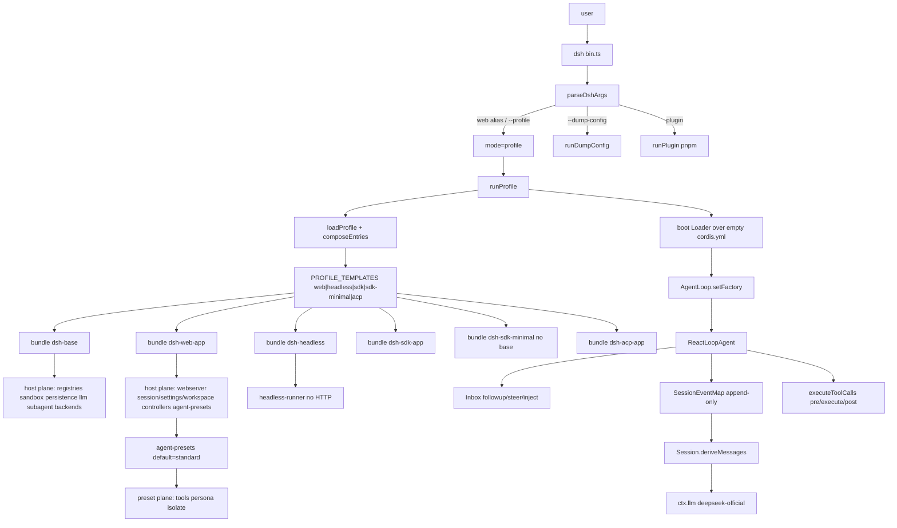

> DeepSeek Harness (`dsh`) 是 **Cordis 组合运行时**：一次进程由 `profile → bundle → agent preset` 叠成可逆插件树；能力缝是 `Definition / Provider / Consumer`；进入模型请求的内容必须能从 append-only session log 重建（`model-visible ⟺ logged`）。它不是「又一个固定工具清单 + TUI 循环」的 coding agent。

## 能回答的问题

- DSH 的产品单元是组合树还是固定 agent loop？和 Claude / Codex / Pi 那种 coding-agent 产品差在哪一层？
- `dsh web` 以及 `dsh --profile sdk|sdk-minimal|acp|headless` 如何从 CLI 走到 `profile → bundle → agent preset`？
- host 面（进程级 webserver / HTTP controllers / persistence / sandbox / subagent backends）和 agent-preset 面（每会话 tools / persona / isolate）各装什么？
- monorepo workspace 怎么切：`vendor/*`、`packages/*/*`、`apps/*`、`website`、`python/`、`native/`？
- 一次 turn 里 loop、inbox、session log、`deriveMessages()` 如何咬合？
- 默认模型路由、sandbox 失败策略、Home 目录、PTC `run_code` 分别落在哪些符号上？

## 端到端主路径

1. `package.json` 把仓标成 `@deepseek-ai/dsh-root` `0.1.3-alpha.1`，workspace 列出 `vendor/*`、`packages/*/*`、`native/landlock-run`、`apps/*`、`website`。[E: package.json:2] [E: package.json:3] [E: package.json:12] `pnpm-workspace.yaml` 的 `packages:` 再列同一组根，并补 `python/sdk-runtime`；根 `examples/` 已不在 workspace。[E: pnpm-workspace.yaml:2] [E: pnpm-workspace.yaml:6] [E: pnpm-workspace.yaml:9] [E: pnpm-workspace.yaml:10] [E: pnpm-workspace.yaml:13] 引擎是 Node `^22.19.0 || >=24.0.0`。[E: package.json:9]

2. `bin@apps/cli/package.json` 发布 `@deepseek-ai/dsh`，`bin.dsh` 指向 `lib/bin.js`。[E: apps/cli/package.json:2] [E: apps/cli/package.json:15] CLI 的 `dsh.configTrees` 把 shipped preset 扫描根指到 `packages/preset/agent-presets/presets`。[E: apps/cli/package.json:23] [E: apps/cli/package.json:24] `parseDshArgs@apps/cli/src/args.ts` 只解析 launcher 自己的 `--profile` / `--patch` / dump，其余 argv 原样交给已启动的树。[E: apps/cli/src/args.ts:112] [E: apps/cli/src/args.ts:131] `dsh web` 是硬编码 alias：`resolveBoot(..., 'web', ...)`，与 `dsh --profile web` 同一条 `mode: 'profile'`。[E: apps/cli/src/args.ts:156] [E: apps/cli/src/args.ts:168]

3. `bin.ts` 的 `switch` 只有三个 invocation：`profile` 动态 import `runProfile`，`plugin` 把剩余参数转给 profile 目录里的 pnpm，`dump-config` 走 `runDumpConfig` 且不 boot。[E: apps/cli/src/bin.ts:27] [E: apps/cli/src/bin.ts:28] [E: apps/cli/src/bin.ts:37] [E: apps/cli/src/bin.ts:42]

4. `PROFILE_TEMPLATES@packages/boot/app-boot/src/profile.ts` 只 ship 五个名字：`acp`（base + `dsh-acp-app`，`patchReload: 'startup'`）、`web`（base + `dsh-web-app`，**唯一 `live`**）、`headless`（base + `dsh-headless`，startup）、`sdk`（base + `dsh-sdk-app`，startup）、`sdk-minimal`（**仅** `dsh-sdk-minimal`，startup，不叠 base）。[E: packages/boot/app-boot/src/profile.ts:137] [E: packages/boot/app-boot/src/profile.ts:138] [E: packages/boot/app-boot/src/profile.ts:142] [E: packages/boot/app-boot/src/profile.ts:144] [E: packages/boot/app-boot/src/profile.ts:146] [E: packages/boot/app-boot/src/profile.ts:150] [E: packages/boot/app-boot/src/profile.ts:154] [E: packages/boot/app-boot/src/profile.ts:155] 无名 profile 用 `DEFAULT_PROFILE_BUNDLES = ['@deepseek-ai/dsh-base']` 与 `DEFAULT_PROFILE_PATCH_RELOAD = 'live'`。[E: packages/boot/app-boot/src/profile.ts:166] [E: packages/boot/app-boot/src/profile.ts:169] help 里的 `dsh --profile tui` 是自定义 profile 示例，不是 shipped 模板。[E: apps/cli/src/args.ts:68] 六个 bundle 包名：`dsh-base`、`dsh-web-app`、`dsh-headless`、`dsh-sdk-app`、`dsh-sdk-minimal`、`dsh-acp-app`。[E: packages/bundle/base/package.json:2] [E: packages/bundle/web-app/package.json:2] [E: packages/bundle/headless/package.json:2] [E: packages/bundle/sdk-app/package.json:2] [E: packages/bundle/sdk-minimal/package.json:2] [E: packages/bundle/acp-app/package.json:2]

5. `loadProfile` 在 `$DSH_HOME/profiles/<name>` 读 manifest；目录不存在且名字命中模板时 `initProfile`；未知名字 fail-loud。[E: packages/boot/app-boot/src/profile.ts:806] [E: packages/boot/app-boot/src/profile.ts:810] [E: packages/boot/app-boot/src/profile.ts:813] 每层 bundle 必须在自己的 `package.json` 声明 `dsh.bundle.patch`，缺了就 fail-loud。[E: packages/boot/app-boot/src/profile.ts:832] [E: packages/bundle/base/package.json:33] `composeEntries` 从空 `[]` 上 `applyEntryPatches`。[E: packages/boot/app-boot/src/profile.ts:854] [E: packages/boot/app-boot/src/profile.ts:857] 已有 `headless` 目录若仍是旧三元组 `dsh-base` + `dsh-web-app` + `dsh-headless`，会被 rewrite 成当前两 bundle 模板；当前 `headless` 不叠 `dsh-web-app`。[E: packages/boot/app-boot/src/profile.ts:161] [E: packages/boot/app-boot/src/profile.ts:162]

6. `composeProfile@apps/cli/src/profile-boot.ts` 叠层顺序是：各 bundle 的 patch → profile 自己的 `cordis.patch.yml` → `$DSH_HOME/cordis.patch.yml` → `--patch` overlays（再加 telemetry 开关）。[E: apps/cli/src/profile-boot.ts:139] [E: apps/cli/src/profile-boot.ts:167] `runProfile` 把该栈交给 `boot`，并在任何 config 行挂上之前 `provide` 启动环境与 `cmdlineArgs`。[E: apps/cli/src/profile-boot.ts:264] [E: apps/cli/src/profile-boot.ts:271] `patchReload === 'live'` 时才 `watchUserPatches`（profile 与 home 两份 yml）；`startup` 只在 boot 叠一次。[E: apps/cli/src/profile-boot.ts:283] [E: apps/cli/src/profile-boot.ts:287]

7. `boot@packages/boot/app-boot/src/index.ts` 新建根 `Context`，挂 Loader，再 include 空 `cordis.yml`。[E: packages/boot/app-boot/src/index.ts:790] [E: packages/boot/app-boot/src/index.ts:797] `runDumpConfig` 用同一套 layer 标签打印真树并写 stdout，不调用 `boot`。[E: apps/cli/src/dump-config.ts:30] profile 根文件名是 `cordis.yml`，`PROFILE_ROOT_CONFIG` 的 YAML 正文是空数组。[E: apps/cli/src/profile-boot.ts:81] [E: apps/cli/src/profile-boot.ts:84] [E: apps/cli/src/profile-boot.ts:88]

8. `@deepseek-ai/dsh-base` 是每个 **base-backed** profile 的第一层 insert：`llm` / `session` / JSONL session persistence / `agent` / `sandbox` / `sandbox-policy` / `tools` / `system-prompt` / `agent-loop` / `llm-deepseek` / `llm-pi-ai` / `subagent` + spawn/fork 后端。[E: packages/bundle/base/cordis.patch.yml:110] [E: packages/bundle/base/cordis.patch.yml:211] [E: packages/bundle/base/cordis.patch.yml:335] [E: packages/bundle/base/cordis.patch.yml:471] [E: packages/bundle/base/cordis.patch.yml:476] [E: packages/bundle/base/cordis.patch.yml:483] [E: packages/bundle/base/cordis.patch.yml:497] `dsh-web-app` 在此之上加 host 面：`webserver`（默认 `127.0.0.1:3080`）、`agent-presets`（`default: standard`）。[E: packages/bundle/web-app/cordis.patch.yml:116] [E: packages/bundle/web-app/cordis.patch.yml:120] [E: packages/bundle/web-app/cordis.patch.yml:446] [E: packages/bundle/web-app/cordis.patch.yml:449] `dsh-headless` 的 `insert` 是 `code-runtime` + `headless-startup` + `headless-runner`，没有 `webserver` 行。[E: packages/bundle/headless/cordis.patch.yml:19] [E: packages/bundle/headless/cordis.patch.yml:22] [E: packages/bundle/headless/cordis.patch.yml:26]

9. `dsh-web-app` 把 `dsh-base` 里模型可见的 tool 行（`tool-subagent`、`tool-fs`、`tool-bash` 等）标 `disabled: true`，把它们从进程根挪到 preset 面。[E: packages/bundle/web-app/cordis.patch.yml:330] [E: packages/bundle/web-app/cordis.patch.yml:333] shipped 成员资格以 `packages/preset/agent-presets/presets/{minimal,standard,ptc,cordis}/agent.cordis.yml` 为准：`standard` 挂 `dsh-tool-bash` / fs / subagent(`toolName: subagent`) / `subagent_fork`。[E: packages/preset/agent-presets/presets/standard/agent.cordis.yml:44] [E: packages/preset/agent-presets/presets/standard/agent.cordis.yml:56] [E: packages/preset/agent-presets/presets/standard/agent.cordis.yml:180] [E: packages/preset/agent-presets/presets/standard/agent.cordis.yml:192] [E: packages/preset/agent-presets/presets/standard/agent.cordis.yml:196] `ptc`（旧名 code preset；wiki id `surface.presets.code` 仍作别名）另加 `dsh-agent-tool-presentation` 的 `mode: ptc`；同文件里 `tool-workflow` 为 `disabled: true`（engine 留给 `ralph`）。[E: packages/preset/agent-presets/presets/ptc/agent.cordis.yml:233] [E: packages/preset/agent-presets/presets/ptc/agent.cordis.yml:237] [E: packages/preset/agent-presets/presets/ptc/agent.cordis.yml:268] [E: packages/preset/agent-presets/presets/ptc/agent.cordis.yml:271] `cordis` 另加 `dsh-tool-cordis`。[E: packages/preset/agent-presets/presets/cordis/agent.cordis.yml:251] `minimal` 用 isolate 域挂 persistent bash/pwsh + `str-replace-editor`。[E: packages/preset/agent-presets/presets/minimal/agent.cordis.yml:21] [E: packages/preset/agent-presets/presets/minimal/agent.cordis.yml:36] [E: packages/preset/agent-presets/presets/minimal/agent.cordis.yml:58] [E: packages/preset/agent-presets/presets/minimal/agent.cordis.yml:85] `SHIPPED_PRESET_ROOT` 解析到包内 `presets/`，roster 以 `trust: 'system'` 预置该根。[E: packages/preset/agent-presets/src/discovery.ts:60] [E: packages/preset/agent-presets/src/index.ts:179]

10. `AgentPresets` 把每个 preset 的 `agent.cordis.yml` 做成 standing mount：`standing` Map 按 preset id 单飞，再 `bindScopeParent` 把 agent scope 接到这份 mount。[E: packages/preset/agent-presets/src/index.ts:100] [E: packages/preset/agent-presets/src/index.ts:391] `leakedServices` 若发现 process-global service 就抛错，要求 preset 服务坐在 `isolate` realm 或搬到 host。[E: packages/preset/agent-presets/src/mount.ts:210] [E: packages/preset/agent-presets/src/mount.ts:408]

11. 运行时内核是 vendored `@deepseek-ai/cordis`。[E: vendor/cordis/package.json:2] `Fiber.effect` 登记可逆 effect；dispose 对 `disposables` 倒序执行。[E: vendor/cordis/src/fiber.ts:419] [E: vendor/cordis/src/fiber.ts:431] `Events.waterfall` 把最后一个参数当 innermost `next`：监听器必须调用传入的 `next()` 才会 `shift` 到下一个 callback；不调用就停在本层。注册监听本身走 `fiber.effect`。[E: vendor/cordis/src/events.ts:237] [E: vendor/cordis/src/events.ts:238] [E: vendor/cordis/src/events.ts:256]

12. `AgentRegistry` 挂 `ctx.agents`，拥有 live 表与 factory 槽。[E: packages/core/agent/src/index.ts:250] 默认工厂是 `AgentLoop`：`ctx.effect(() => ctx.agents.setFactory(this))` 把它自己装进去，所以换掉 `agent-loop` 那一行就换掉驱动。[E: packages/core/agent-loop/src/index.ts:359] [E: packages/core/agent-loop/src/index.ts:420] 工厂在 session 就绪后 `new ReactLoopAgent(...)`。[E: packages/core/agent-loop/src/index.ts:645]

13. `ReactLoopAgent` 实现 `Agent` 合同。[E: packages/core/agent-loop/src/agent.ts:70] inbox 三入口：`followup` → `next-turn` 且 wakeup；`steer` → `next-step` 且 wakeup；`inject` → `next-step` 且不 wakeup。[E: packages/core/agent-loop/src/agent.ts:134] [E: packages/core/agent-loop/src/agent.ts:138] [E: packages/core/agent-loop/src/agent.ts:142] `Inbox` 状态键就是 `'next-turn' | 'next-step'`。[E: packages/core/agent/src/inbox.ts:26] phase 是 `idle` / `maintenance` / `running`。[E: packages/core/agent-loop/src/agent.ts:40] [E: packages/core/agent-loop/src/agent.ts:42] [E: packages/core/agent-loop/src/agent.ts:47] 每步先 `inbox.claim`，再 `systemPrompt.assemble`，再 `agent/pre-step` waterfall。[E: packages/core/agent-loop/src/agent.ts:241] [E: packages/core/agent-loop/src/agent.ts:242] [E: packages/core/agent-loop/src/agent.ts:247]

14. `SessionEventMap` 是 append-only 会话事件的类型地图；`SESSION_FORMAT_VERSION` 现为 `2`（v0→v1→v2 adjacent 链由 `dsh-session-format` + catalog 在 JSONL load 时执行）。[E: packages/core/session/src/types.ts:86] 模型可见 surface 只有三类：`user/message` / `assistant/message` / `tool/result`。[E: packages/core/session/src/surface.ts:23] [E: packages/core/session/src/types.ts:387] `Session.deriveMessages()` 按 `surfaceOp` 走 surface；`surfaceOp !== 'append'` 的节点是 replace。[E: packages/core/session/src/index.ts:820] [E: packages/core/session/src/types.ts:416] loop 在 `llm/stream` 上装 invariant：`options.messages` 必须等于 `session.deriveMessages()`，否则 fail `log-reconstruction desync`。[E: packages/core/agent-loop/src/invariant.ts:39] [E: packages/core/agent-loop/src/invariant.ts:41]

15. 工具走 `executeToolCalls`，底层 registry 事件是 `tools/pre-execute` → `tools/execute` → `tools/post-execute`（均为 waterfall，必须 `next()`）。[E: packages/core/agent-loop/src/tool-calls.ts:60] [E: packages/core/tools/src/index.ts:144] [E: packages/core/tools/src/index.ts:155] [E: packages/core/tools/src/index.ts:167] `apply@session-checkpoint-policy` 在 adapter 看到流之前 `sessions.flush`，并在 top-level `tools/execute` 进入 tool body 之前再 flush；取消则返回 aborted-before-dispatch，不跑副作用。[E: packages/session/session-checkpoint-policy/src/index.ts:64] [E: packages/session/session-checkpoint-policy/src/index.ts:70] [E: packages/session/session-checkpoint-policy/src/index.ts:72] PTC（旧名 Code Mode；wiki id `subsys.core.code-mode` 仍作别名）权威文件是 `ptc.ts`：模型可见名 `run_code`，语言 `'typescript' | 'python'`。[E: packages/core/tools/src/ptc.ts:20] [E: packages/core/tools/src/ptc.ts:79]

16. LLM：`dsh-llm-deepseek` 把唯一 route `deepseek-official` `registerAdapter` 到 `ctx.llm`。[E: packages/llm/llm-deepseek/src/index.ts:90] [E: packages/llm/llm-deepseek/src/index.ts:476] `agent-default-model` 默认 `provider: deepseek-official` / `model: deepseek-v4-flash`。[E: packages/bundle/base/cordis.patch.yml:75] [E: packages/bundle/base/cordis.patch.yml:78] [E: packages/bundle/base/cordis.patch.yml:79] `dsh-llm-pi-ai` 始终挂上，但 `routes.length === 0` 时保持 dormant，直到 Settings 写入 profile。[E: packages/llm/llm-pi-ai/src/index.ts:284]

17. 能力缝在 `ctx` 上是三角角色。`dsh-fs` 只声明 `ctx.fs: FileSystem`（Definition）。[E: packages/fs/fs/src/index.ts:46] `dsh-fs-sandbox` 是 base 挂上的 Provider。[E: packages/bundle/base/cordis.patch.yml:490] `dsh-tool-fs` 是 Consumer：`dsh-web-app` 把它 `disabled: true`；`standard` / `ptc` / `cordis` 在 preset 再挂。[E: packages/preset/agent-presets/presets/standard/agent.cordis.yml:56] `dsh-sandbox` 定义 `SANDBOX_UNAVAILABLE`：请求了受限 mode 但没有可用 backend 时 fail-closed，不静默裸跑。[E: packages/sandbox/sandbox/src/index.ts:124] [E: packages/sandbox/sandbox/src/index.ts:140] `SandboxMode` 是 `read-only` / `workspace-write` / `danger-full-access`。[E: packages/sandbox/sandbox/src/index.ts:29] Home 是 `resolveDshHome`：显式路径，否则非空 `$DSH_HOME`，否则 `~/.dsh`。[E: packages/util/home-paths/src/index.ts:12] [E: packages/util/home-paths/src/index.ts:87]

18. `dsh-base` 测试钉死当前 **不** 把 Codex / Claude 子代理当 dormant 行装进 base：patch 里没有 `subagent-codex` / `subagent-claude-code`，manifest 也不依赖那两个包。[E: packages/bundle/base/tests/base.spec.ts:42] [E: packages/bundle/base/tests/base.spec.ts:43] [E: packages/bundle/base/tests/base.spec.ts:47] preset 里对应 tool 行是 `disabled: true`。[E: packages/preset/agent-presets/presets/standard/agent.cordis.yml:203] [E: packages/preset/agent-presets/presets/standard/agent.cordis.yml:205]

19. Web host HTTP 不再有 `packages/host/apiproxy`。进程级入口是 `ctx.webServer`（`@deepseek-ai/dsh-host-webserver`）加上三个 Typert Remote controller；Session 面是 `ctx.sessionController` / namespace `'session'`。[E: packages/host/webserver/src/index.ts:24] [E: packages/api/session-controller/src/index.ts:62] [E: packages/api/session-controller/src/index.ts:115] 浏览器半边入口是 `AppWebEntry`（`packages/client/web/src/boot.ts`），状态引擎在 `@deepseek-ai/dsh-client-store`；已删除的 `packages/client/runtime` / `packages/client/web-react` 不要再当 source。[E: packages/client/web/src/boot.ts:22] [E: packages/client/store/package.json:2]

## 仓库地图

pnpm workspace 把仓切成这些运行时相关根：

| 根 | 角色 | 入口证据 |
|---|---|---|
| `vendor/*` | 钉死的 Cordis 源（`@deepseek-ai/cordis` 及 loader / include / hmr / schemastery / cosmokit） | [E: pnpm-workspace.yaml:2] [E: vendor/cordis/package.json:2] |
| `packages/*/*` | `@deepseek-ai/dsh-<pkg>`，按 group 目录分（`core/`、`bundle/`、`host/`、`client/`、`llm/`、`api/`…） | [E: package.json:13] |
| `apps/*` | 产品装配：`@deepseek-ai/dsh` CLI；`@deepseek-ai/dsh-web-frontend` 是 Vite 前端，dist 由 `dsh web` 提供 | [E: apps/cli/package.json:2] [E: apps/web/package.json:2] |
| `website` | `@deepseek-ai/website` VitePress，投影官方 `docs/`，不是运行时 | [E: website/package.json:2] |
| `python/` | Python SDK + 打包运行时；workspace 成员只有 `python/sdk-runtime` | [E: pnpm-workspace.yaml:13] [E: python/sdk-runtime/package.json:2] |
| `native/` | Landlock launcher 源；workspace 含 `native/landlock-run` 及其 packages | [E: pnpm-workspace.yaml:6] |

`packages/README.md` 用 group 表描述职责（core 是 product API spine，host/client 是 Web GUI 两半，bundle 是 `--profile` patch 层）。包级索引留给 `ref.package-index`。

## host 面与 agent-preset 面

host 面是**进程级**组合，由 profile 的 bundle 栈装上，对所有会话共享：

- 注册表与驱动：`ctx.agents`、`ctx.agentLoop`、`ctx.sessions`、`ctx.tools`、`ctx.systemPrompt`、`ctx.llm`
- 执行世界：`ctx.fs`、`ctx.sandbox`、`ctx.subprocess`、approval / permission
- 持久化与检查点：shipped session 盘只有 JSONL（`id: session-persistence-jsonl`；`SessionHandle` 缝；SQLite session persistence 包已删除）、`session-checkpoint-policy`
- 子代理 **backends**（`subagent-spawn-in-process` / `subagent-fork-in-process`）与 registry
- Web host：`dsh-host-webserver`、`dsh-api-session-controller` / `settings-controller` / `workspace-controller`、frontend static、plugin inventory
- 非 web 的 shipped 入口：`dsh --profile headless`（one-shot）、`dsh --profile sdk` / `sdk-minimal`（JSON-RPC）、`dsh --profile acp`（ACP stdio）

agent-preset 面是**每会话**对那些注册表的贡献，来源是 `agent.cordis.yml`：

- 模型可见 tools（`dsh-tool-bash`、`dsh-tool-fs`、`subagent` / `subagent_fork`、PTC 下的 `run_code`…）
- persona / `dsh-agent-instructions` / plan-mode section
- 必须 `isolate` 的私有服务（`compaction`、`planMode`、`terminals`、`workflowEngine`）

`dsh-web-app` 禁用 base 上的模型可见 tool 行，再由 `agent-presets` 按会话挂回，避免多会话共享一份 tool 注册。`headless` 没有 webserver，但仍走同一套 base host 能力 + 调用方选定的 preset。`sdk-minimal` 是唯一不叠 `dsh-base` 的 shipped bundle。

相对 peer：Claude / Pi / Codex 的脊柱是「一个产品 loop + 固定工具表」；DSH 的脊柱是「先叠树，再让可替换的 `AgentLoop` 在树上跑」。产品版本 `0.1.3-alpha.1`。五个 shipped profile 名字没变：`web`（live）与 `headless` / `sdk` / `sdk-minimal` / `acp`（startup）。默认用户路径是 `npx @deepseek-ai/dsh web` / `pnpm dsh web`，同时 CLI 还接受 `dsh --profile sdk|sdk-minimal|acp|headless`，不是 shipped TUI。

## 关键决策点

- **空根 + 整行替换**：profile 的 `cordis.yml` 永远是 `[]`。后一层 patch 按 `id` 整份替换 `config`，不 merge。所以 mode 相关值（persona、tools.mode、webserver host）不进 `dsh-base`，留给 `dsh-web-app` / `dsh-headless` / `dsh-sdk-app` 等。看真树用 `dsh --profile web --dump-config`。
- **factory 可替换，合同不可丢**：`ctx.agents` 是合同与 inbox / 事件；`ctx.agentLoop` 是默认 `ReactLoopAgent` 工厂。新行为优先挂 `agent/*` 与 `tools/*` waterfall，而不是改 loop 源码。
- **model-visible ⟺ logged**：新的模型可见输入必须扩展 `SessionEventMap` 并从 log 投影。`deriveMessages()` 是唯一历史源；invariant 在 `llm/stream` 上比对。compaction 只有 `surfaceOp: replace`，没有 delete。会话格式现为 `SESSION_FORMAT_VERSION = 2`，JSONL load 走 v0→v1→v2 adjacent migration。
- **sandbox 只罩文件副作用**：`SandboxMode` 是 `read-only` / `workspace-write` / `danger-full-access`。不可用则 `SANDBOX_UNAVAILABLE`。
- **preset 成员资格看 yml 不看 package 存在**：包在 workspace 里不等于产品默认装上。四个 shipped 目录是 `minimal` / `standard` / `ptc` / `cordis`。Codex / Claude 子代理包可以存在，但 `dsh-base` 测试要求它们不在 base 依赖与 patch 行里。
- **Home 单根**：`$DSH_HOME` 否则 `~/.dsh`。profile、settings、sessions、用户 preset（`$DSH_HOME/.agent-presets`）都挂在这棵根下。
- **PTC**：`presentAs('ptc')` 时模型直连只能打 `run_code`；SDK 子调用再经 `TOOL_RUNTIME_SCHEDULER` 进原生工具。权威实现 `packages/core/tools/src/ptc.ts`。

## 指向后续 T1/T2

- `spine.composition-boot` — 空入口表如何叠 bundle / home / `--patch`；`PROFILE_TEMPLATES`；`dsh --dump-config`。
- `spine.turn-and-step` — turn = 0..n step；inbox `followup` / `steer` / `inject`；phase `idle` / `maintenance` / `running`。
- `spine.tool-call-anatomy` — `executeToolCalls` 与 `tools/pre-execute → execute → post-execute`；approval / sandbox 挂点。
- `spine.session-log` — `SessionEventMap`、`deriveMessages()`、`surfaceOp`、checkpoint 两个落点。
- `spine.capability-seams` — Definition / Provider / Consumer；换一条 seam 带走哪些 consumer。
- `spine.context-and-compaction` — prompt sections、workspace 指令、compaction 触发与 `replace`。
- `spine.trace-web-first-prompt` — `dsh web` 到第一轮 turn 结束。
- `spine.trace-headless-turn` — `dsh --profile headless` 从 argv 到进程退出。
- `surface.presets.overview` — `minimal` / `standard` / `ptc` / `cordis` 成员表（`surface.presets.code` 仍是 PTC 页的稳定 id）。
- `surface.web.workbench` — 浏览器半边与 host HTTP API。
- `surface.profiles.headless` — 无 server 的 one-shot runner。
- `subsys.composition.app-boot` — `loadProfile` / `composeEntries` / `boot` 细节。
- `subsys.core.agent-loop` — `AgentLoop` / `ReactLoopAgent` 内部调度。
- `subsys.core.code-mode` — PTC / `run_code`（source 已迁到 `ptc.ts`）。
- `subsys.host.apiproxy` — 现为三个 `packages/api/*-controller` + webserver（包 id 稳定，包已删除）。
- `ref.package-index` — monorepo 包与 group 全表。
- `ref.glossary` — profile / bundle / preset / seam / surface 词条。

## Sources

- package.json
- pnpm-workspace.yaml
- apps/cli/package.json
- apps/cli/src/bin.ts
- apps/cli/src/args.ts
- apps/cli/src/profile-boot.ts
- apps/cli/src/dump-config.ts
- packages/boot/app-boot/src/profile.ts
- packages/boot/app-boot/src/index.ts
- packages/bundle/base/package.json
- packages/bundle/base/cordis.patch.yml
- packages/bundle/base/tests/base.spec.ts
- packages/bundle/web-app/package.json
- packages/bundle/web-app/cordis.patch.yml
- packages/bundle/headless/package.json
- packages/bundle/headless/cordis.patch.yml
- packages/bundle/sdk-app/package.json
- packages/bundle/sdk-minimal/package.json
- packages/bundle/acp-app/package.json
- packages/preset/agent-presets/src/index.ts
- packages/preset/agent-presets/src/mount.ts
- packages/preset/agent-presets/src/discovery.ts
- packages/preset/agent-presets/presets/minimal/agent.cordis.yml
- packages/preset/agent-presets/presets/standard/agent.cordis.yml
- packages/preset/agent-presets/presets/ptc/agent.cordis.yml
- packages/preset/agent-presets/presets/cordis/agent.cordis.yml
- packages/core/agent/src/index.ts
- packages/core/agent/src/inbox.ts
- packages/core/agent-loop/src/index.ts
- packages/core/agent-loop/src/agent.ts
- packages/core/agent-loop/src/invariant.ts
- packages/core/agent-loop/src/tool-calls.ts
- packages/core/session/src/index.ts
- packages/core/session/src/surface.ts
- packages/core/session/src/types.ts
- packages/core/tools/src/index.ts
- packages/core/tools/src/ptc.ts
- packages/session/session-checkpoint-policy/src/index.ts
- packages/util/home-paths/src/index.ts
- packages/llm/llm-deepseek/src/index.ts
- packages/llm/llm-pi-ai/src/index.ts
- packages/fs/fs/src/index.ts
- packages/sandbox/sandbox/src/index.ts
- packages/host/webserver/src/index.ts
- packages/api/session-controller/src/index.ts
- packages/client/web/src/boot.ts
- packages/client/store/package.json
- vendor/cordis/package.json
- vendor/cordis/src/events.ts
- vendor/cordis/src/fiber.ts
- apps/web/package.json
- website/package.json
- python/sdk-runtime/package.json
- packages/README.md

## 相关

- [spine.composition-boot](composition-boot.md) — 组合启动：空入口表叠 bundle / home / `--patch`。
- [spine.turn-and-step](turn-and-step.md) — turn 与 step：可替换 loop、inbox、phase。
- [ref.package-index](../reference/package-index.md) — monorepo 包与 group 索引。
- [ref.glossary](../reference/glossary.md) — profile / bundle / preset / seam / surface 术语。
