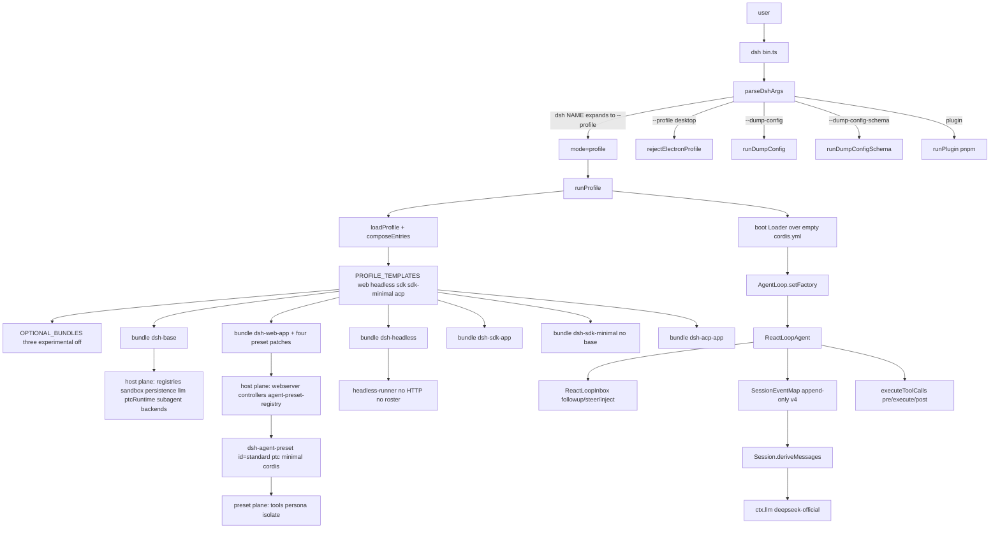

> DeepSeek Harness (`dsh`) 是 **Cordis 组合运行时**：一次进程由 `profile → bundle → agent preset` 叠成可逆插件树；能力缝是 `Definition / Provider / Consumer`；进入模型请求的内容必须能从 append-only session log 重建（`model-visible ⟺ logged`）。它不是「又一个固定工具清单 + TUI 循环」的 coding agent。产品版本 `0.1.7-rc.2`。[E: package.json:3]

## 能回答的问题

- DSH 的产品单元是组合树还是固定 agent loop？和 Claude / Codex / Pi 那种 coding-agent 产品差在哪一层？
- `dsh web` / `dsh headless` 以及 `dsh --profile sdk|sdk-minimal|acp|headless` 如何从 CLI 走到 `profile → bundle → agent preset`？`desktop` 为什么不是第六个 CLI profile？
- host 面（进程级 webserver / HTTP controllers / persistence / sandbox / subagent backends）和 agent-preset 面（每会话 tools / persona / isolate）各装什么？四个 shipped preset 为什么只叠在 `dsh-web-app`？
- monorepo workspace 怎么切：`vendor/*`、`packages/*/*`、`apps/*`、`website`、`python/`、`native/`？
- 一次 turn 里 loop、inbox、session log、`deriveMessages()` 如何咬合？`SESSION_FORMAT_VERSION` 为什么是 `4`？
- 默认模型路由、sandbox 失败策略、Home 目录、PTC `run_code` / `ctx.ptcRuntime` 分别落在哪些符号上？

```mermaid
flowchart TD
  User["user"] --> Bin["dsh bin.ts"]
  Bin --> Parse["parseDshArgs"]
  Parse -->|"dsh NAME expands to --profile"| ProfileMode["mode=profile"]
  Parse -->|"--profile desktop"| Reject["rejectElectronProfile"]
  Parse -->|"--dump-config"| Dump["runDumpConfig"]
  Parse -->|"--dump-config-schema"| DumpSchema["runDumpConfigSchema"]
  Parse -->|"plugin"| Plugin["runPlugin pnpm"]
  ProfileMode --> Run["runProfile"]
  Run --> Load["loadProfile + composeEntries"]
  Load --> Templates["PROFILE_TEMPLATES web headless sdk sdk-minimal acp"]
  Templates --> Optional["OPTIONAL_BUNDLES three experimental off"]
  Templates --> Base["bundle dsh-base"]
  Templates --> WebApp["bundle dsh-web-app + four preset patches"]
  Templates --> Headless["bundle dsh-headless"]
  Templates --> Sdk["bundle dsh-sdk-app"]
  Templates --> SdkMin["bundle dsh-sdk-minimal no base"]
  Templates --> Acp["bundle dsh-acp-app"]
  Base --> HostPlane["host plane: registries sandbox persistence llm ptcRuntime subagent backends"]
  WebApp --> HostUI["host plane: webserver controllers agent-preset-registry"]
  Headless --> OneShot["headless-runner no HTTP no roster"]
  HostUI --> PresetRows["dsh-agent-preset id=standard ptc minimal cordis"]
  PresetRows --> PresetPlane["preset plane: tools persona isolate"]
  Run --> Boot["boot Loader over empty cordis.yml"]
  Boot --> Factory["AgentLoop.setFactory"]
  Factory --> Loop["ReactLoopAgent"]
  Loop --> Inbox["ReactLoopInbox followup/steer/inject"]
  Loop --> Log["SessionEventMap append-only v4"]
  Log --> Derive["Session.deriveMessages"]
  Derive --> LLM["ctx.llm deepseek-official"]
  Loop --> Tools["executeToolCalls pre/execute/post"]
```

## 端到端主路径

1. `package.json` 把仓标成 `@deepseek-ai/dsh-root` `0.1.7-rc.2`，workspace 列出 `vendor/*`、`packages/*/*`、`native/system`、`native/system/packages/*`、`apps/*`、`website`。[E: package.json:2] [E: package.json:3] [E: package.json:12] `pnpm-workspace.yaml` 的 `packages:` 再列同一组根，并补 `benchmarks` 与 `python/sdk-runtime`。[E: pnpm-workspace.yaml:2] [E: pnpm-workspace.yaml:3] [E: pnpm-workspace.yaml:11] [E: pnpm-workspace.yaml:15] 引擎是 Node `^22.19.0 || >=24.0.0`，package manager 是 `pnpm@11.7.0`。[E: package.json:9] [E: package.json:7] `packages/**/package.json` 共 321 份（7 个 typert generator fixture + 2 个 `agent-preset` skill template）；产品叶 `packages/*/*` 为 312。[I]

2. `bin@apps/cli/package.json` 发布 `@deepseek-ai/dsh`，`bin.dsh` 指向 `lib/bin.js`。[E: apps/cli/package.json:2] [E: apps/cli/package.json:15] `parseDshArgs@apps/cli/src/args.ts` 只解析 launcher 自己的 `--profile` / `--from-default-profile` / `--patch` / dump 旗标；第一个它不认识的 token 起全部是 inner args，交给已 boot 的树（含 app 的 `-h`）。[E: apps/cli/src/args.ts:145] [E: apps/cli/src/args.ts:167] 第一个不以 `-` 开头且不是 `plugin` 的 token 会展开成 `--profile <name>`：`dsh web` 与 `dsh --profile web` 同一条 `mode: 'profile'`，`dsh headless` / `dsh sdk` 同样成立。[E: apps/cli/src/args.ts:201] [E: apps/cli/tests/args.spec.ts:30] `--profile desktop`（大小写不敏感）被 `rejectElectronProfile` 拒绝：该目录由 Electron 应用 `@deepseek-ai/dsh-desktop` 独占，不是 `PROFILE_TEMPLATES` 成员。[E: apps/cli/src/args.ts:83] [E: apps/cli/src/args.ts:85] [E: apps/cli/tests/args.spec.ts:208] [E: apps/desktop/package.json:2] help 里的 `dsh tui` 是自定义 profile 示例，不是 shipped 模板。[E: apps/cli/src/args.ts:96]

3. `bin.ts` 的 `switch` 有四个 invocation：`profile` 动态 import `runProfile`；`plugin` 把剩余参数转给 profile 目录里的 pnpm；`dump-config` 走 `runDumpConfig` 且不 boot；`dump-config-schema` 走 `runDumpConfigSchema`（收集 JSON Schema，不 mount 插件）。[E: apps/cli/src/bin.ts:22] [E: apps/cli/src/bin.ts:24] [E: apps/cli/src/bin.ts:40] [E: apps/cli/src/bin.ts:45] [E: apps/cli/src/bin.ts:55] [E: apps/cli/src/dump-config-schema.ts:25]

4. `PROFILE_TEMPLATES@packages/boot/app-boot/src/profile.ts` 只 ship 五个名字：`acp`（`dsh-base` + `dsh-acp-app`）、`web`（`dsh-base` + `dsh-web-app`）、`headless`（`dsh-base` + `dsh-headless`）、`sdk`（`dsh-base` + `dsh-sdk-app`）、`sdk-minimal`（**仅** `dsh-sdk-minimal`，不叠 base）。[E: packages/boot/app-boot/src/profile.ts:179] [E: packages/boot/app-boot/src/profile.ts:183] [E: packages/boot/app-boot/src/profile.ts:192] 无名 profile 用 `DEFAULT_PROFILE_BUNDLES = ['@deepseek-ai/dsh-base']`。[E: packages/boot/app-boot/src/profile.ts:203] `OPTIONAL_BUNDLES` 是安装可选、默认关掉的三个 experimental bundle：`dsh-experimental-agent-team-profile` / `dsh-experimental-voice-input-bundle` / `dsh-experimental-auto-review`。[E: packages/boot/app-boot/src/profile.ts:213] [E: packages/boot/app-boot/src/profile.ts:214] 六个 bundle 包名：`dsh-base`、`dsh-web-app`、`dsh-headless`、`dsh-sdk-app`、`dsh-sdk-minimal`、`dsh-acp-app`。[E: packages/bundle/base/package.json:2] [E: packages/bundle/web-app/package.json:2] [E: packages/bundle/headless/package.json:2] [E: packages/bundle/sdk-app/package.json:2] [E: packages/bundle/sdk-minimal/package.json:2] [E: packages/bundle/acp-app/package.json:2]

5. `loadProfile` 在 `$DSH_HOME/profiles/<name>` 读 manifest；目录不存在且名字命中模板时 `initProfile`；未知名字 fail-loud。[E: packages/boot/app-boot/src/profile.ts:703] [E: packages/boot/app-boot/src/profile.ts:709] [E: packages/boot/app-boot/src/profile.ts:715] 读不了或不兼容的 bundle 进入 `skippedBundles`，不打断整次 load。[E: packages/boot/app-boot/src/profile.ts:680] `dsh.bundle.patch` 可以是一个文件或有序列表；`dsh-web-app` 的列表是 `cordis.patch.yml` 再加四份 `presets/*.patch.yml`。[E: packages/boot/app-boot/src/profile.ts:59] [E: packages/bundle/web-app/package.json:43] `composeEntries` 从空 `[]` 上 `applyEntryPatches`。[E: packages/boot/app-boot/src/profile.ts:730] 已有 `headless` 目录若仍是旧三元组 `dsh-base` + `dsh-web-app` + `dsh-headless`，会被 `normalizeShippedProfile` rewrite 成当前两 bundle 模板；当前 `headless` 不叠 `dsh-web-app`。[E: packages/boot/app-boot/src/profile.ts:198] [E: packages/boot/app-boot/src/profile.ts:578]

6. launcher 的 `composeProfile@apps/cli/src/profile-boot.ts` 叠层顺序由 `readProfilePatches` 实现：各 bundle 的 patch → profile 自己的 `cordis.patch.yml` → `$DSH_HOME/cordis.patch.yml` → `--patch` overlays → `DSH_TELEMETRY_DISABLED` 非空时再推 `{ id: session-telemetry-otel, disabled: true }`。[E: apps/cli/src/profile-boot.ts:197] [E: packages/boot/app-boot/src/profile-context.ts:63] [E: packages/boot/app-boot/src/profile-context.ts:54] `runProfile` 在任何 config 行挂上之前 `installProxyFromEnvironment`，再把栈交给 `boot`，并 `provide` 启动环境与 `cmdlineArgs`。[E: apps/cli/src/profile-boot.ts:249] [E: apps/cli/src/profile-boot.ts:296] [E: packages/boot/cmdline/src/index.ts:84] HMR 不再有 `patchReload: live|startup` 字段：`dsh-base` 插入 `hmr`（`root: []`），`dsh-web-app` 不关它；`headless` / `sdk-app` / `acp-app` 把 `hmr` `disabled: true`；`sdk-minimal` 没有 `hmr` 行。[E: packages/bundle/base/cordis.patch.yml:28] [E: packages/bundle/headless/cordis.patch.yml:33] [E: apps/cli/tests/profile-hmr.spec.ts:24]

7. `boot@packages/boot/app-boot/src/index.ts` 新建根 `Context`，`provide('dshHomePath')`，挂 Loader，再 include 空 `cordis.yml`。[E: packages/boot/app-boot/src/index.ts:972] [E: packages/boot/app-boot/src/index.ts:979] [E: packages/boot/app-boot/src/index.ts:995] [E: packages/boot/app-boot/src/index.ts:1001] [E: packages/boot/app-boot/src/index.ts:1004] `runDumpConfig` 用同一套 layer 标签打印真树并写 stdout，不调用 `boot`、不求值 `!!js`。[E: apps/cli/src/dump-config.ts:32] profile 根文件名是 `cordis.yml`，`PROFILE_ROOT_CONFIG` 的 YAML 正文是空数组。[E: apps/cli/src/profile-boot.ts:81] [E: apps/cli/src/profile-boot.ts:88]

8. `@deepseek-ai/dsh-base` 是每个 **base-backed** profile 的第一层 insert：`llm` / `session` / JSONL session persistence / `agent` / `sandbox` / `sandbox-policy` / `tools` / `agent-loop` / `llm-deepseek`（`@deepseek-ai/dsh-llm-deepseek-api-key`）/ `llm-pi-ai` / `ptc-runtime`（`@deepseek-ai/dsh-ptc-runtime-node`）/ `subagent` + spawn/fork 后端。[E: packages/bundle/base/cordis.patch.yml:15] [E: packages/bundle/base/cordis.patch.yml:130] [E: packages/bundle/base/cordis.patch.yml:389] [E: packages/bundle/base/cordis.patch.yml:510] [E: packages/bundle/base/cordis.patch.yml:524] `dsh-web-app` 在此之上加 host 面：`webserver`（默认 `127.0.0.1:3080`）、`agent-preset-registry`（`default: standard`）。[E: packages/bundle/web-app/cordis.patch.yml:163] [E: packages/bundle/web-app/cordis.patch.yml:167] [E: packages/bundle/web-app/cordis.patch.yml:168] [E: packages/bundle/web-app/cordis.patch.yml:559] [E: packages/bundle/web-app/cordis.patch.yml:562] `dsh-headless` 的 `insert` 是 `headless-startup` + `headless-runner`，没有 `webserver` 行，也没有 `agent-preset-registry`。[E: packages/bundle/headless/cordis.patch.yml:21] [E: packages/bundle/headless/cordis.patch.yml:25] PTC runtime 已在 base，headless 不再单独插一份。

9. `dsh-web-app` 把 `dsh-base` 里模型可见的 tool 行（`tool-bash`、`tool-fs`、`tool-subagent` 等）标 `disabled: true`，把它们从进程根挪到 preset 面。[E: packages/bundle/web-app/cordis.patch.yml:447] [E: packages/bundle/web-app/cordis.patch.yml:466] [E: packages/bundle/web-app/cordis.patch.yml:528] 四个 shipped preset **只叠在 `dsh-web-app`**：声明是普通 Cordis YAML 里的 `@deepseek-ai/dsh-agent-preset` 行（`id` + `plugins[]`），不是已删除的 `packages/preset/agent-presets/` 目录。[E: packages/preset/agent-preset/src/index.ts:12] [E: packages/preset/agent-preset/src/index.ts:17] [E: packages/bundle/web-app/presets/standard.patch.yml:5] headless / sdk / acp / sdk-minimal 的 `dsh.bundle.patch` 只有自己的 `cordis.patch.yml`，不含这些 preset 文件。[E: packages/bundle/headless/package.json:39] [E: packages/bundle/sdk-app/package.json:33] `standard` 挂 `dsh-tool-bash` / fs / `subagent`（`backgroundMode: continuable`）/ `subagent_fork`（同样 `continuable`）/ 启用的 `workflow-ptc` + `tool-workflow` / `present`；`tool-ralph` 与 `plugin_manager` 为 `disabled: true`。[E: packages/bundle/web-app/presets/standard.patch.yml:20] [E: packages/bundle/web-app/presets/standard.patch.yml:96] [E: packages/bundle/web-app/presets/standard.patch.yml:102] [E: packages/bundle/web-app/presets/standard.patch.yml:119] [E: packages/bundle/web-app/presets/standard.patch.yml:127] [E: packages/bundle/web-app/presets/standard.patch.yml:142] [E: packages/bundle/web-app/presets/standard.patch.yml:146] `ptc`（旧名 code preset；wiki id `surface.presets.code` 仍作别名）另加 `dsh-agent-tool-presentation` 的 `mode: ptc`；同文件里 `workflow-ptc` / `tool-workflow` / `tool-ralph` **均为** `disabled: true`。[E: packages/bundle/web-app/presets/ptc.patch.yml:144] [E: packages/bundle/web-app/presets/ptc.patch.yml:147] [E: packages/bundle/web-app/presets/ptc.patch.yml:121] [E: packages/bundle/web-app/presets/ptc.patch.yml:126] [E: packages/bundle/web-app/presets/ptc.patch.yml:129] `cordis` 另加 `dsh-tool-cordis`、creator `skills` 目录与 `present`；`plugin_manager` 仅当 `ctx.get('profileContext')` 时启用。[E: packages/bundle/web-app/presets/cordis.patch.yml:141] [E: packages/bundle/web-app/presets/cordis.patch.yml:152] [E: packages/bundle/web-app/presets/cordis.patch.yml:154] `minimal` 用 isolate 域只挂 persistent bash/pwsh（`id: persistent-shell`），无 fs、无 compaction、无 `present`。[E: packages/bundle/web-app/presets/minimal.patch.yml:17] [E: packages/bundle/web-app/presets/minimal.patch.yml:21] Web 编辑保存走 `ConfigEditor`，写的是 profile 的 `cordis.patch.yml`（`profileContext.patchPath`），不是独立 preset 目录。[E: packages/boot/config-editor/src/index.ts:34] `plugin_manager` 的模型可见名是 `plugin_manager`；`load_workspace_dependencies` 由 `dsh-sdk-app` 挂（web preset 默认不挂）。[E: packages/boot/plugin-manager/src/tools.ts:20] [E: packages/skill/tool-workspace-dependencies/src/index.ts:250] [E: packages/bundle/sdk-app/cordis.patch.yml:30]

10. `AgentPresetRegistry` 把每个声明做成 standing mount：`activate` 时 `mountPreset`，再 `bindScopeParent` 把 agent scope 接到这份 mount。[E: packages/preset/agent-preset-registry/src/index.ts:109] [E: packages/preset/agent-preset-registry/src/index.ts:242] `leakedServices` 若发现 process-global service 就抛错，要求 preset 服务坐在 `isolate` realm 或搬到 host。[E: packages/preset/agent-preset-registry/src/mount.ts:86] [E: packages/preset/agent-preset-registry/src/mount.ts:267]

11. 运行时内核是 vendored `@deepseek-ai/cordis`。[E: vendor/cordis/package.json:2] `Fiber.effect` 登记可逆 effect；dispose 对 `disposables` 倒序执行。[E: vendor/cordis/src/fiber.ts:419] [E: vendor/cordis/src/fiber.ts:431] `Events.waterfall` 把最后一个参数当 innermost `next`：监听器必须调用传入的 `next()` 才会 `shift` 到下一个 callback；不调用就停在本层。注册监听本身走 `fiber.effect`。[E: vendor/cordis/src/events.ts:234] [E: vendor/cordis/src/events.ts:238] [E: vendor/cordis/src/events.ts:256]

12. `AgentRegistry` 挂 `ctx.agents`，拥有 live 表与 factory 槽。[E: packages/core/agent/src/index.ts:245] 默认工厂是 `AgentLoop`：`ctx.effect(() => ctx.agents.setFactory(this))` 把它自己装进去，所以换掉 `agent-loop` 那一行就换掉驱动。[E: packages/core/agent-loop/src/index.ts:330] [E: packages/core/agent-loop/src/index.ts:369] 工厂在 session 就绪后 `new ReactLoopAgent(...)`。[E: packages/core/agent-loop/src/index.ts:576]

13. `ReactLoopAgent` 实现 `Agent` 合同。[E: packages/core/agent-loop/src/agent.ts:98] inbox 实现是 `ReactLoopInbox`（`packages/core/agent-loop/src/inbox.ts`），合同 `Inbox` 仍在 `dsh-agent`。三入口：`followup` → `next-turn` 且 wakeup；`steer` → `next-step` 且 wakeup；`inject` → `next-step` 且不 wakeup。[E: packages/core/agent-loop/src/agent.ts:163] [E: packages/core/agent-loop/src/agent.ts:167] [E: packages/core/agent-loop/src/agent.ts:171] `Inbox` 状态键就是 `'next-turn' | 'next-step'`。[E: packages/core/agent-loop/src/inbox.ts:22] [E: packages/core/agent-loop/src/inbox.ts:30] phase 是 `idle` / `maintenance` / `running`。[E: packages/core/agent-loop/src/agent.ts:42] [E: packages/core/agent-loop/src/agent.ts:45] [E: packages/core/agent-loop/src/agent.ts:50]

14. `SessionEventMap` 是 append-only 会话事件的类型地图；`SESSION_FORMAT_VERSION` 现为 `4`（adjacent 链 v0→v1→v2→v3→v4 由 `dsh-session-format` + catalog + `session-format-v3-to-v4` 在 JSONL load 时执行）。[E: packages/core/session/src/types.ts:89] [E: packages/session/session-format-catalog/src/generated.ts:17] [E: packages/session/session-format-catalog/src/generated.ts:30] 比 4 新的盘 catalog 标 `unsupported`；persistence 文案要求升级 harness。[E: packages/session/session-format/src/catalog.ts:52] [E: packages/session/session-persistence/src/errors.ts:134] 模型可见 surface 现有五类：`system/message` / `developer/message` / `user/message` / `assistant/message` / `tool/result`。[E: packages/core/session/src/surface.ts:50] [E: packages/core/session/src/types.ts:439] v4 的 `liftToolResult` 把 v3 `tool/result` 里 user 消息的单一 `tool-result` wrapper 抬成 first-class `role: 'tool'`。[E: packages/session/session-format-v3-to-v4/src/tool-role.ts:36] [E: packages/session/session-format-v3-to-v4/src/tool-role.ts:61] v4 仍拒绝 `request/header.system`。[E: packages/session/session-format-v3-to-v4/src/retired-syntax.ts:34] `EpochHeader` 只带 `config` / 可选 `adapterDefaults` / `tools`，`system` 类型为 `never`。[E: packages/core/session/src/types.ts:240] [E: packages/core/session/src/types.ts:250] `Session.deriveMessages()` 按 `surfaceOp` 走 surface。[E: packages/core/session/src/index.ts:860] loop 在 `llm/stream` 上装 invariant：`options.messages` 必须等于 `session.deriveMessages()`，且请求里 `options.system === undefined`，否则 fail `log-reconstruction desync`。[E: packages/core/agent-loop/src/invariant.ts:40] [E: packages/core/agent-loop/src/invariant.ts:47]

15. 工具走 `executeToolCalls`，底层 registry 事件是 `tools/pre-execute` → `tools/execute` → `tools/post-execute`（均为 waterfall，必须 `next()`）。[E: packages/core/agent-loop/src/tool-calls.ts:60] [E: packages/core/tools/src/index.ts:153] [E: packages/core/tools/src/index.ts:164] [E: packages/core/tools/src/index.ts:176] `apply@session-checkpoint-policy` 在 adapter 看到流之前 `sessions.flush`，并在 top-level `tools/execute` 进入 tool body 之前再 flush；取消则返回 aborted-before-dispatch，不跑副作用。[E: packages/session/session-checkpoint-policy/src/index.ts:64] [E: packages/session/session-checkpoint-policy/src/index.ts:70] [E: packages/session/session-checkpoint-policy/src/index.ts:72] PTC（旧名 Code Mode；wiki id `subsys.core.code-mode` 仍作别名）权威文件是 `ptc.ts`：模型可见名 `run_code`，语言 `'typescript' | 'python'`；执行缝是 `ctx.ptcRuntime`（抽象类 `PtcRuntime`），不再有 `ctx.codeRuntime`。[E: packages/core/tools/src/ptc.ts:30] [E: packages/core/tools/src/ptc.ts:89] [E: packages/ptc-runtime/ptc-runtime/src/index.ts:93] [E: packages/ptc-runtime/ptc-runtime/src/index.ts:104] Node 实现是 `NodePtcRuntime`（`dsh-ptc-runtime-node`）；Python 后端是 `packages/experimental/ptc-runtime-python`。[E: packages/ptc-runtime/ptc-runtime-node/src/index.ts:52] [E: packages/experimental/ptc-runtime-python/package.json:2] 远程 fs/subprocess/sandbox 缝是 `packages/ssh/{ssh,fs-ssh,subprocess-ssh,sandbox-ssh}`（`ctx.ssh`），不是已删除的 E2B。[E: packages/ssh/ssh/src/index.ts:43]

16. LLM：`dsh-llm-deepseek-api-key` 把唯一 route `deepseek-official` 交给 `registerDeepSeekProvider`，再 `ctx.llm.registerAdapter`。[E: packages/llm/llm-deepseek-api-key/src/index.ts:15] [E: packages/llm/llm-deepseek-api-key/src/index.ts:39] [E: packages/llm/llm-deepseek/src/host.ts:39] `agent-default-model` 默认 `provider: deepseek-official` / `model: deepseek-flash`（不是 `deepseek-v4-flash`）。[E: packages/bundle/base/cordis.patch.yml:82] [E: packages/bundle/base/cordis.patch.yml:85] [E: packages/bundle/base/cordis.patch.yml:86] `dsh-acp-app` 的 ACP 行仍硬编码 `deepseek-v4-flash`。[E: packages/bundle/acp-app/cordis.patch.yml:20] [E: packages/bundle/acp-app/cordis.patch.yml:21] TS SDK `DeepSeekHarness` 与 Python SDK 构造默认也是 `deepseek-v4-flash`（客户端库默认，不是 composition 行；`dsh --profile sdk` 仍叠 base）。[E: packages/sdk/client/src/api.ts:43] [E: python/sdk/src/deepseek_harness/api.py:23] `dsh-llm-pi-ai` 始终挂上，但 `routes.length === 0` 时保持 dormant，直到 Settings 写入 profile。[E: packages/llm/llm-pi-ai/src/index.ts:298]

17. 能力缝在 `ctx` 上是三角角色。`dsh-fs` 只声明 `ctx.fs: FileSystem`（Definition）。[E: packages/fs/fs/src/index.ts:46] `dsh-fs-sandbox` 是 base 挂上的 Provider。[E: packages/bundle/base/cordis.patch.yml:517] `dsh-tool-fs` 是 Consumer：`dsh-web-app` 把它 `disabled: true`；`standard` / `ptc` / `cordis` 在 preset 再挂。[E: packages/bundle/web-app/presets/standard.patch.yml:26] `dsh-sandbox` 定义 `SANDBOX_UNAVAILABLE`：请求了受限 mode 但没有可用 backend 时 fail-closed，不静默裸跑。[E: packages/sandbox/sandbox/src/index.ts:125] [E: packages/sandbox/sandbox/src/index.ts:141] `SandboxMode` 是 `read-only` / `workspace-write` / `danger-full-access`。[E: packages/sandbox/sandbox/src/index.ts:30] Home 是 `resolveDshHome`：显式路径，否则非空 `$DSH_HOME`，否则 `~/.dsh`。[E: packages/util/home-paths/src/index.ts:12] [E: packages/util/home-paths/src/index.ts:87]

18. `dsh-base` 测试钉死当前 **不** 把 Codex / Claude 子代理当 dormant 行装进 base：patch 里没有 `subagent-codex` / `subagent-claude-code`，manifest 也不依赖那两个包。[E: packages/bundle/base/tests/base.spec.ts:42] [E: packages/bundle/base/tests/base.spec.ts:43] [E: packages/bundle/base/tests/base.spec.ts:47] preset 里对应 tool 行是 `disabled: true`。[E: packages/bundle/web-app/presets/standard.patch.yml:103] [E: packages/bundle/web-app/presets/standard.patch.yml:105]

19. Web host HTTP 不再有 `packages/host/apiproxy`。进程级入口是 `ctx.webServer`（`@deepseek-ai/dsh-host-webserver`）加上 Typert Remote controller（session / settings / workspace / account / job / terminal）；Session 面是 `ctx.sessionController` / namespace `'session'`。[E: packages/host/webserver/src/index.ts:24] [E: packages/api/session-controller/src/index.ts:74] [E: packages/api/session-controller/src/index.ts:136] 浏览器半边入口是 `AppWebEntry`（`packages/client/web/src/boot.ts`），状态引擎在 `@deepseek-ai/dsh-client-store`；已删除的 `packages/client/runtime` / `packages/client/web-react` 不要再当 source。[E: packages/client/web/src/boot.ts:23] [E: packages/client/store/package.json:2]

## 仓库地图

pnpm workspace 把仓切成这些运行时相关根：

| 根 | 角色 | 入口证据 |
|---|---|---|
| `vendor/*` | 钉死的 Cordis 源（`@deepseek-ai/cordis` 及 loader / include / hmr / schemastery / cosmokit） | [E: pnpm-workspace.yaml:2] [E: vendor/cordis/package.json:2] |
| `packages/*/*` | `@deepseek-ai/dsh-<pkg>`，按 group 目录分（`core/`、`bundle/`、`host/`、`client/`、`llm/`、`api/`、`ptc-runtime/`、`ssh/`…）；产品叶 312 | [E: package.json:13] |
| `apps/*` | 产品装配：`@deepseek-ai/dsh` CLI；`@deepseek-ai/dsh-web-frontend` 是 Vite 前端；`@deepseek-ai/dsh-desktop` 是 Electron 壳，不是 CLI profile | [E: apps/cli/package.json:2] [E: apps/web/package.json:2] [E: apps/desktop/package.json:2] |
| `website` | `@deepseek-ai/website` VitePress，投影官方 `docs/`，不是运行时 | [E: website/package.json:2] |
| `python/` | Python SDK + 打包运行时；workspace 成员只有 `python/sdk-runtime` | [E: pnpm-workspace.yaml:15] [E: python/sdk-runtime/package.json:2] |
| `native/` | native 工作区现为 `native/system`（`@deepseek-ai/node-addon-system-workspace`）；空壳 `native/landlock-run/` 不是源 | [E: pnpm-workspace.yaml:6] [E: native/system/package.json:2] |
| `benchmarks` | 仓级基准依赖的私有包 | [E: pnpm-workspace.yaml:11] |

`packages/README.md` 用 group 表描述职责（core 是 product API spine，host/client 是 Web GUI 两半，bundle 是 `--profile` patch 层）。包级索引留给 `ref.package-index`。

## host 面与 agent-preset 面

host 面是**进程级**组合，由 profile 的 bundle 栈装上，对所有会话共享：

- 注册表与驱动：`ctx.agents`、`ctx.agentLoop`、`ctx.sessions`、`ctx.tools`、`ctx.systemPrompt`、`ctx.llm`
- 执行世界：`ctx.fs`、`ctx.sandbox`、`ctx.subprocess`、`ctx.ptcRuntime`、approval / permission
- 持久化与检查点：shipped session 盘只有 JSONL（`id: session-persistence-jsonl`；`SessionHandle` 缝；无 coordinator；SQLite session persistence 包已删除）、`session-checkpoint-policy`
- 子代理 **backends**（`subagent-spawn-in-process` / `subagent-fork-in-process`）与 registry
- Web host：`dsh-host-webserver`、`dsh-api-session-controller` / `settings-controller` / `workspace-controller` / `account-controller` / `job-controller` / `terminal-controller`、frontend static、plugin inventory
- 非 web 的 shipped 入口：`dsh --profile headless`（one-shot）、`dsh --profile sdk` / `sdk-minimal`（JSON-RPC）、`dsh --profile acp`（ACP stdio）
- Electron：`apps/desktop` 独占 `$DSH_HOME/profiles/desktop`；`dsh --profile desktop` 被拒绝
- 安装可选、默认关掉：`OPTIONAL_BUNDLES` 三个 experimental

agent-preset 面是**每会话**对那些注册表的贡献，来源是 `@deepseek-ai/dsh-agent-preset` 声明行的 `plugins[]`（四个 shipped 文件只在 `dsh-web-app` 的 `dsh.bundle.patch` 里）：

- 模型可见 tools（`dsh-tool-bash`、`dsh-tool-fs`、`subagent` / `subagent_fork`、`present`、PTC 下的 `run_code`…）
- persona（preset 键 `prefix` / `suffix`；bundle `system-prompt` 键 `personaPrefix` / `personaSuffix`）/ `dsh-agent-instructions` / plan-mode section
- 必须 `isolate` 的私有服务（`compaction`、`planMode`、`terminals`、`workflowEngine`）

`dsh-web-app` 禁用 base 上的模型可见 tool 行，再由 `agent-preset-registry` + 四份 preset patch 按会话挂回，避免多会话共享一份 tool 注册。`headless` / `sdk` / `acp` / `sdk-minimal` **没有** roster：工具留在 host 全局层。`sdk-minimal` 是唯一不叠 `dsh-base` 的 shipped bundle。

相对 peer：Claude / Pi / Codex 的脊柱是「一个产品 loop + 固定工具表」；DSH 的脊柱是「先叠树，再让可替换的 `AgentLoop` 在树上跑」。产品版本 `0.1.7-rc.2`。五个 shipped **CLI** profile 名字没变：`web` / `headless` / `sdk` / `sdk-minimal` / `acp`。`desktop` 不是第六个 CLI profile。默认用户路径是 `npx @deepseek-ai/dsh web` / `pnpm dsh web`（`dsh <name>` 现为通用 `--profile` 缩写），同时 CLI 还接受 `dsh --profile sdk|sdk-minimal|acp|headless`，不是 shipped TUI。

## 关键决策点

- **空根 + 整行替换**：profile 的 `cordis.yml` 永远是 `[]`。后一层 patch 按 `id` 整份替换 `config`，不 merge。所以 mode 相关值（persona、tools.mode、webserver host）不进 `dsh-base`，留给 `dsh-web-app` / `dsh-headless` / `dsh-sdk-app` 等。看真树用 `dsh --profile web --dump-config`。
- **factory 可替换，合同不可丢**：`ctx.agents` 是合同与 inbox / 事件；`ctx.agentLoop` 是默认 `ReactLoopAgent` 工厂。Inbox 实现在 `agent-loop` 的 `ReactLoopInbox`。新行为优先挂 `agent/*` 与 `tools/*` waterfall，而不是改 loop 源码。
- **model-visible ⟺ logged**：新的模型可见输入必须扩展 `SessionEventMap` 并从 log 投影。`deriveMessages()` 是唯一历史源；invariant 在 `llm/stream` 上比对，且请求不得再带顶层 `system`。compaction 只有 `surfaceOp: replace`（`startSeq` / `endSeq`），没有 delete。会话格式现为 `SESSION_FORMAT_VERSION = 4`，JSONL load 走 v0→v1→v2→v3→v4 adjacent migration。v4 把 `tool/result` 抬成 `role: 'tool'`，并拒绝 `header.system`。system prompt 是 `system/message` 事件，不在 `request/header`。
- **sandbox 只罩文件副作用**：`SandboxMode` 是 `read-only` / `workspace-write` / `danger-full-access`。不可用则 `SANDBOX_UNAVAILABLE`。
- **preset 成员资格看 web-app patch 不看 package 存在**：包在 workspace 里不等于产品默认装上。四个 shipped 声明是 `minimal` / `standard` / `ptc` / `cordis`，只叠在 `dsh-web-app`。`present` 挂在 standard / ptc / cordis（实现包 `packages/deliverables/tool-present`）；`str_replace_editor` 包在、出厂不挂；`report` 工具包已删。Codex / Claude 子代理包可以存在，但 `dsh-base` 测试要求它们不在 base 依赖与 patch 行里。
- **Home 单根**：`$DSH_HOME` 否则 `~/.dsh`。profile、settings、sessions 都挂在这棵根下。用户对 shipped preset 的覆盖写 profile `cordis.patch.yml`。
- **PTC**：`presentAs('ptc')` 时模型直连只能打 `run_code`；SDK 子调用再经 `TOOL_RUNTIME_SCHEDULER` 进原生工具。权威实现 `packages/core/tools/src/ptc.ts`；执行缝 `ctx.ptcRuntime`。
- **默认模型不是全局一张表**：base / `agent-default-model` 新 Agent 默认 `deepseek-flash`；`dsh-acp-app` 与 SDK 客户端（TS/Python）构造默认仍是 `deepseek-v4-flash`。`dsh --profile sdk` 叠 base，不改 composition 默认。catalog 两者并存。
- **远程执行世界**：E2B 包已删除。远程 fs / subprocess / sandbox 改读 `packages/ssh/*`；出厂 bundle 不挂这些行。

## 指向后续 T1/T2

- `spine.composition-boot` — 空入口表如何叠 bundle / home / `--patch`；`PROFILE_TEMPLATES`；`OPTIONAL_BUNDLES`；`dsh --dump-config`。
- `spine.turn-and-step` — turn = 0..n step；inbox `followup` / `steer` / `inject`；phase `idle` / `maintenance` / `running`。
- `spine.tool-call-anatomy` — `executeToolCalls` 与 `tools/pre-execute → execute → post-execute`；approval / sandbox 挂点。
- `spine.session-log` — `SessionEventMap`、`deriveMessages()`、`surfaceOp`、checkpoint 两个落点、v4 `role: 'tool'`。
- `spine.capability-seams` — Definition / Provider / Consumer；换一条 seam 带走哪些 consumer；SSH 取代 E2B。
- `spine.context-and-compaction` — prompt sections、workspace 指令、compaction 触发与 `replace`。
- `spine.trace-web-first-prompt` — `dsh web` 到第一轮 turn 结束。
- `spine.trace-headless-turn` — `dsh --profile headless` 从 argv 到进程退出。
- `surface.presets.overview` — `minimal` / `standard` / `ptc` / `cordis` 成员表（`surface.presets.code` 仍是 PTC 页的稳定 id）。
- `surface.web.workbench` — 浏览器半边与 host HTTP API。
- `surface.profiles.headless` — 无 server 的 one-shot runner。
- `surface.profiles.desktop` — Electron 壳；不是 CLI profile。
- `surface.tools.present` — shipped 工具 `present`（包在 `packages/deliverables/tool-present`）。
- `subsys.composition.app-boot` — `loadProfile` / `composeEntries` / `boot` 细节。
- `subsys.core.agent-loop` — `AgentLoop` / `ReactLoopAgent` 内部调度。
- `subsys.core.code-mode` — PTC / `run_code`（source 已迁到 `ptc.ts` + `ctx.ptcRuntime`）。
- `subsys.host.apiproxy` — 现为 `packages/api/*-controller` + webserver（包 id 稳定，包已删除）。
- `ref.package-index` — monorepo 包与 group 全表。
- `ref.glossary` — profile / bundle / preset / seam / surface 词条。

## Sources

- package.json
- pnpm-workspace.yaml
- apps/cli/package.json
- apps/cli/src/bin.ts
- apps/cli/src/args.ts
- apps/cli/src/profile-boot.ts
- apps/cli/src/dump-config.ts
- apps/cli/src/dump-config-schema.ts
- packages/boot/app-boot/src/profile.ts
- packages/boot/app-boot/src/profile-context.ts
- packages/boot/app-boot/src/index.ts
- packages/bundle/base/package.json
- packages/bundle/base/cordis.patch.yml
- packages/bundle/base/tests/base.spec.ts
- packages/bundle/web-app/package.json
- packages/bundle/web-app/cordis.patch.yml
- packages/bundle/web-app/presets/minimal.patch.yml
- packages/bundle/web-app/presets/standard.patch.yml
- packages/bundle/web-app/presets/ptc.patch.yml
- packages/bundle/web-app/presets/cordis.patch.yml
- packages/bundle/headless/package.json
- packages/bundle/headless/cordis.patch.yml
- packages/bundle/sdk-app/package.json
- packages/bundle/sdk-app/cordis.patch.yml
- packages/bundle/sdk-minimal/package.json
- packages/bundle/acp-app/package.json
- packages/bundle/acp-app/cordis.patch.yml
- packages/preset/agent-preset/src/index.ts
- packages/preset/agent-preset-registry/src/index.ts
- packages/preset/agent-preset-registry/src/mount.ts
- packages/preset/agent-preset-registry/src/session.ts
- packages/core/agent/src/index.ts
- packages/core/agent-loop/src/inbox.ts
- packages/core/agent-loop/src/index.ts
- packages/core/agent-loop/src/agent.ts
- packages/core/agent-loop/src/invariant.ts
- packages/core/agent-loop/src/tool-calls.ts
- packages/core/session/src/index.ts
- packages/core/session/src/surface.ts
- packages/core/session/src/types.ts
- packages/session/session-format-catalog/src/generated.ts
- packages/session/session-format-v3-to-v4/src/tool-role.ts
- packages/session/session-format-v3-to-v4/src/retired-syntax.ts
- packages/session/session-format/src/catalog.ts
- packages/session/session-persistence/src/errors.ts
- packages/core/tools/src/index.ts
- packages/core/tools/src/ptc.ts
- packages/ptc-runtime/ptc-runtime/src/index.ts
- packages/ptc-runtime/ptc-runtime-node/src/index.ts
- packages/session/session-checkpoint-policy/src/index.ts
- packages/util/home-paths/src/index.ts
- packages/llm/llm-deepseek/src/host.ts
- packages/llm/llm-deepseek-api-key/src/index.ts
- packages/llm/llm-pi-ai/src/index.ts
- packages/sdk/client/src/api.ts
- python/sdk/src/deepseek_harness/api.py
- packages/fs/fs/src/index.ts
- packages/sandbox/sandbox/src/index.ts
- packages/host/webserver/src/index.ts
- packages/api/session-controller/src/index.ts
- packages/client/web/src/boot.ts
- packages/client/store/package.json
- vendor/cordis/package.json
- vendor/cordis/src/events.ts
- vendor/cordis/src/fiber.ts
- apps/web/package.json
- apps/desktop/package.json
- website/package.json
- python/sdk-runtime/package.json
- native/system/package.json
- packages/README.md
- packages/ssh/ssh/src/index.ts
- packages/boot/plugin-manager/src/tools.ts
- packages/skill/tool-workspace-dependencies/src/index.ts
- packages/experimental/ptc-runtime-python/package.json
- packages/boot/config-editor/src/index.ts
- packages/boot/cmdline/src/index.ts
- apps/cli/tests/args.spec.ts
- apps/cli/tests/profile-hmr.spec.ts

## 相关

- [spine.composition-boot](composition-boot.md) — 组合启动：空入口表叠 bundle / home / `--patch`。
- [spine.turn-and-step](turn-and-step.md) — turn 与 step：可替换 loop、inbox、phase。
- [ref.package-index](../reference/package-index.md) — monorepo 包与 group 索引。
- [ref.glossary](../reference/glossary.md) — profile / bundle / preset / seam / surface 术语。
