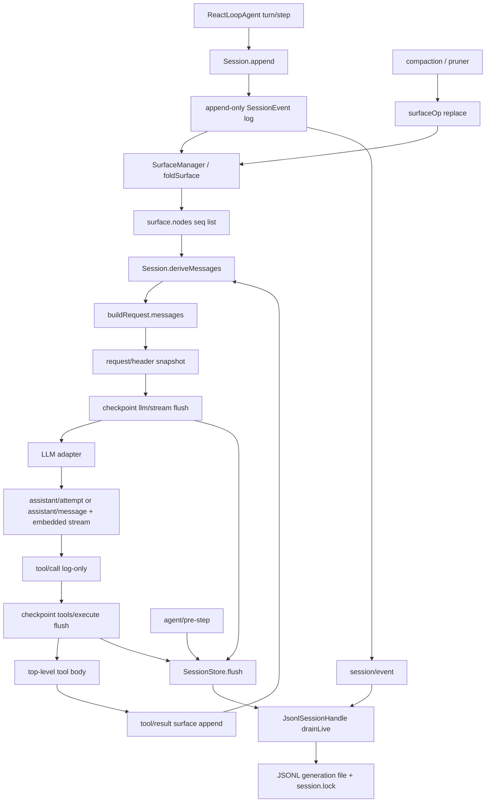

> DSH 的会话真相是 `Session` 里一条 `seq = log.length` 的 append-only `SessionEvent` 日志；模型下一轮看到的 `messages` 只能是 `deriveMessages()` 对 `surfaceOp` 折叠结果的投影。`SESSION_FORMAT_VERSION` 现为 **2**；JSONL load 时 catalog 走 v0→v1→v2。这是组合运行时的 **model-visible ⟺ logged** 合同，不是一份可就地改写的 chat 数组。`dsh-session-log-deepseek` 只是把同一条 log 的后缀投影进 DeepSeek 请求字段，不是第二份日志。shipped session 盘只有 JSONL handle + write lease。

## 能回答的问题

- 一次 turn / step 往 log 写哪些 event？哪些带 `surfaceOp`、哪些只是 log-only？v2 还写不写顶层 `assistant/chunk`？
- `deriveMessages()` 如何从 append-only log 得到 LLM `messages`？三类 surface（`user/message` / `assistant/message` / `tool/result`）各自投影什么？
- `surfaceOp: append` 与 `{ op: 'replace', start, end }` 怎么改模型历史？有没有 delete？
- `dsh-session-checkpoint-policy` 的两个副作用落点在哪？flush 失败或 abort 会不会仍进 adapter / tool body？
- host 面的 `ctx.sessions` + JSONL `SessionHandle`，和 agent-preset 面的 `agentPreset` projection / isolate，怎样共用同一条 log？

## 总览图

## 端到端步骤

1. `dsh-base` 在 host 组合树挂上 `@deepseek-ai/dsh-session`（`ctx.sessions: SessionStore`）、`@deepseek-ai/dsh-session-persistence-jsonl`、`@deepseek-ai/dsh-session-checkpoint-policy`，以及可选的 `@deepseek-ai/dsh-session-log-deepseek`。`SessionStore` 是进程级 store（service 名 `'sessions'`）；单条 `Session` 是一次 agent 交互的 log。JSONL 插件占 `ctx.sessionPersistence`，`create`/`open` 返回 `SessionHandle`。 [E: packages/bundle/base/cordis.patch.yml:34] [E: packages/bundle/base/cordis.patch.yml:110] [E: packages/bundle/base/cordis.patch.yml:396] [E: packages/core/session/src/index.ts:892] [E: packages/session/session-persistence/src/index.ts:146]

2. Host 创建 Agent 时把解析后的 preset id 放进 `CreateAgentOptions.meta.agentPreset`；`SessionStore.prepare` 把它写入 `SessionHeader.agentPreset`。header 是创建事实，深冻后不再改字段，并带 `isSeeded`（不再有 `seedLength`）。空白会话后来改 preset，必须再 append `agent-preset/selected`。权威读法是 `agentPreset` Session projection：`init` 取 header，`apply` 遇 `agent-preset/selected` 则换成新 id。Session Controller 的 `presetForSession` / `composeAgent` 走这条投影。 [E: packages/api/session-controller/src/agent.ts:353] [E: packages/core/session/src/index.ts:981] [E: packages/preset/agent-presets/src/session.ts:38] [E: packages/preset/agent-presets/src/session.ts:39] [E: packages/api/session-controller/src/agent.ts:374]

3. `ReactLoopAgent.turn` 先 `append('turn/start')`，`preStep` 跑完后再 `append('step/start')`，然后把本步要进模型的 `UserMessage` 逐条 `append('user/message', …, { surfaceOp: 'append' })`。`turn/start` / `step/start` 没有 `surfaceOp`，不进模型历史。 [E: packages/core/agent-loop/src/agent.ts:267] [E: packages/core/agent-loop/src/agent.ts:291] [E: packages/core/agent-loop/src/agent.ts:295] [E: packages/core/session/src/types.ts:387]

4. `Session.append` 把 `seq` 钉成当前 `this.log.length`，对 `data` 与 surface 元数据做 lossless JSON 快照并 `deepFreeze`，先 `SurfaceManager.validateNext`，再 `log.push`。push 之后才 fire-and-forget 发 `session/event`：observer 失败不能回滚已提交的事件。热路径不碰磁盘。 [E: packages/core/session/src/index.ts:723] [E: packages/core/session/src/index.ts:728] [E: packages/core/session/src/index.ts:737]

5. `SurfaceEventType` 只有三个：`user/message`、`assistant/message`、`tool/result`。这三类必须带 `SurfaceOp`；其它类型禁止带 `surfaceOp` / `sourceEventSeqs`。`SurfaceOp` 只有 `'append'` 与 `{ op: 'replace', start, end }` 两种——**没有 delete**。缺 marker 的 seed 在构造期就被拒。v2 的 `assistant/message` 把 provider 流嵌在 `data.stream`，禁止 `sourceEventSeqs`。 [E: packages/core/session/src/types.ts:387] [E: packages/core/session/src/types.ts:416] [E: packages/core/session/src/types.ts:428] [E: packages/core/session/tests/session.spec.ts:655]

6. `SurfaceManager` 按 seq 连续重放：`append` 把该 seq 推进 `nodes` 尾部；`replace` 用 `nodes.splice(...)` 把闭区间换成新节点，并递增 `replaceGeneration`。splice 只改 `nodes`，不从 `this.log` 删除旧事件。 [E: packages/core/session/src/surface.ts:183] [E: packages/core/session/src/surface.ts:382]

7. `ReactLoopAgent.step` 调用 `this.session.deriveMessages()` 作为本步 messages。`deriveMessages` 只走 `surface.nodes`：对每个 seq 调 `deriveEventMessage`；`replaceGeneration` 变化时整表重建。投影规则：`user/message` 原样返回 `event.data`；`assistant/message` 返回 `event.data.message`，但 `content.length === 0` 得到 `null`；`tool/result` 返回 `event.data.message`；`assistant/attempt` / 边界 / `tool/call` / `request/header` 一律 `null`。 [E: packages/core/agent-loop/src/agent.ts:358] [E: packages/core/session/src/index.ts:820] [E: packages/core/session/src/surface.ts:90] [E: packages/core/session/src/surface.ts:110]

8. `buildRequest` 把 messages 写进冻结的 `GenerateOptions.messages`，并在需要时 `append('request/header')`（`reason` 为 `initial` / `resume` / `change` / `series`）。`request/header` 是 log-only：`foldRequestHeader` 取最后一份 `EpochHeader`。`dsh-agent-loop` invariant 在 `llm/stream` 上要求 `JSON.stringify(options.messages) === JSON.stringify(session.deriveMessages())`，并且 model / system / tools 与折叠后的 header 一致。测试把 log 前缀重新重建后，也能 byte-equal 复原当时的 `request.messages`。 [E: packages/core/agent-loop/src/agent.ts:552] [E: packages/core/session/src/request-header.ts:65] [E: packages/core/agent-loop/src/invariant.ts:40] [E: packages/core/agent-loop/tests/request-reconstruction.spec.ts:698]

9. **Checkpoint 落点 1（adapter 之前）**：`session-checkpoint-policy` 拦截 `llm/stream`。`options.sessionId` 能解析到 live `Session` 时，先 `await ctx.sessions.flush(session)`，再 `yield* next()` 构造下游 adapter 流。flush 被拒则 adapter 根本不会被调用。无 `sessionId` 或 id 已脱离 store 时直接 `next()`，不刷盘。JSONL 的 `session/flush` listener 做 `drainLive` + `handle.flush`。 [E: packages/session/session-checkpoint-policy/src/index.ts:64] [E: packages/session/session-checkpoint-policy/src/index.ts:35] [E: packages/session/session-checkpoint-policy/src/index.ts:36] [E: packages/session/session-persistence-jsonl/src/storage.ts:506] [E: packages/session/session-checkpoint-policy/tests/session-checkpoint-policy.spec.ts:73]

10. adapter 吐出的 `StreamChunk` **不再**逐条 `append('assistant/chunk')`。流先在 `AssistantStreamAttempt` 里累积；步成功则 `append('assistant/message', { message, stream, usage? }, { surfaceOp: 'append' })`；失败 / 取消且没有可展示内容则 `append('assistant/attempt', { stream })`（log-only）。模型历史用组装后的 message，不用 chunk 流。 [E: packages/core/agent-loop/src/agent.ts:364] [E: packages/core/agent-loop/src/agent.ts:389] [E: packages/core/session/src/types.ts:313]

11. 若 assistant 带 `tool-call` 块，`executeToolCalls` 在 dispatch 前 `append('tool/call', { callId, name, arguments })`——`arguments` 是模型原文 JSON 字符串，未解析。`tool/call` 不是 surface；它只给后续 `tool/result` 当 `sourceEventSeqs`。 [E: packages/core/agent-loop/src/tool-calls.ts:264] [E: packages/core/session/src/types.ts:319]

12. **Checkpoint 落点 2（top-level tool body 之前）**：同一 policy 拦截 `tools/execute`。仅当 `exec.agent` 存在且 `exec.parent === undefined` 才 `flush(exec.agent.session)`；flush 期间若 `signal.aborted`，返回 `TOOL_ABORTED_BEFORE_DISPATCH` 错误结果且不跑 tool body。带 `parent` 的嵌套 dispatch（含 PTC `run_code` 子调用）直接 `next()`，本层 flush 次数为 0。 [E: packages/session/session-checkpoint-policy/src/index.ts:71] [E: packages/session/session-checkpoint-policy/src/index.ts:73] [E: packages/session/session-checkpoint-policy/tests/session-checkpoint-policy.spec.ts:212]

13. tool 结算后 `appendToolResult` 写 `tool/result`，`surfaceOp: 'append'`，`sourceEventSeqs: [callSeq]`。payload 带 `createToolResultMessage(...)` 的 `message`，以及可选的 `error` / `meta`；`append` 对 `data` 做 `snapshotJsonValue`，非 JSON 的 `meta` 在入口被拒。 [E: packages/core/agent-loop/src/tool-calls.ts:282] [E: packages/core/agent-loop/src/tool-calls.ts:289]

14. 另有第三条 **耐久刷盘**（不是副作用门）：`agent/pre-step` 在每步 `next()` 之前 `flush(agent.session)`。hard-crash：adapter 刚 dispatch 时 SIGKILL，盘上已有 `user/message` + `request/header`；tool 副作用点 SIGKILL，盘上已有 `tool/call`。产品 resume：`AgentLoop` `open('write')` 后跑 `interruptedTurnClosers` 并把 closer `handle.append` 回盘。有 `tool/call` seq 的补 `TOOL_OUTCOME_UNKNOWN`；从未 `tool/call` 的补 `TOOL_NOT_STARTED`。 [E: packages/session/session-checkpoint-policy/src/index.ts:79] [E: packages/session/session-checkpoint-policy/tests/crash-recovery.e2e.ts:96] [E: packages/core/agent-loop/src/index.ts:867] [E: packages/core/agent-loop/src/index.ts:878] [E: packages/core/session/src/repair.ts:119]

15. compaction 不删 log。`compaction-basic` 先 append log-only 的 `compaction/summary`，再 append 一条 `user/message`，`surfaceOp: { op: 'replace', start, end }`。`compaction-tool-result-pruner` 对单个过长 `tool/result` 做 `start === end` 的 replace，且 fold 规定 `tool/result` 替换只能改 `content`。 [E: packages/compaction/compaction-basic/src/region.ts:473] [E: packages/compaction/compaction-tool-result-pruner/src/index.ts:171] [E: packages/core/session/src/surface.ts:328]

16. host 持久化：JSONL tracker 在 `session/event` 上 `enqueueLive`（最多 200ms 合批），在 `session/flush` 上 `drainLive` + `handle.flush`。`SessionStore.flush` 是调用方走的正式入口（parallel、等全部 listener）。write handle 持有跨进程 `session.lock`。base bundle 把 JSONL root 设成 `dshHomePath('sessions')`；当前 generation 文件是 `session.v2.jsonl[.zstd]`。v0/v1 源盘由 catalog 迁到旁边的 v2 文件，源 generation 不改。浏览器半边从 `@deepseek-ai/dsh-session/surface` 导入 `isAppendSurfaceEvent`；Host HTTP `session` Remote 的 `page` 走 Session Controller history，分页只数 `isAppendSurfaceEvent`——replace 副本不计入人读 transcript。 [E: packages/session/session-persistence-jsonl/src/storage.ts:501] [E: packages/session/session-persistence-jsonl/src/storage.ts:506] [E: packages/core/session/src/index.ts:1117] [E: packages/bundle/base/cordis.patch.yml:113] [E: packages/session/session-format-catalog/src/generated.ts:14] [E: packages/client/ui-chat/src/client/conversation-nodes/message.ts:5] [E: packages/api/session-controller/src/history.ts:394] [E: packages/session/session-persistence-jsonl/src/lease.ts:40]

17. 新 header 的 `version` 必须等于 `SESSION_FORMAT_VERSION`（当前 **2**）。JSONL load 时 adjacent 链 `session-format-v0-to-v1` → `session-format-v1-to-v2` 把历史 generation 变成当前逻辑事件；比 2 新的盘仍拒。`seq` 从 0 连续；属性测试断言同一 log 的 `deriveMessages()` 幂等。 [E: packages/core/session/src/types.ts:86] [E: packages/core/session/src/index.ts:101] [E: packages/session/session-format-catalog/src/generated.ts:17] [E: packages/core/session/tests/properties.spec.ts:100]

18. 可选 DeepSeek 方言投影：`dsh-session-log-deepseek` 默认 `enabled: false`；开启后向 `ctx.deepseekLlmApiExtensions` 注册字段 `dsh_session_log`，内容是 watermark `session-log-deepseek/delivery-accepted` 之后的事件后缀。无 `sessionId` 或 session 已脱离 store 时贡献 `undefined`。HTTP accept 后才 append watermark。这不是第二条 session log。 [E: packages/session/session-log-deepseek/src/index.ts:43] [E: packages/session/session-log-deepseek/src/index.ts:137] [E: packages/session/session-log-deepseek/src/index.ts:141] [E: packages/session/session-log-deepseek/src/index.ts:160]

## 关键决策点

### Log 是真相，messages 是投影

DSH 不维护一份可就地 splice 的 chat 数组。`SessionEventMap` 是 merge-extensible 的 append-only 词汇表；模型历史只从带 `surfaceOp` 的三类事件折叠而来。loop 发出的请求必须与当时 log 前缀的 `deriveMessages()` 一致——这就是 **model-visible ⟺ logged**。Peer harness 常见的「内存 messages + 事后再写盘」在这里是不变量违规。 [E: packages/core/session/src/types.ts:260] [E: packages/core/agent-loop/src/invariant.ts:40]

### 没有 delete，只有 shadow

`isReplaceOp` 要求对象恰好三个键且 `op === 'replace'`。fold 用 splice 换节点，从不从 `this.log` 移除事件。人读 UI（`isAppendSurfaceEvent`）继续看见当初 append 上去的原文；模型下次请求只看见替换后的 surface。 [E: packages/core/session/src/surface.ts:183] [E: packages/core/session/src/surface.ts:58] [E: packages/core/session/src/surface.ts:382]

### Checkpoint 罩的是副作用，不是「每个 append」

`append` 本身是内存提交。磁盘耐久由 `session/flush` 的 JSONL handle `drainLive` 完成。两个 fail-closed 落点卡在「adapter 即将花 token」和「top-level tool body 即将对外产生副作用」之前；嵌套 tool（含 PTC `run_code` 子调用）不再刷一次。`agent/pre-step` 的 flush 是给下一步请求准备已提交批次，不阻止 tool body。policy 的 `inject` 是 `['llm', 'sessionPersistence', 'sessions', 'tools']`——它是跨 seam 的胶水插件，不是 loop 内部函数。 [E: packages/session/session-checkpoint-policy/src/index.ts:18] [E: packages/session/session-checkpoint-policy/tests/session-checkpoint-policy.spec.ts:82] [E: packages/session/session-checkpoint-policy/tests/session-checkpoint-policy.spec.ts:212]

### Host store vs preset 组合

Host 面（`dsh-base`，以及叠在它上面的 `web` / `headless` / `sdk` / `acp` profile；`sdk-minimal` 不叠 base，但同样用 JSONL session 包）提供 `ctx.sessions`、JSONL handle、checkpoint、query、telemetry。Agent-preset 面（web 默认 `standard`，shipped 另有 `minimal` / `ptc` / `cordis`）决定这一会话的 tools / persona / isolate，并把 preset id 写进 header 或 `agent-preset/selected`。换 preset 等于换模型可见的 tool schemas 与 prompt sections，所以必须进 log。Client 半边只消费 surface 投影与 append-origin transcript，不拥有 store。`session-persistence-sqlite` 已删除，见 [subsys.persistence.sqlite](../subsystems/persistence/sqlite.md)。

### Seam 三角

| 角色 | 落点 |
|---|---|
| Definition | `SessionEventMap` / `SurfaceOp` / `Session.append` 合同（`@deepseek-ai/dsh-session`）；`SessionPersistence` / `SessionHandle`（`@deepseek-ai/dsh-session-persistence`） |
| Provider | `SessionStore`（`ctx.sessions`）、JSONL persistence + kernel lease、`session-checkpoint-policy` |
| Consumer | `ReactLoopAgent`（写 log、读 `deriveMessages`、resume 时 append closer）、compaction / pruner（`replace`）、Host HTTP Session Controller `page`、client conversation 节点 |

换 persistence backend 只换 `SessionHandle` 的落盘实现；换 loop 不能绕开 surface 合同，否则 invariant 在 `llm/stream` 上 fail。

## 指向后续 T1/T2

- [spine.turn-and-step](turn-and-step.md) — turn = 0..n step，inbox `followup` / `steer` / `inject`，以及这些输入何时变成 `user/message`。
- [spine.tool-call-anatomy](tool-call-anatomy.md) — `tool/call` 之后的 `tools/pre-execute` → execute → `tools/post-execute`，以及 PTC `run_code` 子调用为何跳过本页的顶层 checkpoint。
- [spine.context-and-compaction](context-and-compaction.md) — system prompt 装配、workspace 指令、`thresholdRatio` / `retainRatio`，以及 compaction 引擎何时发出本页的 `replace`。
- [subsys.core.session](../subsystems/core/session.md) — `Session` / `SessionStore` API、seed / restore、fork `OPEN_TURN`、`session/end-seed`、`SESSION_FORMAT_VERSION = 2`。
- [subsys.persistence.checkpoint](../subsystems/persistence/checkpoint.md) — flush 与 JSONL 写窗、crash repair 的完整事件序列。
- [subsys.persistence.session-persistence](../subsystems/persistence/session-persistence.md) — `SessionHandle` 缝；`create` / `open`。
- [subsys.persistence.jsonl](../subsystems/persistence/jsonl.md) — generation 文件、catalog 迁盘、write lease。
- [subsys.context.compaction](../subsystems/context/compaction.md) — `compaction/start|summary|end|prune` 词汇与 shadow-price 邻接约定。
- [ref.session-events](../reference/session-events.md) — merge 进 `SessionEventMap` 的完整事件表（含插件类型）。

## Sources

- packages/core/session/src/index.ts
- packages/core/session/src/surface.ts
- packages/core/session/src/types.ts
- packages/core/session/src/request-header.ts
- packages/core/session/src/repair.ts
- packages/core/session/tests/surface.spec.ts
- packages/core/session/tests/session.spec.ts
- packages/core/session/tests/properties.spec.ts
- packages/session/session-checkpoint-policy/src/index.ts
- packages/session/session-checkpoint-policy/tests/session-checkpoint-policy.spec.ts
- packages/session/session-checkpoint-policy/tests/crash-recovery.e2e.ts
- packages/session/session-persistence/src/index.ts
- packages/session/session-persistence/src/handle.ts
- packages/session/session-persistence-jsonl/src/index.ts
- packages/session/session-persistence-jsonl/src/storage.ts
- packages/session/session-persistence-jsonl/src/lease.ts
- packages/session/session-format-catalog/src/generated.ts
- packages/session/session-log-deepseek/src/index.ts
- packages/core/agent-loop/src/index.ts
- packages/core/agent-loop/src/agent.ts
- packages/core/agent-loop/src/tool-calls.ts
- packages/core/agent-loop/src/invariant.ts
- packages/core/agent-loop/tests/request-reconstruction.spec.ts
- packages/compaction/compaction-basic/src/region.ts
- packages/compaction/compaction-tool-result-pruner/src/index.ts
- packages/preset/agent-presets/src/session.ts
- packages/bundle/base/cordis.patch.yml
- packages/api/session-controller/src/agent.ts
- packages/api/session-controller/src/history.ts
- packages/client/ui-chat/src/client/conversation-nodes/message.ts

## 相关

- [spine.turn-and-step](turn-and-step.md)：turn / step / inbox 如何驱动本页的 append 顺序。
- [subsys.core.session](../subsystems/core/session.md)：`Session` 与 `SessionStore` 的完整合同（prepare / enter / announce / fork）。
- [subsys.persistence.checkpoint](../subsystems/persistence/checkpoint.md)：语义 checkpoint 与 persistence 写路径。
- [ref.session-events](../reference/session-events.md)：`SessionEventMap` 全表与各插件 merge 声明。
