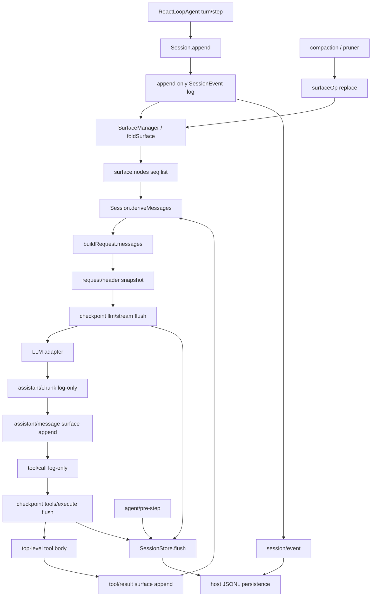

> DSH 的会话真相是 `Session` 里一条 `seq = log.length` 的 append-only `SessionEvent` 日志；模型下一轮看到的 `messages` 只能是 `deriveMessages()` 对 `surfaceOp` 折叠结果的投影。这是组合运行时的 **model-visible ⟺ logged** 合同，不是一份可就地改写的 chat 数组。

## 能回答的问题

- 一次 turn / step 往 log 写哪些 event？哪些带 `surfaceOp`、哪些只是 log-only？
- `deriveMessages()` 如何从 append-only log 得到 LLM `messages`？三类 surface（`user/message` / `assistant/message` / `tool/result`）各自投影什么？
- `surfaceOp: append` 与 `{ op: 'replace', start, end }` 怎么改模型历史？有没有 delete？
- `dsh-session-checkpoint-policy` 的两个副作用落点在哪？flush 失败或 abort 会不会仍进 adapter / tool body？
- host 面的 `ctx.sessions` + JSONL 持久化，和 agent-preset 面的 `agentPreset` / isolate，怎样共用同一条 log？

## 总览图

## 端到端步骤

1. `dsh-base` 在 host 组合树挂上 `@deepseek-ai/dsh-session`（`ctx.sessions: SessionStore`）、`@deepseek-ai/dsh-session-persistence-jsonl` 与 `@deepseek-ai/dsh-session-checkpoint-policy`。`SessionStore` 是进程级 store；单条 `Session` 是一次 agent 交互的 log。[E: packages/bundle/base/cordis.patch.yml:28] [E: packages/bundle/base/cordis.patch.yml:99] [E: packages/bundle/base/cordis.patch.yml:356] [E: packages/core/session/src/index.ts:797]

2. Host 创建会话时把 preset id 放进 `CreateAgentOptions.meta.agentPreset`；`createAgent` 原样交给 `SessionStore.prepare`，写入 `SessionHeader.agentPreset`。header 是创建事实，深冻后不再改字段。空白会话后来改 preset，必须再 append `agent-preset/selected`；`resolveSessionPreset` 从后往前找该事件，找不到才回退 header。resume / 再挂 isolate 读的是这个解析结果，不是「当前进程里碰巧装着的 preset」。[E: packages/host/apiproxy/src/api-proxy.ts:1675] [E: packages/core/agent-loop/src/index.ts:609] [E: packages/core/session/src/index.ts:886] [E: packages/preset/agent-presets/src/session.ts:51] [E: packages/preset/agent-presets/src/session.ts:53]

3. `ReactLoopAgent.turn` 先 `append('turn/start')`，`preStep` 跑完后再 `append('step/start')`，然后把本步要进模型的 `UserMessage`（inbox 声明的 human prompt、`agent.inject()` 上下文、goal 续轮）逐条 `append('user/message', …, { surfaceOp: 'append' })`。`turn/start` / `step/start` 没有 `surfaceOp`，不进模型历史。[E: packages/core/agent-loop/src/agent.ts:255] [E: packages/core/agent-loop/src/agent.ts:279] [E: packages/core/agent-loop/src/agent.ts:283] [E: packages/core/session/src/types.ts:343]

4. `Session.append` 把 `seq` 钉成当前 `this.log.length`，对 `data` 与 surface 元数据做 lossless JSON 快照并 `deepFreeze`，先 `SurfaceManager.validateNext`，再 `log.push`。push 之后才 fire-and-forget 发 `session/event`：observer 失败不能回滚已提交的事件，也不能挡住后续 listener。热路径不碰磁盘。[E: packages/core/session/src/index.ts:629] [E: packages/core/session/src/index.ts:634] [E: packages/core/session/src/index.ts:643] [E: packages/core/session/src/index.ts:646]

5. `SurfaceEventType` 只有三个：`user/message`、`assistant/message`、`tool/result`。这三类必须带 `SurfaceOp`；其它类型禁止带 `surfaceOp` / `sourceEventSeqs`。`SurfaceOp` 只有 `'append'` 与 `{ op: 'replace', start, end }` 两种——**没有 delete**。缺 marker 的 seed 在构造期就被拒，避免 resume 时表面「加载成功」却从 `deriveMessages()` 丢历史。[E: packages/core/session/src/types.ts:344] [E: packages/core/session/src/types.ts:373] [E: packages/core/session/src/surface.ts:179] [E: packages/core/session/tests/session.spec.ts:547]

6. `SurfaceManager` / `foldSurface` 按 seq 连续重放：`append` 把该 seq 推进 `nodes` 尾部；`replace` 用 `nodes.splice(startIdx, endIdx - startIdx + 1, plan.seq)` 把闭区间换成新节点，并递增 `replaceGeneration`。splice 只改 `nodes`，不从 `this.log` 删除旧事件；`deriveMessages()` 因此只看见替换节点。[E: packages/core/session/src/surface.ts:367] [E: packages/core/session/src/surface.ts:369] [E: packages/core/session/src/surface.ts:370] [E: packages/core/session/tests/surface.spec.ts:758]

7. `ReactLoopAgent.step` 调用 `this.session.deriveMessages()` 作为本步 `boundaryMessages`。`deriveMessages` 只走 `surface.nodes`：对每个 seq 调 `deriveEventMessage`；`replaceGeneration` 变化时整表重建。投影规则：`user/message` 原样返回 `event.data`；`assistant/message` 返回 `event.data.message`，但 `content.length === 0`（只挂 usage 的 max-tokens 壳）得到 `null` 且不进数组；`tool/result` 返回 `event.data.message`；chunk / 边界 / `tool/call` / `request/header` 一律 `null`。[E: packages/core/agent-loop/src/agent.ts:341] [E: packages/core/session/src/index.ts:726] [E: packages/core/session/src/index.ts:730] [E: packages/core/session/src/surface.ts:97] [E: packages/core/session/src/surface.ts:103] [E: packages/core/session/src/surface.ts:107]

8. `buildRequest` 把 `boundaryMessages` 写进冻结的 `GenerateOptions.messages`，并在需要时 `append('request/header')`（`reason` 为 `initial` / `resume` / `change`）。`request/header` 是 log-only：`foldRequestHeader` 取最后一份 `EpochHeader`（`config` + 可选 `system` + 可选 `tools`）重建「下一请求的非历史部分」。`dsh-agent-loop` invariant 在 `llm/stream` 上要求 `JSON.stringify(options.messages) === JSON.stringify(session.deriveMessages())`，并且 model / system / tools 与折叠后的 header 一致。测试把 log 前缀重新 `Session.create` 后，也能 byte-equal 复原当时的 `request.messages`。[E: packages/core/agent-loop/src/agent.ts:488] [E: packages/core/agent-loop/src/agent.ts:466] [E: packages/core/session/src/request-header.ts:68] [E: packages/core/agent-loop/src/invariant.ts:40] [E: packages/core/agent-loop/tests/request-reconstruction.spec.ts:600]

9. **Checkpoint 落点 1（adapter 之前）**：`session-checkpoint-policy` 拦截 `llm/stream`。`options.sessionId` 能解析到 live `Session` 时，先 `await ctx.sessions.flush(session)`，再 `yield* next()` 构造下游 adapter 流。flush 被拒则 adapter 根本不会被调用。无 `sessionId` 或 id 已脱离 store 时直接 `next()`，不刷盘。[E: packages/session/session-checkpoint-policy/src/index.ts:65] [E: packages/session/session-checkpoint-policy/src/index.ts:35] [E: packages/session/session-checkpoint-policy/src/index.ts:36] [E: packages/session/session-checkpoint-policy/tests/session-checkpoint-policy.spec.ts:115]

10. adapter 吐出的每个 `StreamChunk` 先 `append('assistant/chunk')`（log-only，供 token 级 replay）。步结束再 `append('assistant/message', { message, usage? }, { surfaceOp: 'append', sourceEventSeqs: chunkSeqs })`。模型历史用组装后的 message，不用 chunk 流。[E: packages/core/agent-loop/src/agent.ts:349] [E: packages/core/agent-loop/src/agent.ts:381] [E: packages/core/agent-loop/src/agent.ts:389]

11. 若 assistant 带 `tool-call` 块，`executeToolCalls` 在 dispatch 前 `append('tool/call', { callId, name, arguments })`——`arguments` 是模型原文 JSON 字符串，未解析。`tool/call` 不是 surface；它只给后续 `tool/result` 当 `sourceEventSeqs`。[E: packages/core/agent-loop/src/tool-calls.ts:263] [E: packages/core/session/src/types.ts:279]

12. **Checkpoint 落点 2（top-level tool body 之前）**：同一 policy 拦截 `tools/execute`。仅当 `exec.agent` 存在且 `exec.parent === undefined`（顶层、非嵌套子调用）才 `flush(exec.agent.session)`；flush 期间若 `signal.aborted`，返回 `TOOL_ABORTED_BEFORE_DISPATCH` 错误结果且不跑 tool body。flush 抛错同样不进 body。带 `parent` 的嵌套 dispatch 直接 `next()`，本层 flush 次数为 0。[E: packages/session/session-checkpoint-policy/src/index.ts:71] [E: packages/session/session-checkpoint-policy/src/index.ts:72] [E: packages/session/session-checkpoint-policy/src/index.ts:73] [E: packages/session/session-checkpoint-policy/tests/session-checkpoint-policy.spec.ts:203] [E: packages/session/session-checkpoint-policy/tests/session-checkpoint-policy.spec.ts:222]

13. tool 结算后 `appendToolResult` 写 `tool/result`，`surfaceOp: 'append'`，`sourceEventSeqs: [callSeq]`。payload 带 `createToolResultMessage(...)` 的 `message`，以及可选的 `error` / `meta`；`append` 对 `data` 做 `snapshotJsonValue`，非 JSON 的 `meta` 在入口被拒。[E: packages/core/agent-loop/src/tool-calls.ts:276] [E: packages/core/agent-loop/src/tool-calls.ts:281] [E: packages/core/agent-loop/src/tool-calls.ts:288] [E: packages/core/session/src/index.ts:614]

14. 另有第三条 **耐久刷盘**（不是副作用门）：`agent/pre-step` 在每步 `next()` 之前 `flush(agent.session)`，把当时已提交的事件（含上一 step 的 response/result）送到 persistence。hard-crash：adapter 刚 dispatch 时 SIGKILL，盘上已有 `user/message` + `request/header`，reload 用 `interrupted` 合上 turn；tool 副作用点 SIGKILL，盘上已有 `tool/call`，reload 补 `code: TOOL_OUTCOME_UNKNOWN` 的 `tool/result`。[E: packages/session/session-checkpoint-policy/src/index.ts:80] [E: packages/session/session-checkpoint-policy/tests/crash-recovery.e2e.ts:89] [E: packages/session/session-checkpoint-policy/tests/crash-recovery.e2e.ts:104] [E: packages/core/session/src/repair.ts:16]

15. compaction 不删 log。`compaction-basic` 先 append log-only 的 `compaction/summary`，再 append 一条 `user/message`，`surfaceOp: { op: 'replace', start, end }`，`sourceEventSeqs` 覆盖 start/summary/被 shadow 的 surface 节点。`compaction-tool-result-pruner` 对单个过长 `tool/result` 做 `start === end` 的 replace，且 fold 规定 `tool/result` 替换只能改 `content`，其它字段必须结构相等。[E: packages/compaction/compaction-basic/src/region.ts:463] [E: packages/compaction/compaction-tool-result-pruner/src/index.ts:171] [E: packages/core/session/src/surface.ts:315]

16. host 持久化：`SessionPersistence` coordinator 在 `session/event` 入队冻结事件，在 `session/flush` 上 `this.flush(session)`。`SessionStore.flush` 是调用方走的正式入口（parallel、等全部 listener）。base bundle 把 JSONL root 设成 `dshHomePath('sessions')`。浏览器半边 re-export `@deepseek-ai/dsh-session/surface`，host `apiproxy` 分页只数 `isAppendSurfaceEvent`——replace 副本不计入人读 transcript。[E: packages/session/session-persistence/src/coordinator.ts:1123] [E: packages/session/session-persistence/src/coordinator.ts:1129] [E: packages/core/session/src/index.ts:1022] [E: packages/bundle/base/cordis.patch.yml:101] [E: packages/client/runtime/src/client/index.ts:19] [E: packages/host/apiproxy/src/api-proxy.ts:302]

17. 新 header 的 `version` 必须等于 `SESSION_FORMAT_VERSION`（当前 `0`）。不兼容 log 在 load 时被拒，没有自动 migration。`seq` 从 0 连续；属性测试断言同一 log 的 `deriveMessages()` 幂等，且夹杂任意 log-only 事件不改变投影。[E: packages/core/session/src/types.ts:56] [E: packages/core/session/src/index.ts:101] [E: packages/core/session/src/index.ts:566] [E: packages/core/session/tests/properties.spec.ts:98] [E: packages/core/session/tests/properties.spec.ts:151]

## 关键决策点

### Log 是真相，messages 是投影

DSH 不维护一份可就地 splice 的 chat 数组。`SessionEventMap` 是 merge-extensible 的 append-only 词汇表；模型历史只从带 `surfaceOp` 的三类事件折叠而来。loop 发出的请求必须与当时 log 前缀的 `deriveMessages()` 一致——这就是 **model-visible ⟺ logged**：模型看见的每一条 message、每一份 tool schema，都必须能从这条 log 重建。Peer harness 常见的「内存 messages + 事后再写盘」在这里是不变量违规。[E: packages/core/session/src/types.ts:236] [E: packages/core/agent-loop/src/invariant.ts:41]

### 没有 delete，只有 shadow

`isReplaceOp` 要求对象恰好三个键且 `op === 'replace'`。fold 用 splice 换节点，从不从 `this.log` 移除事件。compaction / tool-result prune / 指令改写都走这条路径。人读 UI（`isAppendSurfaceEvent`）继续看见当初 append 上去的原文；模型下次请求只看见替换后的 surface。[E: packages/core/session/src/surface.ts:175] [E: packages/core/session/src/surface.ts:51] [E: packages/core/session/tests/surface.spec.ts:758]

### Checkpoint 罩的是副作用，不是「每个 append」

`append` 本身是内存提交。磁盘耐久由 `session/flush` 的 persistence listener 完成。两个 fail-closed 落点卡在「adapter 即将花 token / 看到完整 request」和「top-level tool body 即将对外产生副作用」之前；嵌套 tool 不再刷一次。`agent/pre-step` 的 flush 是给下一步请求准备已提交批次，不阻止 tool body。policy 的 `inject` 是 `['llm', 'sessionPersistence', 'sessions', 'tools']`——它是跨 seam 的胶水插件，不是 loop 内部函数。[E: packages/session/session-checkpoint-policy/src/index.ts:18] [E: packages/session/session-checkpoint-policy/tests/session-checkpoint-policy.spec.ts:83] [E: packages/session/session-checkpoint-policy/tests/session-checkpoint-policy.spec.ts:222]

### Host store vs preset 组合

Host 面提供 `ctx.sessions`、JSONL、checkpoint、query、telemetry。Agent-preset 面决定这一会话的 tools / persona / isolate，并把 preset id 写进 header 或 `agent-preset/selected`。换 preset 等于换模型可见的 tool schemas 与 prompt sections，所以必须进 log；只改内存 composition 会在 resume 时用错树。Client 半边只消费 surface 投影与 append-origin transcript，不拥有 store。

### Seam 三角

| 角色 | 落点 |
|---|---|
| Definition | `SessionEventMap` / `SurfaceOp` / `Session.append` 合同（`@deepseek-ai/dsh-session`，surface 子路径可进浏览器） |
| Provider | `SessionStore`（`ctx.sessions`）、JSONL persistence、`session-checkpoint-policy` |
| Consumer | `ReactLoopAgent`（写 log、读 `deriveMessages`）、compaction / pruner（`replace`）、host `apiproxy` 分页、client conversation 节点 |

换 persistence backend 只换 `session/event` + `session/flush` 的落盘实现；换 loop 不能绕开 surface 合同，否则 invariant 在 `llm/stream` 上 fail。

## 指向后续 T1/T2

- [spine.turn-and-step](turn-and-step.md) — turn = 0..n step，inbox `followup` / `steer` / `inject`，以及这些输入何时变成 `user/message`。
- [spine.tool-call-anatomy](tool-call-anatomy.md) — `tool/call` 之后的 `tools/pre-execute` → execute → `tools/post-execute`，以及 Code Mode 子调用为何跳过本页的顶层 checkpoint。
- [spine.context-and-compaction](context-and-compaction.md) — system prompt 装配、workspace 指令、`thresholdRatio` / `retainRatio`，以及 compaction 引擎何时发出本页的 `replace`。
- [subsys.core.session](../subsystems/core/session.md) — `Session` / `SessionStore` API、seed / restore、fork `OPEN_TURN`、`session/end-seed`。
- [subsys.persistence.checkpoint](../subsystems/persistence/checkpoint.md) — flush 与 JSONL 写窗、crash repair 的完整事件序列。
- [subsys.context.compaction](../subsystems/context/compaction.md) — `compaction/start|summary|end|prune` 词汇与 shadow-price 邻接约定。
- [ref.session-events](../reference/session-events.md) — merge 进 `SessionEventMap` 的完整事件表（含插件类型）。

## Sources

- packages/core/session/src/index.ts
- packages/core/session/src/surface.ts
- packages/core/session/src/types.ts
- packages/core/session/src/request-header.ts
- packages/core/session/src/repair.ts
- packages/core/session/tests/surface.spec.ts
- packages/core/session/tests/session.spec.ts
- packages/core/session/tests/properties.spec.ts
- packages/session/session-checkpoint-policy/src/index.ts
- packages/session/session-checkpoint-policy/tests/session-checkpoint-policy.spec.ts
- packages/session/session-checkpoint-policy/tests/crash-recovery.e2e.ts
- packages/session/session-persistence/src/coordinator.ts
- packages/core/agent-loop/src/index.ts
- packages/core/agent-loop/src/agent.ts
- packages/core/agent-loop/src/tool-calls.ts
- packages/core/agent-loop/src/invariant.ts
- packages/core/agent-loop/tests/request-reconstruction.spec.ts
- packages/compaction/compaction-basic/src/region.ts
- packages/compaction/compaction-tool-result-pruner/src/index.ts
- packages/preset/agent-presets/src/session.ts
- packages/bundle/base/cordis.patch.yml
- packages/host/apiproxy/src/api-proxy.ts
- packages/client/runtime/src/client/index.ts

## 相关

- [spine.turn-and-step](turn-and-step.md)：turn / step / inbox 如何驱动本页的 append 顺序。
- [subsys.core.session](../subsystems/core/session.md)：`Session` 与 `SessionStore` 的完整合同（prepare / enter / announce / fork）。
- [subsys.persistence.checkpoint](../subsystems/persistence/checkpoint.md)：语义 checkpoint 与 persistence 写路径。
- [ref.session-events](../reference/session-events.md)：`SessionEventMap` 全表与各插件 merge 声明。
