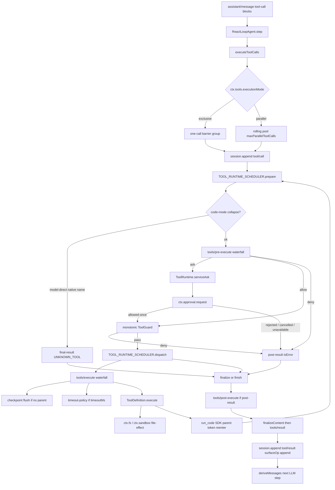

> 模型在 `assistant/message` 里写出 `type: 'tool-call'` 块之后，默认 loop 驱动 `ReactLoopAgent` 把它们交给 `executeToolCalls`：先按 `executionMode` 切 exclusive 屏障 / parallel 滚动池，再对每个 call 走 host 面 `ctx.tools` 的 staged 管线 `tools/pre-execute` → 可选 `ctx.approval.request` → 单调 `guard` → `tools/execute`（timeout / checkpoint / `ToolDefinition.execute`）→ `tools/post-execute`。模型下一轮看见的是带 `surfaceOp: 'append'` 的 `tool/result`；Code Mode 子调用带着 `parent` token 重入同一 `TOOL_RUNTIME_SCHEDULER`。

## 能回答的问题

- 模型产出的 `tool-call` 怎样变成下一轮请求里的 `tool/result`？
- `tools/pre-execute`、`tools/execute`、`tools/post-execute` 各自决定什么，waterfall 必须 `next()` 吗？
- approval（`ask|never`、`allowed-once`）、sandbox、timeout、checkpoint 分别挂在哪一层？
- exclusive 屏障和 `maxParallelToolCalls` 滚动池如何切组，结果按什么顺序写回 log？
- Code Mode 的 `run_code` 子调用怎样重入同一管线，又为什么不进 `deriveMessages()`？
- `ctx.tools` 注册表在 host 面，preset 面的工具行往哪里 `register`？

DSH 是 Cordis 组合运行时：`profile → bundle → agent preset`。工具**注册表** `ctx.tools`（`ToolRuntime`）和审批 / 沙箱 / timeout / checkpoint 插件住在 **host 面**（进程级，`dsh-base` 的 `cordis.patch.yml` 挂上 `dsh-tools`、`dsh-user-approval`、`dsh-tool-call-timeout-policy`、`dsh-session-checkpoint-policy`）。[E: packages/bundle/base/cordis.patch.yml:425] [E: packages/bundle/base/cordis.patch.yml:189] [E: packages/bundle/base/cordis.patch.yml:344] [E: packages/bundle/base/cordis.patch.yml:356] 默认 `dsh web` 走 `dsh-web-app` overlay，把 host 上那些模型可见的 `tool-*` 行 `disabled: true`，改由 **agent-preset 面**（每会话 `agent.cordis.yml`）再 `tools.register`；preset 还可以 `presentAs` 改该 scope 的模型可见形态。[E: packages/bundle/web-app/cordis.patch.yml:294] [E: packages/core/tools/src/index.ts:1037] [E: packages/core/agent-tool-presentation/src/index.ts:70] 能力缝仍是 Definition / Provider / Consumer：`ctx.tools` 是执行缝的 Definition；timeout / hooks / checkpoint 是挂在 waterfall 上的 Consumer；`ctx.approval`、`ctx.sandbox` / `ctx.sandboxPolicy`、`ctx.fs` 是相邻缝，工具 body 当 Consumer 去调。

## 端到端步骤

1. `ReactLoopAgent.step@packages/core/agent-loop/src/agent.ts` 是默认可替换 loop 驱动的一步：`AgentLoop` 工厂直接 `new ReactLoopAgent(...)`。[E: packages/core/agent-loop/src/index.ts:549] 它用 `systemPrompt.assemble` 得到的 `assembly.tools` 和 `session.deriveMessages()` 组一次 LLM 请求。[E: packages/core/agent-loop/src/agent.ts:341] `ToolRuntime` 在构造时把 `wireSchemas(scope)` 挂进 `ctx.systemPrompt.tools`，所以模型看见的 schema 就是该 agent scope 的可见集（`native` 全量；`code` 只留 `run_code`）。[E: packages/core/tools/src/index.ts:832] [E: packages/core/tools/src/index.ts:994]

2. `ReactLoopAgent.step@packages/core/agent-loop/src/agent.ts` 把助手回复落成 `assistant/message` 之后，用 `block.type === 'tool-call'` 抽出本 step 的调用；没有调用就 `completed`。[E: packages/core/agent-loop/src/agent.ts:393] 有调用则进入 `executeToolCalls(this.loopCtx, turn, step, toolCalls, signal, acceptContext)`，`acceptContext` 把工具 defer 的 `UserMessage` 塞进 inbox 的 `next-step`。[E: packages/core/agent-loop/src/agent.ts:395] [E: packages/core/agent-loop/src/agent.ts:397] 任一结果带 `concludesTurn` 则本 turn 直接 `completed`，不再为这批结果开下一步。[E: packages/core/agent-loop/src/agent.ts:399]

3. `executeToolCalls@packages/core/agent-loop/src/tool-calls.ts` 先 `ctx.agents.requireInitiator()` 取出发起这次 step 的 `Agent`（没有 initiator 会抛 `no initiating agent is active`），再把每条 `ToolCallBlock` 编成 `ToolExecutionInput`（`callId` / `name` / 解析后的 `arguments` / `agent` / 共享 `signal`）。[E: packages/core/agent-loop/src/tool-calls.ts:59] [E: packages/core/agent-loop/src/tool-calls.ts:67] [E: packages/core/agent/src/index.ts:218] [E: packages/core/agent/src/index.ts:322] `parseArguments`：空字符串变成 `{}`；合法 JSON 就 parse；非法 JSON **原样保留字符串**，让工具自己报 schema 错，而不是在调度层吞掉。[E: packages/core/agent-loop/src/tool-calls.ts:104]

4. `executeToolCalls@packages/core/agent-loop/src/tool-calls.ts` 在每次切组前重新读 `ctx.tools.executionMode(first.exec).kind`：`parallel` 则把**从该点起的剩余调用**放进一组滚动池；否则只取这一条当 exclusive 屏障。[E: packages/core/agent-loop/src/tool-calls.ts:89] `ToolRuntime.executionMode` 是 fail-closed：只有 `isConcurrencySafe(args) === true` 才 `parallel`；缺方法、抛错、返回非 `true` 一律 `exclusive`。[E: packages/core/tools/src/index.ts:1276] 池子上限是 `ctx.agentLoop.config.maxParallelToolCalls`，默认 `10`，`1` 就是完全串行。[E: packages/core/agent-loop/src/tool-calls.ts:199] [E: packages/core/agent-loop/src/constants.ts:6] 池内后到的调用在 start 前再读一次 mode，若已不再 `parallel` 就停补位，留给下一轮屏障。[E: packages/core/agent-loop/src/tool-calls.ts:204] 测试钉死：三个 `isConcurrencySafe` 兄弟会在任何一个完成前全部 start；夹在中间的 exclusive 会把一批拆成三组。[E: packages/core/agent-loop/tests/tool-calls.spec.ts:100] [E: packages/core/agent-loop/tests/tool-calls.spec.ts:117]

5. `startCall@packages/core/agent-loop/src/tool-calls.ts` **先** `session.append('tool/call', { turn, step, callId, name, arguments })`（`arguments` 是模型原始 JSON 字符串），再 `prepare`。[E: packages/core/agent-loop/src/tool-calls.ts:167] [E: packages/core/agent-loop/src/tool-calls.ts:263] `tool/call` **不是** surface 事件：`SurfaceEventType` 只有 `user/message` / `assistant/message` / `tool/result`，`deriveMessages()` 不会把它投成一条模型消息。[E: packages/core/session/src/types.ts:343] [E: packages/core/session/src/surface.ts:15] 它是 log 里的配对锚：后面的 `tool/result` 用 `sourceEventSeqs: [callSeq]` 指回来。模型看见的「我请求了这个工具」来自 `assistant/message` 里的 `tool-call` 块本身。

6. `ToolRuntime.prepareScheduledExecution@packages/core/tools/src/index.ts`（`TOOL_RUNTIME_SCHEDULER.prepare`）物化参数并决定下一 stage。[E: packages/core/tools/src/index.ts:1459] `mode: 'code'` 且这是**没有** `parent` token 的模型直调、名字又不是 `run_code` 时，`collapses` 为真，调用在进 waterfall **之前**变成 `final-result` + `ToolNotFoundError`（文案指出必须从 `run_code` 程序里调），approval / pre-execute / guard 都看不见它。[E: packages/core/tools/src/index.ts:1324] [E: packages/core/tools/src/index.ts:1423] 未折叠则跑 scoped `tools/pre-execute` waterfall，默认 `next()` 得到 `{ kind: 'allow' }`。[E: packages/core/tools/src/index.ts:1476] Cordis waterfall 必须调用 `next()` 才能把决策交给下游 listener；listener 也可以直接返回 `allow` / `deny` / `ask`，**不能改 arguments**（参数已经记进 `tool/call`）。[E: packages/core/tools/src/index.ts:588]

7. `gate.kind === 'ask'` 时 `serviceAsk` 消费可选缝 `ctx.get('approval')`：没装 approval 或没有 `exec.agent` 都 **fail-closed deny**；否则 `approval.request({ agent, toolName, callId, reason, signal })`。[E: packages/core/tools/src/index.ts:1479] [E: packages/core/tools/src/index.ts:1693] [E: packages/core/tools/src/index.ts:1706] 唯一放行值是 `'allowed-once'`；`'rejected'` / `'cancelled'` / `'unavailable'` 都变成 deny 文案。[E: packages/core/tools/src/index.ts:1714] 测试钉死：没有 approval 缝时，`ask` 退化成 `Error: needs approval` 这类 isError，工具 body 不会跑。[E: packages/core/tools/tests/tools.spec.ts:697] `allow` 之后再跑单调 `guard()`：任一 guard 返回 reason 就 deny，`ToolGuard` 只返回 `string | undefined`，**没有** allow 通道，所以后挂的 listener 不能把拒绝翻成放行。[E: packages/core/tools/src/index.ts:1486] [E: packages/core/tools/src/index.ts:711] deny / 取消走 `post-result`（还要过 post-execute）；pre-execute 抛错走 `final-result`（绕过 post-execute）。[E: packages/core/tools/src/index.ts:1489] [E: packages/core/tools/src/index.ts:1505]

8. `dispatchScheduledExecution@packages/core/tools/src/index.ts` 跑 `tools/execute` waterfall，叶子是 `dispatchToolBody`：fuse 调用方 signal 与 wrapper 替换过的 signal，`resolveExecution` 找到定义后把 `bodyInvoked = true`，再 `await tool.execute(args, exec)`（取消也等这条 promise 落地）。[E: packages/core/tools/src/index.ts:1573] [E: packages/core/tools/src/index.ts:1549] 落地后按 `bodyInvoked` 写成 `ABORTED` 或 `ABORTED_BEFORE_DISPATCH`。[E: packages/core/tools/src/index.ts:1522] host 插件挂在这一层：`dsh-session-checkpoint-policy` 只对 **没有** `parent` 的 top-level 调用 `sessions.flush`，flush 完若已 abort 就返回 `ABORTED_BEFORE_DISPATCH`，否则才 `next()`——嵌套 Code Mode 子调用直接放行，复用外层 `run_code` 的耐久点。[E: packages/session/session-checkpoint-policy/src/index.ts:70] `dsh-tool-call-timeout-policy` 读 `ctx.tools.get(name, agent)?.timeoutMs`，没有预算就原样 `next()`；有预算则换 `exec.signal`、等 `next()`，仅当**自己的** timer 响了才替换成 `TOOL_TIMEOUT`。[E: packages/guard/timeout-policy/src/index.ts:56] `timeoutMs` 从不进模型 schema：`schemaOf` 只投影 `name` / `description` / `parameters`。[E: packages/core/tools/src/index.ts:255] [E: packages/core/tools/src/index.ts:1256]

9. Sandbox **不**挂在 `tools/pre-execute`。文件副作用由 capability 缝在 body 里强制：`ctx.sandboxPolicy.resolve({ session })` 给出本 call 的 `mode` + `workspaceRoot`；`dsh-fs-sandbox` 在 `read-only` 下写文件直接抛 `FS_SANDBOX_DENIED`。[E: packages/sandbox/sandbox-policy/src/index.ts:135] [E: packages/fs/fs-sandbox/src/index.ts:131] 进程级 confinement（bash 一类）走 `ctx.sandbox.confine`：平台没有可用 runner 时 `selectRunner` 抛 `SandboxUnavailableError`（`code: SANDBOX_UNAVAILABLE`），**拒绝裸跑**。[E: packages/sandbox/sandbox-local/src/index.ts:494] [E: packages/sandbox/sandbox/src/index.ts:124] 模型若要升权，`bash` 以及 `write` / `edit` 在 **body 开头**调用共享的 `approveEscalation`（同样落到 `ctx.approval.request`，grant 仍是 `allowed-once`），通过后才把更宽的 `mode` 盖到这一次 policy 上。[E: packages/shell/tool-bash/src/index.ts:335] [E: packages/fs/tool-fs/src/sandbox.ts:97] [E: packages/sandbox/sandbox/src/escalation.ts:157] [E: packages/sandbox/sandbox/src/escalation.ts:183] `ApprovalService` 的会话策略是 `ask | never`：`never` 在进 `approval/request` waterfall **之前**就返回 `'rejected'`，无应答者时默认 `'unavailable'`（fail-closed）。[E: packages/interaction/user-approval/src/index.ts:94] [E: packages/interaction/user-approval/src/index.ts:312] [E: packages/interaction/user-approval/src/index.ts:320] shipped `dsh-base` / `dsh-web-app` **不**装 Claude/Codex hooks；`kind: 'ask'` 是 registry 留给任意 `tools/pre-execute` listener 的通道，默认产品路径上的文件/shell 审批走 body 内 `approveEscalation`。

10. `commitReady@packages/core/agent-loop/src/tool-calls.ts` 按**模型顺序**提交：`needsPost` 则 `finalize`（跑 `tools/post-execute` + `finalizeContent`），否则 `finish`（跳过 post）。[E: packages/core/agent-loop/src/tool-calls.ts:152] `postExecute` 默认 `accept`；listener 可换 `content` / `value`、附 `additionalContexts`，或 `block` 把反馈变成 isError。[E: packages/core/tools/src/index.ts:1743] 然后 `appendToolResult` 用 `createToolResultMessage` 写出 `tool/result`，带 `surfaceOp: 'append'`。[E: packages/core/agent-loop/src/tool-calls.ts:281] `deriveEventMessage` 只把这条投成模型历史；`deriveMessages()` 折 overlay 后的 surface。[E: packages/core/session/src/surface.ts:106] [E: packages/core/session/src/index.ts:727] 这就是 **model-visible ⟺ logged**：下一轮请求里的 tool result 必须能从 append-only log 重建。abort 时已 start 的 call 仍走完 commit；未 start 的调用由 `appendSkippedToolCall` 补一对 `tool/call` + 合成 `ABORTED_BEFORE_DISPATCH` 结果，保证 replay 成对。[E: packages/core/agent-loop/src/tool-calls.ts:249] 调度器内部失败则停补位、排空已 start 的 dispatch、把第一个 error 抛出，**不为**未提交的 call 伪造 result。[E: packages/core/agent-loop/src/tool-calls.ts:231]

11. Code Mode 点到为止。`code` preset 用 `dsh-agent-tool-presentation` 的 `mode: code` 调 `ctx.tools.presentAs('code')`，该 scope 的 wire schema 只剩 `run_code`。[E: apps/cli/config/agent-presets/code/agent.cordis.yml:262] [E: packages/core/agent-tool-presentation/src/index.ts:70] `run_code` 程序里的 SDK 绑定构造带 `parent: exec.token` 的 `ToolExecutionInput`，再走同一个 `registry[TOOL_RUNTIME_SCHEDULER].prepare` / `dispatch` / `finalize`。[E: packages/core/tools/src/code-mode.ts:20] [E: packages/core/tools/src/code-mode.ts:477] [E: packages/core/tools/src/code-mode.ts:545] 子调用因此重入完整的 pre / guard / approval / timeout / sandbox-in-body / post；checkpoint 因 `parent !== undefined` 跳过。[E: packages/session/session-checkpoint-policy/src/index.ts:71] 子结果写入 `tool/code-dispatch` / `tool/code-dispatch-start`（`SessionEventMap` 扩展），**不是** `tool/result`，所以 `deriveEventMessage` 的 default 分支把它丢掉——程序拿到完整 `value`，模型只看见外层 `run_code` 的一条 result。[E: packages/core/tools/src/types.ts:40] [E: packages/core/tools/src/types.ts:56] [E: packages/core/session/src/surface.ts:112]

## 关键决策点

- **Loop 只调度，策略在 Cordis waterfall。** `executeToolCalls` 负责切组、重叠 body、按模型顺序 commit；`allow` / `deny` / `ask` / `block` 是 `ctx.tools` 事件上的可逆 `ctx.on` listener。与 Pi 那种把 `beforeToolCall` 焊在 `AgentTool` 上不同：换一条 listener 不必换 loop。
- **parallel 是 opt-in。** 未声明 `isConcurrencySafe` 的工具永远独占一组，避免「默认可并行」把有副作用的写工具和读工具叠在一起。[E: packages/core/tools/src/index.ts:1278]
- **审批有两层，grant 只有一次性。** 通用层：`tools/pre-execute` 返回 `ask` → `serviceAsk` → `ctx.approval`（策略 `ask|never`，无应答者 `'unavailable'`）。产品层：文件/shell 升权在 body 里 `approveEscalation`，同样只接受 `'allowed-once'`。[E: packages/core/tools/src/index.ts:1714] [E: packages/sandbox/sandbox/src/escalation.ts:183]
- **Sandbox 罩文件副作用，不罩 waterfall。** 官方生成图 `docs/tool-execution-pipeline.md` 把 sandbox 画进 `tools/pre-execute`；可执行源里 `dsh-sandbox-policy` 不订阅该事件，强制发生在 `ctx.fs` / `ctx.sandbox` Consumer。不可用则 `SANDBOX_UNAVAILABLE`，不静默退回 host。[E: packages/sandbox/sandbox-local/src/index.ts:494]
- **Timeout 是 `tools/execute` wrapper，对模型不可见。** 工具用 `timeoutMs` 声明合作式预算；schema 白名单把它滤掉。[E: packages/guard/timeout-policy/src/index.ts:57] [E: packages/core/tools/src/index.ts:1256]
- **Checkpoint 两个工具相关落点之一在 top-level body 之前。** `tools/execute` 里 `flush` 之后才 `next()`；有 `parent` 的子调用跳过。另一个落点是 `llm/stream` 前 / `agent/pre-step`（见 `spine.session-log`）。[E: packages/session/session-checkpoint-policy/src/index.ts:70]
- **`code` collapse 在政策管线之前。** 避免 hooks / approval 去「批准」一条注定 `UNKNOWN_TOOL` 的直调。[E: packages/core/tools/src/index.ts:1423]
- **结果顺序 ≠ 完成顺序。** dispatch 可重叠，`commitReady` 只推进连续已完成的模型序槽；`additionalContexts` 随该 result 一起交给 loop 的 `next-step` inbox。[E: packages/core/agent-loop/src/tool-calls.ts:149]

## 指向后续 T1/T2

- [spine.turn-and-step](turn-and-step.md)（`spine.turn-and-step`）：turn = 0..n step，inbox `followup` / `steer` / `inject`，以及本页的 `executeToolCalls` 怎样嵌进可替换 loop。
- [spine.session-log](session-log.md)（`spine.session-log`）：`deriveMessages()`、`surfaceOp: replace`、以及 checkpoint 在 `llm/stream` / `agent/pre-step` 的另外两个落点。
- [spine.trace-tool-approval](trace-tool-approval.md)（`spine.trace-tool-approval`）：一条真实路径走 `ask|never`、无应答者 fail-closed、`allowed-once`，再进 sandbox policy。
- [spine.trace-code-mode](trace-code-mode.md)（`spine.trace-code-mode`）：`code` preset 下 `run_code` 是唯一 wire 工具、SDK 子调用重入守卫管线的完整走读。
- [spine.trace-subagent](trace-subagent.md)（`spine.trace-subagent`）：模型调 `subagent`（load-time `toolName`）时，本页的同一 `ToolDefinition.execute` 如何再拉起子 session。
- [subsys.core.tools](../subsystems/core/tools.md)（`subsys.core.tools`）：`ToolRuntime` 注册 / restrict / `presentAs` / 输出契约的子系统细节。
- [subsys.core.agent-loop](../subsystems/core/agent-loop.md)（`subsys.core.agent-loop`）：`ReactLoopAgent` 与 `maxParallelToolCalls` Settings。
- [subsys.interaction.approval](../subsystems/interaction/approval.md)（`subsys.interaction.approval`）：`approval/request` waterfall 与审计事件 `approval/asked` + `approval/decided`。
- [subsys.execution.sandbox-policy](../subsystems/execution/sandbox-policy.md)（`subsys.execution.sandbox-policy`）：`ctx.sandboxPolicy.resolve` 与 `sandbox/mode` fold。
- [surface.tools.run-code](../surface/tools/run-code.md)（`surface.tools.run-code`）：`run_code` 的 schema / 输出。
- [ref.tools-catalog](../reference/tools-catalog.md)（`ref.tools-catalog`）：boot 后 `ctx.tools.schemas()` 的模型可见名录。

## Sources

- packages/core/tools/src/index.ts
- packages/core/tools/src/types.ts
- packages/core/tools/src/code-mode.ts
- packages/core/tools/tests/tools.spec.ts
- packages/core/agent-loop/src/tool-calls.ts
- packages/core/agent-loop/src/agent.ts
- packages/core/agent-loop/src/index.ts
- packages/core/agent-loop/src/constants.ts
- packages/core/agent-loop/tests/tool-calls.spec.ts
- packages/core/agent/src/index.ts
- packages/core/session/src/types.ts
- packages/core/session/src/surface.ts
- packages/core/session/src/index.ts
- packages/core/agent-tool-presentation/src/index.ts
- packages/guard/timeout-policy/src/index.ts
- packages/session/session-checkpoint-policy/src/index.ts
- packages/interaction/user-approval/src/index.ts
- packages/sandbox/sandbox/src/index.ts
- packages/sandbox/sandbox/src/escalation.ts
- packages/sandbox/sandbox-policy/src/index.ts
- packages/sandbox/sandbox-local/src/index.ts
- packages/fs/fs-sandbox/src/index.ts
- packages/fs/tool-fs/src/sandbox.ts
- packages/shell/tool-bash/src/index.ts
- packages/bundle/base/cordis.patch.yml
- packages/bundle/web-app/cordis.patch.yml
- apps/cli/config/agent-presets/code/agent.cordis.yml
- docs/tool-execution-pipeline.md

## 相关

- [spine.turn-and-step](turn-and-step.md)
- [subsys.core.tools](../subsystems/core/tools.md)
- [ref.tools-catalog](../reference/tools-catalog.md)
