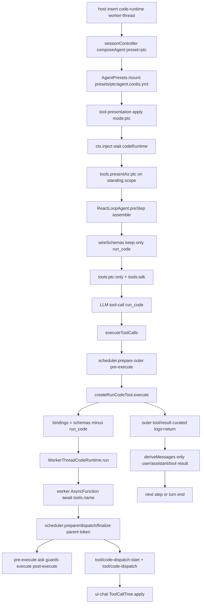

> `spine.trace-code-mode` 走读一条真实路径：会话选 shipped **PTC** preset（目录 `presets/ptc/`，picker 名 **PTC 模式**；wiki 节点 id `surface.presets.code` 是稳定别名），agent-preset 面用 `mode: ptc` 把本会话的模型可见工具收成唯一 wire 名 `run_code`，其余能力变成生成 SDK；模型写一段 TypeScript 程序，host 面 `ctx.codeRuntime` 在 worker-thread 里跑它，程序里的 `await tools.name(args)` 带着 `parent` token 重入同一套 `tools/pre-execute → execute → post-execute` 守卫，子调用只进 append-only log，不进 `deriveMessages()`。

## 能回答的问题

- `ptc` preset 怎样把 `mode: ptc` 挂到**本会话**，而不改进程默认 catalog？
- 为什么模型只能直接调 `run_code`，其它工具却仍出现在 system prompt 的 SDK 段？
- `await tools.read(...)` 如何带着 `parent` token 重入完整守卫管线（approval / sandbox / timeout）？
- host 面 `ctx.codeRuntime`、agent-preset 面 `tool-presentation`、client 面 `tool/code-dispatch` 树各管哪一段？
- 子调用为什么写进 session log，却不会在下一轮 LLM 请求里变成 `tool/result`？

## 端到端步骤

本路径默认安装面是本地 Web GUI（`dsh web`）；同一条 host 运行时也出现在 `dsh --profile headless|sdk|sdk-minimal|acp`（headless overlay 同样插入 `code-runtime`）。**host 面**拥有进程级 `ctx.tools` 注册表、`ctx.codeRuntime`、agent loop、approval / sandbox / checkpoint / session log；**agent-preset 面**拥有本会话的工具插件行和 `tool-presentation`；**client 面**只投影 `tool/code-dispatch-*` 树，不执行程序。五个 shipped profile 是 `web` / `headless` / `sdk` / `sdk-minimal` / `acp`。

1. `web-app` / `headless` bundle 在 **host 面**插入 `id: code-runtime`，插件 `@deepseek-ai/dsh-code-runtime-worker-thread`，注册 `ctx.codeRuntime`（`WorkerThreadCodeRuntime`，`language = 'typescript'`，`isolation = 'worker-thread'`）。这是进程级 Provider，不是 per-session 副本。web 的 preset roster 默认仍是 `standard`：不选 `ptc` 就不会走本 trace。 [E: packages/bundle/web-app/cordis.patch.yml:49] [E: packages/bundle/headless/cordis.patch.yml:19] [E: packages/code-runtime/code-runtime-worker-thread/src/index.ts:246] [E: packages/code-runtime/code-runtime-worker-thread/src/index.ts:247] [E: packages/bundle/web-app/cordis.patch.yml:445]

2. 浏览器或 Host HTTP API（`packages/api/session-controller`，不是已删除的 `apiproxy`）创建会话时传入 `presetId: 'ptc'`（或事后在 blank 窗口写 `agent-preset/selected`，`agentPreset` projection 取最后一次选择）。`composeAgent` 先 `presets.resolve`，再在 agent `setup` 里 `presets.mount(agentCtx, resolvedId)`，把 shipped `packages/preset/agent-presets/presets/ptc/agent.cordis.yml` 挂到该 agent 的 standing scope。无 roster 的部署（headless / sdk / acp overlay 不插 `agent-presets` 行）会跳过 mount，会话只能看见 host 默认 catalog。 [E: packages/api/session-controller/src/agent.ts:374] [E: packages/api/session-controller/src/agent.ts:375] [E: packages/preset/agent-presets/src/index.ts:414] [E: packages/preset/agent-presets/src/session.ts:39] [E: packages/preset/agent-presets/src/discovery.ts:60]

3. `ptc` 的成员资格以这份 yml 为准，不以 package 存在为准。相对 `standard`，可加载增量是末尾 `tool-presentation`：`name: '@deepseek-ai/dsh-agent-tool-presentation'`，`config.mode: ptc`。`bash` / `read` / `edit` 等工具行仍在 preset 里，继续 `register` 进 **host** 注册表；改变的是**呈现**，不是删行。picker 显示名来自 `preset.yml` 的 `PTC 模式`。四个 shipped 目录是 `minimal` / `standard` / `ptc` / `cordis`（没有 `presets/code/`）。 [E: packages/preset/agent-presets/presets/ptc/agent.cordis.yml:265] [E: packages/preset/agent-presets/presets/ptc/agent.cordis.yml:268] [E: packages/preset/agent-presets/presets/ptc/preset.yml:1]

4. `apply@packages/core/agent-tool-presentation/src/index.ts` 是 agent-preset 面选择器：静态 `inject` 只有 `['tools']`（故意不含 `codeRuntime`，否则 `native` 行也会被 runtime 绑住）。`native` 直接 `presentAs('native')`；`ptc` / `both` 则在 `apply` 里 `ctx.inject(['codeRuntime'], …)`，等 host 的 runtime 到位后再 `runtimeCtx.tools.presentAs(config.mode)`。这个动态 wait 是**子 fiber**，不是行的静态 `inject`；`inactiveRows` 只读 `entry.fiber.inject`，因此缺 runtime 时 mount 审计**不会**点名这一行。测试里 row 仍挂着、`assemble` 保持 native 工具表（`echo`），直到后来 `ctx.plugin(StubRuntime)` 才切到 `[run_code]`。 [E: packages/core/agent-tool-presentation/src/index.ts:35] [E: packages/core/agent-tool-presentation/src/index.ts:64] [E: packages/core/agent-tool-presentation/src/index.ts:69] [E: packages/core/agent-tool-presentation/src/index.ts:70] [E: packages/preset/agent-presets/src/mount.ts:316] [E: packages/core/agent-tool-presentation/tests/agent-tool-presentation.spec.ts:109] [E: packages/core/agent-tool-presentation/tests/agent-tool-presentation.spec.ts:111] [E: packages/core/agent-tool-presentation/tests/agent-tool-presentation.spec.ts:118]

5. `ToolRuntime.presentAs@packages/core/tools/src/index.ts` 必须在 scoped context 上调用（preset 的 standing scope）；全局改法是 host `tools` 行的 `Config.mode`。它把 `layer.mode = mode`（`'native' | 'ptc' | 'both'`），并为本 scope 再注册 `tools:ptc-only` 与 `tools:sdk` 两段。同一进程里另一个 `standard` 会话不受影响。host `tools.Config.mode` 默认 `'native'`；web/headless 另有临时 env `DSH_TOOLS_MODE` 可把**整进程**打成 ptc，那是 workaround，不是本 preset 路径。`maxParallelSubCalls` 默认 `10`。 [E: packages/core/tools/src/index.ts:938] [E: packages/core/tools/src/index.ts:950] [E: packages/core/tools/src/index.ts:784] [E: packages/core/tools/src/index.ts:785] [E: packages/bundle/web-app/cordis.patch.yml:37]

6. 第一轮 turn 的 `ReactLoopAgent.preStep` 调 `systemPrompt.assemble(assembleContextFor(this, signal))`。`assembleContextFor` 把 `scope` 设成该 `Agent`，于是 `ctx.systemPrompt.tools` 回调走到 `wireSchemas(scope)`。`modeFor` 沿 scope 链取最近的 `presentAs`（preset standing 覆盖 host 默认）。 [E: packages/core/agent-loop/src/agent.ts:239] [E: packages/core/agent/src/dispatch.ts:175] [E: packages/core/tools/src/index.ts:825] [E: packages/core/tools/src/index.ts:892]

7. `wireSchemas` 在非 native 下先 `requireCodeRuntime`；`mode === 'ptc'` 时只把名为 `run_code` 的 schema 交给模型，`knownNames` 也收成 `[RUN_CODE_NAME]`。`view()` 仍在可见表里插入保留 transport `run_code`（`register()` 禁止任何人抢这个名字），再由 `sdkSchemas` 把**除** `run_code` 以外的定义投成 SDK。`both` 则 native schemas 加上 `run_code`。 [E: packages/core/tools/src/index.ts:975] [E: packages/core/tools/src/index.ts:986] [E: packages/core/tools/src/index.ts:988] [E: packages/core/tools/src/index.ts:1180] [E: packages/core/tools/src/index.ts:1045] [E: packages/core/tools/src/index.ts:1231] [E: packages/core/tools/src/index.ts:1076]

8. 模型读到两段 prompt：`tools:ptc-only` 写明 `` `run_code` is the only tool you can call directly ``（`both` 下这段为空，因为 native 调用会真执行）；`tools:sdk` 由 `SDK_RENDERERS[runtime.language]` 生成。shipped flavor 联合是 `'typescript' | 'python'`。TypeScript 渲染器 `renderToolsSdk` 产出 `declare const tools: { [K in ToolName]: (args) => Promise<…> }`，调用约定是 `await tools.name(args)`。本仓 published backend 只有 `WorkerThreadCodeRuntime.language = 'typescript'`。 [E: packages/core/tools/src/index.ts:51] [E: packages/core/tools/src/index.ts:53] [E: packages/core/tools/src/index.ts:849] [E: packages/core/tools/src/index.ts:853] [E: packages/core/tools/src/ptc.ts:79] [E: packages/core/tools/src/ts-types.ts:297] [E: packages/core/tools/src/ts-types.ts:313] [E: packages/code-runtime/code-runtime-worker-thread/src/index.ts:246]

9. `ReactLoopAgent.step` 把 `assembly.tools`（此时只有 `run_code`）和 `session.deriveMessages()` 打进 LLM 请求。模型回一条 `tool-call`，`name: run_code`，参数 `code`（async 函数体）+ `description`（UI 标题，5–10 词）。`executeToolCalls@packages/core/agent-loop/src/tool-calls.ts` 为每个 block 造 **没有** `parent` 的 `ToolExecutionInput`，先 `session.append('tool/call')`，再走 staged scheduler。 [E: packages/core/agent-loop/src/agent.ts:353] [E: packages/core/agent-loop/src/agent.ts:355] [E: packages/core/agent-loop/src/agent.ts:432] [E: packages/core/agent-loop/src/tool-calls.ts:73] [E: packages/core/agent-loop/src/tool-calls.ts:264] [E: packages/core/tools/src/ptc.ts:20] [E: packages/core/tools/src/ptc.ts:305]

10. 外层 `run_code` 是 top-level 调用：`prepareScheduledExecution` 跑 `tools/pre-execute` waterfall → 可能的 `approval.request`（`allowed-once` 才放行）→ monotonic `guard` → `tools/execute` 包住 body。`session-checkpoint-policy` 在 `tools/execute` 上对 **无** `parent` 的调用 `flush` session，再放行 body；这是外层副作用前的落点。 [E: packages/core/tools/src/index.ts:1450] [E: packages/core/tools/src/index.ts:1467] [E: packages/core/tools/src/index.ts:1705] [E: packages/core/tools/src/index.ts:1565] [E: packages/session/session-checkpoint-policy/src/index.ts:71]

11. `createRunCodeTool.execute` 校验非空 `description`，`requireRuntime()` 取 `ctx.codeRuntime`，为整次 run 建 `AbortController`（外层 abort 或 run settle 都会掐掉未完成子调用）。它用 `registry.schemas(exec.agent)` 枚举**该 agent 可见**工具，跳过 `run_code` 自身，把每个名字绑成 `await tools.name(args)` 的 `CodeBindingFunction`。 [E: packages/core/tools/src/ptc.ts:328] [E: packages/core/tools/src/ptc.ts:331] [E: packages/core/tools/src/ptc.ts:611] [E: packages/core/tools/src/ptc.ts:612]

12. `runtime.run({ program: args.code, bindings: [{ global: 'tools', functions, errorClass: { name: 'ToolCallError', memberNameProperty: 'toolName' } }], signal })` 把程序交给 **host** 缝 `CodeRuntime`。Service Definition 规定：程序失败是 `CodeRunResult.error` 字段，`run()` 本身只在合同误用时 reject。`WorkerThreadCodeRuntime.run` 用 `stripTypeScriptTypes` 剥类型（包一层 `async function` 以便 top-level `await`/`return`），再 `new Worker`：`env: {}`、`execArgv: []`、heap cap。这是 containment，不是安全边界——模型代码与 bash 同级信任。 [E: packages/core/tools/src/ptc.ts:619] [E: packages/code-runtime/code-runtime/src/index.ts:135] [E: packages/code-runtime/code-runtime-worker-thread/src/index.ts:293] [E: packages/code-runtime/code-runtime-worker-thread/src/index.ts:382]

13. Worker 入口 `runWorkerMain` 用 `AsyncFunction` 以 `'use strict'` 执行剥完类型的 body，注入 `tools` 命名空间、`ToolCallError`、裁剪过的 `console`。`await tools.read({ path })` 在 worker 里只 `postMessage({ type: 'call', global, name, args })`；host `onCall` 做 own-property 查找后调用 `createRunCodeTool` 绑好的 `CodeBindingFunction`。 [E: packages/code-runtime/code-runtime-worker-thread/src/bootstrap.ts:369] [E: packages/code-runtime/code-runtime-worker-thread/src/bootstrap.ts:347] [E: packages/code-runtime/code-runtime-worker-thread/src/index.ts:479]

14. binding 把参数 `snapshotJsonValue` 成无损 JSON，分配 `subCallId = `${parentCallId}:code:${n}``，构造带 `parent: exec.token` 的 `ToolExecutionInput`，交给 `registry[TOOL_RUNTIME_SCHEDULER]`。`collapses(name, scope, nested)` 在 `nested === true`（`parent` 已设）时为 false，所以 SDK 子调用可以点名 `read` / `bash`；模型若直接发同名 tool-call，则在 **policy 之前** 变成 `UNKNOWN_TOOL`，文案指引「从 `run_code` 程序里调」。 [E: packages/core/tools/src/ptc.ts:467] [E: packages/core/tools/src/ptc.ts:469] [E: packages/core/tools/src/ptc.ts:476] [E: packages/core/tools/src/ptc.ts:480] [E: packages/core/tools/src/index.ts:1316] [E: packages/core/tools/src/index.ts:1430]

15. 子调度复刻 native loop 的并发合同：`classify()` 读 `executionMode()`（`isConcurrencySafe === true` 才 parallel，否则 exclusive）；连续 parallel 最多重叠 `maxParallelSubCalls`（Config 默认 10）；exclusive 要等池空且自己的 `commit()`（含 post-execute）完成。driver 单车道跑 ordered 阶段：`start()` 里 `append('tool/code-dispatch-start')` + `scheduler.prepare`（再进 `tools/pre-execute` / ask / guards）；`dispatch` 跑 `tools/execute` + 工具 body；`commit()` 里 `finalize`/`finish`（`tools/post-execute`）再 `settle`。 [E: packages/core/tools/src/ptc.ts:529] [E: packages/core/tools/src/ptc.ts:419] [E: packages/core/tools/src/index.ts:1269] [E: packages/core/tools/src/ptc.ts:534] [E: packages/core/tools/src/ptc.ts:544] [E: packages/core/tools/src/index.ts:785] [E: packages/core/tools/src/index.ts:790]

16. `settle` 立刻把完整 JSON value 还给程序；log 复制另走 `tools/ptc-dispatch-log` waterfall（spill 只能改 **durable 副本**），然后 `session.append('tool/code-dispatch', { rootCallId, parentCallId, subCallId, name, arguments, isError, content })`。含 image 的嵌套结果会 `deferContext`，source plugin id 仍是遗留字符串 `'tools-code-mode'`。checkpoint 对 `exec.parent !== undefined` 直接 `next()`：子调用复用外层 `run_code` 已 flush 的落点，不再各自 checkpoint。 [E: packages/core/tools/src/ptc.ts:509] [E: packages/core/tools/src/index.ts:181] [E: packages/core/tools/src/types.ts:40] [E: packages/core/tools/src/types.ts:56] [E: packages/core/tools/src/ptc.ts:564] [E: packages/session/session-checkpoint-policy/src/index.ts:71]

17. **client 面**：`ToolCallTree.apply`（`packages/client/ui-chat`，不是已删除的 `packages/client/runtime`）认 `tool/code-dispatch-start` / `tool/code-dispatch`，按 `parentCallId` 挂到外层 `run_code` 卡片下。浏览器不跑 worker、不调 `ctx.tools.execute`。 [E: packages/client/ui-chat/src/client/model/tool-call-tree.ts:58] [E: packages/client/ui-chat/src/client/model/tool-call-tree.ts:76]

18. 程序 `return` / `print` 结束（或 `CodeRunFailedError`：`CODE_RUN_FAILED`，带 failure kind + captured logs）。`execute` 的 `finally` abort run 并 `drainDispatches`，保证每个已 start 的子调用都 settle。外层 `output.render` 把 `logs` 与 completion value 拼成一段 text（空则 `(run_code completed with no output)`）。`presentCall` 用模型写的 `description` 作 UI title。`executeToolCalls` `append('tool/result')`，`surfaceOp: 'append'`。 [E: packages/core/tools/src/ptc.ts:632] [E: packages/core/tools/src/ptc.ts:140] [E: packages/core/tools/src/ptc.ts:324] [E: packages/core/tools/src/ptc.ts:650] [E: packages/core/agent-loop/src/tool-calls.ts:282]

19. `deriveEventMessage` 只投影 `user/message` / `assistant/message` / `tool/result`。`tool/code-dispatch*` 不在 `SURFACE_EVENT_TYPES` 里，走 `default` 返回 `null`：下一 step 的 `deriveMessages()` 看不见子调用正文，模型只看到外层 curated `run_code` 结果。测试钉死 dispatch 事件不派生 model message。若无更多 tool-call，本 step 以 `completed` 结束 turn。 [E: packages/core/session/src/surface.ts:16] [E: packages/core/session/src/surface.ts:113] [E: packages/core/tools/tests/ptc.spec.ts:1649] [E: packages/core/agent-loop/src/agent.ts:432]

## 关键决策点

- **呈现属于 preset，注册表属于 host。** `ctx.tools` 与 `ctx.codeRuntime` 是进程级服务；preset 只 `presentAs('ptc')`。同进程可并排跑 `ptc` 与 `native` 会话。读 `defaultMode` 而不是 `modeFor(scope)` 会让 preset 宣布 `[run_code]` 却仍执行 native 名——`collapses` 故意走 `modeFor`。 [E: packages/core/tools/src/index.ts:1316]
- **collapse 在 policy 之前。** 模型直调 `write` 不会进 approval / guard；嵌套子调用因为 `parent` token 绕过 collapse，才重入完整守卫。 [E: packages/core/tools/src/index.ts:1414]
- **SDK 是第二套投影，不是第二套工具。** `schemas()` / `wireSchemas` 给 function calling；`renderToolsSdk` 给程序 API。工具插件仍按 preset 成员注册。
- **runtime 缝零工具知识。** `CodeRunRequest` 只有 `program` / `bindings` / `signal`；会话、approval、sandbox 全在 consumer（`dsh-tools` 桥）一侧。 [E: packages/code-runtime/code-runtime/src/types.ts:80]
- **model-visible ⟺ logged 的外层结果；子调用 logged 但非 surface。** 子调用必须落盘供 UI / 重建，但不能灌回下一轮 context。
- **缺 runtime 时 `presentAs('ptc')` 不跑，wire 仍是 native。** `requireCodeRuntime` 只在 `mode` 已经是非 `native` 时才读 `ctx.get('codeRuntime')` 并抛；若动态 wait 从未完成，`modeFor` 仍是 native，assemble 不会走到这行。插件 JSDoc 写「fails at mount」，与 `inactiveRows` 只看静态 `inject`、以及 spec 里 assemble 仍返回 `echo` 的断言不一致。 [E: packages/core/tools/src/index.ts:1011] [E: packages/core/tools/src/index.ts:1013] [E: packages/preset/agent-presets/src/mount.ts:316] [E: packages/core/agent-tool-presentation/tests/agent-tool-presentation.spec.ts:111] [U]

## 指向后续 T1/T2

- `surface.tools.run-code`：`run_code` 的 schema / 输出渲染 / `presentCall` 卡片（`description` 作 title，`code` 作 `rawInput`）。
- `surface.presets.code`：`ptc` vs `standard` 的 yml 成员差、isolate 域、与 web 默认 `standard` 的关系（节点 id 保持 `surface.presets.code`）。
- `subsys.core.code-mode`：flavor 表、SDK codegen、`maxParallelSubCalls`、dispatch 调度不变量（权威文件 `ptc.ts`）。
- `subsys.core.tools`：waterfall 与 `TOOL_RUNTIME_SCHEDULER` 的 staged API。
- `subsys.execution.code-runtime`：`CodeRuntime` 缝与 worker-thread 预算（`computeMs` / `maxWallMs` / heap）。
- `spine.tool-call-anatomy`：外层 `executeToolCalls` 与 native 工具同一条管线（本页只点 PTC 重入）。

## Sources

- packages/core/tools/src/ptc.ts
- packages/core/agent-tool-presentation/src/index.ts
- packages/code-runtime/code-runtime/src/index.ts
- packages/preset/agent-presets/presets/ptc/agent.cordis.yml
- packages/preset/agent-presets/presets/ptc/preset.yml
- packages/core/tools/src/index.ts
- packages/core/tools/src/types.ts
- packages/core/tools/src/ts-types.ts
- packages/core/tools/tests/ptc.spec.ts
- packages/core/agent-tool-presentation/tests/agent-tool-presentation.spec.ts
- packages/code-runtime/code-runtime/src/types.ts
- packages/code-runtime/code-runtime-worker-thread/src/index.ts
- packages/code-runtime/code-runtime-worker-thread/src/bootstrap.ts
- packages/core/agent-loop/src/agent.ts
- packages/core/agent-loop/src/tool-calls.ts
- packages/core/agent/src/dispatch.ts
- packages/core/session/src/surface.ts
- packages/preset/agent-presets/src/index.ts
- packages/preset/agent-presets/src/session.ts
- packages/preset/agent-presets/src/mount.ts
- packages/preset/agent-presets/src/discovery.ts
- packages/api/session-controller/src/agent.ts
- packages/bundle/web-app/cordis.patch.yml
- packages/bundle/headless/cordis.patch.yml
- packages/session/session-checkpoint-policy/src/index.ts
- packages/client/ui-chat/src/client/model/tool-call-tree.ts

## 相关

- [spine.tool-call-anatomy](tool-call-anatomy.md) — native `tool/call` 的 `pre-execute → execute → post-execute` 解剖；本 trace 的子调用重入同一管线。
- [surface.tools.run-code](../surface/tools/run-code.md) — `run_code` 工具身份、参数与结果卡片。
- [surface.presets.code](../surface/presets/code.md) — shipped PTC preset（`presets/ptc/`）的成员与装配。
- [subsys.core.code-mode](../subsystems/core/code-mode.md) — PTC 运行时与 SDK 投影子系统（`ptc.ts`）。
