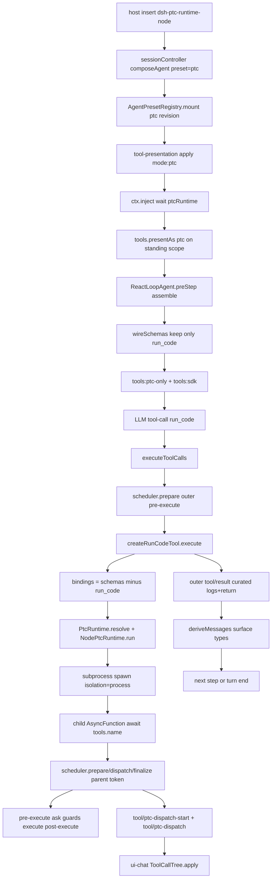

> `spine.trace-code-mode` 走读一条真实路径：会话选 shipped **PTC** preset（声明 id `ptc`，picker 中文名 **PTC 模式**；wiki 节点 id `surface.presets.code` 是稳定别名），agent-preset 面用 `mode: ptc` 把本会话的模型可见工具收成唯一 wire 名 `run_code`，其余能力变成生成 SDK；模型写一段 TypeScript 程序，host 面 `ctx.ptcRuntime`（`PtcRuntime` / `NodePtcRuntime`）在隔离 Node **进程**里跑它，程序里的 `await tools.name(args)` 带着 `parent` token 重入同一套 `tools/pre-execute → execute → post-execute` 守卫，子调用只进 append-only log，不进 `deriveMessages()`。

## 能回答的问题

- `ptc` preset 怎样把 `mode: ptc` 挂到**本会话**，而不改进程默认 catalog？
- 为什么模型只能直接调 `run_code`，其它工具却仍出现在 system prompt 的 SDK 段？
- `await tools.read(...)` 如何带着 `parent` token 重入完整守卫管线（approval / sandbox / timeout）？
- host 面 `ctx.ptcRuntime`、agent-preset 面 `tool-presentation`、client 面 `tool/ptc-dispatch*` 树各管哪一段？
- 子调用为什么写进 session log，却不会在下一轮 LLM 请求里变成 `tool/result`？

```mermaid
flowchart TD
  HostInsert["host insert dsh-ptc-runtime-node"] --> Create["sessionController composeAgent preset=ptc"]
  Create --> Mount["AgentPresetRegistry.mount ptc revision"]
  Mount --> PresentRow["tool-presentation apply mode:ptc"]
  PresentRow --> WaitRT["ctx.inject wait ptcRuntime"]
  WaitRT --> PresentAs["tools.presentAs ptc on standing scope"]
  PresentAs --> PreStep["ReactLoopAgent.preStep assemble"]
  PreStep --> Wire["wireSchemas keep only run_code"]
  Wire --> Prompt["tools:ptc-only + tools:sdk"]
  Prompt --> Model["LLM tool-call run_code"]
  Model --> Loop["executeToolCalls"]
  Loop --> OuterPrep["scheduler.prepare outer pre-execute"]
  OuterPrep --> RunCode["createRunCodeTool.execute"]
  RunCode --> Bind["bindings = schemas minus run_code"]
  Bind --> Resolve["PtcRuntime.resolve + NodePtcRuntime.run"]
  Resolve --> Proc["subprocess spawn isolation=process"]
  Proc --> Prog["child AsyncFunction await tools.name"]
  Prog --> Nested["scheduler.prepare/dispatch/finalize parent token"]
  Nested --> Guards["pre-execute ask guards execute post-execute"]
  Nested --> DispatchLog["tool/ptc-dispatch-start + tool/ptc-dispatch"]
  DispatchLog --> ClientTree["ui-chat ToolCallTree.apply"]
  RunCode --> OuterResult["outer tool/result curated logs+return"]
  OuterResult --> Derive["deriveMessages surface types"]
  Derive --> NextStep["next step or turn end"]
```

## 端到端步骤

本路径默认安装面是本地 Web GUI（`dsh web` = `dsh-base` + `dsh-web-app`）。**host 面**拥有进程级 `ctx.tools` 注册表、`ctx.ptcRuntime`、agent loop、approval / sandbox / checkpoint / session log；**agent-preset 面**拥有本会话的工具插件行和 `tool-presentation`；**client 面**只投影 `tool/ptc-dispatch*` 树，不执行程序。五个 shipped CLI profile 是 `web` / `headless` / `sdk` / `sdk-minimal` / `acp`。[E: packages/boot/app-boot/src/profile.ts:179]

1. `dsh-base` 在 **host 面**插入 `id: ptc-runtime`，插件 `@deepseek-ai/dsh-ptc-runtime-node`，注册 `ctx.ptcRuntime`。[E: packages/bundle/base/cordis.patch.yml:389] [E: packages/bundle/base/cordis.patch.yml:390] `PtcRuntime` 是 Cordis Service Definition：Context 键是 `ptcRuntime`。[E: packages/ptc-runtime/ptc-runtime/src/index.ts:93] [E: packages/ptc-runtime/ptc-runtime/src/index.ts:134] 发布实现 `NodePtcRuntime`：`language = 'typescript'`，`isolation = 'process'`（不是 worker-thread）。[E: packages/ptc-runtime/ptc-runtime-node/src/index.ts:52] [E: packages/ptc-runtime/ptc-runtime-node/src/index.ts:65] [E: packages/ptc-runtime/ptc-runtime-node/src/index.ts:66] 这是进程级 Provider，不是 per-session 副本。web 的 preset roster 默认仍是 `standard`：不选 `ptc` 就不会走本 trace。[E: packages/bundle/web-app/cordis.patch.yml:562]

2. 四个 shipped preset 只叠在 `dsh-web-app`：`dsh.bundle.patch` = `cordis.patch.yml` + `presets/{standard,ptc,minimal,cordis}.patch.yml`。[E: packages/bundle/web-app/package.json:44] [E: packages/bundle/web-app/package.json:46] `PROFILE_TEMPLATES.headless/sdk/acp` 的 bundle 列表不含 `dsh-web-app`，因此不含这些 preset 文件。[E: packages/boot/app-boot/src/profile.ts:181] [E: packages/boot/app-boot/src/profile.ts:187] [E: packages/boot/app-boot/src/profile.ts:190] 浏览器或 Host HTTP API（`packages/api/session-controller`）创建会话时传入 `presetId: 'ptc'`（或事后在 blank 窗口写 `agent-preset/selected`）。`composeAgent` 先 `presets.resolve`，再在 agent `setup` 里 `presets.mount(agentCtx, resolvedId)`。[E: packages/api/session-controller/src/agent.ts:389] [E: packages/api/session-controller/src/agent.ts:394] `AgentPreset` 行把 YAML `id` + `plugins[]` 交给 `agentPresets.register`；registry 为该 id eager-load 一份 standing revision，`mount` 把 Agent 绑到这份 revision，不是扫目录。[E: packages/preset/agent-preset/src/index.ts:28] [E: packages/preset/agent-preset-registry/src/index.ts:80] [E: packages/preset/agent-preset-registry/src/index.ts:257] 无 roster 的部署（`ctx.get('agentPresets') === undefined`）会跳过 mount，会话只能看见 host 默认 catalog。[E: packages/api/session-controller/src/agent.ts:386]

3. `ptc` 的成员资格以 `packages/bundle/web-app/presets/ptc.patch.yml` 为准，不以 package 存在为准。相对 `standard`，可加载增量是 `tool-presentation`：`name: '@deepseek-ai/dsh-agent-tool-presentation'`，`config.mode: ptc`。[E: packages/bundle/web-app/presets/ptc.patch.yml:144] [E: packages/bundle/web-app/presets/ptc.patch.yml:147] `bash` / `read` / `edit` 等工具行仍在 preset 里，继续 `register` 进 **host** 注册表；改变的是**呈现**，不是删行。同文件还挂 `present`（wire 名与 schema 归 `surface.tools.present`，本 trace 不展开）。`workflow-ptc` / `tool-workflow` / `tool-ralph` **全是** `disabled: true`：ptc 没有把 workflow engine 留给 ralph，三行一起关掉。[E: packages/bundle/web-app/presets/ptc.patch.yml:119] [E: packages/bundle/web-app/presets/ptc.patch.yml:121] [E: packages/bundle/web-app/presets/ptc.patch.yml:124] [E: packages/bundle/web-app/presets/ptc.patch.yml:126] [E: packages/bundle/web-app/presets/ptc.patch.yml:127] [E: packages/bundle/web-app/presets/ptc.patch.yml:129] picker 中文名来自 locale 键 `presetPtcName`（`'PTC 模式'`）；shipped 声明不发布 `name` 字段，走 `isBuiltInPreset`。[E: packages/client/ui-agent-preset/src/client/locales.ts:89] [E: packages/preset/agent-preset-registry/src/display.ts:42] [E: packages/preset/agent-preset-registry/src/display.ts:54]

4. `apply@packages/core/agent-tool-presentation/src/index.ts` 是 agent-preset 面选择器：静态 `inject` 只有 `['tools']`（故意不含 `ptcRuntime`，否则 `native` 行也会被 runtime 绑住）。[E: packages/core/agent-tool-presentation/src/index.ts:35] `native` 直接 `presentAs('native')`；`ptc` / `both` 则在 `apply` 里 `ctx.inject(['ptcRuntime'], …)`，等 host 的 runtime 到位后再 `runtimeCtx.tools.presentAs(config.mode)`。[E: packages/core/agent-tool-presentation/src/index.ts:64] [E: packages/core/agent-tool-presentation/src/index.ts:69] [E: packages/core/agent-tool-presentation/src/index.ts:70] 这个动态 wait 是**子 fiber**，不是行的静态 `inject`；`auditRows` 只读 `fiber.inject`，因此缺 runtime 时 mount 审计**不会**点名这一行。[E: packages/preset/agent-preset-registry/src/mount.ts:206] 测试里 row 仍挂着、`assemble` 保持 native 工具表（`echo`），直到后来 `ctx.plugin(StubRuntime)` 才切到 `[run_code]`。[E: packages/core/agent-tool-presentation/tests/agent-tool-presentation.spec.ts:111] [E: packages/core/agent-tool-presentation/tests/agent-tool-presentation.spec.ts:113] [E: packages/core/agent-tool-presentation/tests/agent-tool-presentation.spec.ts:123]

5. `ToolRuntime.presentAs@packages/core/tools/src/index.ts` 必须在 scoped context 上调用（preset 的 standing scope）；全局改法是 host `tools` 行的 `Config.mode`。[E: packages/core/tools/src/index.ts:976] 它把 `layer.mode = mode`（`'native' | 'ptc' | 'both'`），并为本 scope 再注册 `tools:ptc-only` 与 `tools:sdk` 两段。[E: packages/core/tools/src/index.ts:986] [E: packages/core/tools/src/index.ts:995] 同一进程里另一个 `standard` 会话不受影响。host `tools.Config.mode` 默认 `'native'`；web/headless 另有临时 env `DSH_TOOLS_MODE` 可把**整进程**打成 ptc，那是 workaround，不是本 preset 路径。[E: packages/core/tools/src/index.ts:811] [E: packages/core/tools/src/index.ts:852] [E: packages/bundle/web-app/cordis.patch.yml:38] `maxParallelSubCalls` 默认 `10`。[E: packages/core/tools/src/index.ts:796]

6. 第一轮 turn 的 `ReactLoopAgent.preStep` 调 `systemPrompt.assemble(assembleContextFor(this, signal))`。[E: packages/core/agent-loop/src/agent.ts:272] `assembleContextFor` 把 `scope` 设成该 `Agent`，于是 `ctx.systemPrompt.tools` 回调走到 `wireSchemas(scope)`。[E: packages/core/agent/src/dispatch.ts:175] [E: packages/core/tools/src/index.ts:854] `modeFor` 沿 scope 链取最近的 `presentAs`（preset standing 覆盖 host 默认）。[E: packages/core/tools/src/index.ts:922]

7. `wireSchemas` 在非 native 下先 `requirePtcRuntime`；`mode === 'ptc'` 时只把名为 `run_code` 的 schema 交给模型，`knownNames` 也收成 `[RUN_CODE_NAME]`。[E: packages/core/tools/src/index.ts:1020] [E: packages/core/tools/src/index.ts:1022] [E: packages/core/tools/src/index.ts:1024] [E: packages/core/tools/src/index.ts:1025] `view()` 仍在可见表里插入保留 transport `run_code`（`register()` 禁止任何人抢这个名字），再由 `sdkSchemas` 把**除** `run_code` 以外的定义投成 SDK。[E: packages/core/tools/src/index.ts:1080] [E: packages/core/tools/src/index.ts:1216] [E: packages/core/tools/src/index.ts:1267] `both` 则 native schemas 加上 `run_code`。[E: packages/core/tools/src/index.ts:1028]

8. 模型读到两段 prompt：`tools:ptc-only` 写明 `` `run_code` is the only tool you can call directly ``（`both` 下这段为空，因为 native 调用会真执行）；`tools:sdk` 由 `SDK_RENDERERS[runtime.language]` 生成。[E: packages/core/tools/src/index.ts:59] [E: packages/core/tools/src/index.ts:882] [E: packages/core/tools/src/index.ts:908] shipped flavor 联合是 `'typescript' | 'python'`。[E: packages/core/tools/src/ptc.ts:89] TypeScript 渲染器 `renderToolsSdk` 产出 `declare const tools: { [K in ToolName]: (args) => Promise<…> }`，调用约定是 `await tools.name(args)`。[E: packages/core/tools/src/ts-types.ts:297] [E: packages/core/tools/src/ts-types.ts:313] 本仓 published backend 是 `NodePtcRuntime.language = 'typescript'`；Python backend `PythonPtcRuntime` 在 experimental 包，未发布。[E: packages/ptc-runtime/ptc-runtime-node/src/index.ts:65] [E: packages/experimental/ptc-runtime-python/src/index.ts:805] [E: packages/experimental/ptc-runtime-python/src/index.ts:815]

9. `ReactLoopAgent.step` 把 `assembly.tools`（此时只有 `run_code`）和 `session.deriveMessages()` 打进 LLM 请求。[E: packages/core/agent-loop/src/agent.ts:654] 模型回一条 `tool-call`，`name: run_code`，参数 `code`（async 函数体）+ `description`（UI 标题，5–10 词）。[E: packages/core/tools/src/ptc.ts:30] [E: packages/core/tools/src/ptc.ts:105] [E: packages/core/tools/src/ptc.ts:345] `executeToolCalls@packages/core/agent-loop/src/tool-calls.ts` 为每个 block 造 **没有** `parent` 的 `ToolExecutionInput`，先 `session.append('tool/call')`，再走 staged scheduler。[E: packages/core/agent-loop/src/agent.ts:517] [E: packages/core/agent-loop/src/tool-calls.ts:74] [E: packages/core/agent-loop/src/tool-calls.ts:264]

10. 外层 `run_code` 是 top-level 调用：`prepareScheduledExecution` 跑 `tools/pre-execute` waterfall → 可能的 `approval.request`（`allowed-once` 才放行）→ monotonic `guard` → `tools/execute` 包住 body。[E: packages/core/tools/src/index.ts:1505] [E: packages/core/tools/src/index.ts:1605] `session-checkpoint-policy` 在 `tools/execute` 上对 **无** `parent` 的调用 `flush` session，再放行 body；这是外层副作用前的落点。[E: packages/session/session-checkpoint-policy/src/index.ts:71]

11. `createRunCodeTool.execute` 校验非空 `description`，`requireRuntime()` 取 `ctx.ptcRuntime`，为整次 run 建 `AbortController`（外层 abort 或 run settle 都会掐掉未完成子调用）。[E: packages/core/tools/src/ptc.ts:380] [E: packages/core/tools/src/ptc.ts:383] [E: packages/core/tools/src/ptc.ts:412] 它用 `registry.schemas(exec.agent)` 枚举**该 agent 可见**工具，跳过 `run_code` 自身，把每个名字绑成 `await tools.name(args)` 的 `PtcBindingFunction`。[E: packages/core/tools/src/ptc.ts:689] [E: packages/core/tools/src/ptc.ts:690]

12. `runtime.run(runtime.resolve({ program: args.code, bindings: [{ global: 'tools', functions, errorClass: { name: 'ToolCallError', memberNameProperty: 'toolName' } }], signal, … }))` 把程序交给 **host** 缝 `PtcRuntime`。[E: packages/core/tools/src/ptc.ts:697] [E: packages/core/tools/src/ptc.ts:700] Service Definition 规定：程序失败是 `PtcRunResult.error` 字段，`run()` 本身只在合同误用时 reject。[E: packages/ptc-runtime/ptc-runtime/src/types.ts:161] [E: packages/ptc-runtime/ptc-runtime/src/index.ts:150] `NodePtcRuntime.run` 用 `stripTypeScriptTypes` 剥类型（包一层 `async function __dsh_program__` 以便 top-level `await`/`return`），再 `ctx.subprocess.spawn` 起隔离 Node 进程：heap cap、可选 sandbox confine、启动 env 被清空。[E: packages/ptc-runtime/ptc-runtime-node/src/index.ts:207] [E: packages/ptc-runtime/ptc-runtime-node/src/index.ts:236] 这是 containment，不是安全边界——模型代码与 bash 同级信任。

13. 子进程入口 `runWorkerMain` 用 `AsyncFunction` 以 `'use strict'` 执行剥完类型的 body，注入 `tools` 命名空间、`ToolCallError`、裁剪过的 `console`。[E: packages/ptc-runtime/ptc-runtime-node/src/bootstrap.ts:403] [E: packages/ptc-runtime/ptc-runtime-node/src/bootstrap.ts:408] `await tools.read({ path })` 在子进程里只发 control frame `{ type: 'call', global, name, args }`；host `onCall` 做 own-property 查找后调用 `createRunCodeTool` 绑好的 `PtcBindingFunction`。[E: packages/ptc-runtime/ptc-runtime-node/src/index.ts:312] [E: packages/ptc-runtime/ptc-runtime-node/src/index.ts:316]

14. binding 把参数 `snapshotJsonValue` 成无损 JSON，分配 `subCallId = `${parentCallId}:ptc:${n}``，构造带 `parent: exec.token` 的 `ToolExecutionInput`，交给 `registry[TOOL_RUNTIME_SCHEDULER]`。[E: packages/core/tools/src/ptc.ts:545] [E: packages/core/tools/src/ptc.ts:553] [E: packages/core/tools/src/ptc.ts:557] `collapses(name, scope, nested)` 在 `nested === true`（`parent` 已设）时为 false，所以 SDK 子调用可以点名 `read` / `bash`；模型若直接发同名 tool-call，则在 **policy 之前** 变成 `UNKNOWN_TOOL`，文案指引「从 `run_code` 程序里调」。[E: packages/core/tools/src/index.ts:1351] [E: packages/core/tools/src/index.ts:1408] [E: packages/core/tools/src/index.ts:1469]

15. 子调度复刻 native loop 的并发合同：`classify()` 读 `executionMode()`（`isConcurrencySafe === true` 才 parallel，否则 exclusive）；连续 parallel 最多重叠 `maxParallelSubCalls`（Config 默认 10）；exclusive 要等池空且自己的 `commit()`（含 post-execute）完成。[E: packages/core/tools/src/ptc.ts:607] [E: packages/core/tools/src/index.ts:1303] [E: packages/core/tools/src/index.ts:796] driver 单车道跑 ordered 阶段：`start()` 里 `append('tool/ptc-dispatch-start')` + `scheduler.prepare`（再进 `tools/pre-execute` / ask / guards）；`dispatch` 跑 `tools/execute` + 工具 body；`commit()` 里 `finalize`/`finish`（`tools/post-execute`）再 `settle`。[E: packages/core/tools/src/ptc.ts:612] [E: packages/core/tools/src/ptc.ts:622] [E: packages/core/tools/src/ptc.ts:633]

16. `settle` 立刻把完整 JSON value 还给程序；log 复制另走 `tools/ptc-dispatch-log` waterfall（spill 只能改 **durable 副本**），然后 `session.append('tool/ptc-dispatch', { rootCallId, parentCallId, subCallId, name, arguments, isError, content })`。[E: packages/core/tools/src/ptc.ts:570] [E: packages/core/tools/src/index.ts:190] [E: packages/core/tools/src/ptc.ts:586] 含 image 的嵌套结果会 `deferContext`，source plugin id 是 `'ptc-mode'`。[E: packages/core/tools/src/ptc.ts:639] [E: packages/core/tools/src/ptc.ts:14] checkpoint 对 `exec.parent !== undefined` 直接 `next()`：子调用复用外层 `run_code` 已 flush 的落点，不再各自 checkpoint。[E: packages/session/session-checkpoint-policy/src/index.ts:71]

17. **client 面**：`ToolCallTree.apply`（`packages/client/ui-chat`）认 `tool/ptc-dispatch-start` / `tool/ptc-dispatch`，按 `parentCallId` 挂到外层 `run_code` 卡片下。[E: packages/client/ui-chat/src/client/model/tool-call-tree.ts:58] [E: packages/client/ui-chat/src/client/model/tool-call-tree.ts:77] 浏览器不跑子进程、不调 `ctx.tools.execute`。

18. 程序 `return` / `print` 结束（或 `CodeRunFailedError`：`CODE_RUN_FAILED`，带 failure kind + captured logs）。[E: packages/core/tools/src/ptc.ts:176] [E: packages/core/tools/src/ptc.ts:717] `execute` 的 `finally` abort run 并 `drainDispatches`，保证每个已 start 的子调用都 settle。[E: packages/core/tools/src/ptc.ts:713] [E: packages/core/tools/src/ptc.ts:523] 外层 `output.render` 把 `logs` 与 completion value 拼成一段 text（空则 `(run_code completed with no output)`）。[E: packages/core/tools/src/ptc.ts:376] `presentCall` 用模型写的 `description` 作 UI title。[E: packages/core/tools/src/ptc.ts:734] `executeToolCalls` `append('tool/result')`，`surfaceOp: 'append'`。[E: packages/core/agent-loop/src/tool-calls.ts:282] [E: packages/core/agent-loop/src/tool-calls.ts:289]

19. `deriveEventMessage` 只投影 surface 类型：`system/message` / `developer/message` / `user/message` / `assistant/message` / `tool/result`。[E: packages/core/session/src/surface.ts:50] `tool/ptc-dispatch*` 不在 `SURFACE_EVENT_TYPES` 里，走 `default` 返回 `null`：下一 step 的 `deriveMessages()` 看不见子调用正文，模型只看到外层 curated `run_code` 结果。[E: packages/core/session/src/surface.ts:153] 测试钉死 dispatch 事件不派生 model message。[E: packages/core/tools/tests/ptc.spec.ts:1891] [E: packages/core/tools/tests/ptc.spec.ts:1906] 若无更多 tool-call，本 step 以 `completed` 结束 turn。

## 关键决策点

- **呈现属于 preset，注册表属于 host。** `ctx.tools` 与 `ctx.ptcRuntime` 是进程级服务；preset 只 `presentAs('ptc')`。同进程可并排跑 `ptc` 与 `native` 会话。读 `defaultMode` 而不是 `modeFor(scope)` 会让 preset 宣布 `[run_code]` 却仍执行 native 名——`collapses` 故意走 `modeFor`。[E: packages/core/tools/src/index.ts:1351]
- **collapse 在 policy 之前。** 模型直调 `write` 不会进 approval / guard；嵌套子调用因为 `parent` token 绕过 collapse，才重入完整守卫。[E: packages/core/tools/src/index.ts:1408]
- **SDK 是第二套投影，不是第二套工具。** `schemas()` / `wireSchemas` 给 function calling；`renderToolsSdk` 给程序 API。工具插件仍按 preset 成员注册。
- **runtime 缝零工具知识。** `PtcRunRequest` 只有 `program` / `bindings` / `signal` 与可选 cwd/timeout/sandbox；会话、approval、sandbox 全在 consumer（`dsh-tools` 桥）一侧。[E: packages/ptc-runtime/ptc-runtime/src/types.ts:73]
- **model-visible ⟺ logged 的外层结果；子调用 logged 但非 surface。** 子调用必须落盘供 UI / 重建，但不能灌回下一轮 context。
- **缺 runtime 时 `presentAs('ptc')` 不跑，wire 仍是 native。** `requirePtcRuntime` 只在 `mode` 已经是非 `native` 时才读 `ctx.get('ptcRuntime')` 并抛；若动态 wait 从未完成，`modeFor` 仍是 native，assemble 不会走到这行。[E: packages/core/tools/src/index.ts:1046] [E: packages/core/tools/src/index.ts:1048] 插件 JSDoc 写「fails at mount, named in the preset's own activation audit」，与 `auditRows` 只看静态 `inject`、以及 spec 里 assemble 仍返回 `echo` 的断言不一致。[E: packages/preset/agent-preset-registry/src/mount.ts:206] [E: packages/core/agent-tool-presentation/tests/agent-tool-presentation.spec.ts:113] [U]
- **ptc preset 关掉 workflow 三件套。** `workflow-ptc` / `tool-workflow` / `tool-ralph` 在 `ptc.patch.yml` 都是 `disabled: true`。standard / cordis 才启用 `workflow-ptc` + `tool-workflow`，`tool-ralph` 仍 disabled。[E: packages/bundle/web-app/presets/ptc.patch.yml:121] [E: packages/bundle/web-app/presets/standard.patch.yml:119] [E: packages/bundle/web-app/presets/standard.patch.yml:127]

## 指向后续 T1/T2

- `surface.tools.run-code`：`run_code` 的 schema / 输出渲染 / `presentCall` 卡片（`description` 作 title，`code` 作 `rawInput`）。
- `surface.tools.present`：同 preset 挂上的 `present` 工具（本页只点名）。
- `surface.presets.code`：`ptc` vs `standard` 的 patch 成员差、isolate 域、与 web 默认 `standard` 的关系（节点 id 保持 `surface.presets.code`）。
- `subsys.core.code-mode`：flavor 表、SDK codegen、`maxParallelSubCalls`、dispatch 调度不变量（权威文件 `ptc.ts`）。
- `subsys.core.tools`：waterfall 与 `TOOL_RUNTIME_SCHEDULER` 的 staged API。
- `subsys.execution.code-runtime`：`PtcRuntime` 缝与 Node 进程预算（timeout / heap / output cap）。
- `spine.tool-call-anatomy`：外层 `executeToolCalls` 与 native 工具同一条管线（本页只点 PTC 重入）。

## Sources

- packages/core/tools/src/ptc.ts
- packages/core/agent-tool-presentation/src/index.ts
- packages/ptc-runtime/ptc-runtime/src/index.ts
- packages/ptc-runtime/ptc-runtime/src/types.ts
- packages/ptc-runtime/ptc-runtime-node/src/index.ts
- packages/ptc-runtime/ptc-runtime-node/src/bootstrap.ts
- packages/bundle/web-app/presets/ptc.patch.yml
- packages/bundle/web-app/package.json
- packages/bundle/web-app/cordis.patch.yml
- packages/bundle/base/cordis.patch.yml
- packages/bundle/headless/cordis.patch.yml
- packages/core/tools/src/index.ts
- packages/core/tools/src/types.ts
- packages/core/tools/src/ts-types.ts
- packages/core/tools/tests/ptc.spec.ts
- packages/core/agent-tool-presentation/tests/agent-tool-presentation.spec.ts
- packages/preset/agent-preset/src/index.ts
- packages/preset/agent-preset-registry/src/index.ts
- packages/preset/agent-preset-registry/src/mount.ts
- packages/preset/agent-preset-registry/src/display.ts
- packages/core/agent-loop/src/agent.ts
- packages/core/agent-loop/src/tool-calls.ts
- packages/core/agent/src/dispatch.ts
- packages/core/session/src/surface.ts
- packages/api/session-controller/src/agent.ts
- packages/session/session-checkpoint-policy/src/index.ts
- packages/client/ui-chat/src/client/model/tool-call-tree.ts
- packages/client/ui-agent-preset/src/client/locales.ts
- packages/experimental/ptc-runtime-python/src/index.ts
- packages/boot/app-boot/src/profile.ts
- packages/bundle/web-app/presets/standard.patch.yml

## 相关

- [spine.tool-call-anatomy](tool-call-anatomy.md) — native `tool/call` 的 `pre-execute → execute → post-execute` 解剖；本 trace 的子调用重入同一管线。
- [surface.tools.run-code](../surface/tools/run-code.md) — `run_code` 工具身份、参数与结果卡片。
- [surface.presets.code](../surface/presets/code.md) — shipped PTC preset（`presets/ptc.patch.yml`）的成员与装配。
- [subsys.core.code-mode](../subsystems/core/code-mode.md) — PTC 运行时与 SDK 投影子系统（`ptc.ts`）。
