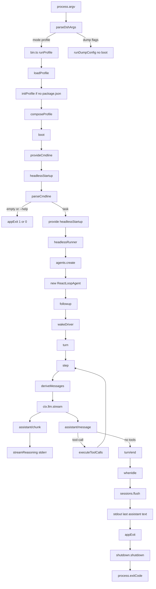

> `dsh --profile headless "<task>"` 是一条 **无 HTTP、无 browser client、无 shipped preset roster** 的 one-shot 路径：launcher 只选 profile，`headless-startup` 把 task positional 做成 `headlessStartup` 服务，`headless-runner` 在 host 面 `agents.create` 一次、`followup` 一次，等 `ReactLoopAgent` 收敛后把 reasoning 打到 stderr、打印最后一条 assistant text，再按 `turn/end` reason 经 `ctx.appExit` 让进程退出。

DSH 是 **Cordis 组合运行时**（`profile → bundle`；web 才会再叠 shipped `agent-presets` roster），不是「又一个 coding agent」。这条 trace 的三面边界：

- **host 面（进程级）**：CLI launcher、`runProfile` / `boot`、`dsh-base` 挂上的 `sessions` / `agent-loop` / `tools` / `llm` / `fs` / sandbox / approval / subagent 后端，以及本 bundle 的 `headless-startup` 与 `headless-runner`。这里 **没有** `dsh-host-*` webserver。[E: apps/cli/tests/built-bin.e2e.ts:1057]
- **agent-preset 面（每会话 tools / persona / isolate）**：默认 **不存在**。`dsh-headless` overlay 的 `insert` 只有 `code-runtime` / `headless-startup` / `headless-runner`，没有 `id: agent-presets`。[E: packages/bundle/headless/cordis.patch.yml:20] [E: packages/bundle/headless/cordis.patch.yml:23] [E: packages/bundle/headless/cordis.patch.yml:27] `runProfile` 的 `composeProfile` 不再根据 roster 行补 shipped preset root。
- **client 面**：不存在。dump 断言树里没有 `@deepseek-ai/dsh-web-app`、没有 `dsh-client-*`。[E: apps/cli/tests/built-bin.e2e.ts:1058] [E: apps/cli/tests/built-bin.e2e.ts:1059]

launcher 把长期 Web 进程做成 `dsh web`（`--profile web` 的硬编码 alias）。同一 launcher 还可 `dsh --profile sdk|sdk-minimal|acp|headless`。`desktop` 是 Electron 壳独占目录，不是 `PROFILE_TEMPLATES` 成员。headless 是 **无 server 的一次性任务进程**；`PROFILE_TEMPLATES.headless.patchReload` 是 `'startup'`，boot 后不 watch 用户 patch。[E: packages/boot/app-boot/src/profile.ts:114] [E: apps/cli/src/profile-boot.ts:355]

## 能回答的问题

- `dsh --profile headless "<task>"` 从 argv 到进程退出的真实调用链是什么？
- 有没有 `dsh headless` 这种像 `dsh web` 的 alias？task 几个词在哪一层拼成一句？
- 这棵树有没有 HTTP server / browser client / shipped preset roster？模型可见工具挂在哪一面？
- 空 task、`--help`、`turn/end` 非 `completed` 时进程怎么退？
- `headless-runner` 怎样 `agents.create` + `followup`，又怎样从 session log 抽出 stdout / stderr reasoning？
- host 面、agent-preset 面、client 面在这条路径上各自停在哪？

## 端到端步骤

本页走读的那一次调用是：`dsh --profile headless "run the tests"`（或等价的未加引号多词 `dsh --profile headless run the tests`）。模型若只回纯文本、不带 `tool-call`，就是 built-bin 验收的那条成功路径。

1. `parseDshArgs@apps/cli/src/args.ts` 只吃 launcher 旗标 `--profile` / `--patch` / `--dump-*` / `-V`。第一个它不认识的 token 起全部留给 app。`dsh --profile headless run the tests` 解析成 `{ mode: 'profile', profile: 'headless', patches: [], args: ['run', 'the', 'tests'] }`。[E: apps/cli/src/args.ts:126] [E: apps/cli/tests/args.spec.ts:43] 没有 `dsh headless` 子命令；唯一硬编码 alias 是 `web`。[E: apps/cli/src/args.ts:175] help 例子写的就是 `--profile headless`。[E: apps/cli/src/args.ts:80]

2. `bin.ts` 在 `mode: 'profile'` 里动态 `import('./profile-boot.ts')`，再 `runProfile({ environment: loadLayeredEnv('dsh'), profile, patchFiles, args })`。[E: apps/cli/src/bin.ts:32] [E: apps/cli/src/bin.ts:34] `--dump-config` / `--dump-default-config` 走另一条 `runDumpConfig`，不 boot、不跑 runner。[E: apps/cli/src/bin.ts:48]

3. `runProfile@apps/cli/src/profile-boot.ts` 先走文件内 `composeProfile`：`prepareProfile` → `loadProfile`。[E: apps/cli/src/profile-boot.ts:292] [E: apps/cli/src/profile-boot.ts:226] `$DSH_HOME/profiles/headless/package.json` 尚不存在时，名字命中 `PROFILE_TEMPLATES.headless`（`['@deepseek-ai/dsh-base', '@deepseek-ai/dsh-headless']`，`patchReload: 'startup'`），`initProfile` 写出 manifest。[E: packages/boot/app-boot/src/profile.ts:114] [E: packages/boot/app-boot/src/profile.ts:165] [E: packages/boot/app-boot/src/profile.ts:827] 未知名字第一次不会自动 init。[E: packages/boot/app-boot/src/profile.ts:822]

4. `loadProfile` 读完 manifest 必走 `normalizeShippedProfile`。旧安装若 **精确等于** 三元组 `dsh-base + dsh-web-app + dsh-headless`，会被写回两元组模板；任何加料 / 改序都不动。[E: packages/boot/app-boot/src/profile.ts:829] [E: packages/boot/app-boot/src/profile.ts:689] [E: packages/boot/app-boot/src/profile.ts:130] `@deepseek-ai/dsh-headless` 的 manifest 把 bundle patch 指到本包 `./cordis.patch.yml`。[E: packages/bundle/headless/package.json:38]

5. `composeProfile` 按顺序叠：bundle 层（先 `dsh-base` 再 `dsh-headless`）→ profile 用户层 → home `$DSH_HOME/cordis.patch.yml` → `--patch` → `DSH_TELEMETRY_DISABLED` 非空则 disable `session-telemetry-otel`。[E: apps/cli/src/profile-boot.ts:237] [E: apps/cli/src/profile-boot.ts:241] 默认 headless 没有 `agent-presets` 行，也没有 launcher 侧 shipped roster 补丁。

6. `dsh-headless` overlay 做两件组合事：覆盖 `system-prompt.personaPrefix` / `personaSuffix`；`tools.mode` 读 `process.env.DSH_TOOLS_MODE`（unset 时表达式是 `undefined`，`dsh-tools` schema 默认 `native`）。然后 insert `code-runtime`、`headless-startup`、`headless-runner`（`inject: [headlessStartup]`，`config.task: !!js ctx.headlessStartup.task`）。[E: packages/bundle/headless/cordis.patch.yml:7] [E: packages/bundle/headless/cordis.patch.yml:16] [E: packages/core/tools/src/index.ts:784] [E: packages/bundle/headless/cordis.patch.yml:31] `dsh-base` 已经 insert 的 `tool-*` 本 overlay **不** disable，继续挂在 host 面。`agent-loop` 的 declarative `agents: []`，不会在 boot 时自己造 Agent。[E: packages/bundle/base/cordis.patch.yml:475] 本 overlay **没有** `hmr.disabled` 行。

7. `boot@packages/boot/app-boot/src/index.ts` 在任何 config-tree 行 mount 之前跑 prepare：`provideCmdline` 把 inner args 冻成 `ctx.cmdlineArgs`，并把 `exit: code => shutdown.shutdown(code)` 做成 `ctx.appExit`。[E: packages/boot/app-boot/src/index.ts:787] [E: apps/cli/src/profile-boot.ts:343] [E: packages/boot/cmdline/src/index.ts:86] [E: packages/boot/cmdline/src/index.ts:88] 这是 launcher 事实，不是 preset 配置。`runProfile` 只在 `composed.profile.patchReload === 'live'` 时补 watch-only HMR；headless 模板是 `'startup'`，不装 watcher。[E: apps/cli/src/profile-boot.ts:355] one-shot 的 `appExit` 仍可在这段 setup 中途 dispose 整棵树。

8. `headless-startup.apply@packages/bundle/headless/src/startup.ts` 注入 `cmdlineArgs`，commander 程序名是 `dsh --profile headless`，位置参数 `[task...]`，action 里 `program.args.join(' ')`。[E: packages/bundle/headless/src/startup.ts:16] [E: packages/bundle/headless/src/startup.ts:33] [E: packages/bundle/headless/src/startup.ts:52] `task.trim() === ''` 走 `program.error(...)`，**不** `provide(HEADLESS_STARTUP_SERVICE)`。[E: packages/bundle/headless/src/startup.ts:53] `parseCmdline` 把 commander 的 help / 用法错误收成 `ctx.appExit`。[E: packages/bundle/headless/src/startup.ts:56] [E: packages/boot/cmdline/src/index.ts:184] 测试：多词拼成 `run the tests` 且 runner config 同步拿到；空 task 退出 `1` 且 runner 保持 pending；`--help` 退出 `0` 且不 provide 服务。[E: packages/bundle/headless/tests/startup.spec.ts:88] [E: packages/bundle/headless/tests/startup.spec.ts:96] [E: packages/bundle/headless/tests/startup.spec.ts:105] built-bin：无 task 的 stderr 含 `a task is required`。[E: apps/cli/tests/built-bin.e2e.ts:397]

9. 非空 task 时 action `ctx.provide('headlessStartup', { task })`。[E: packages/bundle/headless/src/startup.ts:54] Loader 这才满足 `headless-runner` 的 `inject: [headlessStartup]`，`!!js` 把 `ctx.headlessStartup.task` 写进 runner `Config.task`（`z.string().required()`）。[E: packages/bundle/headless/src/index.ts:39]

10. `headless-runner.apply@packages/bundle/headless/src/index.ts` 用 `ctx.get('appExit')` 读 launcher 出口；缺了同步抛 `the launcher must provide ctx.appExit before the tree mounts`。[E: packages/bundle/headless/src/index.ts:223] [E: packages/bundle/headless/src/index.ts:225] 然后 `void run(...)`，**不**阻塞 `apply`，也不阻塞随后 `runProfile` 的返回。[E: packages/bundle/headless/src/index.ts:228] 进程靠仍挂着的 Cordis 树与 in-flight `run` 活着。

11. `run` 先 `await ctx.get('loader')?.await()`，避免并发 mount 时工具 / adapter 半组成。[E: packages/bundle/headless/src/index.ts:173] 若 settlement 期间树已被 dispose，三个核心服务缺失则直接 `return`，不再 `appExit`。[E: packages/bundle/headless/src/index.ts:178] 否则读 `agentDefaultModel.currentSelection()`。[E: packages/bundle/headless/src/index.ts:180] [E: packages/core/agent-default-model/src/index.ts:90] base 组合默认是 `provider: deepseek-official`、`model: deepseek-flash`（Settings 可覆盖；catalog 另有 `deepseek-v4-flash`，acp-app 仍硬编码后者）。[E: packages/bundle/base/cordis.patch.yml:78] [E: packages/bundle/base/cordis.patch.yml:79]

12. `agents.create@packages/core/agent/src/index.ts` 把调用转到已注册 factory。[E: packages/core/agent/src/index.ts:388] `AgentLoop` 构造时 `ctx.agents.setFactory(this)`。[E: packages/core/agent-loop/src/index.ts:420] `createAgent` 准备 Session，lifecycle 里 `new ReactLoopAgent(...)`，`setup` 跑完再 `publish`。[E: packages/core/agent-loop/src/index.ts:765] [E: packages/core/agent-loop/src/index.ts:624] runner 传入 `sessionId: brandString<SessionId>("session-" + randomUUID())`、`meta.cwd = process.cwd()`、`agentOptions: { provider, model }`；`setup` **只** `installModelSelection`，把选择钉在这个 Agent 的 prompt / `agent/request` 上。[E: packages/bundle/headless/src/index.ts:185] [E: packages/core/session/src/types.ts:19] [E: packages/bundle/headless/src/index.ts:191] [E: packages/core/agent/src/model-selection.ts:76] 没有 preset child realm 可 join。

13. 新 Agent 处于 `idle`。runner `await agent.whenIdle()` 后记下 `firstSeq = agent.session.seq`（下一条事件的序号，等于当前 log 长度），挂上 `streamReasoning`，再 **一次** `followup(createUserMessage({ content: [{ type: 'text', text: task }], source: { kind: 'user' } }))`。[E: packages/bundle/headless/src/index.ts:194] [E: packages/bundle/headless/src/index.ts:198] [E: packages/llm/llm/src/message.ts:204] `firstSeq` 把 create 前已经在 log 里的噪声 turn 排除在打印窗口外。[E: packages/bundle/headless/tests/headless.spec.ts:120] reasoning 来自本 Agent 的 `agent/assistant-stream` `reasoning-delta`，前缀 `dsh: reasoning:` 写到 stderr。[E: packages/bundle/headless/src/index.ts:128]

14. `ReactLoopAgent.followup@packages/core/agent-loop/src/agent.ts` 等于 `send(input, 'next-turn', true)`：消息进 `ReactLoopInbox`（实现在 `packages/core/agent-loop/src/inbox.ts`，不是已删除的 `agent/src/inbox.ts`）的 `next-turn`，并 `wakeDriver`。[E: packages/core/agent-loop/src/agent.ts:137] [E: packages/core/agent-loop/src/agent.ts:106] idle 时 `setPhase({ kind: 'running', ... })`，然后 `kick()` 循环 `turn()`。[E: packages/core/agent-loop/src/agent.ts:200] [E: packages/core/agent-loop/src/agent.ts:227]

15. `turn()` 先 `session.append('turn/start')`，`preStep` 用 `inbox.claim(target, position.turn)` 取出用户任务（本 turn 的第一个 target 是 `'next-turn'`），装配 `systemPrompt`。[E: packages/core/agent-loop/src/agent.ts:278] [E: packages/core/agent-loop/src/agent.ts:244] [E: packages/core/agent-loop/src/inbox.ts:111] `step()` 先把 assemble 提交写成 `system/message`（`SESSION_FORMAT_VERSION = 3` 的 derived history；`request/header` 不再带 `system` 字符串），再把 claimed `UserMessage` 以 `surfaceOp: 'append'` 写入 `user/message`。[E: packages/core/session/src/types.ts:88] [E: packages/core/agent-loop/src/agent.ts:371] [E: packages/core/agent-loop/src/agent.ts:375] 每轮用 `session.deriveMessages()` 投影模型历史，再 `ctx.llm.stream`（或 `preparedCall.stream`）。[E: packages/core/agent-loop/src/agent.ts:603] [E: packages/core/session/src/index.ts:832] [E: packages/core/agent-loop/src/agent.ts:390] `AssistantStreamAttempt` 收 chunk 后 append `assistant/message`（`surfaceOp: 'append'`）。[E: packages/core/agent-loop/src/agent.ts:476] 没有 `tool-call` block 就 `return { kind: 'completed' }`。[E: packages/core/agent-loop/src/agent.ts:487] 有则 `executeToolCalls`，结果 context splice 进 `next-step`，同 turn 继续下一 step。[E: packages/core/agent-loop/src/agent.ts:488] [E: packages/core/agent-loop/src/tool-calls.ts:60] `finally` 里 `session.append('turn/end', { turn, reason })`。[E: packages/core/agent-loop/src/agent.ts:339] inbox 若仍有 pending，`kick` 会再开下一 turn；本 trace 的 runner 不再 `followup` / `steer` / `inject`，通常就是 **一个 turn、1..n 个 step**。

16. `whenIdle()` 等到 `activityDone` 不再被替换，即 driver 收敛。[E: packages/core/agent-loop/src/agent.ts:210] runner 再 `sessions.flush(agent.session)`——这是 store 拥有的耐久检查点，有无 persistence 监听者都走同一入口。[E: packages/bundle/headless/src/index.ts:206] [E: packages/core/session/src/index.ts:1144] 顺序是 **先 flush 再 exit**。[E: packages/bundle/headless/src/index.ts:212]

17. 文件内 `summarize` 从 `firstSeq` 起扫描：见到 `turn/start` 才开始；每个非空 `assistant/message` 文本覆盖 `text`；最后一个 `turn/end` 的 `reason` 留下。这段现仍走 `session.eventAt`（源码标 deprecated，迁移未完成），不是推荐的新生产读法。[E: packages/bundle/headless/src/index.ts:64] [E: packages/bundle/headless/src/index.ts:71] stdout 写 `text + '\n'`。[E: packages/bundle/headless/src/index.ts:208] `reason.kind === 'error'` 时 stderr 再写 `dsh: ${code}: ${message}`。[E: packages/bundle/headless/src/index.ts:209] `appExit(reason?.kind === 'completed' ? 0 : 1)`：无 turn、`aborted`、error 都是 `1`。[E: packages/bundle/headless/src/index.ts:212] 跨两个 scripted turn 只打印最后一条 `final answer`；error reason 退出 `1` 且 stderr 为 `dsh: SERVER: provider unavailable`。[E: packages/bundle/headless/tests/headless.spec.ts:130] [E: packages/bundle/headless/tests/headless.spec.ts:276] `run` 抛错（含 `agents.create` reject）走 `fail`：stderr `dsh: <message>`，`exit(1)`。[E: packages/bundle/headless/src/index.ts:160] [E: packages/bundle/headless/tests/headless.spec.ts:327]

18. `ctx.appExit` 就是 `shutdown.shutdown(code)`。[E: apps/cli/src/profile-boot.ts:345] 正常完成：dispose 整棵树后 `complete(code)` 只设 `process.exitCode`，**不** `process.exit`；event loop 排空后进程退出。[E: apps/cli/src/process-shutdown.ts:66] [E: apps/cli/src/process-shutdown.ts:25] dispose 超过 `PROCESS_SHUTDOWN_TIMEOUT_MS`（5000）会强制 `process.exit`。[E: apps/cli/src/process-shutdown.ts:4] `SIGTERM` → `interrupt(0)`；`SIGINT` → `interrupt(130)`，这两条在 dispose 之后会 `process.exit`。[E: apps/cli/src/profile-boot.ts:309] [E: apps/cli/src/profile-boot.ts:310] [E: apps/cli/src/process-shutdown.ts:69] built-bin 用 mock LLM 跑 `dsh --profile headless`：退出 `0`，stdout 正是 mock 文本，stderr 含 `dsh: reasoning:`。[E: apps/cli/tests/built-bin.e2e.ts:582] [E: apps/cli/tests/built-bin.e2e.ts:587]

## 关键决策点

- **Launcher vs app 旗标**：`--profile` / `--patch` / dump 是 launcher 的；`[task...]` 与 `--help` 是 `headless-startup` 的。没有 `dsh headless` alias。`--host` / `--port` / `--no-open` 是 web app 旗标，本 commander 不声明。
- **无 server**：headless overlay 不 insert Host / HTTP / browser。`dsh --profile headless --dump-default-config` 必须看到 `@deepseek-ai/dsh-headless`，且不得出现 `dsh-host-*`、`dsh-web-app`、`dsh-client-*`。[E: apps/cli/tests/built-bin.e2e.ts:1056]
- **preset 面缺席**：默认树没有 `agent-presets` 行。不要把 shipped `minimal` / `standard` / `ptc` / `cordis` 说成 headless 的默认装配。模型可见 `tool-*` 留在 **host 面**（`dsh-base` insert，本 overlay 未 disable）。persona 也是 host 面覆盖（`personaPrefix` / `personaSuffix`），不是 per-session preset。
- **空 task / `--help` 不启动 runner**：不 provide `headlessStartup` 时，`inject: [headlessStartup]` 的 runner 行保持 pending，进程只靠 `parseCmdline` 的 `appExit` 退。
- **一次 followup，idle-to-idle**：runner 不循环提问、不 `steer`、不 `inject`。打印窗口是 `firstSeq..end` 里最后一条非空 assistant text，不是「第一个 turn」。reasoning 只走 stderr。
- **退出码只看最后 `turn/end`**：`completed` → 0；其它 reason（含没有 turn）→ 1。模型失败会额外把 `error.code` / `error.message` 打到 stderr。
- **审批默认仍是 `ask`**：base 的 `approval.policy` 在 `DSH_PERMISSION_MODE === 'danger-full-access'` 时才是 `never`，否则 `ask`。[E: packages/bundle/base/cordis.patch.yml:227] headless overlay 不改这一行。`ask` 且没有 answerer 声称请求时，waterfall 的 terminal 是 `'unavailable'`。[E: packages/interaction/user-approval/src/index.ts:276] 纯文本成功路径（built-bin mock）不经过工具，也就不问审批。需要无人值守放行工具时，必须自己改 policy / env，不能假设 headless 自动 `never`。
- **client 面为零**：没有浏览器半边，没有 Host API 把提问从 UI 送进来。提问来源是 argv → `headlessStartup.task` → `createUserMessage`。
- **PTC**：unset `DSH_TOOLS_MODE` 时 host 面 `tools.mode` 默认 `native`。headless 仍 insert `code-runtime`，以便 env 切到 `ptc` / `both` 时 `run_code` 有执行后端（权威实现 `packages/core/tools/src/ptc.ts`）。

## 指向后续 T1/T2

- `surface.profiles.headless`（[../surface/profiles/headless.md](../surface/profiles/headless.md)）— profile 模板、patch 每一行、旧三元组 normalize、host 面工具表。
- `surface.cli.overview`（[../surface/cli/overview.md](../surface/cli/overview.md)）— launcher 三种 mode、`--profile` / `--patch` / dump 互斥。
- `subsys.composition.bundle-headless`（[../subsystems/composition/bundle-headless.md](../subsystems/composition/bundle-headless.md)）— `@deepseek-ai/dsh-headless` 包与 patch 层。
- `subsys.composition.app-boot`（[../subsystems/composition/app-boot.md](../subsystems/composition/app-boot.md)）— `loadProfile` / `composeEntries` / `boot`。
- `subsys.composition.cmdline`（[../subsystems/composition/cmdline.md](../subsystems/composition/cmdline.md)）— `provideCmdline` / `parseCmdline` / `appExit`。
- `subsys.core.agent-loop`（[../subsystems/core/agent-loop.md](../subsystems/core/agent-loop.md)）— 可替换 factory、`ReactLoopAgent.turn` / `step`。
- `subsys.core.agent-inbox`（[../subsystems/core/agent-inbox.md](../subsystems/core/agent-inbox.md)）— `followup` / `steer` / `inject` 三个入口。
- `subsys.core.session`（[../subsystems/core/session.md](../subsystems/core/session.md)）— append-only log、`deriveMessages`、`sessions.flush`。
- `subsys.core.agent-default-model`（[../subsystems/core/agent-default-model.md](../subsystems/core/agent-default-model.md)）— `currentSelection()` 默认路由。
- `subsys.core.code-mode`（[../subsystems/core/code-mode.md](../subsystems/core/code-mode.md)）— PTC / `run_code`（稳定别名节点）。

## Sources

- packages/bundle/headless/src/startup.ts
- packages/bundle/headless/src/index.ts
- packages/bundle/headless/cordis.patch.yml
- packages/bundle/headless/package.json
- packages/bundle/headless/tests/startup.spec.ts
- packages/bundle/headless/tests/headless.spec.ts
- apps/cli/src/bin.ts
- apps/cli/src/args.ts
- apps/cli/src/profile-boot.ts
- apps/cli/src/process-shutdown.ts
- apps/cli/tests/args.spec.ts
- apps/cli/tests/built-bin.e2e.ts
- packages/boot/app-boot/src/profile.ts
- packages/boot/app-boot/src/index.ts
- packages/boot/cmdline/src/index.ts
- packages/bundle/base/cordis.patch.yml
- packages/core/agent-loop/src/agent.ts
- packages/core/agent-loop/src/index.ts
- packages/core/agent-loop/src/inbox.ts
- packages/core/agent-loop/src/tool-calls.ts
- packages/core/agent/src/index.ts
- packages/core/agent/src/model-selection.ts
- packages/core/session/src/index.ts
- packages/core/session/src/types.ts
- packages/core/agent-default-model/src/index.ts
- packages/llm/llm/src/message.ts
- packages/core/tools/src/index.ts
- packages/interaction/user-approval/src/index.ts

## 相关

- [`spine.composition-boot`](composition-boot.md) — 空入口表如何叠 bundle / home / `--patch`；`PROFILE_TEMPLATES`（web / headless / sdk / sdk-minimal / acp）；`dsh --dump-config` 看真树。
- [`spine.turn-and-step`](turn-and-step.md) — turn = 0..n step；inbox `followup` / `steer` / `inject`；loop 可替换。
- [`surface.profiles.headless`](../surface/profiles/headless.md) — headless profile 的字段、patch 行与门控表。
