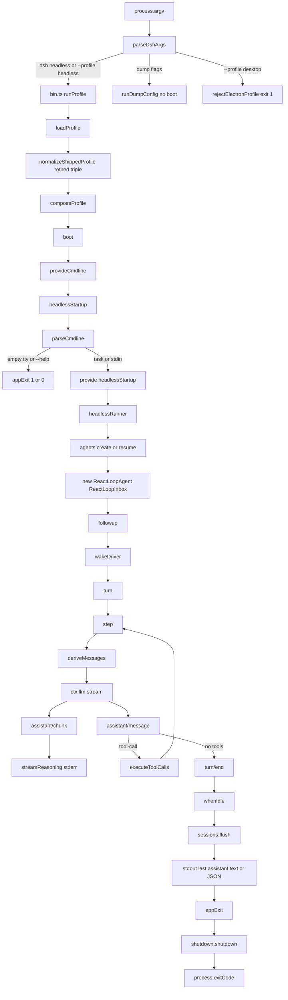

> `dsh --profile headless "<task>"`（`dsh headless "<task>"` 是同一条简写）是一条 **无 HTTP、无 browser client、无 shipped preset roster** 的 one-shot 路径：launcher 只选 profile，模板是 `dsh-base` + `dsh-headless`（**没有** web-app 那四份 `presets/*.patch.yml`）。`headless-startup` 把 task positional / stdin / `--session-id` / `--json` 做成 `headlessStartup` 服务，`headless-runner` 在 host 面 `agents.create`（或 resume）一次、`followup` 一次，等 `ReactLoopAgent` 收敛后把 reasoning 打到 stderr、打印最后一条 assistant text（或 JSON 事件流），再按 `turn/end` reason 经 `ctx.appExit` 让进程退出。

DSH 是 **Cordis 组合运行时**（`profile → bundle`；web 才会再叠 shipped preset 声明），不是「又一个 coding agent」。这条 trace 的三面边界：

- **host 面（进程级）**：CLI launcher、`runProfile` / `boot`、`dsh-base` 挂上的 `sessions` / `agent-loop` / `tools` / `llm` / `fs` / sandbox / approval / subagent 后端，以及本 bundle 的 `headless-startup` 与 `headless-runner`。这里 **没有** `dsh-host-*` webserver。 [E: apps/cli/tests/built-bin.e2e.ts:1230]
- **agent-preset 面（每会话 tools / persona / isolate）**：默认 **不存在**。`dsh-headless` overlay 的 `insert` 只有 `headless-startup` / `headless-runner`，没有 `agent-preset-registry`，也没有 `preset-standard` 等四份声明。 [E: packages/bundle/headless/cordis.patch.yml:21] [E: packages/bundle/headless/cordis.patch.yml:25] [E: packages/bundle/headless/package.json:39] `PROFILE_TEMPLATES.headless` 是 `['@deepseek-ai/dsh-base', '@deepseek-ai/dsh-headless']`。 [E: packages/boot/app-boot/src/profile.ts:187]
- **client 面**：不存在。dump 断言树里没有 `@deepseek-ai/dsh-web-app`、没有 `dsh-client-*`。 [E: apps/cli/tests/built-bin.e2e.ts:1231] [E: apps/cli/tests/built-bin.e2e.ts:1232]

launcher 把长期 Web 进程做成 `dsh web`（`--profile web` 的简写）。同一 launcher 还可 `dsh --profile sdk|sdk-minimal|acp|headless`。`rejectElectronProfile` 仍拒绝 CLI `--profile desktop`。headless overlay 把 base 的 `hmr` 行标 `disabled: true`，boot 后不 watch 用户 patch。 [E: packages/bundle/headless/cordis.patch.yml:34] [E: apps/cli/src/args.ts:84]

## 能回答的问题

- `dsh --profile headless "<task>"` 从 argv 到进程退出的真实调用链是什么？
- 有没有 `dsh headless` 这种像 `dsh web` 的简写？task 几个词在哪一层拼成一句？stdin / `--json` / `--session-id` 走哪？
- 这棵树有没有 HTTP server / browser client / shipped preset roster？模型可见工具挂在哪一面？
- 历史 `base+web-app+headless` tuple 会不会被归一？`dsh --profile desktop` 呢？
- 空 task、`--help`、`turn/end` 非 `completed` 时进程怎么退？
- `headless-runner` 怎样 `agents.create` + `followup`，又怎样从 session log 抽出 stdout / stderr reasoning？
- host 面、agent-preset 面、client 面在这条路径上各自停在哪？inbox 实现是谁？会话格式是几？

```mermaid
flowchart TD
  argv["process.argv"] --> parseDshArgs
  parseDshArgs -->|"dsh headless or --profile headless"| binProfile["bin.ts runProfile"]
  parseDshArgs -->|"dump flags"| dumpConfig["runDumpConfig no boot"]
  parseDshArgs -->|"--profile desktop"| rejectDesktop["rejectElectronProfile exit 1"]
  binProfile --> loadProfile
  loadProfile --> normalize["normalizeShippedProfile retired triple"]
  normalize --> composeProfile
  composeProfile --> boot
  boot --> provideCmdline
  provideCmdline --> headlessStartup
  headlessStartup --> parseCmdline
  parseCmdline -->|"empty tty or --help"| earlyExit["appExit 1 or 0"]
  parseCmdline -->|task or stdin| provideSvc["provide headlessStartup"]
  provideSvc --> headlessRunner
  headlessRunner --> agentsCreate["agents.create or resume"]
  agentsCreate --> reactLoop["new ReactLoopAgent ReactLoopInbox"]
  reactLoop --> followup
  followup --> wakeDriver
  wakeDriver --> turn
  turn --> step
  step --> deriveMessages
  deriveMessages --> llmStream["ctx.llm.stream"]
  llmStream --> assistantChunk["assistant/chunk"]
  assistantChunk --> reasoning["streamReasoning stderr"]
  llmStream --> assistantMsg["assistant/message"]
  assistantMsg -->|"tool-call"| executeToolCalls
  executeToolCalls --> step
  assistantMsg -->|"no tools"| turnEnd["turn/end"]
  turnEnd --> whenIdle
  whenIdle --> flush["sessions.flush"]
  flush --> stdout["stdout last assistant text or JSON"]
  stdout --> appExit
  appExit --> shutdown["shutdown.shutdown"]
  shutdown --> exitCode["process.exitCode"]
```

## 端到端步骤

本页走读的那一次调用是：`dsh --profile headless "run the tests"`（或等价的未加引号多词 `dsh --profile headless run the tests` / `dsh headless run the tests`）。模型若只回纯文本、不带 `tool-call`，就是 built-bin 验收的那条成功路径。

1. `parseDshArgs@apps/cli/src/args.ts` 只吃 launcher 旗标 `--profile` / `--from-default-profile` / `--patch` / `--dump-*` / `-V`。第一个不以 `-` 开头、且不是 `plugin` 的 token 展开成 `--profile <name>`，所以 `dsh headless` 与 `dsh --profile headless` 等价。 [E: apps/cli/src/args.ts:202] `dsh --profile headless run the tests` 解析成 `{ mode: 'profile', profile: 'headless', patches: [], args: ['run', 'the', 'tests'] }`。 [E: apps/cli/tests/args.spec.ts:43] 简写矩阵把 `headless` 与显式 `--profile` 钉成同一合同。 [E: apps/cli/tests/args.spec.ts:59] help 例子写的是 `--profile headless` 与 `dsh headless "run the tests"`。 [E: apps/cli/src/args.ts:95] `rejectElectronProfile` 仍拒绝 `--profile desktop`。 [E: apps/cli/src/args.ts:84] [E: apps/cli/tests/args.spec.ts:208]

2. `bin.ts` 在 `mode: 'profile'` 里动态 `import('./profile-boot.ts')`，再 `runProfile({ environment: loadLayeredEnv('dsh'), profile, fromDefaultProfile, patchFiles, args })`。 [E: apps/cli/src/bin.ts:24] [E: apps/cli/src/bin.ts:26] `--dump-config` / `--dump-default-config` 走另一条 `runDumpConfig`，不 boot、不跑 runner。 [E: apps/cli/src/bin.ts:45]

3. `runProfile@apps/cli/src/profile-boot.ts` 先走文件内 `composeProfile`：`prepareProfile` → `loadProfile`。 [E: apps/cli/src/profile-boot.ts:265] [E: apps/cli/src/profile-boot.ts:168] `$DSH_HOME/profiles/headless/package.json` 尚不存在时，名字命中 `PROFILE_TEMPLATES.headless`（`['@deepseek-ai/dsh-base', '@deepseek-ai/dsh-headless']`），`initProfile` 写出 manifest。 [E: packages/boot/app-boot/src/profile.ts:187] [E: packages/boot/app-boot/src/profile.ts:715] 未知名字第一次不会自动 init。 [E: packages/boot/app-boot/src/profile.ts:711]

4. `loadProfile` 读完 manifest 必走 `normalizeShippedProfile`。旧安装若 **精确等于** 三元组 `dsh-base + dsh-web-app + dsh-headless`，会被写回两元组模板；任何加料 / 改序都不动。 [E: packages/boot/app-boot/src/profile.ts:718] [E: packages/boot/app-boot/src/profile.ts:199] [E: packages/boot/app-boot/src/profile.ts:583] 测试钉死精确三元组归一成 `base+headless`，带 `custom-bundle` 的四元组保持原样。 [E: packages/boot/app-boot/tests/profile.spec.ts:375] [E: packages/boot/app-boot/tests/profile.spec.ts:384] `@deepseek-ai/dsh-headless` 的 manifest 把 bundle patch 指到本包 **单一** `./cordis.patch.yml`（没有 `presets/*.patch.yml`）。 [E: packages/bundle/headless/package.json:39]

5. `readProfilePatches` 按顺序叠：bundle 层（先 `dsh-base` 再 `dsh-headless`）→ profile 用户层 → home `$DSH_HOME/cordis.patch.yml` → `--patch` → `DSH_TELEMETRY_DISABLED` 非空则 disable `session-telemetry-otel`。 [E: packages/boot/app-boot/src/profile-context.ts:66] 默认 headless 没有 `agent-preset-registry` 行，也没有 launcher 侧 shipped roster 补丁。

6. `dsh-headless` overlay 做两件组合事：覆盖 `system-prompt.personaPrefix` / `personaSuffix`；`tools.mode` 读 `process.env.DSH_TOOLS_MODE`（unset 时表达式是 `undefined`，`dsh-tools` schema 默认 `native`）。然后 insert `headless-startup`、`headless-runner`（`inject: [headlessStartup]`，`config.task/sessionId/json` 从 `ctx.headlessStartup` 读）。 [E: packages/bundle/headless/cordis.patch.yml:16] [E: packages/core/tools/src/index.ts:811] [E: packages/bundle/headless/cordis.patch.yml:29] `dsh-base` 已经 insert 的 `tool-*` 本 overlay **不** disable，继续挂在 host 面。`agent-loop` 的 declarative `agents: []`，不会在 boot 时自己造 Agent。 [E: packages/bundle/base/cordis.patch.yml:513] overlay **显式** `hmr.disabled: true`。 [E: packages/bundle/headless/cordis.patch.yml:34] PTC 执行后端在 **base** 的 `ptc-runtime` 行（`@deepseek-ai/dsh-ptc-runtime-node`），不是 headless 再 insert 一份。 [E: packages/bundle/base/cordis.patch.yml:389]

7. `boot@packages/boot/app-boot/src/index.ts` 在任何 config-tree 行 mount 之前跑 prepare：`provideCmdline` 把 inner args 冻成 `ctx.cmdlineArgs`，并把 `exit: code => shutdown.shutdown(code)` 做成 `ctx.appExit`。 [E: packages/boot/app-boot/src/index.ts:1002] [E: apps/cli/src/profile-boot.ts:307] [E: packages/boot/cmdline/src/index.ts:86] [E: packages/boot/cmdline/src/index.ts:87] 这是 launcher 事实，不是 preset 配置。one-shot 的 `appExit` 仍可在这段 setup 中途 dispose 整棵树。

8. `headless-startup.apply@packages/bundle/headless/src/startup.ts` 注入 `cmdlineArgs`，commander 程序名是 `dsh --profile headless`，位置参数 `[task...]`，另有 `--json` 与 `--session-id`。 [E: packages/bundle/headless/src/startup.ts:40] [E: packages/bundle/headless/src/startup.ts:45] action 里多词 `program.args.join(' ')`；`-` 必须是唯一 task 参数（从 stdin 读）。 [E: packages/bundle/headless/src/startup.ts:99] [E: packages/bundle/headless/src/startup.ts:97] 交互式 tty 且没有 task 走 `program.error(...)`，**不** `provide(HEADLESS_STARTUP_SERVICE)`。 [E: packages/bundle/headless/src/startup.ts:105] 非 tty 且没有 positional 时 `task` 为 `undefined`，交给 runner 读 stdin。 [E: packages/bundle/headless/src/startup.ts:103] `parseCmdline` 把 commander 的 help / 用法错误收成 `ctx.appExit`。 [E: packages/bundle/headless/src/startup.ts:120] [E: packages/boot/cmdline/src/index.ts:184] 测试：多词拼成 `run the tests` 且 runner config 同步拿到；交互式空 task 退出 `1` 且 runner 保持 pending；`--help` 退出 `0` 且不 provide 服务。 [E: packages/bundle/headless/tests/startup.spec.ts:119] [E: packages/bundle/headless/tests/startup.spec.ts:146] [E: packages/bundle/headless/tests/startup.spec.ts:240] built-bin：无 task 的 stderr 含 `a task is required`。 [E: apps/cli/tests/built-bin.e2e.ts:415]

9. 成功 parse 时 action `ctx.provide('headlessStartup', { task, sessionId, json })`。 [E: packages/bundle/headless/src/startup.ts:114] Loader 这才满足 `headless-runner` 的 `inject: [headlessStartup]`，`!!js` 把服务字段写进 runner `Config`。 [E: packages/bundle/headless/cordis.patch.yml:29]

10. `headless-runner.apply@packages/bundle/headless/src/index.ts` 用 `ctx.get('appExit')` 读 launcher 出口；缺了同步抛 `the launcher must provide ctx.appExit before the tree mounts`。 [E: packages/bundle/headless/src/index.ts:394] [E: packages/bundle/headless/src/index.ts:396] 然后 `void run(...)`，**不**阻塞 `apply`，也不阻塞随后 `runProfile` 的返回。 [E: packages/bundle/headless/src/index.ts:399] 进程靠仍挂着的 Cordis 树与 in-flight `run` 活着。

11. `run` 先 `await ctx.get('loader')?.await()`，避免并发 mount 时工具 / adapter 半组成。 [E: packages/bundle/headless/src/index.ts:312] 若 settlement 期间树已被 dispose，三个核心服务缺失则直接 `return`，不再 `appExit`。 [E: packages/bundle/headless/src/index.ts:317] `task === undefined` 或 `'-'` 时读 stdin；trim 后仍空则抛 `a task is required`。 [E: packages/bundle/headless/src/index.ts:325] [E: packages/bundle/headless/src/index.ts:329] 否则读 `agentDefaultModel.currentSelection()`。 [E: packages/bundle/headless/src/index.ts:332] [E: packages/core/agent-default-model/src/index.ts:67] base 组合默认是 `provider: deepseek-official`、`model: deepseek-flash`（Settings 可覆盖；catalog 另有 `deepseek-v4-flash`，acp-app 仍硬编码后者）。 [E: packages/bundle/base/cordis.patch.yml:85] [E: packages/bundle/base/cordis.patch.yml:86]

12. `agents.create@packages/core/agent/src/index.ts` 把调用转到已注册 factory。 [E: packages/core/agent/src/index.ts:391] `AgentLoop` 构造时 `ctx.agents.setFactory(this)`。 [E: packages/core/agent-loop/src/index.ts:369] `createAgent` 准备 Session，lifecycle 里 `new ReactLoopAgent(...)`（inbox 是 `ReactLoopInbox`），`setup` 跑完再 `publish`。 [E: packages/core/agent-loop/src/index.ts:714] [E: packages/core/agent-loop/src/index.ts:576] [E: packages/core/agent-loop/src/agent.ts:132] 无 `--session-id` 时 runner 传入 `sessionId: brandString<SessionId>("session-" + randomUUID())`、`meta.cwd` 来自 `ctx.fs.resolve('.')`（没有 `fs` 则 `process.cwd()`）、`agentOptions: { provider, model }`；`setup` **只** `installModelSelection`，把选择钉在这个 Agent 的 prompt / `agent/request` 上。 [E: packages/bundle/headless/src/index.ts:342] [E: packages/core/session/src/types.ts:89] [E: packages/bundle/headless/src/index.ts:344] [E: packages/core/agent/src/model-selection.ts:81] 没有 preset child realm 可 join。`--session-id` 走 `agents.resume`，但若 header / `agent-preset/selected` 记录了 preset，runner 拒绝领养——本 bundle 不 compose roster，续跑会静默换工具面。 [E: packages/bundle/headless/src/index.ts:213] [E: packages/bundle/headless/src/index.ts:279]

13. 新 Agent 处于 `idle`。runner `await agent.whenIdle()` 后记下 `firstSeq = agent.session.seq`（下一条事件的序号，等于当前 log 长度），挂上 `streamReasoning`（`--json` 时改走 `projectJsonRun`），再 **一次** `followup(createUserMessage({ content: [{ type: 'text', text: task }], source: { kind: 'user' } }))`。 [E: packages/bundle/headless/src/index.ts:353] [E: packages/bundle/headless/src/index.ts:360] [E: packages/bundle/headless/src/index.ts:365] [E: packages/llm/llm/src/message.ts:246] `firstSeq` 把 create 前已经在 log 里的噪声 turn 排除在打印窗口外。 [E: packages/bundle/headless/tests/headless.spec.ts:268] reasoning 来自本 Agent 的 `agent/assistant-stream` `reasoning-delta`，前缀 `dsh: reasoning:` 写到 stderr。 [E: packages/bundle/headless/src/index.ts:136]

14. `ReactLoopAgent.followup@packages/core/agent-loop/src/agent.ts` 等于 `send(input, 'next-turn', true)`：消息进 `ReactLoopInbox`（实现在 `packages/core/agent-loop/src/inbox.ts`）的 `next-turn`，并 `wakeDriver`。 [E: packages/core/agent-loop/src/agent.ts:163] [E: packages/core/agent-loop/src/agent.ts:159] idle 时 `setPhase({ kind: 'running', ... })`，然后 `kick()` 循环 `turn()`。 [E: packages/core/agent-loop/src/agent.ts:227] [E: packages/core/agent-loop/src/agent.ts:254]

15. `turn()` 先 `session.append('turn/start')`，`preStep` 用 `inbox.claim(target, position.turn)` 取出用户任务（本 turn 的第一个 target 是 `'next-turn'`），装配 `systemPrompt`。 [E: packages/core/agent-loop/src/agent.ts:305] [E: packages/core/agent-loop/src/agent.ts:271] [E: packages/core/agent-loop/src/inbox.ts:109] `step()` 先把 assemble 提交写成 `system/message`（`SESSION_FORMAT_VERSION = 4` 的 derived history；`request/header` 不再带 `system` 字符串），再把 claimed `UserMessage` 以 `surfaceOp: 'append'` 写入 `user/message`。 [E: packages/core/session/src/types.ts:89] [E: packages/core/agent-loop/src/agent.ts:400] [E: packages/core/agent-loop/src/agent.ts:404] 每轮用 `session.deriveMessages()` 投影模型历史，再 `ctx.llm.stream`（或 `preparedCall.stream`）。 [E: packages/core/agent-loop/src/agent.ts:654] [E: packages/core/session/src/index.ts:860] [E: packages/core/agent-loop/src/agent.ts:419] `AssistantStreamAttempt` 收 chunk 后 append `assistant/message`（`surfaceOp: 'append'`）。没有 `tool-call` block 就 `return { kind: 'completed' }`。 [E: packages/core/agent-loop/src/agent.ts:516] 有则 `executeToolCalls`，结果 context splice 进 `next-step`，同 turn 继续下一 step。 [E: packages/core/agent-loop/src/agent.ts:517] [E: packages/core/agent-loop/src/tool-calls.ts:60] `finally` 里 `session.append('turn/end', { turn, reason })`。 [E: packages/core/agent-loop/src/agent.ts:368] inbox 若仍有 pending，`kick` 会再开下一 turn；本 trace 的 runner 不再 `followup` / `steer` / `inject`，通常就是 **一个 turn、1..n 个 step**。

16. `whenIdle()` 等到 `activityDone` 不再被替换，即 driver 收敛。 [E: packages/core/agent-loop/src/agent.ts:237] runner 再 `sessions.flush(agent.session)`——这是 store 拥有的耐久检查点，有无 persistence 监听者都走同一入口。 [E: packages/bundle/headless/src/index.ts:373] [E: packages/core/session/src/index.ts:1194] 顺序是 **先 flush 再 exit**。 [E: packages/bundle/headless/src/index.ts:380]

17. 文件内 `summarize` 从 `firstSeq` 起扫描：见到 `turn/start` 才开始；每个非空 `assistant/message` 文本覆盖 `text`；最后一个 `turn/end` 的 `reason` 留下。这段现仍走 `session.eventAt`（源码标 deprecated，迁移未完成），不是推荐的新生产读法。 [E: packages/bundle/headless/src/index.ts:79] [E: packages/bundle/headless/src/index.ts:83] 非 JSON 模式 stdout 写 `text + '\n'`。 [E: packages/bundle/headless/src/index.ts:375] `reason.kind === 'error'` 时 stderr 再写 `dsh: ${code}: ${message}`。 [E: packages/bundle/headless/src/index.ts:378] `appExit(reason?.kind === 'completed' ? 0 : 1)`：无 turn、`aborted`、error 都是 `1`。 [E: packages/bundle/headless/src/index.ts:380] 跨两个 scripted turn 只打印最后一条 `final answer`；error reason 退出 `1` 且 stderr 为 `dsh: SERVER: provider unavailable`。 [E: packages/bundle/headless/tests/headless.spec.ts:279] [E: packages/bundle/headless/tests/headless.spec.ts:448] `run` 抛错（含 `agents.create` reject）走 `fail`：stderr `dsh: <message>`，`exit(1)`。 [E: packages/bundle/headless/src/index.ts:296] [E: packages/bundle/headless/tests/headless.spec.ts:993]

18. `ctx.appExit` 就是 `shutdown.shutdown(code)`。 [E: apps/cli/src/profile-boot.ts:309] 正常完成：dispose 整棵树后 `complete(code)` 只设 `process.exitCode`，**不** `process.exit`；event loop 排空后进程退出。 [E: apps/cli/src/process-shutdown.ts:67] [E: apps/cli/src/process-shutdown.ts:25] dispose 超过 `PROCESS_SHUTDOWN_TIMEOUT_MS`（5000）会强制 `process.exit`。 [E: apps/cli/src/process-shutdown.ts:4] `SIGTERM` → `interrupt(0)`；`SIGINT` → `interrupt(130)`，这两条在 dispose 之后会 `process.exit`。 [E: apps/cli/src/profile-boot.ts:280] [E: apps/cli/src/profile-boot.ts:281] [E: apps/cli/src/process-shutdown.ts:69] built-bin 用 mock LLM 跑 `dsh --profile headless`：退出 `0`，stdout 正是 mock 文本，stderr 含 `dsh: reasoning:`。 [E: apps/cli/tests/built-bin.e2e.ts:615] [E: apps/cli/tests/built-bin.e2e.ts:617]

## 关键决策点

- **Launcher vs app 旗标**：`--profile` / `--patch` / dump / `--from-default-profile` 是 launcher 的；`[task...]`、`--json`、`--session-id` 与 `--help` 是 `headless-startup` 的。`dsh headless` 现在是合法简写（任意 `dsh <name>` 都展开成 `--profile`），不是 web 独占的硬编码 alias。`--host` / `--port` / `--no-open` 是 web app 旗标，本 commander 不声明。
- **无 server、无 shipped preset**：headless overlay 不 insert Host / HTTP / browser，也不叠 `dsh-web-app/presets/*.patch.yml`。`dsh --profile headless --dump-default-config` 必须看到 `@deepseek-ai/dsh-headless`，且不得出现 `dsh-host-*`、`dsh-web-app`、`dsh-client-*`。 [E: apps/cli/tests/built-bin.e2e.ts:1229] [E: apps/cli/tests/built-bin.e2e.ts:1230] [E: apps/cli/tests/built-bin.e2e.ts:1231]
- **历史三元组会归一**：`INSTALLATION_OWNED_PROFILE_TUPLES.headless` 把精确的 `base+web-app+headless` 写回模板 `base+headless`。加料或改序的自定义列表不动。`rejectElectronProfile` 仍拒绝 CLI `--profile desktop`。
- **preset 面缺席**：默认树没有 `agent-preset-registry` / `preset-standard` 行。不要把 shipped `minimal` / `standard` / `ptc` / `cordis` 说成 headless 的默认装配。模型可见 `tool-*` 留在 **host 面**（`dsh-base` insert，本 overlay 未 disable）。persona 也是 host 面覆盖（`personaPrefix` / `personaSuffix`），不是 per-session preset。带 preset 记录的 Session 不能用 `--session-id` 领养。
- **空 task / `--help` 不启动 runner**：不 provide `headlessStartup` 时，`inject: [headlessStartup]` 的 runner 行保持 pending，进程只靠 `parseCmdline` 的 `appExit` 退。非 tty 无 positional 则 provide `task: undefined`，由 runner 读 stdin。
- **一次 followup，idle-to-idle**：runner 不循环提问、不 `steer`、不 `inject`。打印窗口是 `firstSeq..end` 里最后一条非空 assistant text，不是「第一个 turn」。reasoning 只走 stderr；`--json` 改走机器可读事件流。
- **退出码只看最后 `turn/end`**：`completed` → 0；其它 reason（含没有 turn）→ 1。模型失败会额外把 `error.code` / `error.message` 打到 stderr。
- **审批默认仍是 `ask`**：base 的 `approval.policy` 在 `DSH_PERMISSION_MODE === 'danger-full-access'` 时才是 `never`，否则 `ask`。 [E: packages/bundle/base/cordis.patch.yml:247] headless overlay 不改这一行。`ask` 且没有 answerer 声称请求时，waterfall 的 terminal 是 `'unavailable'`。 [E: packages/interaction/user-approval/src/index.ts:283] 纯文本成功路径（built-bin mock）不经过工具，也就不问审批。需要无人值守放行工具时，必须自己改 policy / env，不能假设 headless 自动 `never`。
- **client 面为零**：没有浏览器半边，没有 Host API 把提问从 UI 送进来。提问来源是 argv / stdin → `headlessStartup.task` → `createUserMessage`。Inbox 是 `ReactLoopInbox`；新日志 `SESSION_FORMAT_VERSION = 4`。
- **PTC**：unset `DSH_TOOLS_MODE` 时 host 面 `tools.mode` 默认 `native`。执行缝是 base 已挂的 `ctx.ptcRuntime`（`dsh-ptc-runtime-node`），不是已删除的 `code-runtime`。

## 指向后续 T1/T2

- `surface.profiles.headless`（[../surface/profiles/headless.md](../surface/profiles/headless.md)）— profile 模板、patch 每一行、旧三元组 normalize、host 面工具表。
- `surface.cli.overview`（[../surface/cli/overview.md](../surface/cli/overview.md)）— launcher 三种 mode、`--profile` / `--patch` / dump 互斥。
- `subsys.composition.bundle-headless`（[../subsystems/composition/bundle-headless.md](../subsystems/composition/bundle-headless.md)）— `@deepseek-ai/dsh-headless` 包与 patch 层。
- `subsys.composition.app-boot`（[../subsystems/composition/app-boot.md](../subsystems/composition/app-boot.md)）— `loadProfile` / `composeEntries` / `boot`。
- `subsys.composition.cmdline`（[../subsystems/composition/cmdline.md](../subsystems/composition/cmdline.md)）— `provideCmdline` / `parseCmdline` / `appExit`。
- `subsys.core.agent-loop`（[../subsystems/core/agent-loop.md](../subsystems/core/agent-loop.md)）— 可替换 factory、`ReactLoopAgent.turn` / `step`。
- `subsys.core.agent-inbox`（[../subsystems/core/agent-inbox.md](../subsystems/core/agent-inbox.md)）— `followup` / `steer` / `inject` 三个入口。
- `subsys.core.session`（[../subsystems/core/session.md](../subsystems/core/session.md)）— append-only log、`deriveMessages`、`sessions.flush`。
- `subsys.core.agent-default-model`（[../subsystems/core/agent-default-model.md](../subsystems/core/agent-default-model.md)）— `currentSelection()` 默认路由。
- `subsys.core.code-mode`（[../subsystems/core/code-mode.md](../subsystems/core/code-mode.md)）— PTC / `run_code`（稳定别名节点）。

## Sources

- packages/bundle/headless/src/startup.ts
- packages/bundle/headless/src/index.ts
- packages/bundle/headless/cordis.patch.yml
- packages/bundle/headless/package.json
- packages/bundle/headless/tests/startup.spec.ts
- packages/bundle/headless/tests/headless.spec.ts
- apps/cli/src/bin.ts
- apps/cli/src/args.ts
- apps/cli/src/profile-boot.ts
- apps/cli/src/process-shutdown.ts
- apps/cli/tests/args.spec.ts
- apps/cli/tests/built-bin.e2e.ts
- packages/boot/app-boot/src/profile.ts
- packages/boot/app-boot/src/index.ts
- packages/boot/app-boot/src/profile-context.ts
- packages/boot/app-boot/tests/profile.spec.ts
- packages/boot/cmdline/src/index.ts
- packages/bundle/base/cordis.patch.yml
- packages/core/agent-loop/src/agent.ts
- packages/core/agent-loop/src/index.ts
- packages/core/agent-loop/src/inbox.ts
- packages/core/agent-loop/src/tool-calls.ts
- packages/core/agent/src/index.ts
- packages/core/agent/src/model-selection.ts
- packages/core/session/src/index.ts
- packages/core/session/src/types.ts
- packages/core/agent-default-model/src/index.ts
- packages/llm/llm/src/message.ts
- packages/core/tools/src/index.ts
- packages/interaction/user-approval/src/index.ts

## 相关

- [`spine.composition-boot`](composition-boot.md) — 空入口表如何叠 bundle / home / `--patch`；`PROFILE_TEMPLATES`（web / headless / sdk / sdk-minimal / acp）；`dsh --dump-config` 看真树。
- [`spine.turn-and-step`](turn-and-step.md) — turn = 0..n step；inbox `followup` / `steer` / `inject`；loop 可替换。
- [`surface.profiles.headless`](../surface/profiles/headless.md) — headless profile 的字段、patch 行与门控表。
