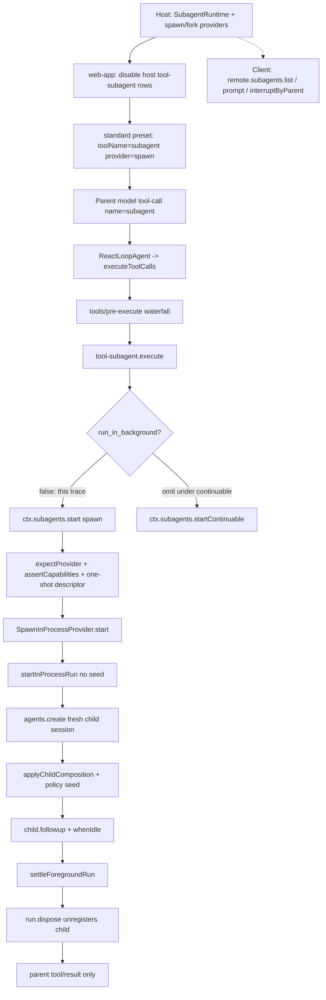

> `spine.trace-subagent` 走读 **一条闭合路径**：`dsh web` 默认 preset `standard` 下，父 Agent 的模型发出 wire 名 `subagent` 的 tool-call，并把 `run_in_background` 钉成 `false`；`ctx.subagents.start('spawn')` 经 in-process spawn provider 新建子 session，子 Agent 跑完 turn，再 `dispose` 从 `ctx.agents` 摘掉。`subagent_fork` 是另一条 schema / seed 路径，本页只点到为止。

## 能回答的问题

- 模型看见的工具名 `subagent` 是包导出还是 load-time `toolName`？谁在 host 面注册 `spawn` provider，谁在 preset 面挂工具？
- 一次前台 `subagent` 调用如何从 `executeToolCalls` 走到 `SpawnInProcessProvider.start`，再走到新的 child `Agent`？
- spawn 子 session 为什么看不到父对话？`applyChildComposition` 给了孩子哪些 preset / 工具 / 审批策略？
- 子 Agent 跑完之后谁 `dispose`、`ctx.agents` 里还在不在、父 session log 记什么？
- `backgroundMode: continuable` 的默认省略参数为什么不走 `start()`？`subagent_fork` 和 Codex / Claude 后端差在哪？

## 端到端步骤

本 trace 取 **前台等结果** 的 spawn：模型显式传 `run_in_background: false`。这条路穿过 `@deepseek-ai/dsh-subagent-spawn-in-process` 的 `start()`，并在同一次 tool body 里 `dispose` 回收。shipped `standard` / `ptc` / `cordis` 把 `subagent` 配成 `backgroundMode: continuable`，省略 `run_in_background` 会改走 `startContinuable`，不当作主路径终点。[E: packages/preset/agent-presets/presets/standard/agent.cordis.yml:192] [E: packages/preset/agent-presets/presets/ptc/agent.cordis.yml:193] [E: packages/preset/agent-presets/presets/cordis/agent.cordis.yml:180]

### 1. Host 面：进程级 registry 与 spawn backend

1. `dsh-base` 在进程组合里插入 `@deepseek-ai/dsh-subagent`，再插入 `@deepseek-ai/dsh-subagent-spawn-in-process`，`providerName: spawn`。[E: packages/bundle/base/cordis.patch.yml:334] [E: packages/bundle/base/cordis.patch.yml:337] [E: packages/bundle/base/cordis.patch.yml:340] 同一组还装 `@deepseek-ai/dsh-subagent-fork-in-process`（`providerName: fork`）。[E: packages/bundle/base/cordis.patch.yml:342] [E: packages/bundle/base/cordis.patch.yml:345] **Host 面**拥有 `ctx.subagents` 这份进程单例：provider 名全局唯一，跨会话查询（`listChildren` / `followup`）也挂在这里，不能按会话复制。

2. `apply@packages/subagent/subagent-spawn-in-process/src/index.ts` 调用 `ctx.subagents.registerProvider`。[E: packages/subagent/subagent-spawn-in-process/src/index.ts:69] `SubagentRuntime.registerProvider@packages/subagent/subagent/src/index.ts` 把实现放进 provider 表，重名抛 `DUPLICATE_PROVIDER`；注册是 Cordis `ctx.effect()`，卸载只挡住新 `start`，已返回给 holder 的 run 不撤回。[E: packages/subagent/subagent/src/index.ts:508] [E: packages/subagent/subagent/src/index.ts:513] [E: packages/subagent/subagent/src/index.ts:523]

3. `web-app` overlay **关掉** host 面上的模型可见委托工具（`tool-subagent` / `tool-subagent-fork` / control 行），registry 与 spawn/fork backend **留在 host**。[E: packages/bundle/web-app/cordis.patch.yml:398] [E: packages/bundle/web-app/cordis.patch.yml:404] 默认安装路径 `dsh web` 因此是：进程级 provider + 每会话 preset 自己选哪些 wire 名。`dsh --profile sdk|sdk-minimal|acp` 不叠这份 web overlay。

4. Web 的 preset roster 默认 id 是 `standard`。[E: packages/bundle/web-app/cordis.patch.yml:445] `standard` 在 isolate 的 `delegation` 组里再挂一份 `@deepseek-ai/dsh-tool-subagent`：`provider: spawn`、`toolName: subagent`、`backgroundMode: continuable`。[E: packages/preset/agent-presets/presets/standard/agent.cordis.yml:174] [E: packages/preset/agent-presets/presets/standard/agent.cordis.yml:189] [E: packages/preset/agent-presets/presets/standard/agent.cordis.yml:190] [E: packages/preset/agent-presets/presets/standard/agent.cordis.yml:192] 同组再挂 `toolName: subagent_fork`、`provider: fork`。[E: packages/preset/agent-presets/presets/standard/agent.cordis.yml:203]

5. **Client 面不执行这条路径。** 浏览器经 Typert Remote `remote.subagents` 观察 / 续写：Host 上 `SubagentRuntime.remoteExportList` 标 `@Remote('list')`，内部调 `listChildren`。[E: packages/subagent/subagent/src/index.ts:405] [E: packages/subagent/subagent/src/index.ts:409] 客户端 Session 层 `inject` 要求 `remote.subagents`，catalog 刷新走 `this.remote.subagents.list`。[E: packages/api/session-controller/src/client/index.ts:81] [E: packages/api/session-controller/src/client/sessions/manager.ts:368] 拉起子代理的控制流停在父 Agent 的 tool body，不经过 client 模块。

6. Headless 创建根 Agent 时 `setup` 只 `installModelSelection`，没有 `composeFrom`。[E: packages/bundle/headless/src/index.ts:182] [E: packages/bundle/headless/src/index.ts:184] `dsh --profile headless` 不叠 web overlay；host 面上的 `tool-subagent`（`provider: spawn`、`backgroundMode: continuable`）因此仍保持启用，模型从全局工具层读到它。[E: packages/bundle/base/cordis.patch.yml:359] [E: packages/bundle/base/cordis.patch.yml:360] [I]

### 2. Preset 面：wire 名 `subagent` 进模型工具表

7. `apply@packages/subagent/tool-subagent/src/index.ts` 的模型可见名是 Config `toolName`，schema 默认 `'subagent'`；每个实例必须不同名。[E: packages/subagent/tool-subagent/src/index.ts:107] [E: packages/subagent/tool-subagent/src/index.ts:317] 符号 `subagent` 不是 TS 导出，是 load-time wire 名。注册调用 `runtimeCtx.tools.register(defineTool({ name: toolName, ... }))`。[E: packages/subagent/tool-subagent/src/index.ts:373] [E: packages/subagent/tool-subagent/src/index.ts:374]

8. 工具注册跟着 **named provider 的生命周期**：`subagent/provider-added` 且 `provider.name === config.provider` 时才 `mount`；provider 卸掉就把工具摘掉。[E: packages/subagent/tool-subagent/src/index.ts:573] [E: packages/subagent/tool-subagent/src/index.ts:574] [E: packages/subagent/tool-subagent/src/index.ts:576] 文案由 `providerWording(provider.inheritsParentContext)` 决定：spawn 的 `inheritsParentContext` 是 `false`，description 写明孩子 `does not see this conversation`。[E: packages/subagent/subagent-spawn-in-process/src/index.ts:50] [E: packages/subagent/tool-subagent/src/index.ts:362] [E: packages/subagent/tool-subagent/src/index.ts:270]

9. `isConcurrencySafe: () => true`：孩子不改父 session；父侧唯一写入是可选的 jobs 插入。[E: packages/subagent/tool-subagent/src/index.ts:464]

### 3. 父 turn：模型 tool-call → 工具管线 → execute

10. 父 Agent 默认驱动 `ReactLoopAgent` 在一步里收集 `tool-call` block，交给 `executeToolCalls@packages/core/agent-loop/src/tool-calls.ts`。[E: packages/core/agent-loop/src/agent.ts:430] [E: packages/core/agent-loop/src/agent.ts:432] `executeToolCalls` 把 initiating `Agent` 放进每个 `ToolExecutionInput.agent`。[E: packages/core/agent-loop/src/tool-calls.ts:68] [E: packages/core/agent-loop/src/tool-calls.ts:78]

11. 调度器 `prepare` 先跑 `tools/pre-execute` waterfall，默认 `allow`。[E: packages/core/agent-loop/src/tool-calls.ts:170] [E: packages/core/tools/src/index.ts:1466] [E: packages/core/tools/src/index.ts:1468] `dispatch` 最终 `tool.execute(exec.arguments, exec)`。[E: packages/core/tools/src/index.ts:1540] 审批 / sandbox / timeout 挂在这条父工具管线上（`spine.tool-call-anatomy`）。子 Agent 自己的工具调用会再进同一套 registry；委托时 `approvalPolicy` 已被钉成 `'never'`。

12. `tool-subagent` 的 `execute` 没有 `exec.agent` 就拒绝。[E: packages/subagent/tool-subagent/src/index.ts:466] [E: packages/subagent/tool-subagent/src/index.ts:469] 请求体是模型的 `description` + `prompt` 文本块，加上 Config 里的 `agentOptions` / `persona` / `toolFilter` / `maxDepth`（数值默认 `3`，`'provider-managed'` 则不传 cap）。[E: packages/subagent/tool-subagent/src/index.ts:129] [E: packages/subagent/tool-subagent/src/index.ts:508] [E: packages/subagent/tool-subagent/src/index.ts:516]

13. `resolveDelegationRun@packages/subagent/tool-subagent/src/index.ts`：`run_in_background` 缺省值等于 `continuable` 标志。[E: packages/subagent/tool-subagent/src/index.ts:303] `standard` 的 `backgroundMode: continuable` 因此让省略参数变成后台。本 trace 的模型参数是 `run_in_background: false`，落入前台分支：`ctx.subagents.start(config.provider, { ...request, signal })`，再 `settleForegroundRun`。[E: packages/subagent/tool-subagent/src/index.ts:557] [E: packages/subagent/tool-subagent/src/index.ts:561]

### 4. Registry：capability 校验后交给 spawn

14. `SubagentRuntime.start@packages/subagent/subagent/src/index.ts`：`expectProvider(name)` 查表，没有就 `NO_PROVIDER`。[E: packages/subagent/subagent/src/index.ts:554] [E: packages/subagent/subagent/src/index.ts:588] [E: packages/subagent/subagent/src/index.ts:591] 然后按请求字段检查 `outputSchema` / `depthLimit` / `toolFilter` / `persona`；provider 缺能力就 `UNSUPPORTED_CAPABILITY`，不静默忽略。[E: packages/subagent/subagent/src/index.ts:555] [E: packages/subagent/subagent/src/index.ts:632]

15. 服务再 `assertSubagentMaxDepth`，并 `snapshotSubagentDescriptor({ mode: 'one-shot', provider: name, label })`，把 descriptor 塞进 `ResolvedSubagentStartRequest`。[E: packages/subagent/subagent/src/index.ts:556] [E: packages/subagent/subagent/src/index.ts:558] [E: packages/subagent/subagent/src/descriptor.ts:280] `await provider.start(resolved)` 的返回值交给 `observeRun`：先挂 `result` 的 `subagent/end`，再同步 `subagent/start`。[E: packages/subagent/subagent/src/index.ts:564] [E: packages/subagent/subagent/src/lifecycle.ts:147] [E: packages/subagent/subagent/src/lifecycle.ts:160]

16. `SpawnInProcessProvider.start` 不读父 log，直接 `startInProcessRun(request, {})`。[E: packages/subagent/subagent-spawn-in-process/src/index.ts:58] 空 options 表示 **无 seed**。对比：`ForkInProcessProvider.start` 先 `completedTurnPrefix`（切到父 log 最后一个 `turn/end`，不含当前未闭合 tool-call turn），有事件才把 `seed` 传给同一个 driver。[E: packages/subagent/subagent-fork-in-process/src/index.ts:50] [E: packages/subagent/subagent-fork-in-process/src/index.ts:76] [E: packages/subagent/subagent-fork-in-process/src/index.ts:80]

### 5. In-process driver：新 session、组合、跑完

17. `startInProcessRun@packages/subagent/subagent-in-process-driver/src/index.ts` 先 `resolveChildDepth(parent, request.maxDepth)`：`delegationDepthOf(parent) + 1`，超过 cap 抛 `SubagentDepthError`。[E: packages/subagent/subagent-in-process-driver/src/index.ts:110] [E: packages/subagent/subagent/src/child-agent.ts:50] [E: packages/subagent/subagent/src/child-agent.ts:54] `delegationDepthOf` 取 header `delegationDepth` 与 runtime `subagentDepth` 的较大值，resume 后的父不能装成 depth 0。[E: packages/subagent/subagent/src/depth.ts:35] 再 `SessionId(randomUUID())` 作为 child id。[E: packages/subagent/subagent-in-process-driver/src/index.ts:112] 第一个 await 之前同步 `captureDelegatedPolicyOverrides(parent)`。[E: packages/subagent/subagent-in-process-driver/src/index.ts:118]

18. `captureDelegatedPolicyOverrides`：只抄父 session **显式** sandbox override；只要组合了 `approval`，孩子的 `approvalPolicy` 一律钉成 `'never'`，与父自己的 ask/never 无关。[E: packages/subagent/subagent/src/child-agent.ts:244] [E: packages/subagent/subagent/src/child-agent.ts:245]

19. `parent.ctx.agents.create` 发布孩子。`AgentRegistry.create` 转到已注册 factory（默认 `AgentLoop.createAgent`）。[E: packages/subagent/subagent-in-process-driver/src/index.ts:133] [E: packages/core/agent/src/index.ts:397] [E: packages/core/agent-loop/src/index.ts:669] `meta` 来自 `childSessionMeta`：继承 cwd、把 `composedPreset(parent.ctx)` 写入 `agentPreset`、`parentSession`、`origin: 'subagent'`、`delegationDepth`。[E: packages/subagent/subagent/src/child-agent.ts:145] [E: packages/subagent/subagent/src/child-agent.ts:148] [E: packages/subagent/subagent/src/child-agent.ts:151] spawn 无 seed，`activationBoundary` 为 0。[E: packages/subagent/subagent-in-process-driver/src/index.ts:114]

20. 创建窗口 `setup`：`appendDelegatedPolicyOverrides` 往孩子 log 写 `source: 'delegation'` 的 `sandbox/mode` / `approval/policy`；`applyChildComposition` 先 `agentPresets.composeFrom(childCtx, parent.ctx)` 加入父的常驻 preset，再注册 `subagent:delegation` 上下文句，可选 shadow `deployment:persona`，可选 `tools.restrict`。[E: packages/subagent/subagent-in-process-driver/src/index.ts:122] [E: packages/subagent/subagent-in-process-driver/src/index.ts:123] [E: packages/subagent/subagent/src/child-agent.ts:204] [E: packages/subagent/subagent/src/child-agent.ts:206] [E: packages/subagent/subagent/src/child-agent.ts:217] `composeFrom` 是 bind 不是 `mount()`；父没加入任何 preset 时返回 `undefined`，孩子在「全部模型可见行都在 agent 平面」的部署里会看到空工具表。[E: packages/preset/agent-presets/src/index.ts:455] [E: packages/preset/agent-presets/src/index.ts:461] Web + `standard` 下父已 mount，孩子加入同一 standing 组，因此看见同一套 preset 工具（再叠加自己的 restrict）。

21. `drivePublishedRun` 在 `request.signal` 上听 abort（转 `child.cancel({ kind: 'parent' })`），然后 `child.followup(createUserMessage({ content: prompt, source: { kind: 'user' } }))`，`await child.whenIdle()`。[E: packages/subagent/subagent-in-process-driver/src/index.ts:167] [E: packages/subagent/subagent-in-process-driver/src/index.ts:178] `ReactLoopAgent.followup` 是 `send(..., 'next-turn', true)`。[E: packages/core/agent-loop/src/agent.ts:132] 孩子用自己的 session log 做 `deriveMessages()`：spawn 无 seed，测试断言孩子 `session.header.id` 不是父 id，且 `parentSession` 指向父。[E: packages/subagent/subagent-spawn-in-process/tests/subagent-spawn-in-process.spec.ts:104] [E: packages/subagent/subagent-spawn-in-process/tests/subagent-spawn-in-process.spec.ts:105]

22. 子 Agent 的 loop 与父相同：0..n step，自己的 tool-call 再进 `executeToolCalls`。descriptor 在孩子第一次 `agent/pre-step` 且 `decision.kind === 'enter'` 时 `session.append('subagent/descriptor', ...)`，无 `surfaceOp`，不进模型历史。[E: packages/subagent/subagent-in-process-driver/src/index.ts:86]

23. `whenIdle` 之后 `readResult` 从 `events.slice(boundary)` 取 `finalAssistantOutput`（最后一条非空 `assistant/message`，否则累积 text-delta），并把 turn-end 映射到 `completed` / `aborted` / `error` / `max-tokens` / `refusal`。[E: packages/subagent/subagent-in-process-driver/src/index.ts:215] [E: packages/subagent/subagent-in-process-driver/src/index.ts:222] 非 `completed` 在工具层变成 throw，`withDiagnosticAndPartialText` 仍带上部分输出。[E: packages/subagent/tool-subagent/src/index.ts:210] [E: packages/subagent/tool-subagent/src/index.ts:214]

### 6. 回收：dispose 摘掉 live Agent，父只拿到结果

24. `settleForegroundRun`：`Promise.allSettled` 等 `run.result`，再 `run.dispose()`；两边都失败合成 `AggregateError`。[E: packages/subagent/tool-subagent/src/index.ts:208] [E: packages/subagent/tool-subagent/src/index.ts:225] `dispose` 调 `handle.dispose()` 并再等 `result`。[E: packages/subagent/subagent-in-process-driver/src/index.ts:199] 测试：`dispose` 之后 `ctx.agents.get(run.id)` 为 `undefined`。[E: packages/subagent/subagent-spawn-in-process/tests/subagent-spawn-in-process.spec.ts:133]

25. 成功时工具 structured value 是 `{ kind: 'foreground', runId, output }`，`render` 把 output 的 text block 拼给父模型。[E: packages/subagent/tool-subagent/src/index.ts:217] [E: packages/subagent/tool-subagent/src/index.ts:453] 父 session 只追加这次 `tool/call` + `tool/result`；孩子中间 step 留在 **孩子自己的** append-only log。with-key e2e 按父 log 里 `type === 'tool/call' && data.name === 'subagent'` 计数。[E: packages/subagent/subagent-spawn-in-process/tests/spawn-in-process.e2e.ts:42]

### 7. 本 trace 不走、但必须分清的分叉

26. **Continuable 默认（shipped `subagent`）**：`run_in_background` 省略且 `backgroundMode: continuable` 时，`startContinuable` 在 inbox 接受初始 prompt 后立即返回 `{ childId, messageId }`，工具输出 `kind: 'continuable'`。[E: packages/subagent/tool-subagent/src/index.ts:524] [E: packages/subagent/tool-subagent/src/index.ts:530] [E: packages/subagent/subagent/src/continuation.ts:410] Spawn 对这条路只贡献 `prepareContinuable(): Promise.resolve({})`（无 seed）；孩子的 `agents.create` / 投递 / 驻留 / 结算通知由 continuation manager 拥有，**不是** `SpawnInProcessProvider.start`。[E: packages/subagent/subagent-spawn-in-process/src/index.ts:64] [E: packages/subagent/subagent/src/types.ts:345]

27. **One-shot 后台**：`backgroundMode: one-shot` 且 `run_in_background: true` 才走 `jobs.start`，内部仍调 `ctx.subagents.start`，`done` 走 `settleStart`。[E: packages/subagent/tool-subagent/src/index.ts:538] [E: packages/subagent/tool-subagent/src/index.ts:544] [E: packages/subagent/tool-subagent/src/index.ts:549] Continuable 后台 **不** 建 Job。

28. **`subagent_fork`**：同一 `dsh-tool-subagent` 包的第二个实例，wire 名 `subagent_fork`，provider `fork`，`inheritsParentContext === true`。Host base 把它配成 `backgroundMode: one-shot`；`standard` / `ptc` / `cordis` remount 成 `continuable`。[E: packages/bundle/base/cordis.patch.yml:372] [E: packages/bundle/base/cordis.patch.yml:373] [E: packages/preset/agent-presets/presets/standard/agent.cordis.yml:203] [E: packages/preset/agent-presets/presets/ptc/agent.cordis.yml:204] [E: packages/preset/agent-presets/presets/cordis/agent.cordis.yml:190] 控制流在 `completedTurnPrefix` 处分叉，本 trace 不进入。

29. **Codex / Claude**：包在仓库里（`dsh-subagent-codex` / `dsh-subagent-claude-code`），provider 名 `codex` / `claude-code`，Codex 的 `capabilities` 是 `NO_START_CAPABILITIES`（进程外，不能替父执行 depth/persona/toolFilter/outputSchema）。[E: packages/subagent/subagent-codex/src/index.ts:64] [E: packages/subagent/subagent-codex/src/index.ts:65] `dsh-base` **不** 插入这两个 backend。`standard` 只留 `disabled: true` 的工具行，复制 preset 再去掉 `disabled` 才会让模型看见 `subagent_codex` / `subagent_claude_code`。[E: packages/preset/agent-presets/presets/standard/agent.cordis.yml:211] [E: packages/preset/agent-presets/presets/standard/agent.cordis.yml:214]

## 关键决策点

- **Wire 名是 load-time `toolName`，不是包名。** 同一 `@deepseek-ai/dsh-tool-subagent` 可挂成 `subagent` / `subagent_fork` / `subagent_codex`。查「模型能不能调 subagent」要看当前会话的 preset 行，不要只看 `packages/subagent/tool-subagent` 是否存在。

- **Host vs preset vs client。** Provider 注册表、spawn/fork backend、`tool-subagent-report` 的 continuable setup 是 **host / 进程单例**。模型可见的 `subagent*` 工具在 `dsh web` 上是 **preset 面**（host 行被 web-app `disabled`）。**Client** 只消费 `subagents.list` / `prompt` / `interruptByParent` Remote，不参与 `start()`。

- **`start()` 与 `startContinuable()` 不是同一条 backend 路径。** 前台 / one-shot Job 走 `SubagentProvider.start` → `startInProcessRun` → 返回 `SubagentRun` 并必须 `dispose`。Continuable 走 `prepareContinuable`（spawn 贡献空 spec）+ manager 自己的 `agents.create`；fulfillment 只表示 inbox 接受了 prompt。

- **Spawn 子代零父上下文；Fork 吃已完成 turn 前缀。** `inheritsParentContext` 只描述对话 seed，不描述工具、sandbox、权限继承。两边都 `composeFrom` 父 preset，都钉 `approvalPolicy: 'never'`。

- **回收边界是 live `AgentHandle`，不是 durable session 文件。** 前台 `dispose` 从 `ctx.agents` 注销孩子。Continuable 结算后同样释放 Activation handle，但 session 可冷启动；本 trace 的 one-shot descriptor `mode: 'one-shot'` 不走那条 resume。

- **深度预算默认 3，由 in-process `depthLimit` 执行。** 工具 Config `maxDepth` 默认 `3`；`0` 禁止任何委托。运行时 floor 是父 session header 的 `delegationDepth`，resume 后的父不能装成 top-level 再无限委派。

- **Codex / Claude 是可选产品 backend，不是默认组合。** 包存在 ≠ 装进 `dsh-base`。preset 里对应工具行默认 `disabled: true`。

## 指向后续 T1/T2

- `surface.tools.subagent`：`subagent` 的 schema 字段、`backgroundMode` 文案、foreground / continuable / job 三种 output `kind`、`render` 规则。
- `subsys.orchestration.subagent`：`SubagentRuntime` 全 API（`startContinuable` / `followup` / `reportFrom` / `interrupt` / `listChildren`）、descriptor 版本、continuation Activation 状态机。
- `spine.tool-call-anatomy`：父（以及孩子自己的）`tools/pre-execute → execute → post-execute`、approval / sandbox 挂点。
- `surface.presets.standard`：`delegation` isolate 组如何同时挂 spawn + fork 工具；`minimal` 为什么没有这两行。
- `subsys.core.agent-loop`：孩子 `agents.create` / `followup` / `whenIdle` 用的同一套 factory。
- `surface.web.workbench`：client 如何用 `subagentsByParent` 画正在跑的子代理（观察面，不是本 trace 的执行面）。

## Sources

- packages/subagent/tool-subagent/src/index.ts
- packages/subagent/subagent/src/index.ts
- packages/subagent/subagent-spawn-in-process/src/index.ts
- packages/subagent/subagent-in-process-driver/src/index.ts
- packages/subagent/subagent-fork-in-process/src/index.ts
- packages/subagent/subagent-codex/src/index.ts
- packages/subagent/subagent/src/types.ts
- packages/subagent/subagent/src/child-agent.ts
- packages/subagent/subagent/src/lifecycle.ts
- packages/subagent/subagent/src/descriptor.ts
- packages/subagent/subagent/src/continuation.ts
- packages/subagent/subagent/src/depth.ts
- packages/core/agent-loop/src/agent.ts
- packages/core/agent-loop/src/tool-calls.ts
- packages/core/agent-loop/src/index.ts
- packages/core/tools/src/index.ts
- packages/core/agent/src/index.ts
- packages/preset/agent-presets/src/index.ts
- packages/bundle/base/cordis.patch.yml
- packages/bundle/web-app/cordis.patch.yml
- packages/bundle/headless/src/index.ts
- packages/preset/agent-presets/presets/standard/agent.cordis.yml
- packages/preset/agent-presets/presets/ptc/agent.cordis.yml
- packages/preset/agent-presets/presets/cordis/agent.cordis.yml
- packages/api/session-controller/src/client/sessions/manager.ts
- packages/api/session-controller/src/client/index.ts
- packages/subagent/subagent-spawn-in-process/tests/subagent-spawn-in-process.spec.ts
- packages/subagent/subagent-spawn-in-process/tests/spawn-in-process.e2e.ts

## 相关

- [`spine.tool-call-anatomy`](tool-call-anatomy.md) — 父 / 子工具调用共用的 `executeToolCalls` 与 tools waterfall。
- [`surface.tools.subagent`](../surface/tools/subagent.md) — 模型可见 `subagent` 实例：schema、Config、三种返回 `kind`。
- [`subsys.orchestration.subagent`](../subsystems/orchestration/subagent.md) — `ctx.subagents` 缝、provider 注册表、continuable manager。
