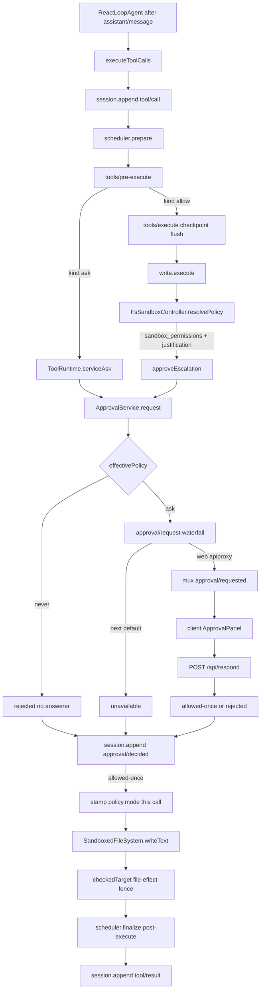

> DSH 是 Cordis 组合运行时。本 trace 走一条 **已带 `sandbox_permissions` 的 `write`**：`tool/call` 进 log → `ApprovalService.request`（会话政策 `ask|never`，无答者 fail-closed，唯一 grant 是 `allowed-once`）→ 把加宽后的 `SandboxExecutionPolicy` 盖到这一次文件副作用 → `tool/result` 回 log。默认安装面是本地 Web GUI（`dsh web`），没有 shipped TUI。

## 能回答的问题

- 默认 `dsh web` + `standard` preset 下，哪一次 `write` 才会弹出审批，而不是直接写盘？
- `ask` 与 `never` 分别在 `ApprovalService.request` 的哪一步分叉？没有 `approval/request` 答者时结果是什么？
- grant 为什么叫 `allowed-once`？它改不改下一轮的 standing sandbox mode？
- host 面（`apiproxy` / `ctx.sandboxPolicy` / `ctx.fs`）和 agent-preset 面（`write` 工具）以及 client 面（`ApprovalPanel`）各管哪一段？
- sandbox 罩哪些副作用？runner 不可用时会不会裸跑？
- `approval/asked` 会不会进 `deriveMessages()` 给模型看？

## 端到端步骤

本路径的进程是 **host 面** `dsh web`：`dsh-base` 已经装上 `sandbox-policy`、`user-approval`、`permission-presets`、`sandbox-local`、`fs-sandbox`。**agent-preset 面**（这里取 shipped `standard`）再把 `@deepseek-ai/dsh-tool-fs` 登记为模型可见的 `write`。[E: packages/bundle/base/cordis.patch.yml:172] [E: packages/bundle/base/cordis.patch.yml:188] [E: apps/cli/config/agent-presets/standard/agent.cordis.yml:56] **client 面**是浏览器：不跑工具、不改 sandbox，只回答 mux 上的 `approval/requested`。

1. `PermissionPresetService` 在 `session/created` 上调用 `pinInitialPermission`。未设 `DSH_PERMISSION_MODE` 时，base bundle 把 `ctx.sandboxPolicy` 配成 `workspace-write`、把 `ctx.approval` 配成 `ask`。[E: packages/interaction/permission-presets/src/index.ts:220] [E: packages/bundle/base/cordis.patch.yml:175] [E: packages/bundle/base/cordis.patch.yml:191] `bash-sandbox` 把这个 defaultMode 暴露为 `ctx.shell.sandboxMode`，`pinInitialPermission` 于是给新鲜会话写上 `permission/preset`、`sandbox/mode` 与 `approval/policy`（推断结果是 `workspace-write` + `ask`）。[E: packages/shell/bash-sandbox/src/index.ts:71] [E: packages/interaction/permission-presets/src/index.ts:410] [E: packages/interaction/permission-presets/src/index.ts:411] 插件自己的 `SandboxPolicyService.Config` 失败安全默认仍是 `read-only`；那是未叠 bundle 时的值，不是 `dsh web` 的真树。[E: packages/sandbox/sandbox-policy/src/index.ts:94]

2. 站桩政策 `workspace-write` 下，工作区内 `write` **不**走审批。模型要改工作区外路径（或用户已把会话切到 `read-only`）时，第一次 `write` 没有 `sandbox_permissions`：`FsSandboxController.resolvePolicy` 直接返回 standing policy，`SandboxedFileSystem.checkedTarget` 抛 `FS_SANDBOX_DENIED`，工具把文本收成 `[sandbox: file access denied under …]` 加上「用 `sandbox_permissions` + `justification` 重试」的 hint，作为 `isError` 的 `tool/result` 回模型。[E: packages/fs/tool-fs/src/sandbox.ts:90] [E: packages/fs/fs-sandbox/src/index.ts:144] [E: packages/sandbox/sandbox/src/escalation.ts:72] [E: packages/sandbox/sandbox/src/escalation.ts:85]

3. 下一 step，模型发出带 `sandbox_permissions: 'danger-full-access'` 与非空 `justification` 的 `write`。`ReactLoopAgent` 把 `assistant/message` 以 `surfaceOp: 'append'` 写入 log，滤出 `type: 'tool-call'` 块，交给 `executeToolCalls`。[E: packages/core/agent-loop/src/agent.ts:381] [E: packages/core/agent-loop/src/agent.ts:389] [E: packages/core/agent-loop/src/agent.ts:393] [E: packages/core/agent-loop/src/agent.ts:395]

4. `executeToolCalls@packages/core/agent-loop/src/tool-calls.ts` 为每个 block 构造 `ToolExecutionInput`（含 initiating `agent` 与 step 共享 `signal`），在 `prepare` 之前先 `appendToolCall`：`session.append('tool/call', { turn, step, callId, name, arguments })`。审批问的是这条已经落地的 call，不复制 arguments。[E: packages/core/agent-loop/src/tool-calls.ts:59] [E: packages/core/agent-loop/src/tool-calls.ts:167] [E: packages/core/agent-loop/src/tool-calls.ts:263]

5. `ToolRuntime.prepareExecution` 跑 `tools/pre-execute` waterfall；末端默认 `{ kind: 'allow' }`。`kind === 'ask'` 才进私有 `serviceAsk`（shipped `dsh-base` 没有把 hook 答成 `ask` 的插件；那是 composition 另装 `hooks-claude-code` 或测试门时的叉路）。本 trace 的 `write` 走 `allow`，进入 `dispatch`。[E: packages/core/tools/src/index.ts:1475] [E: packages/core/tools/src/index.ts:1479]

6. `tools/execute` 上的 `session-checkpoint-policy` 对 **top-level**（`exec.parent === undefined`）先 `sessions.flush`，再把控制权交给 tool body。副作用之前，`tool/call` 已经 durable。[E: packages/session/session-checkpoint-policy/src/index.ts:70] [E: packages/session/session-checkpoint-policy/src/index.ts:72]

7. `write.execute@packages/fs/tool-fs/src/write.ts` 在任何 `writeText` 之前调用 `sandbox.resolvePolicy('write', args, exec)`。[E: packages/fs/tool-fs/src/write.ts:107] `FsSandboxController` 先 `validateEscalationArgs`（两字段必须成对且 justification 非空），再把 `{ requestedMode, justification, effectiveMode, subject: 'operation' }` 交给共享的 `approveEscalation`；`approver` 是 `ctx.get('approval')`。[E: packages/fs/tool-fs/src/sandbox.ts:88] [E: packages/fs/tool-fs/src/sandbox.ts:97] `bash` 用同一套函数，只是 `subject: 'command'`、`toolName: 'bash'`。[E: packages/shell/tool-bash/src/index.ts:223]

8. `approveEscalation@packages/sandbox/sandbox/src/escalation.ts` 先做 **严格加宽**（`read-only` 可升到 `workspace-write` 或 `danger-full-access`；`workspace-write` 只能升到 `danger-full-access`）。非加宽请求直接 throw，**不**弹人。缺 `approval` 服务或缺 `exec.agent` 同样 throw。通过后才 `approver.request({ toolName, callId, reason: 'escalate sandbox to ${mode}: ${justification}' })`。[E: packages/sandbox/sandbox/src/escalation.ts:162] [E: packages/sandbox/sandbox/src/escalation.ts:173] [E: packages/sandbox/sandbox/src/escalation.ts:177]

9. `ApprovalService.request` 要求当前 log 有未闭合的 `turn/start`（否则 throw，避免 turn 间隙的 audit 在 reload 时被当成 crash tail 丢掉）。然后发一对 log-only 事件：先 `approval/asked`（`id` / `toolName` / 可选 `callId` / `reason`），`decide` 结束后再 `approval/decided`。[E: packages/interaction/user-approval/src/index.ts:259] [E: packages/interaction/user-approval/src/index.ts:267] [E: packages/interaction/user-approval/src/index.ts:274] 这两类事件 **没有** `surfaceOp`，不在 `deriveMessages()` 的三类 surface（`user/message` / `assistant/message` / `tool/result`）里。[E: packages/core/session/src/surface.ts:16]

10. `decide` 里政策在答者之前落地：`effectivePolicy === 'never'` 直接 `'rejected'`，连 `prepend: true` 的答者都看不到请求（测试钉死 `consulted` 为零）。`ask` 才 `ctx.waterfall('approval/request', …, () => 'unavailable')`：没有人 claim 就 fail-closed 为 `'unavailable'`；抛错或非词表返回也被收成 `'unavailable'`。[E: packages/interaction/user-approval/src/index.ts:312] [E: packages/interaction/user-approval/src/index.ts:318] [E: packages/interaction/user-approval/tests/approval.spec.ts:410] 政策类型只有 `'ask' | 'never'`。[E: packages/interaction/user-approval/src/index.ts:94]

11. **host 面答者**（本路径）：`apiproxy` 在 `ctx.get('approval')` 存在时监听 `approval/request`，从 session log 里配对尚未 decided 的 `approval/asked`，推 mux 帧 `approval/requested`（稳定 `rpcId`，断线重连会重放仍 pending 的同一帧）。[E: packages/host/apiproxy/src/api-proxy.ts:1414] [E: packages/host/apiproxy/src/api-proxy.ts:1422] [E: packages/host/apiproxy/src/api-proxy.ts:694]

12. **client 面**：`Session.handleMuxEnvelope` 把该帧铸成 `PendingWait('approval', …)`；`ApprovalPanel` 占住 composer，用户点 Allow 时 `PendingApproval.answer('allowed-once')` 经 `PendingWait.respond` 发出 `client-response`。HTTP 入口是 `POST /api/respond`。[E: packages/client/runtime/src/client/sessions/session.ts:489] [E: packages/client/ui-conversation/src/client/contract/slots.ts:639] [E: packages/client/ui-conversation/src/client/skeleton/ApprovalPanel.tsx:80] [E: packages/host/apiproxy/src/fetch/handler.ts:296] client 可写的 outcome 只有 `'allowed-once' | 'rejected'`；`cancelled` / `unavailable` 是 host 侧词。[E: packages/host/apiproxy/src/api/approvals.ts:20]

13. `ApiProxy.respond` 用 echoed `rpcId` 找回 pending，校验 `approvalId` + `sessionId` 后 `approval.resolve(outcome)`。服务把同一 `id` 写进 `approval/decided`，把 `ApprovalOutcome` 交回 `approveEscalation`。[E: packages/host/apiproxy/src/api-proxy.ts:3708] [E: packages/interaction/user-approval/src/types.ts:29] 映射：`'allowed-once'` 返回目标 `SandboxMode`；`'rejected'` / `'cancelled'` / `'unavailable'` 各抛一句固定英文，registry 收成这次 `write` 的 `isError`，**此时还没有 `writeText`**。[E: packages/sandbox/sandbox/src/escalation.ts:183] [E: packages/sandbox/sandbox/src/escalation.ts:184]

14. grant 只盖 **这一次** call：`resolvePolicy` 返回 `{ ...standingPolicy, mode: approvedMode }`，standing 的 `sandbox/mode` 事件不变。[E: packages/fs/tool-fs/src/sandbox.ts:107] 随后 `ctx.fs.writeText(..., sandboxPolicy)`。`SandboxedFileSystem` 是 host 上的 `ctx.fs` provider：`danger-full-access` 原样放行；`read-only` 拒绝一切 mutation；`workspace-write` 要求目标落在 `writableRoots(policy)`。fence 只挂在 `writeText` / `editText` 上。[E: packages/fs/fs-sandbox/src/index.ts:91] [E: packages/fs/fs-sandbox/src/index.ts:129] [E: packages/fs/fs-sandbox/src/index.ts:130] [E: packages/sandbox/sandbox/src/index.ts:29]

15. `bash` 的文件副作用走另一条 seam：`bash-sandbox` 调用 `ctx.sandbox.confine(['bash', '-c', command], policy)`。`SandboxLocal.confine` 在平台没有可用 runner 时 `throw new SandboxUnavailableError`（code `SANDBOX_UNAVAILABLE`），禁止静默裸跑。`SandboxMode` 只有三档文件政策，没有 network / process 位。[E: packages/shell/bash-sandbox/src/index.ts:178] [E: packages/sandbox/sandbox-local/src/index.ts:316] [E: packages/sandbox/sandbox-local/src/index.ts:494] [E: packages/sandbox/sandbox/src/index.ts:124] [E: packages/sandbox/sandbox/src/index.ts:29]

16. body 返回后，scheduler `finalize` 跑 `tools/post-execute`，再 `appendToolResult`：`session.append('tool/result', { turn, step, message, … }, { surfaceOp: 'append', sourceEventSeqs: [callSeq] })`。下一轮 `deriveMessages()` 只看见这次 result（成功信封或 escalation 拒绝文本），看不见中间的 `approval/*`。[E: packages/core/agent-loop/src/tool-calls.ts:281] [E: packages/core/agent-loop/src/tool-calls.ts:288]

## 关键决策点

- **谁触发审批。** 默认产品路径是工具 body 里的 sandbox escalation（`write` / `edit` / `bash` 共享 `approveEscalation`），发生在 `tools/execute` 与 checkpoint **之后**、文件副作用 **之前**。另一条入口是 `tools/pre-execute` 返回 `{ kind: 'ask' }`：`ToolRuntime.serviceAsk` 同样调用 `approval.request`，`'allowed-once'` 才放行，三个非 grant 用不同 deny 文案；没装 `ctx.approval` 时退化成 deny（测试文案 `requires approval (not yet supported)`）。[E: packages/core/tools/src/index.ts:1714] [E: packages/core/tools/tests/tools.spec.ts:717]

- **`ask` vs `never`。** `never` 在 `decide` 内部短路为 `'rejected'`，审计对仍会写入。shipped `dsh-base` 的 `danger-full-access` preset 把 sandbox 写成无篱笆、approval 写成 `never`；`DSH_PERMISSION_MODE=danger-full-access` 在 bundle 层一次改两颗旋钮。[E: packages/bundle/base/cordis.patch.yml:203] [E: packages/bundle/base/cordis.patch.yml:205] live 切换走 `ApprovalService.setPolicy`（写 `approval/policy` 并 `agent.inject` 一句政策变更）。会话 override 的 fold 是 `effectiveApprovalPolicy`：从后往前找最后一条 `approval/policy`。[E: packages/interaction/user-approval/src/index.ts:112]

- **无答者 fail-closed。** waterfall 默认 thunk 是 `'unavailable'`。Web 答者挂在 `dsh-host-apiproxy`（`web-app` bundle）。[E: packages/bundle/web-app/cordis.patch.yml:100] headless bundle 的 patch 没有这一行 [I]：政策若仍是 `ask`，escalation 会以 `unavailable` 失败而不是偷偷放行。要无人值守成功，必须把政策打到 `never`（并接受相应 sandbox 档位），或另组 ACP / 自定义 `approval/request` 答者。

- **grant 只有 `allowed-once`。** 没有 always-allow / 会话级 capability grant。下一次 mutation 重新 `sandboxPolicy.resolve`（显式 mode override > 会话 `sandbox/mode` > deployment default）。[E: packages/sandbox/sandbox-policy/src/index.ts:138]

- **host / preset / client。** `ctx.approval`、`ctx.sandboxPolicy`、`ctx.fs`、`ctx.sandbox`、mux 答者是 **host / 进程** 能力。`write` / `bash` 的登记是 **agent-preset** 成员资格（`standard` 装 `dsh-tool-fs`；`minimal` 不装 [I]）。浏览器只回答问题。换 preset 不会卸掉审批服务；换 host 答者（例如 ACP `requestPermission` 的 `allow-once` / `reject-once`）才换人机通道。

## 指向后续 T1/T2

- `subsys.interaction.approval` — `ApprovalService`、`approval/request` waterfall、审计不变量、政策 fold。
- `subsys.execution.sandbox-policy` — `resolve` / `sandbox/mode` / 写入 system-prompt 的 `sandbox:policy` 段。
- `subsys.core.tools` — `PreToolDecision.ask` 与 `serviceAsk` 的完整映射。
- `surface.tools.write` / `surface.tools.bash` — 两套广告字段与 denial marker。
- `surface.profiles.headless` — 无 Web 答者时 `ask` 如何 fail-closed。
- `ref.session-events` — `approval/*` 与 `sandbox/mode` 的 log-only 形状。

## Sources

- packages/interaction/user-approval/src/index.ts
- packages/interaction/user-approval/src/types.ts
- packages/interaction/user-approval/tests/approval.spec.ts
- packages/interaction/permission-presets/src/index.ts
- packages/core/tools/src/index.ts
- packages/core/tools/tests/tools.spec.ts
- packages/core/agent-loop/src/agent.ts
- packages/core/agent-loop/src/tool-calls.ts
- packages/core/session/src/surface.ts
- packages/sandbox/sandbox-policy/src/index.ts
- packages/sandbox/sandbox-policy/src/session-mode.ts
- packages/sandbox/sandbox/src/index.ts
- packages/sandbox/sandbox/src/escalation.ts
- packages/sandbox/sandbox-local/src/index.ts
- packages/fs/fs-sandbox/src/index.ts
- packages/fs/tool-fs/src/write.ts
- packages/fs/tool-fs/src/sandbox.ts
- packages/shell/tool-bash/src/index.ts
- packages/shell/bash-sandbox/src/index.ts
- packages/session/session-checkpoint-policy/src/index.ts
- packages/host/apiproxy/src/api-proxy.ts
- packages/host/apiproxy/src/api/approvals.ts
- packages/host/apiproxy/src/fetch/handler.ts
- packages/client/runtime/src/client/sessions/session.ts
- packages/client/runtime/src/client/sessions/pending.ts
- packages/client/ui-conversation/src/client/skeleton/ApprovalPanel.tsx
- packages/client/ui-conversation/src/client/contract/slots.ts
- packages/bundle/base/cordis.patch.yml
- packages/bundle/web-app/cordis.patch.yml
- apps/cli/config/agent-presets/standard/agent.cordis.yml

## 相关

- [spine.tool-call-anatomy](tool-call-anatomy.md) — `executeToolCalls` 与 `pre-execute → execute → post-execute` 管线；本页是其中一条带审批的真实走读。
- [subsys.interaction.approval](../subsystems/interaction/approval.md) — `ApprovalService` 与 `approval/request` 答者合同。
- [subsys.execution.sandbox-policy](../subsystems/execution/sandbox-policy.md) — `ctx.sandboxPolicy.resolve` 与 `sandbox/mode` fold。
