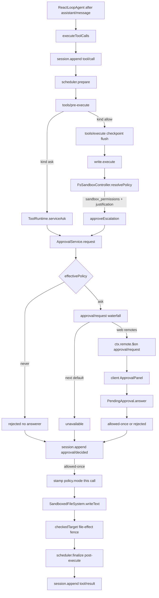

> DSH 是 Cordis 组合运行时。本 trace 走一条 **已带 `sandbox_permissions` 的 `write`**：`tool/call` 进 log → `ApprovalService.request`（会话政策 `ask|never`，无答者 fail-closed，唯一 grant 是 `allowed-once`）→ 把加宽后的 `SandboxExecutionPolicy` 盖到这一次文件副作用 → `tool/result` 回 log。默认交互面是本地 Web GUI（`dsh web` / `--profile web`）；另有 `dsh --profile sdk|sdk-minimal|acp|headless`。没有 shipped TUI。

## 能回答的问题

- 默认 `dsh web` + `standard` preset 下，哪一次 `write` 才会弹出审批，而不是直接写盘？
- `ask` 与 `never` 分别在 `ApprovalService.request` 的哪一步分叉？没有 `approval/request` 答者时结果是什么？
- grant 为什么叫 `allowed-once`？它改不改下一轮的 standing sandbox mode？
- host 面（`ctx.approval` / `dsh-api-remotes` / `ctx.sandboxPolicy` / `ctx.fs`）、agent-preset 面（`write` 工具）以及 client 面（`dsh-client-ui-approval` 的 `ApprovalPanel`）各管哪一段？
- sandbox 罩哪些副作用？runner 不可用时会不会裸跑？
- `approval/asked` 会不会进 `deriveMessages()` 给模型看？

## 端到端步骤

本路径的进程是 **host 面** `dsh web`（`--profile web`，`patchReload: live`）：`dsh-base` 已经装上 `sandbox-local`、`sandbox-policy`、`user-approval`、`permission-presets`。[E: packages/bundle/base/cordis.patch.yml:205] [E: packages/bundle/base/cordis.patch.yml:208] [E: packages/bundle/base/cordis.patch.yml:224] [E: packages/bundle/base/cordis.patch.yml:229] **agent-preset 面**取 shipped `standard`：`@deepseek-ai/dsh-tool-fs` 登记为模型可见的 `write`。[E: packages/preset/agent-presets/presets/standard/agent.cordis.yml:57] **client 面**是浏览器：`web-app` 插入 `dsh-api-remotes` 与 `dsh-client-ui-approval`，不跑工具、不改 sandbox，只回答转发过来的 `approval/request` waterfall。[E: packages/bundle/web-app/cordis.patch.yml:195] [E: packages/bundle/web-app/cordis.patch.yml:252] `dsh --profile sdk|sdk-minimal|acp|headless` 是另外的宿主入口；ACP 用 `requestPermission` 当答者，不是 Web panel。

1. `PermissionPresetService` 在 `session/created` 上调用 `pinInitialPermission`。[E: packages/interaction/permission-presets/src/index.ts:247] 未设 `DSH_PERMISSION_MODE` 时，base bundle 把 `ctx.sandboxPolicy` 配成 `workspace-write`、把 `ctx.approval` 配成 `ask`。[E: packages/bundle/base/cordis.patch.yml:211] [E: packages/bundle/base/cordis.patch.yml:227] `bash-sandbox` 把这个 defaultMode 暴露为 `ctx.shell.sandboxMode`。[E: packages/shell/bash-sandbox/src/index.ts:76] 新鲜会话（无 preset / sandbox / approval 事件）写上 `permission/preset`、`sandbox/mode` 与 `approval/policy`（推断结果是 `workspace-write` + `ask`）。[E: packages/interaction/permission-presets/src/index.ts:415] [E: packages/interaction/permission-presets/src/index.ts:416] [E: packages/interaction/permission-presets/src/index.ts:417] 插件自己的 `SandboxPolicyService.Config` 失败安全默认仍是 `read-only`；那是未叠 bundle 时的值，不是 `dsh web` 的真树。[E: packages/sandbox/sandbox-policy/src/index.ts:112] `ApprovalService.Config` 的 schema 默认是 `'ask'`。[E: packages/interaction/user-approval/src/index.ts:145]

2. 站桩政策 `workspace-write` 下，工作区内 `write` **不**走审批。模型要改工作区外路径（或用户已把会话切到 `read-only`）时，第一次 `write` 没有 `sandbox_permissions`：`FsSandboxController.resolvePolicy` 直接返回 standing policy。[E: packages/fs/tool-fs/src/sandbox.ts:91] `SandboxedFileSystem.checkedTarget` 抛 `FS_SANDBOX_DENIED`。[E: packages/fs/fs-sandbox/src/index.ts:141] 工具把文本收成 `[sandbox: file access denied under …]` 加上「用 `sandbox_permissions` + `justification` 重试」的 hint。[E: packages/sandbox/sandbox/src/escalation.ts:72] [E: packages/sandbox/sandbox/src/escalation.ts:85] `mapError` 把这两行合成带 `FS_SANDBOX_DENIED` 的 `FsError`，作为 `isError` 的 `tool/result` 回模型。[E: packages/fs/tool-fs/src/sandbox.ts:129]

3. 下一 step，模型发出带 `sandbox_permissions: 'danger-full-access'` 与非空 `justification` 的 `write`。`ReactLoopAgent` 把 `assistant/message` 以 `surfaceOp: 'append'` 写入 log，滤出 `type: 'tool-call'` 块，交给 `executeToolCalls`。[E: packages/core/agent-loop/src/agent.ts:476] [E: packages/core/agent-loop/src/agent.ts:486] [E: packages/core/agent-loop/src/agent.ts:488]

4. `executeToolCalls@packages/core/agent-loop/src/tool-calls.ts` 为每个 block 构造 `ToolExecutionInput`（含 initiating `agent` 与 step 共享 `signal`）。[E: packages/core/agent-loop/src/tool-calls.ts:60] [E: packages/core/agent-loop/src/tool-calls.ts:78] 在 `prepare` 之前先 `appendToolCall`：`session.append('tool/call', { turn, step, callId, name, arguments })`。[E: packages/core/agent-loop/src/tool-calls.ts:168] [E: packages/core/agent-loop/src/tool-calls.ts:264] 审批问的是这条已经落地的 call，不复制 arguments。

5. `ToolRuntime.prepareExecution` 跑 `tools/pre-execute` waterfall；末端默认 `{ kind: 'allow' }`。[E: packages/core/tools/src/index.ts:1467] `kind === 'ask'` 才进私有 `serviceAsk`。[E: packages/core/tools/src/index.ts:1470] shipped `dsh-base` 没有把 hook 答成 `ask` 的插件；那是 composition 另装 `hooks-claude-code` 或测试门时的叉路。本 trace 的 `write` 走 `allow`，进入 `dispatch`。

6. `tools/execute` 上的 `session-checkpoint-policy` 对 **top-level**（`exec.parent === undefined`）先 `sessions.flush`，再把控制权交给 tool body。[E: packages/session/session-checkpoint-policy/src/index.ts:71] [E: packages/session/session-checkpoint-policy/src/index.ts:72] 副作用之前，`tool/call` 已经 durable。PTC `run_code` 的嵌套子调用带 `parent` token，**不**走这条 flush。

7. `write.execute@packages/fs/tool-fs/src/write.ts` 在任何 `writeText` 之前调用 `sandbox.resolvePolicy('write', args, exec)`。[E: packages/fs/tool-fs/src/write.ts:110] `FsSandboxController` 先 `validateEscalationArgs`（两字段必须成对且 justification 非空），再把 `{ requestedMode, justification, effectiveMode, subject: 'operation' }` 交给共享的 `approveEscalation`；`approver` 是 `ctx.get('approval')`。[E: packages/fs/tool-fs/src/sandbox.ts:88] [E: packages/fs/tool-fs/src/sandbox.ts:100] `bash` 用同一套函数，只是 `subject: 'command'`、`toolName: 'bash'`。[E: packages/shell/tool-bash/src/index.ts:223] [E: packages/shell/tool-bash/src/index.ts:228]

8. `approveEscalation@packages/sandbox/sandbox/src/escalation.ts` 先做 **严格加宽**（`read-only` 可升到 `workspace-write` 或 `danger-full-access`；`workspace-write` 只能升到 `danger-full-access`）。[E: packages/sandbox/sandbox/src/escalation.ts:28] [E: packages/sandbox/sandbox/src/escalation.ts:162] 非加宽请求直接 throw，**不**弹人。缺 `approval` 服务或缺 `exec.agent` 同样 throw。[E: packages/sandbox/sandbox/src/escalation.ts:165] [E: packages/sandbox/sandbox/src/escalation.ts:168] 通过后才 `approver.request({ toolName, callId, reason: 'escalate sandbox to ${mode}: ${justification}' })`。[E: packages/sandbox/sandbox/src/escalation.ts:177]

9. `ApprovalService.request` 要求当前 log 有未闭合的 `turn/start`（否则 throw，避免 turn 间隙的 audit 在 reload 时被当成 crash tail 丢掉）。[E: packages/interaction/user-approval/src/index.ts:210] 然后发一对 log-only 事件：先 `approval/asked`（`id` / `toolName` / 可选 `callId` / `reason`），`decide` 结束后再 `approval/decided`。[E: packages/interaction/user-approval/src/index.ts:218] [E: packages/interaction/user-approval/src/index.ts:225] 这两类事件 **没有** `surfaceOp`，不在 `deriveMessages()` 的四类 surface（`system/message` / `user/message` / `assistant/message` / `tool/result`）里。[E: packages/core/session/src/surface.ts:22]

10. `decide` 里政策在答者之前落地：`effectivePolicy === 'never'` 直接 `'rejected'`，连 `prepend: true` 的答者都看不到请求（测试钉死 `consulted` 为零）。[E: packages/interaction/user-approval/src/index.ts:268] [E: packages/interaction/user-approval/tests/approval.spec.ts:409] `ask` 才 `ctx.waterfall('approval/request', …, () => 'unavailable')`：没有人 claim 就 fail-closed 为 `'unavailable'`；抛错或非词表返回也被收成 `'unavailable'`。[E: packages/interaction/user-approval/src/index.ts:276] [E: packages/interaction/user-approval/src/index.ts:281] 政策类型只有 `'ask' | 'never'`。[E: packages/interaction/user-approval/src/index.ts:60]

11. **host 面答者**（本路径）：`dsh-api-remotes` 把 `'approval/request'` 列为 `mode: 'waterfall'` 的转发事件，浏览器经 Typert Remote 接到同一条 waterfall。[E: packages/api/remotes/src/remote-events.ts:18] client 包 `dsh-client-ui-approval` 的 `apply` 对 `ctx.remote.$on('approval/request', …)` 登记答者，把请求铸成 `PendingApproval`。[E: packages/client/ui-approval/src/client/index.ts:90] [E: packages/client/ui-approval/src/client/index.ts:44]

12. **client 面**：`ApprovalPanel` 占住 `conversation.composer` slot（priority 1）。[E: packages/client/ui-approval/src/client/index.ts:80] 用户点 Allow 时 `PendingApproval.answer('allowed-once')` 把 outcome 交回 waterfall，**不是**旧的 `POST /api/respond`。[E: packages/client/ui-approval/src/client/ApprovalPanel.tsx:48] [E: packages/client/ui-approval/src/client/contract/slots.ts:122] client 可写的 outcome 只有 `'allowed-once' | 'rejected'`。[E: packages/client/ui-approval/src/client/contract/slots.ts:64] `cancelled` / `unavailable` 是 host 侧词。ACP 宿主另走 `session/requestPermission`，optionId `allow-once` / `reject-once` 映射同一对 grant/reject。[E: packages/acp/acp/src/index.ts:155] [E: packages/acp/acp/src/index.ts:171]

13. 服务把同一 `id` 写进 `approval/decided`，把 `ApprovalOutcome` 交回 `approveEscalation`。[E: packages/interaction/user-approval/src/types.ts:32] 映射：`'allowed-once'` 返回目标 `SandboxMode`；`'rejected'` / `'cancelled'` / `'unavailable'` 各抛一句固定英文，registry 收成这次 `write` 的 `isError`，**此时还没有 `writeText`**。[E: packages/sandbox/sandbox/src/escalation.ts:183] [E: packages/sandbox/sandbox/src/escalation.ts:184]

14. grant 只盖 **这一次** call：`resolvePolicy` 返回 `{ ...standingPolicy, mode: approvedMode }`，standing 的 `sandbox/mode` 事件不变。[E: packages/fs/tool-fs/src/sandbox.ts:107] 随后 `ctx.fs.writeText(..., sandboxPolicy)`。[E: packages/fs/tool-fs/src/write.ts:117] `SandboxedFileSystem` 是 host 上的 `ctx.fs` provider：`danger-full-access` 原样放行；`read-only` 拒绝一切 mutation；`workspace-write` 要求目标落在 `writableRoots(policy)`。[E: packages/fs/fs-sandbox/src/index.ts:125] [E: packages/fs/fs-sandbox/src/index.ts:126] [E: packages/fs/fs-sandbox/src/index.ts:134] fence 只挂在 `writeText` / `editText` 上。[E: packages/fs/fs-sandbox/src/index.ts:80] [E: packages/fs/fs-sandbox/src/index.ts:101]

15. `bash` 的文件副作用走另一条 seam：`bash-sandbox` 调用 `ctx.sandbox.confine(['bash', '-c', command], policy)`。[E: packages/shell/bash-sandbox/src/index.ts:180] `SandboxLocal.confine` 经 `selectRunner` 在平台没有可用 runner 时 `throw new SandboxUnavailableError`（code `SANDBOX_UNAVAILABLE`），禁止静默裸跑。[E: packages/sandbox/sandbox-local/src/index.ts:325] [E: packages/sandbox/sandbox-local/src/index.ts:494] [E: packages/sandbox/sandbox/src/index.ts:124] `SandboxMode` 只有三档文件政策，没有 network / process 位。[E: packages/sandbox/sandbox/src/index.ts:29]

16. body 返回后，scheduler `finalize` 跑 `tools/post-execute`，再 `appendToolResult`：`session.append('tool/result', { turn, step, message, … }, { surfaceOp: 'append', sourceEventSeqs: [callSeq] })`。[E: packages/core/agent-loop/src/tool-calls.ts:282] [E: packages/core/agent-loop/src/tool-calls.ts:289] 下一轮 `deriveMessages()` 只看见这次 result（成功信封或 escalation 拒绝文本），看不见中间的 `approval/*`。

## 关键决策点

- **谁触发审批。** 默认产品路径是工具 body 里的 sandbox escalation（`write` / `edit` / `bash` 共享 `approveEscalation`），发生在 `tools/execute` 与 checkpoint **之后**、文件副作用 **之前**。另一条入口是 `tools/pre-execute` 返回 `{ kind: 'ask' }`：`ToolRuntime.serviceAsk` 同样调用 `approval.request`，`'allowed-once'` 才放行，三个非 grant 用不同 deny 文案；没装 `ctx.approval` 时退化成 deny（测试文案 `requires approval (not yet supported)`）。[E: packages/core/tools/src/index.ts:1679] [E: packages/core/tools/src/index.ts:1704] [E: packages/core/tools/tests/tools.spec.ts:721]

- **`ask` vs `never`。** `never` 在 `decide` 内部短路为 `'rejected'`，审计对仍会写入。shipped `dsh-base` 的 `danger-full-access` preset 把 sandbox 写成无篱笆、approval 写成 `never`；`DSH_PERMISSION_MODE=danger-full-access` 在 bundle 层一次改两颗旋钮。[E: packages/bundle/base/cordis.patch.yml:239] [E: packages/bundle/base/cordis.patch.yml:241] live 切换走 `ApprovalService.setPolicy`（写 `approval/policy` 并 `agent.inject` 一句政策变更）。[E: packages/interaction/user-approval/src/index.ts:177] 会话 override 的 fold 是 `overrideOf`：从后往前找最后一条 `approval/policy`（现仍用 `eventAt`，源码标 deprecated）。[E: packages/interaction/user-approval/src/index.ts:245]

- **无答者 fail-closed。** waterfall 默认 thunk 是 `'unavailable'`。[E: packages/interaction/user-approval/src/index.ts:276] Web 答者挂在 `dsh-client-ui-approval`（`web-app` bundle 的 `ui-approval` 行）。[E: packages/bundle/web-app/cordis.patch.yml:252] `headless` / `sdk` / `sdk-minimal` 不装该 UI 包 [I]：政策若仍是 `ask`，escalation 会以 `unavailable` 失败而不是偷偷放行。要无人值守成功，必须把政策打到 `never`（并接受相应 sandbox 档位），或另组 ACP / 自定义 `approval/request` 答者。

- **grant 只有 `allowed-once`。** 没有 always-allow / 会话级 capability grant。下一次 mutation 重新 `sandboxPolicy.resolve`（显式 mode override > 会话 `sandbox/mode` > deployment default）。[E: packages/sandbox/sandbox-policy/src/index.ts:166]

- **host / preset / client。** `ctx.approval`、`ctx.sandboxPolicy`、`ctx.fs`、`ctx.sandbox`、Remote 转发是 **host / 进程** 能力。`write` / `bash` 的登记是 **agent-preset** 成员资格（`standard` / `ptc` / `cordis` 装 `dsh-tool-fs`；`minimal` 的 `agent.cordis.yml` 没有 `tool-fs` 行 [I]）。浏览器只回答问题。换 preset 不会卸掉审批服务；换 host 答者（Web panel vs ACP `allow-once`）才换人机通道。四个 shipped preset 目录名是 `minimal` / `standard` / `ptc` / `cordis`（旧名 `code` 即 PTC）。

## 指向后续 T1/T2

- `subsys.interaction.approval` — `ApprovalService`、`approval/request` waterfall、审计不变量、政策 fold。
- `subsys.execution.sandbox-policy` — `resolve` / `sandbox/mode` / 写入 system-prompt 的 `sandbox:policy` 段。
- `subsys.core.tools` — `PreToolDecision.ask` 与 `serviceAsk` 的完整映射。
- `surface.tools.write` / `surface.tools.bash` — 两套广告字段与 denial marker。
- `surface.profiles.headless` — 无 Web 答者时 `ask` 如何 fail-closed。
- `ref.session-events` — `approval/*` 与 `sandbox/mode` 的 log-only 形状。

## Sources

- packages/interaction/user-approval/src/index.ts
- packages/interaction/user-approval/src/types.ts
- packages/interaction/user-approval/tests/approval.spec.ts
- packages/interaction/permission-presets/src/index.ts
- packages/core/tools/src/index.ts
- packages/core/tools/tests/tools.spec.ts
- packages/core/agent-loop/src/agent.ts
- packages/core/agent-loop/src/tool-calls.ts
- packages/core/session/src/surface.ts
- packages/sandbox/sandbox-policy/src/index.ts
- packages/sandbox/sandbox-policy/src/session-mode.ts
- packages/sandbox/sandbox/src/index.ts
- packages/sandbox/sandbox/src/escalation.ts
- packages/sandbox/sandbox-local/src/index.ts
- packages/fs/fs-sandbox/src/index.ts
- packages/fs/tool-fs/src/write.ts
- packages/fs/tool-fs/src/sandbox.ts
- packages/shell/tool-bash/src/index.ts
- packages/shell/bash-sandbox/src/index.ts
- packages/session/session-checkpoint-policy/src/index.ts
- packages/api/remotes/src/remote-events.ts
- packages/client/ui-approval/src/client/index.ts
- packages/client/ui-approval/src/client/ApprovalPanel.tsx
- packages/client/ui-approval/src/client/contract/slots.ts
- packages/acp/acp/src/index.ts
- packages/bundle/base/cordis.patch.yml
- packages/bundle/web-app/cordis.patch.yml
- packages/preset/agent-presets/presets/standard/agent.cordis.yml

## 相关

- [spine.tool-call-anatomy](tool-call-anatomy.md) — `executeToolCalls` 与 `pre-execute → execute → post-execute` 管线；本页是其中一条带审批的真实走读。
- [subsys.interaction.approval](../subsystems/interaction/approval.md) — `ApprovalService` 与 `approval/request` 答者合同。
- [subsys.execution.sandbox-policy](../subsystems/execution/sandbox-policy.md) — `ctx.sandboxPolicy.resolve` 与 `sandbox/mode` fold。
