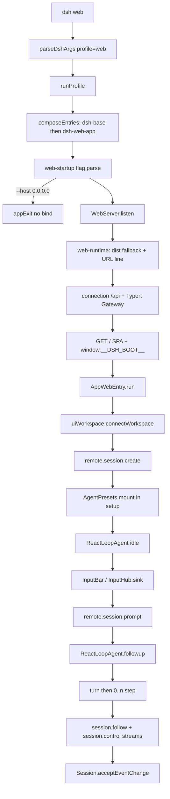

> `dsh web`（或 `dsh --profile web`）把 **host 面**（进程级 `webserver` / Typert Gateway / 三个 `packages/api/*-controller` / persistence）叠在 `dsh-base` 上；浏览器 **client 面** 经 `/api` 创建会话并提交第一句；该会话再按 **agent-preset 面** 挂上 tools / persona / isolate，由可替换的 `ReactLoopAgent` 跑完第一轮 turn。`web` 不是唯一宿主入口：`dsh --profile sdk|sdk-minimal|acp|headless` 走同一 launcher，但不走本 trace。

## 能回答的问题

- `dsh web` 与 `dsh --profile web` 如何落到同一条 profile 启动链？
- `--host 0.0.0.0` 在 CLI 上会怎样？默认 bind 是什么？`--no-open` 做什么？
- 浏览器第一次普通提问走哪条 Remote 动词？谁把文本送进 `Inbox`？
- 新会话的 agent preset 在哪一刻挂上？host 面的 `tool-*` 为何是 `disabled`？
- 第一轮 `turn/start` 何时打开、`turn/end` 何时落下？事件如何回到 GUI？
- 这条路径上 host 面、agent-preset 面、client 面各守哪一段？

## 三面边界

这条路径跨三层，不要把它读成「又一个 coding agent 的 TUI loop」。

**Host 面（进程级，一次 boot 一份）**：`webserver` 只做 listen 与路由登记；`@deepseek-ai/dsh-api-gateway` 的 `TypertGatewayService` 是 Remote HTTP/WS mux；`client-connection` 把合同绑到 `/api`；三个 controller 分别是 `ctx.sessionController`（namespace `'session'`）、`ctx.settingsController`、`ctx.workspaceController`；`frontend-static` 占 fallback 座发 dist。会话落盘、sandbox、subagent 注册表也在这一面。Web bundle 把 base 里面向模型的 `tool-*` 行标成 `disabled`，避免进程级默认装一套工具。 [E: packages/bundle/web-app/cordis.patch.yml:368] [E: packages/api/session-controller/src/index.ts:121] [E: packages/api/gateway/src/index.ts:169]

**Agent-preset 面（standing mount，按 preset id 一份，不是按会话复制一份 composition）**：`session.create` 的 `setup` 调用 `AgentPresets.mount`，把该会话的 scope 接到 preset 的 standing mount。默认 preset id 是 web bundle 写进 `agent-presets` 行的 `standard`。tools、persona、isolate 在这里出现；换 preset 换的是这一面，不是重 boot host。shipped 目录是 `minimal` / `standard` / `ptc` / `cordis`。 [E: packages/bundle/web-app/cordis.patch.yml:481] [E: packages/bundle/web-app/cordis.patch.yml:484] [E: packages/api/session-controller/src/agent.ts:387]

**Client 面（浏览器半边）**：`apps/web` 只找 `#root` 并跑 `AppWebEntry`；插件图来自 host 注入的 `window.__DSH_BOOT__`。composer 提交走 `remote.session.prompt`；会话事件从 `session.follow` 流回流。client 不执行模型 turn。旧包 `packages/client/runtime` / `packages/host/apiproxy` 已删除。 [E: apps/web/src/main.ts:6] [E: packages/client/web/src/boot.ts:54]

## 端到端步骤

1. `parseDshArgs@apps/cli/src/args.ts` 把子命令 `web` 解析成 `mode: 'profile'` 且 `profile: 'web'`，与 `dsh --profile web` 同一条启动合同；裸 `dsh`（没有 `--profile`）直接报错，没有隐含默认 profile。没有 `dsh sdk` / `dsh acp` 子命令。 [E: apps/cli/src/args.ts:175] [E: apps/cli/src/args.ts:155]

2. `bin.ts` 的 `profile` 分支动态导入并调用 `runProfile@apps/cli/src/profile-boot.ts`：先 `composeProfile` 叠 bundle / 用户 `$DSH_HOME/profiles/web/cordis.patch.yml` / home patch / `--patch`，再 `boot` 空 root，并把 argv 余下部分通过 `provideCmdline` 交给树。web 模板 `patchReload: 'live'`，boot 后会 watch 用户 patch。 [E: apps/cli/src/bin.ts:32] [E: apps/cli/src/profile-boot.ts:343] [E: packages/boot/app-boot/src/profile.ts:112]

3. `PROFILE_TEMPLATES.web@packages/boot/app-boot/src/profile.ts` 声明 web 模板是 `dsh-base` 然后 `dsh-web-app`。web-app patch 插入 `web-startup`、`webserver`（`inject: [webStartup]`）、`web-runtime`、gateway、connection、整份 `dsh.client` 浏览器 roster，以及 `agent-presets`。五个 shipped profile 还有 `headless` / `sdk` / `sdk-minimal` / `acp`。 [E: packages/boot/app-boot/src/profile.ts:110] [E: packages/bundle/web-app/cordis.patch.yml:127]

4. `apply@packages/bundle/web-app/src/startup.ts` 用 commander 解析 `--host` / `--no-open` / `--port` / `--trusted-host`。`--host 0.0.0.0` 走 `program.error(...)`，文案写明尚未支持、会把 RCE 暴露到网络，应改用 `127.0.0.1`。`parseCmdline` 把这次 `CommanderError` 交给 `appExit`，**不会** `provide('webStartup')`，依赖它的 `webserver` 行无法激活，进程不 bind。 [E: packages/bundle/web-app/src/startup.ts:74] [E: packages/boot/cmdline/src/index.ts:184]

5. 合法 invocation 才 `ctx.provide(WEB_STARTUP_SERVICE, { openBrowser, host?, port?, trustedHosts })`。`--no-open` 经 commander 变成 `openBrowser: options.open`（默认打开）。`webserver` 行用表达式读它：缺省 `host` 是 `'127.0.0.1'`，缺省 `port` 是 `3080`（`--port 0` 让 OS 选端口）。 [E: packages/bundle/web-app/src/startup.ts:80] [E: packages/bundle/web-app/cordis.patch.yml:139]

6. `WebServer[Service.init]@packages/host/webserver/src/index.ts` 立刻 `listen(config.port, config.host)`。该包不懂 harness 概念、不发文件；命名路由未命中时走唯一 fallback。`Config.host` 的 schema 仍是 `'127.0.0.1' | '0.0.0.0'`——CLI 旗标被拒，并不等于 schema 禁止 all-interfaces overlay。 [E: packages/host/webserver/src/index.ts:294] [E: packages/host/webserver/src/index.ts:61]

7. `apply@packages/bundle/web-app/src/index.ts` 在 bind 后采样 LAN trust、`provide('webRuntime')`、挂 `frontend-static`、可选注册 `app:web-surface` prompt section 与 `DSH_WEB_URL`。Loader 整树 settle 后打印 `dsh web: http://127.0.0.1:<port>`（all-interfaces 时附带一条 LAN URL），并按 `openBrowser` 打开默认浏览器。 [E: packages/bundle/web-app/src/index.ts:231] [E: packages/bundle/web-app/src/index.ts:271]

8. `apply@packages/host/frontend-static/src/index.ts` 占据 fallback：GET/HEAD 在 dist 内发文件；index 路径先 `connection.authorizeIndex` 再 `webServer.renderIndex`。非 GET/HEAD 是 405。磁盘 miss 是 404，不是把任意路径回写成 `index.html`。 [E: packages/host/frontend-static/src/index.ts:139] [E: packages/host/frontend-static/src/index.ts:100]

9. `ClientModuleRegistry@packages/client/modules/src/index.ts` 登记 `/plugins` 前缀，并在 `webserver/index-inject` 上推 `window.__DSH_BOOT__` 图与 bootstrap 脚本。没有这份图，Vite 壳不是可独立跑的应用。 [E: packages/client/modules/src/index.ts:539] [E: packages/client/modules/src/index.ts:474]

10. `apply@packages/client/connection/src/index.ts` 以 prefix `/api` 注册 HTTP 路由：先 `requestRejection`（`isTrustedApiRequest` 再 cookie/token 认证），再 `bridge` 成 WHATWG `Request`，转给 shared fetch handler。`API_PATH` 是 `'/api'`。信任篱笆是 DNS-rebinding 防御，不是用户登录。 [E: packages/client/connection/src/index.ts:127] [E: packages/client/connection/src/api-path.ts:7] [E: packages/client/connection/src/api-request-trust.ts:91]

11. 浏览器打开打印出的 URL。`main.ts` 取 `#root` 后 `new AppWebEntry(el).run()`。`AppWebEntry.run` 等待 `__DSH_BOOT_READY__`，解析 `__DSH_BOOT__`，prefetch `immediately` 行，挂 Loader，按图创建 client 插件；`mountClient` 在 renderer 上挂到 `#root`。 [E: apps/web/src/main.ts:6] [E: packages/client/web/src/boot.ts:54] [E: packages/client/web/src/boot.ts:87]

12. client `connection` 半边在无 `?fixture` 时走 `createWebConnectionRpc`（unary fetch + Gateway WebSocket）。`__DSH_TRANSPORT__` 只给 worker preview 等自带 carrier 的壳。 [E: packages/client/connection/src/client/index.ts:194]

13. 会话 client 插件 `apply` 要求 `remote.session` 等 Remote，安装 `ctx.sessions`，并启动 `createSessionControlStream`。`uiWorkspace.watchNavigation` 在 workspace/session baseline `ready` 后：已有 `current` 会话则不动；否则对 `recentWorkspace` 调 `connectWorkspace`。`connectWorkspace` 复用该 workspace 下仍 `blank` 且未归档的会话，否则 `sessions.create({ workspaceId })`。没有 Workspace 时不会凭空 `session.create`。 [E: packages/api/session-controller/src/client/index.ts:99] [E: packages/client/ui-workspace/src/client/navigation.ts:197] [E: packages/client/ui-workspace/src/client/navigation.ts:128]

14. `SessionManager.create` 发 `remote.session.create`。host `@Remote('create')` 分配 `session-<uuid>`（或采纳调用方预分配 id），解析 cwd（workspace 路径 / 显式 `cwd` / `process.cwd()`），然后 `ensureSession`。 [E: packages/api/session-controller/src/client/sessions/manager.ts:564] [E: packages/api/session-controller/src/commands.ts:91] [E: packages/api/session-controller/src/index.ts:244]

15. 首次身份走 `ctx.agents.create`：`meta.cwd` 与解析出的 `agentPreset` 写入 header；`setup` 来自 `composeAgent`。有 `ctx.agentPresets` 时 `presets.resolve` 得 id（未点名则用部署默认），`setup` 里 `presets.mount(agentCtx, resolvedId)`。`AgentPresets.mount` 要求 `agentCtx` 已有 scope key，把该 key parent 到 preset 的 standing mount——拒绝挂到无 scope 的 context，以免注册泄漏到全进程。 [E: packages/api/session-controller/src/agent.ts:478] [E: packages/api/session-controller/src/agent.ts:387] [E: packages/preset/agent-presets/src/index.ts:438]

16. `AgentLoop` 在构造时 `ctx.agents.setFactory(this)`。lifecycle 里 `new ReactLoopAgent(loopCtx, id, options, session)`，跑完 unpublished `setup` 再 publish。构造时若投影 `turnBoundary.lastTurn` 为 0，`phase` 是 `{ kind: 'idle', lastTurn: 0 }`。 [E: packages/core/agent-loop/src/index.ts:420] [E: packages/core/agent-loop/src/index.ts:624] [E: packages/core/agent-loop/src/agent.ts:109]

17. 用户在 composer 输入普通文本。主按钮经 `keyboard.submit(primarySubmitMode)`；face 的 `submit()` 固定 `submit('queue')`。`SessionInputShell.submit` 进入 adjudication；未被 `/` command claim 吃掉的草稿落到 `InputHub` 的 default sink。 [E: packages/client/ui-conversation/src/client/skeleton/InputBar.tsx:372] [E: packages/client/ui-conversation/src/client/input/facade.ts:142]

18. `InputHub.sink` 调 `ConversationController.sendSession`。`sendSession` 把草稿图与文本转成 `PromptContentPart`，调用 `session.prompt(content, mode)`。 [E: packages/client/ui-conversation/src/client/input/hub.ts:195] [E: packages/client/ui-conversation/src/client/service.ts:292]

19. `Session.prompt@packages/api/session-controller/src/client/sessions/session.ts` 在第一个 await 之前同步置 `promptAttempted`（blank → engaging 必须出现在当帧）。普通会话（无 subagent `address`）走 `remote.session.prompt({ sessionId, mode, content, clientTimeZone, requestId })`。 [E: packages/api/session-controller/src/client/sessions/session.ts:243] [E: packages/api/session-controller/src/client/sessions/session.ts:249]

20. Host `@Remote('prompt')` 调 `SessionCommandController.prompt`：先 `resolveAgent`，且当前 selection 必须有 adapter，否则 `session/model-unavailable`（不把失败拖进 pre-step）。通过后把 `rpcId` 与校验过的 IANA zone 写入 `MessageSource`，`createUserMessage`，`mode === 'steer'` 则 `agent.steer`，否则 `agent.followup`。第一次提问是 `queue` → `followup`。 [E: packages/api/session-controller/src/index.ts:346] [E: packages/api/session-controller/src/commands.ts:325] [E: packages/api/session-controller/src/commands.ts:364]

21. `ReactLoopAgent.followup` 即 `send(input, 'next-turn', true)`：插入 `Inbox` 的 next-turn，并 `wakeDriver`。idle 时预约 `phase: running`，在 `agents.withInitiator` 下 `kick()`。`kick` 循环 `turn()` 直到 inbox 空。 [E: packages/core/agent-loop/src/agent.ts:137] [E: packages/core/agent-loop/src/agent.ts:207]

22. `turn()` 先 `session.append('turn/start', { turn })`（第一轮 `turn === 1`），再 `preStep`：`inbox.claim` + `systemPrompt.assemble` + `agent/pre-step` waterfall。通过则 `step/start`；`step()` 先把 assemble 提交写成 `system/message`（v3 derived history），再把 claimed `UserMessage` 以 `surfaceOp: 'append'` 写入 `user/message`（模型可见 ⟺ 已入 log）。 [E: packages/core/agent-loop/src/agent.ts:278] [E: packages/core/agent-loop/src/agent.ts:371] [E: packages/core/agent-loop/src/agent.ts:375]

23. `step()` 用 `session.deriveMessages()` 投影历史，再 `preparedCall?.stream(request) ?? loopCtx.llm.stream(request)`；`AssistantStreamAttempt` 收束后 `assistant/message`（`surfaceOp: 'append'`）。无 `tool-call` 则本 step `completed`；有则 `executeToolCalls`，可能往 next-step 塞 continuation，同一 turn 继续 step。`nextStep` 空且本 turn 已有结束原因时 `append('turn/end')`，`kick` 若 inbox 已空则回到 idle。 [E: packages/core/agent-loop/src/agent.ts:603] [E: packages/core/agent-loop/src/agent.ts:390] [E: packages/core/agent-loop/src/agent.ts:488] [E: packages/core/agent-loop/src/agent.ts:339]

24. 浏览器打开会话后 `SessionEventStream` 订 `session.follow`；journal `append` 走 `acceptEventChange`。`session.control` 流把 queue / jobs / projection 帧交给 `SessionManager.handleControlFrame`。第一轮 turn 结束时 GUI 上的用户消息、assistant 文本（以及若有的 tool 行）都来自这条 log 投影，不是 client 本地伪造的模型历史。 [E: packages/api/session-controller/src/client/sessions/session.ts:610] [E: packages/api/session-controller/src/index.ts:401] [E: packages/api/session-controller/src/client/sessions/manager.ts:662]

**旁路（不是本 trace 的第一问）**：草稿被 `ui-input-trigger` claim 成 `/` 命令时，`ui-commands` 走 `remote.commands.execute`，不调用 `session.prompt`，因此不打开模型 turn。`session.prompt` 实现本身也不按 leading `/` 分流。 [E: packages/client/ui-commands/src/client/service.ts:380]

## 关键决策点

- **默认安装面是 Web GUI，不是 TUI。** `web` 是 launcher 写死的 profile 别名；本仓没有 shipped TUI 包。组合入口是 profile → bundle → 每会话 preset。其它宿主入口是 `dsh --profile sdk|sdk-minimal|acp|headless`。
- **`--host 0.0.0.0` 在 flag 层被拒。** 拒绝发生在 `web-startup` 提供服务之前，所以默认 composition 不会 listen all-interfaces。`WebServer.Config` 仍承认 `'0.0.0.0'`：一条替换整行 `config` 的 overlay 仍可能绑 all-interfaces；`web-runtime` 的 LAN trust 采样也仍认识该字面量。
- **`--no-open` 只关默认浏览器 handoff。** 服务器仍 listen；URL 行仍打印。
- **Web 把模型工具从 host 面撤走。** web-app patch 把 `tool-bash` / `tool-pwsh` 等模型工具行标 `disabled: true`，改由每会话 preset 挂载。`shell-env`、jobs 注册表、subagents 单例仍留 host 面。
- **preset 挂在 unpublished `setup`，失败则整次 create 回滚。** 半吊子会话不会以「host 空工具集」姿态被 publish。
- **第一次提问的 wake 目标是 `next-turn`。** `queue` → `followup`；运行中的 `steer` 才进 `next-step`。`send(..., wakeup: true)` 在 abort 后的插入会被重分类到 `next-turn`。
- **turn 边界先于模型调用。** 即使 claimed 消息在 pre-step 被抽空，已经 `append` 的 `turn/start` 仍属于这一轮，并以 `completed` 收束、不花模型调用。
- **`/api` 信任篱笆不是认证。** `trustedHosts` 防 DNS rebinding；浏览器还要过 cookie/launch-token。`session.create` / `session.prompt` 仍是能跑该进程工具面的 RPC。
- **slash 命令不经 `session.prompt`。** 人命令走 `ctx.commands` / Remote `commands.execute`；只有普通（及带图）草稿进入 inbox 与模型历史。

## 指向后续 T1/T2

- 组合叠层、`PROFILE_TEMPLATES`、`--dump-config` 真树：`spine.composition-boot`（[composition-boot.md](composition-boot.md)），细节 `subsys.composition.app-boot`（[../subsystems/composition/app-boot.md](../subsystems/composition/app-boot.md)）
- turn / step / inbox `followup|steer|inject` / 可替换 loop：`spine.turn-and-step`（[turn-and-step.md](turn-and-step.md)），驱动实现 `subsys.core.agent-loop`（[../subsystems/core/agent-loop.md](../subsystems/core/agent-loop.md)）
- `deriveMessages` 与 append-only log：`spine.session-log`（[session-log.md](session-log.md)）
- `executeToolCalls` 与 pre/post-execute：`spine.tool-call-anatomy`（[tool-call-anatomy.md](tool-call-anatomy.md)）
- Web 工作台槽位与壳：`surface.web.workbench`（[../surface/web/workbench.md](../surface/web/workbench.md)），壳与模块表 `subsys.client.web` / `subsys.client.modules`（[../subsystems/client/web.md](../subsystems/client/web.md)、[../subsystems/client/modules.md](../subsystems/client/modules.md)）
- Host HTTP API：`subsys.host.apiproxy`（[../subsystems/host/apiproxy.md](../subsystems/host/apiproxy.md)，稳定 id，正文是三个 controller），listen 面 `subsys.host.webserver`（[../subsystems/host/webserver.md](../subsystems/host/webserver.md)）
- composer / 会话对象层：`subsys.client.ui-conversation`、`subsys.client.runtime`、`subsys.client.connection`（[../subsystems/client/ui-conversation.md](../subsystems/client/ui-conversation.md)、[../subsystems/client/runtime.md](../subsystems/client/runtime.md)、[../subsystems/client/connection.md](../subsystems/client/connection.md)）
- shipped preset 成员资格：`surface.presets.overview`（[../surface/presets/overview.md](../surface/presets/overview.md)）
- launcher 旗标：`surface.cli.overview`（[../surface/cli/overview.md](../surface/cli/overview.md)）

## Sources

- apps/cli/src/args.ts
- apps/cli/src/bin.ts
- apps/cli/src/profile-boot.ts
- apps/web/src/main.ts
- packages/api/gateway/src/index.ts
- packages/api/session-controller/src/agent.ts
- packages/api/session-controller/src/client/index.ts
- packages/api/session-controller/src/client/sessions/manager.ts
- packages/api/session-controller/src/client/sessions/session.ts
- packages/api/session-controller/src/commands.ts
- packages/api/session-controller/src/index.ts
- packages/boot/app-boot/src/profile.ts
- packages/boot/cmdline/src/index.ts
- packages/bundle/web-app/cordis.patch.yml
- packages/bundle/web-app/src/index.ts
- packages/bundle/web-app/src/startup.ts
- packages/client/connection/src/api-path.ts
- packages/client/connection/src/api-request-trust.ts
- packages/client/connection/src/client/index.ts
- packages/client/connection/src/http-bridge.ts
- packages/client/connection/src/index.ts
- packages/client/modules/src/index.ts
- packages/client/ui-commands/src/client/service.ts
- packages/client/ui-conversation/src/client/input/facade.ts
- packages/client/ui-conversation/src/client/input/hub.ts
- packages/client/ui-conversation/src/client/service.ts
- packages/client/ui-conversation/src/client/skeleton/InputBar.tsx
- packages/client/ui-workspace/src/client/navigation.ts
- packages/client/web/src/boot.ts
- packages/client/web/src/index.ts
- packages/core/agent-loop/src/agent.ts
- packages/core/agent-loop/src/index.ts
- packages/host/frontend-static/src/index.ts
- packages/host/webserver/src/index.ts
- packages/preset/agent-presets/src/index.ts

## 相关

- `spine.composition-boot`：[组合启动(profile→bundle→preset)](composition-boot.md) — 空入口表如何叠 bundle / home / `--patch`，以及 preset 何时按会话挂上。
- `spine.turn-and-step`：[turn 与 step(可替换 loop)](turn-and-step.md) — turn = 0..n step，inbox `followup` / `steer` / `inject`，默认 `ReactLoopAgent` 可替换。
- `surface.web.workbench`：[Web 工作台可见面](../surface/web/workbench.md) — 浏览器壳、槽位与工作台 chrome（本页只走到第一轮 turn 结束）。
