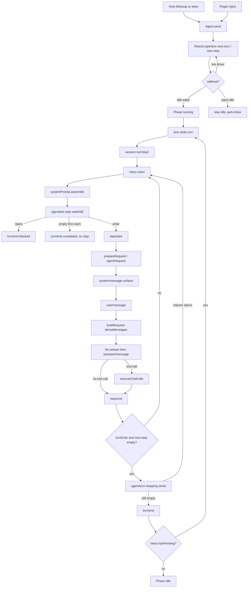

> `spine.turn-and-step` 说明 DSH 如何把一次 inbox 投递变成 **0..n 个 step 的 turn**：合同在 `dsh-agent`（`Agent` / `Inbox` / `agent/*` 事件），默认驱动是可替换的 Cordis 插件 `dsh-agent-loop`（`ReactLoopAgent` + `ReactLoopInbox`）；每一步请求的 `messages` 只从 session log 的 `deriveMessages()` 投影出来。

## 能回答的问题

- turn 和 step 各是什么，一次 `followup` 会开几个 turn、几个 step？
- `followup` / `steer` / `inject` 分别进哪条 inbox 队列，谁会 wake driver？
- loop 为什么说可替换？`Agent` 合同、`AgentFactory` 槽和默认 `ReactLoopAgent` 各在哪？
- 每一步模型请求的 `messages` 从哪来，`agent/request` 能不能改对话内容？
- 内部 `Phase`（`idle` / `maintenance` / `running`）和公开 `AgentStatus` 怎么对应？
- 什么情况下 turn 以 0 个 step 结束（`blocked` / 空 claim / abort）？

## 端到端步骤

1. `Agent` 合同在 `@deepseek-ai/dsh-agent`，不绑定某一种 loop。`AgentRegistry`（`ctx.agents`）只做活体登记、initiator 作用域和工厂委托；真正 `create` / `resume` 必须先有人调用 `setFactory`。没有工厂时 `requireFactory` 抛 `no agent factory registered (load an agent-loop plugin)`。[E: packages/core/agent/src/index.ts:206] [E: packages/core/agent/src/index.ts:375] 测试直接打这条路径。[E: packages/core/agent/tests/agent.spec.ts:277] 这是 **host 面** 的进程级缝：工厂槽全局只有一个，第二个 `setFactory` 抛 `an agent factory is already registered`。[E: packages/core/agent/src/index.ts:357]

2. 默认插件 `@deepseek-ai/dsh-agent-loop` 的 `AgentLoop` 在构造时把自己登记进该槽，并在 lifecycle effect 里 `new ReactLoopAgent(...)`。[E: packages/core/agent-loop/src/index.ts:420] [E: packages/core/agent-loop/src/index.ts:624] `ReactLoopAgent implements Agent`。[E: packages/core/agent-loop/src/agent.ts:72] `dsh-base` 用 id `agent-loop` 挂上这包，启动配置是空列表 `agents: []`。[E: packages/bundle/base/cordis.patch.yml:472] [E: packages/bundle/base/cordis.patch.yml:475] 会话由 host 在运行时创建（Web 走 `packages/api/session-controller` 的 Remote `prompt`，headless 走 `agents.create`）。换 loop = 换一个实现 `AgentFactory` 的插件占同一槽，并在 bundle / profile patch 里替换该行，而不是改 `dsh-agent` 合同。五个 shipped CLI profile 是 `web` / `headless` / `sdk` / `sdk-minimal` / `acp`；`desktop` 不是 CLI profile。

3. 每个 `ReactLoopAgent` 持有一份 `ReactLoopInbox` 和一个 agent-scoped `ctx`：`createScope(loopCtx, this)`，再 `this.ctx = this.scope.ctx`。**没有** `extend({ agent: this })`。[E: packages/core/agent-loop/src/agent.ts:73] [E: packages/core/agent-loop/src/agent.ts:104] [E: packages/core/agent-loop/src/agent.ts:105] [E: packages/core/agent-loop/src/agent.ts:106] **agent-preset 面**（tools / persona / isolate）挂在这份 `Agent.ctx` 上，随会话卸载；**host 面**（webserver / persistence / sandbox / 子代理后端、以及这份 `AgentLoop` 服务本身）是进程级、跨会话共享。`setupAndPublish` 先 `await raceAbort(setup?.(prepared.agent.ctx, prepared.agent), …)` 再 `prepared.publish(source)`：组合完成之前 agent 不会被登记成已发布 handle。[E: packages/core/agent-loop/src/index.ts:805] [E: packages/core/agent-loop/src/index.ts:826] [E: packages/core/agent-loop/src/index.ts:829]

4. 内部 `Phase` 是三态：`idle` / `maintenance` / `running`。[E: packages/core/agent-loop/src/agent.ts:42] [E: packages/core/agent-loop/src/agent.ts:44] [E: packages/core/agent-loop/src/agent.ts:49] 公开 `AgentStatus` 只有 `'idle' | 'running'`。[E: packages/core/agent/src/runtime-types.ts:109] `maintenance` 对外仍报 `idle`。[E: packages/core/agent-loop/src/agent.ts:115] `runMaintenance` 必须从真 `idle` 同步抢到相位，否则抛 `already has active work`；任务跑完若 `wakeRequested && inbox.hasPending` 才补 wake。[E: packages/core/agent-loop/src/agent.ts:158] [E: packages/core/agent-loop/src/agent.ts:173]

5. 外部投递都走 `ReactLoopAgent.send(message, target, wakeup)`，再落到 `ReactLoopInbox.splice`。[E: packages/core/agent-loop/src/agent.ts:128] [E: packages/core/agent-loop/src/agent.ts:133] 三条公开入口是固定映射：`followup` → `next-turn` + wake；`steer` → `next-step` + wake；`inject` → `next-step`、不 wake。[E: packages/core/agent-loop/src/agent.ts:137] [E: packages/core/agent-loop/src/agent.ts:141] [E: packages/core/agent-loop/src/agent.ts:145] 若当前活动已 abort 且这次是 waking 投递，`send` 会在 splice 之前把 target 改写成 `next-turn`，避免新意图并进已取消的活动。[E: packages/core/agent-loop/src/agent.ts:131] [E: packages/core/agent-loop/src/agent.ts:132]

6. `ReactLoopInbox` 维护两条有序列表 `next-turn` / `next-step`。状态来自 session projection `inbox`，构造时注册 `inboxProjectionDefinition`；不再从 `session.ownEvents()` 手搓重放（同步读 API 已弃用，禁止新增生产调用）。[E: packages/core/agent-loop/src/inbox.ts:27] [E: packages/core/agent-loop/src/inbox.ts:74] [E: packages/core/agent-loop/src/inbox.ts:80] [E: packages/core/agent/src/types.ts:30] `splice` 先 `session.append('agent/inbox/spliced', …)` 再改投影，所以 inbox 变更本身是耐久事实，但还不是模型可见历史。[E: packages/core/agent-loop/src/inbox.ts:238] `hasPending` 是任一条非空。[E: packages/core/agent-loop/src/inbox.ts:94]

7. host 把人话送进这两条队列。Web 工作台经 Session Controller：`mode === 'steer'` 调 `agent.steer`，否则 `agent.followup`。[E: packages/api/session-controller/src/commands.ts:363] [E: packages/api/session-controller/src/commands.ts:364] headless 一次性任务在 `agents.create` 之后先 `whenIdle`，再 `agent.followup(...)`，再 `whenIdle`。[E: packages/bundle/headless/src/index.ts:185] [E: packages/bundle/headless/src/index.ts:198] [E: packages/bundle/headless/src/index.ts:202] 插件侧的文件变更、指令、工具附加上下文走 `inject`：idle 时只留下 `agent/inbox/spliced`，`status` 仍是 `idle`，不开 `turn/start`。[E: packages/core/agent-loop/tests/loop.spec.ts:959] [E: packages/core/agent-loop/tests/loop.spec.ts:967]

8. `wakeup === true` 且 `phase === idle` 时，`wakeDriver` **不看** inbox 是否还剩消息：同步把相位切到 `running`（`step: 0`），再 `withInitiator(this, () => this.kick())`。[E: packages/core/agent-loop/src/agent.ts:200] [E: packages/core/agent-loop/src/agent.ts:207] 已在跑的 live driver 自己在 step/turn 边界取队列，不会再 latch；只有 `maintenance` 或 abort 后的 wake 才设 `wakeRequested`，并在收敛时要求 `inbox.hasPending` 才重放。[E: packages/core/agent-loop/src/agent.ts:188] [E: packages/core/agent-loop/src/agent.ts:193] idle 上一次 wake 即使消息随后被清掉，也仍会打开 turn 边界。

9. `kick` 是 driver 外壳：`while (await this.turn()) {}`，失败与取消都吞在这层；`finally` 若仍是 `running` 则回到 `idle`。[E: packages/core/agent-loop/src/agent.ts:227] [E: packages/core/agent-loop/src/agent.ts:232] 一次 `kick` 可以连续消耗多条 `next-turn`（多轮 turn），条件是每一轮 `turn()` 结束后 `inbox.hasPending`。[E: packages/core/agent-loop/src/agent.ts:344] [E: packages/core/agent-loop/src/agent.ts:349]

10. `ReactLoopAgent.turn` 先 `session.append('turn/start', { turn })`，再把 `phase.turn` 写成新编号。turn 号来自 `phase.turn + 1`；构造时 `lastTurn` 取 `sessionProjections.stateOf(session, 'turnBoundary')?.lastTurn ?? 0`，resume 接着编号。[E: packages/core/agent-loop/src/agent.ts:276] [E: packages/core/agent-loop/src/agent.ts:278] [E: packages/core/agent-loop/src/agent.ts:108] 简单一路的耐久边界顺序是 `turn/start → step/start → step/end → turn/end`。[E: packages/core/agent-loop/tests/loop.spec.ts:457] `turn/*` / `step/*` 只活在 `session/event`，没有 `agent/*` 镜像。

11. 每个拟议 step 先 `preStep`。`Inbox.claim(target, turn)` 同步抽走 **全部** `next-step`，若 `target === 'next-turn'` 再额外抽 **一条** `next-turn`；durable splice 是纯删除，并按条发 `agent/inbox/claimed`。[E: packages/core/agent-loop/src/inbox.ts:111] [E: packages/core/agent-loop/src/inbox.ts:112] [E: packages/core/agent-loop/src/inbox.ts:113] [E: packages/core/agent-loop/src/inbox.ts:114] 一轮 turn 的第一个 claim 用 `target = 'next-turn'`，后续 step 改成 `'next-step'`。[E: packages/core/agent-loop/src/agent.ts:284] [E: packages/core/agent-loop/src/agent.ts:320] 所以：一条 `followup` 独占自己的 turn；idle 时堆在 `next-step` 的 `inject`/`steer` 会和该 turn 的第一条 `next-turn` 一起进第一拍。

12. `preStep` 在 claim 之后立刻 `systemPrompt.assemble(assembleContextFor(this, signal))`（`assembleContextFor` 把 `agent` 与 `scope` 绑在一起），再用 `RuntimeContextProjection.project` 决定要不要追加一条 plugin 源的 runtime-context `UserMessage`，然后把这批东西送进 `agent/pre-step` waterfall。[E: packages/core/agent-loop/src/agent.ts:244] [E: packages/core/agent-loop/src/agent.ts:245] [E: packages/core/agent/src/dispatch.ts:174] [E: packages/core/agent-loop/src/agent.ts:248] [E: packages/core/agent-loop/src/agent.ts:249] 默认 `next()` 是 `{ kind: 'enter', messages: claimed 或 claimed+context }`。[E: packages/core/agent-loop/src/agent.ts:252] [E: packages/core/agent-loop/src/agent.ts:253] 监听者可 `reject` 或改写 `messages`。`reject` 让本 turn `turnEnds = { kind: 'blocked' }` 并直接结束，不写 `step/start`，也不把已 claim 的消息写回 inbox 或记成 `user/message`。[E: packages/core/agent-loop/src/agent.ts:290] [E: packages/core/agent-loop/src/agent.ts:291] 测试：`reject` 后模型 0 次调用，log 只有 `turn/start`/`turn/end`，reason 为 `{ kind: 'blocked' }`。[E: packages/core/agent-loop/tests/interception.spec.ts:236] [E: packages/core/agent-loop/tests/interception.spec.ts:256]

13. 第一个拟议 step 若 `enter` 但 `messages.length === 0`（wake 后消息被清、或 waterfall 改写成空），turn 记 `completed` 并 `return false`，花费 0 个 step、0 次模型调用。[E: packages/core/agent-loop/src/agent.ts:297] [E: packages/core/agent-loop/src/agent.ts:298] [E: packages/core/agent-loop/src/agent.ts:299] 后续 step 允许空 `messages`：工具续跑那一拍的 `agent/pre-step` 会看到 `messages: 0`，仍开 step 并打模型。[E: packages/core/agent-loop/tests/interception.spec.ts:107]

14. 进入 step：`session.append('step/start', { turn, step })`。[E: packages/core/agent-loop/src/agent.ts:302] `ReactLoopAgent.step` **先** `prepareRequest`（里面跑 `agent/request`），再按 `SystemPromptProjection` 把本拍 system 文本写成 `system/message`（`surfaceOp: append` 或 replace），然后才对 `decision.messages` 逐条 `session.append('user/message', message, { surfaceOp: 'append' })`。[E: packages/core/agent-loop/src/agent.ts:362] [E: packages/core/agent-loop/src/agent.ts:371] [E: packages/core/agent-loop/src/agent.ts:375] 这是 inbox 内容第一次变成 **模型可见** 的 user 历史。session 用 `step/start` / `step/end` 包住这一拍；`ReactLoopAgent.step` 则是一次模型调用，再视 assistant 内容决定要不要 `executeToolCalls`。[E: packages/core/agent-loop/src/agent.ts:352]

15. `ReactLoopAgent.step` 用 `session.deriveMessages()` 当本拍 `messages`（在 `buildRequest` 里冻结），和 `renderPrompt(assembly)` 得到的 system 文本（已写入 `system/message`）、以及装配好的 tools 一起交给请求信封。[E: packages/core/agent-loop/src/agent.ts:359] [E: packages/core/agent-loop/src/agent.ts:603] `deriveMessages` 只折叠 `surface.nodes`，对每个 seq 调 `deriveEventMessage`。[E: packages/core/session/src/index.ts:832] [E: packages/core/session/src/index.ts:845] surface 类型是 `system/message` / `user/message` / `assistant/message` / `tool/result`。[E: packages/core/session/src/surface.ts:23] [E: packages/core/session/src/surface.ts:24] [E: packages/core/session/src/surface.ts:25] [E: packages/core/session/src/surface.ts:26] `turn/*`、`step/*`、`assistant/attempt`、`agent/inbox/spliced`、`request/header` 都留在 append-only log，但不进请求。

16. `prepareRequest` 把 route/config 种子送进 `agent/request` waterfall（发生在 `system/message` / `user/message` **之前**）；监听者只能换 `LlmCallConfig`（provider / model / sampling），**不能**改 `messages`。[E: packages/core/agent-loop/src/agent.ts:530] [E: packages/core/agent-loop/src/agent.ts:532] `buildRequest` 在 surface 写入**之后**才把 `boundaryMessages = session.deriveMessages()` 填进冻结请求。[E: packages/core/agent-loop/src/agent.ts:603] [E: packages/core/agent-loop/src/agent.ts:610] 这是 `model-visible ⟺ logged` 在 loop 里的硬边界：要让模型看见新内容，必须先以 `system/message` / `user/message` / `assistant/message` / `tool/result` 进 log。header 有变就再记一条 `request/header`（`initial` / `resume` / `change` / `series`）；`EpochHeader` 不再带 `system` 字符串。[E: packages/core/agent-loop/src/agent.ts:571] [E: packages/core/session/src/types.ts:232]

17. 流式调用：`preparedCall?.stream(request) ?? ctx.llm.stream(request)`；`AssistantStreamAttempt` 收 chunk，收束后 `assistant/message`（`surfaceOp: 'append'`）。[E: packages/core/agent-loop/src/agent.ts:390] [E: packages/core/agent-loop/src/agent.ts:476] 失败走 `agent/request-error` waterfall，默认不 retry；只有监听者返回 `{ kind: 'retry' }` 才在同一步里再打一枪。[E: packages/core/agent-loop/src/agent.ts:448] [E: packages/core/agent-loop/src/agent.ts:460] `finish.kind === 'max-tokens'` 立刻结束本 step，且 **不执行** 工具；该 reason 在后续 step 里是粘性的，后来的 `completed` 不能把它降级。[E: packages/core/agent-loop/src/agent.ts:484] [E: packages/core/agent-loop/src/agent.ts:310]

18. 无 `tool-call` block → 本 step `completed`，turn 准备停。[E: packages/core/agent-loop/src/agent.ts:486] [E: packages/core/agent-loop/src/agent.ts:487] 有 tool-call → `executeToolCalls(...)`；结果 context 通过 `inbox.splice('next-step', …)` 排进下一拍，而不是直接改 `deriveMessages` 缓存。[E: packages/core/agent-loop/src/agent.ts:488] [E: packages/core/agent-loop/src/agent.ts:490] [E: packages/core/agent-loop/src/tool-calls.ts:60] `concluded === true` 把本 step 标成 `completed`，即使这一拍刚跑过工具。[E: packages/core/agent-loop/src/agent.ts:492] 工具 waterfall（`tools/pre-execute` → execute → `tools/post-execute`）、approval、sandbox 不在本页展开，留给 `spine.tool-call-anatomy`。

19. `step/end` 之后：若已经有 `turnEnds` 且 `inbox.nextStep` 空，先 `serial('agent/turn-stopping')`，再读一次 inbox。[E: packages/core/agent-loop/src/agent.ts:315] [E: packages/core/agent-loop/src/agent.ts:316] [E: packages/core/agent-loop/src/agent.ts:319] 监听者在这里 `steer(...)` 就能再开一个 step（测试里的 `/loop` 模式）。[E: packages/core/agent-loop/tests/loop.spec.ts:1085] 数据说了算：有 next-step 就续，没有就出循环。`finally` 必写 `turn/end`，reason 为 `completed` / `max-tokens` / `blocked` / `aborted` / `error`。[E: packages/core/agent-loop/src/agent.ts:339] `interrupted` 由 session repair 在 reload 时补 `turn/end`，不是 `ReactLoopAgent.turn` 写的。[E: packages/core/session/src/repair.ts:133]

20. 同一次 `kick` 若 inbox 里还有下一条 `followup`，`turn()` 换新 `AbortController`、`step = 0` 并 `return true`，不回 `idle`。[E: packages/core/agent-loop/src/agent.ts:345] [E: packages/core/agent-loop/src/agent.ts:348] [E: packages/core/agent-loop/src/agent.ts:349] 队列空才让 `kick` 的 `finally` 把相位收回 `idle`，并 emit `agent/status`。[E: packages/core/agent-loop/src/agent.ts:124] [E: packages/core/agent-loop/src/agent.ts:234] `cancel` 默认 `inbox.clear()` 并 abort 当前活动；`keepInbox: true` 只 abort、不清队列。[E: packages/core/agent-loop/src/agent.ts:149] [E: packages/core/agent-loop/src/agent.ts:154]

## 关键决策点

### 合同与默认驱动分离（loop 可替换）

`dsh-agent` 导出 `Agent` / `Inbox` / `AgentFactory` / `agent/*` 事件；`dsh-agent-loop` 是 base bundle 装上的默认 Provider，inbox 实现是 `ReactLoopInbox`。消费方（ACP、session-controller、headless、子代理、SDK）只依赖 `ctx.agents`，不 import `ReactLoopAgent`。lifecycle effect 固定 `new ReactLoopAgent(...)`。[E: packages/core/agent-loop/src/index.ts:624] 替换方式是另写一个 `AgentFactory` 插件抢 `setFactory` 槽，并 patch 掉 `agent-loop` 那一行。新行为优先挂 `agent/pre-step`、`agent/request`、`agent/request-error`、`agent/turn-stopping`，而不是 fork 一份 loop。

### inbox 三入口，不是三种 transcript 类型

`followup` / `steer` / `inject` 的差别是 **队列 + 是否 wake**，不是三种 session 事件。claim 之后一律变成 `user/message`；`source.kind`（`user` / `plugin`）才区分人话和插件上下文。idle `steer` 会立刻开 turn（测试在 `steer` 返回后就能读到已有 `turn/start`）。[E: packages/core/agent-loop/tests/loop.spec.ts:912] [E: packages/core/agent-loop/tests/loop.spec.ts:914] idle `inject` 只 park。跑着的 live driver：`steer`/`inject` 进下一 step，`followup` 进下一 turn。

### host 面 vs agent-preset 面

| 面 | 谁持有 | 跟 turn/step 的关系 |
|---|---|---|
| host | 进程：`dsh-base` 挂上的 `AgentLoop`、webserver / session-controller、persistence、sandbox 后端 | 创建/恢复 `Agent`，把人话 `followup`/`steer` 推进 inbox。五个 shipped CLI profile：`web`(live) 与 `headless` / `sdk` / `sdk-minimal` / `acp`(startup)。`desktop` 不是 CLI profile |
| agent-preset | 每个 `Agent.ctx`：tools / persona / isolate | 每会话一份 driver；插件 `inject`/`steer`、prompt section、工具 schema 都在这个 scope，随 agent dispose 卸掉。web 才把工具/persona 挪到 shipped preset `minimal` / `standard` / `ptc` / `cordis`（节点 id `surface.presets.code` 仍指 PTC） |

不要把 DSH 读成「又一个 coding agent 主循环」。它是 Cordis 组合运行时：profile → bundle → preset 叠出来的树里，loop 只是其中一行可替换插件。

### model-visible ⟺ logged

模型请求里的 `messages` = `deriveMessages()` 对 surface 的投影（含 `system/message`）。`agent/request` 改不了对话内容；`request/header` 也不再携带 `system` 字符串。runtime-context 快照若变化，loop 自己也是造一条 plugin `UserMessage` 再经 `user/message` 进 log，而不是偷偷塞进 adapter。[E: packages/core/agent-loop/src/runtime-context.ts:147] [E: packages/core/agent-loop/src/agent.ts:253] compaction 若改历史，只能 `surfaceOp: replace`（`startSeq` / `endSeq`；细节见 `spine.session-log` / `spine.context-and-compaction`）。

### 停止条件是数据，不是监听者顺序

- 无 tool-call → `completed`。
- 有 tool-call 且 `executeToolCalls` 的 `concluded` 为假 → `step()` 返回 `null`，`turnEnds` 仍空，默认再开 step。[E: packages/core/agent-loop/src/agent.ts:492] [E: packages/core/agent-loop/src/tool-calls.ts:158]
- `concluded === true`（某条 `ToolExecutionResult.concludesTurn`）→ 本 step 记 `completed`，但已提交的 next-step（含本步 tool context、竞态 `steer`）仍要先抽干。
- `agent/turn-stopping` 是 serial 检查点：监听者 `steer` 就能续；谁先谁后不改变「inbox 空不空」这个判决。
- `reject` → `blocked`，claim 过的消息就此消失（不回队列、不上 surface）。
- abort → `aborted`；未捕获错误 → `error`（`LlmError` 保留 failure，其余压成 `UNKNOWN`）。[E: packages/core/agent-loop/src/agent.ts:323] [E: packages/core/agent-loop/src/agent.ts:329] [E: packages/core/agent-loop/src/agent.ts:333]

### Phase 对外折叠

调试时不要把 `runMaintenance` 当成第三种公开状态。它从真 `idle` 抢相位、对外仍报 `idle`；占用期间新的 waking 输入只能 latch，等任务 `finally` 再看 `wakeRequested && inbox.hasPending`。[E: packages/core/agent-loop/src/agent.ts:158] [E: packages/core/agent-loop/src/agent.ts:115] [E: packages/core/agent-loop/src/agent.ts:173]

## 指向后续 T1/T2

- `spine.tool-call-anatomy`：`executeToolCalls` → `tools/pre-execute` / execute / `tools/post-execute`，approval 与 sandbox 挂哪一层。
- `spine.session-log`：append-only log、`deriveMessages`、`surfaceOp: append | replace`、checkpoint 两个落点。
- `subsys.core.agent-loop`：`AgentLoop` 工厂、config `agents[]`、create/resume 回滚、并行工具上限。
- `subsys.core.agent-inbox`：`ReactLoopInbox.splice` / `claim` / 投影重放、重复 `MessageId` 拒绝、UI 如何从 splices 重建队列。
- `spine.overview`：host / preset / 组合树全仓地图。
- `spine.context-and-compaction`：谁在 `agent/pre-step` 里触发压缩（本页只保留这个挂钩）。

## Sources

- packages/core/agent-loop/src/agent.ts
- packages/core/agent-loop/src/index.ts
- packages/core/agent-loop/src/inbox.ts
- packages/core/agent/src/index.ts
- packages/core/agent/src/runtime-types.ts
- packages/core/agent/src/types.ts
- packages/core/agent/src/dispatch.ts
- packages/core/agent-loop/src/tool-calls.ts
- packages/core/agent-loop/src/runtime-context.ts
- packages/core/session/src/index.ts
- packages/core/session/src/surface.ts
- packages/core/session/src/types.ts
- packages/core/session/src/repair.ts
- packages/bundle/base/cordis.patch.yml
- packages/core/agent-loop/tests/loop.spec.ts
- packages/core/agent-loop/tests/interception.spec.ts
- packages/core/agent/tests/agent.spec.ts
- packages/api/session-controller/src/commands.ts
- packages/bundle/headless/src/index.ts

## 相关

- [`spine.overview`](overview.md) — 组合运行时全仓地图，host / preset 两面。
- [`spine.tool-call-anatomy`](tool-call-anatomy.md) — 从 assistant `tool-call` 到 `executeToolCalls` 与 tools waterfall。
- [`spine.session-log`](session-log.md) — session log 与 `deriveMessages` 投影。
- [`subsys.core.agent-loop`](../subsystems/core/agent-loop.md) — 默认 `AgentLoop` 驱动的工厂与生命周期。
- [`subsys.core.agent-inbox`](../subsystems/core/agent-inbox.md) — `Inbox` 的 `followup` / `steer` / `inject` 队列语义。
