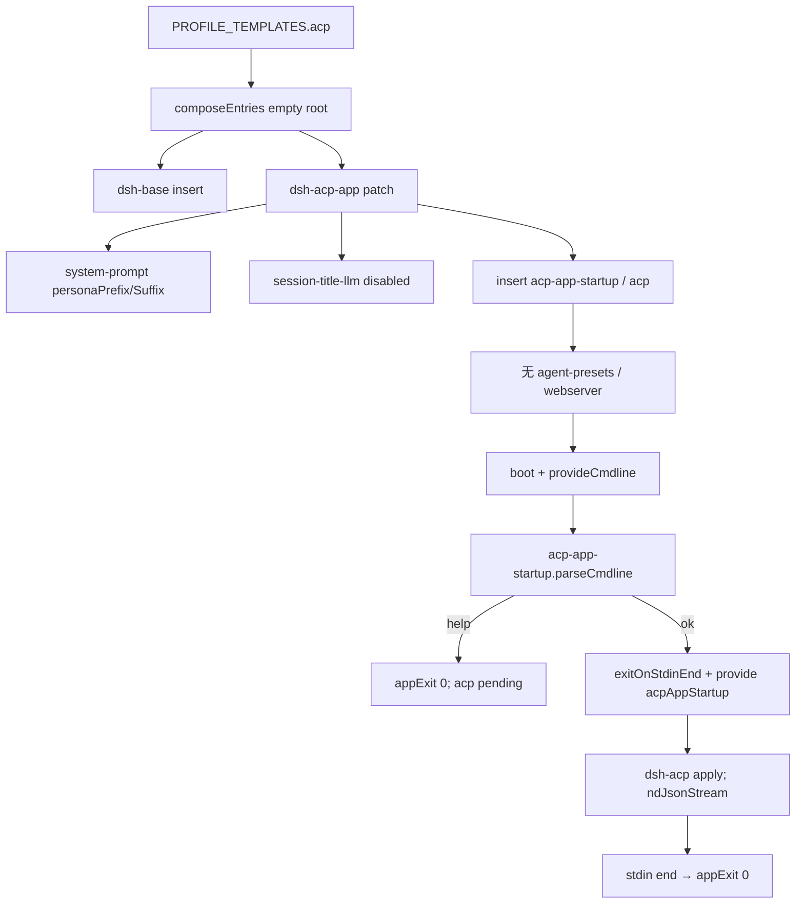

> `@deepseek-ai/dsh-acp-app` 是叠在 `dsh-base` 上的 **ACP automation overlay**：覆盖 host `system-prompt` 的 `personaPrefix` / `personaSuffix`、把 `session-title-llm` `disabled: true`，再 `insert` `acp-app-startup` + `acp`。stdout 属于 ACP JSON-RPC。成功 parse 才 `provide('acpAppStartup')`；`--help` 不 provide，桥行 pending，不占 stdio。五个 shipped profile 里只有 `acp` 用这份 bundle。

DSH 是 **Cordis 组合运行时**（`profile → bundle → agent preset`）。capability seam = Definition / Provider / Consumer。shipped profile 五个：`web`（`patchReload: live`）、`headless` / `sdk` / `sdk-minimal` / `acp`（`startup`）。六个 bundle：`dsh-base`、`dsh-web-app`、`dsh-headless`、`dsh-sdk-app`、`dsh-sdk-minimal`、`dsh-acp-app`；`sdk-minimal` 不叠 base。宿主入口是 `dsh web` 以及 `dsh --profile headless|sdk|sdk-minimal|acp`。本仓没有 shipped TUI。`acp` 是 **无 HTTP、无 browser client、无 shipped preset roster** 的 stdio Agent 侧桥进程。

## 能回答的问题

- `PROFILE_TEMPLATES.acp` 相对 `dsh-base` 多了哪一层？`patchReload` 是什么？
- overlay 改了哪两行已有配置？insert 哪两行？有没有 `agent-presets` / `webserver` / `code-runtime`？
- `acp-app-startup` 怎样 `provide('acpAppStartup')`？`--help` 为什么不启动 ACP 传输？
- stdin EOF 怎样走到 `ctx.appExit(0)`？和 `dsh-acp` 占 stdio 的分工是什么？
- 默认模型写在 overlay 的哪一行？和 `dsh-base` 的 `agent-default-model` 是否重复？
- 工具留在 host 全局层还是 agent-preset 面？isolate / `leakedServices` 默认走不走到？

## 职责边界

本包 `@deepseek-ai/dsh-acp-app` 拥有：**mode overlay** `cordis.patch.yml`、cmdline Provider 插件 `acp-app-startup`（`ACP_APP_STARTUP_SERVICE = 'acpAppStartup'`）。manifest 把 bundle patch 钉在 `./cordis.patch.yml`，并依赖 `@deepseek-ai/dsh-acp`。[E: packages/bundle/acp-app/package.json:2] [E: packages/bundle/acp-app/package.json:33] [E: packages/bundle/acp-app/package.json:37] [E: packages/bundle/acp-app/src/index.ts:13] [E: packages/bundle/acp-app/src/index.ts:19]

明确**不**拥有：

- 共享核心 insert（`llm` / `session` / `agent` / `agent-loop` / `tools` / 模型可见 `tool-*`）：[`subsys.composition.bundle-base`](bundle-base.md)。`dsh-base` **没有** `subagent-codex` / `subagent-claude-code` 行。[E: packages/bundle/base/tests/base.spec.ts:43] [E: packages/bundle/base/tests/base.spec.ts:43]
- ACP JSON-RPC 方法表、stdio `ndJsonStream`、`AcpSession`：[`subsys.integration.acp`](../integration/acp.md) / [`surface.acp.server`](../../surface/acp/server.md)。本 overlay 只 insert 那一行并 gate `inject: [acpAppStartup]`。[E: packages/bundle/acp-app/cordis.patch.yml:16] [E: packages/bundle/acp-app/cordis.patch.yml:18] [E: packages/acp/acp/src/index.ts:62]
- profile 发现、`composeEntries`、`boot`：[`subsys.composition.app-boot`](app-boot.md)。`PROFILE_TEMPLATES.acp` = `{ bundles: ['@deepseek-ai/dsh-base', '@deepseek-ai/dsh-acp-app'], patchReload: 'startup' }`。[E: packages/boot/app-boot/src/profile.ts:106] [E: packages/boot/app-boot/src/profile.ts:107] [E: packages/boot/app-boot/src/profile.ts:108]
- launcher 旗标与 `provideCmdline` / `ctx.appExit` / `exitOnStdinEnd`：[`subsys.composition.cmdline`](cmdline.md) / [`surface.cli.overview`](../../surface/cli/overview.md)。没有 `dsh acp` 子命令。
- preset 发现、`mountPreset`、`leakedServices`：[`subsys.composition.agent-presets`](agent-presets.md)。**默认 acp 树没有 `agent-presets` 行。** shipped 目录是 `minimal` / `standard` / `ptc` / `cordis`。
- Host HTTP / `webserver` / client roster：[`subsys.composition.bundle-web-app`](bundle-web-app.md)。本 overlay 不 insert 它们。
- 对照 SDK stdio overlay：[`subsys.composition.bundle-sdk-app`](bundle-sdk-app.md)。结构相近（关 title-llm、startup latch、协议行 inject），协议包不同。

**host 面 vs agent-preset 面。** 本 bundle 只加进程级 host 入口。`dsh-acp` 的 `agents.create` 不 `bindScopeParent`、不 `mountPreset`。agent-preset 面默认不存在；模型可见工具读 host 全局 `ctx.tools`。产品可见方法表在 `surface.acp.server`；本页写 overlay 行、inject 门、stdin 寿命、waterfall / isolate 在这条路径上停在哪。

## 关键文件

| 路径 | 角色 |
|---|---|
| `packages/bundle/acp-app/package.json` | 包名 `@deepseek-ai/dsh-acp-app`；`dsh.bundle.patch = ./cordis.patch.yml`。 |
| `packages/bundle/acp-app/cordis.patch.yml` | 叠在 base 之后：persona、disable `session-title-llm`、insert startup + `acp`。**不**改 `hmr`。 |
| `packages/bundle/acp-app/src/index.ts` | Provider：`inject: ['cmdlineArgs']`，零 option commander，`exitOnStdinEnd` + `provide('acpAppStartup')`。 |
| `packages/bundle/acp-app/tests/startup.spec.ts` | 空 argv 才 provide；`--help` 打印 `dsh --profile acp`、不 provide、stdin end 不再二次 exit。 |
| `packages/bundle/acp-app/tests/acp-app.spec.ts` | patch 契约：无 `hmr` overlay、title-llm disabled、`acp` inject + 默认模型。 |

## 数据模型

| 符号 | 落点 | 含义 |
|---|---|---|
| `ACP_APP_STARTUP_SERVICE` | `index.ts` | 字符串 `'acpAppStartup'`。Loader 行 `inject: [acpAppStartup]` 等这个键。[E: packages/bundle/acp-app/src/index.ts:19] |
| 服务值 | `index.ts` | `{ accepted: true }`。没有 host/port/task 字段。[E: packages/bundle/acp-app/src/index.ts:45] |
| `name` | `index.ts` | `'acp-app-startup'`。[E: packages/bundle/acp-app/src/index.ts:13] |
| `inject` | `index.ts` | `['cmdlineArgs']`。[E: packages/bundle/acp-app/src/index.ts:16] |
| 插件 Config | 无 | `apply(ctx)` 不收 config。[E: packages/bundle/acp-app/src/index.ts:41] |
| `acp` 行 config | patch | `provider: deepseek-official`、`model: deepseek-v4-flash`（ACP 桥专用默认，不是 base 的 `deepseek-flash`）。[E: packages/bundle/acp-app/cordis.patch.yml:20] [E: packages/bundle/acp-app/cordis.patch.yml:21] |

`composeEntries` 从空数组一次 `applyEntryPatches`：同 id 的 `config` **整键覆盖**（`target[key] = value`，不是 deep-merge）。本 overlay 重写 `system-prompt` 时只带 `personaPrefix` / `personaSuffix`，schema 默认补其余项。[E: vendor/include/src/index.ts:123]

## 控制流

1. `PROFILE_TEMPLATES.acp@packages/boot/app-boot/src/profile.ts` 写成两元组：先 `@deepseek-ai/dsh-base`，再 `@deepseek-ai/dsh-acp-app`，`patchReload: 'startup'`（不装 user-patch watcher）。launcher `allPatches` 按 bundles → profile patch → home patch → `--patch` 叠层。[E: packages/boot/app-boot/src/profile.ts:107] [E: packages/boot/app-boot/src/profile.ts:108] [E: apps/cli/src/profile-boot.ts:138] 五个模板里只有 `web` 是 `live`。[E: packages/boot/app-boot/src/profile.ts:112]

2. overlay 按 id 改两行：`system-prompt` 写成 `personaPrefix`（`You are a coding agent powered by the {{model}} model.`）与 `personaSuffix`（`Your working directory is {{cwd}}.`）；`session-title-llm` `disabled: true`（stdio 自动化不跑首 prompt 标题 LLM）。[E: packages/bundle/acp-app/cordis.patch.yml:3] [E: packages/bundle/acp-app/cordis.patch.yml:5] [E: packages/bundle/acp-app/cordis.patch.yml:6] [E: packages/bundle/acp-app/cordis.patch.yml:9] [E: packages/bundle/acp-app/cordis.patch.yml:10] **本 overlay 不再写 `hmr`。** base 已经 `hmr` `disabled: true`。[E: packages/bundle/base/cordis.patch.yml:21] [E: packages/bundle/base/cordis.patch.yml:23] [E: packages/bundle/acp-app/tests/acp-app.spec.ts:27]

3. 同一文件的 `insert` **只有**两行：`acp-app-startup`（`name: '@deepseek-ai/dsh-acp-app'`）、`acp`（`name: '@deepseek-ai/dsh-acp'`，`inject: [acpAppStartup]`，默认 `deepseek-official` / `deepseek-v4-flash`）。没有 `id: agent-presets`，没有 `webserver` / `code-runtime` / `headless-runner`。本文件**没有**把 base 的 `tool-*` 写成 `disabled: true`。[E: packages/bundle/acp-app/cordis.patch.yml:13] [E: packages/bundle/acp-app/cordis.patch.yml:14] [E: packages/bundle/acp-app/cordis.patch.yml:16] [E: packages/bundle/acp-app/cordis.patch.yml:17] [E: packages/bundle/acp-app/cordis.patch.yml:18]

4. 对照 `dsh-web-app`：web 把 base 上模型可见行 `disabled: true`，再 `insert` `agent-presets` `default: standard`。acp 不做这两刀，工具留在 **host 全局层**。[E: packages/bundle/web-app/cordis.patch.yml:470] [E: packages/bundle/web-app/cordis.patch.yml:484] 五个 shipped profile 里只有 `web` 挂 roster。对照 `dsh-sdk-app`：同样 disable `session-title-llm`、同样 startup latch；协议行是 `sdk-jsonrpc-server` 而不是 `acp`。[E: packages/bundle/sdk-app/cordis.patch.yml:9] [E: packages/bundle/sdk-app/cordis.patch.yml:18] 对照 `dsh-headless`：headless insert `code-runtime` / startup / runner，一次性 argv task，不是长寿命 stdio 桥。[E: packages/bundle/headless/cordis.patch.yml:20]

5. `runProfile` 在任何 config-tree 行 mount 之前 `provideCmdline`：冻 `ctx.cmdlineArgs`，并把 shutdown 做成 `ctx.appExit`，同时提供 `appReady`。[E: apps/cli/src/profile-boot.ts:257] [E: packages/boot/cmdline/src/index.ts:86] [E: packages/boot/cmdline/src/index.ts:87] [E: packages/boot/cmdline/src/index.ts:88] `acp` 的 `patchReload === 'startup'`，不进 live watcher 分支。[E: apps/cli/src/profile-boot.ts:271]

6. `acp-app-startup.apply@packages/bundle/acp-app/src/index.ts` 建 commander，程序名 `dsh --profile acp`，只登记 `-h/--help`，没有位置参数。action 里先 `exitOnStdinEnd(ctx, 'acp-app.stdin')`，再 `ctx.provide(ACP_APP_STARTUP_SERVICE, { accepted: true })`，然后 `parseCmdline`。[E: packages/bundle/acp-app/src/index.ts:27] [E: packages/bundle/acp-app/src/index.ts:43] [E: packages/bundle/acp-app/src/index.ts:44] [E: packages/bundle/acp-app/src/index.ts:45] [E: packages/bundle/acp-app/src/index.ts:47]

7. `--help` / 用法错误走 `parseCmdline` 的 `ctx.appExit`，**不**跑 action，因此不 `provide`、不绑 stdin EOF。测试：空 argv 得到 `{ accepted: true }`，stdin `end` 退出 `0`；`--help` 输出含 `dsh --profile acp`，服务 `undefined`，exit `0`，再 `stdin.end()` 不再追加退出码。[E: packages/boot/cmdline/src/index.ts:184] [E: packages/bundle/acp-app/tests/startup.spec.ts:51] [E: packages/bundle/acp-app/tests/startup.spec.ts:53] [E: packages/bundle/acp-app/tests/startup.spec.ts:59] [E: packages/bundle/acp-app/tests/startup.spec.ts:60] [E: packages/bundle/acp-app/tests/startup.spec.ts:63]

8. `exitOnStdinEnd` 要求 launcher 已提供 `appExit` **和** `appReady`。EOF 后在 `onReady` 里 `exit(0)`，避免 boot 失败时把 EOF 当成成功退出。listener **不**读 stdin 字节：传输归 `dsh-acp`。[E: packages/boot/cmdline/src/index.ts:123] [E: packages/boot/cmdline/src/index.ts:127] [E: packages/boot/cmdline/src/index.ts:136]

9. Loader 满足 `inject: [acpAppStartup]` 后才 mount `@deepseek-ai/dsh-acp`。该包 `inject = ['agents', 'llm', 'sessionPersistence', 'sessions']`（**不含** `acpAppStartup`：门在 yml 行上）。`apply` 用 `ndJsonStream(process.stdout, process.stdin)` 占 stdio。[E: packages/acp/acp/src/index.ts:62] [E: packages/acp/acp/src/index.ts:97] [E: packages/acp/acp/src/index.ts:374]

10. overlay 上 `acp.config` 仍硬编码 `deepseek-official` / `deepseek-v4-flash`；base `agent-default-model` 现为同 provider、**`deepseek-flash`**。ACP 创建 Agent 时读的是**桥 Config**，不是 Settings 热路径上那一行。[E: packages/bundle/base/cordis.patch.yml:78] [E: packages/bundle/base/cordis.patch.yml:79] [E: packages/bundle/acp-app/cordis.patch.yml:20] [E: packages/bundle/acp-app/cordis.patch.yml:21] [E: packages/acp/acp/src/index.ts:454]

11. **isolate / `leakedServices` 不在默认路径上。** 默认 acp 没有 `agent-presets` 行。host 全局 `tool-*` publish 进 root realm 是本 mode 的设计。若 `--patch` 后加 roster，必须自己 join standing mount；本包 **没有** runner `setup`。

12. persona 写在 host `system-prompt` 行，不是 `dsh-persona`。section 名是 `PERSONA_PREFIX_SECTION = 'deployment:persona-prefix'` 与 `PERSONA_SUFFIX_SECTION = 'deployment:persona-suffix'`。[E: packages/core/system-prompt/src/index.ts:174] [E: packages/core/system-prompt/src/index.ts:177]

## 设计动机

- **stdout 只给 ACP。** 关掉 `session-title-llm`，避免启动后往 stdout 打非帧文本。help 不 provide，桥不挂，help 文案可以走 cmdline 的捕获流而不污染协议。
- **inject 门把 `--help` 挡在传输之外。** 与 headless 空 task、web `--host 0.0.0.0` 同一模式：action 才 `provide`，依赖行 pending。
- **EOF 寿命在 overlay，帧读写在 `dsh-acp`。** 换协议包不必重写 commander；换 CLI 不必碰 codec。
- **不挂 roster。** 自动化进程一个树、一套全局 tools，少一层 `mountPreset` / isolate。

## Gotcha

- **没有 `dsh acp` alias。** launcher 唯一硬编码子命令是 `web`。入口是 `dsh --profile acp`。
- **本 overlay 不插 `code-runtime`。** PTC `run_code` 不因此自动出现；`DSH_TOOLS_MODE` 也不是本文件改写的键（headless / web overlay 才写 `tools.mode`）。
- **`apply` 无 Config。** dump / overlay 不能给 `acp-app-startup` 填字段；要改模型改 `id: acp` 那一行。
- **`exitOnStdinEnd` 缺 `appReady` 会同步抛。** 嵌入方只 `provideCmdline` 的 `exit` 不够。
- **`dsh-acp` 与 `dsh-subagent-acp` 不是同一包。** 后者是父进程 spawn ACP 孩子的 Client。
- shipped preset 成员资格只认 `packages/preset/agent-presets/presets/{minimal,standard,ptc,cordis}/`；默认 acp 不挂它们。

## Seam 三角

| Seam | Definition | Provider | Consumer |
|---|---|---|---|
| 组合层 `dsh-acp-app` | 包 `@deepseek-ai/dsh-acp-app` + `dsh.bundle.patch` | `PROFILE_TEMPLATES.acp` 第二层；`composeEntries` 叠在 base 之后 | `dsh --profile acp`；用户 profile / home / `--patch` 仍可改这两行 insert |
| `acpAppStartup` | `{ accepted: true }`；键 `'acpAppStartup'` | `acp-app-startup`：`inject: [cmdlineArgs]`，action 里 `provide` | patch 行 `id: acp` 的 `inject: [acpAppStartup]` |
| ACP 传输 | `@deepseek-ai/dsh-acp` 插件名 `acp`；`inject` agents/llm/persistence/sessions | overlay `insert` 该行 | IDE / ACP client 经 stdio。权威方法表在 `subsys.integration.acp` |
| 模型可见工具 | `ctx.tools` / `ToolRuntime` | `dsh-base` 的 `tool-*`（本 overlay **不** `disabled`） | 全局层 `schemas` / `execute`。web 的 Consumer 是 preset 行；acp 没有 roster |
| 部署 persona | `deployment:persona-prefix` / `deployment:persona-suffix` | 本 overlay 的 `id: system-prompt` `personaPrefix` / `personaSuffix` | `systemPrompt.assemble`。**不是** preset 里的 `dsh-persona` |
| 进程退出 | `ctx.appExit` + `ctx.appReady` | launcher `provideCmdline` | startup 的 `exitOnStdinEnd`（EOF → 0）与 `parseCmdline`（help / 错 → commander exitCode） |
| isolate / 泄漏门 | `leakedServices` | `mountPreset` | **默认 Consumer 不存在** |

换 Provider = 换 overlay 行或换 `dsh-acp` 插件，不必改 `dsh-agent` 合同。换 Definition（例如改服务名）必须同时改 insert 的 `inject`。

## Sources

- packages/bundle/acp-app/cordis.patch.yml
- packages/bundle/acp-app/package.json
- packages/bundle/acp-app/src/index.ts
- packages/bundle/acp-app/tests/acp-app.spec.ts
- packages/bundle/acp-app/tests/startup.spec.ts
- packages/boot/app-boot/src/profile.ts
- packages/boot/cmdline/src/index.ts
- apps/cli/src/profile-boot.ts
- packages/bundle/base/cordis.patch.yml
- packages/bundle/base/tests/base.spec.ts
- packages/bundle/sdk-app/cordis.patch.yml
- packages/bundle/web-app/cordis.patch.yml
- packages/bundle/headless/cordis.patch.yml
- packages/acp/acp/src/index.ts
- packages/core/system-prompt/src/index.ts
- vendor/include/src/index.ts

## 相关

- [`spine.composition-boot`](../../spine/composition-boot.md) — `profile → bundle → preset` 叠层。
- [`subsys.composition.app-boot`](app-boot.md) — `PROFILE_TEMPLATES` / `composeEntries` / `boot`。
- [`subsys.composition.bundle-base`](bundle-base.md) — 第一层 insert；本 overlay 不 disable 那些 `tool-*`。
- [`subsys.composition.bundle-headless`](bundle-headless.md) — 对照：one-shot argv runner，无 stdio 协议。
- [`subsys.composition.bundle-web-app`](bundle-web-app.md) — 对照：disable 模型可见行 + `agent-presets`。
- [`subsys.composition.bundle-sdk-app`](bundle-sdk-app.md) — 对照：同样 stdio latch，协议是 SDK JSON-RPC。
- [`subsys.composition.cmdline`](cmdline.md) — `provideCmdline` / `parseCmdline` / `exitOnStdinEnd`。
- [`subsys.composition.agent-presets`](agent-presets.md) — `mountPreset` / isolate；默认 acp 不挂。
- [`surface.acp.server`](../../surface/acp/server.md) — ACP 产品可见方法表。
- [`subsys.integration.acp`](../integration/acp.md) — `dsh-acp` 桥控制流（符号权威在那边）。
- [`surface.cli.overview`](../../surface/cli/overview.md) — `--profile` / `--patch` / dump，没有 `dsh acp` alias。
- [`subsys.core.system-prompt`](../core/system-prompt.md) — `personaPrefix` / `personaSuffix`。
- [`subsys.core.tools`](../core/tools.md) — host 面注册表。
