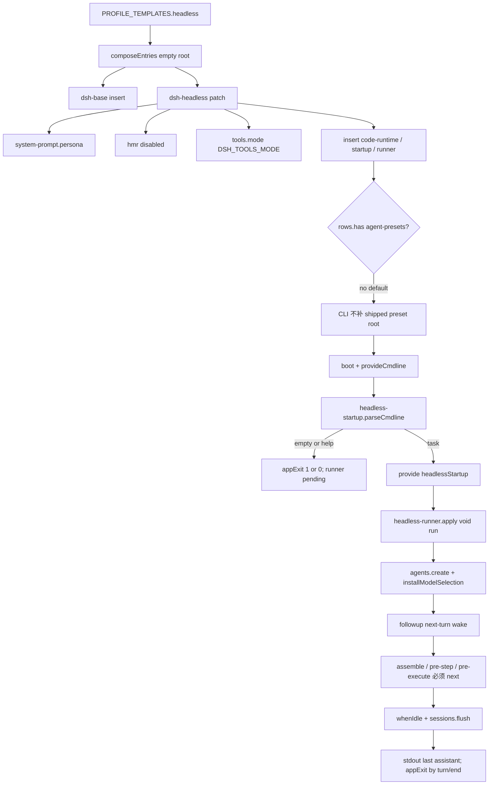

> `@deepseek-ai/dsh-headless` 是叠在 `dsh-base` 上的 **one-shot host 面 overlay**：`insert` 只有 `code-runtime` / `headless-startup` / `headless-runner`，**没有** `agent-presets`、**没有** `webserver`。`headless-startup` 把 argv task 做成 `ctx.headlessStartup`，`headless-runner` 在 root realm `agents.create` → `followup` → `whenIdle`，打印 session log 里最后一条 assistant text，再按 `turn/end` reason 经 `ctx.appExit` 退出。模型可见 `tool-*` 留在 host 全局层。

DSH 是 **Cordis 组合运行时**（`profile → bundle → agent preset`），不是「又一个 coding agent」。capability seam = Definition / Provider / Consumer；进入模型请求的内容必须能从 append-only session log 重建（`model-visible ⟺ logged`）。默认产品路径仍是本地 Web GUI（`dsh web`）；本仓没有 shipped TUI。`headless` 是另一条 **无 HTTP、无 browser client、无 shipped preset roster** 的一次性任务进程。

## 能回答的问题

- `dsh --profile headless "<task>"` 相对 `dsh-base` 多了哪三行 insert？有没有 `agent-presets` / `webserver`？
- 为什么 web 要把 base 的 `tool-*` `disabled: true`，而 headless **不** disable，工具留在哪一面？
- `headless-startup` 怎样 `provide('headlessStartup')`？空 task / `--help` 为什么让 runner 一直 pending？
- `headless-runner` 的 `agents.create` → `followup` → `whenIdle` → `sessions.flush` → `appExit` 编号路径是什么？stdout / 退出码读哪条 log？
- 这条路径上 waterfall 必须 `next()` 的点在哪？默认树为什么进不了 `mountPreset` / `leakedServices`？
- host 面 persona 写在哪一行？`DSH_TOOLS_MODE` 与 `hmr` 本 overlay 怎么改？

## 职责边界

本包 `@deepseek-ai/dsh-headless` 拥有：**mode overlay** `cordis.patch.yml`、cmdline Provider `headless-startup`（`HEADLESS_STARTUP_SERVICE = 'headlessStartup'`）、one-shot Consumer `headless-runner`。manifest 把 bundle patch 钉在 `./cordis.patch.yml`。[E: packages/bundle/headless/package.json:2] [E: packages/bundle/headless/package.json:43] [E: packages/bundle/headless/src/startup.ts:19]

明确**不**拥有：

- 共享核心 insert（`llm` / `session` / `agent` / `agent-loop` `agents: []` / `tools` / `system-prompt` / sandbox / approval / 模型可见 `tool-*` / subagent **backends**）：[`subsys.composition.bundle-base`](bundle-base.md)（`subsys.composition.bundle-base`）。`dsh-base` **没有** `subagent-codex` / `subagent-claude-code` 行，也不是「装了但 dormant」。[E: packages/bundle/base/tests/base.spec.ts:38] [E: packages/bundle/base/tests/base.spec.ts:39] [E: packages/bundle/base/tests/base.spec.ts:40] [E: packages/bundle/base/tests/base.spec.ts:41]
- profile 发现、空根 `composeEntries`、`boot`：[`subsys.composition.app-boot`](app-boot.md)（`subsys.composition.app-boot`）。shipped 模板名 `PROFILE_TEMPLATES.headless = ['@deepseek-ai/dsh-base', '@deepseek-ai/dsh-headless']`。[E: packages/boot/app-boot/src/profile.ts:116]
- launcher 旗标与 `provideCmdline` / `ctx.appExit`：[`subsys.composition.cmdline`](cmdline.md)（`subsys.composition.cmdline`）/ [`surface.cli.overview`](../../surface/cli/overview.md)（`surface.cli.overview`）。
- 默认 loop 工厂与 turn/step：[`subsys.core.agent-loop`](../core/agent-loop.md)（`subsys.core.agent-loop`）/ [`spine.turn-and-step`](../../spine/turn-and-step.md)（`spine.turn-and-step`）。
- `Session` append-only log 与 `deriveMessages()`：[`subsys.core.session`](../core/session.md)（`subsys.core.session`）/ [`spine.session-log`](../../spine/session-log.md)（`spine.session-log`）。
- preset 发现、`mountPreset`、`leakedServices`：[`subsys.composition.agent-presets`](agent-presets.md)（`subsys.composition.agent-presets`）。**默认 headless 树没有这行。**
- Host HTTP / `webserver` / client roster：[`subsys.composition.bundle-web-app`](bundle-web-app.md)（`subsys.composition.bundle-web-app`）。本 overlay 不 insert 它们。

**host 面 vs agent-preset 面。** 本 bundle 只加进程级 host 入口。`headless-runner` 的 `setup` 只 `installModelSelection`，不 `bindScopeParent`、不 `mountPreset`。agent-preset 面（每会话 tools / persona / isolate）默认不存在；模型可见工具读 host 全局 `ctx.tools`。[E: packages/bundle/headless/src/index.ts:117]

argv 到进程退出的端到端走读在 [`spine.trace-headless-turn`](../../spine/trace-headless-turn.md)（`spine.trace-headless-turn`）；profile 旗标与 dump 验收在 [`surface.profiles.headless`](../../surface/profiles/headless.md)（`surface.profiles.headless`）。本页写 overlay 行、inject 门、runner 合同、waterfall / isolate 在这条路径上停在哪。

## 关键文件

| 路径 | 角色 |
|---|---|
| `packages/bundle/headless/package.json` | 包名 `@deepseek-ai/dsh-headless`；`dsh.bundle.patch = ./cordis.patch.yml`；exports `.` / `./startup` / `./invariant` / `./cordis.patch.yml`。 |
| `packages/bundle/headless/cordis.patch.yml` | 叠在 base 之后：覆盖 `system-prompt.persona`、disable `hmr`、`tools.mode` 读 `DSH_TOOLS_MODE`；`insert` 三行。 |
| `packages/bundle/headless/src/startup.ts` | Provider：`inject: ['cmdlineArgs']`，解析 `[task...]`，`provide('headlessStartup', { task })`。 |
| `packages/bundle/headless/src/index.ts` | Consumer：`inject: ['agentDefaultModel', 'agents', 'sessions']`；`Config.task` 必填；`apply` 里 `void run(...)`。 |
| `packages/bundle/headless/src/invariant.ts` | companion `headless-invariant`：`invariants.register` 一个空 installer，不审计树内可变关系。 |
| `packages/bundle/headless/tests/startup.spec.ts` | Loader 真树：多词 join、空 task / `--help` 不 provide、runner 保持 pending。 |
| `packages/bundle/headless/tests/headless.spec.ts` | scripted factory：`firstSeq` 窗口、flush 先于 exit、非 `completed` / 无 turn / create 失败的退出码。 |

## 数据模型

| 符号 | 落点 | 含义 |
|---|---|---|
| `HEADLESS_STARTUP_SERVICE` | `startup.ts` | 字符串 `'headlessStartup'`。Loader 行 `inject: [headlessStartup]` 等这个键。[E: packages/bundle/headless/src/startup.ts:19] |
| `HeadlessStartupValues` | `startup.ts` | `{ task: string }`。非空任务正文。 |
| `name`（startup） | `startup.ts` | `'headless-startup'`。[E: packages/bundle/headless/src/startup.ts:13] |
| `inject`（startup） | `startup.ts` | `['cmdlineArgs']`。[E: packages/bundle/headless/src/startup.ts:16] |
| `name`（runner） | `index.ts` | `'headless-runner'`。[E: packages/bundle/headless/src/index.ts:25] |
| `inject`（runner 插件） | `index.ts` | `['agentDefaultModel', 'agents', 'sessions']`。行级另有 `inject: [headlessStartup]`。[E: packages/bundle/headless/src/index.ts:28] |
| `Config.task` | `index.ts` | `z.string().required()`。缺键构造即抛。[E: packages/bundle/headless/src/index.ts:37] [E: packages/bundle/headless/tests/headless.spec.ts:249] |
| `RunOutcome` | `index.ts`（未导出） | `{ text, reason }`。`text` = `firstSeq` 之后最后一条非空 `assistant/message` 文本；`reason` = 最后一条 `turn/end`。 |
| `internals.stdout` / `stderr` | `index.ts` | 默认真 `process` 流；测试替换。 |
| `ctx.appExit` | launcher `provideCmdline` | 可选 host 值，**不是** runner 的 `inject`。缺了 `apply` 同步抛。[E: packages/bundle/headless/src/index.ts:146] |

`composeEntries` 从空数组一次 `applyEntryPatches`：同 id 的 `config` **整键覆盖**（`target[key] = value`，不是 deep-merge）。本 overlay 重写 `system-prompt` / `tools` 时只带自己那几个键，schema 默认补其余项。[E: packages/boot/app-boot/src/profile.ts:416] [E: vendor/include/src/index.ts:123]

## 控制流

1. `PROFILE_TEMPLATES@packages/boot/app-boot/src/profile.ts` 把 shipped `headless` 写成两元组：先 `@deepseek-ai/dsh-base`，再 `@deepseek-ai/dsh-headless`。launcher 的 `composeProfile`（文件内，未导出）按 bundles → profile patch → home patch → `--patch` 叠层。[E: packages/boot/app-boot/src/profile.ts:116]

2. `dsh-headless` overlay 先按 id 改三行已有 host 配置：`system-prompt` 的 `persona` 写成 `You are a coding agent powered by the {{model}} model. Your working directory is {{cwd}}.`；`hmr` `disabled: true`；`tools.mode` 为 `!!js process.env.DSH_TOOLS_MODE`。unset 时表达式是 `undefined`，`ToolRuntime` schema 默认 `'native'`。[E: packages/bundle/headless/cordis.patch.yml:7] [E: packages/bundle/headless/cordis.patch.yml:10] [E: packages/bundle/headless/cordis.patch.yml:15] [E: packages/bundle/headless/cordis.patch.yml:20] [E: packages/core/tools/src/index.ts:791]

3. 同一文件的 `insert` **只有**三行：`code-runtime`（`@deepseek-ai/dsh-code-runtime-worker-thread`）、`headless-startup`（`@deepseek-ai/dsh-headless/startup`）、`headless-runner`（`@deepseek-ai/dsh-headless`，`inject: [headlessStartup]`，`config.task: !!js ctx.headlessStartup.task`）。没有 `id: agent-presets`，没有 `webserver` / `web-runtime` / `ui-*`。本文件里唯一的 `disabled: true` 是 `hmr`，**没有**把 base 的 `tool-*` 关掉。[E: packages/bundle/headless/cordis.patch.yml:24] [E: packages/bundle/headless/cordis.patch.yml:27] [E: packages/bundle/headless/cordis.patch.yml:31] [E: packages/bundle/headless/cordis.patch.yml:33] [E: packages/bundle/headless/cordis.patch.yml:35]

4. 对照 `dsh-web-app`：web 把 base 上模型可见行（如 `tool-bash`）标 `disabled: true`，再 `insert` `agent-presets` `default: standard`，把工具挪到 **agent-preset 面**。headless 不做这两刀，工具留在 **host 全局层**。[E: packages/bundle/web-app/cordis.patch.yml:293] [E: packages/bundle/web-app/cordis.patch.yml:294] [E: packages/bundle/web-app/cordis.patch.yml:421] [E: packages/bundle/web-app/cordis.patch.yml:424]

5. CLI `composeProfile` **仅当** `rows.has('agent-presets')` 才补 shipped root `apps/cli/config/agent-presets/`（`trust: 'system'`）。默认 headless 进不了这个分支，因此不要把 `minimal` / `standard` / `code` / `cordis` 说成 headless 的默认装配。[E: apps/cli/src/profile-boot.ts:159]

6. `runProfile` 在任何 config-tree 行 mount 之前 `provideCmdline`：冻 `ctx.cmdlineArgs`，并把 `shutdown.shutdown` 做成 `ctx.appExit`。[E: apps/cli/src/profile-boot.ts:255] [E: packages/boot/cmdline/src/index.ts:70] [E: packages/boot/cmdline/src/index.ts:71]

7. `headless-startup.apply@packages/bundle/headless/src/startup.ts` 建 commander，程序名 `dsh --profile headless`，位置参数 `[task...]`。action 里 `program.args.join(' ')`；`task.trim() === ''` 走 `program.error(...)`，**不** `provide`。[E: packages/bundle/headless/src/startup.ts:33] [E: packages/bundle/headless/src/startup.ts:52] [E: packages/bundle/headless/src/startup.ts:53] 然后 `parseCmdline`：help / 用法错误收成 `ctx.appExit`。[E: packages/bundle/headless/src/startup.ts:56] [E: packages/boot/cmdline/src/index.ts:117] 测试：`['run','the','tests']` 得到 `{ task: 'run the tests' }` 且 runner config 同步；空 / 空白退出 `1` 且 runner 未配置；`--help` 退出 `0` 且不 provide。[E: packages/bundle/headless/tests/startup.spec.ts:86] [E: packages/bundle/headless/tests/startup.spec.ts:96] [E: packages/bundle/headless/tests/startup.spec.ts:104]

8. 非空 task 才 `ctx.provide('headlessStartup', { task })`。Loader 这时才满足 runner 行的 `inject: [headlessStartup]`，`!!js` 把 `ctx.headlessStartup.task` 写进 `Config.task`。[E: packages/bundle/headless/src/startup.ts:54] 空 task / `--help` 不 provide，runner 行保持 pending，进程只靠 `parseCmdline` 的 `appExit` 退。

9. `headless-runner.apply@packages/bundle/headless/src/index.ts` 用 `ctx.get('appExit')` 读 launcher 出口；缺了同步抛 `the launcher must provide ctx.appExit before the tree mounts`。然后 `void run(...)`：**不**阻塞 `apply`，也不阻塞随后 `runProfile` 返回。进程靠仍挂着的 Cordis 树与 in-flight `run` 活着。[E: packages/bundle/headless/src/index.ts:144] [E: packages/bundle/headless/src/index.ts:146] [E: packages/bundle/headless/src/index.ts:149] [E: packages/bundle/headless/tests/headless.spec.ts:245]

10. `run` 先 `await ctx.get('loader')?.await()`，避免并发 mount 时工具 / adapter 半组成。settlement 期间树被 dispose、三个核心服务缺失则直接 `return`，不再 `appExit`。[E: packages/bundle/headless/src/index.ts:99] [E: packages/bundle/headless/src/index.ts:104] 否则 `agentDefaultModel.currentSelection()`；base 组合默认 `provider: deepseek-official` / `model: deepseek-v4-flash`（Settings 可覆盖）。[E: packages/bundle/headless/src/index.ts:106] [E: packages/core/agent-default-model/src/index.ts:88] [E: packages/bundle/base/cordis.patch.yml:66] [E: packages/bundle/base/cordis.patch.yml:67]

11. `ctx.agents.create` 转到已登记 factory。`AgentLoop` 构造时 `setFactory(this)`；base 行 `agents: []`，boot **不**在进程级造 Agent，由 runner 运行时创建。[E: packages/core/agent/src/index.ts:405] [E: packages/core/agent-loop/src/index.ts:350] [E: packages/bundle/base/cordis.patch.yml:439] runner 传入 `sessionId: SessionId("session-" + randomUUID())`、`meta.cwd = process.cwd()`、`agentOptions: { provider, model }`。`setup` **只** `installModelSelection`：没有 preset child realm 可 join，也就没有 `isolate` 组。[E: packages/bundle/headless/src/index.ts:111] [E: packages/bundle/headless/src/index.ts:117]

12. 新 Agent 先 `whenIdle`（create 后的 idle），记下 `firstSeq = agent.session.seq`（下一条事件序号 = 当前 log 长度），再 **一次** `followup(createUserMessage({ content: [{ type: 'text', text: task }], source: { kind: 'user' } }))`。[E: packages/bundle/headless/src/index.ts:120] [E: packages/bundle/headless/src/index.ts:121] [E: packages/bundle/headless/src/index.ts:122] [E: packages/core/session/src/index.ts:565] [E: packages/llm/llm/src/message.ts:192] `ReactLoopAgent.followup` = `send(input, 'next-turn', true)`：进 inbox 并 `wakeDriver`。[E: packages/core/agent-loop/src/agent.ts:123] `firstSeq` 把 create 前已经在 log 里的噪声 turn 排除在打印窗口外。[E: packages/bundle/headless/tests/headless.spec.ts:117]

13. **Waterfall 必须 `next()`。** Cordis `Events.waterfall` 把最后一个参数 `pop` 成 innermost `next`：监听器必须调用传入的 `next()` 才会 `cbs.shift()` 到下一层；不调用就停在本层，内置行为也不跑。[E: vendor/cordis/src/events.ts:234] [E: vendor/cordis/src/events.ts:236] [E: vendor/cordis/src/events.ts:237] [E: vendor/cordis/src/events.ts:238] 本 bundle 自己不是 waterfall 插件，但 runner 打开的那一次 turn 会穿过三条必须 `next()` 的链：
    - `installModelSelection` 挂在 `system-prompt/assemble` 上：先 `await next()` 再把 `provider` / `model` 写进 `variables`。不调用 `next()`，assemble 停在这一层，`{{model}}` / `{{cwd}}` 插值拿不到完整 assembly。[E: packages/core/agent/src/model-selection.ts:40] [E: packages/core/agent/src/model-selection.ts:42] `SystemPrompt.assemble` 自己也是 waterfall，返回值权威。[E: packages/core/system-prompt/src/index.ts:532]
    - `ReactLoopAgent.preStep` 的 `agent/pre-step`：innermost `next` 默认 `{ kind: 'enter', messages }`。listener 不 `next()` 就不会走到这个 enter；`reject` 把 turn 收成 `blocked`，第一步空 claim 则以 `completed`、0 个 step 结束。[E: packages/core/agent-loop/src/agent.ts:234] [E: packages/core/agent-loop/src/agent.ts:237] [E: packages/core/agent-loop/src/agent.ts:268] [E: packages/core/agent-loop/src/agent.ts:275]
    - 模型若带 `tool-call`，`tools/pre-execute` 的 innermost 默认 `{ kind: 'allow' }`。不 `next()` 等于否决 allow，body 进不去。[E: packages/core/tools/src/index.ts:1475] [E: packages/core/tools/src/index.ts:1477]

14. `whenIdle` 等到 `activityDone` 不再被替换（driver 收敛）。runner 再 `sessions.flush(agent.session)`，然后 `summarize`：从 `firstSeq` 起，见到 `turn/start` 才开始；每个非空 `assistant/message` 文本覆盖 `text`；最后一条 `turn/end.reason` 留下。[E: packages/core/agent-loop/src/agent.ts:195] [E: packages/bundle/headless/src/index.ts:127] [E: packages/core/session/src/index.ts:1022] [E: packages/bundle/headless/src/index.ts:67] [E: packages/bundle/headless/src/index.ts:77] [E: packages/bundle/headless/src/index.ts:79] stdout 写 `text + '\n'`；`reason.kind === 'error'` 时 stderr 再写 `dsh: ${code}: ${message}`；`appExit(reason?.kind === 'completed' ? 0 : 1)`——无 turn、`aborted`、error 都是 `1`。[E: packages/bundle/headless/src/index.ts:129] [E: packages/bundle/headless/src/index.ts:133] 测试钉死 flush 在 exit 之前、跨两个 scripted turn 只打印 `final answer`、error reason 退出 `1`、无 turn 退出 `1`、`agents.create` reject 走 `fail`。[E: packages/bundle/headless/tests/headless.spec.ts:128] [E: packages/bundle/headless/tests/headless.spec.ts:130] [E: packages/bundle/headless/tests/headless.spec.ts:170] [E: packages/bundle/headless/tests/headless.spec.ts:177] [E: packages/bundle/headless/tests/headless.spec.ts:193]

15. **isolate / `leakedServices` 不在默认路径上。** `mountPreset` 若发现子树把 service publish 进 **root realm**，抛 `published process-global service(s)`，要求 `isolate: { …: true }` 或把该行搬到 host。[E: packages/preset/agent-presets/src/mount.ts:189] [E: packages/preset/agent-presets/src/mount.ts:361] [E: packages/preset/agent-presets/src/mount.ts:365] 默认 headless 没有 `agent-presets` 行，runner `setup` 也不 join standing mount，所以 **不会**走到 `leakedServices`。host 全局 `tool-*` publish 进 root realm 是本 mode 的设计，不是泄漏。若部署后来用 `--patch` 自己 `insert` 了 roster，必须在 **这个** `setup` 里先 join 那一代 standing mount；本仓库的 runner **没有**写这一步。

## 设计动机

- **one-shot 进程，不是长期 Host。** Web 把 Agent 面从进程挪到 preset，好让多个会话共享 webserver / persistence，又各自 isolate。headless 是「一个 argv 任务、一个进程、一次 `followup`」：少 roster 就少一层 `mountPreset` 失败面，模型可见集直接等于 `dsh-base` 仍启用的那些行。
- **inject 门把空 task 挡在 runner 之外。** `headless-runner` 的 `Config.task` 是 `required`；空调用若仍 mount runner，会用空字符串开 turn。startup 在 `provide` 之前 `program.error`，Loader 让依赖行 pending，进程只走 `appExit`。
- **打印窗口是 session log，不是「第一个 chunk」。** `summarize` 只读已经 append 的 `assistant/message`，再 `flush`。这是 `model-visible ⟺ logged` 在无 UI 路径上的落点：stdout 不能比 log 多出一个未入账的句子。
- **persona 写在 host `system-prompt` 行，不是 `dsh-persona`。** 没有 preset 就不能用 scoped 同名 section shadow。`PERSONA_SECTION = 'deployment:persona'`、`PERSONA_ORDER = 0`；本 overlay 填的是 registry 自己那一段 `config.persona`。[E: packages/core/system-prompt/src/index.ts:128] [E: packages/core/system-prompt/src/index.ts:365]
- **`code-runtime` 跟着 one-shot 走。** Code Mode 是执行能力，不是 Web 组件。`DSH_TOOLS_MODE` 与 web overlay 同一临时开关；unset 保持 `native`，不把 `run_code` 强加给每个 headless 调用。

## Gotcha

- **没有 `dsh headless` alias。** launcher 唯一硬编码子命令是 `web`。task 是 inner args，由 `headless-startup` 拼句。
- **审批默认仍是 `ask`。** base 的 `approval.policy` 只在 `DSH_PERMISSION_MODE === 'danger-full-access'` 时为 `never`，否则 `ask`。本 overlay 不改这一行。`ask` 且没有 answerer 时，`approval/request` waterfall 的 innermost 是 `'unavailable'`。[E: packages/bundle/base/cordis.patch.yml:191] [E: packages/interaction/user-approval/src/index.ts:320] 纯文本成功路径不经工具；无人值守放行工具必须自己改 policy / env。
- **`apply` 不 await `run`。** 测试和嵌入方不能假设 `apply` 返回时已经 `appExit`。缺 `appExit` 是同步抛；create 失败是异步 `fail` → `exit(1)`。
- **dispose 中途的 settlement 不 `appExit`。** loader `await` 回来后三个服务缺一则静默 return，避免 shutdown 已经开始时再抢一次退出码。
- **`firstSeq` 是下一条序号。** create 阶段若已有 `turn/*`（测试里的 setup noise），不会进 stdout。
- **`dsh-base` 没有 Codex / Claude 子代理后端。** headless 继承那份 insert，不会因为「仓库里有 `dsh-subagent-codex` 包」就 dormant 加载。preset 里对应 tool 行是 web roster 的事，默认 headless 根本不挂 roster。
- **后加 `agent-presets` 不会自动 join。** CLI 会补 shipped root，但本 runner 的 `setup` 仍只有 `installModelSelection`。需要私有实例的 preset 行必须 `isolate`，否则 `leakedServices` 拒绝；本包默认路径不触发该门。

## Seam 三角

| Seam | Definition | Provider | Consumer |
|---|---|---|---|
| 组合层 `dsh-headless` | 包 `@deepseek-ai/dsh-headless` + `dsh.bundle.patch` | `PROFILE_TEMPLATES.headless` 第二层；`composeEntries` 叠在 base 之后 | `dsh --profile headless`；用户 profile / home / `--patch` 仍可改这三行 insert |
| `headlessStartup` | `HeadlessStartupValues.task`；键 `'headlessStartup'` | `headless-startup` 行：`inject: [cmdlineArgs]`，action 里 `provide` | `headless-runner` 行：`inject: [headlessStartup]` + `!!js ctx.headlessStartup.task` |
| 一次性 Agent 入口 | `ctx.agents` / `AgentFactory`（`dsh-agent`） | `dsh-base` 行 `agent-loop`，`agents: []`，`setFactory` | `headless-runner.run`：`agents.create` + 一次 `followup`。Web `apiproxy` 是另一条 Consumer，本树不挂 |
| 模型可见工具 | `ctx.tools` / `ToolRuntime` | `dsh-base` 的 `tool-*` 行（本 overlay **不** `disabled`） | 全局层 `schemas` / `execute`。web 的 Consumer 是 preset 行；headless 没有 roster |
| Code Mode runtime | `ctx.codeRuntime` | insert `code-runtime` = `@deepseek-ai/dsh-code-runtime-worker-thread` | `tools.mode` 吃 `DSH_TOOLS_MODE`；`native` 时 runtime 在树里但直调仍走 native 名 |
| 部署 persona | `PERSONA_SECTION = 'deployment:persona'` | 本 overlay 的 `id: system-prompt` `config.persona`（host 面） | `systemPrompt.assemble` + `installModelSelection` 写 `{{model}}`。**不是** preset 里的 `dsh-persona` |
| 进程退出 | `ctx.appExit` | launcher `provideCmdline` | runner `io.exit`；startup 的 `parseCmdline` 在空 task / help 时直接 `exit` |
| isolate / 泄漏门 | `leakedServices`：publish 进 `ctx.root[Context.isolate]` 的实现算泄漏 | `mountPreset`（`dsh-agent-presets`） | **默认 Consumer 不存在**。后加 roster 时，需要私有实例的行必须 `isolate: { …: true }`，并在 runner `setup` 里 join |

换 Provider = 换 overlay 行或换 `headless-runner` 插件，不必改 `dsh-agent` 合同。换 Definition（例如把 task 从 positional 改成别的服务名）必须同时改 insert 的 `inject` 与 `!!js`。

## Sources

- packages/bundle/headless/cordis.patch.yml
- packages/bundle/headless/src/startup.ts
- packages/bundle/headless/src/index.ts
- packages/bundle/headless/src/invariant.ts
- packages/bundle/headless/package.json
- packages/bundle/headless/tests/headless.spec.ts
- packages/bundle/headless/tests/startup.spec.ts
- packages/boot/app-boot/src/profile.ts
- apps/cli/src/profile-boot.ts
- packages/boot/cmdline/src/index.ts
- packages/bundle/base/cordis.patch.yml
- packages/bundle/base/tests/base.spec.ts
- packages/bundle/web-app/cordis.patch.yml
- packages/core/agent-loop/src/agent.ts
- packages/core/agent-loop/src/index.ts
- packages/core/agent/src/index.ts
- packages/core/agent/src/model-selection.ts
- packages/core/session/src/index.ts
- packages/core/tools/src/index.ts
- packages/core/system-prompt/src/index.ts
- packages/core/agent-default-model/src/index.ts
- packages/preset/agent-presets/src/mount.ts
- packages/llm/llm/src/message.ts
- packages/interaction/user-approval/src/index.ts
- vendor/cordis/src/events.ts
- vendor/include/src/index.ts

## 相关

- [`spine.trace-headless-turn`](../../spine/trace-headless-turn.md) — `dsh --profile headless "<task>"` 从 argv 到 `process.exitCode` 的端到端走读。
- [`surface.profiles.headless`](../../surface/profiles/headless.md) — shipped `headless` profile 的模板、normalize 三元组、startup 旗标。
- [`subsys.composition.bundle-base`](bundle-base.md) — 每个 profile 的第一层 insert；本 overlay 不 disable 那些 `tool-*`。
- [`spine.composition-boot`](../../spine/composition-boot.md) — `profile → bundle → preset` 叠层与 host / preset 切开点。
- [`spine.turn-and-step`](../../spine/turn-and-step.md) — `followup` 之后的 turn / step 合同。
- [`spine.session-log`](../../spine/session-log.md) — append-only log、`deriveMessages()`、`sessions.flush`。
- [`subsys.composition.app-boot`](app-boot.md) — `loadProfile` / `composeEntries` / `boot`。
- [`subsys.composition.cmdline`](cmdline.md) — `provideCmdline` / `parseCmdline` / `ctx.appExit`。
- [`subsys.composition.bundle-web-app`](bundle-web-app.md) — 对照：disable 模型可见行 + `agent-presets` `default: standard`。
- [`subsys.composition.agent-presets`](agent-presets.md) — `mountPreset` / `leakedServices` / isolate；默认 headless 不挂。
- [`subsys.core.agent-loop`](../core/agent-loop.md) — `setFactory`、`agents: []`、`ReactLoopAgent.followup`。
- [`subsys.core.system-prompt`](../core/system-prompt.md) — `PERSONA_SECTION` 与 `assemble` waterfall。
- [`subsys.core.tools`](../core/tools.md) — host 面注册表；`tools/pre-execute` 必须 `next()`。
- [`surface.cli.overview`](../../surface/cli/overview.md) — launcher `--profile` / `--patch` / dump，没有 `dsh headless` alias。
