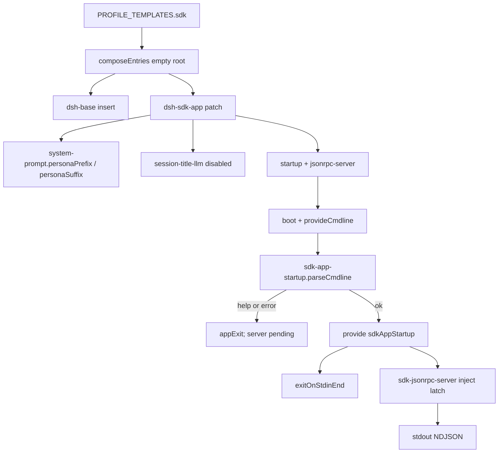

> `@deepseek-ai/dsh-sdk-app` 是叠在 `dsh-base` 上的 **stdio JSON-RPC host overlay**：改 host persona、关掉 `session-title-llm`，再 `insert` `sdk-app-startup`（提供 `sdkAppStartup`）与 `sdk-jsonrpc-server`。stdout 专给协议帧。五个 shipped profile 里 `sdk` 用本 bundle；`sdk-minimal` 复用同一 startup 插件但不叠 `dsh-base`。

DSH 是 **Cordis 组合运行时**（`profile → bundle → agent preset`）。shipped profile：`web`（`patchReload: live`）、`headless` / `sdk` / `sdk-minimal` / `acp`（`startup`）。六个 bundle：`dsh-base`、`dsh-web-app`、`dsh-headless`、`dsh-sdk-app`、`dsh-sdk-minimal`、`dsh-acp-app`。宿主入口是 `dsh web` 以及 `dsh --profile headless|sdk|sdk-minimal|acp`。JSON-RPC 方法与 transport 权威在 [`subsys.integration.sdk-server`](../integration/sdk-server.md)（`subsys.integration.sdk-server`）；本页写 overlay 行、startup latch、stdin EOF。

## 能回答的问题

- `PROFILE_TEMPLATES.sdk` 相对 `dsh-base` 多了哪一层？`insert` 只有哪两行？
- 为什么 `--help` 不启动 JSON-RPC？`inject: [sdkAppStartup, loader]` 怎样把门关上？
- `exitOnStdinEnd` 与 RPC `shutdown` 谁拥有进程退出？stdout 为什么不能打日志？
- 本 overlay 有没有 `agent-presets` / `webserver`？要不要像 web 那样 `disabled: true` 模型可见 `tool-*`？
- `sdk-minimal` 怎样复用 `dsh-sdk-app` 的 startup 行却不叠 base？

## 职责边界

本包 `@deepseek-ai/dsh-sdk-app` 拥有：mode overlay `cordis.patch.yml`、cmdline Provider `sdk-app-startup`（`SDK_APP_STARTUP_SERVICE = 'sdkAppStartup'`）。manifest 把 bundle patch 钉在 `./cordis.patch.yml`。[E: packages/bundle/sdk-app/package.json:2] [E: packages/bundle/sdk-app/package.json:33] [E: packages/bundle/sdk-app/src/index.ts:14] [E: packages/bundle/sdk-app/src/index.ts:20]

明确**不**拥有：

- 共享核心 insert（llm / session / agent / tools / sandbox / approval / 模型可见 `tool-*`）：[`subsys.composition.bundle-base`](bundle-base.md)（`subsys.composition.bundle-base`）。
- JSON-RPC 帧、`HarnessSdkJsonRpcServer`、`initialize` / `shutdown`：[`subsys.integration.sdk-server`](../integration/sdk-server.md)（`subsys.integration.sdk-server`）。本 overlay 只 `insert` 那一行并加 Loader `inject`。
- 不叠 base 的完整 SDK 树：`packages/bundle/sdk-minimal/cordis.patch.yml`（节点尚未单独成文时仍以该文件为真源）。
- profile 发现与 `composeEntries`：[`subsys.composition.app-boot`](app-boot.md)。`PROFILE_TEMPLATES.sdk` = `{ bundles: ['@deepseek-ai/dsh-base', '@deepseek-ai/dsh-sdk-app'], patchReload: 'startup' }`。[E: packages/boot/app-boot/src/profile.ts:118] [E: packages/boot/app-boot/src/profile.ts:119] [E: packages/boot/app-boot/src/profile.ts:120]
- launcher `provideCmdline` / `ctx.appExit`：[`subsys.composition.cmdline`](cmdline.md) / [`surface.cli.overview`](../../surface/cli/overview.md)。没有 `dsh sdk` 子命令。

**host 面 vs agent-preset 面。** 本 overlay **没有** `id: agent-presets`，**没有**把 base 的 `tool-*` 标 `disabled: true`。模型可见工具留在 host 全局层，与 [`subsys.composition.bundle-headless`](bundle-headless.md) 同刀、与 [`subsys.composition.bundle-web-app`](bundle-web-app.md) 相反。

## 关键文件

| 路径 | 角色 |
|---|---|
| `packages/bundle/sdk-app/package.json` | `@deepseek-ai/dsh-sdk-app`；`dsh.bundle.patch = ./cordis.patch.yml`；依赖 `dsh-sdk-jsonrpc-server`。 |
| `packages/bundle/sdk-app/cordis.patch.yml` | 叠在 base 之后：persona、`session-title-llm` disable、两行 insert。不改 `hmr`。 |
| `packages/bundle/sdk-app/src/index.ts` | Provider：`inject: ['cmdlineArgs']`，成功 parse 才 `provide('sdkAppStartup')` 并绑 stdin EOF。 |
| `packages/bundle/sdk-app/tests/startup.spec.ts` | 空 argv 发布 `{ accepted: true }`；`--help` 不 provide、不绑 EOF。 |
| `packages/bundle/sdk-app/tests/sdk-app.spec.ts` | 无 `id: hmr` overlay；`session-title-llm` disabled；server 行 inject。 |
| `packages/sdk/server/src/index.ts` | Consumer 插件：源码 `inject = ['agents']`；yaml 再要求 `sdkAppStartup` + `loader`。 |

## 数据模型

| 符号 | 落点 | 含义 |
|---|---|---|
| `SDK_APP_STARTUP_SERVICE` | `index.ts` | 字符串 `'sdkAppStartup'`。[E: packages/bundle/sdk-app/src/index.ts:20] |
| 服务值 | `index.ts` | `{ accepted: true }`。门闩，不是任务正文。[E: packages/bundle/sdk-app/src/index.ts:59] |
| `name` | `index.ts` | `'sdk-app-startup'`。[E: packages/bundle/sdk-app/src/index.ts:14] |
| `inject` | `index.ts` | `['cmdlineArgs']`。[E: packages/bundle/sdk-app/src/index.ts:17] |
| `Config.profile` | `index.ts` | `z.string().default('sdk')`。只进 help 文案。[E: packages/bundle/sdk-app/src/index.ts:30] |
| yaml `profile: sdk` | overlay | shipped `sdk` 行写死 `sdk`；`sdk-minimal` 自己的 insert 写 `sdk-minimal`。[E: packages/bundle/sdk-app/cordis.patch.yml:15] [E: packages/bundle/sdk-minimal/cordis.patch.yml:9] |
| `maxTokensAsSuccess` | overlay + server Config | 插件 schema 默认 `false`；本 overlay `!!js` 在 `DSH_MAX_TOKENS_AS_SUCCESS` unset 时为 `true`。[E: packages/sdk/server/src/index.ts:37] [E: packages/bundle/sdk-app/cordis.patch.yml:21] |

`composeEntries` 从空数组一次 `applyEntryPatches`：同 id 的键 **整键覆盖**（`target[key] = value`）。[E: packages/boot/app-boot/src/profile.ts:844] [E: vendor/include/src/index.ts:123]

## 控制流

1. `PROFILE_TEMPLATES.sdk@packages/boot/app-boot/src/profile.ts` 两元组：先 `@deepseek-ai/dsh-base`，再 `@deepseek-ai/dsh-sdk-app`，`patchReload: 'startup'`。[E: packages/boot/app-boot/src/profile.ts:118] 对照 `sdk-minimal`：**只** `['@deepseek-ai/dsh-sdk-minimal']`，不叠 base。[E: packages/boot/app-boot/src/profile.ts:122] [E: packages/boot/app-boot/src/profile.ts:123]

2. Overlay 覆盖 host `system-prompt` 的 `personaPrefix`（`You are a coding agent powered by the {{model}} model.`）与 `personaSuffix`（`Your working directory is {{cwd}}.`），**不是**旧单字段 `persona`。[E: packages/bundle/sdk-app/cordis.patch.yml:5] [E: packages/bundle/sdk-app/cordis.patch.yml:6] 默认模型仍来自 base 的 `agent-default-model`：`provider: deepseek-official` / `model: deepseek-flash`（不是 `deepseek-v4-flash`）。[E: packages/bundle/base/cordis.patch.yml:78] [E: packages/bundle/base/cordis.patch.yml:79]

3. `id: session-title-llm` `disabled: true`：stdio 上不能为标题再开一轮 LLM（会污染 stdout / 抢生命周期）。[E: packages/bundle/sdk-app/cordis.patch.yml:9] [E: packages/bundle/sdk-app/cordis.patch.yml:10] 测试钉死本文件**没有** `id: hmr` 行；HMR 已在 base 关掉。[E: packages/bundle/sdk-app/tests/sdk-app.spec.ts:23] [E: packages/bundle/sdk-app/tests/sdk-app.spec.ts:24]

4. `insert` **只有**两行：`sdk-app-startup`（`name: '@deepseek-ai/dsh-sdk-app'`，`config.profile: sdk`）与 `sdk-jsonrpc-server`（`name: '@deepseek-ai/dsh-sdk-jsonrpc-server'`，`inject: [sdkAppStartup, loader]`）。没有 `agent-presets`、`webserver`、`headless-runner`、`code-runtime` 额外行。[E: packages/bundle/sdk-app/cordis.patch.yml:12] [E: packages/bundle/sdk-app/cordis.patch.yml:13] [E: packages/bundle/sdk-app/cordis.patch.yml:18] [E: packages/bundle/sdk-app/cordis.patch.yml:19] [E: packages/bundle/sdk-app/tests/sdk-app.spec.ts:26] [E: packages/bundle/sdk-app/tests/sdk-app.spec.ts:27]

5. Launcher 在树挂上之前 `provideCmdline`：冻 `cmdlineArgs`，提供 `appExit`（以及 stdio 路径需要的 `appReady`）。[E: packages/boot/cmdline/src/index.ts:86] [E: packages/boot/cmdline/src/index.ts:87] [E: packages/boot/cmdline/src/index.ts:88] [E: packages/boot/cmdline/src/index.ts:88]

6. `apply@packages/bundle/sdk-app/src/index.ts` 建 commander，程序名 `dsh --profile ${profile}`，零位置参数、零业务旗标。action 里先 `exitOnStdinEnd(ctx, 'sdk-app.stdin')`，再 `provide('sdkAppStartup', { accepted: true })`。[E: packages/bundle/sdk-app/src/index.ts:40] [E: packages/bundle/sdk-app/src/index.ts:57] [E: packages/bundle/sdk-app/src/index.ts:58] [E: packages/bundle/sdk-app/src/index.ts:59] 然后 `parseCmdline`：help / 用法错误收成 `appExit`，action 不跑。[E: packages/bundle/sdk-app/src/index.ts:61] [E: packages/boot/cmdline/src/index.ts:184]

7. `--help` 不 provide：测试 `ctx.get(SDK_APP_STARTUP_SERVICE)` 为 `undefined`，`appExit(0)`；之后 stdin `end` **不再**追加退出码（未绑定 EOF）。[E: packages/bundle/sdk-app/tests/startup.spec.ts:59] [E: packages/bundle/sdk-app/tests/startup.spec.ts:60] [E: packages/bundle/sdk-app/tests/startup.spec.ts:63] 空 argv 则发布 `{ accepted: true }`，EOF → `exits === [0]`。[E: packages/bundle/sdk-app/tests/startup.spec.ts:51] [E: packages/bundle/sdk-app/tests/startup.spec.ts:53]

8. Loader 行 `inject: [sdkAppStartup, loader]`：服务缺失时 JSON-RPC 行保持 pending，help 路径不占 stdout。插件源码自己的 `inject` 仍是 `['agents']`；yaml 是额外 Loader 门。[E: packages/sdk/server/src/index.ts:20] [E: packages/sdk/server/src/index.ts:22] `initialize` 里再 `await ctx.get('loader')?.await()`，等 sibling 树 settle。[E: packages/sdk/server/src/index.ts:84] [E: packages/sdk/server/src/index.ts:85]

9. `exitOnStdinEnd` 缺 `appExit` / `appReady` 同步抛。EOF 后经 `appReady.onReady` 调 `exit(0)`。这是 **client 断开 / stdin 结束** 的退出路径。[E: packages/boot/cmdline/src/index.ts:123] [E: packages/boot/cmdline/src/index.ts:127] [E: packages/boot/cmdline/src/index.ts:136] RPC `shutdown` 方法则 flush、dispose root、`exit(0)`，权威在 sdk-server 插件。[E: packages/sdk/server/src/index.ts:88] [E: packages/sdk/server/src/index.ts:90]

10. `sdk-minimal` 的 insert **同样**有 `sdk-app-startup`（`name: '@deepseek-ai/dsh-sdk-app'`）和同一套 `inject: [sdkAppStartup, loader]`，但 `config.profile: sdk-minimal`，且 `maxTokensAsSuccess: false`（字面量，不吃 env）。那份文件后面才是自己的完整树，不经过 `dsh-base`。[E: packages/bundle/sdk-minimal/cordis.patch.yml:6] [E: packages/bundle/sdk-minimal/cordis.patch.yml:9] [E: packages/bundle/sdk-minimal/cordis.patch.yml:13] [E: packages/bundle/sdk-minimal/cordis.patch.yml:15]

## 设计动机

- **stdout = 协议。** overlay 文件头写明 stdout 专属 JSON-RPC；title LLM 与 HMR overlay 都不该在这条路径上往 stdout 打字。[I]
- **inject 门把 help 挡在 transport 之外。** 与 headless 的 `headlessStartup` 同模式：不 provide 则 Consumer 行 pending。
- **EOF 归 app bundle，`shutdown` 归 server 插件。** startup 绑 stdin；server 回答协议方法。换 transport 不必改 commander。
- **工具留在 host。** SDK 进程通常一对一客户端，不需要 web 那套 per-session preset isolate。

## Gotcha

- **没有 `dsh sdk` alias。** 入口是 `dsh --profile sdk`（以及 `sdk-minimal`）。
- **插件 Config 默认与 overlay 默认不一致。** 手挂 `dsh-sdk-jsonrpc-server` 而不走本 patch 时，`maxTokensAsSuccess` 是 `false`；shipped `sdk` 在 unset env 时是 `true`。
- **`sdk-minimal` 依赖本包的 startup 插件，不依赖本 bundle 的整份 patch。** 它复制 insert 行并改 `profile` / `maxTokensAsSuccess`。
- **审批仍继承 base。** 本 overlay 不改 `approval.policy`。无人值守客户端必须自己改 policy / env。
- **四个 shipped preset**（`minimal` / `standard` / `ptc` / `cordis`）不由本 bundle 挂载。

## Seam 三角

| Seam | Definition | Provider | Consumer |
|---|---|---|---|
| 组合层 `dsh-sdk-app` | 包 `@deepseek-ai/dsh-sdk-app` + `dsh.bundle.patch` | `PROFILE_TEMPLATES.sdk` 第二层 | `dsh --profile sdk`；home / `--patch` 仍可改这两行 insert |
| `sdkAppStartup` | `{ accepted: true }`；键 `'sdkAppStartup'` | `sdk-app-startup`：`inject: [cmdlineArgs]`，action 里 `provide` | yaml `sdk-jsonrpc-server` 行：`inject: [sdkAppStartup, loader]` |
| JSON-RPC 传输 | `dsh-sdk-protocol` 帧；插件 `sdk-jsonrpc-server` | `@deepseek-ai/dsh-sdk-jsonrpc-server` `apply` | TypeScript / Python SDK 客户端（[`subsys.integration.sdk-server`](../integration/sdk-server.md)） |
| 模型可见工具 | `ctx.tools` | `dsh-base` 的 `tool-*`（本 overlay **不** `disabled`） | JSON-RPC 打开的 Agent 走 host 全局 `schemas` / `execute` |
| 部署 persona | host `system-prompt` 的 `personaPrefix` / `personaSuffix` | 本 overlay 的 `id: system-prompt` | `systemPrompt.assemble`。**不是** preset `dsh-persona` 的 `prefix` / `suffix` |
| 进程退出（EOF） | `ctx.appExit` + `ctx.appReady` | launcher `provideCmdline` | `exitOnStdinEnd` 在 startup action 里绑定 |
| 进程退出（RPC shutdown） | `shutdown` 方法 | `dsh-sdk-jsonrpc-server` `disposeAndExit` | SDK 客户端发 `shutdown` |

换 Provider = 换 overlay 的 server 行或换 startup 插件，不必改 Agent 合同。换 Definition（服务名）必须同时改 yaml `inject` 与 `provide` 键。

## Sources

- packages/bundle/sdk-app/cordis.patch.yml
- packages/bundle/sdk-app/src/index.ts
- packages/bundle/sdk-app/package.json
- packages/bundle/sdk-app/tests/sdk-app.spec.ts
- packages/bundle/sdk-app/tests/startup.spec.ts
- packages/boot/app-boot/src/profile.ts
- packages/boot/cmdline/src/index.ts
- packages/bundle/base/cordis.patch.yml
- packages/bundle/sdk-minimal/cordis.patch.yml
- packages/sdk/server/src/index.ts
- vendor/include/src/index.ts

## 相关

- [`subsys.composition.bundle-base`](bundle-base.md) — 第一层 insert；本 overlay 不 disable 那些 `tool-*`。
- [`subsys.composition.bundle-headless`](bundle-headless.md) — 同样叠 base、无 roster；headless 是 one-shot argv，本包是长寿命 stdio 服务。
- [`subsys.composition.bundle-web-app`](bundle-web-app.md) — 对照：disable 模型可见行 + `agent-presets`。
- [`subsys.composition.app-boot`](app-boot.md) — `PROFILE_TEMPLATES` / `composeEntries`。
- [`subsys.composition.cmdline`](cmdline.md) — `provideCmdline` / `parseCmdline` / `exitOnStdinEnd`。
- [`spine.composition-boot`](../../spine/composition-boot.md) — `profile → bundle → preset`。
- [`subsys.integration.sdk-server`](../integration/sdk-server.md) — JSON-RPC 插件与方法。
- [`subsys.integration.sdk-protocol`](../integration/sdk-protocol.md) — 帧与类型。
- [`subsys.core.system-prompt`](../core/system-prompt.md) — host persona / `assemble`。
- [`surface.cli.overview`](../../surface/cli/overview.md) — `--profile` / `--patch`，无 `dsh sdk` alias。
