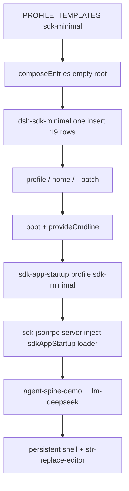

> `@deepseek-ai/dsh-sdk-minimal` 是五个 shipped profile 里**唯一不叠 `dsh-base`** 的 bundle：`PROFILE_TEMPLATES['sdk-minimal'].bundles` 只有这一包。它的 `cordis.patch.yml` 是**完整** Cordis 树（JSON-RPC + 一个 DeepSeek adapter + sandbox/pty/fs + `dsh-agent-spine-demo` + 持久 shell / str-replace-editor + JSONL sessions），不是 overlay。用户 profile / home / `--patch` 仍叠在它上面。入口是 `dsh --profile sdk-minimal`。

DSH 是 **Cordis 组合运行时**（`profile → bundle → agent preset`）。capability seam = Definition / Provider / Consumer。进入模型请求的内容必须能从 append-only session log 重建。五个 shipped profile：`web`（`patchReload: live`）与 `headless` / `sdk` / `sdk-minimal` / `acp`（`startup`）。本仓没有 shipped TUI。

## 能回答的问题

- `sdk-minimal` 为什么不出现在 `dsh-base` 之后？它和 `dsh --profile sdk`（base + `dsh-sdk-app` overlay）差在哪一层？
- 这一份 insert 一共多少 `id:`？哪些行是 JSON-RPC 宿主、哪些是模型可见工具？
- 依赖 `@deepseek-ai/dsh-sdk-app` 是不是把 **sdk-app 那份 overlay patch** 叠进来了？
- 为什么可以挂 `dsh-fs-local`，而 base 树不行？
- shell / PTY 怎样用对称 `disabled: !!js process.platform` 互斥？sandbox-policy 默认什么 mode？
- 后层 user patch 还能不能按 `id` 覆盖这些行？

## 职责边界

本包 `@deepseek-ai/dsh-sdk-minimal` 拥有：**一条**可被 `dsh.bundle.patch` 解析的根 `insert`，以及把该文件钉死在 manifest 上的合同。`name` 是 `@deepseek-ai/dsh-sdk-minimal`；`dsh.bundle.patch` 必须是 `./cordis.patch.yml`。[E: packages/bundle/sdk-minimal/package.json:2] [E: packages/bundle/sdk-minimal/package.json:38] [E: packages/bundle/sdk-minimal/tests/sdk-minimal.spec.ts:17] `src/index.ts` 只写 `export {}`，不导出 boot / factory。[E: packages/bundle/sdk-minimal/src/index.ts:9] companion `./invariant` 的 installer 是空函数：YAML 行由各包自己核。[E: packages/bundle/sdk-minimal/src/invariant.ts:18] [E: packages/bundle/sdk-minimal/src/invariant.ts:12]

本包**不**拥有：

- profile 发现、空根 `composeEntries`、`boot` — [`subsys.composition.app-boot`](app-boot.md)。模板：`PROFILE_TEMPLATES['sdk-minimal'] = { bundles: ['@deepseek-ai/dsh-sdk-minimal'], patchReload: 'startup' }`。[E: packages/boot/app-boot/src/profile.ts:154] [E: packages/boot/app-boot/src/profile.ts:155] [E: packages/boot/app-boot/src/profile.ts:156]
- 共享 86 行 host 核心（`llm` / `session` / `agent` / `agent-loop` `agents: []` / `tools` / 全套 `tool-*`）— [`subsys.composition.bundle-base`](bundle-base.md)。本树**没有**那些 `id`。
- `dsh --profile sdk` 叠在 base 上的 overlay（只插 `sdk-app-startup` `profile: sdk` + `sdk-jsonrpc-server`，并改 `system-prompt` / disable `session-title-llm`）— `packages/bundle/sdk-app/cordis.patch.yml`。本 bundle **依赖** `@deepseek-ai/dsh-sdk-app` 作为 **startup 插件包**，**不**把 sdk-app 的 overlay 当第二层 bundle。[E: packages/bundle/sdk-minimal/package.json:49] [E: packages/bundle/sdk-app/cordis.patch.yml:12] [E: packages/bundle/sdk-app/cordis.patch.yml:17]
- JSON-RPC 协议与 `HarnessSdkJsonRpcServer` 实现 — [`subsys.integration.sdk-server`](../integration/sdk-server.md)。本页只写 insert 行与 `inject` / `maxTokensAsSuccess`。
- DeepSeek adapter 内部 — [`subsys.llm.deepseek`](../llm/deepseek.md)。
- 持久 bash 工具字段 — [`surface.tools.bash-persistent`](../../surface/tools/bash-persistent.md)。
- `dsh-fs-local` Provider — [`subsys.execution.fs-local`](../execution/fs-local.md)。
- `dsh-agent-spine-demo` 内部合同（persona / skills 开关）。本页只写它作为 **host 行** 的 config。
- launcher / `ctx.appExit` — [`subsys.composition.cmdline`](cmdline.md)。没有 `dsh sdk-minimal` 子命令。

**host 面 vs agent-preset 面。** 本 bundle **没有** `id: agent-presets`。工具行（`persistent-bash` / `persistent-pwsh` / `str-replace-editor`）进 **root realm**。shipped preset 目录 `minimal` / `standard` / `ptc` / `cordis` 不在默认树上。

## 关键文件

| 路径 | 角色 |
|---|---|
| `packages/bundle/sdk-minimal/package.json` | `@deepseek-ai/dsh-sdk-minimal`；`dsh.bundle.patch`；依赖闭包 = insert 的 `name` 集合 |
| `packages/bundle/sdk-minimal/cordis.patch.yml` | 真树：一条根 `insert`，19 个 `id:` |
| `packages/bundle/sdk-minimal/src/index.ts` | 无 runtime API（`export {}`） |
| `packages/bundle/sdk-minimal/src/invariant.ts` | 空 companion：`name: sdk-minimal-bundle-invariant` |
| `packages/bundle/sdk-minimal/tests/sdk-minimal.spec.ts` | 可解析、行序、startup config、jsonrpc inject、llm / spine / 平台门、依赖闭包 |
| `packages/boot/app-boot/src/profile.ts` | `PROFILE_TEMPLATES['sdk-minimal']` 单包；`loadProfile` fail-loud |
| `packages/bundle/sdk-app/cordis.patch.yml` | 对照：普通 SDK 是 **base overlay**，不是完整树 |

`README.md` 不是 `[E]`。

## 数据模型

| 符号 / 键 | 落点 | 含义 |
|---|---|---|
| `@deepseek-ai/dsh-sdk-minimal` | npm `name` | installation-first 解析拿到这份安装。[E: packages/bundle/sdk-minimal/package.json:2] |
| `dsh.bundle.patch` | manifest | `./cordis.patch.yml`。缺了 `loadProfile` 抛 `declares no dsh.bundle`。[E: packages/bundle/sdk-minimal/package.json:38] [E: packages/boot/app-boot/src/profile.ts:833] [E: packages/boot/app-boot/src/profile.ts:834] |
| 根 `insert`（无父 `id`） | YAML 唯一顶层动作 | `applyEntryPatches` 对无 `id` 的 `insert` 做 `data.push(...insert)`。[E: packages/bundle/sdk-minimal/cordis.patch.yml:5] [E: vendor/include/src/index.ts:94] |
| `id` / `name` / `config` / `disabled` | 每行 | `config` 后写**整键覆盖**；`disabled` 可 `!!js`。[E: vendor/include/src/index.ts:123] |
| `PROFILE_TEMPLATES['sdk-minimal']` | 单包 | 其它四个 shipped 都是 `[dsh-base, <mode>]`。[E: packages/boot/app-boot/src/profile.ts:155] [E: packages/boot/app-boot/tests/profile.spec.ts:203] |
| `DEFAULT_PROFILE_BUNDLES` | 无名 profile | 仍是 `['@deepseek-ai/dsh-base']`，**不是** sdk-minimal。[E: packages/boot/app-boot/src/profile.ts:166] |

测试钉死 **恰好** 19 行，且 `Object.keys(dependencies)` 与行上 `name` 的 unique 集合相等。[E: packages/bundle/sdk-minimal/tests/sdk-minimal.spec.ts:22] [E: packages/bundle/sdk-minimal/tests/sdk-minimal.spec.ts:24] [E: packages/bundle/sdk-minimal/tests/sdk-minimal.spec.ts:70]

### 全部 `id:`（一个不漏）

| `id` | `name` | 角色 |
|---|---|---|
| `sdk-app-startup` | `@deepseek-ai/dsh-sdk-app` | stdio 生命周期；`config.profile: sdk-minimal`（对照 sdk overlay 写 `sdk`）[E: packages/bundle/sdk-minimal/cordis.patch.yml:9] [E: packages/bundle/sdk-minimal/tests/sdk-minimal.spec.ts:45] |
| `sdk-jsonrpc-server` | `@deepseek-ai/dsh-sdk-jsonrpc-server` | `inject: [sdkAppStartup, loader]`；`maxTokensAsSuccess: false`（对照 sdk overlay 吃 `DSH_MAX_TOKENS_AS_SUCCESS`，默认 true）[E: packages/bundle/sdk-minimal/cordis.patch.yml:13] [E: packages/bundle/sdk-minimal/cordis.patch.yml:15] [E: packages/bundle/sdk-app/cordis.patch.yml:21] |
| `deepseek-llm-api-extensions` | `@deepseek-ai/dsh-deepseek-llm-api-extensions` | 官方请求顶层字段注册表 |
| `session-log-deepseek` | `@deepseek-ai/dsh-session-log-deepseek` | DeepSeek 方言投影 |
| `plugin-package-inventory-deepseek` | `@deepseek-ai/dsh-plugin-package-inventory-deepseek` | 插件包清单 |
| `llm-deepseek` | `@deepseek-ai/dsh-llm-deepseek` | 唯一 LLM adapter：`apiKeyEnv: DEEPSEEK_API_KEY`；`defaultContextWindow` 读 `DSH_CONTEXT_WINDOW` 默认 `1000000`；`streamIdleTimeoutMs: 172800000` [E: packages/bundle/sdk-minimal/cordis.patch.yml:29] [E: packages/bundle/sdk-minimal/cordis.patch.yml:30] |
| `sandbox` | `@deepseek-ai/dsh-sandbox-local` | 本地 sandbox Provider |
| `session-projection` | `@deepseek-ai/dsh-session-projection` | 投影注册表（sandbox-policy / terminal-bash 硬 inject）[E: packages/bundle/sdk-minimal/cordis.patch.yml:38] |
| `sandbox-policy` | `@deepseek-ai/dsh-sandbox-policy` | `mode: danger-full-access`；`workspaceRoot: !!js process.cwd()` [E: packages/bundle/sdk-minimal/cordis.patch.yml:44] |
| `subprocess` | `@deepseek-ai/dsh-subprocess-local` | 本地 subprocess |
| `pty` | `@deepseek-ai/dsh-terminal` | PTY 服务 |
| `terminal-bash` | `@deepseek-ai/dsh-terminal-bash` | POSIX：`disabled` 当 `win32`；`timeoutMs: 300000` [E: packages/bundle/sdk-minimal/cordis.patch.yml:55] |
| `terminal-pwsh` | `@deepseek-ai/dsh-terminal-bash` | Windows：`shellDialect: pwsh`；`disabled` 当 **非** `win32` [E: packages/bundle/sdk-minimal/cordis.patch.yml:61] [E: packages/bundle/sdk-minimal/cordis.patch.yml:63] |
| `fs-local` | `@deepseek-ai/dsh-fs-local` | 裸本地 fs；`cwd: !!js process.cwd()`。base 树已有 `fs-sandbox` 时不可并列 [E: packages/bundle/sdk-minimal/cordis.patch.yml:69] |
| `agent-spine` | `@deepseek-ai/dsh-agent-spine-demo` | 最小 spine：关 harness identity / runtime context / workspace context / skills；`toolBash` / `toolJobs` false；persona 读 `DSH_SYSTEM_PROMPT` [E: packages/bundle/sdk-minimal/cordis.patch.yml:76] [E: packages/bundle/sdk-minimal/cordis.patch.yml:78] [E: packages/bundle/sdk-minimal/cordis.patch.yml:82] |
| `persistent-bash` | `@deepseek-ai/dsh-tool-bash-persistent` | 模型可见持久 bash；`win32` 上 disabled [E: packages/bundle/sdk-minimal/cordis.patch.yml:88] |
| `persistent-pwsh` | `@deepseek-ai/dsh-tool-pwsh-persistent` | 模型可见持久 pwsh；非 `win32` 上 disabled [E: packages/bundle/sdk-minimal/cordis.patch.yml:103] |
| `str-replace-editor` | `@deepseek-ai/dsh-tool-str-replace-editor` | 编辑器；`maxOutputChars: 16000` [E: packages/bundle/sdk-minimal/cordis.patch.yml:117] |
| `sessions` | `@deepseek-ai/dsh-session-persistence-jsonl` | JSONL 根 `dshHomePath('sessions')`；`compression: none` [E: packages/bundle/sdk-minimal/cordis.patch.yml:122] |

**没有** `id: llm`（`dsh-llm` Definition 行）、**没有** `id: agent-loop`、**没有** `id: tools`、**没有** one-shot `tool-bash`、**没有** `llm-pi-ai`、**没有** `webserver` / `agent-presets`。

## 控制流

1. **单包模板。** `PROFILE_TEMPLATES@packages/boot/app-boot/src/profile.ts` 把 `sdk-minimal` 写成只有 `@deepseek-ai/dsh-sdk-minimal`，`patchReload: 'startup'`。[E: packages/boot/app-boot/src/profile.ts:154] [E: packages/boot/app-boot/tests/profile.spec.ts:203] `web` / `headless` / `sdk` / `acp` 都以 `@deepseek-ai/dsh-base` 开头。[E: packages/boot/app-boot/src/profile.ts:139] [E: packages/boot/app-boot/src/profile.ts:143] [E: packages/boot/app-boot/src/profile.ts:151]

2. **`composeEntries` 从空数组叠层。** launcher `allPatches` 顺序是 `bundlePatches → profile.patches → homePatches → overlays`。[E: apps/cli/src/profile-boot.ts:137] 对本 profile，bundle 层只有这一份 insert。无父 `id` 的 `insert` 走 `data.push(...insert)`，再 `buildMap` 让**同一 flattened 列表里后写的 patch** 能按 `id` 改刚插的行。[E: vendor/include/src/index.ts:94] [E: vendor/include/src/index.ts:101]

3. **依赖 sdk-app 包 ≠ 叠 sdk-app bundle。** `PROFILE_TEMPLATES.sdk` 是 `[dsh-base, dsh-sdk-app]`。[E: packages/boot/app-boot/src/profile.ts:150] [E: packages/boot/app-boot/src/profile.ts:151] sdk-app 的 patch 是对 **已存在** `system-prompt` / `session-title-llm` 的 id-target，再 insert 两行。[E: packages/bundle/sdk-app/cordis.patch.yml:3] [E: packages/bundle/sdk-app/cordis.patch.yml:8] 若把那份 overlay 单独当第一层，id-target 会 `entry not found`。sdk-minimal 自己写完整 insert，并把 startup 行的 `profile` 写成 `sdk-minimal`。[E: packages/bundle/sdk-minimal/cordis.patch.yml:9]

4. **JSON-RPC 门。** `sdk-jsonrpc-server` 等 `sdkAppStartup` 与 `loader` 齐了才 mount。[E: packages/bundle/sdk-minimal/cordis.patch.yml:13] 测试钉 `maxTokensAsSuccess: false`。[E: packages/bundle/sdk-minimal/tests/sdk-minimal.spec.ts:48]

5. **平台互斥。** `terminal-bash` / `persistent-bash`：`disabled: !!js process.platform === 'win32'`；`terminal-pwsh` / `persistent-pwsh`：倒置。[E: packages/bundle/sdk-minimal/cordis.patch.yml:55] [E: packages/bundle/sdk-minimal/cordis.patch.yml:61] [E: packages/bundle/sdk-minimal/cordis.patch.yml:88] [E: packages/bundle/sdk-minimal/cordis.patch.yml:103] 两份 terminal 的 `name` 都是 `@deepseek-ai/dsh-terminal-bash`；Windows 行靠 `shellDialect: pwsh` 区分。[E: packages/bundle/sdk-minimal/cordis.patch.yml:60] [E: packages/bundle/sdk-minimal/cordis.patch.yml:63]

6. **fs-local 合法，正因为不叠 base。** base 的 `fs-sandbox` 已经 `provide` `ctx.fs`；并列 `dsh-fs-local` 会撞名。本树没有 `fs-sandbox`，editor 走裸本地盘；注释写明持久 bash 仍消费上面的 `danger-full-access` policy。[E: packages/bundle/sdk-minimal/cordis.patch.yml:68] [E: packages/bundle/sdk-minimal/cordis.patch.yml:44]

7. **缺 `dsh.bundle` 仍 fail-loud。** `loadProfile` 读到的 bundle `package.json` 没有 `dsh.bundle.patch` 就抛，不会当「无补丁」。[E: packages/boot/app-boot/src/profile.ts:833] [E: packages/boot/app-boot/src/profile.ts:834]

## 设计动机

普通 SDK 要整份 host 面（approval / subagent backends / 全套 `tool-*` / `llm-pi-ai` 零 route），所以叠 `dsh-base` 再 overlay JSON-RPC。`sdk-minimal` 是给「stdio JSON-RPC + 一个 adapter + 持久 shell + 编辑器」的嵌入面：复制一份短树，比 disable 掉 80 行更不容易把 Web/headless 缝带进来。

`dsh-sdk-app` 仍复用为 startup 插件，避免再写一份 cmdline 解析；bundle 层不引用 sdk-app 的 **patch 文件**，以免 id-target 打空。

`danger-full-access` + 裸 `fs-local` 是嵌入默认：没有 GUI approval 队列。后层 user patch 仍可按 `id` 改 `sandbox-policy.mode`。

## Gotcha

- **不要把 `dsh-base` 加进这个 profile 的 `bundles`。** 会把 `ctx.fs` / `ctx.llm` 定义行与本树的 `fs-local` / `llm-deepseek` 叠在一起，load 期撞名。
- **依赖闭包测试要求 `dependencies` 的 key 集合 = insert `name` 集合。** 多一个 workspace 依赖、少一个行上的包都会红。[E: packages/bundle/sdk-minimal/tests/sdk-minimal.spec.ts:70]
- **`id: sessions` 不是 base 的 `session-persistence-jsonl`。** 寻址后层 patch 必须用本树的 id。
- **没有 `agent-default-model` 行。** 默认 `deepseek-official` / `deepseek-v4-flash` 是 **base** 合同；本树不要从 yaml 臆造那对键。
- **dump 不求值 `!!js`。** `dsh --profile sdk-minimal --dump-config` 看见表达式，不是这台机器上 bash 还是 pwsh。
- **waterfall / isolate：** 本 bundle 自己不是 waterfall 插件，也没有 `agent-presets`，默认走不到 `leakedServices`。

## Seam 三角

| 角色 | 落点 | ctx 键 / bundle 行 |
|---|---|---|
| **Definition** | 各能力合同包（`dsh-llm` / `dsh-session` / `dsh-agent` / `dsh-tools`）**不**作为独立 `id` 出现在本 yaml。spine-demo 与 jsonrpc-server 在自己的包里声明消费面 | 本页不权威那些 `ctx.*` 符号；见 [`spine.capability-seams`](../../spine/capability-seams.md) |
| **Provider** | 本 insert：`llm-deepseek`；`sandbox-local` + `sandbox-policy`；`dsh-terminal` + 平台互斥 `terminal-bash`/`terminal-pwsh`；`subprocess-local`；`fs-local`；`session-persistence-jsonl`；`sdk-jsonrpc-server` | **host 面** root realm，无 `isolate`。[E: packages/bundle/sdk-minimal/cordis.patch.yml:26] [E: packages/bundle/sdk-minimal/cordis.patch.yml:33] [E: packages/bundle/sdk-minimal/cordis.patch.yml:69] |
| **Consumer** | `persistent-bash` / `persistent-pwsh` / `str-replace-editor`（模型可见）；`sdk-jsonrpc-server` 消费 `sdkAppStartup`；`agent-spine` 消费 adapter + tools | 留在 host 全局层，没有 web 那种 `disabled: true` + preset remount。[E: packages/bundle/sdk-minimal/cordis.patch.yml:85] [E: packages/bundle/sdk-minimal/cordis.patch.yml:114] |

换 DeepSeek 路由 = 后层 patch `id: llm-deepseek`。把 `fs-local` 换成 `fs-sandbox` 必须先有一份不撞名的 `ctx.fs` Provider 策略；本树默认不那么做。

## Sources

- packages/bundle/sdk-minimal/cordis.patch.yml
- packages/bundle/sdk-minimal/package.json
- packages/bundle/sdk-minimal/src/index.ts
- packages/bundle/sdk-minimal/src/invariant.ts
- packages/bundle/sdk-minimal/tests/sdk-minimal.spec.ts
- packages/boot/app-boot/src/profile.ts
- packages/boot/app-boot/tests/profile.spec.ts
- apps/cli/src/profile-boot.ts
- packages/bundle/sdk-app/cordis.patch.yml
- packages/bundle/sdk-app/package.json
- vendor/include/src/index.ts

## 相关

- [spine.composition-boot](../../spine/composition-boot.md)（`spine.composition-boot`）：profile → bundle 叠层。
- [subsys.composition.bundle-base](bundle-base.md)（`subsys.composition.bundle-base`）：本 profile **不**叠的那 86 行。
- [subsys.composition.app-boot](app-boot.md)（`subsys.composition.app-boot`）：`PROFILE_TEMPLATES` / `loadProfile`。
- [subsys.composition.cmdline](cmdline.md)（`subsys.composition.cmdline`）：`provideCmdline` / `appExit`。
- [subsys.composition.bundle-headless](bundle-headless.md)（`subsys.composition.bundle-headless`）：对照「叠 base、无 roster」的另一 mode。
- [spine.capability-seams](../../spine/capability-seams.md)（`spine.capability-seams`）：Definition / Provider / Consumer。
- [subsys.integration.sdk-server](../integration/sdk-server.md)（`subsys.integration.sdk-server`）：JSON-RPC 服务插件。
- [subsys.llm.deepseek](../llm/deepseek.md)（`subsys.llm.deepseek`）：`llm-deepseek` adapter。
- [surface.tools.bash-persistent](../../surface/tools/bash-persistent.md)（`surface.tools.bash-persistent`）：持久 bash 工具。
- [subsys.execution.fs-local](../execution/fs-local.md)（`subsys.execution.fs-local`）：裸本地 fs。
- [surface.cli.overview](../../surface/cli/overview.md)（`surface.cli.overview`）：`dsh --profile`。
