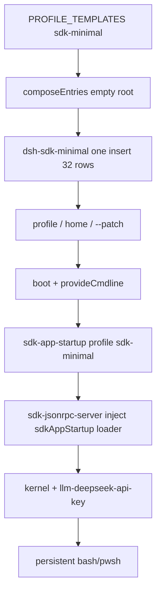

> `@deepseek-ai/dsh-sdk-minimal` 是五个 shipped profile 里**唯一不叠 `dsh-base`** 的 bundle：`PROFILE_TEMPLATES['sdk-minimal'].bundles` 只有这一包。它的 `cordis.patch.yml` 是**完整** Cordis 树（JSON-RPC + 一个 DeepSeek adapter + sandbox/pty + 显式 kernel 行 + 持久 shell + JSONL sessions），不是 overlay。用户 profile / home / `--patch` 仍叠在它上面。入口是 `dsh --profile sdk-minimal`（或位置参数缩写 `dsh sdk-minimal`）。

DSH 是 **Cordis 组合运行时**（`profile → bundle → agent preset`）。capability seam = Definition / Provider / Consumer。进入模型请求的内容必须能从 append-only session log 重建。五个 shipped profile：`web` / `headless` / `sdk` / `sdk-minimal` / `acp`。本仓没有 shipped TUI。`desktop` 不在 `PROFILE_TEMPLATES`。

## 能回答的问题

- `sdk-minimal` 为什么不出现在 `dsh-base` 之后？它和 `dsh --profile sdk`（base + `dsh-sdk-app` overlay）差在哪一层？
- 这一份 insert 一共多少 `id:`？哪些行是 JSON-RPC 宿主、哪些是模型可见工具？
- 依赖 `@deepseek-ai/dsh-sdk-app` 是不是把 **sdk-app 那份 overlay patch** 叠进来了？有没有 `load_workspace_dependencies`？
- 本树还挂不挂 `dsh-fs-local` / `str-replace-editor` / web-app preset patch？
- shell / PTY 怎样用对称 `disabled: !!js process.platform` 互斥？sandbox-policy 默认什么 mode？
- 后层 user patch 还能不能按 `id` 覆盖这些行？

## 职责边界

本包 `@deepseek-ai/dsh-sdk-minimal` 拥有：**一条**可被 `dsh.bundle.patch` 解析的根 `insert`，以及把该文件钉死在 manifest 上的合同。`name` 是 `@deepseek-ai/dsh-sdk-minimal`；`dsh.bundle.patch` 必须是 **单一** `./cordis.patch.yml`（没有 `presets/*.patch.yml`）。 [E: packages/bundle/sdk-minimal/package.json:2] [E: packages/bundle/sdk-minimal/package.json:33] [E: packages/bundle/sdk-minimal/tests/sdk-minimal.spec.ts:21] `src/index.ts` 只写 `export {}`，不导出 boot / factory。 [E: packages/bundle/sdk-minimal/src/index.ts:9] YAML 行由各包自己核。

本包**不**拥有：

- profile 发现、空根 `composeEntries`、`boot` — [`subsys.composition.app-boot`](app-boot.md)。模板：`PROFILE_TEMPLATES['sdk-minimal'] = { bundles: ['@deepseek-ai/dsh-sdk-minimal'] }`。 [E: packages/boot/app-boot/src/profile.ts:192] [E: packages/boot/app-boot/src/profile.ts:193] [E: packages/boot/app-boot/tests/profile.spec.ts:351]
- 共享 host 核心（`llm` / `session` / `agent` / `agent-loop` `agents: []` / `tools` / 全套 `tool-*`）— [`subsys.composition.bundle-base`](bundle-base.md)。本树**没有**那些 `id`。
- `dsh --profile sdk` 叠在 base 上的 overlay（插 `sdk-app-startup` `profile: sdk` + `sdk-jsonrpc-server`，并改 `system-prompt` / disable `session-title-llm` / 挂 `workspace-dependencies`）— [`subsys.composition.bundle-sdk-app`](bundle-sdk-app.md)。本 bundle **依赖** `@deepseek-ai/dsh-sdk-app` 作为 **startup 插件包**，**不**把 sdk-app 的 overlay 当第二层 bundle。 [E: packages/bundle/sdk-minimal/package.json:51] [E: packages/bundle/sdk-app/cordis.patch.yml:13] [E: packages/bundle/sdk-app/cordis.patch.yml:18]
- JSON-RPC 协议与 `HarnessSdkJsonRpcServer` 实现 — [`subsys.integration.sdk-server`](../integration/sdk-server.md)。
- DeepSeek adapter 内部 — [`subsys.llm.deepseek`](../llm/deepseek.md)。
- 持久 bash 工具字段 — [`surface.tools.bash-persistent`](../../surface/tools/bash-persistent.md)。
- `dsh-fs-local` Provider — [`subsys.execution.fs-local`](../execution/fs-local.md)。
- launcher / `ctx.appExit` — [`subsys.composition.cmdline`](cmdline.md)。

**host 面 vs agent-preset 面。** 本 bundle **没有** `id: agent-preset-registry`。模型可见工具只剩 `persistent-bash` / `persistent-pwsh`，进 **root realm**。shipped preset 声明 `minimal` / `standard` / `ptc` / `cordis` 不在默认树上。

## 关键文件

| 路径 | 角色 |
|---|---|
| `packages/bundle/sdk-minimal/package.json` | `@deepseek-ai/dsh-sdk-minimal`；`dsh.bundle.patch`；依赖闭包 = insert 的 `name` 集合 |
| `packages/bundle/sdk-minimal/cordis.patch.yml` | 真树：一条根 `insert`，32 个 `id:` |
| `packages/bundle/sdk-minimal/src/index.ts` | 无 runtime API（`export {}`） |
| `packages/bundle/sdk-minimal/tests/sdk-minimal.spec.ts` | 可解析、行序、startup config、jsonrpc inject、llm / kernel / 平台门、依赖闭包 |
| `packages/boot/app-boot/src/profile.ts` | `PROFILE_TEMPLATES['sdk-minimal']` 单包；未知名 fail-loud |
| `packages/bundle/sdk-app/cordis.patch.yml` | 对照：普通 SDK 是 **base overlay**，不是完整树 |

`README.md` 不是 `[E]`。

## 数据模型

| 符号 / 键 | 落点 | 含义 |
|---|---|---|
| `@deepseek-ai/dsh-sdk-minimal` | npm `name` | installation-first 解析拿到这份安装。 [E: packages/bundle/sdk-minimal/package.json:2] |
| `dsh.bundle.patch` | manifest | `./cordis.patch.yml`。缺了 `loadProfileDirectory` 把该 bundle 记进 `skippedBundles`，不打断整次 load。 [E: packages/bundle/sdk-minimal/package.json:33] [E: packages/boot/app-boot/src/profile.ts:670] [E: packages/boot/app-boot/src/profile.ts:680] |
| 根 `insert`（无父 `id`） | YAML 唯一顶层动作 | `applyEntryPatches` 对无 `id` 的 `insert` 做 `data.push(...insert)`。 [E: packages/bundle/sdk-minimal/cordis.patch.yml:5] [E: vendor/include/src/index.ts:93] |
| `id` / `name` / `config` / `disabled` | 每行 | `config` 后写**整键覆盖**；`disabled` 可 `!!js`。 [E: vendor/include/src/index.ts:120] |
| `PROFILE_TEMPLATES['sdk-minimal']` | 单包 | 其它四个 shipped 都是 `[dsh-base, <mode>]`。 [E: packages/boot/app-boot/src/profile.ts:193] [E: packages/boot/app-boot/tests/profile.spec.ts:351] |
| `DEFAULT_PROFILE_BUNDLES` | 无名 profile | 仍是 `['@deepseek-ai/dsh-base']`，**不是** sdk-minimal。 [E: packages/boot/app-boot/src/profile.ts:203] |

测试钉死 insert 行序（32 行），且 `Object.keys(dependencies)` 与行上 `name` 的 unique 集合相等。 [E: packages/bundle/sdk-minimal/tests/sdk-minimal.spec.ts:28] [E: packages/bundle/sdk-minimal/tests/sdk-minimal.spec.ts:85]

### 全部 `id:`（一个不漏）

| `id` | `name` | 角色 |
|---|---|---|
| `sdk-app-startup` | `@deepseek-ai/dsh-sdk-app` | stdio 生命周期；`config.profile: sdk-minimal`（对照 sdk overlay 写 `sdk`） [E: packages/bundle/sdk-minimal/cordis.patch.yml:9] [E: packages/bundle/sdk-minimal/tests/sdk-minimal.spec.ts:62] |
| `sdk-jsonrpc-server` | `@deepseek-ai/dsh-sdk-jsonrpc-server` | `inject: [sdkAppStartup, loader]`；`maxTokensAsSuccess: false`（对照 sdk overlay 吃 `DSH_MAX_TOKENS_AS_SUCCESS`，默认 true） [E: packages/bundle/sdk-minimal/cordis.patch.yml:13] [E: packages/bundle/sdk-minimal/cordis.patch.yml:15] [E: packages/bundle/sdk-app/cordis.patch.yml:22] |
| `deepseek-llm-api-extensions` | `@deepseek-ai/dsh-deepseek-llm-api-extensions` | 官方请求顶层字段注册表 |
| `session-log-deepseek` | `@deepseek-ai/dsh-session-log-deepseek` | DeepSeek 方言投影 |
| `plugin-package-inventory-deepseek` | `@deepseek-ai/dsh-plugin-package-inventory-deepseek` | 插件包清单 |
| `llm-deepseek` | `@deepseek-ai/dsh-llm-deepseek-api-key` | 唯一 LLM adapter：`apiKeyEnv: DEEPSEEK_API_KEY`；`defaultContextWindow` 读 `DSH_CONTEXT_WINDOW` 默认 `1000000`；`streamIdleTimeoutMs: 172800000` [E: packages/bundle/sdk-minimal/cordis.patch.yml:27] [E: packages/bundle/sdk-minimal/cordis.patch.yml:29] [E: packages/bundle/sdk-minimal/tests/sdk-minimal.spec.ts:34] |
| `sandbox` | `@deepseek-ai/dsh-sandbox-local` | 本地 sandbox Provider |
| `session-projection` | `@deepseek-ai/dsh-session-projection` | 投影注册表（sandbox-policy / terminal-bash 硬 inject） [E: packages/bundle/sdk-minimal/cordis.patch.yml:38] |
| `sandbox-policy` | `@deepseek-ai/dsh-sandbox-policy` | `mode: danger-full-access`；`workspaceRoot: !!js process.cwd()` [E: packages/bundle/sdk-minimal/cordis.patch.yml:44] |
| `subprocess` | `@deepseek-ai/dsh-subprocess-local` | 本地 subprocess |
| `pty` | `@deepseek-ai/dsh-terminal` | PTY 服务 |
| `terminal-bash` | `@deepseek-ai/dsh-terminal-bash` | POSIX：`disabled` 当 `win32`；`timeoutMs: 300000` [E: packages/bundle/sdk-minimal/cordis.patch.yml:55] |
| `terminal-pwsh` | `@deepseek-ai/dsh-terminal-bash` | Windows：`shellDialect: pwsh`；`disabled` 当 **非** `win32` [E: packages/bundle/sdk-minimal/cordis.patch.yml:61] [E: packages/bundle/sdk-minimal/cordis.patch.yml:63] |
| `timer` | `@deepseek-ai/cordis-plugin-timer` | 显式 kernel 行 [E: packages/bundle/sdk-minimal/cordis.patch.yml:68] |
| `llm` | `@deepseek-ai/dsh-llm` | Definition 行 [E: packages/bundle/sdk-minimal/cordis.patch.yml:71] |
| `session` | `@deepseek-ai/dsh-session` | [E: packages/bundle/sdk-minimal/cordis.patch.yml:74] |
| `session-title` | `@deepseek-ai/dsh-session-title` | [E: packages/bundle/sdk-minimal/cordis.patch.yml:77] |
| `system-prompt` | `@deepseek-ai/dsh-system-prompt` | 关 harness identity / runtime context；`personaPrefix` 读 `DSH_SYSTEM_PROMPT` [E: packages/bundle/sdk-minimal/cordis.patch.yml:84] [E: packages/bundle/sdk-minimal/cordis.patch.yml:89] |
| `tools` | `@deepseek-ai/dsh-tools` | [E: packages/bundle/sdk-minimal/cordis.patch.yml:91] |
| `mcp-resources` | `@deepseek-ai/dsh-mcp-resources` | MCP 资源缝 [E: packages/bundle/sdk-minimal/cordis.patch.yml:94] [E: packages/bundle/sdk-minimal/tests/sdk-minimal.spec.ts:48] |
| `agent` | `@deepseek-ai/dsh-agent` | [E: packages/bundle/sdk-minimal/cordis.patch.yml:97] |
| `llm-retry` | `@deepseek-ai/dsh-llm-retry` | [E: packages/bundle/sdk-minimal/cordis.patch.yml:100] |
| `jobs` | `@deepseek-ai/dsh-jobs-local` | [E: packages/bundle/sdk-minimal/cordis.patch.yml:103] |
| `invariants` | `@deepseek-ai/dsh-invariants` | [E: packages/bundle/sdk-minimal/cordis.patch.yml:106] |
| `session-invariant` | `@deepseek-ai/dsh-session/invariant` | [E: packages/bundle/sdk-minimal/cordis.patch.yml:109] |
| `agent-invariant` | `@deepseek-ai/dsh-agent/invariant` | [E: packages/bundle/sdk-minimal/cordis.patch.yml:112] |
| `scope-invariant` | `@deepseek-ai/dsh-scope/invariant` | [E: packages/bundle/sdk-minimal/cordis.patch.yml:115] |
| `agent-loop-invariant` | `@deepseek-ai/dsh-agent-loop/invariant` | [E: packages/bundle/sdk-minimal/cordis.patch.yml:118] |
| `agent-loop` | `@deepseek-ai/dsh-agent-loop` | `agents: []` [E: packages/bundle/sdk-minimal/cordis.patch.yml:121] [E: packages/bundle/sdk-minimal/cordis.patch.yml:124] |
| `persistent-bash` | `@deepseek-ai/dsh-tool-bash-persistent` | 模型可见持久 bash；`win32` 上 disabled [E: packages/bundle/sdk-minimal/cordis.patch.yml:126] |
| `persistent-pwsh` | `@deepseek-ai/dsh-tool-pwsh-persistent` | 模型可见持久 pwsh；非 `win32` 上 disabled [E: packages/bundle/sdk-minimal/cordis.patch.yml:140] |
| `sessions` | `@deepseek-ai/dsh-session-persistence-jsonl` | JSONL 根 `dshHomePath('sessions')`；`compression: none` [E: packages/bundle/sdk-minimal/cordis.patch.yml:156] |

**没有** one-shot `tool-bash`、**没有** `llm-pi-ai`、**没有** `webserver` / `agent-preset-registry`、**没有** `hmr`、**没有** `workspace-dependencies` / `load_workspace_dependencies`。`dsh-agent-spine-demo` 已删除。

## 控制流

```mermaid
flowchart TD
  tmpl["PROFILE_TEMPLATES sdk-minimal"] --> compose["composeEntries empty root"]
  compose --> insert["dsh-sdk-minimal one insert 32 rows"]
  insert --> user["profile / home / --patch"]
  user --> boot["boot + provideCmdline"]
  boot --> startup["sdk-app-startup profile sdk-minimal"]
  startup --> rpc["sdk-jsonrpc-server inject sdkAppStartup loader"]
  rpc --> spine["kernel + llm-deepseek-api-key"]
  spine --> tools["persistent bash/pwsh"]
```

1. **单包模板。** `PROFILE_TEMPLATES@packages/boot/app-boot/src/profile.ts` 把 `sdk-minimal` 写成只有 `@deepseek-ai/dsh-sdk-minimal`。 [E: packages/boot/app-boot/src/profile.ts:192] [E: packages/boot/app-boot/tests/profile.spec.ts:351] `web` / `headless` / `sdk` / `acp` 都以 `@deepseek-ai/dsh-base` 开头。 [E: packages/boot/app-boot/src/profile.ts:181] [E: packages/boot/app-boot/src/profile.ts:184] [E: packages/boot/app-boot/src/profile.ts:187] [E: packages/boot/app-boot/src/profile.ts:190]

2. **`composeEntries` 从空数组叠层。** launcher `readProfilePatches` 顺序是 bundles → profile patch → home patch → `--patch` → telemetry。 [E: packages/boot/app-boot/src/profile-context.ts:66] 对本 profile，bundle 层只有这一份 insert。无父 `id` 的 `insert` 走 `data.push(...insert)`，再 `buildMap` 让**同一 flattened 列表里后写的 patch** 能按 `id` 改刚插的行。 [E: vendor/include/src/index.ts:93] [E: vendor/include/src/index.ts:100]

3. **依赖 sdk-app 包 ≠ 叠 sdk-app bundle。** `PROFILE_TEMPLATES.sdk` 是 `[dsh-base, dsh-sdk-app]`。 [E: packages/boot/app-boot/src/profile.ts:189] [E: packages/boot/app-boot/src/profile.ts:190] sdk-app 的 patch 是对 **已存在** `system-prompt` / `session-title-llm` 的 id-target，再 insert startup / jsonrpc / `workspace-dependencies`。 [E: packages/bundle/sdk-app/cordis.patch.yml:3] [E: packages/bundle/sdk-app/cordis.patch.yml:12] 若把那份 overlay 单独当第一层，id-target 会 `entry not found`。sdk-minimal 自己写完整 insert，并把 startup 行的 `profile` 写成 `sdk-minimal`。 [E: packages/bundle/sdk-minimal/cordis.patch.yml:9]

4. **JSON-RPC 门。** `sdk-jsonrpc-server` 等 `sdkAppStartup` 与 `loader` 齐了才 mount。 [E: packages/bundle/sdk-minimal/cordis.patch.yml:13] 测试钉 `maxTokensAsSuccess: false`。 [E: packages/bundle/sdk-minimal/tests/sdk-minimal.spec.ts:65]

5. **平台互斥。** `terminal-bash` / `persistent-bash`：`disabled: !!js process.platform === 'win32'`；`terminal-pwsh` / `persistent-pwsh`：倒置。 [E: packages/bundle/sdk-minimal/cordis.patch.yml:55] [E: packages/bundle/sdk-minimal/cordis.patch.yml:61] [E: packages/bundle/sdk-minimal/cordis.patch.yml:128] [E: packages/bundle/sdk-minimal/cordis.patch.yml:142] 两份 terminal 的 `name` 都是 `@deepseek-ai/dsh-terminal-bash`；Windows 行靠 `shellDialect: pwsh` 区分。 [E: packages/bundle/sdk-minimal/cordis.patch.yml:60] [E: packages/bundle/sdk-minimal/cordis.patch.yml:63]

6. **不挂 `fs-local`，也不挂 `str-replace-editor`。** 模型可见工具只剩平台互斥的持久 shell。本树也没有 `fs-sandbox`；持久 bash 仍消费上面的 `danger-full-access` policy。 [E: packages/bundle/sdk-minimal/cordis.patch.yml:44]

7. **缺 `dsh.bundle` 记 skip，未知 profile 名仍 fail-loud。** `loadProfile` 对不在 `PROFILE_TEMPLATES` 的缺目录名抛错；已解析到的 bundle 若 `package.json` 没有 `dsh.bundle`，进入 `skippedBundles`。 [E: packages/boot/app-boot/src/profile.ts:711] [E: packages/boot/app-boot/src/profile.ts:670] [E: packages/boot/app-boot/src/profile.ts:680]

## 设计动机

普通 SDK 要整份 host 面（approval / subagent backends / 全套 `tool-*` / `llm-pi-ai` 零 route），所以叠 `dsh-base` 再 overlay JSON-RPC。`sdk-minimal` 是给「stdio JSON-RPC + 一个 adapter + 持久 shell」的嵌入面：复制一份短树，比 disable 掉 90 行更不容易把 Web/headless 缝带进来。

`dsh-sdk-app` 仍复用为 startup 插件，避免再写一份 cmdline 解析；bundle 层不引用 sdk-app 的 **patch 文件**，以免 id-target 打空，也避免把 `load_workspace_dependencies` 拖进最小树。

`danger-full-access` 是嵌入默认：没有 GUI approval 队列。后层 user patch 仍可按 `id` 改 `sandbox-policy.mode`。

## Gotcha

- **不要把 `dsh-base` 加进这个 profile 的 `bundles`。** 会把 `ctx.llm` 定义行与本树的 `llm-deepseek` 叠在一起，load 期撞名。
- **依赖闭包测试要求 `dependencies` 的 key 集合 = insert `name` 集合。** 多一个 workspace 依赖、少一个行上的包都会红。 [E: packages/bundle/sdk-minimal/tests/sdk-minimal.spec.ts:85]
- **`id: sessions` 不是 base 的 `session-persistence-jsonl`。** 寻址后层 patch 必须用本树的 id。
- **没有 `agent-default-model` 行。** base 合同现为 `deepseek-official` / **`deepseek-flash`**；本树不要从 yaml 臆造那对键。
- **`llm-deepseek` 的 `name` 是 `@deepseek-ai/dsh-llm-deepseek-api-key`，不是旧的 `dsh-llm-deepseek`。**
- **dump 不求值 `!!js`。** `dsh --profile sdk-minimal --dump-config` 看见表达式，不是这台机器上 bash 还是 pwsh。
- **waterfall / isolate：** 本 bundle 自己不是 waterfall 插件，也没有 `agent-preset-registry`，默认走不到 `leakedServices`。
- **没有 `hmr` 行。** 对照 base-backed 的 headless / sdk / acp（overlay 把 base 的 `hmr` `disabled: true`），本树根本不插 HMR。

## Seam 三角

| 角色 | 落点 | ctx 键 / bundle 行 |
|---|---|---|
| **Definition** | 各能力合同包（`dsh-llm` / `dsh-session` / `dsh-agent` / `dsh-tools`）作为独立 `id` 出现在本 yaml；jsonrpc-server 在自己的包里声明消费面 | 本页不权威那些 `ctx.*` 符号；见 [`spine.capability-seams`](../../spine/capability-seams.md) |
| **Provider** | 本 insert：`llm-deepseek`（api-key 包）；`sandbox-local` + `sandbox-policy`；`dsh-terminal` + 平台互斥 `terminal-bash`/`terminal-pwsh`；`subprocess-local`；`session-persistence-jsonl`；`sdk-jsonrpc-server` | **host 面** root realm，无 `isolate`。 [E: packages/bundle/sdk-minimal/cordis.patch.yml:26] [E: packages/bundle/sdk-minimal/cordis.patch.yml:33] [E: packages/bundle/sdk-minimal/cordis.patch.yml:68] |
| **Consumer** | `persistent-bash` / `persistent-pwsh`（模型可见）；`sdk-jsonrpc-server` 消费 `sdkAppStartup`；kernel 消费 adapter + tools | 留在 host 全局层，没有 web 那种 `disabled: true` + preset remount。 [E: packages/bundle/sdk-minimal/cordis.patch.yml:126] [E: packages/bundle/sdk-minimal/cordis.patch.yml:140] |

换 DeepSeek 路由 = 后层 patch `id: llm-deepseek`。本树默认不挂 `fs-local` / `fs-sandbox`。

## Sources

- packages/bundle/sdk-minimal/cordis.patch.yml
- packages/bundle/sdk-minimal/package.json
- packages/bundle/sdk-minimal/src/index.ts
- packages/bundle/sdk-minimal/tests/sdk-minimal.spec.ts
- packages/boot/app-boot/src/profile.ts
- packages/boot/app-boot/tests/profile.spec.ts
- apps/cli/src/profile-boot.ts
- packages/boot/app-boot/src/profile-context.ts
- packages/bundle/sdk-app/cordis.patch.yml
- packages/bundle/sdk-app/package.json
- vendor/include/src/index.ts

## 相关

- [spine.composition-boot](../../spine/composition-boot.md)（`spine.composition-boot`）：profile → bundle 叠层。
- [subsys.composition.bundle-base](bundle-base.md)（`subsys.composition.bundle-base`）：本 profile **不**叠的那 93 行。
- [subsys.composition.app-boot](app-boot.md)（`subsys.composition.app-boot`）：`PROFILE_TEMPLATES` / `loadProfile`。
- [subsys.composition.cmdline](cmdline.md)（`subsys.composition.cmdline`）：`provideCmdline` / `appExit`。
- [subsys.composition.bundle-headless](bundle-headless.md)（`subsys.composition.bundle-headless`）：对照「叠 base、无 roster」的另一 mode。
- [subsys.composition.bundle-sdk-app](bundle-sdk-app.md)（`subsys.composition.bundle-sdk-app`）：普通 SDK overlay，挂 `load_workspace_dependencies`。
- [spine.capability-seams](../../spine/capability-seams.md)（`spine.capability-seams`）：Definition / Provider / Consumer。
- [subsys.integration.sdk-server](../integration/sdk-server.md)（`subsys.integration.sdk-server`）：JSON-RPC 服务插件。
- [subsys.llm.deepseek](../llm/deepseek.md)（`subsys.llm.deepseek`）：DeepSeek adapter。
- [surface.tools.bash-persistent](../../surface/tools/bash-persistent.md)（`surface.tools.bash-persistent`）：持久 bash 工具。
- [subsys.execution.fs-local](../execution/fs-local.md)（`subsys.execution.fs-local`）：裸本地 fs。
- [surface.cli.overview](../../surface/cli/overview.md)（`surface.cli.overview`）：`dsh --profile`。
