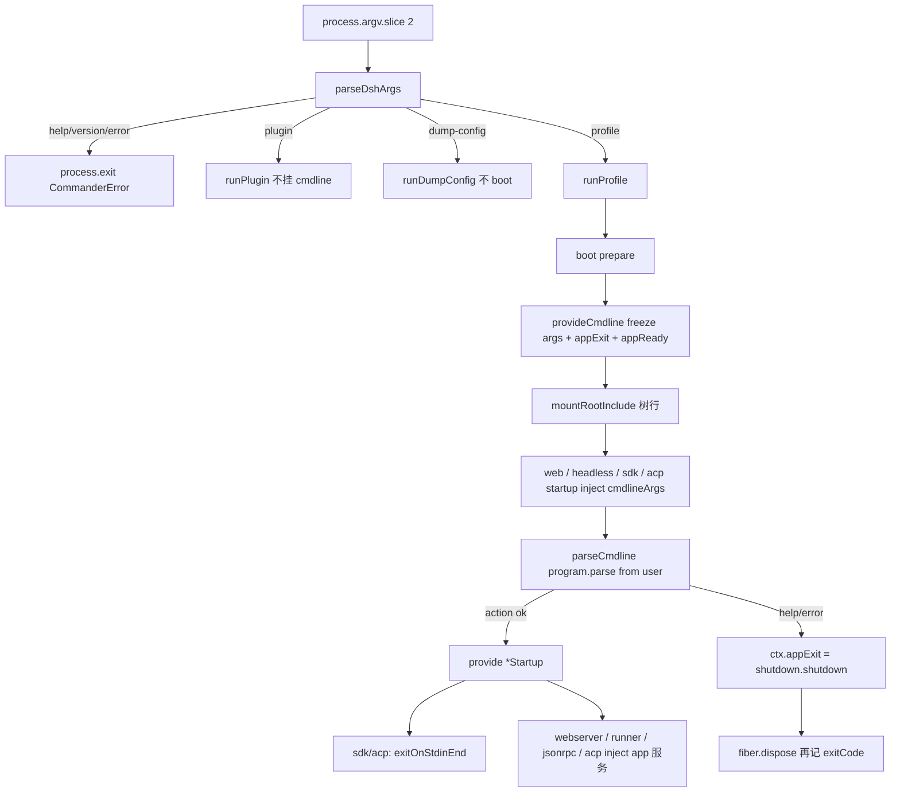

> `@deepseek-ai/dsh-cmdline` 是 **host 面**启动胶：launcher 只切开 `--profile` / `--patch` / dump，把其余 argv 冻成 `ctx.cmdlineArgs`；树内 app 用自己的 commander 调 `parseCmdline`，help / version / 语法错走 `ctx.appExit`，不 `process.exit`。stdio 面（sdk / sdk-minimal / acp）另用 `exitOnStdinEnd` + `ctx.appReady`。

DSH 是 Cordis 组合运行时（`profile → bundle → agent preset`），不是固定 CLI。capability seam 是 Definition / Provider / Consumer。本胶坐在 **host 面**（进程级：和 webserver / persistence / sandbox 同一层），不进 agent-preset 的 tools / persona / isolate 树。宿主入口是 `dsh web` **以及** `dsh --profile web|headless|sdk|sdk-minimal|acp`（后四个没有独立子命令）。本仓没有 shipped TUI 包；`HELP_EXAMPLES` 里的 `tui` 只是 custom profile 插图。`cmdlineArgs` 本身不是模型可见内容。

## 能回答的问题

- `dsh` launcher 自己吃哪些 token？第一个它不认识的 token 之后去哪？
- `provideCmdline` 在哪一层、相对 Loader 树行的什么时刻挂上？为什么 dump / plugin 路径不挂？
- `parseCmdline` 的 help / version / `program.error` 为什么走 `ctx.appExit` 而不是 `process.exit`？
- `isCommanderError` 为什么必须结构性检测，不能 `instanceof CommanderError`？
- `--host` / `--port` / `--no-open`、headless task、sdk/acp 的 `-h` 是谁的旗标？
- `exitOnStdinEnd` 和 `appReady` 怎么让 EOF 不掩盖 boot 失败？
- 把 `cmdlineArgs` / `webStartup` 再挂进 preset、不写 `isolate`，撞的是 `already registered` 还是 `leakedServices`？

## 职责边界

本包 `@deepseek-ai/dsh-cmdline` 拥有： [E: packages/boot/cmdline/package.json:2]

- `provideCmdline`：在任何 Loader 树行挂上之前，把 inner argv 冻成只读快照并 `provide('cmdlineArgs')` / `provide('appExit')`；可选 `provide('appReady')`。 [E: packages/boot/cmdline/src/index.ts:84] [E: packages/boot/cmdline/src/index.ts:86] [E: packages/boot/cmdline/src/index.ts:87] [E: packages/boot/cmdline/src/index.ts:88]
- `parseCmdline`：用 app 自己的 commander 解析那份快照；成功则跑 action；help / version / 语法错 / `program.error` 请求 `ctx.appExit`。 [E: packages/boot/cmdline/src/index.ts:165] [E: packages/boot/cmdline/src/index.ts:184]
- `exitOnStdinEnd`：stdio app 在 **action 已接受** 之后绑定 stdin EOF；等 `AppReady` commit 再 `exit(0)`，以免 EOF 抢在失败 boot 前面。 [E: packages/boot/cmdline/src/index.ts:123] [E: packages/boot/cmdline/src/index.ts:136]
- Context 合并：`ctx.cmdlineArgs?`、`ctx.appExit?`、`ctx.appReady?`（都是 optional host 值）。 [E: packages/boot/cmdline/src/index.ts:58] [E: packages/boot/cmdline/src/index.ts:60] [E: packages/boot/cmdline/src/index.ts:62]
- 测试可替换的 `internals.stdin` / `internals.stdout` / `internals.stderr`，以及包内 `isCommanderError` / `hasAction` / `configureExitAndOutput`（后三个不导出）。

本包 **不** 拥有：

- launcher 语法与三种 `DshInvocation` mode 的完整旗标表 — [surface.cli.overview](../../surface/cli/overview.md)。本页只写「切开」和「交接」。
- `boot` / `loadProfile` / `composeEntries` / 空 `cordis.yml` — [subsys.composition.app-boot](./app-boot.md)。
- web `--host` / `--port` / `--trusted-host` / `--no-open` 语义与 bind 安全门 — [surface.profiles.web](../../surface/profiles/web.md)。
- headless task 空串拒绝、runner 退出码 — [surface.profiles.headless](../../surface/profiles/headless.md)。
- `createProcessShutdown` 的 5s grace — launcher 把 `shutdown.shutdown` 塞进 `AppExit`。 [E: apps/cli/src/profile-boot.ts:260]
- preset 发现、`mountPreset`、`leakedServices` 实现。本页只写：cmdline 是 host 事实；shipped `packages/preset/agent-presets/presets/{minimal,standard,ptc,cordis}/agent.cordis.yml` 没有这行。
- 模型可见工具字段。`dsh-base` **没有** `subagent-codex` / `subagent-claude-code` 行。 [E: packages/bundle/base/tests/base.spec.ts:42] [E: packages/bundle/base/tests/base.spec.ts:43]
- 任何 `Events.waterfall` listener。

## 关键文件

| 路径 | 角色 |
|---|---|
| `packages/boot/cmdline/src/index.ts` | `provideCmdline` / `parseCmdline` / `exitOnStdinEnd` / `CmdlineArgs` / `AppExit` / `AppReady` |
| `packages/boot/cmdline/tests/cmdline.spec.ts` | 真 Loader 树：flag 赢过 `!!js`、help 不启动 consumer、快照不可变、stdin EOF |
| `apps/cli/src/args.ts` | `parseDshArgs`：launcher 旗标边界；唯一硬编码 profile 子命令是 `web` |
| `apps/cli/src/bin.ts` | `profile` → `runProfile`；`plugin` / `dump-config` 不挂本胶 |
| `apps/cli/src/profile-boot.ts` | `boot.prepare` 里 `provideCmdline`（含 `ready`）；live 才 watch 用户 patch |
| `apps/cli/src/process-shutdown.ts` | `AppExit`：先 dispose 再记 `exitCode` |
| `apps/cli/src/dump-config.ts` | dump **不** `boot`，因此没有 `cmdlineArgs` |
| `packages/boot/app-boot/src/index.ts` | `prepare` 在 `mountRootInclude` 之前跑 |
| `packages/boot/app-boot/src/profile.ts` | `PROFILE_TEMPLATES`：`acp` / `web` / `headless` / `sdk` / `sdk-minimal` |
| `packages/bundle/web-app/src/startup.ts` | Consumer：`inject: ['cmdlineArgs']`，action `provide('webStartup')` |
| `packages/bundle/headless/src/startup.ts` | Consumer：action `provide('headlessStartup')` |
| `packages/bundle/headless/src/index.ts` | runner 用 `ctx.get('appExit')`，不把它写进 `inject` |
| `packages/bundle/sdk-app/src/index.ts` | sdk / sdk-minimal 共用 startup：`parseCmdline` + `exitOnStdinEnd` |
| `packages/bundle/acp-app/src/index.ts` | acp 对称：零 extra-flag + stdin EOF |
| `packages/preset/agent-presets/src/mount.ts` | `leakedServices`：preset 把服务写进 root realm 则拒 |
| `vendor/cordis/src/events.ts` | `waterfall`：不调传入的 `next()` 就不会 `shift` |
| `vendor/cordis/src/reflect.ts` | `provide`：root isolate 符号；同名二次注册抛错 |

## 数据模型

不要混：包 `@deepseek-ai/dsh-cmdline`、服务键 `cmdlineArgs` / `appExit` / `appReady`、launcher 字段 `DshInvocation.args`、app 自己再 `provide` 的 `webStartup` / `headlessStartup` / `sdkAppStartup` / `acpAppStartup`。

| 符号 | 字段 | 含义 |
|---|---|---|
| `CmdlineArgs` | `get(): readonly string[]` | inner argv 快照；调用方数组事后 `push` 看不见 |
| `AppExit` | `(code: number) => void` | 请求「树 dispose 之后」退出；不是立刻 `process.exit` |
| `AppReady` | `onReady(listener)` | 成功 startup 才 fire；失败 / 外部终止不调用 |
| `CmdlineHost` | `args`, `exit`, `ready?` | `provideCmdline` 的入参 |
| `ProfileInvocation.args` | `string[]` | launcher 切开后原样交给 `runProfile` 的那段 |
| `Context.cmdlineArgs?` 等 | optional | 所以 `parseCmdline` / runner 走 `ctx.get`，不走属性代理 |

`provideCmdline` 做 `Object.freeze([...host.args])`，`get()` 永远返回同一份冻结数组。 [E: packages/boot/cmdline/src/index.ts:85] [E: packages/boot/cmdline/tests/cmdline.spec.ts:223]

`dsh-cmdline` 对 commander 只 `import type { Command }`；运行时 `Command` 实例由 app 传入。web-app 依赖自己的 `commander` 副本。 [E: packages/boot/cmdline/src/index.ts:19] [E: packages/bundle/web-app/package.json:116]

## 控制流

1. `parseDshArgs@apps/cli/src/args.ts` 只认识 launcher 自己的 token：`--profile`、可重复非 variadic 的 `--patch`、`--dump-config` / `--dump-default-config`、子命令 `web` / `plugin`、以及根上的 `-V`。`helpOption(false)` + `allowUnknownOption` + `passThroughOptions` + `enablePositionalOptions`：第一个它不认识的 token 起全部进入 leftover，包括 app 的 `-h`。`dsh web` 的 action 把 profile 写成 `'web'`，仍是 `mode: 'profile'`（带 dump 旗标时变成 `mode: 'dump-config'`）。**没有** `dsh sdk` / `dsh acp` / `dsh headless` 子命令。无 `--profile` 且 leftover 也不是 launcher help 则 `program.error`。 [E: apps/cli/src/args.ts:126] [E: apps/cli/src/args.ts:127] [E: apps/cli/src/args.ts:128] [E: apps/cli/src/args.ts:129] [E: apps/cli/src/args.ts:131] [E: apps/cli/src/args.ts:168] [E: apps/cli/src/args.ts:140]

2. leftover 原样成为 `ProfileInvocation.args`。测试钉死：`['web', '--host', '127.0.0.1', '--port', '8080', '--no-open', '--future-web-flag']` 的 `args` 含这些 token；`['--profile', 'headless', 'run', 'the', 'tests']` 的 `args` 是 `['run', 'the', 'tests']`；边界之后再出现的 `--patch` 也归 app。`--host` / `--port` / `--no-open` / headless task **不是** launcher 旗标。 [E: apps/cli/src/args.ts:87] [E: apps/cli/tests/args.spec.ts:39] [E: apps/cli/tests/args.spec.ts:40] [E: apps/cli/tests/args.spec.ts:42] [E: apps/cli/tests/args.spec.ts:45]

3. launcher 自己的 help / version / 语法错在树还不存在时发生，所以 `parseDshArgs` 用 `instanceof CommanderError` 然后 `process.exit`。这和树内 `parseCmdline` 的退出路径不是同一条。 [E: apps/cli/src/args.ts:186]

4. `bin.ts` 的 `switch`：`mode: 'profile'` 把 `invocation.args` 传给 `runProfile`；`plugin` 把剩余 argv 转给 pnpm 并 `process.exit`；`dump-config` 调 `runDumpConfig`。`runDumpConfig` 只 `prepareProfile` 再 `renderConfigDump` 写 stdout，函数体没有 `boot` / `provideCmdline`。后两条永远不会挂本胶。 [E: apps/cli/src/bin.ts:27] [E: apps/cli/src/bin.ts:29] [E: apps/cli/src/bin.ts:42] [E: apps/cli/src/dump-config.ts:30] [E: apps/cli/src/dump-config.ts:51]

5. `boot@packages/boot/app-boot/src/index.ts`：`new Context` → `provide('dshHomePath')` → `ctx.plugin(Loader)` → **`await prepare?.(ctx)`** → 然后才 `mountRootInclude`。`runProfile` 的 `prepare` 在这一刀里调用 `provideCmdline(hostCtx, { args, exit: code => void shutdown.shutdown(code), ready: appReady.service })`。树行此时还没挂，所以 `inject: ['cmdlineArgs']` 的 startup 行不会 pending 在一个还不存在的服务上。boot 结束后若树仍活着则 `appReady.commit()`。 [E: packages/boot/app-boot/src/index.ts:790] [E: packages/boot/app-boot/src/index.ts:790] [E: apps/cli/src/profile-boot.ts:258] [E: apps/cli/src/profile-boot.ts:305]

6. `provide` 是可逆 `fiber.effect`：在当前 isolate 表占名；host 根上 `root[symbols.isolate][name] ??= Symbol(name)`；同名二次 `provide` 抛 `service "<name>" has been registered at <…>`。`cmdlineArgs` / `appExit` / `appReady` 没有对应的 `cordis.patch.yml` 行，也没有 `isolate:`——它们是 launcher 写进 root realm 的事实。 [E: vendor/cordis/src/reflect.ts:278] [E: vendor/cordis/src/reflect.ts:286] [E: vendor/cordis/src/reflect.ts:290]

7. **host 组合里的 Consumer。** shipped `PROFILE_TEMPLATES` 五个名字：`acp`（startup，base+acp-app）、`web`（**唯一 live**，base+web-app）、`headless`（startup，base+headless）、`sdk`（startup，base+sdk-app）、`sdk-minimal`（startup，**只** `dsh-sdk-minimal`，不叠 base）。 [E: packages/boot/app-boot/src/profile.ts:137] [E: packages/boot/app-boot/src/profile.ts:142] [E: packages/boot/app-boot/src/profile.ts:154]

   - `dsh-web-app` insert `id: web-startup`（`name: '@deepseek-ai/dsh-web-app/startup'`），插件 `inject = ['cmdlineArgs']`，action 里 `ctx.provide('webStartup', …)`（含 `openBrowser`），最后 `parseCmdline`。`id: webserver` `inject: [webStartup]`，`config.host` / `config.port` 是 `!!js ctx.webStartup.host ?? '127.0.0.1'` / `ctx.webStartup.port ?? 3080`。`web-runtime` 读 `openBrowser: !!js ctx.webStartup.openBrowser`。 [E: packages/bundle/web-app/src/startup.ts:17] [E: packages/bundle/web-app/src/startup.ts:87] [E: packages/bundle/web-app/src/startup.ts:81] [E: packages/bundle/web-app/cordis.patch.yml:103] [E: packages/bundle/web-app/cordis.patch.yml:113] [E: packages/bundle/web-app/cordis.patch.yml:115] [E: packages/bundle/web-app/cordis.patch.yml:116] [E: packages/bundle/web-app/cordis.patch.yml:134]
   - `dsh-headless`：`id: headless-startup` inject `cmdlineArgs`；`id: headless-runner` inject `headlessStartup`，`task: !!js ctx.headlessStartup.task`。headless overlay **不** insert `agent-presets`。 [E: packages/bundle/headless/src/startup.ts:16] [E: packages/bundle/headless/src/startup.ts:54] [E: packages/bundle/headless/cordis.patch.yml:22] [E: packages/bundle/headless/cordis.patch.yml:26] [E: packages/bundle/headless/cordis.patch.yml:28]
   - sdk overlay insert `sdk-app-startup` + `sdk-jsonrpc-server`（inject `sdkAppStartup`）。sdk-minimal 同一 startup 包，config `profile: sdk-minimal`。ACP insert `acp-app-startup` + `acp`（inject `acpAppStartup`）。两者都是零 extra-flag，action 里 `exitOnStdinEnd` 再 `provide`。 [E: packages/bundle/sdk-app/cordis.patch.yml:12] [E: packages/bundle/sdk-app/cordis.patch.yml:17] [E: packages/bundle/sdk-app/src/index.ts:58] [E: packages/bundle/sdk-minimal/cordis.patch.yml:6] [E: packages/bundle/acp-app/cordis.patch.yml:12] [E: packages/bundle/acp-app/src/index.ts:44]

8. `parseCmdline@packages/boot/cmdline/src/index.ts` 用 `ctx.get('cmdlineArgs')` / `ctx.get('appExit')`，缺任一就抛 `the launcher must provide ctx.cmdlineArgs and ctx.appExit before the tree mounts`。`appExit` 是 optional host 值，不写进 `export const inject`。然后 `hasAction` 结构性读 `_actionHandler`：程序忘了 action 的话 parse 会「成功」却谁也不 `provide`。`configureExitAndOutput` 对**已经注册的子命令**也套 `exitOverride` + 把输出改到 `internals`——只配 root 的话，子命令拒绝会自己 `process.exit`，绕开 `ctx.appExit`。 [E: packages/boot/cmdline/src/index.ts:168] [E: packages/boot/cmdline/src/index.ts:170] [E: packages/boot/cmdline/src/index.ts:173] [E: packages/boot/cmdline/src/index.ts:176] [E: packages/boot/cmdline/src/index.ts:200] [E: packages/boot/cmdline/src/index.ts:213]

9. `program.parse(args.get(), { from: 'user' })`。commander 在 `exitOverride` 下把 help / version / 语法错 / action 的 `program.error()` 变成带 `code: 'commander.*'` 与 `exitCode` 的对象。`isCommanderError` **不** `instanceof`：只检查 `code` 是以 `commander.` 开头的 string，且 `exitCode` 是 number。out-of-tree 插件自带另一份 commander，`CommanderError` 类身份不同。非 commander 抛出原样 rethrow。命中则 `exit(error.exitCode)`，接到 `shutdown.shutdown`：`start(code, false)` 先 `dispose`，再 `completeOnce` → 默认 `complete` 写 `process.exitCode`，不是立刻 `process.exit`。 [E: packages/boot/cmdline/src/index.ts:178] [E: packages/boot/cmdline/src/index.ts:183] [E: packages/boot/cmdline/src/index.ts:237] [E: packages/boot/cmdline/src/index.ts:238] [E: apps/cli/src/process-shutdown.ts:66] [E: apps/cli/src/process-shutdown.ts:57] [E: apps/cli/src/process-shutdown.ts:25]

10. **成功 parse 才 publish。** `--help` 不跑 action：web 测试里 `values` 为 `undefined`、reader 不启动、`exits === [0]`；`--port abc` 同样不 publish，`exits === [1]`。headless 空 task / 纯空白 / `--help` 同理。无旗标时 web action 仍 publish `{ openBrowser: true, trustedHosts: [] }`，consumer 用 `??` 回落到 `127.0.0.1:3080`。sdk/acp 必须先 action 再 `exitOnStdinEnd`，help 不绑 stdin。 [E: packages/boot/cmdline/tests/cmdline.spec.ts:182] [E: packages/bundle/web-app/tests/startup.spec.ts:119] [E: packages/bundle/web-app/tests/startup.spec.ts:126] [E: packages/bundle/web-app/tests/startup.spec.ts:110] [E: packages/bundle/headless/tests/startup.spec.ts:93] [E: packages/bundle/headless/tests/startup.spec.ts:104] [E: packages/boot/cmdline/src/index.ts:126]

11. **waterfall 必须 `next()`。** `@deepseek-ai/dsh-cmdline` 自己不注册任何 `Events.waterfall` listener。`parseCmdline` 是同步 `program.parse`。组合运行时里其它事件走 `Events.waterfall`：listener 不调用传入的 `next()` 就不会 `cbs.shift()`。cmdline 的排序靠 Loader **inject 门**，不是 `next()`。 [E: vendor/cordis/src/events.ts:234] [E: vendor/cordis/src/events.ts:238] [E: vendor/cordis/src/events.ts:242]

12. **isolate / `leakedServices`。** `provideCmdline` 写的是 root realm。preset 再 `provide('cmdlineArgs')` 且不 `isolate: { cmdlineArgs: true }`：host 已占 root 符号，二次 `provide` 先抛 already registered。preset 若 `provide` 一个 host 还没有的名字（例如把 `web-startup` 整行搬进 `agent.cordis.yml` 且不 isolate `webStartup`），`leakedServices` 会扫到「实现 fiber 在 mount 子树内、且 store key 等于 `rootIsolate[name]`」，抛 `row(s) published process-global service(s) […]; a preset service must sit behind an isolate realm or move to the host composition`。shipped `packages/preset/agent-presets/presets/{minimal,standard,ptc,cordis}/` 没有 `web-startup` / `headless-startup` / `dsh-cmdline` 行。需要进程级一份 argv 快照，就留在 host。 [E: packages/preset/agent-presets/src/mount.ts:210] [E: packages/preset/agent-presets/src/mount.ts:221] [E: packages/preset/agent-presets/src/mount.ts:407] [E: packages/preset/agent-presets/src/mount.ts:410]

用户层 `cordis.patch.yml` 热更新走 `composeLive`（bundle + 两个用户文件 + overlays 的 clone），**不含** argv。inner args 活在 `cmdlineArgs` / `webStartup` 这些服务里，recompose 挤不走。watch 只在 `composed.profile.patchReload === 'live'` 时安装（shipped 模板里只有 `web`）。 [E: apps/cli/src/profile-boot.ts:243] [E: apps/cli/src/profile-boot.ts:271]

## 设计动机

- **App 拥有自己的旗标族和 `--help`。** launcher 若预知 `--host` / task positional / stdio 语法，每加一个 surface 就要改 `parseDshArgs`，并且 `dsh --profile web -h` 会打出 launcher help。切开之后，每个 bundle 的 startup 行是普通 plugin。 [I]
- **双份 commander 是组合现实。** `dsh-cmdline` 不把 commander 当 runtime 依赖；web-app 与 headless / sdk / acp 各带一份。结构性 `isCommanderError` 让 out-of-tree 插件的 `--help` 仍能走 `appExit(0)`。
- **有界退出，才能 dispose。** 树已经挂上时直接 `process.exit` 会跳过 fiber 倒序 cleanup。`AppExit` 接到 `shutdown.shutdown`：先 dispose，再记退出码。launcher 层的 `process.exit` 只发生在树还不存在的时候。
- **stdio 的 EOF 不能掩盖 boot 失败。** `exitOnStdinEnd` 等 `AppReady` commit 才 `exit(0)`；help / usage 失败不绑 listener。
- **旗标赢过写在旁边的值。** Loader 等 inject 齐了再评 `!!js`。`port: !!js ctx.webStartup.port ?? 3080` 让 `--port 8080` 压过 yml 默认。
- **不是 coding-agent 的 argv 总线。** inner args 不进 session log，也不决定模型可见工具集。工具集是 preset / host 组合的事。

## Gotcha

- **两层 commander、两种退出。** `parseDshArgs`：`instanceof CommanderError` + `process.exit`。`parseCmdline`：结构检测 + `ctx.appExit`。不要把 launcher 的 `-h`（无 profile）和 `dsh web -h`（inner `['-h']`，web 自己的 help）写成同一条路径。 [E: apps/cli/src/args.ts:186] [E: apps/cli/tests/args.spec.ts:38]
- **第一未知 token 是硬边界。** `--patch` 必须写在边界前才是 launcher overlay；`dsh --profile tui --resume b --patch late.yml` 里后一个 `--patch` 进 app args。`--patch` collector 故意非 variadic。 [E: apps/cli/src/args.ts:61] [E: apps/cli/tests/args.spec.ts:45]
- **dump 拒绝任何 app leftover。** `--dump-config --port 8080` 在 launcher 就 exit 1。`--dump-config` / `--dump-default-config` 仍活着，互斥，`--dump-default-config` 拒 `--patch`。dump 不应用 `resolveTelemetryPatch`。 [E: apps/cli/src/args.ts:90] [E: apps/cli/src/args.ts:96] [E: apps/cli/src/args.ts:100]
- **`appExit` 不能 `inject`。** `Context.appExit?` 是 optional。headless-runner 的 `inject` 只有 `agentDefaultModel` / `agents` / `sessions`，缺 `appExit` 时 `ctx.get` 后自己抛。 [E: packages/bundle/headless/src/index.ts:31] [E: packages/bundle/headless/src/index.ts:219] [E: packages/bundle/headless/src/index.ts:219]
- **action 里 `program.error` 之前的语句已经跑过。** 必须先校验再 `provide`。web 在 publish 前拒绝 `0.0.0.0` 和非数字 port；headless 在 publish 前拒绝空白 task。 [E: packages/bundle/web-app/src/startup.ts:74]
- **没有 action 的 program 是 load-time 失败，不是 usage 错误。** `hasAction` 为 false 时抛的是 Error，不会 `appExit(1)`。 [E: packages/boot/cmdline/tests/cmdline.spec.ts:228]
- **help 让下游行保持 pending。** action 没跑，`*Startup` 不存在。`appExit` → `shutdown.shutdown` 会 dispose 整棵树；`boot` 在 `loader.await()` 之后若发现 `ctx.get('loader') === undefined` 就直接返回，**不会**再跑 `assertEntriesActivated`。 [E: packages/boot/app-boot/src/index.ts:797] [E: packages/boot/app-boot/src/index.ts:797]
- **`tui` 不是 shipped profile，也不是 launcher 子命令。** `HELP_EXAMPLES` 把它写成 custom profile + `--patch` 的例子；裸 `dsh tui` 按缺 `--profile` 退出 1。`PROFILE_TEMPLATES` 是五个键，不是只有 web/headless。 [E: apps/cli/src/args.ts:68] [E: apps/cli/tests/args.spec.ts:75] [E: packages/boot/app-boot/src/profile.ts:137]
- **不要把 cmdline 搬进 preset。** isolate 一份会让每个 standing mount 看见不同的（或空的）argv；不 isolate 则 already registered 或 `leakedServices`。
- **`dsh-base` 不 dormant 加载 Codex / Claude 子代理。** 和本胶无关，但同一条 host 启动路径里不要按 README 写成「后端装着、preset 再 disable」。 [E: packages/bundle/base/tests/base.spec.ts:42]
- **sdk-minimal 不叠 `dsh-base`。** 它的 `bundles` 只有 `@deepseek-ai/dsh-sdk-minimal`，但仍走同一套 `provideCmdline` + `sdk-app-startup`。 [E: packages/boot/app-boot/src/profile.ts:155]

## Seam 三角

| 角色 | 包 / 符号 | ctx 键 | bundle / preset 行 |
|---|---|---|---|
| Definition | `@deepseek-ai/dsh-cmdline` 的 `CmdlineArgs` / `AppExit` / `AppReady` / `CmdlineHost` | `cmdlineArgs`、`appExit`、`appReady` | 无 yml 行（类型在包内 `declare module`） |
| Provider | launcher：`runProfile` → `boot(prepare)` → `provideCmdline`；`AppExit` 接到 `createProcessShutdown.shutdown`；`AppReady` 在树仍活时 `commit` | root realm，无 `isolate` | **不是** bundle insert。`plugin` / `dump-config` 不提供。嵌入式 host 可 `provideCmdline(ctx, { args: [], exit })`；stdio host 还要 `ready` |
| Consumer | `@deepseek-ai/dsh-web-app/startup` → `webStartup`；`@deepseek-ai/dsh-headless/startup` → `headlessStartup`；`headless-runner` 另 `get('appExit')`；`@deepseek-ai/dsh-sdk-app` → `sdkAppStartup` + `exitOnStdinEnd`；`@deepseek-ai/dsh-acp-app` → `acpAppStartup` + `exitOnStdinEnd` | startup：`inject: ['cmdlineArgs']`；下游：`webStartup` / `headlessStartup` / `sdkAppStartup` / `acpAppStartup` | **host** `dsh-web-app` / `dsh-headless` / `dsh-sdk-app` / `dsh-sdk-minimal` / `dsh-acp-app`。shipped preset **不**消费、也 **不** 再 provide 这组键 |

换掉 Provider（换 launcher、或测试里自己 `provideCmdline`）会带走所有 app 旗标与有界退出；不会带走已经 `provide` 出去的 `webStartup` 值（那是另一次 provide）。换掉 `id: web-startup` 只失去 Web 旗标族，`cmdlineArgs` 快照仍在。

## Sources

- packages/boot/cmdline/src/index.ts
- packages/boot/cmdline/package.json
- packages/boot/cmdline/tests/cmdline.spec.ts
- apps/cli/src/args.ts
- apps/cli/src/bin.ts
- apps/cli/src/profile-boot.ts
- apps/cli/src/process-shutdown.ts
- apps/cli/src/dump-config.ts
- apps/cli/package.json
- apps/cli/tests/args.spec.ts
- packages/boot/app-boot/src/index.ts
- packages/boot/app-boot/src/profile.ts
- packages/bundle/web-app/src/startup.ts
- packages/bundle/web-app/cordis.patch.yml
- packages/bundle/web-app/package.json
- packages/bundle/web-app/tests/startup.spec.ts
- packages/bundle/headless/src/startup.ts
- packages/bundle/headless/src/index.ts
- packages/bundle/headless/cordis.patch.yml
- packages/bundle/headless/tests/startup.spec.ts
- packages/bundle/sdk-app/src/index.ts
- packages/bundle/sdk-app/cordis.patch.yml
- packages/bundle/sdk-minimal/cordis.patch.yml
- packages/bundle/acp-app/src/index.ts
- packages/bundle/acp-app/cordis.patch.yml
- packages/preset/agent-presets/src/mount.ts
- packages/bundle/base/tests/base.spec.ts
- vendor/cordis/src/events.ts
- vendor/cordis/src/reflect.ts

## 相关

- [spine.composition-boot](../../spine/composition-boot.md) — `profile → bundle → preset` 端到端；本胶是 `boot.prepare` 里那一刀。
- [surface.cli.overview](../../surface/cli/overview.md) — `parseDshArgs` 旗标表、`dsh plugin`、dump 互斥。
- [subsys.composition.app-boot](./app-boot.md) — `boot` / `loadProfile` / 空根 `cordis.yml` / fail-loud。
- [spine.overview](../../spine/overview.md) — Cordis 组合主线、host 面 vs agent-preset 面、`model-visible ⟺ logged`。
- [surface.profiles.web](../../surface/profiles/web.md) — `--host` / `--port` / `--trusted-host` / `--no-open` 与 `0.0.0.0` 拒绝。
- [surface.profiles.headless](../../surface/profiles/headless.md) — task positional 与 runner 退出。
- [spine.capability-seams](../../spine/capability-seams.md) — Definition / Provider / Consumer 通例。
