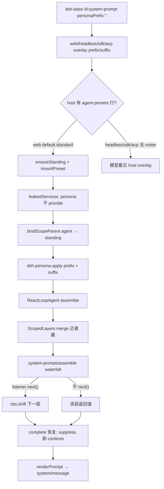

> `@deepseek-ai/dsh-persona` 是 **agent-preset 面** 的 **scope-only** 组合行：在 preset 的 standing scope 上登记 `deployment:persona-prefix` 与 `deployment:persona-suffix`，shadow **host 面** `dsh-system-prompt` 构造期写下的部署 prefix/suffix。DSH 是 Cordis 组合运行时（`profile → bundle → agent preset`），能力缝是 `Definition / Provider / Consumer`。进入模型的 system 必须能从 session log 的 `system/message` 重建（`model-visible ⟺ logged`）。五个 shipped CLI profile 是 `web` / `headless` / `sdk` / `sdk-minimal` / `acp`；`desktop` 不在 `PROFILE_TEMPLATES`。四个 shipped preset 目录是 `minimal` / `standard` / `ptc` / `cordis`（wiki id `surface.presets.code` 是 PTC 的稳定别名）。

## 能回答的问题

- 为什么 preset 不能再挂一份 `@deepseek-ai/dsh-system-prompt`，而必须有单独的 `dsh-persona` 行？
- 挂在全局 Context 上为什么 fail-loud？挂在 scoped `agent.ctx` / standing preset 上怎样 shadow？
- `prefix` / `suffix` / `complete` / `includeRuntimeContext` 各改装配的哪一刀？空 suffix 会不会露出部署 suffix？
- shipped `minimal` 与 `standard` 的 persona 散文和旋钮差在哪？`ptc` / `cordis` 是否另写一行？
- `system-prompt/assemble` waterfall 不调用 `next()` 会怎样？`complete: true` 为什么能挡住 listener？
- `dsh-persona` 要不要 `isolate`？headless / sdk / acp 看不看 shipped `agent.cordis.yml` 里的这一行？

## 职责边界

本包 `@deepseek-ai/dsh-persona` 拥有：插件名 `persona`、`inject: ['systemPrompt']`、`apply`、以及 `Config`（`prefix` 必填，`suffix` 默认 `''`，`complete` 默认 `false`，`includeRuntimeContext` 默认 `true`）。它从 `@deepseek-ai/dsh-system-prompt` **import 再 re-export** `PERSONA_PREFIX_SECTION` / `PERSONA_SUFFIX_SECTION`，两边共用这两个槽名；order 调用 `getSectionOrder('DEPLOYMENT_PERSONA_PREFIX')` / `getSectionOrder('DEPLOYMENT_PERSONA_SUFFIX')`。 [E: packages/preset/persona/src/index.ts:19] [E: packages/preset/persona/src/index.ts:21] [E: packages/preset/persona/src/index.ts:24] [E: packages/preset/persona/src/index.ts:50] [E: packages/preset/persona/src/index.ts:51]

本包**不**拥有：

- `ctx.systemPrompt` 服务、四类贡献、`assemble` / `renderPrompt`、`complete` 在 waterfall **之后**的恢复 —— [`subsys.core.system-prompt`](../core/system-prompt.md)。
- scope 原语 `createScope` / `bindScopeParent` / `ScopedLayers.merge` —— [`subsys.core.scope`](../core/scope.md)。
- preset 发现、standing mount、`leakedServices` 审计 —— [`subsys.composition.agent-presets`](./agent-presets.md)。
- 谁在每个拟议 step 调用 `assemble`、谁把 `renderPrompt` 写进 `system/message` —— [`spine.turn-and-step`](../../spine/turn-and-step.md) 的 `ReactLoopAgent`。
- shipped 四份 preset 的完整工具成员表 —— [`surface.presets.overview`](../../surface/presets/overview.md)。本页只核 `id: persona` 行。
- Codex / Claude 子代理 **backends**。`dsh-base` **没有** `subagent-codex` / `subagent-claude-code` 行。 [E: packages/bundle/base/tests/base.spec.ts:43] [E: packages/bundle/base/tests/base.spec.ts:44]

行存在的原因：agent preset **不能**再挂 prompt registry 本身（host 已经 `super(ctx, 'systemPrompt')`；再挂会撞服务或把第二份 registry publish 进 root realm）。没有 `dsh-persona`，preset 只能换 tools，换不了身份。 [E: packages/core/system-prompt/src/index.ts:416] [E: packages/preset/persona/src/index.ts:62]

## 关键文件

| 路径 | 角色 |
|---|---|
| `packages/preset/persona/src/index.ts` | `apply`、`Config`、`inject`、re-export `PERSONA_PREFIX_SECTION` / `PERSONA_SUFFIX_SECTION` |
| `packages/preset/persona/tests/persona.spec.ts` | unscoped 撞名、scoped shadow、空 suffix 占槽、fiber 回滚、`complete`、suppress |
| `packages/core/system-prompt/src/index.ts` | 两个槽名常量、`DEPLOYMENT_PERSONA_PREFIX` / `SUFFIX`、构造期 global 段、`assemble` waterfall / 事后恢复 |
| `packages/preset/agent-presets/src/index.ts` | `ensureStanding` + `bindScopeParent`；子代理 `composeFrom` |
| `packages/preset/agent-presets/src/mount.ts` | `mountPreset` 后扫 `leakedServices` |
| `packages/bundle/base/cordis.patch.yml` | host 插入 `id: system-prompt`，部署 `personaPrefix: ''` |
| `packages/bundle/{web-app,headless,sdk-app,acp-app}/cordis.patch.yml` | overlay `personaPrefix` / `personaSuffix`；**仅 web** 另 `insert` roster |
| `packages/preset/agent-presets/presets/{minimal,standard,ptc,cordis}/agent.cordis.yml` | shipped 成员资格里的 `id: persona` 行 |

## 数据模型

| 符号 / 键 | 值或默认 | 含义 |
|---|---|---|
| `PERSONA_PREFIX_SECTION` | `'deployment:persona-prefix'` | 部署 persona **prefix** 槽名；preset 必须用这个名字才能 shadow [E: packages/core/system-prompt/src/index.ts:174] [E: packages/preset/persona/src/index.ts:19] |
| `PERSONA_SUFFIX_SECTION` | `'deployment:persona-suffix'` | 部署 persona **suffix** 槽名；空 suffix 仍占槽，把部署 suffix shadow 掉 [E: packages/core/system-prompt/src/index.ts:177] [E: packages/preset/persona/src/index.ts:21] |
| `SECTION_ORDERS.DEPLOYMENT_PERSONA_PREFIX` | `0` | prefix 写在 identity（`-1000`）之后、其它 guidance 之前 [E: packages/core/system-prompt/src/index.ts:123] |
| `SECTION_ORDERS.DEPLOYMENT_PERSONA_SUFFIX` | `10200` | suffix 写在可复用说明之后 [E: packages/core/system-prompt/src/index.ts:153] |
| `Config.prefix` | 必填 `string` | 写入 prefix 槽的模板。`{{name}}` 在 `renderPrompt` 才严格插值 [E: packages/preset/persona/src/index.ts:50] |
| `Config.suffix` | default `''` | 写入 suffix 槽；省略或空字符串都会 shadow 部署 suffix [E: packages/preset/persona/src/index.ts:51] [E: packages/preset/persona/tests/persona.spec.ts:44] |
| `Config.complete` | default `false` | `true` 时只把 `{ complete: true }` 挂在 **prefix** 上；装配在 waterfall **之后**把该段恢复成唯一 system section [E: packages/preset/persona/src/index.ts:52] [E: packages/preset/persona/src/index.ts:67] [E: packages/preset/persona/tests/persona.spec.ts:139] |
| `Config.includeRuntimeContext` | default `true` | `false` 时对**当前 ctx 的 scope** 调 `suppressRuntimeContext()` [E: packages/preset/persona/src/index.ts:53] [E: packages/preset/persona/src/index.ts:74] |
| 插件 `name` / `inject` | `'persona'` / `['systemPrompt']` | Loader 行名；只消费已有 registry，不 `provide` 新服务 [E: packages/preset/persona/src/index.ts:24] [E: packages/preset/persona/src/index.ts:27] |

`apply` 用两个 `ctx.effect` 分别登记 prefix（`'persona.section()'`）与 suffix（`'persona.suffix()'`）：登记可逆，fiber `dispose` 卸掉 scoped 段后该 scope 重新看见部署散文。 [E: packages/preset/persona/src/index.ts:63] [E: packages/preset/persona/src/index.ts:69]

bundle / overlay 用的键是 **`personaPrefix` / `personaSuffix`**（`SystemPrompt.Config`）。shipped preset yml 用的是 **`prefix` / `suffix`**（`dsh-persona` Config）。旧键 `text` / `persona` 已废。 [E: packages/core/system-prompt/src/index.ts:403] [E: packages/core/system-prompt/src/index.ts:404]

## 控制流

1. **host 面先占住两个槽。** `dsh-base` 放下 `id: system-prompt`，`config.personaPrefix: ''`（不写 `personaSuffix` 键，schema 默认 `''`）。`SystemPrompt` 构造时登记 prefix 与 suffix 两个 global 段。空串仍占名；`renderPrompt` 丢掉空 section。 [E: packages/bundle/base/cordis.patch.yml:465] [E: packages/bundle/base/cordis.patch.yml:468] [E: packages/core/system-prompt/src/index.ts:426] [E: packages/core/system-prompt/src/index.ts:432]

2. **mode bundle overlay 部署模板。** `dsh-web-app` / `dsh-headless` / `dsh-sdk-app` / `dsh-acp-app` 都按 id 覆盖 `personaPrefix` / `personaSuffix`（cwd 在 suffix，模型句在 prefix）。 [E: packages/bundle/web-app/cordis.patch.yml:16] [E: packages/bundle/web-app/cordis.patch.yml:18] [E: packages/bundle/headless/cordis.patch.yml:8] [E: packages/bundle/sdk-app/cordis.patch.yml:3] [E: packages/bundle/acp-app/cordis.patch.yml:3]

3. **host / preset 在 roster 这一刀切开。** 五个 shipped CLI profile 里，**只有 web** 再 `insert` `id: agent-presets`（`default: standard`）。headless / sdk / acp **不会** 加载 shipped `agent.cordis.yml` 的 `id: persona` 行。`sdk-minimal` 不叠 `dsh-base`、不挂 roster：`personaPrefix: !!js process.env.DSH_SYSTEM_PROMPT ?? '…'` 写在自己的 `system-prompt` 行上，不是 `dsh-persona`。 [E: packages/bundle/web-app/cordis.patch.yml:481] [E: packages/bundle/web-app/cordis.patch.yml:484] [E: packages/bundle/headless/cordis.patch.yml:20] [E: packages/bundle/sdk-minimal/cordis.patch.yml:84] [E: packages/bundle/sdk-minimal/cordis.patch.yml:89]

4. **Web 会话在 factory `setup` 里 join standing mount。** `mountPreset` 拒绝 unscoped ctx。`ensureStanding` 对每个 preset id single-flight：`createScope(selfCtx, { agentPreset: preset.id })`，再 `mountPreset`。然后 `bindScopeParent`。子代理 `composeFrom` 再绑一次父已经 standing 的那一代。 [E: packages/preset/agent-presets/src/mount.ts:380] [E: packages/preset/agent-presets/src/index.ts:792] [E: packages/preset/agent-presets/src/index.ts:447] [E: packages/preset/agent-presets/src/index.ts:477]

5. **`leakedServices` 扫的是 root realm 的 service，不是 prompt section。** `dsh-persona` 只 `inject` 已有 `systemPrompt` 并 `section()`，不 `provide`，因此 **不**需要 isolate。shipped `minimal` / `standard` 都把 `id: persona` 放在组外。 [E: packages/preset/agent-presets/src/mount.ts:210] [E: packages/preset/agent-presets/src/mount.ts:409] [E: packages/preset/agent-presets/presets/minimal/agent.cordis.yml:9] [E: packages/preset/agent-presets/presets/standard/agent.cordis.yml:24]

6. **`apply` 在 standing ctx 上写两个同名段。** prefix 可带 `complete: true`；suffix 始终登记（即使是空串）。`ScopedLayers.merge` 近者赢同名。 [E: packages/preset/persona/src/index.ts:63] [E: packages/preset/persona/src/index.ts:69] [E: packages/preset/persona/tests/persona.spec.ts:31]

7. **unscoped 挂载 fail-loud。** 根 Context 第二次登记 prefix 抛 `"deployment:persona-prefix" is already registered`。测试直接 `ctx.plugin(Persona, { prefix })`。 [E: packages/preset/persona/tests/persona.spec.ts:61] [E: packages/preset/persona/tests/persona.spec.ts:62]

8. **每个拟议 step 在 host 那一份 registry 上 assemble。** `AgentLoop` 构造时在 host 登记 `provider` / `model` / `cwd` 三个 variable。 [E: packages/core/agent-loop/src/index.ts:421] [E: packages/core/agent-loop/src/index.ts:423]

9. **waterfall 必须 `next()`。** `assemble` 物化后调用 `this.ctx.waterfall(..., 'system-prompt/assemble', …)`。listener 不 `next()`，后续 listener 和 inner 都不跑。 [E: packages/core/system-prompt/src/index.ts:617]

10. **`complete` 与 suppress 在 waterfall 之后钉死。** 多个 `complete: true` 在进 waterfall 前就抛。唯一的 complete 事后把 `sections` 换成 `[completeSection]`（`minimal` 因此只剩 prefix）。 [E: packages/core/system-prompt/src/index.ts:590] [E: packages/core/system-prompt/src/index.ts:624] [E: packages/preset/persona/tests/persona.spec.ts:139]

11. **`model-visible ⟺ logged`。** `ReactLoopAgent.step` 取 `renderPrompt(assembly)`，把非空 system 写成独立 `system/message`，**不再**把 system 字符串塞进 `request/header`。 [E: packages/core/agent-loop/src/agent.ts:359] [E: packages/core/agent-loop/src/agent.ts:371]

12. **子代理复用 prefix 槽。** `applyChildComposition`：先 `composeFrom` 加入父的 standing；若孩子自带 persona，再在 `childCtx` 上 `section({ name: 'deployment:persona-prefix', … })`。 [E: packages/subagent/subagent/src/child-agent.ts:204] [E: packages/subagent/subagent/src/child-agent.ts:212]

### shipped 行（成员资格只认这些 yml）

| preset | `id: persona` 的 `config` |
|---|---|
| `standard` | `prefix: You are a coding agent powered by the {{model}} model.`；`suffix: Your working directory is {{cwd}}.`（未写 `complete` / `includeRuntimeContext`） [E: packages/preset/agent-presets/presets/standard/agent.cordis.yml:27] [E: packages/preset/agent-presets/presets/standard/agent.cordis.yml:29] |
| `minimal` | `prefix: You are a helpful software engineer assistant.` + `complete: true` + `includeRuntimeContext: false`（无 `suffix`）。装配后 `sections` 只剩 prefix；e2e 钉死名字与原文。单工具 persistent shell，不是「两工具」。 [E: packages/preset/agent-presets/presets/minimal/agent.cordis.yml:12] [E: packages/preset/agent-presets/presets/minimal/agent.cordis.yml:13] [E: apps/cli/tests/web-agent-presets.e2e.ts:296] |
| `ptc`（wiki id `surface.presets.code`） | 与 `standard` 同一套 `prefix` / `suffix`；多出来的是 `tool-presentation` `mode: ptc`。 [E: packages/preset/agent-presets/presets/ptc/agent.cordis.yml:34] [E: packages/preset/agent-presets/presets/ptc/agent.cordis.yml:36] |
| `cordis` | 同一两槽；`suffix` 仍是 cwd 句，`prefix` 再写 HOST / AGENT PRESET 两平面。 [E: packages/preset/agent-presets/presets/cordis/agent.cordis.yml:20] [E: packages/preset/agent-presets/presets/cordis/agent.cordis.yml:22] |

## 设计动机

- **换身份 = 换 preset 行，不是 fork loop。** host 留下一份 `ctx.systemPrompt`；preset 只 shadow 两个部署槽。写错名字会变成并排段而不是替换。 [E: packages/preset/persona/src/index.ts:19]
- **scope-only 是故意的 fail-closed。** 全局再挂会和构造期登记撞 prefix 名。
- **`complete` 只挂 prefix，且在 waterfall 之后恢复。** `minimal` 靠这一刀做成固定 prompt 的单工具编码代理。
- **`includeRuntimeContext: false` 只关 snapshot，不关 tools。** `minimal` 仍装配 `bash`（unix），只是不把动态 context 投影成 user 消息。 [E: apps/cli/tests/web-agent-presets.e2e.ts:299]
- **空 suffix 必须仍登记。** 否则部署 suffix 会从 global 层漏出来。 [E: packages/preset/persona/tests/persona.spec.ts:52]

## Gotcha

- 在根 Context `plugin(Persona)` 抛 `"deployment:persona-prefix" is already registered`。必须挂在 `createScope` / standing preset / `agent.ctx` 上。 [E: packages/preset/persona/tests/persona.spec.ts:62]
- 空 `suffix` 仍占用 suffix 槽：该 scope 的部署 suffix 被 shadow 成空；**不会**掉回 web/headless overlay。 [E: packages/preset/persona/tests/persona.spec.ts:52]
- `assemble()` 不插值。测试里 section 文本仍是 `You run on {{model}}.`，`renderPrompt` 才变成 `You run on deepseek-v4-pro.`。 [E: packages/preset/persona/tests/persona.spec.ts:121]
- listener 不 `next()` 就是否决后半链。有 `complete` 时事后仍钉回 prefix 原文。 [E: packages/preset/persona/tests/persona.spec.ts:139]
- headless / sdk / acp **不**吃 `minimal` 的 `complete: true`。那份 yml 只在挂了 roster 的 Web 会话、且选中 `minimal` 时生效。 [E: packages/bundle/headless/cordis.patch.yml:20]
- 子代理孩子 shadow 用的是 `deployment:persona-prefix`，不是旧名 `deployment:persona`。 [E: packages/subagent/subagent/src/child-agent.ts:212]
- `{{model}}` / `{{cwd}}` 依赖 host 上 `AgentLoop` 登记的 variable。 [E: packages/core/agent-loop/src/index.ts:421]
- 旧键 `text` / `persona` / `PERSONA_SECTION` / `DEPLOYMENT_PERSONA` 已废。

## Seam 三角

| Seam | Definition | Provider | Consumer |
|---|---|---|---|
| `deployment:persona-prefix` / `-suffix` | `@deepseek-ai/dsh-system-prompt` 导出两个槽名；order 由 `getSectionOrder('DEPLOYMENT_PERSONA_PREFIX' \| '…_SUFFIX')` | **host**：`SystemPrompt` 构造期 global 段（`dsh-base` `personaPrefix: ''`，mode overlay 模板）。**preset**：`dsh-persona.apply` 同名 scoped 段。**child**：`applyChildComposition` 再 shadow prefix | `SystemPrompt.assemble` → `renderPrompt` → `system/message`。`complete: true` 时事后唯一 section 是 prefix |
| `ctx.systemPrompt` 服务 | `dsh-system-prompt` 把 `Context.systemPrompt` 打成 `SystemPrompt` | **host** 行 `id: system-prompt`（base insert；mode bundle 只改 `config`） | `dsh-persona` 的 `inject: ['systemPrompt']`；loop 的 `assemble` |
| `system-prompt/assemble` 事件 | 定义在 `dsh-system-prompt`；mode waterfall | 任何 `ctx.on('system-prompt/assemble', …)`。`dsh-persona` **不**注册 listener | `assemble` 的 `ctx.waterfall`。不 `next()` 则停在该层 |
| isolate / `leakedServices` | `mountPreset` 比较 `root[Context.isolate][name]` | 需要私有实例的 preset 行写 `isolate` | `dsh-persona` **不是** Provider：审计放过 section 层 |

## Sources

- packages/preset/persona/src/index.ts
- packages/preset/persona/tests/persona.spec.ts
- packages/preset/persona/package.json
- packages/core/system-prompt/src/index.ts
- packages/core/system-prompt/tests/system-prompt.spec.ts
- packages/core/system-prompt/tests/scoped.spec.ts
- packages/core/scope/src/index.ts
- packages/core/scope/src/store.ts
- packages/core/agent-loop/src/agent.ts
- packages/core/agent-loop/src/index.ts
- packages/core/agent/src/dispatch.ts
- packages/preset/agent-presets/src/index.ts
- packages/preset/agent-presets/src/mount.ts
- packages/preset/agent-presets/tests/mount.spec.ts
- packages/bundle/base/cordis.patch.yml
- packages/bundle/base/tests/base.spec.ts
- packages/bundle/web-app/cordis.patch.yml
- packages/bundle/headless/cordis.patch.yml
- packages/bundle/sdk-app/cordis.patch.yml
- packages/bundle/acp-app/cordis.patch.yml
- packages/bundle/sdk-minimal/cordis.patch.yml
- packages/preset/agent-presets/presets/minimal/agent.cordis.yml
- packages/preset/agent-presets/presets/standard/agent.cordis.yml
- packages/preset/agent-presets/presets/ptc/agent.cordis.yml
- packages/preset/agent-presets/presets/cordis/agent.cordis.yml
- apps/cli/tests/web-agent-presets.e2e.ts
- packages/subagent/subagent/src/child-agent.ts
- vendor/cordis/src/events.ts

## 相关

- [`subsys.core.system-prompt`](../core/system-prompt.md) — host 面 `ctx.systemPrompt`：四类贡献、`assemble` waterfall、`complete` 恢复、严格插值。
- [`surface.presets.overview`](../../surface/presets/overview.md) — shipped preset 发现、`default: standard`。
- [`subsys.composition.agent-presets`](./agent-presets.md) — standing mount、`leakedServices`、`composeFrom`。
- [`spine.overview`](../../spine/overview.md) — Cordis 组合运行时总览。
- [`spine.composition-boot`](../../spine/composition-boot.md) — 空入口表叠 bundle / home / `--patch`。
- [`spine.turn-and-step`](../../spine/turn-and-step.md) — `assemble`、`renderPrompt`、`system/message` 时序。
- [`subsys.core.scope`](../core/scope.md) — `ScopedLayers.merge`、`bindScopeParent`。
- [`surface.presets.minimal`](../../surface/presets/minimal.md) — `complete: true` + 单工具 persistent shell。
- [`surface.presets.standard`](../../surface/presets/standard.md) — 默认 coding-agent 成员表。
- [`surface.presets.code`](../../surface/presets/code.md) — PTC 预设；同一 `prefix` / `suffix`，另加 `tool-presentation`。
