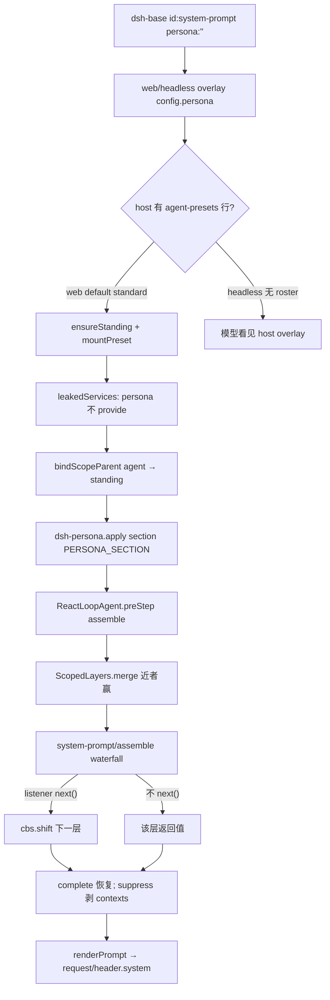

> `@deepseek-ai/dsh-persona` 是 **agent-preset 面** 的 **scope-only** 组合行：在 preset 的 standing scope 上登记同名 section `deployment:persona`，shadow **host 面** `dsh-system-prompt` 构造期写下的部署 persona。DSH 是 Cordis 组合运行时（`profile → bundle → agent preset`），能力缝是 `Definition / Provider / Consumer`，不是「又一个 coding agent」里写死的 system string。进入模型的 system 必须能从 session log 的 `request/header` 重建（`model-visible ⟺ logged`）。默认产品路径是本地 Web GUI（`dsh web`）；本仓没有 shipped TUI 包。

## 能回答的问题

- 为什么 preset 不能再挂一份 `@deepseek-ai/dsh-system-prompt`，而必须有单独的 `dsh-persona` 行？
- 挂在全局 Context 上为什么 fail-loud？挂在 scoped `agent.ctx` / standing preset 上怎样 shadow？
- `text` / `complete` / `includeRuntimeContext` 各改装配的哪一刀？`apply()` 绕过 schema 默认时 runtime-context 开还是关？
- shipped `minimal` 与 `standard` 的 persona 散文和旋钮差在哪？`code` / `cordis` 是否另写一行？
- `system-prompt/assemble` waterfall 不调用 `next()` 会怎样？`complete: true` 为什么能挡住 listener？
- `dsh-persona` 要不要 `isolate`？`leakedServices` 拒的是 service publish 还是 section 层？headless 看不看 shipped `agent.cordis.yml` 里的这一行？

## 职责边界

本包 `@deepseek-ai/dsh-persona` 拥有：插件名 `persona`、`inject: ['systemPrompt']`、`apply`、以及 `Config`（`text` 必填，`complete` 默认 `false`，`includeRuntimeContext` 默认 `true`）。它从 `@deepseek-ai/dsh-system-prompt` **import 再 re-export** `PERSONA_SECTION` / `PERSONA_ORDER`，两边共用同一个槽名，避免写错名字变成并排两段。 [E: packages/preset/persona/package.json:2] [E: packages/preset/persona/src/index.ts:23] [E: packages/preset/persona/src/index.ts:25] [E: packages/preset/persona/src/index.ts:28] [E: packages/preset/persona/src/index.ts:31] [E: packages/preset/persona/src/index.ts:49] [E: packages/preset/persona/src/index.ts:50] [E: packages/preset/persona/src/index.ts:51]

本包**不**拥有：

- `ctx.systemPrompt` 服务、四类贡献、`assemble` / `renderPrompt`、`complete` 在 waterfall **之后**的恢复 —— [`subsys.core.system-prompt`](../core/system-prompt.md)。
- scope 原语 `createScope` / `bindScopeParent` / `ScopedLayers.merge` —— [`subsys.core.scope`](../core/scope.md)。
- preset 发现、standing mount、`leakedServices` 审计 —— [`subsys.composition.agent-presets`](./agent-presets.md)。
- 谁在每个拟议 step 调用 `assemble`、谁把 `renderPrompt` 写进 `request/header` —— [`spine.turn-and-step`](../../spine/turn-and-step.md) 的 `ReactLoopAgent`。
- shipped 四份 preset 的完整工具成员表 —— [`surface.presets.overview`](../../surface/presets/overview.md)。本页只核 `id: persona` 行。
- Codex / Claude 子代理 **backends**。`dsh-base` **没有** `subagent-codex` / `subagent-claude-code` 行，也不是「装了但 dormant」：`base.spec.ts` 钉死这两行长度为 0，且 manifest 不依赖对应包。`standard` 里对应 tool 行存在但 `disabled: true`。 [E: packages/bundle/base/tests/base.spec.ts:38] [E: packages/bundle/base/tests/base.spec.ts:39] [E: packages/bundle/base/tests/base.spec.ts:40] [E: packages/bundle/base/tests/base.spec.ts:41] [E: apps/cli/config/agent-presets/standard/agent.cordis.yml:205] [E: apps/cli/config/agent-presets/standard/agent.cordis.yml:214]

行存在的原因：agent preset **不能**再挂 prompt registry 本身（host 已经 `super(ctx, 'systemPrompt')`；再挂会撞服务或把第二份 registry publish 进 root realm）。没有 `dsh-persona`，preset 只能换 tools，换不了身份。 [E: packages/core/system-prompt/src/index.ts:354] [E: packages/preset/persona/src/index.ts:31]

## 关键文件

| 路径 | 角色 |
|---|---|
| `packages/preset/persona/src/index.ts` | `apply`、`Config`、`inject`、re-export `PERSONA_*` |
| `packages/preset/persona/tests/persona.spec.ts` | unscoped 撞名、scoped shadow、空 text 占槽、fiber 回滚、`complete`、suppress、`apply()` 默认 |
| `packages/core/system-prompt/src/index.ts` | 槽名常量、构造期 global 段、`assemble` merge / waterfall / 事后恢复 |
| `packages/preset/agent-presets/src/index.ts` | `ensureStanding` + `bindScopeParent`；子代理 `composeFrom` |
| `packages/preset/agent-presets/src/mount.ts` | `mountPreset` 后扫 `leakedServices` |
| `packages/bundle/base/cordis.patch.yml` | host 插入 `id: system-prompt`，部署 `persona: ''` |
| `packages/bundle/web-app/cordis.patch.yml` / `headless/cordis.patch.yml` | overlay 部署 persona 模板；web 另 `insert` roster |
| `apps/cli/config/agent-presets/{minimal,standard,code,cordis}/agent.cordis.yml` | shipped 成员资格里的 `id: persona` 行 |
| `vendor/cordis/src/events.ts` | waterfall 必须 `next()` 才会 `shift` |

## 数据模型

| 符号 / 键 | 值或默认 | 含义 |
|---|---|---|
| `PERSONA_SECTION` | `'deployment:persona'` | 部署 persona 槽名；preset 必须用这个名字才能 shadow，而不是并排多一段 [E: packages/core/system-prompt/src/index.ts:128] |
| `PERSONA_ORDER` | `0` | 该槽的 `order`。host 默认还登记 `harness:identity`（`order: -100`），所以未声明 `complete` 时 identity 排在 persona 前 [E: packages/core/system-prompt/src/index.ts:131] [E: packages/core/system-prompt/src/index.ts:360] |
| `Config.text` | 必填 `string` | 写入该槽的模板。`{{name}}` 在 `renderPrompt` 才严格插值；`assemble` 仍保留花括号原文 [E: packages/preset/persona/src/index.ts:40] [E: packages/preset/persona/tests/persona.spec.ts:84] |
| `Config.complete` | default `false` | `true` 时 `apply` 才把 `{ complete: true }` 传给 `section`；装配在 waterfall **之后**把该段恢复成唯一 system section [E: packages/preset/persona/src/index.ts:50] [E: packages/preset/persona/src/index.ts:65] |
| `Config.includeRuntimeContext` | default `true` | `false` 时对**当前 ctx 的 scope** 调 `suppressRuntimeContext()`；不改其它 scope 的 snapshot [E: packages/preset/persona/src/index.ts:51] [E: packages/preset/persona/src/index.ts:67] |
| 插件 `name` / `inject` | `'persona'` / `['systemPrompt']` | Loader 行名；只消费已有 registry，不 `provide` 新服务 [E: packages/preset/persona/src/index.ts:28] [E: packages/preset/persona/src/index.ts:31] |

`apply` 用 `ctx.effect(..., 'persona.section()')` 包住 `systemPrompt.section(...)`：登记可逆，fiber `dispose` 卸掉 scoped 段后该 scope 重新看见部署散文。 [E: packages/preset/persona/src/index.ts:61] [E: packages/preset/persona/tests/persona.spec.ts:70]

直接调用 `Persona.apply` 会绕过 schemastery 默认值。`includeRuntimeContext` 用 `?? true` 兜底，所以缺字段时仍保留 runtime-context；`complete` 只在真值时展开。 [E: packages/preset/persona/src/index.ts:67] [E: packages/preset/persona/tests/persona.spec.ts:135] [E: packages/preset/persona/tests/persona.spec.ts:138]

## 控制流

1. **host 面先占住槽。** `dsh-base` 用一条根 insert 放下 `id: system-prompt` / `name: '@deepseek-ai/dsh-system-prompt'`，`config.persona` 是空串。`SystemPrompt` 构造时无条件 `section({ name: PERSONA_SECTION, order: PERSONA_ORDER, text: config.persona ?? '' })`。空串仍占 global 名；`renderPrompt` 丢掉空 section。这是进程级 registry，不是 per-session 插件。 [E: packages/bundle/base/cordis.patch.yml:429] [E: packages/bundle/base/cordis.patch.yml:430] [E: packages/bundle/base/cordis.patch.yml:432] [E: packages/core/system-prompt/src/index.ts:364] [E: packages/core/system-prompt/src/index.ts:365] [E: packages/core/system-prompt/src/index.ts:368]

2. **mode bundle 只 overlay 部署模板，不换服务。** `dsh-web-app` 与 `dsh-headless` 都按 id 覆盖同一行 `config.persona` 为 `You are a coding agent powered by the {{model}} model. Your working directory is {{cwd}}.`。未写出的键走 `SystemPrompt.Config` 默认：identity 仍在、runtime-context 仍开。 [E: packages/bundle/web-app/cordis.patch.yml:16] [E: packages/bundle/web-app/cordis.patch.yml:19] [E: packages/bundle/headless/cordis.patch.yml:7] [E: packages/bundle/headless/cordis.patch.yml:10]

3. **host / preset 在 roster 这一刀切开。** web 再 `insert` `id: agent-presets`（`default: standard`）。headless 的 `insert` 只有 `code-runtime` / `headless-startup` / `headless-runner`，**没有** `agent-presets`，因此 **不会** 加载任何 shipped `agent.cordis.yml` 的 `id: persona` 行；headless 模型看见的是第 2 步那句 host overlay。 [E: packages/bundle/web-app/cordis.patch.yml:421] [E: packages/bundle/web-app/cordis.patch.yml:422] [E: packages/bundle/web-app/cordis.patch.yml:424] [E: packages/bundle/headless/cordis.patch.yml:22] [E: packages/bundle/headless/cordis.patch.yml:24] [E: packages/bundle/headless/cordis.patch.yml:27] [E: packages/bundle/headless/cordis.patch.yml:31]

4. **Web 会话在 factory `setup` 里 join standing mount。** `AgentPresets.mount` 拒绝 unscoped ctx。`ensureStanding` 对每个 preset id single-flight：`createScope(selfCtx, { agentPreset: preset.id })`，再 `mountPreset(scope.ctx, preset)` 把 `agent.cordis.yml` 插进这份 standing context。然后 `bindScopeParent(agentKey, standing.key)`（一次绑定；再绑要走返回的 `rebind`），让 `assemble({ scope: agent })` 的 `chainLayers` 看见 standing 上的 section。子代理不重新 resolve id，而是 `composeFrom` 再绑一次**父已经 standing 的那一代**。 [E: packages/preset/agent-presets/src/index.ts:277] [E: packages/preset/agent-presets/src/index.ts:278] [E: packages/core/scope/src/index.ts:72] [E: packages/preset/agent-presets/src/index.ts:286] [E: packages/preset/agent-presets/src/index.ts:514] [E: packages/preset/agent-presets/src/index.ts:515] [E: packages/preset/agent-presets/src/index.ts:524] [E: packages/preset/agent-presets/src/index.ts:323]

5. **`leakedServices` 扫的是 root realm 的 service，不是 prompt section。** `mountPreset` 在 subtree settle 后调用 `leakedServices`：实现落在 `ctx.root[Context.isolate][name]` 就抛 `published process-global service(s)`，要求该行 `isolate: { …: true }` 或搬到 host。测试：`leaky` preset 整次 create 回滚；同一 provider 放进 isolate realm 则 `rootResolves` 为 false。`dsh-persona` 只 `inject` 已有 `systemPrompt` 并 `section()`，不 `provide`，因此 **不**需要 `isolate: { systemPrompt: true }`。[I] 若把 registry 本身 isolate 进 preset，host 上的 `loopCtx.systemPrompt.assemble` 会看不见那份私有实例。shipped `minimal` / `standard` 都把 `id: persona` 放在组外；真正 publish 的行（`minimal` 的 `terminals`、`standard` 的 `planMode` / `compaction` / `workflowEngine`）才进 `cordis:group` + `isolate`。 [E: packages/preset/agent-presets/src/mount.ts:189] [E: packages/preset/agent-presets/src/mount.ts:361] [E: packages/preset/agent-presets/src/mount.ts:364] [E: packages/preset/agent-presets/tests/mount.spec.ts:257] [E: packages/preset/agent-presets/tests/mount.spec.ts:258] [E: packages/preset/agent-presets/tests/mount.spec.ts:272] [E: apps/cli/config/agent-presets/minimal/agent.cordis.yml:8] [E: apps/cli/config/agent-presets/minimal/agent.cordis.yml:21] [E: apps/cli/config/agent-presets/minimal/agent.cordis.yml:22] [E: apps/cli/config/agent-presets/standard/agent.cordis.yml:107]

6. **`apply@packages/preset/persona/src/index.ts` 在 standing ctx 上写同名段。** `ctx.systemPrompt.section({ name: PERSONA_SECTION, order: PERSONA_ORDER, text, ...(complete ? { complete: true } : {}) })`。`ScopedLayers.merge` 先铺 global，再按 `scopeChainOf` 反转后的祖先→自身 `set`，近者赢同名。两个 agent 各有自己的 scope 时互不覆盖。同名 shadow 不依赖 `dsh-persona`：直接 `section({ name: 'deployment:persona' })` 也只改那一个 scope。 [E: packages/preset/persona/src/index.ts:60] [E: packages/preset/persona/src/index.ts:62] [E: packages/preset/persona/src/index.ts:63] [E: packages/core/scope/src/store.ts:214] [E: packages/preset/persona/tests/persona.spec.ts:35] [E: packages/preset/persona/tests/persona.spec.ts:47] [E: packages/core/system-prompt/tests/scoped.spec.ts:39] [E: packages/core/system-prompt/tests/scoped.spec.ts:41]

7. **unscoped 挂载 fail-loud。** 根 Context 没有 `kScope` 标签，`section` 走进 global `NamedEntries`。构造期已经占了 `deployment:persona`，第二次抛 `prompt section "deployment:persona" is already registered`（文案提示改走 `agent.ctx`）。测试直接 `ctx.plugin(Persona, { text })` 并断言这条。 [E: packages/core/system-prompt/src/index.ts:317] [E: packages/core/scope/src/store.ts:45] [E: packages/preset/persona/tests/persona.spec.ts:24] [E: packages/preset/persona/tests/persona.spec.ts:25]

8. **每个拟议 step 在 host 那一份 registry 上 assemble。** `ReactLoopAgent.preStep` 调 `this.loopCtx.systemPrompt.assemble(assembleContextFor(this, signal))`。`assembleContextFor` 把 `agent` 与 `scope: agent` 绑在一起，避免只带 agent 却丢掉 standing 层。`AgentLoop` 构造时在 host 登记 `provider` / `model` / `cwd` 三个 variable，供 `{{model}}` / `{{cwd}}` 在 `renderPrompt` 解析。 [E: packages/core/agent-loop/src/agent.ts:230] [E: packages/core/agent/src/dispatch.ts:175] [E: packages/core/agent-loop/src/index.ts:351] [E: packages/core/agent-loop/src/index.ts:352] [E: packages/core/agent-loop/src/index.ts:353]

9. **waterfall 必须 `next()`。** `assemble` 在物化 sections / contexts / tools 之后调用 `this.ctx.waterfall(scopeTarget(this, scope), 'system-prompt/assemble', assembly, context, () => Promise.resolve(assembly))`。Cordis `Events.waterfall` 把最后一个参数当 innermost `next`：`next()` 里 `cbs.shift() ?? inner`。listener 不调用传入的 `next()`，后续 listener 和 inner 都不跑，**该层返回值**成为 waterfall 结果。短路径测试直接返回空 `PromptAssembly`，内置 identity 也会消失。 [E: packages/core/system-prompt/src/index.ts:532] [E: packages/core/system-prompt/src/index.ts:533] [E: vendor/cordis/src/events.ts:237] [E: vendor/cordis/src/events.ts:238] [E: packages/core/system-prompt/tests/system-prompt.spec.ts:278] [E: packages/core/system-prompt/tests/system-prompt.spec.ts:283]

10. **`complete` 与 suppress 在 waterfall 之后钉死。** 多个 `complete: true` 在进 waterfall 前就抛 `multiple complete prompt sections are active`。唯一的 complete 在 map 时拍一份 `completeSection` 快照；waterfall 返回后 `sections` 换成 `[completeSection]`（listener 改文案、`push` late section 都无效）。`runtimeContextSuppressed`（global 或 scope 链任一 suppressor）则 `contexts` 强制 `[]`。`dsh-persona` 自己不注册 assemble listener；它只决定登记时带不带 `complete`、要不要 suppress。 [E: packages/core/system-prompt/src/index.ts:506] [E: packages/core/system-prompt/src/index.ts:507] [E: packages/core/system-prompt/src/index.ts:539] [E: packages/core/system-prompt/src/index.ts:540] [E: packages/preset/persona/tests/persona.spec.ts:102] [E: packages/core/system-prompt/tests/system-prompt.spec.ts:299]

11. **`model-visible ⟺ logged`。** `ReactLoopAgent.step` 取 `renderPrompt(assembly)`，`buildRequest` 把非空 `system` 写进 `canonicalHeader`，首次或与 baseline 不等就 `session.append('request/header', …)`。要让模型看见新身份，必须先落在这次 assembly + header 上。空 persona text 在 render 被丢掉，该 scope 不会掉回 host 模板——槽仍被空段占着。 [E: packages/core/agent-loop/src/agent.ts:337] [E: packages/core/agent-loop/src/agent.ts:458] [E: packages/core/agent-loop/src/agent.ts:466] [E: packages/preset/persona/tests/persona.spec.ts:59]

12. **子代理复用同一槽，不是第二份 registry。** in-process 孩子 `applyChildComposition`：先 `composeFrom` 加入父的 standing（于是看见 preset 的 `dsh-persona`），若 `composition.persona !== undefined` 再在**孩子自己的** `childCtx` 上 `section({ name: 'deployment:persona', order: 0, text })`。近者 shadow preset 行。 [E: packages/subagent/subagent/src/child-agent.ts:168] [E: packages/subagent/subagent/src/child-agent.ts:171] [E: packages/subagent/subagent/src/child-agent.ts:172]

### shipped 行（成员资格只认这些 yml）

| preset | `id: persona` 的 `config` |
|---|---|
| `standard` | `text: You are a coding agent powered by the {{model}} model. Your working directory is {{cwd}}.`（未写 `complete` / `includeRuntimeContext`，走 schema 默认） [E: apps/cli/config/agent-presets/standard/agent.cordis.yml:24] [E: apps/cli/config/agent-presets/standard/agent.cordis.yml:25] [E: apps/cli/config/agent-presets/standard/agent.cordis.yml:28] |
| `minimal` | `text: You are a helpful software engineer assistant.` + `complete: true` + `includeRuntimeContext: false`。装配后 `sections` 只剩这一段；e2e 钉死名字与原文。 [E: apps/cli/config/agent-presets/minimal/agent.cordis.yml:11] [E: apps/cli/config/agent-presets/minimal/agent.cordis.yml:12] [E: apps/cli/config/agent-presets/minimal/agent.cordis.yml:13] [E: apps/cli/tests/web-agent-presets.e2e.ts:225] |
| `code` | 与 `standard` 同一句 `{{model}}` / `{{cwd}}` 模板；多出来的是 tool-presentation，不是另一套 persona API。 [E: apps/cli/config/agent-presets/code/agent.cordis.yml:31] [E: apps/cli/config/agent-presets/code/agent.cordis.yml:35] |
| `cordis` | 同一槽，正文先写 `{{model}}` / `{{cwd}}`，再写 HOST / AGENT PRESET 两平面（「its tools, its persona, its prompt sections」），仍是一行 `dsh-persona`。 [E: apps/cli/config/agent-presets/cordis/agent.cordis.yml:17] [E: apps/cli/config/agent-presets/cordis/agent.cordis.yml:18] [E: apps/cli/config/agent-presets/cordis/agent.cordis.yml:21] [E: apps/cli/config/agent-presets/cordis/agent.cordis.yml:25] |

## 设计动机

- **换身份 = 换 preset 行，不是 fork loop。** host 留下一份 `ctx.systemPrompt`；preset 只 shadow `deployment:persona`。两边 import 同一对常量，写错名字会变成并排两段而不是替换。 [E: packages/preset/persona/src/index.ts:23]
- **scope-only 是故意的 fail-closed。** 全局再挂会和构造期登记撞名。这逼组合作者把身份放进 agent-preset 面，而不是在进程根再写一段「全体会话」散文。
- **`complete` 在 waterfall 之后恢复。** 专家层仍可改 tools / variable；一旦行声明「这一段就是全部 system」，listener 不能再拼回 identity 或工具说明。`minimal` 靠这一刀做成固定 prompt 的两工具编码代理。
- **`includeRuntimeContext: false` 只关 snapshot，不关 tools。** `minimal` 仍装配 `bash` / `str_replace_editor`，只是不把动态 context 投影成 user 消息。 [E: apps/cli/tests/web-agent-presets.e2e.ts:227]
- **不 isolate registry。** 装配入口始终是 host 上那一个 `SystemPrompt`；isolate 留给真正 per-standing 的服务实例。

## Gotcha

- 在根 Context `plugin(Persona)` 抛 `deployment:persona is already registered`。必须挂在 `createScope` / standing preset / `agent.ctx` 上。 [E: packages/preset/persona/tests/persona.spec.ts:25]
- 空 `text` 仍占用槽：该 scope 的部署散文被 shadow 成空；`assemble` 里该段 `text === ''`，`renderPrompt` 丢掉长度为 0 的段，**不会**掉回 web/headless overlay。fiber dispose 才恢复。 [E: packages/preset/persona/tests/persona.spec.ts:59] [E: packages/core/system-prompt/src/index.ts:215] [E: packages/preset/persona/tests/persona.spec.ts:72]
- `assemble()` 不插值。测试里 section 文本仍是 `You run on {{model}}.`，`renderPrompt` 才变成 `You run on deepseek-v4-pro.`。 [E: packages/preset/persona/tests/persona.spec.ts:84] [E: packages/preset/persona/tests/persona.spec.ts:86]
- listener 不 `next()` 就是否决后半链。没有 `complete` 时，短路径可以掏空全部 sections；有 `complete` 时事后仍钉回登记原文。 [E: packages/core/system-prompt/tests/system-prompt.spec.ts:283] [E: packages/core/system-prompt/tests/system-prompt.spec.ts:299]
- headless **不**吃 `minimal` 的 `complete: true`。那份 yml 只在挂了 roster 的 Web 会话、且选中 `minimal` 时生效。 [E: packages/bundle/headless/cordis.patch.yml:22] [E: apps/cli/config/agent-presets/minimal/agent.cordis.yml:12]
- 不要把 `standard` 里 `disabled: true` 的 `tool-subagent-codex` / `tool-subagent-claude-code` 读成「base 装了但 dormant」。base 测试要求那两行长度为 0。 [E: packages/bundle/base/tests/base.spec.ts:38] [E: apps/cli/config/agent-presets/standard/agent.cordis.yml:205]
- 子代理 `request.persona` 与 preset 行是同一槽的另一层 shadow，不是再 load 一次 `@deepseek-ai/dsh-persona`。 [E: packages/subagent/subagent/src/child-agent.ts:172]
- `{{model}}` / `{{cwd}}` 依赖 host 上 `AgentLoop` 登记的 variable。没有 loop 插件、或 `assemble` 没带 `agent` 时，渲染引用会 fail-loud（未赋值 / 未登记）。 [E: packages/core/agent-loop/src/index.ts:352]

## Seam 三角

| Seam | Definition | Provider | Consumer |
|---|---|---|---|
| `deployment:persona` 槽 | `@deepseek-ai/dsh-system-prompt` 导出 `PERSONA_SECTION` / `PERSONA_ORDER` | **host**：`SystemPrompt` 构造期 global 段（`dsh-base` `persona: ''`，web/headless overlay 模板）。**preset**：`dsh-persona.apply` 同名 scoped 段。**child**：`applyChildComposition` 再 shadow 一层 | `SystemPrompt.assemble` → `renderPrompt` → `request/header.system`。`complete: true` 时事后唯一 section |
| `ctx.systemPrompt` 服务 | `dsh-system-prompt` 把 `Context.systemPrompt` 打成 `SystemPrompt`；服务名 `'systemPrompt'` | **host** 行 `id: system-prompt`（base insert；web/headless 只改 `config`） | `dsh-persona` 的 `inject: ['systemPrompt']`；`ReactLoopAgent.preStep` 的 `loopCtx.systemPrompt.assemble` |
| `system-prompt/assemble` 事件 | 本包不定义事件；定义在 `dsh-system-prompt` `Events`，mode waterfall，返回值权威 | 任何 `ctx.on('system-prompt/assemble', …)`。`dsh-persona` **不**注册 listener | `assemble` 的 `ctx.waterfall(scopeTarget(this, scope), …)`。不 `next()` 则 `shift` 停在该层 |
| isolate / `leakedServices` | `mountPreset` 在 subtree settle 后比较 `root[Context.isolate][name]` | 需要私有实例的 preset 行：`isolate: { terminals: true }` 等 | `dsh-persona` **不是** Provider：它不 publish。审计放过 section 层；漏到 root 的 service 整次 mount 失败 |

## Sources

- packages/preset/persona/src/index.ts
- packages/preset/persona/tests/persona.spec.ts
- packages/preset/persona/package.json
- packages/core/system-prompt/src/index.ts
- packages/core/system-prompt/tests/system-prompt.spec.ts
- packages/core/system-prompt/tests/scoped.spec.ts
- packages/core/scope/src/index.ts
- packages/core/scope/src/store.ts
- packages/core/agent-loop/src/agent.ts
- packages/core/agent-loop/src/index.ts
- packages/core/agent/src/dispatch.ts
- packages/preset/agent-presets/src/index.ts
- packages/preset/agent-presets/src/mount.ts
- packages/preset/agent-presets/tests/mount.spec.ts
- packages/bundle/base/cordis.patch.yml
- packages/bundle/base/tests/base.spec.ts
- packages/bundle/web-app/cordis.patch.yml
- packages/bundle/headless/cordis.patch.yml
- apps/cli/config/agent-presets/minimal/agent.cordis.yml
- apps/cli/config/agent-presets/standard/agent.cordis.yml
- apps/cli/config/agent-presets/code/agent.cordis.yml
- apps/cli/config/agent-presets/cordis/agent.cordis.yml
- apps/cli/tests/web-agent-presets.e2e.ts
- packages/subagent/subagent/src/child-agent.ts
- vendor/cordis/src/events.ts

## 相关

- [`subsys.core.system-prompt`](../core/system-prompt.md) — host 面 `ctx.systemPrompt`：四类贡献、`assemble` waterfall、`complete` 恢复、严格插值。本页只写 preset 怎样占用 `deployment:persona` 槽。
- [`surface.presets.overview`](../../surface/presets/overview.md) — shipped preset 发现、`default: standard`、成员资格入口。本页不抄四份工具表。
- [`subsys.composition.agent-presets`](./agent-presets.md) — `discoverPresets`、standing mount、`leakedServices`、`resolveSessionPreset`、`composeFrom`。
- [`spine.overview`](../../spine/overview.md) — Cordis 组合运行时总览：`profile → bundle → preset`、host 面 vs agent-preset 面。
- [`spine.composition-boot`](../../spine/composition-boot.md) — 空入口表叠 bundle / home / `--patch`；web 才 insert roster。
- [`spine.turn-and-step`](../../spine/turn-and-step.md) — `preStep` 调 `assemble`、`step` 调 `renderPrompt`、`request/header` 时序。
- [`subsys.core.scope`](../core/scope.md) — `ScopedLayers.merge` 近者 shadow、`bindScopeParent` 一次绑定。
- [`surface.presets.minimal`](../../surface/presets/minimal.md) — `complete: true` + 两工具 + isolate 的 `terminals` / `fs`。
- [`surface.presets.standard`](../../surface/presets/standard.md) — 默认 coding-agent 成员表；`id: persona` 只是其中一行。
