> `@deepseek-ai/dsh-agent-instructions` 是 **user 角色** 的工作区指令注入插件：内部 `compose` 产出 `createUserMessage`，`source.kind === 'agent-instructions'`（baseline 再带 `baseline: true` 与 `baselineIdentity`），正文外包 `<system-reminder>`。它**不是** `ctx.systemPrompt` 的 section，也不 `provide` 任何 `ctx.*` 服务。静态 `inject` 只有 `sessionProjections`（用来读 `turnBoundary`）；`ctx.fs` 仍是可选 `ctx.get('fs')`。DSH 组合是 `profile → bundle → agent preset`；`dsh-base` 在 **host 面**挂 `maxBytes: 65536`，`dsh-web-app` 把该 host 行 `disabled: true`，shipped preset `standard` / `ptc` / `cordis` 在 **agent-preset 面**重挂同一 `maxBytes`，`minimal` 不挂。默认 Web 路径是 `dsh web`（profile `web`）；headless / sdk / acp 不 disable 该 host 行，因此吃 base 那条；`sdk-minimal` 不叠 `dsh-base`，其完整 insert 也不含本插件。wiki 节点 id `surface.presets.code` 仍是 PTC 预设的稳定别名，目录是 `presets/ptc/`。

## 能回答的问题

- 工作区 `AGENTS.md` 进的是 system 还是 user 角色？`source.kind` 是什么？baseline 和后续 delta 差哪两个字段？
- `dsh web` 默认路径上，这条插件挂在 host 面还是 agent-preset 面？`minimal`、headless、`dsh --profile sdk|sdk-minimal|acp` 呢？
- `compose` 在什么条件下直接 `undefined`？`ctx.fs` 是 static `inject` 吗？真正必填的 inject 是什么？
- 发现顺序是什么：user-global、project root、`.local` overlay、同目录去重、UTF-8 `maxBytes` 裁切各在哪一步？
- `agent/pre-step` 为什么必须先 `next()`？指令插在 claimed 用户消息和 runtime snapshot 的哪一侧？
- 成功的 `read` / `write` / `edit` 何时 reconcile？开着的 step 里会不会立刻改 inbox？`run_code` 嵌套 `read` 怎么攒？

## 职责边界

本包 `@deepseek-ai/dsh-agent-instructions` 拥有：插件名 `agent-instructions`、必填 Config 字段 `maxBytes`、内部 `compose` / `syncInbox`、发现链（`findProjectRoot` / `discoverInstructionFiles` / `loadBaselineInstructionSet`）、渲染框（`<system-reminder>` + 字节预算）、以及 `AgentInstructionSource` 对 `MessageSourceMap` 的 merge。`apply` 登记 `agent/pre-step`、`tools/result`、`session/event`；**不** `provide` 服务。静态依赖是 `inject = ['sessionProjections']`。 [E: packages/context/agent-instructions/package.json:2] [E: packages/context/agent-instructions/src/state.ts:34] [E: packages/context/agent-instructions/src/index.ts:34] [E: packages/context/agent-instructions/src/config.ts:42] [E: packages/context/agent-instructions/tests/agent-instructions.spec.ts:1008]

本包**不**拥有：

- persona 散文、`complete: true`、`includeRuntimeContext` —— [`subsys.composition.persona`](../composition/persona.md) 的 `dsh-persona` 行；那是 system section 槽 `deployment:persona`。
- `ctx.systemPrompt.assemble` / `renderPrompt` / `request/header.system` —— [`subsys.core.system-prompt`](../core/system-prompt.md)。
- loop 何时 `preStep`、何时把 enter messages `append` 成 `user/message` —— [`subsys.core.agent-loop`](../core/agent-loop.md) 的 `ReactLoopAgent`。
- runtime-context snapshot（`source.kind === 'plugin'` 且 `plugin === '@deepseek-ai/dsh-system-prompt'`）—— loop 的 `RuntimeContextProjection`，不是本插件。 [E: packages/core/agent-loop/src/runtime-context.ts:12] [E: packages/core/agent-loop/src/runtime-context.ts:16]
- `ctx.fs` Provider 本身 —— [`subsys.execution.fs`](../execution/fs.md)。本插件用 `ctx.get('fs')`，没有把 `fs` 放进 static `inject`。
- session fold / `deriveMessages` —— [`spine.session-log`](../../spine/session-log.md)。本插件只保证自己烤进 `content` 的框；投影对 `user/message` 原样返回 `event.data`。

## 关键文件

| 路径 | 角色 |
|---|---|
| `packages/context/agent-instructions/src/index.ts` | `apply`；内部 `compose` / `syncInbox`；`inject`；挂 `agent/pre-step`、`tools/result`、`session/event` |
| `packages/context/agent-instructions/src/config.ts` | `Config` / `resolveConfig` / `workspaceBaselineIdentity`；默认 marker 与候选名 |
| `packages/context/agent-instructions/src/files.ts` | `findProjectRoot`、发现链、`readBounded`、同目录 trimmed 去重 |
| `packages/context/agent-instructions/src/render.ts` | `<system-reminder>` 框、scope key、`maxBytes` 裁切 |
| `packages/context/agent-instructions/src/state.ts` | `AgentInstructionSource`；`reconcileInstructionContext` |
| `packages/context/agent-instructions/src/digest.ts` | `instructionContentSha1` / `trimmedInstructionDigest` |
| `packages/context/agent-instructions/tests/agent-instructions.spec.ts` | 发现、渲染、pre-step 插入、reconcile、无 `fs` / `maxBytes` 门、`turnBoundary` |
| `packages/context/agent-instructions/tests/agent-instructions.e2e.ts` | 真模型看见 baseline / 嵌套 / replace（需 `DEEPSEEK_API_KEY`） |
| `packages/bundle/base/cordis.patch.yml` | **host 面**行 `id: agent-instructions`，`maxBytes: 65536` |
| `packages/bundle/web-app/cordis.patch.yml` | 同 id `disabled: true` |
| `packages/preset/agent-presets/presets/{standard,ptc,cordis}/agent.cordis.yml` | **agent-preset 面**重挂同一 `maxBytes` |
| `packages/preset/agent-presets/presets/minimal/agent.cordis.yml` | 无此行 |
| `packages/core/agent-loop/src/agent.ts` | `preStep` 的 inner `next()`；`surfaceOp: 'append'` |
| `packages/core/session/src/surface.ts` | `deriveEventMessage` 对 `user/message` 原样投影 |
| `vendor/cordis/src/events.ts` | waterfall 必须调用传入的 `next()` 才会 `shift` |

## 数据模型

| 符号 / 字段 | 要点 |
|---|---|
| `Config.maxBytes` | **必填**，无 schema 默认。`<= 0` 或非有限数：`compose` 直接放弃。shipped 行一律写 `65536`。 [E: packages/context/agent-instructions/src/config.ts:42] [E: packages/context/agent-instructions/src/index.ts:115] [E: packages/context/agent-instructions/tests/agent-instructions.spec.ts:995] |
| `maxSourceBytes` | 单文件 UTF-8 读取上限，默认 `1048576`。超限的文件整份丢弃，不截断读入。 [E: packages/context/agent-instructions/src/config.ts:14] [E: packages/context/agent-instructions/src/files.ts:337] |
| `projectRootMarkers` | 默认 `['.git']`（文件或目录都算）。从 session `cwd` 向上走到第一个命中。 [E: packages/context/agent-instructions/src/config.ts:11] [E: packages/context/agent-instructions/src/files.ts:185] |
| `instructionFileCandidates` | 默认 `['AGENTS.md', 'CLAUDE.md']`。含 `/` `\` 或 `''` / `'.'` / `'..'` 的项被丢掉。 [E: packages/context/agent-instructions/src/config.ts:12] [E: packages/context/agent-instructions/src/config.ts:121] |
| `localInstructionFileCandidates` | 默认 `['AGENTS.local.md', 'CLAUDE.local.md']`；空数组关掉 overlay。 [E: packages/context/agent-instructions/src/config.ts:13] [E: packages/context/agent-instructions/tests/agent-instructions.spec.ts:380] |
| `AgentInstructionSource` | `kind: 'agent-instructions'`，`form: 'instructions'`，`changes[]`。baseline 另加 `baseline: true` 与 `baselineIdentity`。 [E: packages/context/agent-instructions/src/state.ts:38] [E: packages/context/agent-instructions/src/index.ts:217] [E: packages/context/agent-instructions/src/index.ts:219] |
| `workspaceBaselineIdentity` | `JSON.stringify`：`projectRoot` 相对 `cwd`、markers、两个预算、两列候选名。identity 变了才整表替换可见 baseline。 [E: packages/context/agent-instructions/src/config.ts:74] |
| `AgentInstructionChange` | `action: 'set' \| 'replace' \| 'remove'` + `scope` + `path` + 可选 `digest`（内容 SHA-1）。 [E: packages/context/agent-instructions/src/render.ts:48] |
| scope key | `directory + '\\0' + candidateName`。`user-global` / `.` / 相对目录不会和文件名撞。 [E: packages/context/agent-instructions/src/render.ts:110] [E: packages/context/agent-instructions/src/render.ts:124] |
| `USER_GLOBAL_FILE` | 只有 `$DSH_HOME/AGENTS.md`（显示 `$DSH_HOME/AGENTS.md` 或 `~/.dsh/AGENTS.md`）。user-global **没有** `CLAUDE.md`。 [E: packages/context/agent-instructions/src/render.ts:98] [E: packages/context/agent-instructions/src/files.ts:280] |
| `dshHome` | `resolveDshHome`：显式配置 > 非空 `$DSH_HOME` > `~/.dsh`。 [E: packages/util/home-paths/src/index.ts:90] |
| `inject` | `['sessionProjections']`。`stepIsOpen` 读 `turnBoundary`（`openTurnStartSeq !== null`、`lastStepBoundary.kind === 'start'`、且 `lastStepBoundary.seq > openTurnStartSeq`）；缺该投影时 `tools/result` 抛错。 [E: packages/context/agent-instructions/src/index.ts:34] [E: packages/context/agent-instructions/src/index.ts:289] [E: packages/context/agent-instructions/src/index.ts:290] [E: packages/context/agent-instructions/src/index.ts:291] [E: packages/context/agent-instructions/tests/agent-instructions.spec.ts:1029] |

`createUserMessage` 把 `role` 钉成 `'user'`，调用方不能改。 [E: packages/llm/llm/src/message.ts:199]

## 控制流

```mermaid
flowchart TD
  Base["dsh-base id:agent-instructions maxBytes 65536"] --> Web{"dsh-web-app?"}
  Web -->|disabled:true| Preset["standard/ptc/cordis remount same maxBytes"]
  Web -->|headless sdk acp keep host row| HostLive["host apply listens"]
  Preset --> Apply["apply: inject sessionProjections; no fs inject"]
  HostLive --> Apply
  Loop["ReactLoopAgent.preStep"] --> WF["agent/pre-step waterfall"]
  WF --> Next["this plugin await next"]
  Next --> Inner["inner: claimed + runtime snapshot"]
  Inner --> Wait["waitForProjections"]
  Wait --> Compose["compose: maxBytes and ctx.fs"]
  Compose -->|undefined| Pass["return inner decision"]
  Compose -->|desired| Splice["insert after last claimed"]
  Splice --> Append["user/message surfaceOp append"]
  Touch["tools/result read/write/edit"] --> Defer["hold while stepIsOpen"]
  Defer --> StepEnd["session/event step/end"]
  StepEnd --> Reconcile["queueProjection touched path"]
```

1. **host 面先挂一行。** `dsh-base` insert `id: agent-instructions` / `name: '@deepseek-ai/dsh-agent-instructions'` / `config.maxBytes: 65536`。这是进程级插件行，不是 `ctx.compaction` 那种 Definition 服务。 [E: packages/bundle/base/cordis.patch.yml:274] [E: packages/bundle/base/cordis.patch.yml:275] [E: packages/bundle/base/cordis.patch.yml:277]

2. **`dsh-web-app` 关掉 host 行。** 同 id 标 `disabled: true`。默认 `dsh web`（profile `web`，`patchReload: live`）不再在 root 上跑这份 listener，改由 preset 面重挂。 [E: packages/bundle/web-app/cordis.patch.yml:425] [E: packages/bundle/web-app/cordis.patch.yml:426] [E: packages/boot/app-boot/src/profile.ts:144]

3. **agent-preset 面重挂；`minimal` 不挂。** `standard` / `ptc` / `cordis` 再写一遍同一 `id` 与 `maxBytes: 65536`，**没有** `isolate`（本插件不 `provide` 服务，不进 `leakedServices`）。`minimal/agent.cordis.yml` 只有 `persona` / `persistent-shell` / `filesystem` 组，没有 `id: agent-instructions`。`headless` / `sdk` / `acp` 的 `PROFILE_TEMPLATES` 叠 `dsh-base` + 各自 app bundle（`patchReload: startup`），那些 overlay 不写、不 disable 本行，因此吃 **host** 那条 base 行。`sdk-minimal` 只叠 `@deepseek-ai/dsh-sdk-minimal`，不叠 `dsh-base`，其完整 insert 也不含本插件。 [E: packages/preset/agent-presets/presets/standard/agent.cordis.yml:30] [E: packages/preset/agent-presets/presets/standard/agent.cordis.yml:33] [E: packages/preset/agent-presets/presets/ptc/agent.cordis.yml:37] [E: packages/preset/agent-presets/presets/ptc/agent.cordis.yml:40] [E: packages/preset/agent-presets/presets/cordis/agent.cordis.yml:31] [E: packages/preset/agent-presets/presets/cordis/agent.cordis.yml:34] [E: packages/preset/agent-presets/presets/minimal/agent.cordis.yml:9] [E: packages/preset/agent-presets/presets/minimal/agent.cordis.yml:21] [E: packages/preset/agent-presets/presets/minimal/agent.cordis.yml:74] [E: packages/boot/app-boot/src/profile.ts:139] [E: packages/boot/app-boot/src/profile.ts:148] [E: packages/boot/app-boot/src/profile.ts:151] [E: packages/boot/app-boot/src/profile.ts:155] [E: packages/bundle/sdk-minimal/cordis.patch.yml:2]

4. **`apply@index.ts` 登记 listener，并声明 `inject`。** 命名空间导出是 `name` / `Config` / `apply` / `inject`，没有 `default`。缺 `ctx.fs` 时插件仍能 mount；该次 `compose` 直接 `undefined`。缺 `sessionProjections` 则 Cordis 不会装上这行。缺 `turnBoundary` 投影时，成功的 file-touch 会 throw。 [E: packages/context/agent-instructions/tests/agent-instructions.spec.ts:1001] [E: packages/context/agent-instructions/tests/agent-instructions.spec.ts:1008] [E: packages/context/agent-instructions/src/index.ts:118] [E: packages/context/agent-instructions/src/index.ts:119] [E: packages/context/agent-instructions/tests/agent-instructions.spec.ts:1029]

5. **waterfall 必须先 `next()`。** `ReactLoopAgent.preStep` 用 `dispatch.waterfall('agent/pre-step', …, inner)`；`inner` 默认 `enter`，messages = claimed，若有 runtime snapshot 则接在 claimed **后面**。本插件 listener 第一句是 `const decision = await next()`。不调用传入的 `next()`，Cordis `Events.waterfall` 不会 `shift`，inner 与更内层 listener 都不跑：claimed 用户消息和 runtime snapshot 都进不了这次决策。随后 `waitForProjections` 排空异步 reconcile，再 `compose`。 [E: packages/core/agent-loop/src/agent.ts:243] [E: packages/core/agent-loop/src/agent.ts:247] [E: packages/core/agent/src/dispatch.ts:146] [E: packages/context/agent-instructions/src/index.ts:317] [E: vendor/cordis/src/events.ts:238] [E: vendor/cordis/src/events.ts:239]

6. **`compose` 两道门。** `maxBytes <= 0` 或非有限、或 `ctx.get('fs') === undefined` → `undefined`。`touchedPaths` 为空且 inbox 已有本插件 pending 时，直接复用 `pending[0]`，不再扫盘。 [E: packages/context/agent-instructions/src/index.ts:115] [E: packages/context/agent-instructions/src/index.ts:119] [E: packages/context/agent-instructions/src/index.ts:120] [E: packages/context/agent-instructions/tests/agent-instructions.spec.ts:1463]

7. **project root 与发现链。** `cwd` 取 `session.header.cwd`（缺则 `process.cwd()`）。`findProjectRoot` 从 `cwd` 向父目录走，命中任一 `projectRootMarkers` 就停；走到文件系统根仍没有，则 root = `cwd`。然后：先 stat `$DSH_HOME/AGENTS.md`，再 `ancestorChain(projectRoot, cwd)` 每个目录按「base 候选 → local 候选」探测。同路径只加一次。 [E: packages/context/agent-instructions/src/index.ts:126] [E: packages/context/agent-instructions/src/files.ts:185] [E: packages/context/agent-instructions/src/files.ts:188] [E: packages/context/agent-instructions/src/files.ts:280] [E: packages/context/agent-instructions/src/files.ts:301] [E: packages/context/agent-instructions/tests/agent-instructions.spec.ts:330]

8. **读入、去重、预算、加框。** 每个候选 `readBounded`（按 `maxSourceBytes`）。`dedupInstructionFilesByDirectory` 按 `dirname(displayPath)` 分组，用 `trimmedInstructionDigest`（先 `trim` 再 SHA-1）：**同一 display 目录**里后出现的相同 trimmed 内容 `continue` 丢掉，跨目录即使字节相同也保留。`renderWorkspaceInstructionSet` 从宽到窄排；超 `maxBytes` 时先丢掉更宽的前缀、必要时截最具体那份（UTF-8 不切 continuation byte）。框是 `'<system-reminder>\\n' + escape(body) + '\\n</system-reminder>'`；正文里的 `</system-reminder>` 写成 `<\\/system-reminder>`。 [E: packages/context/agent-instructions/src/files.ts:372] [E: packages/context/agent-instructions/src/files.ts:379] [E: packages/context/agent-instructions/src/digest.ts:27] [E: packages/context/agent-instructions/src/render.ts:75] [E: packages/context/agent-instructions/src/render.ts:82] [E: packages/context/agent-instructions/src/render.ts:242] [E: packages/context/agent-instructions/tests/agent-instructions.spec.ts:736]

9. **产出是 user 消息，不是 system section。** `compose` 在 `content.length > 0` 时 `createUserMessage`，`source.kind === 'agent-instructions'`，`form: 'instructions'`；需要新 baseline 时再展开 `baseline: true` 与 `baselineIdentity`。内部助手 `workspaceContextMessage` 虽盖过 `kind: 'plugin'`，`compose` **只取它的 `.content`**，耐久 `source` 仍是 `agent-instructions`。测试钉死投影里有 `<system-reminder>` 和 `Instructions from: …`，没有 `<agent-instructions` 自定义标签。 [E: packages/context/agent-instructions/src/index.ts:214] [E: packages/context/agent-instructions/src/index.ts:217] [E: packages/context/agent-instructions/src/index.ts:164] [E: packages/context/agent-instructions/src/state.ts:96] [E: packages/context/agent-instructions/tests/agent-instructions.spec.ts:1074] [E: packages/context/agent-instructions/tests/agent-instructions.spec.ts:1078]

10. **插到 claimed 之后、runtime snapshot 之前。** 推进中的 step：先清空 inbox 里本插件 pending；若 `desired` 尚未出现在 `decision.messages`，用 `findLastIndex(messages.includes)` 找 claimed 末条，`toSpliced(lastClaimedIndex + 1, 0, desired)`。inner 把 snapshot 放在 claimed 后面，所以插入点正好夹在用户提示和 loop snapshot 之间。`reject`，或 `step === 1` 且 inner messages 为空（零 step turn）：不进入，只 `syncInbox` 把 `desired` 停在 `next-step`。 [E: packages/context/agent-instructions/src/index.ts:324] [E: packages/context/agent-instructions/src/index.ts:336] [E: packages/context/agent-instructions/src/index.ts:337] [E: packages/context/agent-instructions/tests/agent-instructions.spec.ts:1602] [E: packages/context/agent-instructions/tests/agent-instructions.spec.ts:1603] [E: packages/context/agent-instructions/tests/agent-instructions.spec.ts:1657]

11. **`ReactLoopAgent` 以 `surfaceOp: 'append'` 写入。** `preStep` 返回 `enter` 后，对 `decision.messages` 逐条 `session.append('user/message', message, { surfaceOp: 'append' })`。`deriveEventMessage` 对 `user/message` `return event.data`，框不会再包一层。这是 **model-visible ⟺ logged**：模型下一轮看见的指令 = 当时 surface 上这条 user 消息。 [E: packages/core/agent-loop/src/agent.ts:292] [E: packages/core/session/src/surface.ts:99]

12. **文件触摸在 `step/end` 之后才 reconcile。** `FILE_TOUCH_TOOL_NAMES = {'read','write','edit'}`，且 `arguments.file_path` 为非空字符串。`tools/result`：`!result.isError`、有 `exec.agent`、信号未 abort，才收这条 path。嵌套调用先攒到 `parent` token，顶层 result 再 `projectTouch`。`stepIsOpen`（`openTurnStartSeq !== null`、`lastStepBoundary.kind === 'start'`、且 `lastStepBoundary.seq > openTurnStartSeq`）为真则推进 `stepTouches`；`session/event` 见到 `step/end` 才 `queueProjection`。失败 / 无 agent / 非这三名 / 坏 `file_path` 全部忽略。 [E: packages/context/agent-instructions/src/index.ts:73] [E: packages/context/agent-instructions/src/index.ts:344] [E: packages/context/agent-instructions/src/index.ts:289] [E: packages/context/agent-instructions/src/index.ts:310] [E: packages/context/agent-instructions/tests/agent-instructions.spec.ts:4163] [E: packages/context/agent-instructions/tests/agent-instructions.spec.ts:4224]

13. **reconcile 是 delta，不是再发一份 baseline。** `reconcileInstructionContext` 按可见 `changes` 与 provider 探针比：新文件 `set`、内容变 `replace`、消失 `remove`。渲染走 `Additional instructions from` / `Updated instructions from` / `Instructions removed`。只剩 compact notice、没有任何 represented change 时返回 `undefined`，版本缓存不提交，下一轮再试。嵌套目录来自 `descendantDirsBetween(cwd, touchedPath)`。e2e 钉死：改过的 baseline 以非 `baseline: true` 的 `replace` 追加，不改写已冻结前缀。 [E: packages/context/agent-instructions/src/state.ts:412] [E: packages/context/agent-instructions/src/state.ts:428] [E: packages/context/agent-instructions/src/files.ts:220] [E: packages/context/agent-instructions/tests/agent-instructions.spec.ts:2649] [E: packages/context/agent-instructions/tests/agent-instructions.e2e.ts:115]

## 设计动机

- **指令走 user 角色，才能进 `deriveMessages()` 而不进 `request/header.system`。** `complete: true` 的 persona 只能裁 system section；它裁不掉一条已经 append 的 `user/message`。`minimal` 要「模型看不见工作区文件」，靠的是**不挂这行插件**，不是靠 `complete`。
- **host disable + preset 重挂。** 多会话 Web 不能在 root 上挂会改每个 agent inbox 的 listener。preset 重挂落在 standing scope；本插件不发布服务，所以**不必** `isolate`（这与 compaction 组把 `ctx.compaction` isolate 开是两件事）。headless / sdk / acp 没有 `agent-presets` roster，所以继续用 host 那条 base 行。
- **先 `next()` 再 compose。** 内层（含 checkpoint flush、其它 pre-step Consumer、loop 自己的 snapshot）先给出权威 enter/reject。本插件只在「这一步真的要进模型」时把指令折进 batch，避免把 `<system-reminder>` 变成一次零提示的独立请求。
- **step 提交后再改 inbox。** 工具还在跑时投影进 `next-step`，会和下一条 tool continuation 抢序。`step/end` 是提交边界；嵌套 `read` 先挂到 parent token，避免半截 PTC `run_code` 就把指令打进去。开闭判定走 `sessionProjections` 的 `turnBoundary`，不再自己听 `turn/end`。
- **预算保更具体的文件。** 宽目录先被 omit，cwd 侧的规则尽量留下。trimmed 去重只发生在同一目录，避免 `AGENTS.md` 与旁边那份只差空白的 `CLAUDE.md` 双份进模型。
- **`ctx.fs` 可选；`sessionProjections` 必填。** 没有 fs Provider 的产品仍能 load 这行插件，行为是安静 no-op。没有 turn-boundary 投影则 file-touch 会炸，因为无法判断 step 是否还开着。

## Gotcha

- **不要写成 system section。** 在 `systemPrompt.section` 里找 `AGENTS.md` 会落空。装配缝是 [`subsys.core.system-prompt`](../core/system-prompt.md)；本插件只碰 `agent/pre-step` 的 user 消息。
- **`maxBytes` 漏写会 load 失败。** schema `z.number().required()`；测例对 `{}` 期望抛 `/maxBytes/`。写 `0` 或负数则 mount 成功但永不注入。 [E: packages/context/agent-instructions/tests/agent-instructions.spec.ts:995] [E: packages/context/agent-instructions/tests/agent-instructions.spec.ts:1463]
- **没有 `inject: ['fs']`，但有 `inject: ['sessionProjections']`。** `ctx.get('fs')` 拿不到就 `compose === undefined`。换 fs Provider 会带走读盘世界；卸掉 Provider 等于关掉指令。 [E: packages/context/agent-instructions/tests/agent-instructions.spec.ts:1008] [E: packages/context/agent-instructions/tests/agent-instructions.spec.ts:1032]
- **user-global 只有 `AGENTS.md`。** 把 `CLAUDE.md` 丢进 `$DSH_HOME` 不会被发现。显示名是 `dshHomeDisplay`：默认家目录标 `~/.dsh/AGENTS.md`，其它根标 `$DSH_HOME/AGENTS.md`。 [E: packages/context/agent-instructions/src/files.ts:520] [E: packages/util/home-paths/src/index.ts:111]
- **`str_replace_editor` / `glob` / `bash` / `pwsh` 不触发 reconcile。** 工具名集合只有 `read` / `write` / `edit`。`minimal` 那套 persistent bash/pwsh + `str_replace_editor` 就算有人外挂本插件，也不会因为编辑器写入而刷新。 [E: packages/context/agent-instructions/src/index.ts:73]
- **开 step 期间 inbox 不动。** 测例：顶层 `run_code` 带着嵌套 `read` 成功，在 `step/end` 之前 `nextStep` 仍是 `[]`。 [E: packages/context/agent-instructions/tests/agent-instructions.spec.ts:4163]
- **marker 探测失败被当成「这里没有 marker」。** `existsAsMarker` 在 `ctx.fs` 抛错时 `return false`，循环继续走向父目录，有可能跨进另一个仓库。源码里有 TODO，当前行为就是继续走。 [E: packages/context/agent-instructions/src/files.ts:154]
- **`workspaceContextMessage` 的 `kind: 'plugin'` 不是落盘 source。** 只给 baseline 正文用。认 source 请看 `compose` 返回值与 `reconcile` 的 `workspaceContextHook`。 [E: packages/context/agent-instructions/src/state.ts:96] [E: packages/context/agent-instructions/src/state.ts:84]
- **fiber dispose 卸 listener。** 插件卸载后再 `pre-step` 不会注入。 [E: packages/context/agent-instructions/tests/agent-instructions.spec.ts:2362]
- **漏 `next()` = 挡住更内层，不是挡住已经跑过的外层。** 本插件 listener 第一句是 `await next()`。`ctx.on` 默认 `push`，后挂的 listener 是更内层：它不调 `next()` 只会挡住再往里的 listener / inner，本插件已经拿到 `decision` 仍会 splice。能挡住本插件 splice 的是先挂或 `{ prepend: true }` 的外层不调 `next()`——`Events.waterfall` 只在传入的 `next()` 里 `cbs.shift()`。 [E: packages/context/agent-instructions/src/index.ts:317] [E: vendor/cordis/src/events.ts:238]
- **旧路径 `apps/cli/config/agent-presets/**` 与目录名 `code` 已不存在。** PTC 预设是 `packages/preset/agent-presets/presets/ptc/`；节点 id `surface.presets.code` 只是别名。

## Seam 三角

| Seam | Definition | Provider | Consumer |
|---|---|---|---|
| user 角色指令 surface | `AgentInstructionSource` merge 进 `MessageSourceMap['agent-instructions']`（`state.ts`）。**没有** `ctx.agentInstructions` 服务键 | 本包 `apply` 内部的 `compose` / `reconcileInstructionContext`；组合行 `id: agent-instructions` | `ReactLoopAgent` 把 enter messages `append` 成 `user/message`；`deriveEventMessage` 原样投影 |
| 可选 `ctx.fs` | `@deepseek-ai/dsh-fs` 的 `FileSystem` | host / preset 上的 fs Provider（local / sandbox / e2b） | 本插件 `ctx.get('fs')`。无 static `inject`；缺 Provider = 该次 compose no-op |
| 必填 `ctx.sessionProjections` | turn-boundary 投影 | `dsh-session-projection` 注册的 `turnBoundary` | `stepIsOpen`；缺投影则 file-touch throw |
| `agent/pre-step` waterfall | `dsh-agent` 的 `PreStepDecision`（`enter` / `reject`） | loop inner `next`：`claimed` + 可选 runtime snapshot；其它 pre-step listener | 本插件：`await next()` 后 splice。不 `next()` 则 inner 不跑 |
| `tools/result` + `session/event` | `dsh-tools` 执行信封；session 的 `step/end` | `tool-fs` 的 `read` / `write` / `edit`；PTC `run_code` 只当 parent token | 本插件收集 `file_path`，等 `step/end` 再 `queueProjection` |

换 fs Provider 只换读盘世界，不换 `source.kind`。换 loop 只要仍走 `agent/pre-step` + 把 enter messages append 进 surface，指令合同不变。preset 再挂一份 `@deepseek-ai/dsh-system-prompt` 解决不了工作区文件——那是另一条缝。

## Sources

- packages/context/agent-instructions/src/index.ts
- packages/context/agent-instructions/src/files.ts
- packages/context/agent-instructions/src/config.ts
- packages/context/agent-instructions/src/render.ts
- packages/context/agent-instructions/src/state.ts
- packages/context/agent-instructions/src/digest.ts
- packages/context/agent-instructions/package.json
- packages/context/agent-instructions/tests/agent-instructions.spec.ts
- packages/context/agent-instructions/tests/agent-instructions.e2e.ts
- packages/bundle/base/cordis.patch.yml
- packages/bundle/web-app/cordis.patch.yml
- packages/preset/agent-presets/presets/standard/agent.cordis.yml
- packages/preset/agent-presets/presets/ptc/agent.cordis.yml
- packages/preset/agent-presets/presets/cordis/agent.cordis.yml
- packages/preset/agent-presets/presets/minimal/agent.cordis.yml
- packages/core/agent-loop/src/agent.ts
- packages/core/agent-loop/src/runtime-context.ts
- packages/core/agent/src/dispatch.ts
- packages/core/session/src/surface.ts
- packages/llm/llm/src/message.ts
- packages/util/home-paths/src/index.ts
- packages/boot/app-boot/src/profile.ts
- packages/bundle/sdk-minimal/cordis.patch.yml
- vendor/cordis/src/events.ts

## 相关

- [`spine.context-and-compaction`](../../spine/context-and-compaction.md) — system 装配、本插件的 user 注入、compaction `replace` 三条管道怎么排进同一次请求。
- [`spine.turn-and-step`](../../spine/turn-and-step.md) — `preStep` / `agent/pre-step` / 零 step turn 的时序。
- [`subsys.core.system-prompt`](../core/system-prompt.md) — `ctx.systemPrompt`；persona section 与本插件不在同一条缝。
- [`subsys.core.agent-loop`](../core/agent-loop.md) — `ReactLoopAgent` 调用 `assemble`、跑 pre-step、`surfaceOp: 'append'`。
- [`subsys.composition.persona`](../composition/persona.md) — `complete: true` 只裁 system；裁不掉本插件的 user 消息。
- [`spine.overview`](../../spine/overview.md) — `profile → bundle → preset`；host 面 vs agent-preset 面。
- [`spine.session-log`](../../spine/session-log.md) — `deriveMessages`、三类 surface、`surfaceOp` 只有 append / replace。
- [`subsys.execution.fs`](../execution/fs.md) — 本插件可选消费的 `ctx.fs`。
- [`subsys.composition.agent-presets`](../composition/agent-presets.md) — standing mount、`leakedServices`；本行不 isolate。
