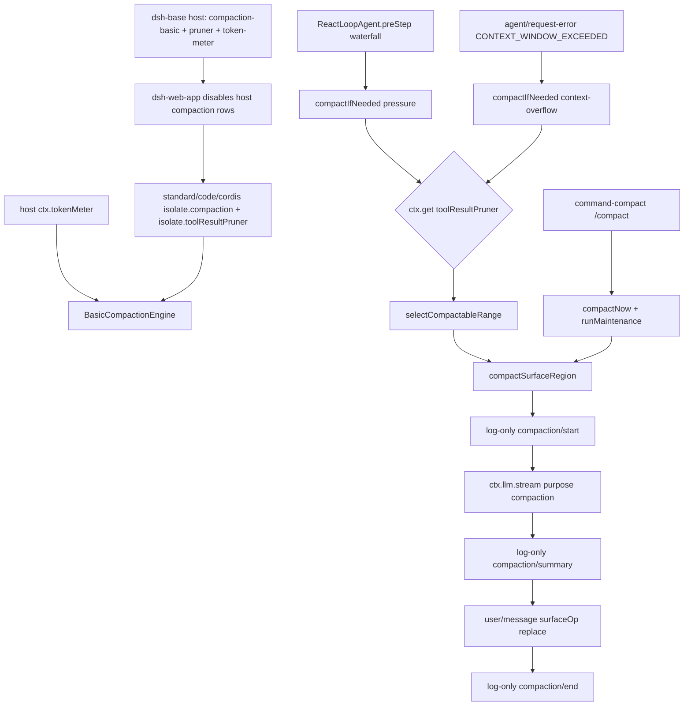

> `BasicCompactionEngine` 是 `ctx.compaction` 的 shipped **Provider**：`auto` 默认 `true` 时挂 `agent/pre-step` / `agent/request-error`，用 host `ctx.tokenMeter.measure(session).totalTokens` 做压力门，可选 `ctx.get('toolResultPruner')` 先做 model-free 裁剪，再经 `selectCompactableRange` + `compactSurfaceRegion` 落地**唯一**的 surface 变更 `user/message` + `surfaceOp: { op: 'replace', start, end }`。这是 Cordis 组合运行时（`profile → bundle → agent preset`）里可替换的策略实现，不是 loop 内置的 history rewriter。默认产品路径是本地 Web GUI（`dsh web`）；本仓没有 shipped TUI。

## 能回答的问题

- `thresholdRatio` / `retainRatio` 默认值是多少？`retainTokens` 怎样覆盖比例？`retainRatio >= thresholdRatio` 会怎样？
- `agent/pre-step` 的 `pressure` 与 `agent/request-error` 的 `CONTEXT_WINDOW_EXCEEDED` 各跳过什么、各保留多少尾巴？
- `selectCompactableRange` 从哪头累加 token？pairing 不平衡时怎样把头切线往更早推？
- `compactSurfaceRegion` 的锁是哪条 log-only 事件？哪一条才改 surface？自动路径与 `/compact` 的 `owner` / `stability` / `flush` 差在哪？
- `ToolResultPruner` 默认字符预算是什么？它对单条 `tool/result` 发什么 `surfaceOp`，前一条 log-only 事件叫什么？
- `dsh web` 上 compaction 组挂在 host 面还是 agent-preset 面？`tokenMeter` 为什么不进 isolate？`minimal` 挂不挂？

## 职责边界

本包拥有：`BasicCompactionEngine`（服务名仍是 Definition 钉死的 `compaction`）、load-time `resolveConfig` / `resolveTargetPolicy` / `resolveCompactSpec`、选段 `selectCompactableRange`、落地事务 `compactSurfaceRegion`、默认 summarizer `summarizeWithLlm`（`purpose: 'compaction'`）、以及可选 sibling `ToolResultPruner`（`ctx.toolResultPruner`）。

本包**不**拥有：

- `CompactionEngine` 抽象合同、`ManualCompactionError.code` 词表、`compactCheckpointSource` 的 plugin 名（`'compact'` 不是 `'compaction'`）—— [`subsys.context.compaction`](./compaction.md)。
- host 面计量与 4 chars/token 启发式 —— [`subsys.llm.token-meter`](../llm/token-meter.md)。本页只消费 `measure` / `estimateMessage`。
- append-only `SessionEvent` 日志、`SurfaceOp` 封闭联合、`deriveMessages()` —— [`subsys.core.session`](../core/session.md) / [`spine.session-log`](../../spine/session-log.md)。
- 何时开 `pre-step`、何时把 `{ kind: 'retry' }` 折回下一步 —— [`subsys.core.agent-loop`](../core/agent-loop.md)。
- `/compact` 人命令注册与文案 —— `command-compact` 只点到 `ctx.compaction.compactNow`，不在本页做人命令表。
- preset 发现 / `leakedServices` 机制本身 —— [`subsys.composition.agent-presets`](../composition/agent-presets.md)。

## 关键文件

| 路径 | 角色 |
|---|---|
| `packages/compaction/compaction-basic/src/index.ts` | `BasicCompactionEngine`：`inject`、`auto` 监听、`compactIfNeeded` / `compactRegion` / `compactNow` |
| `packages/compaction/compaction-basic/src/config.ts` | `resolveConfig` 默认 `0.8` / `0.16`；`retainRatio` 必须严格小于 `thresholdRatio` |
| `packages/compaction/compaction-basic/src/region.ts` | `selectCompactableRange`；`compactSurfaceRegion` 事务 |
| `packages/compaction/compaction-basic/src/summarizer.ts` | `summarizeWithLlm`（`purpose: 'compaction'`）；`frameSummary` |
| `packages/compaction/compaction-basic/src/types.ts` | `BasicCompactionConfig` / `ResolvedCompactSpec` |
| `packages/compaction/compaction-tool-result-pruner/src/index.ts` | `ToolResultPruner.pruneSession`：log-only `compaction/prune` + 单条 `replace` |
| `packages/compaction/compaction-tool-result-pruner/src/config.ts` | `DEFAULTS`：`8192` / `4096` / `1024` |
| `packages/compaction/compaction/src/index.ts` | Definition：`super(ctx, 'compaction')` |
| `packages/compaction/command-compact/src/index.ts` | Consumer：`/compact` → `compactNow` |
| `packages/bundle/base/cordis.patch.yml` | host 面挂 backend 行 |
| `packages/bundle/web-app/cordis.patch.yml` | 把那组 host 行 `disabled: true`；**不** disable `token-meter` |
| `apps/cli/config/agent-presets/{standard,code,cordis}/agent.cordis.yml` | agent-preset 面 isolate 重挂 |
| `apps/cli/config/agent-presets/minimal/agent.cordis.yml` | **不**挂 compaction 组 |

## 数据模型

| 符号 | 要点 |
|---|---|
| `BasicCompactionConfig` | 顶层政策 + 可选 `modelPolicies[]`（精确 `provider`/`model`）+ `auto`。未知键 load 失败。 [E: packages/compaction/compaction-basic/src/types.ts:38] [E: packages/compaction/compaction-basic/src/config.ts:68] |
| `resolveConfig` 默认 | `thresholdRatio = 0.8`、`retainRatio = 0.16`、`maxTokens = 8192`、`compactionRetries = 1`、`maxOverflowRetries = 1`、`auto = true`、空 summarization 对（继承对话路由）。空配置测试钉死这组数。 [E: packages/compaction/compaction-basic/src/config.ts:20] [E: packages/compaction/compaction-basic/src/config.ts:23] [E: packages/compaction/compaction-basic/src/config.ts:91] [E: packages/compaction/compaction-basic/src/config.ts:92] [E: packages/compaction/compaction-basic/src/config.ts:93] [E: packages/compaction/compaction-basic/src/config.ts:95] [E: packages/compaction/compaction-basic/tests/compaction-basic.spec.ts:292] |
| `ResolvedRetention` | 恰好一种：`retainRatio` **或** `retainTokens`。两者同时出现 load 失败。 [E: packages/compaction/compaction-basic/src/config.ts:241] |
| 比例不变量 | `retainRatio` 必须**严格小于**已解析 `thresholdRatio`，否则 load 失败。缩放后若 `retainTokens >= thresholdTokens`，压力路径抛 `TargetPressureConfigError`。 [E: packages/compaction/compaction-basic/src/config.ts:185] [E: packages/compaction/compaction-basic/src/config.ts:148] [E: packages/compaction/compaction-basic/tests/compaction-basic.spec.ts:427] |
| `ResolvedCompactSpec` | `thresholdTokens = floor(contextWindow × thresholdRatio)`；未给绝对 `retainTokens` 时 `retainTokens = floor(contextWindow × retainRatio)`。 [E: packages/compaction/compaction-basic/src/config.ts:144] [E: packages/compaction/compaction-basic/src/config.ts:146] |
| `CompactionTrigger` | `'pressure'` \| `'context-overflow'`。 [E: packages/compaction/compaction/src/index.ts:25] |
| `SurfaceOp` | `'append'` 或 `{ op: 'replace', start, end }`（闭区间）。**没有 delete。** [E: packages/core/session/src/types.ts:372] [E: packages/core/session/src/types.ts:373] [E: packages/core/session/src/types.ts:374] |
| `compaction/start\|summary\|end\|prune` | log-only，不能带 `surfaceOp`、不能上 surface。模型看见的是后一条带 `replace` 的 `user/message`（摘要）或单条被裁的 `tool/result`。 [E: packages/compaction/compaction/src/types.ts:23] [E: packages/compaction/compaction/src/types.ts:33] [E: packages/compaction/compaction/src/types.ts:71] [E: packages/compaction/compaction/src/types.ts:81] |
| checkpoint `source` | `compactCheckpointSource` 的 marker 是 `{ kind: 'plugin', plugin: 'compact' }`。 [E: packages/compaction/compaction/src/checkpoint.ts:19] |
| `ToolResultPruneConfig` | 默认 `thresholdChars: 8192` / `headChars: 4096` / `tailChars: 1024`。`head + marker + tail` 不得超过 `thresholdChars`。 [E: packages/compaction/compaction-tool-result-pruner/src/config.ts:11] [E: packages/compaction/compaction-tool-result-pruner/src/config.ts:12] [E: packages/compaction/compaction-tool-result-pruner/src/config.ts:13] [E: packages/compaction/compaction-tool-result-pruner/tests/tool-result-pruner.spec.ts:82] |
| `PRUNE_MARKER` | `'\n\n[... tool result middle pruned ...]\n\n'`。按 Unicode code point 切，不拆 surrogate。 [E: packages/compaction/compaction-tool-result-pruner/src/config.ts:7] |

## 控制流

1. **Definition 由 Provider 自己 `provide`。** `@deepseek-ai/dsh-compaction` 的 `CompactionEngine` 构造函数 `super(ctx, 'compaction')`，没有单独的空 Definition 插件行。`BasicCompactionEngine` `extends CompactionEngine`，`static inject = ['llm', 'tokenMeter', 'sessions']`，构造里 `super(ctx)` 后再 `resolveConfig`。`tokenMeter` 解析 **host** 那一个实例。 [E: packages/compaction/compaction/src/index.ts:98] [E: packages/compaction/compaction-basic/src/index.ts:103] [E: packages/compaction/compaction-basic/src/index.ts:104] [E: packages/compaction/compaction-basic/src/index.ts:127] [E: packages/compaction/compaction-basic/src/index.ts:128]

2. **host 面先挂一行。** `dsh-base` 插入 `id: token-meter`、`id: compaction-basic`、`id: command-compact`、`id: tool-result-pruner`（显式 `8192` / `4096` / `1024`）。这是进程级组合，不是 per-session preset。 [E: packages/bundle/base/cordis.patch.yml:281] [E: packages/bundle/base/cordis.patch.yml:284] [E: packages/bundle/base/cordis.patch.yml:289] [E: packages/bundle/base/cordis.patch.yml:360] [E: packages/bundle/base/cordis.patch.yml:363] [E: packages/bundle/base/cordis.patch.yml:364] [E: packages/bundle/base/cordis.patch.yml:365]

3. **`dsh-web-app` 关掉 host 上的 compaction 组，留下 meter。** overlay 把 `compaction-basic` / `command-compact` / `tool-result-pruner` 标 `disabled: true`。`token-meter` **没有** disable 行。默认产品路径 `dsh web` 不允许这组服务落在 root realm：第二会话会撞名，浏览器读到的 meter 投影也必须跟「当前挂了哪个 preset」解耦。 [E: packages/bundle/web-app/cordis.patch.yml:358] [E: packages/bundle/web-app/cordis.patch.yml:359] [E: packages/bundle/web-app/cordis.patch.yml:361] [E: packages/bundle/web-app/cordis.patch.yml:362] [E: packages/bundle/web-app/cordis.patch.yml:364] [E: packages/bundle/web-app/cordis.patch.yml:365]

4. **`standard` / `code` / `cordis` 在 agent-preset 面 isolate 重挂。** 组 `id: compaction`，`isolate.compaction: true` + `isolate.toolResultPruner: true`，组内是 `compaction-basic` + `command-compact` + `tool-result-pruner`（同样 `8192` / `4096` / `1024`）。isolate 键里**没有** `tokenMeter`：`inject: ['tokenMeter']` 继续解析 host 单例。`minimal` 的 `agent.cordis.yml` **没有** `id: compaction` / `compaction-basic` / `command-compact` / `tool-result-pruner`，该预设不压历史。 [E: apps/cli/config/agent-presets/standard/agent.cordis.yml:137] [E: apps/cli/config/agent-presets/standard/agent.cordis.yml:141] [E: apps/cli/config/agent-presets/standard/agent.cordis.yml:142] [E: apps/cli/config/agent-presets/standard/agent.cordis.yml:144] [E: apps/cli/config/agent-presets/standard/agent.cordis.yml:147] [E: apps/cli/config/agent-presets/standard/agent.cordis.yml:150] [E: apps/cli/config/agent-presets/code/agent.cordis.yml:148] [E: apps/cli/config/agent-presets/code/agent.cordis.yml:149] [E: apps/cli/config/agent-presets/cordis/agent.cordis.yml:129] [E: apps/cli/config/agent-presets/cordis/agent.cordis.yml:130] [I]

5. **preset 行若不 isolate 就会被 `leakedServices` 拒。** `mountPreset` 在 subtree settle 后扫实现落在 root isolate 符号上的服务名；非空则抛，要求该行 `isolate` 或把服务搬回 host。compaction / pruner 必须进组内 realm；`tokenMeter` 故意留在 host，preset **不要**再插一行 `token-meter`。 [E: packages/preset/agent-presets/src/mount.ts:361] [E: packages/preset/agent-presets/src/mount.ts:364]

6. **`auto ?? true` 时注册两条 waterfall。** 构造若 `this.config.auto` 为真，调用 `_registerAutomaticCompaction`。`agent/pre-step`：信号未 abort 则 `await this.compactIfNeeded(agent, 'pressure', signal)`，失败只 `logger.warn` 并继续；**必须** `return next()`。`Events.waterfall` 把最后一个参数当 innermost `next`：不调用传入的 `next()` 就不会 `cbs.shift()`，内层 `ReactLoopAgent.preStep` 的默认 `enter` 决策也不跑，本步停住。`agent/request-error` 只认 `failure.code === CONTEXT_WINDOW_EXCEEDED_CODE`（字面量 `'CONTEXT_WINDOW_EXCEEDED'`）；其它错误或已 abort 直接 `next()`。 [E: packages/compaction/compaction-basic/src/index.ts:129] [E: packages/compaction/compaction-basic/src/index.ts:153] [E: packages/compaction/compaction-basic/src/index.ts:164] [E: vendor/cordis/src/events.ts:238] [E: packages/compaction/compaction-basic/src/index.ts:183] [E: packages/llm/llm/src/error.ts:25] [E: packages/core/agent-loop/src/agent.ts:235] [E: packages/compaction/compaction-basic/tests/compaction-basic.spec.ts:1473]

7. **`compactIfNeeded` 先要一条已路由信封。** `routedTarget` 读 `session.requestHeader()?.config` 的非空 `provider` / `model`；没有就 `null`（不抛）。随后 `meter.measure(agent.session)`。pruner 是可选 sibling：`this.ctx.get('toolResultPruner')`，不是 `inject`，缺席时走原 surface。 [E: packages/compaction/compaction-basic/src/index.ts:264] [E: packages/compaction/compaction-basic/src/index.ts:267] [E: packages/compaction/compaction-basic/src/index.ts:281] [E: packages/llm/token-meter/src/index.ts:143]

8. **`pressure`：先比阈值，够格才 prune。** 调 `ctx.llm.resolveModelInfo` 取 `context.contextWindow`；没有容量抛 `TargetPressureConfigError`（同 `provider/model` 只 warn 一次）。`assertNoActiveCompaction` 看未配对的 `compaction/start`。`totalTokens < thresholdTokens` 直接 `null`，**不会**顺手 prune。过阈后若 pruner 在，先 `pruneSession` 再 `measure` 一次；剪完已低于阈值则返回 `null`（surface 可能已被单条 `replace` 改过）。仍超阈则最多 `compactionRetries + 1` 轮：`selectCompactableRange(..., retainTokens)` → `compactRegion`。 [E: packages/compaction/compaction-basic/src/index.ts:293] [E: packages/compaction/compaction-basic/src/index.ts:304] [E: packages/compaction/compaction-basic/src/index.ts:308] [E: packages/compaction/compaction-basic/src/index.ts:312] [E: packages/compaction/compaction-basic/src/index.ts:316] [E: packages/compaction/compaction-basic/tests/compaction-basic.spec.ts:784] [E: packages/compaction/compaction-basic/tests/compaction-basic.spec.ts:800]

9. **`context-overflow`：跳过阈值，`retainTokens = 0`。** 这条分支不读 `contextWindow`、不比 `thresholdTokens`。有 pruner 就先裁。然后 `selectCompactableRange(session, measurement, 0)`：从尾巴累加，`0` 预算让「保留尾巴」在第一枚节点就满足，可压区间是头段到配对平衡的 cutoff。选不到（整表都得留，例如只剩一对不可拆的 tool-call/result）返回 `null`。 [E: packages/compaction/compaction-basic/src/index.ts:283] [E: packages/compaction/compaction-basic/src/index.ts:288] [E: packages/compaction/compaction-basic/tests/compaction-basic.spec.ts:603]

10. **overflow 恢复看 `replaceGeneration`，不看摘要是否成功。** listener 先记下 `session.surface.replaceGeneration`。`compactIfNeeded` 抛错但 generation 已前进（典型：prune 已落地、后续 summary 失败）仍 `{ kind: 'retry' }`。成功路径同样要求 generation 前进才 retry，并累加 `overflowRetries`；达到 `maxOverflowRetries` 则 `next()`，把原始 `CONTEXT_WINDOW_EXCEEDED` 交回。`agent/status === 'idle'` 或随后一条 `assistant/message` 清掉计数。loop 侧：`action?.kind === 'retry'` 则 `continue` 同一步，否则把 failure 再抛出去。 [E: packages/compaction/compaction-basic/src/index.ts:189] [E: packages/compaction/compaction-basic/src/index.ts:191] [E: packages/compaction/compaction-basic/src/index.ts:201] [E: packages/compaction/compaction-basic/src/index.ts:207] [E: packages/compaction/compaction-basic/src/index.ts:219] [E: packages/core/agent-loop/src/agent.ts:367] [E: packages/compaction/compaction-basic/tests/compaction-basic.spec.ts:1567] [E: packages/compaction/compaction-basic/tests/compaction-basic.spec.ts:1586]

11. **`selectCompactableRange`：从 surface 尾部往回累加 token。** 先要求 `measurement.nodes` 的 seq 与当前 `session.surface.nodes` 逐位相同。自尾向头加 `pricedNodes[i].tokens`，直到 `accumulated >= retainTokens`，`keepFromIdx` 落在这条「刚够预算」的节点上。然后 `while` 用 `toolPairingBalancedBefore(session, surfaceNodes[keepFromIdx])` 把头切线再往更早推，避免切断 assistant tool-call 与 `tool/result`。`keepFromIdx === 0`（整表都得留）返回 `null`；否则 `{ start: first, end: cutoff }`，cutoff 是 `keepFromIdx - 1` 那个 seq。 [E: packages/compaction/compaction-basic/src/region.ts:107] [E: packages/compaction/compaction-basic/src/region.ts:114] [E: packages/compaction/compaction-basic/src/region.ts:118] [E: packages/compaction/compaction-basic/src/region.ts:124] [E: packages/compaction/compaction/src/tool-pairing.ts:117] [E: packages/compaction/compaction-basic/tests/compaction-basic.spec.ts:719]

12. **`compactSurfaceRegion` 是唯一摘要落地事务。** 只读校验：起止 seq 必须在当前 surface、起 ≤ 止、两端 `toolPairingBalancedBefore` / `After`。再扫 log 看未配对 `compaction/start`（锁）与是否有开着的 turn。然后**同步** `session.append('compaction/start', { compactionId, turn })`——这条 marker 就是锁，摘要 yield 之前已经耐久。summarizer 用最近一次 `requestHeader()` 的 `system` / `tools` 加上被遮挡区间的 `deriveEventMessage` 当前缀，再追加 compaction instruction；`ctx.llm.stream(..., purpose: 'compaction')`。成帧后的 checkpoint 必须比被遮挡区间更短，否则抛错。随后 log-only `compaction/summary`，紧接着**唯一 surface 变更**：`user/message` + `surfaceOp: { op: 'replace', start, end }` + `sourceEventSeqs` 引用 start/summary/被遮挡 seq。最后 `compaction/end`。失败路径尽量再补一条带 `error` 的 `end`；`end` 自己失败则留下可检测的未配对 `start`。 [E: packages/compaction/compaction-basic/src/region.ts:189] [E: packages/compaction/compaction-basic/src/region.ts:327] [E: packages/compaction/compaction-basic/src/region.ts:331] [E: packages/compaction/compaction-basic/src/summarizer.ts:161] [E: packages/compaction/compaction-basic/src/summarizer.ts:164] [E: packages/compaction/compaction-basic/src/region.ts:374] [E: packages/compaction/compaction-basic/src/region.ts:447] [E: packages/compaction/compaction-basic/src/region.ts:462] [E: packages/compaction/compaction-basic/src/region.ts:463] [E: packages/compaction/compaction-basic/src/region.ts:215]

13. **自动 vs `/compact` 的 owner / 稳定性 / flush。** `compactRegion`（`pressure` / overflow / 显式选段）传 `{ owner: 'current-turn', stability: 'whole-surface' }`：必须有开 turn，`turn` 写成该编号；摘要期间整表 `measurement.nodes` 必须深等。`compactNow` 走 `agent.runMaintenance`：同步抢 idle，失败映射 `ManualCompactionError` / `busy`；选段用 `retainTokens = 0`；事务 `{ owner: null, stability: 'selected-span', flush: () => sessions.flush(session) }`。`owner: null` 禁止开着的 turn；只要求被选 span 仍是同一组 seq、同一价格、仍平衡——span 外新增节点不否决。成功闭括号之后才 `flush`。人命令 `/compact` 是 Consumer：`command-compact` `inject = ['commands', 'compaction']`，`executeCompact` 调 `ctx.compaction.compactNow(...)`，不经模型 turn。 [E: packages/compaction/compaction-basic/src/index.ts:355] [E: packages/compaction/compaction-basic/src/index.ts:375] [E: packages/compaction/compaction-basic/src/index.ts:392] [E: packages/compaction/compaction-basic/src/index.ts:393] [E: packages/compaction/compaction-basic/src/index.ts:396] [E: packages/compaction/command-compact/src/index.ts:11] [E: packages/compaction/command-compact/src/index.ts:66] [E: packages/compaction/compaction-basic/tests/manual-compaction.spec.ts:404] [E: packages/compaction/compaction-basic/tests/manual-compaction.spec.ts:414]

14. **pruner 是 model-free 的单节点 `replace`。** `ToolResultPruner` `super(ctx, 'toolResultPruner')`，`inject = ['tokenMeter']`。`pruneSession` 快照当前 surface 上每条 `tool/result`；`pruneContent` 按 code point 留 head/tail、中间换 `PRUNE_MARKER`。对每条过预算结果：先 log-only `compaction/prune`（`shadowedRange: { start: seq, end: seq }`，`shadowedTokenCount` 来自 `tokenMeter.estimateMessage`），**同步相邻**再 `append('tool/result', …, { surfaceOp: { op: 'replace', start: seq, end: seq } })`。其它 data 字段原样保留，只改 `content`。没有 summarizer，不碰 `compaction/start`。 [E: packages/compaction/compaction-tool-result-pruner/src/index.ts:47] [E: packages/compaction/compaction-tool-result-pruner/src/index.ts:59] [E: packages/compaction/compaction-tool-result-pruner/src/index.ts:162] [E: packages/compaction/compaction-tool-result-pruner/src/index.ts:171] [E: packages/compaction/compaction-tool-result-pruner/tests/tool-result-pruner.spec.ts:210] [E: packages/compaction/compaction-tool-result-pruner/tests/tool-result-pruner.spec.ts:219]

## 设计动机

- **策略在 Provider，计量在 host。** 换「压不压、压哪套阈值」= 换 preset 行或 `auto: false`，不是改 `ReactLoopAgent`。`tokenMeter` 按 `Session` 分 fold、还登记浏览器投影单元；跟 preset 进 isolate 会让投影表随「此刻挂了哪个 preset」出现或消失。
- **落地只有 replace。** `SurfaceOp` 封闭联合没有 delete。`compaction/*` 全部 log-only，人读 UI 仍能看见当初 append 的原文；模型下一轮只看见 `deriveMessages()` 折叠后的 nodes。prune 与摘要遵守同一条 shadow-price 协议：计量事件与 `replace` 同步相邻。
- **摘要复用对话前缀。** `summarizeWithLlm` 不换一套 system prompt，而是 replay 被压区间的 messages 再追加 instruction，目的是保住 provider KV cache。`purpose: 'compaction'` 把这次辅助调用从普通对话流里标出来。
- **压力失败不阻断 turn；overflow 必须有耐久进展才 retry。** 自动 `pressure` 是尽力而为。provider 已经确认窗口爆了，只要 prune 或 replace 让 `replaceGeneration` 前进，即使 summary 失败也可以再打一枪。
- **pruner 可选、懒取。** `ctx.get('toolResultPruner')` 让 `compaction-basic` 在测试和最小组合里单独可加载；shipped `standard` / `code` / `cordis` 把两者放进**同一** isolate，这样 `get` 看得到 sibling，而不是 host 上那份已被 web-app disable 的行。

## Gotcha

- **没有 delete。** 想拿掉一段模型历史，只能 `surfaceOp: { op: 'replace', start, end }`。`this.log` 永远变长。`start === end` 是 pruner 的单节点裁剪，不是抹除。
- **`retainRatio` 在 load 就校验，不是第一轮 step。** `0.16 >= 0.8` 过不了；只改 `thresholdRatio: 0.1` 而继承默认 `0.16` 同样失败。绝对 `retainTokens` 与窗口相乘后的冲突要等到 `resolveCompactSpec`。 [E: packages/compaction/compaction-basic/src/config.ts:185] [E: packages/compaction/compaction-basic/tests/loader-composition.spec.ts:116]
- **没有 routed `provider`/`model` 就静默 `null`。** 空会话、还没写下 `request/header` 时，`pressure` / overflow 都不会压。overflow listener 在 `routedTarget === undefined` 时也直接 `next()`。 [E: packages/compaction/compaction-basic/src/index.ts:264] [E: packages/compaction/compaction-basic/src/index.ts:186]
- **阈值以下不 prune。** 大 `tool/result` 若整表仍低于 `thresholdTokens`，`pressure` 不会为了「顺便瘦一点」去调 `pruneSession`。overflow 才会无条件先裁。 [E: packages/compaction/compaction-basic/tests/compaction-basic.spec.ts:784]
- **`auto: false` 卸掉两条 listener。** 构造不再 `_registerAutomaticCompaction`。Loader 测试可以只挂服务、用人调 `compactIfNeeded`。shipped 行不写 `auto`，走默认 `true`。 [E: packages/compaction/compaction-basic/src/index.ts:129]
- **自动路径要求开 turn + 整表稳定。** 关着的 turn 调 `compactRegion` 抛 `no open turn`。摘要期间任何 surface 重写（含 pruner 再跑）都会 `SurfaceChangedError`。`/compact` 只锁选中 span，摘要期间 inject 进 inbox 的上下文可以等下一 step 再 append。 [E: packages/compaction/compaction-basic/tests/compaction-basic.spec.ts:946] [E: packages/compaction/compaction-basic/src/region.ts:394]
- **`pre-step` 漏 `next()` = 停步。** 压力路径即使 warn 也必须 `return next()`。overflow 成功时**故意**不 `next()`，而是返回 `{ kind: 'retry' }` 短路径；这是恢复决策，不是漏调。 [E: packages/compaction/compaction-basic/src/index.ts:164] [E: packages/compaction/compaction-basic/src/index.ts:222] [E: vendor/cordis/src/events.ts:238]
- **`tokenMeter` 不得进 isolate。** shipped 组只 isolate `compaction` 与 `toolResultPruner`。再挂一行 `token-meter` 且不 isolate → `leakedServices`；isolate 它 → host / 浏览器投影看不见。正确做法是根本不挂第二行。 [E: apps/cli/config/agent-presets/standard/agent.cordis.yml:141] [E: apps/cli/config/agent-presets/standard/agent.cordis.yml:142]
- **`minimal` 与 headless 都不是「web + standard」那条树。** `minimal` 不挂 compaction 组。[I] `dsh-headless` 的 `cordis.patch.yml` 也没有 disable 这三行，因此 headless 继续用 `dsh-base` 的 **host 面** backend（headless 还不挂 `agent-presets`）。不要把「默认 `dsh web`」读成「所有 profile 都 isolate 重挂」。
- **摘要必须更短，且只要 text。** 成帧后的启发式 token ≥ 被遮挡区间会抛；image 块是 `UNSUPPORTED_CONTENT`；`max-tokens` finish 当失败（不完整 checkpoint）。 [E: packages/compaction/compaction-basic/src/region.ts:374] [E: packages/compaction/compaction-basic/src/summarizer.ts:206]
- **checkpoint plugin 名是 `compact`。** 认 marker 不要写成 `compaction`。 [E: packages/compaction/compaction/src/checkpoint.ts:19]

## Seam 三角

| 角色 | 包 | ctx 键 / 合同 | bundle / preset 行 |
|---|---|---|---|
| Definition | `@deepseek-ai/dsh-compaction` 的 `CompactionEngine` | `ctx.compaction`；`compactIfNeeded` / `compactNow` / `compactRegion`；`compaction/*` 事件形状 | 无空 Definition 行。Provider 自己 `super(ctx, 'compaction')` |
| Provider | `@deepseek-ai/dsh-compaction-basic` 的 `BasicCompactionEngine`；可选 `@deepseek-ai/dsh-compaction-tool-result-pruner` 的 `ToolResultPruner` | `ctx.compaction`；`ctx.toolResultPruner`（`ctx.get`，可缺） | `dsh-base` host 行。`dsh-web-app` disable 这组（留下 `token-meter`）。`standard` / `code` / `cordis` 在 `isolate.compaction` + `isolate.toolResultPruner` 里重挂。`minimal` 不挂 |
| Consumer | `dsh-agent-loop`（`agent/pre-step` / `agent/request-error` waterfall）；`dsh-command-compact`（`/compact` → `compactNow`）；host `ctx.tokenMeter`（被 inject，不是 Consumer 挂事件） | 必须 `next()` 才会 `shift`（overflow 成功返回 `{ kind: 'retry' }` 除外） | loop / meter 是 host 行。`command-compact` 跟 backend 进同一 isolate 组 |

换 summarizer = 子类覆盖 `summarize()`；换计量 = 换 host `tokenMeter`，不要在 preset 再 provide 一份。换「这个会话压不压」= 换 preset（或 `minimal`）。

## Sources

- packages/compaction/compaction-basic/src/index.ts
- packages/compaction/compaction-basic/src/region.ts
- packages/compaction/compaction-basic/src/config.ts
- packages/compaction/compaction-basic/src/summarizer.ts
- packages/compaction/compaction-basic/src/types.ts
- packages/compaction/compaction-basic/tests/compaction-basic.spec.ts
- packages/compaction/compaction-basic/tests/manual-compaction.spec.ts
- packages/compaction/compaction-basic/tests/loader-composition.spec.ts
- packages/compaction/compaction-tool-result-pruner/src/index.ts
- packages/compaction/compaction-tool-result-pruner/src/config.ts
- packages/compaction/compaction-tool-result-pruner/tests/tool-result-pruner.spec.ts
- packages/compaction/compaction/src/index.ts
- packages/compaction/compaction/src/types.ts
- packages/compaction/compaction/src/checkpoint.ts
- packages/compaction/compaction/src/tool-pairing.ts
- packages/compaction/command-compact/src/index.ts
- packages/core/session/src/types.ts
- packages/core/agent-loop/src/agent.ts
- packages/llm/token-meter/src/index.ts
- packages/llm/llm/src/error.ts
- packages/preset/agent-presets/src/mount.ts
- packages/bundle/base/cordis.patch.yml
- packages/bundle/web-app/cordis.patch.yml
- apps/cli/config/agent-presets/standard/agent.cordis.yml
- apps/cli/config/agent-presets/code/agent.cordis.yml
- apps/cli/config/agent-presets/cordis/agent.cordis.yml
- apps/cli/config/agent-presets/minimal/agent.cordis.yml
- vendor/cordis/src/events.ts

## 相关

- [`spine.context-and-compaction`](../../spine/context-and-compaction.md) — 装配 / 指令 / 压缩端到端；本页是其中 Provider 选段与事务。
- [`subsys.context.compaction`](./compaction.md) — `ctx.compaction` 缝、`ManualCompactionError`、`compactCheckpointSource`。
- [`subsys.llm.token-meter`](../llm/token-meter.md) — host `measure` / 启发式；`tokenMeter` 为什么不进 isolate。
- [`spine.session-log`](../../spine/session-log.md) — append-only log、`deriveMessages`、三类 surface。
- [`subsys.core.agent-loop`](../core/agent-loop.md) — `preStep` waterfall 与 `request-error` 的 `{ kind: 'retry' }`。
- [`subsys.composition.agent-presets`](../composition/agent-presets.md) — standing mount、`leakedServices`、isolate 组。
- [`spine.overview`](../../spine/overview.md) — `profile → bundle → preset`；host 面 vs agent-preset 面。
- [`subsys.core.session`](../core/session.md) — `SurfaceOp` 只有 append / replace；`compaction/*` 不能上 surface。
- [`subsys.composition.bundle-web-app`](../composition/bundle-web-app.md) — web overlay 谁 `disabled: true`、谁留在 host。
