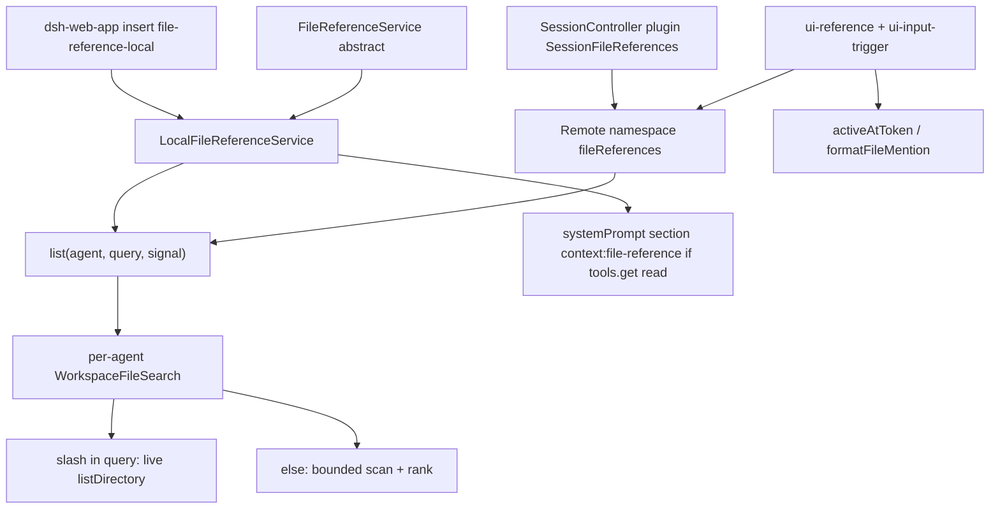

> `ctx.fileReferences` 是 **path-only `@file` 发现缝**：Definition 包 `@deepseek-ai/dsh-file-reference` 声明抽象 `FileReferenceService.list()` 与浏览器安全的 `@` 语法；shipped Provider 是 `@deepseek-ai/dsh-file-reference-local`（`LocalFileReferenceService`），**只挂在 `dsh-web-app`**。候选不含文件内容；模型要读盘仍走 [`surface.tools.read`](../../surface/tools/read.md)。Host 再经 `SessionFileReferences` 把同一 `list` 暴露成 Remote namespace `'fileReferences'`。

## 能回答的问题

- `ctx.fileReferences` 在不在 `dsh-base` / `dsh-web-app` / headless·sdk·acp / 四个 shipped preset？
- `FileReferenceCandidate` 有哪些字段？`list()` 会不会读文件内容？
- `@path` / `@"path with spaces"` 怎么从光标切 token？email 里的 `@` 会不会触发？
- `WorkspaceFileSearch` 默认 `maxResults` / `maxEntries` / 排除哪些目录 basename？目录查询与全局 fuzzy 走哪条路径？
- 目录 symlink、`../`、隐藏文件、`tool/result` 之后的索引失效各怎么处理？
- `FILE_REFERENCE_PROMPT` 何时进 system prompt？没有 `read` 工具时呢？
- Host RPC 的 `sessionFileReferences` 与本缝什么关系？

## 职责边界

本缝拥有：Cordis 键 `fileReferences`、抽象 `FileReferenceService`、`FileReferenceCandidate`、`FILE_REFERENCE_PROMPT`、纯函数 `activeAtToken` / `formatFileMention`、本地 Provider `LocalFileReferenceService` + 每 agent 一份 `WorkspaceFileSearch`。 [E: packages/context/file-reference/src/index.ts:21] [E: packages/context/file-reference/src/index.ts:26] [E: packages/context/file-reference/src/types.ts:8] [E: packages/context/file-reference-local/src/index.ts:44]

本缝**不**拥有：

- 跨会话 `@session` 快照 —— [`subsys.context.session-reference`](session-reference.md)。Web `@` 菜单把两种候选拼在同一 trigger 源里。
- 模型可见 `read` 字段表 —— [`surface.tools.read`](../../surface/tools/read.md)。本页只在 prompt 里要求「先 read 再声称看过」。
- `SECTION_ORDERS.FILE_REFERENCE` 数值 —— [`subsys.core.system-prompt`](../core/system-prompt.md)。本 Provider 只调 `getSectionOrder('FILE_REFERENCE')`。
- Host Remote 键 `ctx.sessionFileReferences` 与 namespace `'fileReferences'` —— session-controller 适配器（见 [`ref.ctx-keys`](../../reference/ctx-keys.md)）；本页不把它写进 `symbols`。
- `DELIVERABLE_FILE_REFERENCES`（ui-deliverables 让模型在成功写盘后点名产物）—— 另一段 prompt，不是 `@file` 发现。

DSH 是 Cordis 组合运行时（`profile → bundle → agent preset`）。五个 shipped profile：`web` / `headless` / `sdk` / `sdk-minimal` / `acp`。四个 shipped preset：`minimal` / `standard` / `ptc` / `cordis`。

## 关键文件

| 路径 | 角色 |
|---|---|
| `packages/context/file-reference/src/index.ts` | 抽象 `FileReferenceService`、`FILE_REFERENCE_PROMPT`、`ctx.fileReferences` |
| `packages/context/file-reference/src/types.ts` | `FileReferenceCandidate`（Remote 客户端可单独 import） |
| `packages/context/file-reference/src/grammar.ts` | `activeAtToken` / `formatFileMention` |
| `packages/context/file-reference-local/src/index.ts` | `LocalFileReferenceService`：config、per-agent index、prompt 段 |
| `packages/context/file-reference-local/src/search.ts` | `WorkspaceFileSearch` 与默认预算 / 排除表 |
| `packages/bundle/web-app/cordis.patch.yml` | shipped **host** 插入 `id: file-reference-local` |
| `packages/api/session-controller/src/file-references.ts` | `SessionFileReferences`：`@Remote list` → `ctx.fileReferences.list` |
| `packages/client/ui-reference/src/client/index.ts` | `@` 菜单调 `remote.fileReferences.list` |
| `packages/client/ui-input-trigger/src/core/detect.ts` | caret 检测复用 `activeAtToken` |

## 数据模型

| 符号 | 要点 |
|---|---|
| `FileReferenceCandidate` | `{ path, kind: 'file' \| 'directory' }`。path 是用户提示与 fs 工具都接受的相对（或显示）路径；目录让补全继续下钻，文件结束 mention。 [E: packages/context/file-reference/src/types.ts:8] [E: packages/context/file-reference/src/types.ts:10] [E: packages/context/file-reference/src/types.ts:12] |
| `FileReferenceService.list` | `(agent, query, signal) => Promise<FileReferenceCandidate[]>`。query 是 `@` / `@" ` 后面的路径文本。抽象类 `super(ctx, 'fileReferences')`，不包装实现。 [E: packages/context/file-reference/src/index.ts:28] [E: packages/context/file-reference/src/index.ts:38] [E: packages/context/file-reference/tests/service.spec.ts:18] |
| `ActiveAtToken` | `{ prefix, query, quoted }`。`prefix` 是整段将被替换的 token。 [E: packages/context/file-reference/src/grammar.ts:10] |
| `FILE_REFERENCE_PROMPT` | 一段英文：`@` 前缀是用户显式点名的 workspace 相对路径；尾斜杠是目录（该 `list`）；其它当文件（先 `read`）；空格路径用 `@"..."`。 [E: packages/context/file-reference/src/index.ts:17] |
| `FileSearchConfig` | `maxResults` / `maxEntries` / `excludedDirectories`。 [E: packages/context/file-reference-local/src/search.ts:50] |

Config 默认（`LocalFileReferenceService.Config` 与构造函数双检）：

| 键 | 默认 | 约束 |
|---|---|---|
| `maxResults` | `DEFAULT_FILE_SEARCH_MAX_RESULTS`（`20`） | 正安全整数。`0` / 非整数 → `file-reference-local: maxResults must be a positive safe integer`。 [E: packages/context/file-reference-local/src/search.ts:16] [E: packages/context/file-reference-local/src/index.ts:47] [E: packages/context/file-reference-local/src/index.ts:129] |
| `maxEntries` | `DEFAULT_FILE_SEARCH_MAX_ENTRIES`（`50_000`） | 正安全整数。 [E: packages/context/file-reference-local/src/search.ts:18] [E: packages/context/file-reference-local/src/index.ts:48] |
| `excludedDirectories` | `DEFAULT_FILE_SEARCH_EXCLUDED_DIRECTORIES` | 非空 basename，不得含 `/` 或 `\`。默认含 `.git`、`node_modules`、`dist`、`build`、`out`、`coverage`、`target`、`.next`、`.nuxt`、`.turbo`、`.venv`、`__pycache__`、`.pytest_cache`、`.mypy_cache`、`.gradle`。**没有** `lib`。 [E: packages/context/file-reference-local/src/search.ts:31] [E: packages/context/file-reference-local/src/index.ts:134] |

## 控制流

1. **Definition 包不 shipped 成独立 cordis 行。** `@deepseek-ai/dsh-file-reference` 声明 `ctx.fileReferences` 与抽象 `list`。 [E: packages/context/file-reference/package.json:2] [E: packages/context/file-reference/src/index.ts:26]

2. **shipped Provider 只在 `dsh-web-app`。** overlay 插入 `id: file-reference-local` / `name: '@deepseek-ai/dsh-file-reference-local'`；`dsh-web-app` 同时依赖 Definition 与 local 包。`dsh-headless` 的 insert 只有 `code-runtime` / `headless-startup` / `headless-runner`。`standard` 的 `agent.cordis.yml` 挂 `persona` 与 `agent-instructions`，四个 shipped preset 都没有 file-reference 行。 [E: packages/bundle/web-app/cordis.patch.yml:67] [E: packages/bundle/web-app/cordis.patch.yml:68] [E: packages/bundle/web-app/package.json:103] [E: packages/bundle/web-app/package.json:104] [E: packages/bundle/headless/cordis.patch.yml:19] [E: packages/preset/agent-presets/presets/standard/agent.cordis.yml:24]

3. **`LocalFileReferenceService` inject `agents`。** `static inject = ['agents']`。构造时对已有 agent 装 prompt fiber，`agent/created` 再装，`agent/disposed` 时 `WorkspaceFileSearch.dispose()` 并卸 prompt。`session/event` 仅当 `event.type === 'tool/result'` 且能 `agents.get(session.id)` 时 `invalidate()`。 [E: packages/context/file-reference-local/src/index.ts:45] [E: packages/context/file-reference-local/src/index.ts:90] [E: packages/context/file-reference-local/src/index.ts:91] [E: packages/context/file-reference-local/src/index.ts:97] [E: packages/context/file-reference-local/src/index.ts:98] [E: packages/context/file-reference-local/tests/service.spec.ts:91]

4. **`list` 按 agent cwd 复用一份搜索。** 首次 `new WorkspaceFileSearch(agent.session.header.cwd ?? process.cwd(), config)`。缺 cwd 的 session 落到 `process.cwd()`。 [E: packages/context/file-reference-local/src/index.ts:120] [E: packages/context/file-reference-local/tests/service.spec.ts:129]

5. **带 `/` 的 query（或空 query）走 live 目录列出。** `list` 把 `\\` 换成 `/`；空串或含 `/` 时切 `directory` + `fragment`，调 `listDirectory`。路径段命中 excluded basename → `[]`。`resolveDisplayDirectory` 拒绝逃出 root（`..`）、跨卷绝对 relative、**目录 symlink**（`lstat` 为 symlink 或非目录则 `undefined`）。点文件：fragment 不以 `.` 开头则跳过 `name.startsWith('.')`。 [E: packages/context/file-reference-local/src/search.ts:117] [E: packages/context/file-reference-local/src/search.ts:119] [E: packages/context/file-reference-local/src/search.ts:239] [E: packages/context/file-reference-local/src/search.ts:265] [E: packages/context/file-reference-local/src/search.ts:275] [E: packages/context/file-reference-local/src/search.ts:245] [E: packages/context/file-reference-local/tests/search.spec.ts:148]

6. **无斜杠的 fuzzy 走有界 BFS 索引。** `scanWorkspace` 最多 `maxEntries`；excluded basename 目录不入队；只收 `isDirectory()` / `isFile()`（文件 symlink 通常不当 regular file）。根 `readdir` 失败会抛（不发表空索引盖住旧条目）；子树失败返回 `[]`。 [E: packages/context/file-reference-local/src/search.ts:204] [E: packages/context/file-reference-local/src/search.ts:222] [E: packages/context/file-reference-local/src/search.ts:215] [E: packages/context/file-reference-local/src/search.ts:299]

7. **失效不挡 caret。** `invalidate` 只加 monotonic 计数。已有 `settled` 时立即返回旧条目，后台 `ensureIndex`；第一次查询才等待遍历。`dispose` 后后续 `list` 返回 `[]`。 [E: packages/context/file-reference-local/src/search.ts:140] [E: packages/context/file-reference-local/src/search.ts:162] [E: packages/context/file-reference-local/src/search.ts:144] [E: packages/context/file-reference-local/tests/search.spec.ts:185]

8. **排序。** 精确 basename `1000`、前缀 `900`、name 包含 `700`、path 包含 `500`、子序列 `300+`；目录 +`25`。同分：目录先于文件，再短 path，再字典序。隐藏路径：query 不以 `.` 且不含 `/.` 时，带 `.` 段的 path 不进全局结果。 [E: packages/context/file-reference-local/src/search.ts:334] [E: packages/context/file-reference-local/src/search.ts:322] [E: packages/context/file-reference-local/src/search.ts:307] [E: packages/context/file-reference-local/tests/search.spec.ts:168]

9. **语法。** `activeAtToken`：行首或空白后的 `@"`… 或 `@[^\s]*`；email `a@b.test` 不是 trigger。`formatFileMention`：目录追加 `/`；含空白或 `preserveQuote` 用 `@"…"`；目录 quote **不闭合**以便继续下钻；控制字符或 `"` 在 path 里 → `undefined`。 [E: packages/context/file-reference/src/grammar.ts:28] [E: packages/context/file-reference/src/grammar.ts:32] [E: packages/context/file-reference/src/grammar.ts:49] [E: packages/context/file-reference/src/grammar.ts:53] [E: packages/context/file-reference-local/tests/search.spec.ts:81]

10. **Prompt 段有条件。** section 名 `context:file-reference`，order 来自 `getSectionOrder('FILE_REFERENCE')`（registry 里该键是 `900`）。`text`：`agent.ctx.tools.get('read', agent) === undefined` 则空串。 [E: packages/context/file-reference-local/src/index.ts:70] [E: packages/context/file-reference-local/src/index.ts:72] [E: packages/core/system-prompt/src/index.ts:129] [E: packages/context/file-reference-local/tests/service.spec.ts:69] [E: packages/context/file-reference-local/tests/service.spec.ts:77]

11. **Host Consumer：session-controller。** `SessionController` 构造里 `ctx.plugin(SessionFileReferences)`。适配器 `static inject = ['fileReferences', 'typert']`，`super(ctx, 'sessionFileReferences', { namespace: 'fileReferences' })`，`@Remote list` 原样转发。 [E: packages/api/session-controller/src/index.ts:133] [E: packages/api/session-controller/src/file-references.ts:18] [E: packages/api/session-controller/src/file-references.ts:22] [E: packages/api/session-controller/src/file-references.ts:38]

12. **Client Consumer。** `dsh-api-remotes` 再导出 `FileReferenceCandidate`。`ui-input-trigger` 对 `@` 先跑 `activeAtToken`。`ui-reference` inject `remote.fileReferences`，`candidates` 里 `list(sessionId, query, signal)`；quoted 查询仍拉文件、跳过 session 域。接受候选时 `formatFileMention`。 [E: packages/api/remotes/src/client/index.ts:115] [E: packages/client/ui-input-trigger/src/core/detect.ts:50] [E: packages/client/ui-reference/src/client/index.ts:32] [E: packages/client/ui-reference/src/client/index.ts:49] [E: packages/client/ui-reference/src/client/index.ts:24]

## 设计动机

- **发现与读盘分家。** `@` 只把 path 写进用户草稿；内容仍走 `read`，避免补全把整仓灌进 context。
- **Web 组合缝。** 本地 cwd 遍历适合 GUI 补全；headless / sdk / acp 默认不挂，避免无 UI 的进程扫盘。
- **失效后台重建。** 每次 `tool/result` 都全树 BFS 会卡 caret；stale index 继续答，新树在背后长。
- **不跟随目录 symlink。** 补全不得逃出 agent cwd。
- **共享 grammar。** Web 与任何终端/ACP 客户端都能 import `grammar.ts` 而不拉 Host runtime。

## Gotcha

- **依赖 ≠ 全产品挂载。** 只有 `dsh-web-app` 有 cordis 行。`dsh --profile headless|sdk|sdk-minimal|acp` 默认没有 `ctx.fileReferences`。 [E: packages/bundle/web-app/cordis.patch.yml:67]
- **本缝不解析用户消息、不注入 additionalContext。** 选中的 `@path` 就是普通 prompt 文本。跨会话 JSON 信封是另一条缝。
- **没有 `read` 则 prompt 为空**，补全仍可用。 [E: packages/context/file-reference-local/tests/service.spec.ts:69]
- **`lib` 不在默认排除表**；构建产物在 `lib/` 的仓要自己配 `excludedDirectories`。 [E: packages/context/file-reference-local/src/search.ts:31]
- **全局 fuzzy 默认看不见点文件**；query 以 `.` 开头才会露出 `.hidden`。 [E: packages/context/file-reference-local/tests/search.spec.ts:168]
- **`../` 与 `~/missing/` 目录查询是 `[]`，不是抛错。** [E: packages/context/file-reference-local/tests/search.spec.ts:131]
- **`sessionFileReferences` 不是第二套索引。** 换 Provider 只换 `ctx.fileReferences` 实现，Remote 名字不变。
- **preset 里 publish `fileReferences` 必须 isolate**，否则 `leakedServices`（与 session-reference 同类 host 服务）。shipped preset 没有这行。

## Seam 三角

| 角色 | 包 | ctx 键 / 合同 | bundle / preset 行 |
|---|---|---|---|
| Definition | `@deepseek-ai/dsh-file-reference` | `FileReferenceService`、`FileReferenceCandidate`、`activeAtToken` / `formatFileMention`、`FILE_REFERENCE_PROMPT` | **没有**单独的空 Definition 插件行 |
| Provider | `@deepseek-ai/dsh-file-reference-local` `LocalFileReferenceService` | `ctx.fileReferences`（`inject: ['agents']`） | **在** `dsh-web-app`（`id: file-reference-local`）。**不在** `dsh-base` / `dsh-headless` / sdk / acp / `minimal`·`standard`·`ptc`·`cordis` |
| Consumer | session-controller `SessionFileReferences`；`dsh-client-ui-reference` / `ui-input-trigger` | Remote namespace `'fileReferences'`；`remote.fileReferences.list` | session-controller 随 Host HTTP API 挂；UI 在 web overlay |

换发现后端（远程/虚拟 namespace）实现同一 `list` 合同即可；不要让补全读文件内容。远程 namespace 与 Agent lookup 政策在 session-controller，不在本页。

## Sources

- packages/context/file-reference/src/index.ts
- packages/context/file-reference/src/types.ts
- packages/context/file-reference/src/grammar.ts
- packages/context/file-reference/tests/service.spec.ts
- packages/context/file-reference/package.json
- packages/context/file-reference-local/src/index.ts
- packages/context/file-reference-local/src/search.ts
- packages/context/file-reference-local/tests/service.spec.ts
- packages/context/file-reference-local/tests/search.spec.ts
- packages/context/file-reference-local/package.json
- packages/bundle/web-app/cordis.patch.yml
- packages/bundle/web-app/package.json
- packages/bundle/headless/cordis.patch.yml
- packages/preset/agent-presets/presets/standard/agent.cordis.yml
- packages/api/session-controller/src/file-references.ts
- packages/api/session-controller/src/index.ts
- packages/api/remotes/src/client/index.ts
- packages/client/ui-reference/src/client/index.ts
- packages/client/ui-input-trigger/src/core/detect.ts
- packages/core/system-prompt/src/index.ts

## 相关

- [subsys.context.session-reference](session-reference.md)：同一 `@` 菜单上的跨会话快照；本缝只做 path 候选。
- [spine.capability-seams](../../spine/capability-seams.md)：Definition / Provider / Consumer。
- [subsys.core.system-prompt](../core/system-prompt.md)：`FILE_REFERENCE` section order。
- [surface.tools.read](../../surface/tools/read.md)：模型读文件内容的工具。
- [spine.overview](../../spine/overview.md)：`profile → bundle → agent preset`。
- [subsys.host.apiproxy](../host/apiproxy.md)：Host HTTP API / session-controller 挂 Remote 适配器。
- [ref.ctx-keys](../../reference/ctx-keys.md)：`fileReferences` 与 `sessionFileReferences` 键表。
- [subsys.composition.bundle-base](../composition/bundle-base.md)：`dsh-base` 真树（不含本 Provider）。
