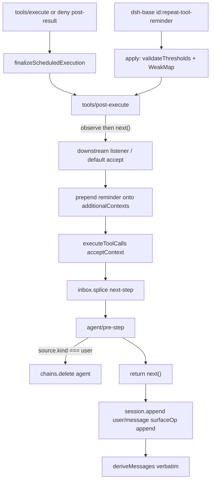

> `@deepseek-ai/dsh-repeat-tool-reminder` 是 **host 面** advisory Consumer：在 `tools/post-execute` 上观察「同一 agent、同一工具名、同一份完整 canonical arguments」的连续次数，命中 `thresholds` 时把一条 `user/message`（`source.kind === 'plugin'`、`plugin: 'repeat-tool-reminder'`）折进 `PostToolDecision.additionalContexts`。它**不否决、不改写调用**，也不 `ctx.provide` 任何服务。

DSH 是 Cordis 组合运行时（`profile → bundle → agent preset`）。本行挂在 **host 面**（与 `ctx.tools`、`timeout-policy` 同一进程级树），**不**进 agent-preset isolate。默认产品路径是本地 Web GUI（`dsh web`），本仓没有 shipped TUI 包。提醒正文一经 loop 写成 surface，就走 **model-visible ⟺ logged**：下一枪 `deriveMessages()` 必须能从这条 `user/message` 重建。

## 能回答的问题

- 重复调用提醒会不会拦住 `tools/execute`、改 arguments、或把结果改成 isError？
- 默认 `thresholds` 是什么？空列表 / 非整数 / `< 2` / 重复会不会静默回退？
- 链的 key 比的是 preview 截断后的 arguments，还是完整 canonical 字符串？`include` / `exclude` 是不是 registry 引用？
- 第一档文案和第二档文案差在哪？`thresholds[0]` 是配置字面量还是排序后的最小档？
- `exclude` 命中的工具会不会打断连续计数？人的新 `source.kind === 'user'` 消息呢？
- `dsh-web-app` 会不会 `disabled: true` 这一行？四个 shipped preset 会不会重挂？

## 职责边界

本包 `@deepseek-ai/dsh-repeat-tool-reminder` 拥有： [E: packages/guard/repeat-tool-reminder/package.json:2]

- function plugin `name = 'repeat-tool-reminder'` 与 `apply(ctx, config)`。没有 `inject`，不 publish `ctx.*`。 [E: packages/guard/repeat-tool-reminder/src/index.ts:17] [E: packages/guard/repeat-tool-reminder/src/index.ts:162]
- `Config`：`thresholds` / `include` / `exclude` / `argumentsPreviewChars`，schemastery 默认值再加 `apply` 里的 fail-loud 校验。 [E: packages/guard/repeat-tool-reminder/src/index.ts:45]
- 进程内 `WeakMap<Agent, { key, count }>` 连续链；命中阈值时产出带 `form: 'notice'` 的 plugin `UserMessage`。 [E: packages/guard/repeat-tool-reminder/src/index.ts:173] [E: packages/guard/repeat-tool-reminder/src/index.ts:57]
- companion `./invariant`（`name = 'repeat-tool-reminder-invariant'`）只 `invariants.register`，`install` 是空函数：链是 listener 私有状态，没有可独立观察的事件。 [E: packages/guard/repeat-tool-reminder/src/invariant.ts:13] [E: packages/guard/repeat-tool-reminder/src/invariant.ts:21]

本包**不**拥有：

- `tools/pre-execute` / `tools/execute` / `PostToolDecision` 合同与 `ctx.tools` 注册表 —— [`subsys.core.tools`](../core/tools.md)。
- 把 `additionalContexts` splice 进 inbox、下一步写成 `user/message` —— [`subsys.core.agent-loop`](../core/agent-loop.md) / [`spine.turn-and-step`](../../spine/turn-and-step.md)。
- `deriveMessages()` / `SurfaceOp` —— [`spine.session-log`](../../spine/session-log.md)。本插件**从不**自己 `session.append`。
- 工具超时（`timeoutMs` / `TOOL_TIMEOUT`）—— [`subsys.context.timeout-policy`](./timeout-policy.md)。
- approval / sandbox / hooks。hooks 本波不写。

## 关键文件

| 路径 | 角色 |
|---|---|
| `packages/guard/repeat-tool-reminder/src/index.ts` | `name` / `Config` / `apply`；canonical / wildcard / 链 / 两档文案 |
| `packages/guard/repeat-tool-reminder/src/invariant.ts` | 空 companion：没有可观察的 package-owned 事件 |
| `packages/guard/repeat-tool-reminder/tests/repeat-tool-reminder.spec.ts` | 档位、透明 exclude、wildcard、canonical、per-agent、user 重置、deny 也计数、fold 到 block、fail-loud |
| `packages/guard/repeat-tool-reminder/package.json` | 包名 `@deepseek-ai/dsh-repeat-tool-reminder` |
| `packages/bundle/base/cordis.patch.yml` | host 组合行 `id: repeat-tool-reminder` 与默认 config |
| `packages/bundle/web-app/cordis.patch.yml` | overlay **没有**该 id，因此不会 disable host 行 |
| `packages/core/tools/src/index.ts` | `PostToolDecision`；deny → `post-result`；`postExecute` 默认 `accept` |
| `packages/core/agent-loop/src/tool-calls.ts` | `finalize` 后把 `additionalContexts` 交给 `acceptContext` |
| `packages/core/agent-loop/src/agent.ts` | `acceptContext` = splice `next-step`；下一步 `append('user/message')` |
| `packages/core/agent/src/runtime-types.ts` | `agent/pre-step` waterfall 形状 |
| `packages/core/session/src/surface.ts` | `user/message` 原样投影进 `deriveMessages()` |
| `vendor/cordis/src/events.ts` | waterfall 必须调用传入的 `next()` 才会 `shift` |

## 数据模型

| 符号 | 要点 |
|---|---|
| `Config.thresholds` | 默认 `[3, 5, 8]`。`apply` 再校验：空数组、非整数、`< 2`、重复一律 throw，**没有**静默回退。通过后 **升序排序**，`thresholds[0]` 是温和档。 [E: packages/guard/repeat-tool-reminder/src/index.ts:46] [E: packages/guard/repeat-tool-reminder/src/index.ts:129] [E: packages/guard/repeat-tool-reminder/src/index.ts:134] [E: packages/guard/repeat-tool-reminder/src/index.ts:138] [E: packages/guard/repeat-tool-reminder/src/index.ts:140] |
| `Config.include` / `exclude` | 默认 `[]`。调用时对 **工具名** 做 `*`-wildcard（其它正则元字符按字面匹配），**不是** `ctx.tools` 的 registry 引用；模式匹配不到任何已注册工具也合法。空 `include` = 跟踪全部工具。 [E: packages/guard/repeat-tool-reminder/src/index.ts:47] [E: packages/guard/repeat-tool-reminder/src/index.ts:48] [E: packages/guard/repeat-tool-reminder/src/index.ts:108] [E: packages/guard/repeat-tool-reminder/src/index.ts:177] |
| `Config.argumentsPreviewChars` | 默认 `500`。必须是整数 `>= 1`，否则 load 失败。只截 **detailed** 正文里的 arguments；检测 key 永远用完整 canonical。 [E: packages/guard/repeat-tool-reminder/src/index.ts:49] [E: packages/guard/repeat-tool-reminder/src/index.ts:169] |
| `PLUGIN_SOURCE` | `{ kind: 'plugin', plugin: 'repeat-tool-reminder' }`。写出时再叠 `form: 'notice'` 与 `summary: '<name> × <count>'`。 [E: packages/guard/repeat-tool-reminder/src/index.ts:57] [E: packages/guard/repeat-tool-reminder/src/index.ts:205] |
| 链 `key` | `JSON.stringify([exec.name, canonicalize(exec.arguments)])`。`canonicalize` = 对象键深排序后 `JSON.stringify`。数组元素顺序不重排。 [E: packages/guard/repeat-tool-reminder/src/index.ts:103] [E: packages/guard/repeat-tool-reminder/src/index.ts:195] |
| `PostToolDecision` | `'accept'`（可换 `content` **或** `value`）或 `'block'`（`feedback` 变 isError）。两种都可带 `additionalContexts`。本插件只 prepend 自己的 reminder，不改 `kind` / `feedback` / `value`。 [E: packages/core/tools/src/index.ts:597] [E: packages/core/tools/src/index.ts:598] [E: packages/core/tools/src/index.ts:600] |

事件：`tools/post-execute` 与 `agent/pre-step` 都是 waterfall。不调用传入的 `next()` 就不会 `shift` 到下一层 / 内建默认。 [E: vendor/cordis/src/events.ts:237] [E: vendor/cordis/src/events.ts:238] [E: vendor/cordis/src/events.ts:242]

## 控制流

1. **host 面挂上 Consumer。** `dsh-base` 插入 `id: repeat-tool-reminder` / `name: '@deepseek-ai/dsh-repeat-tool-reminder'`，config 写死 `thresholds: [3, 5, 8]` 与 `argumentsPreviewChars: 500`（与 schema 默认相同）。这是进程级行，不是 per-session preset。 [E: packages/bundle/base/cordis.patch.yml:390] [E: packages/bundle/base/cordis.patch.yml:391] [E: packages/bundle/base/cordis.patch.yml:393] [E: packages/bundle/base/cordis.patch.yml:394]

2. **`dsh-web-app` 不 disable；preset 不重挂。** `packages/bundle/web-app/cordis.patch.yml` 的 disable 名单含 `compaction-basic` / `agent-instructions` / 各 `tool-*` 等，**没有** `id: repeat-tool-reminder`，host 行继续生效。[I] 四个 shipped `agent.cordis.yml` 也没有这一行，不 isolate、不 remount。[I] 没有 isolate 组：链是模块内 `WeakMap`，按 `Agent` 对象身份分桶。 [E: packages/guard/repeat-tool-reminder/src/index.ts:173] [E: packages/guard/repeat-tool-reminder/tests/repeat-tool-reminder.spec.ts:210]

3. **load 失败是硬失败。** `apply` 调 `validateThresholds`：空 `thresholds` throw `must not be empty`；任一值非整数或 `< 2` throw；`Set` 长度对不上则 throw `duplicates`。然后检查 `argumentsPreviewChars` 为整数 `>= 1`。测试用 `ctx.plugin(..., badConfig)` 断言 reject，没有回退到 `[3, 5, 8]`。 [E: packages/guard/repeat-tool-reminder/src/index.ts:164] [E: packages/guard/repeat-tool-reminder/tests/repeat-tool-reminder.spec.ts:379] [E: packages/guard/repeat-tool-reminder/tests/repeat-tool-reminder.spec.ts:384] [E: packages/guard/repeat-tool-reminder/tests/repeat-tool-reminder.spec.ts:389] [E: packages/guard/repeat-tool-reminder/tests/repeat-tool-reminder.spec.ts:394] [E: packages/guard/repeat-tool-reminder/tests/repeat-tool-reminder.spec.ts:399]

4. **计数发生在 `tools/post-execute`，先观察再 `next()`。** listener 先 `observe(exec)`（无论下游后来 `accept` 还是 `block`，计数都已前进），再 `const downstream = await next()`。省略 `next()` = 内层 listener 与默认 `{ kind: 'accept' }` 都不跑。 [E: packages/guard/repeat-tool-reminder/src/index.ts:213] [E: packages/guard/repeat-tool-reminder/src/index.ts:214] [E: packages/guard/repeat-tool-reminder/src/index.ts:215] [E: packages/core/tools/src/index.ts:1743] [E: packages/core/tools/src/index.ts:1745]

5. **`observe` 的门。** 没有 `exec.agent`（直接 `ctx.tools.execute()`）立刻 `undefined`，不碰任何链。未 `tracked` 的名字同样 `undefined`：`include` 非空且一个都不匹配 → 不跟踪；任一 `exclude` 匹配 → 不跟踪。不跟踪 = **既不 `count + 1` 也不把 `count` 打回 1**。 [E: packages/guard/repeat-tool-reminder/src/index.ts:192] [E: packages/guard/repeat-tool-reminder/src/index.ts:193] [E: packages/guard/repeat-tool-reminder/src/index.ts:177] [E: packages/guard/repeat-tool-reminder/src/index.ts:178] [E: packages/guard/repeat-tool-reminder/tests/repeat-tool-reminder.spec.ts:294] [E: packages/guard/repeat-tool-reminder/tests/repeat-tool-reminder.spec.ts:139]

6. **同一 key 才累加。** 跟踪中的调用把 `key = JSON.stringify([name, canonical])` 与该 agent 桶比较：相同则 `count + 1`，否则新开 `count = 1`（换工具或换完整 arguments 都会重置）。只在 `thresholdSet.has(count)` 时产出 reminder——夹在 3 与 5 之间的第 4 次**不**再喷文案。对象键深排序，所以 `{a:1,nested:{y:null,x:[1,2]}}` 与字段顺序不同的同一结构算同一次链。 [E: packages/guard/repeat-tool-reminder/src/index.ts:195] [E: packages/guard/repeat-tool-reminder/src/index.ts:197] [E: packages/guard/repeat-tool-reminder/src/index.ts:199] [E: packages/guard/repeat-tool-reminder/tests/repeat-tool-reminder.spec.ts:194]

7. **两档文案。** `count === thresholds[0]`（排序后的最小档，不是写死的字面量 `3`）用 `GENTLE_REMINDER`（「repeating the exact same tool call… try a different approach」）。后续命中档用 `detailedReminder`：点名 `tool` / `consecutive_calls` / `arguments`（`previewArguments` 超长则头 `argumentsPreviewChars` 个字符 + `… (+N more chars)`）。检测仍用未截断的 canonical。 [E: packages/guard/repeat-tool-reminder/src/index.ts:200] [E: packages/guard/repeat-tool-reminder/src/index.ts:63] [E: packages/guard/repeat-tool-reminder/src/index.ts:70] [E: packages/guard/repeat-tool-reminder/src/index.ts:118] [E: packages/guard/repeat-tool-reminder/tests/repeat-tool-reminder.spec.ts:58] [E: packages/guard/repeat-tool-reminder/tests/repeat-tool-reminder.spec.ts:79] [E: packages/guard/repeat-tool-reminder/tests/repeat-tool-reminder.spec.ts:98]

8. **只 fold，不否决。** 有 reminder 时：若 `downstream.kind === 'block'`，原样保留 `feedback`，把 reminder **prepend** 到 `additionalContexts`；否则 spread `downstream`，同样 prepend。测试：下游 `block` 的 isError 文案仍是 `nope`，guard 上下文与下游 plugin 上下文都进 log。 [E: packages/guard/repeat-tool-reminder/src/index.ts:217] [E: packages/guard/repeat-tool-reminder/src/index.ts:218] [E: packages/guard/repeat-tool-reminder/src/index.ts:221] [E: packages/guard/repeat-tool-reminder/tests/repeat-tool-reminder.spec.ts:312] [E: packages/guard/repeat-tool-reminder/tests/repeat-tool-reminder.spec.ts:342]

9. **denied 调用也走这条 waterfall。** `prepare` 在 `deny` / guard 拒绝时交出 `{ kind: 'post-result', ... }`，loop 设 `needsPost: true`，`finalize` 再调 `postExecute`。所以模型对着被拒工具连砸，仍会在第 N 次拿到提醒。`final-result`（例如 pre-execute **抛错**）`needsPost: false`，本插件看不见。 [E: packages/core/tools/src/index.ts:1489] [E: packages/core/tools/src/index.ts:1491] [E: packages/core/agent-loop/src/tool-calls.ts:186] [E: packages/core/agent-loop/src/tool-calls.ts:187] [E: packages/core/tools/src/index.ts:1611] [E: packages/guard/repeat-tool-reminder/tests/repeat-tool-reminder.spec.ts:278]

10. **提醒怎么变成模型看得见的 `user/message`。** `executeToolCalls` 对 `needsPost` 的 slot 调 `finalize`，然后把 `result.additionalContexts` 逐条交给 `acceptContext`。`ReactLoopAgent` 的 `acceptContext` 是 `inbox.splice('next-step', ...)`。下一步 `preStep` claim 这批消息，`agent/pre-step` 必须 `next()` 才会落到内建 `{ kind: 'enter', messages }`；随后 loop `append('user/message', message, { surfaceOp: 'append' })`。`deriveEventMessage` 对 `user/message` **原样**返回 `event.data`。 [E: packages/core/agent-loop/src/tool-calls.ts:152] [E: packages/core/agent-loop/src/tool-calls.ts:156] [E: packages/core/agent-loop/src/agent.ts:397] [E: packages/core/agent-loop/src/agent.ts:234] [E: packages/core/agent-loop/src/agent.ts:283] [E: packages/core/session/src/surface.ts:97]

11. **`agent/pre-step` 只复位，不注入。** 若本步 claim 的 `messages` 里存在 `source.kind === 'user'`，`chains.delete(agent)`，然后 **必须** `return next()`。人的新 followup 会清链（测试：两轮各两次相同调用，中间夹一条 user 消息，零 reminder）。reminder 自己的 source 是 `plugin`，不会把自己清掉。省略 `next()` = 内建 `enter` 与 runtime-context 追加都不跑。 [E: packages/guard/repeat-tool-reminder/src/index.ts:229] [E: packages/guard/repeat-tool-reminder/src/index.ts:230] [E: packages/guard/repeat-tool-reminder/src/index.ts:231] [E: packages/core/agent/src/runtime-types.ts:231] [E: packages/guard/repeat-tool-reminder/tests/repeat-tool-reminder.spec.ts:233]

12. **wildcard 与 include。** `wildcardToRegExp` 先把 `|\\{}()[]^$+?.` 转义，再把 `*` 换成 `.*` 并锚定。测试：`include: ['pro*']` 只跟踪 `probe`；`exclude: ['pr.be']` **不能**当成正则点号吃掉 `probe`。 [E: packages/guard/repeat-tool-reminder/src/index.ts:109] [E: packages/guard/repeat-tool-reminder/src/index.ts:110] [E: packages/guard/repeat-tool-reminder/tests/repeat-tool-reminder.spec.ts:159] [E: packages/guard/repeat-tool-reminder/tests/repeat-tool-reminder.spec.ts:180]

## 设计动机

模型卡在「同一工具 + 同一参数」上时，否决调用会让它看不见结果、也改不了策略；改写 arguments 又会和已经落盘的 `tool/call` 对不上。所以本插件只在 post-execute 上 **加一条 labeled context**：工具结果照旧进 surface，提醒作为下一条 plugin `user/message` 出现。`form: 'notice'` 让 UI 能在不展开正文时显示 `bash × 3` 这类 summary。

档位默认 `[3, 5, 8]`：第三次给一句温和劝退，第五次起点名 tool / 次数 / arguments。`thresholds[0]` 跟排序后的最小档走，自定义 `[4, 2]` 会变成先 2 后 4，而不是「第一档永远是 3」。

preview 只砍提醒正文，是因为循环场景里 `write` body / 长 command 会把下一枪撑爆；检测必须用完整 canonical，否则截断后的假碰撞或假分裂会让链失真。

`include` / `exclude` 按调用时的名字做 wildcard，是为了让 `exclude: [mcp_*]` 在尚未加载任何 MCP 工具的部署里仍然合法——模式不是 registry 句柄。

Fail-loud：空 `thresholds` 或 `1` 若被默默改成 `[3, 5, 8]`，运维会以为自己关掉了或把第一档设成了 1。

## Gotcha

- **Advisory，不是 gate。** 本插件从不返回 `block`、不改 `feedback` / `value` / arguments。下游 listener 仍可 `block`；reminder 只是 prepend 到那份决策的 `additionalContexts`。 [E: packages/guard/repeat-tool-reminder/src/index.ts:217]
- **只在精确阈值开枪。** `thresholdSet.has(count)`，不是 `count >= thresholds[0]`。默认配置下第 4、6、7 次不会再贴一条。 [E: packages/guard/repeat-tool-reminder/src/index.ts:199]
- **`exclude` 是透明的。** 夹在两次相同 `probe` 中间的 excluded `other` 既不加 count，也不重置；三次 `probe` 仍会在第三次触发。换一个 **被跟踪** 的不同调用才会把 count 打回 1。 [E: packages/guard/repeat-tool-reminder/tests/repeat-tool-reminder.spec.ts:139] [E: packages/guard/repeat-tool-reminder/tests/repeat-tool-reminder.spec.ts:120]
- **链按 `Agent` 对象，不按 session id。** 同一 `SessionId` 上新造的 agent 从 1 开始。直接 `tools.execute`（无 `exec.agent`）既不崩也不推进任何桶。 [E: packages/guard/repeat-tool-reminder/tests/repeat-tool-reminder.spec.ts:252] [E: packages/guard/repeat-tool-reminder/src/index.ts:192]
- **`observe` 不看 `exec.parent`。** 门只拒「没有 agent」。带 `parent` 的 Code Mode 子调度若带着同一个 `exec.agent` 走进 post-execute，会计入同一条链。[I]
- **block 决策丢掉工具 body 自己 defer 的 contexts。** `postExecute` 在 `kind === 'block'` 时只保留 **决策** 上的 `additionalContexts`。本插件把 reminder 写在决策上，所以 block 仍能带走提醒；工具 execute 里塞的 contexts 不会。 [E: packages/core/tools/src/index.ts:1748] [E: packages/core/tools/src/index.ts:1754]
- **文案不是 `<system-reminder>`。** `createUserMessage` 的 text 就是 GENTLE / detailed 原文；`deriveEventMessage` 对 `user/message` 不做信封。和 `agent-instructions` 那种包进 `<system-reminder>` 的 user 角色指令不是同一条路径。 [E: packages/guard/repeat-tool-reminder/src/index.ts:203] [E: packages/core/session/src/surface.ts:97]
- **配置写错会让整个 host 插件 load 失败**，不是「退回默认继续跑」。 [E: packages/guard/repeat-tool-reminder/src/index.ts:130]

## Seam 三角

| 角 | 落点 |
|---|---|
| **Definition** | 无本包服务名。消费的合同是 host `ctx.tools` 声明的 `tools/post-execute`（`PostToolDecision`）以及 `dsh-agent` 的 `agent/pre-step`。 [E: packages/core/tools/src/index.ts:175] [E: packages/core/agent/src/runtime-types.ts:231] |
| **Provider** | 无。`apply` 不 `ctx.provide`，preset `leakedServices` 检查不到这个键。 |
| **Consumer** | `@deepseek-ai/dsh-repeat-tool-reminder` 的 `apply` 挂两条 waterfall。组合行在 **host** `dsh-base`：`id: repeat-tool-reminder`。`dsh-web-app` 不 disable；四个 shipped preset 不重挂、不 isolate。 [E: packages/bundle/base/cordis.patch.yml:390] |

## Sources

- packages/guard/repeat-tool-reminder/src/index.ts
- packages/guard/repeat-tool-reminder/src/invariant.ts
- packages/guard/repeat-tool-reminder/tests/repeat-tool-reminder.spec.ts
- packages/guard/repeat-tool-reminder/package.json
- packages/bundle/base/cordis.patch.yml
- packages/bundle/web-app/cordis.patch.yml
- packages/core/tools/src/index.ts
- packages/core/agent-loop/src/tool-calls.ts
- packages/core/agent-loop/src/agent.ts
- packages/core/agent/src/runtime-types.ts
- packages/core/session/src/surface.ts
- vendor/cordis/src/events.ts

## 相关

- [`spine.tool-call-anatomy`](../../spine/tool-call-anatomy.md) — `pre-execute → execute → post-execute`；本页只消费 post-execute 的 `PostToolDecision`。
- [`subsys.core.tools`](../core/tools.md) — `ctx.tools` 注册表、`PostToolDecision`、deny 如何变成 `post-result`。
- [`spine.turn-and-step`](../../spine/turn-and-step.md) — `agent/pre-step`、inbox `next-step`、下一步如何 `append` user 角色 surface。
- [`spine.overview`](../../spine/overview.md) — host 面 vs agent-preset 面；`profile → bundle → agent preset`。
- [`spine.session-log`](../../spine/session-log.md) — `user/message` 进 `deriveMessages()`；`SurfaceOp` 只有 append / replace。
- [`subsys.core.agent-loop`](../core/agent-loop.md) — `ReactLoopAgent` 把 `additionalContexts` splice 进 inbox。
- [`subsys.composition.bundle-base`](../composition/bundle-base.md) — host insert 含本行；web-app / preset 不搬它。
- [`subsys.context.timeout-policy`](./timeout-policy.md) — 同属 host 面 guard Consumer，挂的是 `tools/execute` 而不是 post-execute。
