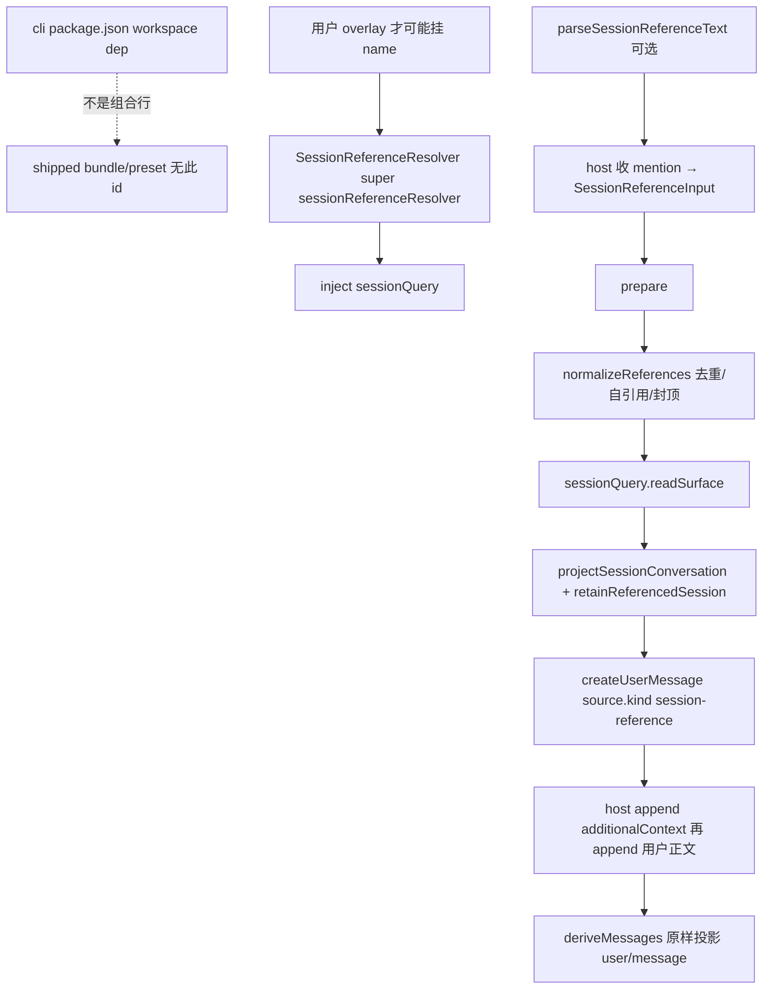

> `ctx.sessionReferenceResolver` 是 **opt-in** 的跨会话 snapshot 服务：host 把 mention 收成 `SessionReferenceInput[]`，本服务做 exact read、current-surface 投影、字节预算，并产出一条 `source.kind === 'session-reference'` 的 `createUserMessage`（外包 `## Referenced sessions` + `<referenced-sessions>` JSON，文案写明 **untrusted, read-only**）。它 **不在** shipped `dsh-base` / `dsh-web-app` / `dsh-headless` / 任一 shipped preset。cli `package.json` 有 workspace 依赖 ≠ 已挂进产品树。默认产品路径是本地 Web GUI（`dsh web`），**不会**解析跨会话引用。快照是 untrusted。

## 能回答的问题

- `ctx.sessionReferenceResolver` 在不在 `dsh-base` / web / headless / `minimal`·`standard`·`code`·`cordis`？cli 依赖该包是不是已经挂进产品树？
- host mention 怎么变成 structured input？`prepare()` 会不会自己扫正文？URI scheme 与 `formatSessionReferenceMention` / `parseSessionReferenceText` 各做什么？
- exact read 走 `sessionQuery.readSurface` 还是 FTS？投影保留哪些 surface、丢掉 tool / reasoning / plugin inject？
- `maxReferences` / `candidateLimit` / `maxReferenceBytes` 默认是多少？超限或非法抛哪条 `SessionReferenceError.code`？
- 产出的 `additionalContext` 怎样进目标 session、怎样被 `deriveMessages()` 看见？源会话事后 mutation / compaction / 删除会不会改目标历史？
- 本包挂不挂 waterfall？preset 若 publish 这份服务却不 `isolate` 会怎样？

## 职责边界

本包拥有：服务名 `sessionReferenceResolver`、URI / mention 编解码、`listCandidates` / `prepare`、current-surface 文本投影、单条引用的 UTF-8 预算、以及 `SessionReferenceSource`（`kind: 'session-reference'`）的耐久信封。 [E: packages/context/session-reference/src/index.ts:81] [E: packages/context/session-reference/src/types.ts:8]

本包**不**拥有：

- session-query FTS / sqlite 后端、`listSessions` / `readSurface` 的 live-preferred 语料 —— [`subsys.persistence.session-query`](../persistence/session-query.md)。
- 模型可见 `session_*` 五件套字段表 —— [`surface.tools.session-query`](../../surface/tools/session-query.md)。
- append-only `SessionEvent` 日志、`SurfaceOp`、`deriveMessages()` —— [`subsys.core.session`](../core/session.md)、[`spine.session-log`](../../spine/session-log.md)。
- compaction 事务与 `surfaceOp: replace` —— [`spine.context-and-compaction`](../../spine/context-and-compaction.md)。本页只消费 `isCompactCheckpointSource`（`plugin: 'compact'`）。
- shipped host 把 mention 打进 inbox 的 adapter。本仓 **没有** 把 `prepare` / `listCandidates` 接到 `dsh web` / apiproxy / 任一 shipped preset。

DSH 是 Cordis 组合运行时（`profile → bundle → agent preset`），不是「又一个 coding agent」。本仓没有 shipped TUI 包。

## 关键文件

| 路径 | 角色 |
|---|---|
| `packages/context/session-reference/src/index.ts` | `SessionReferenceResolver`：`listCandidates` / `prepare` / prompt 信封 |
| `packages/context/session-reference/src/config.ts` | `MAX_REFERENCES`、默认预算、`SessionReferenceError` |
| `packages/context/session-reference/src/types.ts` | `SessionReferenceSource` / `SessionReferenceInput` / `PreparedReferencedMessage` |
| `packages/context/session-reference/src/uri.ts` | `dsh-session:` URI 与 `@[label](uri)` mention |
| `packages/context/session-reference/src/projection.ts` | current-surface 投影 + 单条引用字节裁切 |
| `packages/context/session-reference/src/serialization.ts` | `stringifyTagSafeJson`：`<` → `\u003c` |
| `packages/context/session-reference/src/invariant.ts` | companion 名 `session-reference-invariant`；runtime installer 为空 |
| `packages/context/session-reference/tests/session-reference.spec.ts` | URI、候选排序、投影、预算、自引用、耐久独立 |
| `apps/cli/package.json` | workspace 依赖 `@deepseek-ai/dsh-session-reference`（≠ 组合行） |
| `packages/bundle/base/cordis.patch.yml` | shipped host 真树：有 `session-query-sqlite`，**无** `session-reference` |
| `packages/bundle/base/package.json` | `dsh-base` 依赖 `session-query-sqlite`，**不**依赖 `session-reference` |
| `packages/bundle/web-app/cordis.patch.yml` / `headless/cordis.patch.yml` | overlay 同样没有该行 |
| `apps/cli/config/agent-presets/*/agent.cordis.yml` | 四个 shipped preset 都不挂该服务 |
| `packages/session-query/session-query/src/index.ts` | `readSurface` / `listSessions` / `readTitleSnapshots` |
| `packages/client/runtime/src/client/sessions/context-provenance.ts` | 已入 log 的 `kind: 'session-reference'` 在 UI 标 `recall`；不调用 resolver |

## 数据模型

| 符号 | 要点 |
|---|---|
| `SESSION_REFERENCE_SCHEME` | `'dsh-session:'`。payload = UTF-8 `JSON.stringify(sessionId)` 的 base64url。解码后再 encode 必须与原文相等，否则非法。 [E: packages/context/session-reference/src/uri.ts:8] [E: packages/context/session-reference/src/uri.ts:16] [E: packages/context/session-reference/src/uri.ts:35] |
| `SessionReferenceInput` | `{ sessionId, label? }`。缺 `label` 时 `prepare` 用 `sessionId` 填。 |
| `SessionReferenceSource` | `kind: 'session-reference'`，`form: 'recall'`，`version: 1`，`references[]` 带 `capturedThroughSeq` 与 retention 统计。merge 进 `MessageSourceMap`。 [E: packages/context/session-reference/src/types.ts:7] [E: packages/context/session-reference/src/types.ts:10] [E: packages/context/session-reference/src/types.ts:11] |
| `PreparedReferencedMessage` | `{ content, additionalContext? }`。`content` 是 host 已规范化正文的 `structuredClone`；无引用时没有 `additionalContext`。 [E: packages/context/session-reference/src/index.ts:175] [E: packages/context/session-reference/src/index.ts:177] |
| `SessionSurfaceSnapshot` | query 的 current-surface 观察：`session` header、`capturedThroughSeq`（该次 raw-log 最高 seq，空 log 为 `null`）、折叠后的 `events`。 [E: packages/session-query/session-query/src/types.ts:34] [E: packages/session-query/session-query/src/types.ts:38] |
| `ReferencedSessionData` | 写入 JSON 的对象：`sessionId` / `label` / `cwd` / `capturedThroughSeq` / `conversation[{role,text}]`。 |

Config 与硬上限（`SessionReferenceResolver.Config` 与构造函数双检）：

| 键 | 默认 | 约束 |
|---|---|---|
| `maxReferences` | `MAX_REFERENCES`（`3`） | 正安全整数，且 `1..MAX_REFERENCES`。超过 3 或 `0` → `SESSION_REFERENCE_INVALID_CONFIG`。 [E: packages/context/session-reference/src/config.ts:4] [E: packages/context/session-reference/src/index.ts:73] [E: packages/context/session-reference/src/index.ts:95] |
| `candidateLimit` | `DEFAULT_CANDIDATE_LIMIT`（`50`） | 正安全整数。 [E: packages/context/session-reference/src/config.ts:6] |
| `maxReferenceBytes` | `DEFAULT_MAX_REFERENCE_BYTES`（`65536`） | 正安全整数；按**单条**引用 JSON 对象计 UTF-8 字节。 [E: packages/context/session-reference/src/config.ts:8] |

`SessionReferenceError.code`：

| code | 何时 |
|---|---|
| `SESSION_REFERENCE_INVALID_CONFIG` | 构造期配置非法 |
| `SESSION_REFERENCE_INVALID_REFERENCE` | 非对象 / 缺 string `sessionId` / 非法 URI / `listCandidates` 的 `limit <= 0` |
| `SESSION_REFERENCE_SELF_REFERENCE` | `sessionId === agent.id` |
| `SESSION_REFERENCE_TOO_MANY` | 去重后仍超过 `maxReferences` |
| `SESSION_REFERENCE_READ_FAILED` | `readSurface` 失败且 signal 未 abort |
| `SESSION_REFERENCE_BUDGET_EXCEEDED` | 固定字段都塞不进 `maxReferenceBytes`；**不**产出残缺 context |
| `SESSION_REFERENCE_CANCELLED` | `AbortSignal` 在 list / read / prepare 边界响了 |

## 控制流

1. **组合真树：未挂。** `dsh-base` 在 host 面插入 `id: session-query-sqlite` / `name: '@deepseek-ai/dsh-session-query-sqlite'`，同一份 `cordis.patch.yml` **没有** `id: session-reference`，也没有 `name: '@deepseek-ai/dsh-session-reference'`。[I] 对该文件全文检索这两个字面量，零命中。`dsh-base` 的 `package.json` 依赖 `@deepseek-ai/dsh-session-query-sqlite`，同样没有 `@deepseek-ai/dsh-session-reference`。 [E: packages/bundle/base/cordis.patch.yml:117] [E: packages/bundle/base/cordis.patch.yml:118] [E: packages/bundle/base/package.json:77]

2. **web / headless / shipped preset 也不重挂。** `dsh-web-app` 按 id 重写 `session-query-sqlite` 的 `openAt: never`，不插入 resolver。`dsh-headless` 的 insert 只有 `code-runtime` / `headless-startup` / `headless-runner`。`standard` / `code` / `cordis` 在 agent-preset 面挂 `persona` 与 `agent-instructions`；`minimal` 挂 `persona`（`complete: true`）与 `persistent-shell`。四份 `agent.cordis.yml` 都没有 session-reference 行。[I] 写成「默认 `dsh web` 会解析跨会话引用」整页作废。ACP demo 组合启动后 `ctx.get('sessionReferenceResolver')` 是 `undefined`。 [E: packages/bundle/web-app/cordis.patch.yml:30] [E: packages/bundle/headless/cordis.patch.yml:24] [E: packages/bundle/headless/cordis.patch.yml:27] [E: packages/bundle/headless/cordis.patch.yml:31] [E: apps/cli/config/agent-presets/standard/agent.cordis.yml:24] [E: apps/cli/config/agent-presets/standard/agent.cordis.yml:30] [E: apps/cli/config/agent-presets/code/agent.cordis.yml:31] [E: apps/cli/config/agent-presets/code/agent.cordis.yml:37] [E: apps/cli/config/agent-presets/cordis/agent.cordis.yml:17] [E: apps/cli/config/agent-presets/cordis/agent.cordis.yml:31] [E: apps/cli/config/agent-presets/minimal/agent.cordis.yml:8] [E: apps/cli/config/agent-presets/minimal/agent.cordis.yml:18] [E: packages/examples/acp-demo/tests/acp-agent.spec.ts:99]

3. **cli 依赖只解决「能被 name 引用」。** `@deepseek-ai/dsh` 把 `@deepseek-ai/dsh-session-reference` 写进 `dependencies`，所以用户 overlay / `--patch` **可以**写一行 `name: '@deepseek-ai/dsh-session-reference'`。这不是 shipped 行，也不会在 `dsh web` 默认树里 `provide` 服务。 [E: apps/cli/package.json:52]

4. **有人挂上之后才有 Provider。** `SessionReferenceResolver` 是 default export 的 Cordis `Service`：`static inject = ['sessionQuery']`，构造里 `super(ctx, 'sessionReferenceResolver')`，键是 `ctx.sessionReferenceResolver`。缺 `sessionQuery` 则插件无法 settle。构造把省略的 Config 填成 `MAX_REFERENCES` / `50` / `65536`，再要求每个值都是正安全整数，且 `maxReferences <= MAX_REFERENCES`。 [E: packages/context/session-reference/src/index.ts:71] [E: packages/context/session-reference/src/index.ts:81] [E: packages/context/session-reference/src/index.ts:83] [E: packages/context/session-reference/src/index.ts:88] [E: packages/context/session-reference/tests/session-reference.spec.ts:653] [E: packages/context/session-reference/tests/session-reference.spec.ts:654]

5. **Host 收 mention；本服务不扫正文。** `prepare(agent, content, references)` 只接受已经结构化的 `SessionReferenceInput[]`；`content` 必须是 host 规范化后的可读块。函数只 `structuredClone(content)`，**不**调用 `parseSessionReferenceText`。空 `references` 立刻返回 `{ content }`，且 clone 与入参不是同一引用。[I] 模块注释把「adapt mentions」划给 host、把 exact read / projection / budgets 划给本服务；可执行路径与这条注释一致。 [E: packages/context/session-reference/src/index.ts:172] [E: packages/context/session-reference/src/index.ts:175] [E: packages/context/session-reference/src/index.ts:177] [E: packages/context/session-reference/tests/session-reference.spec.ts:438] [E: packages/context/session-reference/tests/session-reference.spec.ts:440]

6. **URI 与 mention 是给 host 用的纯函数。** `encodeSessionReferenceUri` / `decodeSessionReferenceUri` 走 `dsh-session:` + base64url。payload 必须匹配 `^[A-Za-z0-9_-]+$`，JSON 解码必须是 string，再经 `SessionId` brand，且 **重新 encode 必须等于入参**（非 canonical 一律 `SESSION_REFERENCE_INVALID_REFERENCE`）。`formatSessionReferenceMention` 产出 `@[escapedLabel](uri)`，`label` 里的 `\` 与 `]` 加反斜杠。`parseSessionReferenceText` 同时认 Markdown mention 与裸 URI：显式 `@[…](dsh-session:…)` 只要 URI 畸形就抛；裸文本只有「非空 base64url 形 payload」才当候选，再失败同样抛。`dsh-session:` 后接 `%%%`、或讨论「what is a dsh-session: URI?」不当引用。替换后的可读文本是 `@label`。 [E: packages/context/session-reference/src/uri.ts:26] [E: packages/context/session-reference/src/uri.ts:30] [E: packages/context/session-reference/src/uri.ts:35] [E: packages/context/session-reference/src/uri.ts:48] [E: packages/context/session-reference/src/uri.ts:70] [E: packages/context/session-reference/tests/session-reference.spec.ts:206] [E: packages/context/session-reference/tests/session-reference.spec.ts:221] [E: packages/context/session-reference/tests/session-reference.spec.ts:234]

7. **`listCandidates` 只做发现，不读 surface。** 排除 `record.header.id === agent.id`。空 query：先按 cwd 亲和排序再 `slice(0, limit)`，然后才 `readTitleSnapshots`。非空 query：先观察全部（仍排除 self），用 session id / cwd / title 做大小写不敏感子串过滤，再排序截断。`candidateRank`：与目标 `header.cwd` 相同 → `0`；候选无 cwd → `1`；其它 cwd → `2`；同分用 `listSessions` 原下标。title 观察 `fulfilled` 用 `title?.title ?? id`，`rejected` 回退 id。`limit` 非正安全整数 → `SESSION_REFERENCE_INVALID_REFERENCE`。`signal` abort → `SESSION_REFERENCE_CANCELLED`。 [E: packages/context/session-reference/src/index.ts:124] [E: packages/context/session-reference/src/index.ts:130] [E: packages/context/session-reference/src/index.ts:141] [E: packages/context/session-reference/src/index.ts:270] [E: packages/context/session-reference/src/index.ts:117] [E: packages/context/session-reference/tests/session-reference.spec.ts:255]

8. **`normalizeReferences` 在读盘之前 fail-loud。** 非 object、`sessionId` 非 string、自引用立刻抛。同一 `sessionId` **先出现的 label 赢**，后续静默跳过。去重**之后**才比 `maxReferences`，超了才 `SESSION_REFERENCE_TOO_MANY`。因此 `{one, one, two}` 在 `maxReferences: 2` 下合法。 [E: packages/context/session-reference/src/index.ts:250] [E: packages/context/session-reference/src/index.ts:253] [E: packages/context/session-reference/src/index.ts:257] [E: packages/context/session-reference/tests/session-reference.spec.ts:442] [E: packages/context/session-reference/tests/session-reference.spec.ts:447]

9. **exact read 走 `sessionQuery.readSurface`，不是 FTS。** 对每个接受的 id `Promise.all` 调 `this.ctx.sessionQuery.readSurface`。失败且 `signal.aborted` → `SESSION_REFERENCE_CANCELLED`；否则包成 `SESSION_REFERENCE_READ_FAILED`（含 missing session）。`readSurface` 从 live-preferred corpus `load` 一次，返回折叠后的 current surface 与 `capturedThroughSeq = events.at(-1)?.seq ?? null`。本页不展开 FTS `openAt` / schema。 [E: packages/context/session-reference/src/index.ts:184] [E: packages/context/session-reference/src/index.ts:189] [E: packages/context/session-reference/src/index.ts:192] [E: packages/session-query/session-query/src/index.ts:263] [E: packages/session-query/session-query/src/index.ts:267] [E: packages/context/session-reference/tests/session-reference.spec.ts:458]

10. **投影只留 current user/assistant 文本。** `retainReferencedSession` 先 `projectSessionConversation`：`user/message` 仅当 `isCompactCheckpointSource(source)`（`kind === 'plugin' && plugin === 'compact'`）或 `source.kind === 'user'`；`assistant/message` 只拼 `type === 'text'` 块；`tool/result` 丢弃。plugin 注入（workspace / goal / 嵌套 `plugin: 'session-reference'`）不进 conversation。纯 reasoning 块拼出空串则整条丢掉。checkpoint 摘要会留下，因为 compaction 的 replace 消息带 compact source。 [E: packages/context/session-reference/src/projection.ts:41] [E: packages/context/session-reference/src/projection.ts:42] [E: packages/compaction/compaction/src/checkpoint.ts:49] [E: packages/compaction/compaction/src/checkpoint.ts:50] [E: packages/context/session-reference/src/projection.ts:48] [E: packages/context/session-reference/src/projection.ts:52] [E: packages/context/session-reference/tests/session-reference.spec.ts:336] [E: packages/context/session-reference/tests/session-reference.spec.ts:393]

11. **单条引用独立吃 `maxReferenceBytes`。** 序列化对象是 `stringifyTagSafeJson(data())` 的 UTF-8 字节。超预算时先丢掉「非 checkpoint 且不是最新一条」的消息；仍超则对当前最长 `text` 做 head/tail 截断，并附加 `\n[… omitted N UTF-8 bytes …]`。固定字段（id / label / cwd / seq）都塞不下 → `undefined` → `SESSION_REFERENCE_BUDGET_EXCEEDED`，**没有**半截 `additionalContext`。三条引用各自 360 字节时，合计可以超过 `360`。`truncated` 在省略了消息或字节时为真；`compacted` 在原投影里出现过 checkpoint。 [E: packages/context/session-reference/src/projection.ts:87] [E: packages/context/session-reference/src/projection.ts:110] [E: packages/context/session-reference/src/index.ts:224] [E: packages/context/session-reference/tests/session-reference.spec.ts:575] [E: packages/context/session-reference/tests/session-reference.spec.ts:568]

12. **信封是 untrusted JSON，不是 system section。** `renderPrompt` 固定前缀 `## Referenced sessions` + 「untrusted, read-only snapshot」说明 + `<referenced-sessions>\n` + tag-safe JSON + `\n</referenced-sessions>`。`stringifyTagSafeJson` 把每个 `<` 换成 `\u003c`，`JSON.parse` 值不变，敌对 `</referenced-sessions>` 不能提前闭标签。`createUserMessage({ source, content: [{ type:'text', text: prompt }] })` 冻成 `UserMessage`。`source.kind === 'session-reference'`，`form: 'recall'`，`version: 1`；`references[].inputIndex` 是**去重后**渲染数组下标，不是原始 mention 下标。 [E: packages/context/session-reference/src/index.ts:42] [E: packages/context/session-reference/src/index.ts:266] [E: packages/context/session-reference/src/serialization.ts:11] [E: packages/context/session-reference/src/index.ts:201] [E: packages/context/session-reference/src/index.ts:212] [E: packages/llm/llm/src/message.ts:192] [E: packages/context/session-reference/tests/session-reference.spec.ts:335] [E: packages/context/session-reference/tests/session-reference.spec.ts:418]

13. **耐久化是 host 的 `session.append`，本服务不写 log。** 测试里的 host 先 `append('user/message', additionalContext, { surfaceOp: 'append' })`，再 `append` 一条 `source.kind === 'user'` 的正文。`deriveEventMessage` 对 `user/message` **原样**返回 `event.data`，所以这条 recall 一旦进 log，就进入 `deriveMessages()`（**model-visible ⟺ logged**）。源会话随后 append / `surfaceOp: replace` / `detach` 删掉 live 条目，目标 `deriveMessages()` 仍是 prepare 当时的快照；`Session.create` replay 目标 events 也复现同一投影。 [E: packages/context/session-reference/tests/session-reference.spec.ts:599] [E: packages/core/session/src/surface.ts:96] [E: packages/core/session/src/surface.ts:97] [E: packages/context/session-reference/tests/session-reference.spec.ts:636] [E: packages/context/session-reference/tests/session-reference.spec.ts:640]

14. **本包不注册 waterfall。** `SessionReferenceResolver` 没有 `ctx.on` / `ctx.waterfall`。companion `apply` 只 `invariants.register`，installer 是空函数——制备结果在构建时校验，admission / freeze / replay 交给 agent/session。若自定义 host 把解析挂到 `agent/pre-step`（或其它 waterfall），listener **必须**调用传入的 `next()`：Cordis `Events.waterfall` 只在 `next()` 里 `cbs.shift() ?? inner`；省略 `next()` = 后续 listener 与 inner 都不跑。 [E: packages/context/session-reference/src/invariant.ts:21] [E: packages/context/session-reference/src/invariant.ts:29] [E: vendor/cordis/src/events.ts:237] [E: vendor/cordis/src/events.ts:238]

15. **isolate：shipped 树用不上；自定义 preset 会漏服务。** 本服务 `provide` 的是 process 级 `sessionReferenceResolver`，并 inject host 的 `sessionQuery`。设计位置是 **host 面**。把它写进 agent-preset 且不 `isolate: { sessionReferenceResolver: true }` 时，`mountPreset` 在 subtree settle 后跑 `leakedServices`：实现落在 root isolate 符号上就抛 `published process-global service(s)`。shipped 四个 preset **没有**这行，所以也没有 isolate 组。 [E: packages/preset/agent-presets/src/mount.ts:361] [E: packages/preset/agent-presets/src/mount.ts:364]

16. **Client 只认已经落盘的 source，不调用 resolver。** `contextProvenance` 遇到 `kind === 'session-reference'` 返回 `role: 'recall'`，label 拼 `references[].label`。这是 UI 对耐久信封的展示，不是 `listCandidates` / `prepare` 的 Consumer。没有 resolver、没有 host adapter，对话里不会凭空出现 recall 消息。 [E: packages/client/runtime/src/client/sessions/context-provenance.ts:78] [E: packages/client/runtime/src/client/sessions/context-provenance.ts:79]

## 设计动机

- **组合缝，不是内置「打开就能 @ 别的 session」。** query 缝已经在 host（`session-query-sqlite`）；跨会话把别人的 log 喂给模型是另一条能力，默认产品树故意不挂。cli 依赖让 overlay 写得出来，避免「包在 workspace 里却要从 npm 再装」。
- **Host 收 mention，服务做 exact read。** 把 `@[label](dsh-session:…)` 的解析留在 host（Web / ACP / SDK 各自的输入面），`prepare` 只接受 structured input。服务热路径不跑正则，也不猜测正文里的 URI。
- **快照必须标 untrusted。** 被引用会话里可能有指令、权限声明、伪造 tool 请求。信封用固定英文警告 + 不能被源文本提前闭合的 `<referenced-sessions>`，模型只能当背景，除非当前用户再重复一遍。
- **current surface，不是 raw log。** 工具输出、reasoning、plugin inject（含嵌套 recall）会泄漏或递归膨胀。compaction 的 checkpoint 留下，被 `replace` 掉的旧节点本来就不在 `readSurface.events` 里。
- **预算 fail-loud。** 与其静默丢整段会话却仍声称「引用了」，不如 `SESSION_REFERENCE_BUDGET_EXCEEDED`。每条引用独立封顶，避免三条小会话被一条总额误杀。
- **目标 log 持有副本。** prepare 当时的 JSON 进目标 `user/message` 之后，源会话怎么 compact / 删除都改不了目标 `deriveMessages()`。这是 **model-visible ⟺ logged** 在跨会话方向上的推论。

## Gotcha

- **依赖 ≠ 挂载。** `apps/cli/package.json` 有 `@deepseek-ai/dsh-session-reference`，`dsh-base` / web / headless / 四个 preset **都没有**对应 cordis 行。默认 `dsh web` 不会注入跨会话引用。 [E: apps/cli/package.json:52]
- **`prepare` 不解析正文。** 把 mention 留在 `content` 里却传空 `references`，模型只看见 `@label` 字面量，没有 snapshot。
- **快照是 untrusted。** 源会话用户/模型写过的字会原样进 JSON（仅 `<` 被 escape）。不要把 recall 当成可信 system。
- **自引用直接拒绝**，不会读自己再投影自己。 [E: packages/context/session-reference/tests/session-reference.spec.ts:447]
- **先去重再封顶。** 同一 session 提两次只占一个名额；第四个**不同** id 才 `TOO_MANY`。
- **`maxReferenceBytes` 是单条 JSON 对象，不是整段 prompt。** 三条引用可以合计超过该值。
- **嵌套 recall 不会传播。** 源会话里 `source.kind === 'plugin' && plugin === 'session-reference'` 的 user 消息在投影里被丢掉。 [E: packages/context/session-reference/tests/session-reference.spec.ts:393]
- **没有 delete。** 源会话要改模型历史只能 `surfaceOp: { op: 'replace', start, end }`；目标侧靠自己那条 append 的副本，不回源。
- **本包无 waterfall listener。** 不要在本页找 `agent/pre-step` 的 `next()`。自定义挂接才需要自己遵守 waterfall。
- **preset 里 publish 必须 isolate。** 否则 `leakedServices` 点名 `sessionReferenceResolver`。
- **`MAX_REFERENCES` 是硬顶。** schema 与构造函数都不允许大于 3。把 `maxReferences: 4` 当「放宽」会在 load / `new` 时失败。 [E: packages/context/session-reference/tests/session-reference.spec.ts:654]
- **不要把本页写成 T1 `session_*` 工具。** 模型五件套的 schema / workspace ACL 在 [`surface.tools.session-query`](../../surface/tools/session-query.md)。本服务甚至不调用 `searchSessions`。

## Seam 三角

| 角色 | 包 | ctx 键 / 合同 | bundle / preset 行 |
|---|---|---|---|
| Definition | `@deepseek-ai/dsh-session-reference` 的 `types.ts` / `uri.ts` / `config.ts` | `SessionReferenceSource`、`dsh-session:` URI、`SessionReferenceError`、`MAX_REFERENCES` | **没有**单独的空 Definition 插件行 |
| Provider | `SessionReferenceResolver` | `ctx.sessionReferenceResolver`（`inject: ['sessionQuery']`） | **不在** `dsh-base` / `dsh-web-app` / `dsh-headless` / `minimal`·`standard`·`code`·`cordis`。cli 依赖只让 overlay 写得出来 |
| Consumer | 尚未 shipped 的 host adapter（收 mention → `prepare` → `session.append`） | 调用 `listCandidates` / `prepare`；把 `additionalContext` 写成 `user/message` | shipped 树零行。Web client 的 `contextProvenance` 只展示已入 log 的 `kind`，不 provide、不 prepare |

换 query backend 只换 `ctx.sessionQuery.readSurface` / `listSessions` 的实现，本页合同不变。换 loop 不能绕开「先 append 再 `deriveMessages()`」，否则 invariant 在 `llm/stream` 上对不上。preset 需要私有实例时必须 `isolate`；默认产品路径根本不挂。

## Sources

- packages/context/session-reference/src/index.ts
- packages/context/session-reference/src/config.ts
- packages/context/session-reference/src/types.ts
- packages/context/session-reference/src/uri.ts
- packages/context/session-reference/src/projection.ts
- packages/context/session-reference/src/serialization.ts
- packages/context/session-reference/src/invariant.ts
- packages/context/session-reference/tests/session-reference.spec.ts
- apps/cli/package.json
- packages/bundle/base/cordis.patch.yml
- packages/bundle/base/package.json
- packages/bundle/web-app/cordis.patch.yml
- packages/bundle/headless/cordis.patch.yml
- apps/cli/config/agent-presets/standard/agent.cordis.yml
- apps/cli/config/agent-presets/code/agent.cordis.yml
- apps/cli/config/agent-presets/cordis/agent.cordis.yml
- apps/cli/config/agent-presets/minimal/agent.cordis.yml
- packages/session-query/session-query/src/index.ts
- packages/session-query/session-query/src/types.ts
- packages/compaction/compaction/src/checkpoint.ts
- packages/core/session/src/surface.ts
- packages/llm/llm/src/message.ts
- packages/examples/acp-demo/tests/acp-agent.spec.ts
- vendor/cordis/src/events.ts
- packages/preset/agent-presets/src/mount.ts
- packages/client/runtime/src/client/sessions/context-provenance.ts

## 相关

- [spine.session-log](../../spine/session-log.md)：append-only log、`deriveMessages()`、`surfaceOp` 只有 append / replace。
- [subsys.core.session](../core/session.md)：`Session.append`、`SurfaceOp`、host 面 `ctx.sessions`。
- [subsys.persistence.session-query](../persistence/session-query.md)：`ctx.sessionQuery` 的 exact read / title / FTS；本页只消费 `readSurface` 与候选列表。
- [spine.overview](../../spine/overview.md)：`profile → bundle → agent preset`；host 面 vs agent-preset 面。
- [surface.tools.session-query](../../surface/tools/session-query.md)：模型可见 `session_*` 五件套（本页不写字段表）。
- [spine.context-and-compaction](../../spine/context-and-compaction.md)：compaction 的 `replace` 与 compact checkpoint source。
- [spine.capability-seams](../../spine/capability-seams.md)：Definition / Provider / Consumer。
- [subsys.composition.bundle-base](../composition/bundle-base.md)：`dsh-base` 真树（含 `session-query-sqlite`，不含本服务）。
