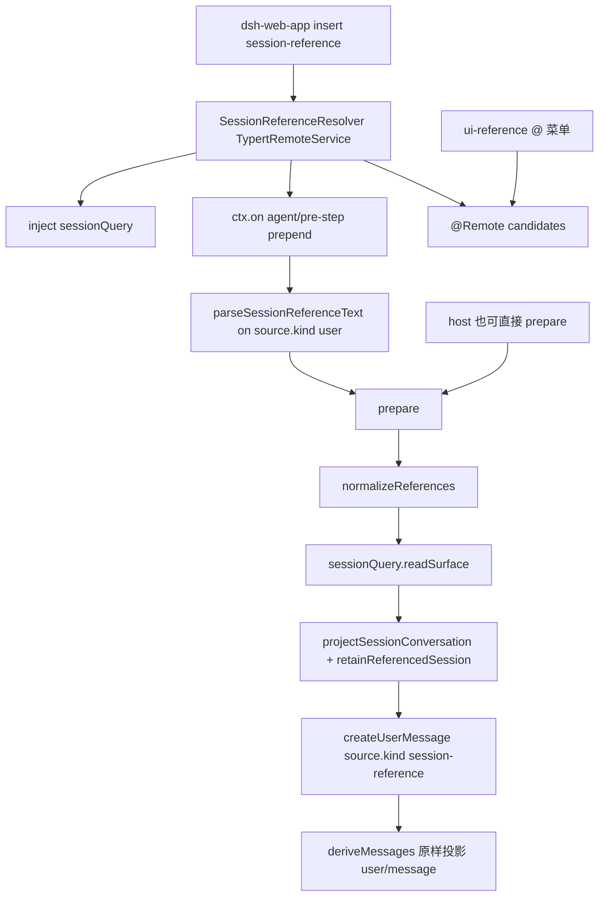

> `ctx.sessionReferenceResolver`（`@deepseek-ai/dsh-session-reference`）是跨会话 snapshot 服务：host 面做 exact read、current-surface 投影、字节预算，并产出 `source.kind === 'session-reference'` 的 `createUserMessage`（外包 `## Referenced sessions` + `<referenced-sessions>` JSON，文案写明 **untrusted, read-only**）。它 **挂在 shipped `dsh-web-app`**，**不在** `dsh-base`、`dsh-headless`、`dsh-sdk-app`、`dsh-sdk-minimal`、`dsh-acp-app`、也不在四个 shipped preset。默认 `dsh web` 会解析 `@session`；`dsh --profile headless|sdk|sdk-minimal|acp` 默认树没有该行。快照是 untrusted。

## 能回答的问题

- `ctx.sessionReferenceResolver` 在不在 `dsh-base` / `dsh-web-app` / headless·sdk·acp / `minimal`·`standard`·`ptc`·`cordis`？cli 依赖该包是不是已经挂进产品树？
- host mention 怎么变成 structured input？`prepare()` 会不会自己扫正文？`agent/pre-step` 何时调用 `parseSessionReferenceText`？
- URI scheme 与 `formatSessionReferenceMention` / `parseSessionReferenceText` 各做什么？Remote `candidates` 给谁用？
- exact read 走 `sessionQuery.readSurface` 还是 FTS？投影保留哪些 surface、丢掉 tool / reasoning / inject？
- `maxReferences` / `candidateLimit` / `maxReferenceBytes` 默认是多少？超限或非法抛哪条 `SessionReferenceError.code`？
- 产出的 `additionalContext` 怎样进目标 session、怎样被 `deriveMessages()` 看见？源会话事后 mutation / compaction / 删除会不会改目标历史？
- 本包挂不挂 waterfall？preset 若 publish 这份服务却不 `isolate` 会怎样？

## 职责边界

本包拥有：服务名 `sessionReferenceResolver`、URI / mention 编解码、`listCandidates` / `prepare` / Typert Remote `candidates`、`agent/pre-step` 上对 **direct user** 消息的 mention 解析、current-surface 文本投影、单条引用的 UTF-8 预算、以及 `SessionReferenceSource`（`kind: 'session-reference'`）的耐久信封。 [E: packages/context/session-reference/src/index.ts:85] [E: packages/context/session-reference/src/types.ts:14] [E: packages/context/session-reference/package.json:2]

本包**不**拥有：

- session-query FTS / sqlite 后端、`listSessions` / `readSurface` 的 live-preferred 语料 —— [`subsys.persistence.session-query`](../persistence/session-query.md)。
- 模型可见 `session_*` 五件套字段表 —— [`surface.tools.session-query`](../../surface/tools/session-query.md)。
- append-only `SessionEvent` 日志、`SurfaceOp`、`deriveMessages()` —— [`subsys.core.session`](../core/session.md)、[`spine.session-log`](../../spine/session-log.md)。
- compaction 事务与 `surfaceOp: replace` —— [`spine.context-and-compaction`](../../spine/context-and-compaction.md)。本页只消费 `isCompactCheckpointSource`（`plugin: 'compact'`）。
- Web `@` 菜单的 UI 装配（`dsh-client-ui-reference`）与 Chat 行上的 `contextProvenance`。那些包是 Consumer，不实现 resolver。

DSH 是 Cordis 组合运行时（`profile → bundle → agent preset`）。五个 shipped profile 是 `web` / `headless` / `sdk` / `sdk-minimal` / `acp`。本仓没有 shipped TUI 包。

## 关键文件

| 路径 | 角色 |
|---|---|
| `packages/context/session-reference/src/index.ts` | `SessionReferenceResolver`：`listCandidates` / `prepare` / `agent/pre-step` / Remote |
| `packages/context/session-reference/src/config.ts` | `MAX_REFERENCES`、默认预算、`SessionReferenceError` |
| `packages/context/session-reference/src/types.ts` | `SessionReferenceSource` / `SessionReferenceInput` / `PreparedReferencedMessage` |
| `packages/context/session-reference/src/uri.ts` | `dsh-session:` URI 与 `@[label](uri)` mention |
| `packages/context/session-reference/src/projection.ts` | current-surface 投影 + 单条引用字节裁切 |
| `packages/context/session-reference/src/serialization.ts` | `stringifyTagSafeJson`：`<` → `\u003c` |
| `packages/context/session-reference/tests/session-reference.spec.ts` | URI、候选、pre-step、投影、预算、自引用、耐久独立 |
| `packages/bundle/web-app/cordis.patch.yml` | shipped **host** 真树插入 `id: session-reference` |
| `packages/bundle/web-app/package.json` | `dsh-web-app` 依赖 `@deepseek-ai/dsh-session-reference` |
| `packages/bundle/base/cordis.patch.yml` | 有 `session-query-sqlite`，**无** `session-reference` |
| `packages/bundle/headless/cordis.patch.yml` | overlay 不插 resolver |
| `packages/preset/agent-presets/presets/*/agent.cordis.yml` | 四个 shipped preset 都不挂该服务 |
| `packages/client/ui-reference/src/client/index.ts` | `@` 菜单调 `remote.sessionReferenceResolver.candidates` |
| `packages/client/ui-chat/.../event-projection.ts` | 已入 log 的 `kind: 'session-reference'` 标 `recall` |

## 数据模型

| 符号 | 要点 |
|---|---|
| `SESSION_REFERENCE_SCHEME` | `'dsh-session:'`。payload = UTF-8 `JSON.stringify(sessionId)` 的 base64url。解码后再 encode 必须与原文相等，否则非法。 [E: packages/context/session-reference/src/uri.ts:9] [E: packages/context/session-reference/src/uri.ts:17] [E: packages/context/session-reference/src/uri.ts:36] |
| `SessionReferenceInput` | `{ sessionId, label? }`。缺 `label` 时 `normalizeReferences` 用 `sessionId` 填。 |
| `SessionReferenceSource` | `kind: 'session-reference'`，`form: 'recall'`，`version: 1`，`references[]` 带 `capturedThroughSeq` 与 retention 统计。merge 进 `MessageSourceMap`。 [E: packages/context/session-reference/src/types.ts:14] [E: packages/context/session-reference/src/types.ts:16] [E: packages/context/session-reference/src/types.ts:17] |
| `PreparedReferencedMessage` | `{ content, additionalContext? }`。`content` 是入参的 `structuredClone`；无引用时没有 `additionalContext`。 [E: packages/context/session-reference/src/types.ts:73] [E: packages/context/session-reference/src/index.ts:298] [E: packages/context/session-reference/src/index.ts:275] |
| `SessionSurfaceSnapshot` | query 的 current-surface 观察：`session` header、`capturedThroughSeq`（该次 raw-log 最高 seq，空 log 为 `null`）、折叠后的 `events`。 [E: packages/session-query/session-query/src/types.ts:33] [E: packages/session-query/session-query/src/types.ts:39] |
| `ReferencedSessionData` | 写入 JSON 的对象：`sessionId` / `label` / `cwd` / `capturedThroughSeq` / `conversation[{role,text}]`。 |
| `SessionReferenceMentionCandidate` | `listCandidates` 结果再加 `mention`（canonical `@[label](dsh-session:…)`），Remote `candidates` 返回这种。 [E: packages/context/session-reference/src/types.ts:67] |

Config 与硬上限（`SessionReferenceResolver.Config` 与构造函数双检）：

| 键 | 默认 | 约束 |
|---|---|---|
| `maxReferences` | `MAX_REFERENCES`（`3`） | 正安全整数，且 `1..MAX_REFERENCES`。超过 3 或 `0` → `SESSION_REFERENCE_INVALID_CONFIG`。 [E: packages/context/session-reference/src/config.ts:4] [E: packages/context/session-reference/src/index.ts:86] [E: packages/context/session-reference/src/index.ts:114] |
| `candidateLimit` | `DEFAULT_CANDIDATE_LIMIT`（`50`） | 正安全整数。 [E: packages/context/session-reference/src/config.ts:6] |
| `maxReferenceBytes` | `DEFAULT_MAX_REFERENCE_BYTES`（`65536`） | 正安全整数；按**单条**引用 JSON 对象计 UTF-8 字节。 [E: packages/context/session-reference/src/config.ts:8] |

`SessionReferenceError.code`：

| code | 何时 |
|---|---|
| `SESSION_REFERENCE_INVALID_CONFIG` | 构造期配置非法 |
| `SESSION_REFERENCE_INVALID_REFERENCE` | 非对象 / 缺 string `sessionId` / 非法 URI / `listCandidates` 的 `limit <= 0` |
| `SESSION_REFERENCE_SELF_REFERENCE` | `sessionId === agent.id` |
| `SESSION_REFERENCE_TOO_MANY` | 去重后仍超过 `maxReferences` |
| `SESSION_REFERENCE_READ_FAILED` | `readSurface` 失败且 signal 未 abort |
| `SESSION_REFERENCE_BUDGET_EXCEEDED` | 固定字段都塞不进 `maxReferenceBytes`；**不**产出残缺 context |
| `SESSION_REFERENCE_CANCELLED` | `AbortSignal` 在 list / read / prepare 边界响了 |

## 控制流

1. **`dsh-base` 不挂 resolver，只挂 query。** `dsh-base` 在 host 面插入 `id: session-query-sqlite` / `name: '@deepseek-ai/dsh-session-query-sqlite'`，同一份 patch **没有** `id: session-reference`。`dsh-base` 的 `package.json` 依赖 `@deepseek-ai/dsh-session-query-sqlite`，不依赖 `@deepseek-ai/dsh-session-reference`。 [E: packages/bundle/base/cordis.patch.yml:129] [E: packages/bundle/base/cordis.patch.yml:130] [E: packages/bundle/base/package.json:81]

2. **`dsh-web-app` 是 shipped Provider。** web overlay 插入 `id: session-reference` / `name: '@deepseek-ai/dsh-session-reference'`，并把 `@deepseek-ai/dsh-session-reference` 写进 `dsh-web-app` 依赖。同一 overlay 把 `session-query-sqlite` 的 `openAt` 改成 `never`（FTS 延迟打开，与 resolver 无关）。客户端再插 `id: ui-reference`。 [E: packages/bundle/web-app/cordis.patch.yml:78] [E: packages/bundle/web-app/cordis.patch.yml:79] [E: packages/bundle/web-app/package.json:44] [E: packages/bundle/web-app/cordis.patch.yml:27] [E: packages/bundle/web-app/cordis.patch.yml:29] [E: packages/bundle/web-app/cordis.patch.yml:291]

3. **headless / sdk / acp / sdk-minimal / 四个 preset 不重挂。** `dsh-headless` 的 insert 只有 `code-runtime` / `headless-startup` / `headless-runner`。`standard` 在 agent-preset 面挂 `persona` 与 `agent-instructions`；`ptc` 的 `preset.yml` 名是 `PTC 模式`（旧 `code` 预设）。四份 `agent.cordis.yml` 都没有 session-reference 行。cli `package.json` 仍有 workspace 依赖，让非 web overlay / `--patch` 也能写该 name。 [E: packages/bundle/headless/cordis.patch.yml:20] [E: packages/bundle/headless/cordis.patch.yml:24] [E: packages/bundle/headless/cordis.patch.yml:27] [E: packages/preset/agent-presets/presets/standard/agent.cordis.yml:24] [E: packages/preset/agent-presets/presets/ptc/preset.yml:1] [E: apps/cli/package.json:67]

4. **Provider 是 `TypertRemoteService`。** `static inject = ['sessionQuery']`，构造 `super(ctx, 'sessionReferenceResolver')`。省略的 Config 填成 `MAX_REFERENCES` / `50` / `65536`，再要求正安全整数且 `maxReferences <= MAX_REFERENCES`。`maxReferences: 0` 与 `4` 在 `new` 时失败。 [E: packages/context/session-reference/src/index.ts:85] [E: packages/context/session-reference/src/index.ts:85] [E: packages/context/session-reference/src/index.ts:97] [E: packages/context/session-reference/src/index.ts:98] [E: packages/context/session-reference/tests/session-reference.spec.ts:1166] [E: packages/context/session-reference/tests/session-reference.spec.ts:1070]

5. **`agent/pre-step` 会扫正文（direct user 消息）。** 构造里 `ctx.on('agent/pre-step', …, { prepend: true })`：先 `await next()`，`reject` 原样返回；否则对 `decision.messages` 调 `prepareDirectMessages`。只处理 `message.source.kind === 'user'`：对每个 `type === 'text'` 块跑 `parseSessionReferenceText`，把 mention 换成 `@label`，收集 `references`，再 `prepare`。plugin 消息即使含 mention 也不制备。解析出 mention 却没有 `additionalContext` 会 throw。 [E: packages/context/session-reference/src/index.ts:110] [E: packages/context/session-reference/src/index.ts:140] [E: packages/context/session-reference/src/index.ts:157] [E: packages/context/session-reference/src/index.ts:161] [E: packages/context/session-reference/tests/session-reference.spec.ts:747]

6. **公开 `prepare()` 仍不扫正文。** `prepare(agent, content, references)` 只接受已经结构化的 `SessionReferenceInput[]`；`content` 做 `structuredClone`。空 `references` 立刻返回 `{ content }`，clone 与入参不是同一引用。host（Web pre-step、ACP、SDK）可以把解析放在调用方。 [E: packages/context/session-reference/src/index.ts:282] [E: packages/context/session-reference/src/index.ts:298] [E: packages/context/session-reference/src/index.ts:275] [E: packages/context/session-reference/tests/session-reference.spec.ts:478] [E: packages/context/session-reference/tests/session-reference.spec.ts:959]

7. **URI 与 mention 是纯函数。** `encodeSessionReferenceUri` / `decodeSessionReferenceUri` 走 `dsh-session:` + base64url。payload 必须匹配 `^[A-Za-z0-9_-]+$`，JSON 解码必须是 string，再经 brand，且 **重新 encode 必须等于入参**。`formatSessionReferenceMention` 产出 `@[escapedLabel](uri)`，`label` 里的 `\` 与 `]` 加反斜杠。`parseSessionReferenceText` 同时认 Markdown mention 与裸 URI：显式 `@[…](dsh-session:…)` 只要 URI 畸形就抛；裸文本只有「非空 base64url 形 payload」才当候选。替换后的可读文本是 `@label`。 [E: packages/context/session-reference/src/uri.ts:26] [E: packages/context/session-reference/src/uri.ts:31] [E: packages/context/session-reference/src/uri.ts:36] [E: packages/context/session-reference/src/uri.ts:48] [E: packages/context/session-reference/src/uri.ts:71] [E: packages/context/session-reference/tests/session-reference.spec.ts:229] [E: packages/context/session-reference/tests/session-reference.spec.ts:258]

8. **`listCandidates` 只做发现，不读 surface。** 排除 `record.header.id === agent.id`。标题来自 `projectedTitle`：live session 走 `sessionProjections.snapshot(..., ['title'])`；cold 走 `sessionProjectionCache.cachedSnapshot`；都没有则用 session id（不 fold 整份 log）。非空 query 对 id / cwd / label 做大小写不敏感子串过滤。`candidateRank`：与目标 `header.cwd` 相同 → `0`；候选无 cwd → `1`；其它 cwd → `2`；同分用 `listSessions` 原下标。`limit` 非正安全整数 → `SESSION_REFERENCE_INVALID_REFERENCE`。Remote `@Remote('candidates')` 用配置的 `candidateLimit`，并附上 `formatSessionReferenceMention`。 [E: packages/context/session-reference/src/index.ts:191] [E: packages/context/session-reference/src/index.ts:196] [E: packages/context/session-reference/src/index.ts:202] [E: packages/context/session-reference/src/index.ts:252] [E: packages/context/session-reference/src/index.ts:260] [E: packages/context/session-reference/src/index.ts:428]

9. **`normalizeReferences` 在读盘之前 fail-loud。** 非 object、`sessionId` 非 string、自引用立刻抛。同一 `sessionId` **先出现的 label 赢**。去重**之后**才比 `maxReferences`。因此 `{one, one, two}` 在 `maxReferences: 2` 下合法。 [E: packages/context/session-reference/src/index.ts:385] [E: packages/context/session-reference/src/index.ts:393] [E: packages/context/session-reference/src/index.ts:401] [E: packages/context/session-reference/src/index.ts:408] [E: packages/context/session-reference/tests/session-reference.spec.ts:890] [E: packages/context/session-reference/tests/session-reference.spec.ts:855]

10. **exact read 走 `sessionQuery.readSurface`，不是 FTS。** 对每个接受的 id `Promise.all` 调 `this.ctx.sessionQuery.readSurface`。失败且 `signal.aborted` → `SESSION_REFERENCE_CANCELLED`；否则包成 `SESSION_REFERENCE_READ_FAILED`。`readSurface` 从 live-preferred corpus `load` 一次，返回折叠后的 current surface 与 `capturedThroughSeq = events.at(-1)?.seq ?? null`。 [E: packages/context/session-reference/src/index.ts:303] [E: packages/context/session-reference/src/index.ts:306] [E: packages/context/session-reference/src/index.ts:314] [E: packages/session-query/session-query/src/index.ts:283] [E: packages/session-query/session-query/src/index.ts:288] [E: packages/context/session-reference/tests/session-reference.spec.ts:979]

11. **投影只留 current user/assistant 文本。** `retainReferencedSession` 先 `projectSessionConversation`：`user/message` 仅当 `isCompactCheckpointSource(source)`（`kind === 'plugin' && plugin === 'compact'`）或 `source.kind === 'user'`；`assistant/message` 只拼 `type === 'text'` 块；`tool/result` 丢弃。plugin 注入与嵌套 `kind: 'session-reference'` 不进 conversation。纯 reasoning 块拼出空串则整条丢掉。checkpoint 摘要会留下。 [E: packages/context/session-reference/src/projection.ts:40] [E: packages/context/session-reference/src/projection.ts:42] [E: packages/compaction/compaction/src/checkpoint.ts:19] [E: packages/compaction/compaction/src/checkpoint.ts:50] [E: packages/context/session-reference/src/projection.ts:47] [E: packages/context/session-reference/src/projection.ts:52] [E: packages/context/session-reference/tests/session-reference.spec.ts:834] [E: packages/context/session-reference/tests/session-reference.spec.ts:193]

12. **单条引用独立吃 `maxReferenceBytes`。** 序列化对象是 `stringifyTagSafeJson(data())` 的 UTF-8 字节。超预算时先丢掉「非 checkpoint 且不是最新一条」的消息；仍超则对当前最长 `text` 做 head/tail 截断，并附加 `\n[… omitted N UTF-8 bytes …]`。固定字段都塞不下 → `undefined` → `SESSION_REFERENCE_BUDGET_EXCEEDED`。`truncated` 在省略了消息或字节时为真；`compacted` 在原投影里出现过 checkpoint。 [E: packages/context/session-reference/src/projection.ts:72] [E: packages/context/session-reference/src/projection.ts:88] [E: packages/context/session-reference/src/projection.ts:112] [E: packages/context/session-reference/src/index.ts:354] [E: packages/context/session-reference/tests/session-reference.spec.ts:1019] [E: packages/context/session-reference/tests/session-reference.spec.ts:1090]

13. **信封是 untrusted JSON。** `renderPrompt` 固定前缀 `## Referenced sessions` + untrusted 说明 + `<referenced-sessions>\n` + tag-safe JSON + `\n</referenced-sessions>`。`stringifyTagSafeJson` 把每个 `<` 换成 `\u003c`。`createUserMessage` 冻成 `UserMessage`。`references[].inputIndex` 是**去重后**渲染数组下标。 [E: packages/context/session-reference/src/index.ts:57] [E: packages/context/session-reference/src/index.ts:417] [E: packages/context/session-reference/src/serialization.ts:11] [E: packages/context/session-reference/src/index.ts:344] [E: packages/llm/llm/src/message.ts:204] [E: packages/context/session-reference/tests/session-reference.spec.ts:849]

14. **耐久化是 host 的 `session.append`，本服务不写 log。** 测试里的 host 先 append 用户正文，再 append `additionalContext`。`deriveEventMessage` 对 `user/message` **原样**返回 `event.data`。源会话随后 append / `surfaceOp: replace` / `detach`，目标 `deriveMessages()` 仍是 prepare 当时的快照；`Session.create` replay 也复现同一投影。pre-step 路径把 snapshot **紧挨**在引用它的 direct 消息之后，再交给下游 listener。 [E: packages/context/session-reference/tests/session-reference.spec.ts:748] [E: packages/core/session/src/surface.ts:96] [E: packages/core/session/src/surface.ts:105] [E: packages/context/session-reference/tests/session-reference.spec.ts:910] [E: packages/context/session-reference/tests/session-reference.spec.ts:1159] [E: packages/context/session-reference/src/index.ts:172]

15. **waterfall：本包只挂 `agent/pre-step`，必须 `next()`。** pre-step listener **先** `await next()` 再改 `messages`（`prepend: true` 让它成为最外层）。Cordis `Events.waterfall` 只在 `next()` 里 `cbs.shift() ?? inner`；省略 `next()` = 后续 listener 与 inner 都不跑。 [E: packages/context/session-reference/src/index.ts:135] [E: vendor/cordis/src/events.ts:237] [E: vendor/cordis/src/events.ts:238]

16. **isolate：设计位置是 host 面。** 本服务 `provide` 的是 process 级 `sessionReferenceResolver`，并 inject host 的 `sessionQuery`。把它写进 agent-preset 且不 `isolate: { sessionReferenceResolver: true }` 时，`mountPreset` 在 subtree settle 后跑 `leakedServices`：实现落在 root isolate 符号上就抛 `published process-global service(s)`。shipped 四个 preset **没有**这行。 [E: packages/preset/agent-presets/src/mount.ts:210] [E: packages/preset/agent-presets/src/mount.ts:221] [E: packages/preset/agent-presets/src/mount.ts:407] [E: packages/preset/agent-presets/src/mount.ts:410]

17. **Client：发现走 Remote；展示走已入 log 的 source。** `dsh-api-remotes` 客户端装配挂 `sessionReferencesRemote`。`ui-reference` inject `remote.sessionReferenceResolver`，在 `@` 触发时调 `candidates(sessionId, query, signal)`（quoted 查询则跳过 session 域）。Chat `contextProvenance` 遇到 `kind === 'session-reference'` 返回 `role: 'recall'`，label 拼 `references[].label`。没有 web 行就没有这份 Remote，对话里不会凭空出现 recall。 [E: packages/api/remotes/src/client/index.ts:153] [E: packages/client/ui-reference/src/client/index.ts:34] [E: packages/client/ui-reference/src/client/index.ts:54] [E: packages/client/ui-chat/src/client/conversation-nodes/event-projection.ts:65] [E: packages/client/ui-chat/src/client/conversation-nodes/event-projection.ts:66]

## 设计动机

- **Web 组合缝，不是所有 profile 的默认能力。** query 缝在 host（`session-query-sqlite`，`dsh-base`）；跨会话把别人的 log 喂给模型是另一条能力，只叠在 `dsh-web-app`。headless / sdk / acp 默认不挂，避免无 UI 的入口静默注入他人会话。
- **Host 与服务分工。** `prepare()` 仍只吃 structured input。Web 把解析放进 `agent/pre-step`（direct user 文本），`@` 菜单放进 `ui-reference`。ACP / SDK 若要同等能力必须自己挂行或 overlay。
- **快照必须标 untrusted。** 被引用会话里可能有指令、权限声明、伪造 tool 请求。信封用固定英文警告 + 不能被源文本提前闭合的 `<referenced-sessions>`。
- **current surface，不是 raw log。** 工具输出、reasoning、plugin inject（含嵌套 recall）会泄漏或递归膨胀。compaction 的 checkpoint 留下。
- **预算 fail-loud。** 与其静默丢整段会话却仍声称「引用了」，不如 `SESSION_REFERENCE_BUDGET_EXCEEDED`。每条引用独立封顶。
- **目标 log 持有副本。** prepare 当时的 JSON 进目标 `user/message` 之后，源会话怎么 compact / 删除都改不了目标 `deriveMessages()`（**model-visible ⟺ logged**）。

## Gotcha

- **依赖 ≠ 全产品挂载。** `apps/cli/package.json` 与 `dsh-web-app` 都有该包；**只有 web overlay 有 cordis 行**。`dsh --profile headless|sdk|sdk-minimal|acp` 默认不会注入跨会话引用。 [E: packages/bundle/web-app/cordis.patch.yml:78] [E: apps/cli/package.json:67]
- **`prepare()` 不解析正文；pre-step 会。** 把 mention 留在 `content` 里却对 `prepare` 传空 `references`，模型只看见字面量。在 **web** 上同一 mention 若走 `agent/pre-step` 且 `source.kind === 'user'`，会被解析并插入 snapshot。
- **plugin 消息里的 mention 被忽略。** pre-step 只改 `source.kind === 'user'`。
- **快照是 untrusted。** 源会话用户/模型写过的字会原样进 JSON（仅 `<` 被 escape）。
- **自引用直接拒绝**，不会读自己再投影自己。 [E: packages/context/session-reference/tests/session-reference.spec.ts:855]
- **先去重再封顶。** 同一 session 提两次只占一个名额；第四个**不同** id 才 `TOO_MANY`。
- **`maxReferenceBytes` 是单条 JSON 对象，不是整段 prompt。** 三条引用可以合计超过该值。
- **嵌套 recall 不会传播。** 源会话里 `source.kind === 'session-reference'` 的 user 消息在投影里被丢掉。 [E: packages/context/session-reference/tests/session-reference.spec.ts:193]
- **没有 delete。** 源会话要改模型历史只能 `surfaceOp: { op: 'replace', startSeq, endSeq }`；目标侧靠自己那条 append 的副本。
- **preset 里 publish 必须 isolate。** 否则 `leakedServices` 点名 `sessionReferenceResolver`。
- **`MAX_REFERENCES` 是硬顶。** schema 与构造函数都不允许大于 3。 [E: packages/context/session-reference/tests/session-reference.spec.ts:1070]
- **不要把本页写成 T1 `session_*` 工具。** 模型五件套在 [`surface.tools.session-query`](../../surface/tools/session-query.md)。本服务不调用 `searchSessions`。
- **标题发现不读 log。** 从未打开过、没有 projection cache 的冷会话只能用 id 搜，不能用 title。

## Seam 三角

| 角色 | 包 | ctx 键 / 合同 | bundle / preset 行 |
|---|---|---|---|
| Definition | `@deepseek-ai/dsh-session-reference` 的 `types.ts` / `uri.ts` / `config.ts` | `SessionReferenceSource`、`dsh-session:` URI、`SessionReferenceError`、`MAX_REFERENCES` | **没有**单独的空 Definition 插件行 |
| Provider | `SessionReferenceResolver` | `ctx.sessionReferenceResolver`（`inject: ['sessionQuery']`）；Remote `candidates` | **在** `dsh-web-app`（`id: session-reference`）。**不在** `dsh-base` / `dsh-headless` / sdk / acp / `minimal`·`standard`·`ptc`·`cordis` |
| Consumer | `dsh-client-ui-reference`（发现）；`agent/pre-step`（制备）；Chat `contextProvenance`（展示） | `remote.sessionReferenceResolver.candidates`；`prepare` / `prepareDirectMessages` | web 另有 `id: ui-reference`。headless/sdk/acp 零行 |

换 query backend 只换 `ctx.sessionQuery.readSurface` / `listSessions` 的实现，本页合同不变。换 loop 不能绕开「先 append 再 `deriveMessages()`」。preset 需要私有实例时必须 `isolate`。

## Sources

- packages/context/session-reference/src/index.ts
- packages/context/session-reference/src/config.ts
- packages/context/session-reference/src/types.ts
- packages/context/session-reference/src/uri.ts
- packages/context/session-reference/src/projection.ts
- packages/context/session-reference/src/serialization.ts

- packages/context/session-reference/tests/session-reference.spec.ts
- packages/context/session-reference/package.json
- apps/cli/package.json
- packages/bundle/base/cordis.patch.yml
- packages/bundle/base/package.json
- packages/bundle/web-app/cordis.patch.yml
- packages/bundle/web-app/package.json
- packages/bundle/headless/cordis.patch.yml
- packages/preset/agent-presets/presets/standard/agent.cordis.yml
- packages/preset/agent-presets/presets/ptc/preset.yml
- packages/session-query/session-query/src/index.ts
- packages/session-query/session-query/src/types.ts
- packages/compaction/compaction/src/checkpoint.ts
- packages/core/session/src/surface.ts
- packages/llm/llm/src/message.ts
- vendor/cordis/src/events.ts
- packages/preset/agent-presets/src/mount.ts
- packages/client/ui-chat/src/client/conversation-nodes/event-projection.ts
- packages/client/ui-reference/src/client/index.ts
- packages/api/remotes/src/client/index.ts

## 相关

- [spine.session-log](../../spine/session-log.md)：append-only log、`deriveMessages()`、`surfaceOp` 只有 append / replace。
- [subsys.core.session](../core/session.md)：`Session.append`、`SurfaceOp`、host 面 `ctx.sessions`。
- [subsys.persistence.session-query](../persistence/session-query.md)：`ctx.sessionQuery` 的 exact read / title / FTS；本页只消费 `readSurface` 与候选列表。
- [spine.overview](../../spine/overview.md)：`profile → bundle → agent preset`；host 面 vs agent-preset 面。
- [surface.tools.session-query](../../surface/tools/session-query.md)：模型可见 `session_*` 五件套（本页不写字段表）。
- [spine.context-and-compaction](../../spine/context-and-compaction.md)：compaction 的 `replace` 与 compact checkpoint source。
- [spine.capability-seams](../../spine/capability-seams.md)：Definition / Provider / Consumer。
- [subsys.composition.bundle-base](../composition/bundle-base.md)：`dsh-base` 真树（含 `session-query-sqlite`，不含本服务）。
