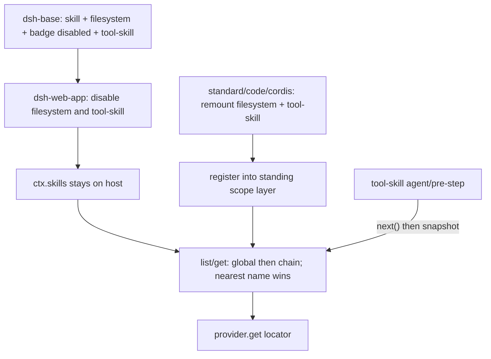

> `ctx.skills` 是 **host 面** skill 注册表（`SkillRegistry`，服务名 `skills`）：Provider 按调用方 `scopeOf(ctx)` 写入 `ScopedLayers`（无标签进 global，agent-preset standing 进该 scope 层）；读路径把 global 与 viewing scope 链合并，**近层同名直接覆盖**，`rank` 只在同一层内决胜。这是 Cordis 组合运行时（`profile → bundle → agent preset`）的 Definition 缝，不是「再扫一遍 Claude / Pi 技能目录」的单表。

## 能回答的问题

- `ctx.skills` 为什么必须留在 host？`dsh-web-app` disable 的是哪两行、留下的是哪一行？
- `skill-filesystem` 扫描哪些根？`<project>/.dsh/skills` 与 `.agents/skills`、`$DSH_HOME` 与 `~/.agents` 各是哪一层 `SkillSource`？
- 同名技能谁赢：层（scope）还是 `rank`？`BUNDLED_SKILL_RANK` 是 600 还是越小越赢？
- `standard` / `code` / `cordis` 为什么能重挂 filesystem 却**不必** `isolate`？`minimal` 还能不能 `list` 到全局层？
- `skill-badge` 是不是产品默认开着的 UI 角标？它和 client `ui-skill` 是不是同一个包？
- `isSkillName` 拒什么名字？非法 frontmatter 会不会拖垮整个 catalog？

## 职责边界

本包拥有：进程级服务 `ctx.skills`（`SkillRegistry`）、kebab-case 名语法 `isSkillName`、按层投递的 `registerProvider` / `register`、cwd+scope 敏感的 `list` / `snapshot` / `get`、赢家合并与 revisioned collect cache、`skills/change` 广播、本地根发现（`@deepseek-ai/dsh-skill-filesystem`）、以及可选 bundled Provider `skill-badge`（`dsh-badge`）。

本包**不**拥有：

- 模型可见 `skill` 工具的 wire schema、catalog `user/message`、`execute` 返回形状 —— [surface.tools.skill](../../surface/tools/skill.md)
- 斜杠菜单 / `ctx.commands` 登记 —— [subsys.interaction.commands](../interaction/commands.md)
- `ScopedLayers` / `bindScopeParent` 原语本身 —— [subsys.core.scope](../core/scope.md)
- `ctx.tools` 执行管线与 schema 投影 —— [subsys.core.tools](../core/tools.md)
- preset 发现、standing mount、`leakedServices` —— [subsys.composition.agent-presets](../composition/agent-presets.md)
- `ctx.fs` 沙箱实现；filesystem Provider 只在非 `trustedHost` 根上借用它
- 浏览器半边 `ui-skill` 工具行渲染（web-app 的 client 包，不是 `skill-badge`）

默认产品路径是本地 Web GUI（`dsh web`），不是 TUI。本仓没有 shipped TUI 包。

## 关键文件

| 路径 | 角色 |
|---|---|
| `packages/skill/skill/src/index.ts` | Definition：`SkillRegistry`、`isSkillName`、`BUNDLED_SKILL_RANK`、层合并、`get` / `list` / `snapshot` |
| `packages/skill/skill/tests/skill.spec.ts` | 层内 rank、近层覆盖、runtime 保留名、scope 链 rebind |
| `packages/skill/skill-filesystem/src/index.ts` | Provider：项目 / custom / user / bundled 根、frontmatter、watcher、`fs/observed` |
| `packages/skill/skill-filesystem/tests/skill-filesystem.spec.ts` | 根优先级、`.git` 回退、非法文件跳过、默认 home |
| `packages/skill/skill-badge/src/index.ts` | bundled Provider：只贡献 `dsh-badge` |
| `packages/skill/skill-badge/tests/skill-badge.spec.ts` | 登记 / dispose / PNG 尺寸 |
| `packages/skill/tool-skill/src/index.ts` | Consumer：读 `ctx.skills`，挂 `agent/pre-step`（本页不写工具字段表） |
| `packages/util/home-paths/src/index.ts` | `$DSH_HOME` 否则 `~/.dsh` |
| `packages/core/scope/src/store.ts` | `ScopedLayers.effect` / `chainLayers`（近者最后写入） |
| `packages/preset/agent-presets/src/mount.ts` | `leakedServices`：preset 不得把 process-global service 泄漏进 root |
| `packages/bundle/base/cordis.patch.yml` | host 行：`skill` + `skill-filesystem` + `skill-badge`（`disabled: true`）+ `tool-skill` |
| `packages/bundle/web-app/cordis.patch.yml` | disable `skill-filesystem` 与 `tool-skill`；**没有** disable `skill` |
| `apps/cli/config/agent-presets/standard/agent.cordis.yml` | preset 面重挂 filesystem + `tool-skill`（无 isolate 组） |
| `apps/cli/config/agent-presets/minimal/agent.cordis.yml` | 不挂 filesystem / `tool-skill` |
| `apps/cli/tests/web-agent-presets.e2e.ts` | 全局层 vs preset 层；`minimal` 能 list、无 loader |
| `vendor/cordis/src/events.ts` | waterfall 必须 `next()` 才会 `shift` |

## 数据模型

| 符号 | 要点 |
|---|---|
| `ctx.skills` / `SkillRegistry` | `super(ctx, 'skills')`。一份 host 服务，内含 `ScopedLayers<SkillLayer>`。 [E: packages/skill/skill/src/index.ts:375] [E: packages/skill/skill/src/index.ts:363] |
| `isSkillName` | `/^[a-z0-9]+(?:-[a-z0-9]+)*$/`。`Bad_Name`、空串、下划线非法。`get` 对非法名直接 `undefined`，不抛。 [E: packages/skill/skill/src/index.ts:20] [E: packages/skill/skill/src/index.ts:35] [E: packages/skill/skill/src/index.ts:502] |
| `SkillSource` | `'project-dsh' \| 'project-agents' \| 'runtime' \| 'user-dsh' \| 'user-agents' \| 'custom' \| 'bundled'`，外加开放 `string`。这是 prompt-visible 来源桶，**本身不是**优先级。 [E: packages/skill/skill/src/index.ts:39] |
| 层内 `rank` | 数值**越小越赢**，然后 `providerOrder`，再 `localOrder`。 [E: packages/skill/skill/src/index.ts:808] [E: packages/skill/skill/src/index.ts:809] [E: packages/skill/skill/src/index.ts:810] |
| `RUNTIME_RANK` | `250`。`register()` 写入的 runtime 技能固定用这个 rank、默认 provider 名 `'runtime'`。 [E: packages/skill/skill/src/index.ts:24] [E: packages/skill/skill/src/index.ts:701] |
| `BUNDLED_SKILL_RANK` | `600`。打包技能与 filesystem 的 bundled 根共用。 [E: packages/skill/skill/src/index.ts:27] |
| filesystem 根 rank | `project-dsh=100`、`project-agents=200`、`custom=300`、`user-dsh=400`、`user-agents=500`、bundled=`BUNDLED_SKILL_RANK`。 [E: packages/skill/skill-filesystem/src/index.ts:36] [E: packages/skill/skill-filesystem/src/index.ts:37] [E: packages/skill/skill-filesystem/src/index.ts:38] [E: packages/skill/skill-filesystem/src/index.ts:39] [E: packages/skill/skill-filesystem/src/index.ts:40] |
| `SkillInvocationPolicy` | `{ modelInvocable, userInvocable }`。registry 的 `list` **不过滤**；模型 / 人手势各自在边界滤。 [E: packages/skill/skill/src/index.ts:48] [E: packages/skill/skill/src/index.ts:127] [E: packages/skill/skill/src/index.ts:136] |
| `SkillViewOptions` | `cwd` 给 Provider；`scope` 给层选择；`signal` 取消。省略 `scope` 只读 global。 [E: packages/skill/skill/src/index.ts:117] [E: packages/skill/skill/src/index.ts:119] |
| `SkillCatalogSnapshot` | `{ skills, complete }`。不完整观察**不进** collect cache。 [E: packages/skill/skill/src/index.ts:232] [E: packages/skill/skill/src/index.ts:488] |
| `Config.collectCacheMaxEntries` | 默认 `128`。cache key 含 `cwd` + scope 链身份 + `revision`。 [E: packages/skill/skill/src/index.ts:21] [E: packages/skill/skill/src/index.ts:359] [E: packages/skill/skill/src/index.ts:645] |
| `'skills/change'` | **emit**，不是 waterfall。listener throw / reject 只 warn，不能否决登记。 [E: packages/skill/skill/src/index.ts:297] [E: packages/skill/skill/src/index.ts:657] |
| filesystem `Config` | `providerName` 默认 `'filesystem'`；`includeDefaultRoots` 默认 `true`；`customSkillDirs` 默认 `[]`；`watch` 默认 `true`。 [E: packages/skill/skill-filesystem/src/index.ts:77] [E: packages/skill/skill-filesystem/src/index.ts:78] [E: packages/skill/skill-filesystem/src/index.ts:81] [E: packages/skill/skill-filesystem/src/index.ts:82] |
| `'runtime'` 保留 | `registerProvider` 不得使用这个 provider 名。 [E: packages/skill/skill/src/index.ts:407] [E: packages/skill/skill/src/index.ts:408] |

同层同名 runtime：先到的赢，后来的 warn + no-op disposer，卸掉后来者不会拆赢家。 [E: packages/skill/skill/src/index.ts:445] [E: packages/skill/skill/src/index.ts:446] [E: packages/skill/skill/tests/skill.spec.ts:1037] [E: packages/skill/skill/tests/skill.spec.ts:1040]

## 控制流

1. **host 面挂 Definition。** `dsh-base` 插入 `id: skill` / `name: '@deepseek-ai/dsh-skill'`。`SkillRegistry` 构造 `super(ctx, 'skills')`，键是 `ctx.skills`。这是进程级服务，不是 preset isolate 里的私有实例。 [E: packages/bundle/base/cordis.patch.yml:237] [E: packages/bundle/base/cordis.patch.yml:238] [E: packages/skill/skill/src/index.ts:375]

2. **base 同时挂三条 Provider / Consumer 行。** 同一份 patch 接着插 `skill-filesystem`、`skill-badge`（`disabled: true`）、`tool-skill`。badge 行在产品树上，但默认不 apply。 [E: packages/bundle/base/cordis.patch.yml:240] [E: packages/bundle/base/cordis.patch.yml:241] [E: packages/bundle/base/cordis.patch.yml:243] [E: packages/bundle/base/cordis.patch.yml:245] [E: packages/bundle/base/cordis.patch.yml:247] [E: packages/bundle/base/cordis.patch.yml:248]

3. **web-app 只关掉 filesystem 与 tool-skill，registry 留下。** overlay 写 `id: skill-filesystem` / `disabled: true` 与 `id: tool-skill` / `disabled: true`。同一文件**没有** `id: skill` 的 disable。默认产品路径 `dsh web` 走这条树：host 仍解析 `ctx.skills`，本地根发现改由 preset 往 **该 standing scope 层** 投递。 [E: packages/bundle/web-app/cordis.patch.yml:330] [E: packages/bundle/web-app/cordis.patch.yml:331] [E: packages/bundle/web-app/cordis.patch.yml:333] [E: packages/bundle/web-app/cordis.patch.yml:334] [I]

4. **preset 重挂进 scope 层，无需 isolate。** `standard` / `code` 在 agent-preset 面再写 `skill-filesystem` + `tool-skill`，两行都是顶层 id，不在 `isolate:` 组里。`cordis` 同样两行，并给 filesystem `customSkillDirs` 指向本 preset 目录下的 `skills/`。`skill-filesystem.apply` 只 `ctx.skills.registerProvider(...)`，不 `provide` 新服务；`mountPreset` 的 `leakedServices` 只抓「子树把 process-global service publish 进 root realm」的行。 [E: apps/cli/config/agent-presets/standard/agent.cordis.yml:83] [E: apps/cli/config/agent-presets/standard/agent.cordis.yml:86] [E: apps/cli/config/agent-presets/code/agent.cordis.yml:90] [E: apps/cli/config/agent-presets/code/agent.cordis.yml:93] [E: apps/cli/config/agent-presets/cordis/agent.cordis.yml:255] [E: apps/cli/config/agent-presets/cordis/agent.cordis.yml:259] [E: packages/skill/skill-filesystem/src/index.ts:132] [E: packages/preset/agent-presets/src/mount.ts:361] [E: packages/preset/agent-presets/src/mount.ts:365]

5. **`minimal` 不挂 filesystem / tool-skill。** 该 composition 收束在 `str-replace-editor`，文件里没有这两行。e2e：`minimal` agent 的 `ctx.skills.list({ scope: agent })` 仍能看见 host 全局层（测试 overlay 打开的 `dsh-badge`），但工具表只有 `bash` / `str_replace_editor`。 [E: apps/cli/config/agent-presets/minimal/agent.cordis.yml:59] [E: apps/cli/tests/web-agent-presets.e2e.ts:396] [E: apps/cli/tests/web-agent-presets.e2e.ts:397] [I]

6. **headless 不搬 discovery。** `dsh-headless` 只 overlay persona / HMR / tools mode，再 insert `code-runtime` / startup / runner，**没有** disable `skill-filesystem` 或 `tool-skill`，也没有 `agent-presets`。headless 路径上 filesystem 留在 host 全局层。这不是 `dsh web` 默认树。 [E: packages/bundle/headless/cordis.patch.yml:31] [I]

7. **登记进调用方那一层。** `registerProvider` / `register` 走 `this.layers.effect(this.ctx, ...)`；`ScopedLayers.effect` 读 `scopeOf(ctx)`：无标签写 `global`，有标签才懒创建 overlay。同层 provider 名唯一（global 报 `already registered`，scoped 报 `already registered in this scope`）。fiber dispose 卸登记并 `invalidateCache`。 [E: packages/skill/skill/src/index.ts:412] [E: packages/core/scope/src/store.ts:231] [E: packages/core/scope/src/store.ts:236] [E: packages/skill/skill/tests/skill.spec.ts:1205]

8. **读：global → 远祖 → 近层，近者覆盖。** `collectFresh` 的层序是 `[global, ...chainLayers(scope)]`；`chainLayers` 远祖在前、本 scope 在后。每一层先 `collectLayer`（层内按 rank 排序，同名只留第一），再 `merged.set(name, entry)` —— 近层同名**无论 rank 多差**都替换远层。测试：global rank `10` 负于 preset rank `900`，带 scope 的 `list` 仍拿 preset。无 scope 的 `list()` 看不见 preset 层。 [E: packages/skill/skill/src/index.ts:557] [E: packages/skill/skill/src/index.ts:563] [E: packages/core/scope/src/store.ts:192] [E: packages/skill/skill/tests/skill.spec.ts:1141] [E: packages/skill/skill/tests/skill.spec.ts:1166] [E: packages/skill/skill/tests/skill.spec.ts:1168]

9. **空白会话换 preset 靠 scope 链，不靠改 registry。** cache key 含 `scopeChainOf`。测试把 agent key `bindScopeParent` 到 preset A，再 `rebind` 到 B，下一次 `list({ scope: agentKey })` 换成 B 的技能，registry 零写入。 [E: packages/skill/skill/src/index.ts:528] [E: packages/skill/skill/tests/skill.spec.ts:1186] [E: packages/skill/skill/tests/skill.spec.ts:1190] [E: packages/skill/skill/tests/skill.spec.ts:1191]

10. **web 产品树上的可见性。** e2e 在临时工程写 `<proj>/.dsh/skills/project-proof/SKILL.md`，mount `standard` 后：无 scope 的 `list({ cwd })` **只有**测试打开的全局 `dsh-badge`；带 `scope: agent` 才同时有 `dsh-badge` 与 `project-proof`。这钉死「本地发现在 preset 层、registry 在 host」。 [E: apps/cli/tests/web-agent-presets.e2e.ts:364] [E: apps/cli/tests/web-agent-presets.e2e.ts:369] [E: apps/cli/tests/web-agent-presets.e2e.ts:370]

11. **filesystem 组根。** `FileSystemSkillProvider.roots(cwd)`：`includeDefaultRoots && cwd` 时，先 `findProjectRoot`（向上找第一个 `.git`，找不到就用 `cwd`），再压入 `<project>/.dsh/skills`（`project-dsh`）与 `<project>/.agents/skills`（`project-agents`）；然后 `customSkillDirs`（`custom`）；再 `includeDefaultRoots` 时压 `$DSH_HOME/skills`（`user-dsh`，`skipSystem: true`）与 `$DSH_AGENTS_HOME` 否则 `~/.agents` 下的 `skills`（`user-agents`）；最后可选 `bundledSkillDir` / `DSH_BUNDLED_SKILL_DIR`（`bundled`，`trustedHost: true`）。`dshHome` 走 `resolveDshHome`：显式配置、非空白 `$DSH_HOME`、否则 `~/.dsh`。 [E: packages/skill/skill-filesystem/src/index.ts:243] [E: packages/skill/skill-filesystem/src/index.ts:246] [E: packages/skill/skill-filesystem/src/index.ts:247] [E: packages/skill/skill-filesystem/src/index.ts:250] [E: packages/skill/skill-filesystem/src/index.ts:253] [E: packages/skill/skill-filesystem/src/index.ts:254] [E: packages/skill/skill-filesystem/src/index.ts:258] [E: packages/skill/skill-filesystem/src/index.ts:940] [E: packages/skill/skill-filesystem/src/index.ts:944] [E: packages/util/home-paths/src/index.ts:87] [E: packages/util/home-paths/src/index.ts:89] [E: packages/skill/skill-filesystem/src/index.ts:163] [E: packages/skill/skill-filesystem/src/index.ts:164]

12. **同层赢家（filesystem 测试钉死）。** 五个根都放同名 `same` 时，catalog 赢家 `source === 'project-dsh'`。`user-dsh` 的 `.system/` 不进表。project 压过 runtime，runtime 压过 custom / user（`RUNTIME_RANK=250` 夹在 `project-agents=200` 与 `custom=300` 之间）。无 `.git` 时 project 根回退到 `cwd` 自己。 [E: packages/skill/skill-filesystem/tests/skill-filesystem.spec.ts:198] [E: packages/skill/skill-filesystem/tests/skill-filesystem.spec.ts:199] [E: packages/skill/skill-filesystem/tests/skill-filesystem.spec.ts:232] [E: packages/skill/skill-filesystem/tests/skill-filesystem.spec.ts:233] [E: packages/skill/skill-filesystem/tests/skill-filesystem.spec.ts:205]

13. **发现形状与容错。** 每个根：目录条目 → `<dir>/SKILL.md`；`*.md` 文件 → 扁平技能（`resourceBase.directory` 是根）。缺 frontmatter、非法 YAML、缺 `name`/`description`、`!isSkillName`、旧键 `disableModelInvocation` / `modelInvocable` / `userInvocable`：该文件 warn 后跳过，不拖垮兄弟。invocation 只认 `disable-model-invocation` 与 `user-invocable`（缺省模型可调、用户可调）。 [E: packages/skill/skill-filesystem/src/index.ts:724] [E: packages/skill/skill-filesystem/src/index.ts:726] [E: packages/skill/skill-filesystem/src/index.ts:816] [E: packages/skill/skill-filesystem/src/index.ts:996] [E: packages/skill/skill-filesystem/src/index.ts:999] [E: packages/skill/skill-filesystem/src/index.ts:1000] [E: packages/skill/skill-filesystem/tests/skill-filesystem.spec.ts:273] [E: packages/skill/skill-filesystem/tests/skill-filesystem.spec.ts:298]

14. **加载。** `get(name, options)`：非法名 → `undefined`；`collect` 选出赢家后把 `locator` 交回**那个** provider 的 `get`。filesystem 把 locator 当成 `{ path, directory }`，再 `parseSkillFile`。`ctx.fs` 存在且根不是 `trustedHost` 时走 fs 服务；bundled 根与缺 fs 时走 Node `readFile`。返回体 `name` 若与 candidate 不一致，registry 作废该条 cache 并返回 `undefined`。 [E: packages/skill/skill/src/index.ts:501] [E: packages/skill/skill/src/index.ts:508] [E: packages/skill/skill/src/index.ts:513] [E: packages/skill/skill-filesystem/src/index.ts:207] [E: packages/skill/skill-filesystem/src/index.ts:751] [E: packages/skill/skill-filesystem/src/index.ts:844]

15. **失效不是 waterfall。** provider `control.invalidate()`、runtime 登记、层变更都会 `revision++` 并 `emit('skills/change')`。`collect` 最多重试 `MAX_COLLECT_ATTEMPTS = 2`；仍撞 revision 则交不完整、不缓存的结果。filesystem 默认 `watch: true`；`edit` / `write` 的 `fs/observed` 会同步 `observeHostMutation`。`includeDefaultRoots: false` 的隔离实例只看见 `customSkillDirs`，连 `DSH_BUNDLED_SKILL_DIR` 都不收。 [E: packages/skill/skill/src/index.ts:22] [E: packages/skill/skill/src/index.ts:623] [E: packages/skill/skill/src/index.ts:625] [E: packages/skill/skill-filesystem/src/index.ts:139] [E: packages/skill/skill-filesystem/src/index.ts:696] [E: packages/skill/skill-filesystem/tests/skill-filesystem.spec.ts:848]

16. **`skill-badge` 是 bundled Provider，base 默认关掉。** `apply` 登记名为 `dsh-badge` 的 provider，候选 `source: 'bundled'`、`rank: BUNDLED_SKILL_RANK`，`get` 读包装内 `dsh-badge.md`。单测：挂上能 `list`/`get`，dispose 后 catalog 空。产品树 `disabled: true`；e2e 为了测全局层才在测试 overlay 里写 `{ id: 'skill-badge', disabled: false }`。不要把它写成 Web 必开，也不要和 `@deepseek-ai/dsh-client-ui-skill` 混成一个包。 [E: packages/skill/skill-badge/src/index.ts:58] [E: packages/skill/skill-badge/src/index.ts:59] [E: packages/skill/skill-badge/src/index.ts:30] [E: packages/skill/skill-badge/src/index.ts:32] [E: packages/skill/skill-badge/tests/skill-badge.spec.ts:16] [E: packages/skill/skill-badge/tests/skill-badge.spec.ts:29] [E: packages/bundle/base/cordis.patch.yml:245] [E: apps/cli/tests/web-agent-presets.e2e.ts:84]

17. **Consumer 挂在 `agent/pre-step`，必须 `next()`。** `tool-skill` 的 `inject = ['agents', 'tools', 'skills']`。catalog listener 先 `const decision = await next()`，再按 `scope: agent` 调 `ctx.skills.snapshot`。`Events.waterfall` 靠传入的 `next()` 才 `cbs.shift()`；省略 `next()` = 内层 pre-step（含 loop 决策）不跑。本页不写 `skill` 工具字段；execute / catalog 正文形状见 [surface.tools.skill](../../surface/tools/skill.md)。 [E: packages/skill/tool-skill/src/index.ts:25] [E: packages/skill/tool-skill/src/index.ts:217] [E: packages/skill/tool-skill/src/index.ts:218] [E: packages/skill/tool-skill/src/index.ts:222] [E: vendor/cordis/src/events.ts:238]

## 设计动机

DSH 把 skill 做成 **host 一份 registry + per-scope 投递**，是为了让 Web Gateway、多会话、preset authoring 都解析同一个服务名 `skills`，同时让 `cordis` 的 `customSkillDirs` 只污染**那一份** standing 层。把 registry 搬进 per-session isolate，第二次会话会撞名，Remote 也会变成 `service-unavailable` —— 这和 jobs / goals 留在 host 是同一条组合理由。

`rank` 表达的是**同一层里**项目根压过 user 根、runtime 夹在中间、bundled 垫底；跨层则学 tools registry：近处 shadow，避免「preset 自定义 900 分不过 host 的 10 分」。`SkillSource` 故意不兼当优先级，免得模型看见的来源标签和合并规则缠在一起。

`dsh-web-app` disable 掉 host `skill-filesystem`，是为了让「扫这个 cwd 的 `.dsh/skills`」成为 preset 的成员资格，而不是进程光环：无 scope 的 `list({ cwd })` 在 web 测试里看不到 `project-proof`。`minimal` 留下可读的全局层、不挂 loader，把「看不看得见」和「能不能调 `skill`」拆开。

`skill-badge` 做成独立 bundled Provider 且 base `disabled: true`，避免把「给 PR 贴 powered-by 徽章」绑进默认模型可见 catalog。要演示全局层时，测试再打开这一行。

## Gotcha

- **近层碾压 rank。** 不要按 `BUNDLED_SKILL_RANK = 600` 推断 preset 盖不过 host。600 只在同一层内垫底。 [E: packages/skill/skill/tests/skill.spec.ts:1141]
- **`SkillSource` 不是优先级。** 两个 `source: 'runtime'` 仍按层 + rank 比。开放 `string` 允许测试 / 第三方自报来源。 [E: packages/skill/skill/src/index.ts:39]
- **名字语法是闭环。** filesystem 非法名只 warn 跳过；`register()` 非法名抛；`get('Bad_Name')` 返回 `undefined`。三条路径都认同一份 `SKILL_NAME`。 [E: packages/skill/skill/src/index.ts:20] [E: packages/skill/skill/tests/skill.spec.ts:1025] [E: packages/skill/skill/tests/skill.spec.ts:1035]
- **产品主目录是 `$DSH_HOME` 否则 `~/.dsh`。** user-dsh 是 `$DSH_HOME/skills`。user-agents 是 `$DSH_AGENTS_HOME` 否则 `~/.agents/skills`，**不是** `~/.dsh` 的别名，也不是 Claude / Pi 的配置根。项目层同时扫 `<project>/.dsh/skills` 与 `<project>/.agents/skills`。 [E: packages/skill/skill-filesystem/src/index.ts:246] [E: packages/skill/skill-filesystem/src/index.ts:247] [E: packages/skill/skill-filesystem/src/index.ts:253] [E: packages/skill/skill-filesystem/src/index.ts:254]
- **`user-dsh` 跳过 `.system`。** 其它根不过这个滤镜。 [E: packages/skill/skill-filesystem/src/index.ts:253] [E: packages/skill/skill-filesystem/src/index.ts:723]
- **`list` 按名字码点排序，不按 rank。** rank 只决定谁进表。 [E: packages/skill/skill/src/index.ts:487]
- **invocation 中立。** `disable-model-invocation: true` 的技能仍在 `ctx.skills.list` 里；模型 catalog 与 `/name` 手势各自过滤。本页不写那两条边界的字段表。 [E: packages/skill/skill-filesystem/tests/skill-filesystem.spec.ts:278]
- **provider 名按层唯一。** 两个 preset 可以各挂一个名叫 `filesystem` 的 provider；同一层再挂一次抛错。 [E: packages/skill/skill/tests/skill.spec.ts:1202] [E: packages/skill/skill/tests/skill.spec.ts:1205]
- **`skill-badge` 默认关。** 看见 e2e 里的 `dsh-badge` 不要推论 `dsh web` 开箱就有。 [E: packages/bundle/base/cordis.patch.yml:245] [E: apps/cli/tests/web-agent-presets.e2e.ts:84]
- **`skills/change` 没有 `next()`。** 把它当成 waterfall、指望不调用就挡住别人，是错的。真 waterfall 在 Consumer 的 `agent/pre-step`。 [E: packages/skill/skill/src/index.ts:297] [E: vendor/cordis/src/events.ts:238]
- **隔离 Provider 必须关默认根。** `includeDefaultRoots: false` 才会丢掉环境 bundled 根，避免每个隔离实例用自己的 provider 名再发现一遍应用内置技能。 [E: packages/skill/skill-filesystem/src/index.ts:172] [E: packages/skill/skill-filesystem/tests/skill-filesystem.spec.ts:848]

## Seam 三角

| 角色 | 包 | ctx 键 / 合同 | bundle / preset 行 |
|---|---|---|---|
| Definition | `@deepseek-ai/dsh-skill`（`SkillRegistry`） | `ctx.skills`；`list` / `snapshot` / `get`；`registerProvider` / `register` | `dsh-base` `id: skill`。web-app **不** disable。preset **不得**再 publish 一份 `skills` |
| Provider | `@deepseek-ai/dsh-skill-filesystem`（`FileSystemSkillProvider`）；`@deepseek-ai/dsh-skill-badge`（`dsh-badge`）；任意 `registerProvider` / `register()` | 写入调用方 scope 层；`list(cwd, signal)` / `get(candidate)` | base 挂 filesystem（web 关掉）+ badge（`disabled: true`）。`standard` / `code` / `cordis` 重挂 filesystem 进 standing 层；`cordis` 另配 `customSkillDirs`。`minimal` 不挂 |
| Consumer | `@deepseek-ai/dsh-tool-skill`；人手势 / commands（本页不展开） | `inject: ['agents', 'tools', 'skills']`；`agent/pre-step` 必须 `next()` | base 挂 `tool-skill`；web-app disable；`standard` / `code` / `cordis` 重挂；`minimal` 不挂 |

换 filesystem 实现只换「根从哪来、正文怎么读」。换 Consumer 不能绕开 `isSkillName` 与层合并。preset 需要**私有服务实例**时才写 `isolate`；往已有 `ctx.skills` 登记不是那种服务。

## Sources

- packages/skill/skill/src/index.ts
- packages/skill/skill-filesystem/src/index.ts
- packages/skill/skill-badge/src/index.ts
- packages/skill/skill/tests/skill.spec.ts
- packages/skill/skill-filesystem/tests/skill-filesystem.spec.ts
- packages/skill/skill-badge/tests/skill-badge.spec.ts
- packages/skill/tool-skill/src/index.ts
- packages/util/home-paths/src/index.ts
- packages/core/scope/src/store.ts
- packages/preset/agent-presets/src/mount.ts
- packages/bundle/base/cordis.patch.yml
- packages/bundle/web-app/cordis.patch.yml
- packages/bundle/headless/cordis.patch.yml
- apps/cli/config/agent-presets/standard/agent.cordis.yml
- apps/cli/config/agent-presets/code/agent.cordis.yml
- apps/cli/config/agent-presets/cordis/agent.cordis.yml
- apps/cli/config/agent-presets/minimal/agent.cordis.yml
- apps/cli/tests/web-agent-presets.e2e.ts
- vendor/cordis/src/events.ts

## 相关

- [spine.overview](../../spine/overview.md) — `profile → bundle → preset`；host 面 vs agent-preset 面。
- [surface.tools.skill](../../surface/tools/skill.md) — 模型可见 `skill` 加载器与 catalog 消息（本页不写 schema）。
- [subsys.core.tools](../core/tools.md) — `ctx.tools` 注册与 `tools/execute` 管线。
- [subsys.core.scope](../core/scope.md) — `ScopedLayers` / `bindScopeParent` / 近层覆盖。
- [subsys.composition.agent-presets](../composition/agent-presets.md) — standing mount 与 `leakedServices`。
- [spine.context-and-compaction](../../spine/context-and-compaction.md) — 上下文管道里 skill catalog 以外的装配。
- [subsys.composition.bundle-base](../composition/bundle-base.md) — host 行 `skill` / filesystem / badge / `tool-skill`。
- [subsys.composition.bundle-web-app](../composition/bundle-web-app.md) — disable filesystem + `tool-skill`，registry 留 host。
- [surface.presets.standard](../../surface/presets/standard.md) — web 默认 preset 的 skill 两行。
- [surface.presets.minimal](../../surface/presets/minimal.md) — 不挂 loader，全局层仍可读。
- [surface.presets.cordis](../../surface/presets/cordis.md) — `customSkillDirs` 与 `editing-cordis-compositions`。
- [surface.profiles.web](../../surface/profiles/web.md) — 默认安装路径 `dsh web`。
- [subsys.interaction.commands](../interaction/commands.md) — 斜杠菜单（本页不拥有）。
