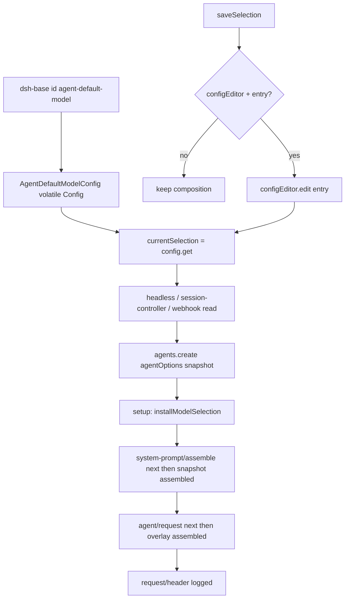

> `ctx.agentDefaultModel` 是 **host 面** 的进程级默认 `ModelSelection`：入口在「还没有会话专属选择」时用它给 **未来新 Agent** 填 `provider` / `model`。它不改已经 running 的 `Agent.options`，也不实现 adapter / retry。live 值来自 volatile Cordis Config；持久化走 `ctx.configEditor.edit`，不再走已删除的 `dsh-settings-file` 命名空间。

DSH 是 Cordis 组合运行时（`profile → bundle → agent preset`），不是「又一个 coding agent」。capability seam 是 Definition / Provider / Consumer。本服务坐在 **host 面**（和 `sessions` / `llm` / `settings` 同一层），不进 agent-preset 的 tools / persona / isolate 树。进入模型请求的 `provider` / `model` 必须能从 session log 的 `request/header` 重建（`model-visible ⟺ logged`）；本服务只提供「下一个新 Agent 从哪起」。

## 能回答的问题

- 新 Agent 的 `provider` / `model` 从哪读？composition config 还是 settings 命名空间？
- `currentSelection()` / `saveSelection()` 各写读哪一层？没挂 `ctx.configEditor` 会怎样？
- `dsh-base` 行上的默认值是什么，和 `deepseek-official` 路由怎么对上？
- `saveSelection` 会不会改已经 running 的 `Agent.options`？空白会话为什么又能读到新默认？
- 这行为什么必须留在 host 面？preset 再挂一次会撞 `leakedServices` 还是 `already registered`？
- `installModelSelection` 的 `system-prompt/assemble` / `agent/request` waterfall 为什么必须 `next()`？
- Web / headless / webhook / ACP / SDK 客户端各自怎么消费这份默认？

## 职责边界

本包 `@deepseek-ai/dsh-agent-default-model` 拥有： [E: packages/core/agent-default-model/package.json:2]

- 服务键 `ctx.agentDefaultModel`（类 `AgentDefaultModelConfig`）。 [E: packages/core/agent-default-model/src/index.ts:19]
- 组合 `Config`：必填 volatile `provider` + `model`，可选 volatile `reasoningEffort`。 [E: packages/core/agent-default-model/src/index.ts:24] [E: packages/core/agent-default-model/src/index.ts:51]
- 只读投影 `currentSelection()` 与整段写入 `saveSelection()`（经 `configEditor`）。

本包 **不** 拥有：

- `Agent` 合同、`ctx.agents` 工厂槽、`Agent.options` 的生命周期 — [subsys.core.agent](./agent.md)。
- 每会话 `ModelSelectionRef` 与 `installModelSelection` 的 waterfall 挂钩（符号在 `@deepseek-ai/dsh-agent`，入口在 create `setup` 里装）。
- `deepseek-official` 适配器、catalog、key、retry — [subsys.llm.deepseek](../llm/deepseek.md)。本页不展开 adapter。
- session `request/header` 折叠与 `deriveMessages()` — [spine.turn-and-step](../../spine/turn-and-step.md)。
- preset 成员资格、standing mount、`leakedServices` 审计实现 — [subsys.composition.bundle-base](../composition/bundle-base.md) / agent-presets。
- Codex / Claude 子代理后端。`dsh-base` **没有** `subagent-codex` / `subagent-claude-code` 行，也不是「装了但 dormant」：`base.spec.ts` 要求这两行长度为 0，且 manifest 不依赖对应包。 [E: packages/bundle/base/tests/base.spec.ts:42] [E: packages/bundle/base/tests/base.spec.ts:43] [E: packages/bundle/base/tests/base.spec.ts:47] [E: packages/bundle/base/tests/base.spec.ts:48]

## 关键文件

| 路径 | 角色 |
|---|---|
| `packages/core/agent-default-model/src/index.ts` | `AgentDefaultModelConfig`：publish `agentDefaultModel`，读 volatile Config，写 `configEditor` |
| `packages/core/agent-default-model/tests/agent-default-model.spec.ts` | 有/无 editor、partial overlay、清 effort、串行 save |
| `packages/core/agent-default-model/package.json` | 包名 `@deepseek-ai/dsh-agent-default-model` |
| `packages/bundle/base/cordis.patch.yml` | host 行 `id: agent-default-model` 的默认 `provider` / `model` |
| `packages/core/agent/src/model-selection.ts` | 每会话 `installModelSelection`：assemble / request 必须 `next()` |
| `packages/api/session-controller/src/agent.ts` | Host HTTP：create 快照 + 空白会话 live 读 |
| `packages/api/session-controller/src/commands.ts` | `selectModel` 回写默认 |
| `packages/bundle/headless/src/index.ts` | headless-runner：create 时读一次，装进 `agentOptions` 与 `ModelSelectionRef` |
| `packages/webhook/webhook/src/session.ts` | webhook 会话省略 model 时读 `currentSelection()` |
| `packages/llm/llm-deepseek/src/models.ts` | 默认 catalog：`deepseek-flash` + `deepseek-v4-pro` |
| `packages/sdk/client/src/api.ts` | SDK 客户端构造默认仍写 `deepseek-v4-flash` |

## 数据模型

四个名字不要混：yml `id: agent-default-model`、包 `@deepseek-ai/dsh-agent-default-model`、ctx 键 `agentDefaultModel`。**没有**独立 settings 命名空间 `agent-default-model`。

| 符号 | 字段 | 必填 | 含义 |
|---|---|---|---|
| `Config` | volatile `provider`, `model`, `reasoningEffort?` | 前两 | 组合行；effort 可省略 |
| `ModelSelection` | `provider`, `model`, `reasoningEffort?` | 前两 | Agent 面；effort 经 `ReasoningEffortId()` brand |
| `ModelSelectionRef` | `current`, `assembled` | — | 入口持有的可变选择；`assembled` 是进 assemble 时的快照 |

`selection()` 每次返回新对象：有 `reasoningEffort` 才展开该键，并用 `ReasoningEffortId` brand。 [E: packages/core/agent-default-model/src/index.ts:34]

`Agent.options` 是 handle 上的 `AgentOptions`（`provider?` / `model?` / `reasoningEffort?` / `maxTokens?`），不是本服务的 live 视图。 [E: packages/core/agent/src/runtime-types.ts:26] [E: packages/core/agent/src/runtime-types.ts:28] [E: packages/core/agent/src/runtime-types.ts:32]

`currentSelection()` 读 `this.config.*.get()`，不是 merge 一份 settings 文档。`saveSelection` 经 `configEditor.edit(entry, () => config)` 写回 **owning profile entry**；没有 `fiber.entry` 或没有 `configEditor` 时直接 return，composition 不变。 [E: packages/core/agent-default-model/src/index.ts:67] [E: packages/core/agent-default-model/src/index.ts:82]

## 控制流

```mermaid
flowchart TD
  Base["dsh-base id agent-default-model"] --> Ctor["AgentDefaultModelConfig volatile Config"]
  Ctor --> Live["currentSelection = config.get"]
  Live --> Entry["headless / session-controller / webhook read"]
  Entry --> Create["agents.create agentOptions snapshot"]
  Create --> Setup["setup: installModelSelection"]
  Setup --> Assemble["system-prompt/assemble next then snapshot assembled"]
  Assemble --> Request["agent/request next then overlay assembled"]
  Request --> Header["request/header logged"]
  Save["saveSelection"] --> Opt{"configEditor + entry?"}
  Opt -->|no| Noop["keep composition"]
  Opt -->|yes| Edit["configEditor.edit entry"]
  Edit --> Live
```

1. `dsh-base` 在 host 根 insert 挂 `id: agent-default-model`，`name: '@deepseek-ai/dsh-agent-default-model'`，`config.provider: deepseek-official`，`config.model: deepseek-flash`。该行只有 `id` / `name` / `config`，没有 `isolate:`，服务进 root realm。web-app / headless / sdk overlay **不**再 patch 这行（`sdk-minimal` 不叠 `dsh-base`，也就没有这行）。`agent-loop` 的 `agents: []` 表示 base 不在 boot 时按 config 造 Agent，默认只在入口 `create` 时被读。ACP 插件行自己再写一对 **`deepseek-v4-flash`**，那是 ACP 包 config，不是本服务 overlay，也不是 composition 默认。TS SDK `DeepSeekHarness` 构造默认同样是 `deepseek-v4-flash`，也不是本行。[E: packages/sdk/client/src/api.ts:43] [E: packages/bundle/base/cordis.patch.yml:82] [E: packages/bundle/base/cordis.patch.yml:85] [E: packages/bundle/base/cordis.patch.yml:86] [E: packages/bundle/base/cordis.patch.yml:513] [E: packages/bundle/acp-app/cordis.patch.yml:20] [E: packages/bundle/acp-app/cordis.patch.yml:21]

2. Loader 实例化 `AgentDefaultModelConfig@packages/core/agent-default-model/src/index.ts`。`super(ownerContext, 'agentDefaultModel')` 把实现 publish 到当前 isolate 表；host 根上 `root[symbols.isolate][name] ??= Symbol(name)`，同名二次 publish 抛 `service "agentDefaultModel" has been registered at <…>`。构造函数可选 `inject(['settings'], …)` 只为关掉 settings 自动页，**不**把默认值叠进 settings 文档。 [E: packages/core/agent-default-model/src/index.ts:57] [E: vendor/cordis/src/reflect.ts:286] [E: vendor/cordis/src/reflect.ts:290] [E: packages/core/agent-default-model/src/index.ts:60]

3. `currentSelection()` 只做 `selection({ provider: config.provider.get(), model: config.model.get(), reasoningEffort? })`，每次新对象。单测用 `liveConfig` 热更新 volatile 引用，不把 composition fixture 写成 `deepseek-v4-flash`。`replace` 只写 `provider`/`model` 时会清掉上次的 effort。 [E: packages/core/agent-default-model/src/index.ts:67] [E: packages/core/agent-default-model/tests/agent-default-model.spec.ts:12] [E: packages/core/agent-default-model/tests/agent-default-model.spec.ts:15] [E: packages/bundle/base/cordis.patch.yml:86]

4. `saveSelection()` 串行排队：`configEditor.edit(entry, () => config)`。没有 `fiber.entry` 或没有 `configEditor` 时 return，composition 不变。有 editor 时整段替换：再存一份不带 effort 的 selection，会清掉上次的 effort。失败的 save 不挡后续 save。 [E: packages/core/agent-default-model/src/index.ts:82] [E: packages/core/agent-default-model/src/index.ts:84] [E: packages/core/agent-default-model/src/index.ts:86] [E: packages/core/agent-default-model/tests/agent-default-model.spec.ts:16] [E: packages/core/agent-default-model/tests/agent-default-model.spec.ts:26] [E: packages/core/agent-default-model/tests/agent-default-model.spec.ts:35]

5. **headless 入口** `run@packages/bundle/headless/src/index.ts`：`currentSelection()` 读一次，写入 `agents.create({ agentOptions: { provider, model } })`，并在 `setup` 里 `installModelSelection`。headless **不挂** roster：模型可见工具留在 host 全局层。headless 是 shipped CLI profile 之一（`dsh --profile headless`）。 [E: packages/bundle/headless/src/index.ts:332] [E: packages/bundle/headless/src/index.ts:340]

6. **Host HTTP / Web 入口** 不再走已删除的 `packages/host/apiproxy`。`SessionController@packages/api/session-controller/src/index.ts` 的 `static inject` 含 `'agentDefaultModel'`。`agentOptions()` 每次 create **现读**默认，只取 `provider` / `model` 填 `AgentOptions`（effort 不进这次 create 的 `agentOptions`）。`modelCatalog` 默认参数同样现读 `currentSelection()`，作为「下一个新会话会用的默认」。 [E: packages/api/session-controller/src/index.ts:101] [E: packages/api/session-controller/src/agent.ts:497] [E: packages/api/session-controller/src/catalog.ts:22]

7. `selectionFor@packages/api/session-controller/src/agent.ts` 给每个 live `Agent` 装一份 `InstalledSelection`（WeakMap + `modelSelection` projection）。**每次**读 `current`：进程内 `picked` → 否则 `session.requestHeader()?.config` → 否则再调 `agentDefaultModel.currentSelection()`。还没有 `request/header` 的会话因此会吃到 create **之后**才 `saveSelection` 的值；已经打过 header 的会话跟 log，不跟默认。[E: packages/api/session-controller/src/agent.ts:283] [E: packages/api/session-controller/src/agent.ts:295] [E: packages/api/session-controller/src/agent.ts:298] `composeAgent` 在无 roster 与有 roster 两条路上都先 `installSelection`。 [E: packages/api/session-controller/src/agent.ts:387] [E: packages/api/session-controller/src/agent.ts:393]

8. `SessionCommandController.selectModel` 先 `llm.resolveCallConfig`，再 `selectForNextRequest`（append `model/selection` 并把 `selectionFor(agent).current` 设成这份值），然后 `agentDefaultModel.saveSelection(selected)`（改 **未来** Agent 的默认）。save 失败只 `logger.warn`，本会话切换仍然生效。这不是改 `Agent.options`。 [E: packages/api/session-controller/src/commands.ts:151] [E: packages/api/session-controller/src/commands.ts:156] [E: packages/api/session-controller/src/agent.ts:333] [E: packages/api/session-controller/src/commands.ts:170] [E: packages/api/session-controller/src/commands.ts:171]

9. **webhook** `@deepseek-ai/dsh-webhook` 的 `static inject` 含 `'agentDefaultModel'`。会话请求省略 `model` 时用 `currentSelection()` 填 `agentOptions`。 [E: packages/webhook/webhook/src/index.ts:61] [E: packages/webhook/webhook/src/session.ts:64]

10. **waterfall 必须 `next()`。** `Events.waterfall@vendor/cordis/src/events.ts` 把最后一个参数当 innermost `next`：listener 不调用传入的 `next()` 就不会 `cbs.shift()`，内层 listener 和 inner seed 全部停住。`installModelSelection` 在 **agent 作用域** 上挂两条：`system-prompt/assemble` 先 `const selected = selection.current`，再 `await next()`，然后才写 `selection.assembled = selected` 并覆盖 `variables.provider/model`；`agent/request` 先 `await next()` 拿到 seed `LlmCallConfig`，再用 **`assembled`**（不是此时的 `current`）覆盖 `provider` / `model`，并在缺 effort 时拆掉继承来的 `reasoningEffort`。并发切模型不会把「prompt 变量」和「请求路由」撕成两半。测试：assemble 后把 `current` 改成 `beta`，紧接着的 `agent/request` 仍走 assemble 时的 `alpha`。 [E: vendor/cordis/src/events.ts:237] [E: vendor/cordis/src/events.ts:238] [E: packages/core/agent/src/model-selection.ts:82] [E: packages/core/agent/src/model-selection.ts:84] [E: packages/core/agent/src/model-selection.ts:99] [E: packages/core/agent/tests/model-selection.spec.ts:94] [E: packages/core/agent/tests/model-selection.spec.ts:95]

11. `ReactLoopAgent.prepareRequest@packages/core/agent-loop/src/agent.ts` 先用 `this.options.provider/model`（create 时写入的 `AgentOptions`）组成 `route`。`seedConfig` 不是永远这份 create 快照：本实例还没 append 过 `request/header` 时，seed 是 `route`（可加同 route 才继承的 effort 与 `options.maxTokens`）；`requestHeaderLogged` 之后则 `requestProposal(persistedHeader)`，从已 logged 的 header 去掉 adapter-derived 的 effort / maxTokens，不再读 `this.options`。`deepFreeze(structuredClone(…))` 冻住 seed，再 `dispatch.waterfall('agent/request', …, () => seedConfig)`。没有 `installModelSelection` 时，请求停在这条 seed。[E: packages/core/agent-loop/src/agent.ts:530] [E: packages/core/agent-loop/src/agent.ts:550] [E: packages/core/agent-loop/src/agent.ts:559] loop 还往 `ctx.systemPrompt` 注册变量 `provider` / `model`，读的是 `context.agent?.options`（create 快照）；Host / headless 靠 assemble waterfall 用 `ModelSelectionRef` 覆盖同名变量。 [E: packages/core/agent-loop/src/index.ts:370] [E: packages/core/agent-loop/src/index.ts:371]

12. **isolate / `leakedServices`。** 本行是 host 服务，yml 不写 `isolate`。preset 再挂 `@deepseek-ai/dsh-agent-default-model` 且不 `isolate: { agentDefaultModel: true }`：host 已占用 root 符号时，步骤 2 的 `provide` 先抛 already registered；若 root 上还没有这键、preset 子树却写进 `rootIsolate[name]`，`leakedServices@packages/preset/agent-preset-registry/src/mount.ts` 会扫到该 name 并抛 `Preset services require isolate realms`。shipped `minimal` / `standard` / `ptc` / `cordis` 的 patch **没有** 这行。需要进程级一份默认，就留在 host。 [E: packages/preset/agent-preset-registry/src/mount.ts:86] [E: packages/preset/agent-preset-registry/src/mount.ts:267]

默认路由名 `deepseek-official` 由 `dsh-llm-deepseek` 注册。省略 `models` 时 catalog 列出 `deepseek-flash`（V41，`inputModalities` 含 image，base 新 Agent 默认）与 `deepseek-v4-pro`。`deepseek-v4-flash` **不**在这份默认 catalog 里；未列出的 id 仍可作为纯文本路由通过。acp-app 与 SDK 客户端构造仍默认写 `deepseek-v4-flash`。 [E: packages/llm/llm-deepseek/src/models.ts:8] [E: packages/llm/llm-deepseek/src/models.ts:16] [E: packages/sdk/client/src/api.ts:43] [E: packages/bundle/acp-app/cordis.patch.yml:21] `AgentDefaultModelConfig` 构造函数不碰 `ctx.llm`，所以本服务不查 catalog、不碰 key。 [I]

## 设计动机

- **一个 owner，多条入口。** headless 没有 HTTP；Web 走 session-controller + api-gateway；webhook 省略 model 时也读同一服务。避免 launcher / Host / loop 各写一份默认。 [I]
- **没有 config editor 也能 boot。** composition 行是完整 `Config`；`saveSelection` 把 editor 当成可选层，而不是硬 `static inject`。headless 测试台可以只 `provide` 一个假 `currentSelection`。
- **`reasoningEffort` 可以写进 Config，但 save 必须能清掉。** 完整 `saveSelection` 不带 effort 键时，下一模型不会从旧值继承。
- **默认 ≠ 正在跑的 Agent。** 服务只存「下一个 create 读什么」。已经 running 的路由走 `prepareRequest` 的 `seedConfig`（首次用 create 时 `Agent.options`，`requestHeaderLogged` 之后用 `requestProposal(persistedHeader)`）+ 每会话 `ModelSelectionRef` 覆盖。`model-visible ⟺ logged`：真正进 adapter 的 pair 落在 `request/header`，不落在 settings 文档。
- **空白会话现读。** Host New Session 复用 id 而不 mint 新 session 时，create-time 快照会过期；`selectionFor` 在没有 header 时每次回默认，和 `modelCatalog` 同一数据源。

## Gotcha

- **三个名字。** yml id 是 kebab `agent-default-model`；ctx 键是 camel `agentDefaultModel`；包名带 `dsh-` 前缀。没有 settings ns。
- **`saveSelection` 在无 editor / 无 entry 时静默成功。** 测试里 standalone Context 上 `saveSelection` 之后 `currentSelection` 仍是 composition。 [E: packages/core/agent-default-model/tests/agent-default-model.spec.ts:31]
- **本服务不改 `Agent.options`。** Host `selectModel` 改的是 `selectionFor` 的 `picked` 外加默认文档；loop 若没装 `installModelSelection`，下一步停在 `seedConfig`：首次是 create 时 `Agent.options`，已经 logged `request/header` 之后是 `requestProposal(persistedHeader)`。
- **已有 `request/header` 的会话不跟默认走。** `selectionFor` 在 `picked` 为空时优先 log。切默认只影响空白会话和未来 create。
- **assemble / request 用的不是同一瞬间的 `current`。** 只认 `assembled`。listener 若漏掉 `next()`，整条 `system-prompt/assemble` 或 `agent/request` 链停在本层，inner seed（`seedConfig`）到不了 loop。
- **不校验 catalog。** 存一个未注册的 `provider` 也能 `currentSelection` 成功；真正失败发生在 `llm.resolveCallConfig` / `prepareCall`（Host `selectModel` 会先 resolve，create 路径不一定）。
- **不要把这行搬进 preset。** isolate 一份会让每个 standing mount 各有默认，入口读到的不再是进程级选择；不 isolate 则 `leakedServices` 或 already registered。
- **`dsh-base` 不 dormant 加载 Codex / Claude 子代理。** 和本行无关，但同一份 host insert 里不要按 README 写成「后端装着、preset 再 disable」。 [E: packages/bundle/base/tests/base.spec.ts:42]
- **五个 shipped profile**（`web` / `headless` / `sdk` / `sdk-minimal` / `acp`）里，叠 `dsh-base` 的才自带这行；`sdk-minimal` 不叠 base。
- **不要把 SDK / ACP 的 `deepseek-v4-flash` 读成本服务默认。** base 新 Agent 默认是 `deepseek-flash`。默认 catalog 也不再列出 `deepseek-v4-flash`。

## Seam 三角

| 角色 | 包 / 符号 | ctx 键 | bundle / preset 行 |
|---|---|---|---|
| Definition | `@deepseek-ai/dsh-agent-default-model` 的 `AgentDefaultModelConfig`、`Context.agentDefaultModel`、`currentSelection` / `saveSelection` | `agentDefaultModel` | 无（类型与服务名在包内 `declare module`） |
| Provider | 同包 default export；persist 层依赖 `configEditor` | `agentDefaultModel`（实现）；可选 `configEditor` | **host** `dsh-base`：`id: agent-default-model`（`provider: deepseek-official`, `model: deepseek-flash`）。**无** preset 行，**无** `isolate` |
| Consumer | `@deepseek-ai/dsh-api-session-controller`（create / `selectModel` / catalog）；`@deepseek-ai/dsh-headless` runner；`@deepseek-ai/dsh-webhook`；每会话 `installModelSelection`（`dsh-agent`）把选择折进 assemble / request | `agentDefaultModel`（`static inject`）；agent 作用域事件 | web-app 叠 base + session-controller；headless `id: headless-runner`；webhook 运行时。shipped preset **不**消费此服务 |

换掉 Provider（换插件占同一 `id: agent-default-model`，或 overlay 整份 `config`）会带走所有入口的默认；不会带走已经打过 `request/header` 的会话。换掉 `configEditor` 只失去 persist，composition 行仍可读。

## Sources

- packages/core/agent-default-model/src/index.ts
- packages/core/agent-default-model/tests/agent-default-model.spec.ts
- packages/core/agent-default-model/package.json
- packages/core/agent/src/model-selection.ts
- packages/core/agent/src/runtime-types.ts
- packages/core/agent/tests/model-selection.spec.ts
- packages/core/agent-loop/src/agent.ts
- packages/core/agent-loop/src/index.ts
- packages/bundle/base/cordis.patch.yml
- packages/bundle/base/tests/base.spec.ts
- packages/bundle/headless/src/index.ts
- packages/bundle/acp-app/cordis.patch.yml
- packages/api/session-controller/src/index.ts
- packages/api/session-controller/src/agent.ts
- packages/api/session-controller/src/commands.ts
- packages/api/session-controller/src/catalog.ts
- packages/webhook/webhook/src/session.ts
- packages/webhook/webhook/src/index.ts
- packages/preset/agent-preset-registry/src/mount.ts
- packages/llm/llm-deepseek/src/models.ts
- packages/sdk/client/src/api.ts
- vendor/cordis/src/events.ts
- vendor/cordis/src/reflect.ts

## 相关

- [spine.overview](../../spine/overview.md) — Cordis 组合主线、host 面 vs agent-preset 面、`model-visible ⟺ logged`。
- [spine.composition-boot](../../spine/composition-boot.md) — `profile → bundle → preset`；`dsh-base` 是第一层 insert。
- [spine.turn-and-step](../../spine/turn-and-step.md) — `agent/request` waterfall 与 `ReactLoopAgent.prepareRequest`。
- [spine.trace-headless-turn](../../spine/trace-headless-turn.md) — headless 读 `currentSelection()` 再 `agents.create`。
- [subsys.llm.deepseek](../llm/deepseek.md) — `deepseek-official` 适配器与 catalog（默认 `deepseek-flash` / `deepseek-v4-pro`）。
- [subsys.core.agent](./agent.md) — `Agent` / `AgentOptions` / `ctx.agents` 合同；本服务不实现 loop。
- [subsys.composition.bundle-base](../composition/bundle-base.md) — host insert 全表；无 Codex / Claude 后端行。
- [surface.providers.deepseek](../../surface/providers/deepseek.md) — 模型可见路由名 `deepseek-official`。
- [subsys.host.apiproxy](../host/apiproxy.md) — Host HTTP API（session-controller 等）；消费本服务的 create / `selectModel`。
