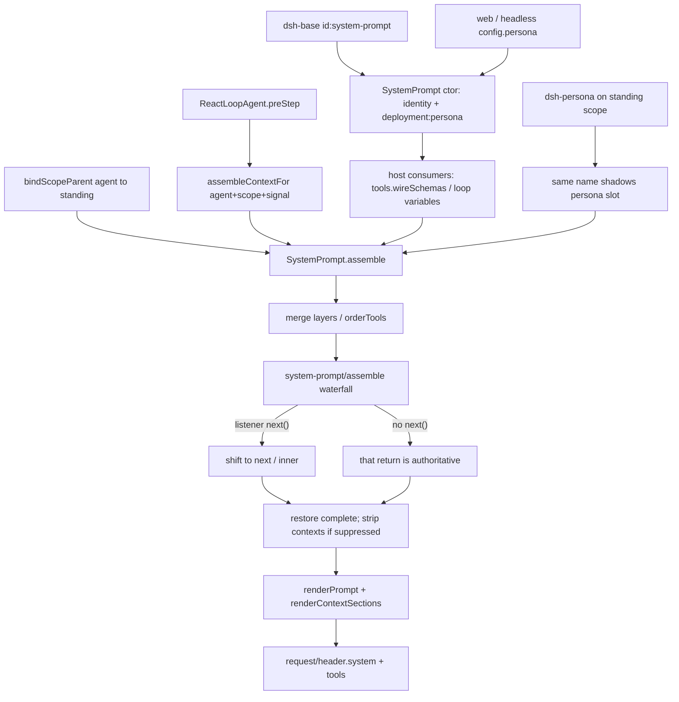

> `ctx.systemPrompt` 是 **host 面** 上的 system-prompt 装配注册表：插件按 scope 贡献 `section` / `context` / `tools` / `variable`；每个拟议 step 由 `assemble()` 合并层、跑 `system-prompt/assemble` waterfall（listener 必须 `next()` 才会 `shift`）、再 `renderPrompt` 得到请求里的 `system`。DSH 主线是 `profile → bundle → agent preset`；本包是一条 `Definition / Provider / Consumer` 缝，不是「又一个 coding agent」里写死的 system string。进入模型的 `system` / tools 会进 `request/header`（`model-visible ⟺ logged`）。

## 能回答的问题

- `ctx.systemPrompt` 的四类贡献（section / context / tools / variable）各在哪一层注册？谁调用 `assemble`？
- `system-prompt/assemble` waterfall 不调用 `next()` 会怎样？`complete: true` 为什么能挡住 listener？
- `PERSONA_SECTION` 为什么必须和 `dsh-persona` 同名？preset 怎样 shadow 部署 persona，又为什么不能再挂一份 registry？
- `toolOrder` 为什么必须恰好一次 `TOOL_ORDER_REST`？未配置时工具按什么顺序进请求？
- `{{name}}` 插值哪些情况抛错？`suppressRuntimeContext` 关的是哪一段、关在哪一层？
- host 面的 `dsh-base` / web / headless 行和 agent-preset 面的 `dsh-persona` 各写什么？`leakedServices` 跟 prompt 隔离是不是同一件事？

## 职责边界

本包拥有：进程级服务名 `systemPrompt`、四类贡献的 `ScopedLayers` 存储、`assemble()` 的合并 / `toolOrder` / waterfall / `complete` 恢复、`renderPrompt` / `renderContextSnapshot` 的严格插值。任意层登记或卸载都会 `emit('system-prompt/change')`（服务自己的 `this.ctx`，不是按 assemble scope 过滤的 waterfall）。 [E: packages/core/system-prompt/src/index.ts:354] [E: packages/core/system-prompt/src/index.ts:349]

本包**不**拥有：

- turn / step 驱动与 `request/header` 落盘 —— [`subsys.core.agent-loop`](./agent-loop.md) 的 `ReactLoopAgent` 是 `assemble` 的调用方，再把 `renderPrompt` 结果写进 header。
- session 历史与 `deriveMessages()` —— [`spine.session-log`](../../spine/session-log.md)。runtime-context 文本若变化，loop 造一条 plugin `user/message` 进 log，不是改 assembly 当对话。
- 工作区 `AGENTS.md` 一类指令 —— 走 `agent/pre-step` 的 user 角色 surface，不是 system section；见 [`spine.context-and-compaction`](../../spine/context-and-compaction.md)。
- 模型可见工具的字段 / 执行管线 —— [`subsys.core.tools`](./tools.md) 只通过 `systemPrompt.tools(wireSchemas)` 把**当前 scope 的 schema 列表**送进装配。
- persona 散文与 `complete` / `includeRuntimeContext` 组合旋钮 —— [`subsys.composition.persona`](../composition/persona.md) 的 `dsh-persona` 行。
- scope 原语本身（`ScopedLayers` / `scopeTarget` / `bindScopeParent`）—— [`subsys.core.scope`](./scope.md)。

默认产品路径是本地 Web GUI（`dsh web`），不是 TUI。本仓没有 shipped TUI 包。

## 关键文件

| 路径 | 角色 |
|---|---|
| `packages/core/system-prompt/src/index.ts` | `SystemPrompt` 服务、四类 API、`assemble` / `renderPrompt`、`PERSONA_*` / `TOOL_ORDER_REST` |
| `packages/core/system-prompt/src/invariant.ts` | companion：`prepend` 包住 waterfall 返回值做结构校验 |
| `packages/core/system-prompt/tests/system-prompt.spec.ts` | 内置段、waterfall、`complete` 恢复、严格插值、fiber 回滚 |
| `packages/core/system-prompt/tests/tool-order.spec.ts` | `TOOL_ORDER_REST` 字面量、load-time / assemble-time 失败、canonical 在 waterfall **之前** |
| `packages/core/system-prompt/tests/scoped.spec.ts` | scoped shadow、`suppressRuntimeContext`、scope 过滤的 assemble listener |
| `packages/preset/persona/src/index.ts` | preset 面同名 `deployment:persona`；`complete` / `includeRuntimeContext` |
| `packages/core/agent-loop/src/agent.ts` | `preStep` 调 `assemble`；`step` 调 `renderPrompt` |
| `packages/core/agent-loop/src/index.ts` | host 上登记 `provider` / `model` / `cwd` 三个 variable |
| `packages/core/agent/src/dispatch.ts` | `assembleContextFor`：`agent` 与 `scope` 必须一起设 |
| `packages/core/tools/src/index.ts` | host `tools()` provider = `wireSchemas(scope)` |
| `packages/preset/agent-presets/src/mount.ts` | `leakedServices`：preset 行不得把 service publish 进 root realm |
| `packages/bundle/base/cordis.patch.yml` | host 插入 `id: system-prompt`，部署 persona 默认空串 |
| `packages/bundle/web-app/cordis.patch.yml` / `headless/cordis.patch.yml` | overlay 部署 persona 模板（`{{model}}` / `{{cwd}}`） |
| `apps/cli/config/agent-presets/*/agent.cordis.yml` | shipped preset 的 `dsh-persona` 行（成员资格只认这些文件） |

## 数据模型

四类贡献都挂在调用方 `ctx` 的 scope 层上：`layers.effect` 用 `scopeOf(ctx)` 选层；无 scope 进 global。同层同名 `section` / `context` / `variable` 经 `NamedEntries.insert` 抛错；`tools()` 与 `suppressRuntimeContext()` 是 `AnonymousEntries`，可叠多条。 [E: packages/core/scope/src/store.ts:231] [E: packages/core/system-prompt/src/index.ts:387]

| 种类 | API | 层语义 |
|---|---|---|
| section | `section({ name, order, text, complete? })` | 同名 scoped **shadow** global；`order` 升序拼接；`complete: true` 在 waterfall **之后**变成唯一 section |
| context | `context({ name, order, text })` | 同名 shadow；渲染成 runtime snapshot，不是 system 正文 |
| tools | `tools(ctx => ({ schemas, knownNames? }))` | global + scope 链**都贡献**（不 shadow）；`knownNames` 供 `toolOrder` 校验「被 restriction 藏起的已知名」 |
| variable | `variable(name, provider)` | 同名 scoped shadow；名必须匹配 `^[a-z][a-z0-9_]*$` |

`AssembleContext` 本包只声明 `scope?` 与 `signal?`。`dsh-agent` 再 merge 出 `agent?`；loop 必须走 `assembleContextFor(agent, signal)`，把 `agent` 和 `scope: agent` 绑在一起，避免只带 agent 却丢掉 scope 层。 [E: packages/core/agent/src/runtime-types.ts:19] [E: packages/core/agent/src/dispatch.ts:175]

`PromptAssembly` 是装配产物：`sections` / `contexts` 此时**尚未**插值；`tools` 已按 `toolOrder` 或字典序排好；`variables` 是本轮求值结果（provider 可返回 `undefined`，渲染引用它才抛）。

| 常量 / Config | 值或默认 | 含义 |
|---|---|---|
| `PERSONA_SECTION` | `'deployment:persona'` | 部署 persona 槽名；preset 必须用这个名字才能 shadow，而不是并排多一段 [E: packages/core/system-prompt/src/index.ts:128] |
| `PERSONA_ORDER` | `0` | 该槽的 `order`；约定 `harness:identity` 用 `-100` [E: packages/core/system-prompt/src/index.ts:131] |
| `TOOL_ORDER_REST` | `'<unlisted-tools>'` | `toolOrder` 里未点名工具的插入点；工具自己不得叫这个名字 [E: packages/core/system-prompt/src/index.ts:140] |
| `includeHarnessIdentity` | default `true` | 构造时登记 identity 段 [E: packages/core/system-prompt/src/index.ts:340] |
| `includeRuntimeContext` | default `true` | `false` 则在 **global** 层 `suppressRuntimeContext()` [E: packages/core/system-prompt/src/index.ts:341] |
| `persona` | default `''` | 部署层该槽的模板；空串仍占名，渲染时当空 section 丢掉 [E: packages/core/system-prompt/src/index.ts:342] |
| `toolOrder` | 省略 = `undefined` | 省略走字典序；一旦给出必须恰好一次 rest 标记，重复名 load 失败 [E: packages/core/system-prompt/src/index.ts:344] |

事件：`system-prompt/assemble` 是 waterfall（返回值权威，再叠加 `complete` / suppress 的事后钉死）；`system-prompt/change` 是 unfiltered emit。

## 控制流

1. **host 面挂上 registry。** `dsh-base` 用一条根 insert 放下 `id: system-prompt` / `name: '@deepseek-ai/dsh-system-prompt'`，`config.persona` 是空串。这是进程级服务，不是 per-session preset。同一份 `cordis.patch.yml` **没有** `subagent-codex` / `subagent-claude-code` 行；`base.spec.ts` 钉死 patch 行数为 0，且 manifest 不依赖那两个包。不要读成「base 装了但 dormant」。 [E: packages/bundle/base/cordis.patch.yml:429] [E: packages/bundle/base/cordis.patch.yml:432] [E: packages/bundle/base/tests/base.spec.ts:38] [E: packages/bundle/base/tests/base.spec.ts:40]

2. **bundle overlay 只改部署 persona 模板。** `dsh-web-app` 与 `dsh-headless` 都按 id 覆盖该行 `config.persona` 为 `You are a coding agent powered by the {{model}} model. Your working directory is {{cwd}}.`。未写出的键走 `SystemPrompt.Config` 默认：identity 仍在、runtime-context 仍开、`toolOrder` 仍省略。shipped bundle **都不**写 `toolOrder`。 [E: packages/bundle/web-app/cordis.patch.yml:16] [E: packages/bundle/web-app/cordis.patch.yml:19] [E: packages/bundle/headless/cordis.patch.yml:7] [E: packages/bundle/headless/cordis.patch.yml:10]

3. **构造期占住两个内置 section。** `super(ctx, 'systemPrompt')` 之后：默认登记 `harness:identity`（`order: -100`，固定英文一句）；无条件登记 `PERSONA_SECTION`（`order: 0`，文本 = `config.persona ?? ''`）。global 层再登记同名会抛 `already registered`，文案提示改走 `agent.ctx`。`includeRuntimeContext === false` 在这时对 **global** 调用 `suppressRuntimeContext()`。 [E: packages/core/system-prompt/src/index.ts:357] [E: packages/core/system-prompt/src/index.ts:360] [E: packages/core/system-prompt/src/index.ts:361] [E: packages/core/system-prompt/src/index.ts:365] [E: packages/core/system-prompt/src/index.ts:317] [E: packages/core/system-prompt/src/index.ts:370]

4. **host Consumer 往同一份 registry 登记。** `AgentLoop` 构造时（`static inject` 含 `systemPrompt`）登记三个 variable：`provider` / `model` 读 `context.agent?.options`，`cwd` 读 `context.agent?.session.header.cwd`。`dsh-tools` 登记一条 `tools()`：`wireSchemas(context.scope)`。`mode === 'native'` 交出可见 schema + `knownNames`；`mode === 'code'` 只把 `run_code` 放进 `schemas`。各 `dsh-tool-*` 自己的 section 散文不在本页展开。 [E: packages/core/agent-loop/src/index.ts:297] [E: packages/core/agent-loop/src/index.ts:351] [E: packages/core/agent-loop/src/index.ts:353] [E: packages/core/tools/src/index.ts:832] [E: packages/core/tools/src/index.ts:983] [E: packages/core/tools/src/index.ts:996]

5. **agent-preset 面用同名 section shadow，而不是再 publish 一份 `systemPrompt`。** shipped `standard` 挂 `id: persona` / `name: '@deepseek-ai/dsh-persona'`，`text` 同样用 `{{model}}` / `{{cwd}}`。`apply` 在**当前 ctx 的 scope** 上 `section({ name: PERSONA_SECTION, order: PERSONA_ORDER, text })`；`complete: true` 才带 `complete`。`includeRuntimeContext: false` 调 `suppressRuntimeContext()`（scope 层）。挂在 unscoped 根上会和 registry 自己的 persona 撞名，fail-loud。 [E: apps/cli/config/agent-presets/standard/agent.cordis.yml:24] [E: packages/preset/persona/src/index.ts:61] [E: packages/preset/persona/src/index.ts:67] [E: packages/preset/persona/tests/persona.spec.ts:24]

6. **isolate / `leakedServices` 管的是 service publish，不是 section 层。** `dsh-persona` 只 `inject: ['systemPrompt']` 并往已有 registry 写 section，不 `provide` 新服务，因此 **不**需要 `isolate: { systemPrompt: true }`。把 registry isolate 进 preset realm 会让 host 上的 `loopCtx.systemPrompt.assemble` 看不见那份私有实例。[I] preset 里真正 publish 的行（例如 `minimal` 的 `terminals`）必须带 `isolate`，否则 `mountPreset` 在 subtree settle 后扫 `leakedServices`：实现落在 root isolate 符号上就抛 `published process-global service(s)`。Web 会话在 factory `setup` 里 `AgentPresets.mount`：`ensureStanding` 一份 standing scope，再 `bindScopeParent(agentKey, standing.key)`，于是 `chainLayers(agent)` 能看见 preset 上的 persona。headless 的 insert 只有 `code-runtime` / `headless-startup` / `headless-runner`，**没有** `agent-presets` 行；模型看见的是 host overlay 的部署 persona，不是 shipped `minimal`/`standard` 目录。 [E: packages/preset/agent-presets/src/mount.ts:189] [E: packages/preset/agent-presets/src/mount.ts:361] [E: packages/preset/agent-presets/src/mount.ts:364] [E: packages/preset/agent-presets/src/index.ts:286] [E: apps/cli/config/agent-presets/minimal/agent.cordis.yml:21] [E: packages/bundle/headless/cordis.patch.yml:22] [E: packages/bundle/headless/cordis.patch.yml:24] [E: packages/bundle/headless/cordis.patch.yml:27] [E: packages/bundle/headless/cordis.patch.yml:31]

7. **每个拟议 step 在 host 服务上 assemble。** `ReactLoopAgent` 用 factory 的 `loopCtx`（`this.runtime.ctx`，不是 isolate 出来的第二份 registry）调用 `this.loopCtx.systemPrompt.assemble(assembleContextFor(this, signal))`。`createScope(loopCtx, this)` 只决定 **登记** 落在哪个 overlay；装配入口始终是那一个 host `SystemPrompt`。 [E: packages/core/agent-loop/src/index.ts:472] [E: packages/core/agent-loop/src/index.ts:549] [E: packages/core/agent-loop/src/agent.ts:94] [E: packages/core/agent-loop/src/agent.ts:230]

8. **`assemble` 先物化层，再跑 waterfall。** `runtimeContextSuppressed` = global 或 scope 链上任一 suppressor 非空；为真则 `contexts` 直接 `[]`，不跑 `context` provider。variable：先 global，再 `chainLayers`（`scopeChainOf` 反转后远祖在前），近者覆盖。section / context 名表走 `layers.merge`（同样近者 `set` 赢），再按 `order` 升序。多个 `complete: true` 在求值前就抛 `multiple complete prompt sections are active`。唯一的 complete 会在 map 时拍一份 `completeSection` 快照。tool provider 列表是 global 加上 scope 链全部 `AnonymousEntries`；每条的 `parameters` `structuredClone` 进 assembly，避免下一轮被就地改脏。 [E: packages/core/system-prompt/src/index.ts:470] [E: packages/core/system-prompt/src/index.ts:471] [E: packages/core/system-prompt/src/index.ts:521] [E: packages/core/scope/src/store.ts:194] [E: packages/core/scope/src/store.ts:214] [E: packages/core/system-prompt/src/index.ts:506] [E: packages/core/system-prompt/src/index.ts:495]

9. **`orderTools` 在 waterfall 之前。** 未配置 `toolOrder`：按工具名 code-unit 字典序（与 locale 无关）。已配置：列出的名字按数组位置；`TOOL_ORDER_REST` 处插入「未点名但本轮 `schemas` 里有的」并再字典序；`toolOrder` 里出现 `knownNames` 没有的名字 assemble 失败；`knownNames` 有但本轮 `schemas` 没有（restriction）算正常缺席。provider 若交出名为 `TOOL_ORDER_REST` 的工具，assemble 失败。listener 在 waterfall 里 `push` 的工具**不会**再排序。缺 rest 或 rest/名字重复在 **load**（`validateToolOrder`）就抛，不会拖到第一轮 step。 [E: packages/core/system-prompt/src/index.ts:153] [E: packages/core/system-prompt/src/index.ts:169] [E: packages/core/system-prompt/src/index.ts:172] [E: packages/core/system-prompt/tests/tool-order.spec.ts:24] [E: packages/core/system-prompt/tests/tool-order.spec.ts:102]

10. **waterfall 必须 `next()`。** `assemble` 调 `this.ctx.waterfall(scopeTarget(this, scope), 'system-prompt/assemble', assembly, context, () => Promise.resolve(assembly))`。Cordis `Events.waterfall` 把最后一个参数当 innermost `next`：`next()` 里 `cbs.shift() ?? inner`。listener 不调用传入的 `next()`，后续 listener 和 inner 都不跑，**该层返回值**成为 waterfall 结果。`scopeTarget`：listener 无 `scopeOf` tag 则不过滤；有 tag 则必须等于 assemble 的 `key`，或落在从 `key` 沿 `scopeParents` 向上走的祖先上（后代 listener 收不到祖先装配）。`system-prompt-invariant` 以 `{ global: true, prepend: true }` 包住 `await next()`，校验的是 waterfall 返回值，不是事后恢复过的 `complete` 视图。 [E: packages/core/system-prompt/src/index.ts:532] [E: vendor/cordis/src/events.ts:238] [E: packages/core/scope/src/index.ts:176] [E: packages/core/scope/src/index.ts:177] [E: packages/core/system-prompt/src/invariant.ts:47] [E: packages/core/system-prompt/src/invariant.ts:51] [E: packages/core/system-prompt/tests/system-prompt.spec.ts:278]

11. **`complete` 与 suppress 在 waterfall 之后钉死。** 若没有 complete 且未 suppress，直接返回 `transformed`。否则展开：`sections` 换成事先拍下的那一个 `completeSection`（listener 改文案、追加段都无效）；`contexts` 在 suppressed 时再强制 `[]`（listener `push` 的 late context 也被剥掉）。`minimal` 的 `complete: true` + `includeRuntimeContext: false` 靠这两刀，让 identity / 工具说明 / snapshot 都进不了该会话的 system / runtime-context。 [E: packages/core/system-prompt/src/index.ts:536] [E: packages/core/system-prompt/src/index.ts:539] [E: packages/core/system-prompt/src/index.ts:540] [E: apps/cli/config/agent-presets/minimal/agent.cordis.yml:12] [E: apps/cli/config/agent-presets/minimal/agent.cordis.yml:13] [E: packages/core/system-prompt/tests/system-prompt.spec.ts:299]

12. **渲染与投影。** `ReactLoopAgent.step` 取 `renderPrompt(assembly)`：逐 section 严格插值 `{{name}}`，丢掉空串，段间 `\n\n`。未闭合的裸 `{{`（后面再也没有 `}}`）当字面量；替换值不再扫描。未登记名、`undefined` 值、不合 `VARIABLE_NAME` 的分组（含 `{{ model }}`）抛错；`Object.hasOwn` 拒绝把 `Object.prototype` 当变量。同一 `preStep` 用 `renderContextSections` + `joinContextSections`（前缀 `Current runtime context. This snapshot supersedes earlier runtime-context snapshots.`）交给 `RuntimeContextProjection.project`：文本变化才产出一条 `source.plugin === '@deepseek-ai/dsh-system-prompt'` 的 user 消息，随后经 `user/message` `surfaceOp: append` 进 log。 [E: packages/core/agent-loop/src/agent.ts:337] [E: packages/core/system-prompt/src/index.ts:212] [E: packages/core/system-prompt/src/index.ts:283] [E: packages/core/system-prompt/src/index.ts:239] [E: packages/core/agent-loop/src/runtime-context.ts:12] [E: packages/core/agent-loop/src/runtime-context.ts:72]

13. **`model-visible ⟺ logged`。** `buildRequest` 把 `system` 与 `assembly.tools` 写进 `canonicalHeader`，首次或与 baseline 不等就 `session.append('request/header', …)`。`agent/request` waterfall 只传 `seedConfig`；`messages` 在 waterfall **之后**才写入冻结请求。要让模型看见新身份或新工具集，必须先落在这次 assembly + header 上，而不是在 adapter 前偷偷改字符串。 [E: packages/core/agent-loop/src/agent.ts:438] [E: packages/core/agent-loop/src/agent.ts:440] [E: packages/core/agent-loop/src/agent.ts:458] [E: packages/core/agent-loop/src/agent.ts:461] [E: packages/core/agent-loop/src/agent.ts:466] [E: packages/core/agent-loop/src/agent.ts:469] [E: packages/core/agent-loop/src/agent.ts:488]

## 设计动机

- **组合缝，不是内置人格。** 换身份 = 换 preset 行或 shadow `deployment:persona`，不是 fork `ReactLoopAgent`。loop 可替换（`dsh-agent` 合同 + `dsh-agent-loop` 默认工厂），但装配入口仍是 host 上这一份 `ctx.systemPrompt`。
- **同名 shadow，而不是第二份 registry。** preset 再挂一份 `@deepseek-ai/dsh-system-prompt` 会与已有服务撞名或把第二份 `systemPrompt` publish 进 root。[I] `dsh-persona` 只 shadow 同名 section。两边都 import `PERSONA_SECTION` / `PERSONA_ORDER`，避免写错名字变成并排两段。 [E: packages/preset/persona/src/index.ts:23]
- **waterfall 返回值权威，但 `complete` 在其后恢复。** 专家层可以改 tools / 补 variable / 甚至整份替换 assembly；部署若声明「这一段就是全部 system」，listener 不能再拼回去。测试把 listener 改 `complete.text`、再 `push` late section，最终 sections 仍是登记时的原文。 [E: packages/core/system-prompt/tests/system-prompt.spec.ts:299]
- **严格插值。** 拼写错误、未赋值、原型链名在渲染期 fail-loud，避免把 `{{constructor}}` 或空值静默写进模型。
- **`toolOrder` 的 rest 标记。** 省略 = 每台机器相同的字典序。一旦手写顺序，必须声明未点名工具放哪；否则新装的工具会从请求里消失且没有报错点。

## Gotcha

- listener 不调用 `next()` 就是否决后半链。短路径测试直接返回空 `PromptAssembly`，内置 identity 也会消失——除非另有 `complete` 在事后把唯一段钉回去。 [E: packages/core/system-prompt/tests/system-prompt.spec.ts:279] [E: packages/core/system-prompt/tests/system-prompt.spec.ts:283]
- `suppressRuntimeContext` 是「求值前跳过 + waterfall 后剥掉」双门。global `includeRuntimeContext: false` 时 provider 调用次数为 0，listener `push` 的 context 也到不了返回值。 [E: packages/core/system-prompt/tests/system-prompt.spec.ts:67] [E: packages/core/system-prompt/tests/system-prompt.spec.ts:68]
- `dsh-persona` 挂在根 Context 上会抛 `deployment:persona is already registered`。它是 scope-only 行。 [E: packages/preset/persona/tests/persona.spec.ts:25]
- 空 `text` 的 persona 仍占用槽：该 scope 的部署散文被 shadow 成空，渲染丢掉这段，但不会掉回 host 模板。fiber dispose 才恢复。 [E: packages/preset/persona/tests/persona.spec.ts:59]
- `toolOrder: []` 或缺少 `'<unlisted-tools>'` 在 `ctx.plugin(SystemPrompt, …)` 失败，不是第一轮 `assemble` 才爆。 [E: packages/core/system-prompt/tests/tool-order.spec.ts:102]
- `system-prompt/change` 的 listener 若在登记时抛错，`ScopedLayers.effect` 回滚该条，装配看不到泄漏。 [E: packages/core/system-prompt/tests/system-prompt.spec.ts:186] [E: packages/core/system-prompt/tests/system-prompt.spec.ts:187]
- headless 不挂 roster，因此 **不会** 加载 `apps/cli/config/agent-presets/minimal/agent.cordis.yml` 的 `complete: true`。headless 的 persona 是 bundle overlay 那句 coding-agent 模板。 [E: packages/bundle/headless/cordis.patch.yml:22] [E: packages/bundle/headless/cordis.patch.yml:7]
- 不要把 Codex / Claude 子代理后端写成「base 里 dormant」。prompt registry 与那两个后端无关；base 测试要求它们的 patch 行数为 0。 [E: packages/bundle/base/tests/base.spec.ts:39]
- `assemble` 每次新建 `sections` / clone 的 `parameters`。改上一轮返回值不会污染下一轮；工具 provider 在求值中途再 `tools()` 只影响**下一**次 assemble（成员列表先快照）。 [E: packages/core/system-prompt/tests/system-prompt.spec.ts:226]

## Seam 三角

| Seam | Definition | Provider | Consumer |
|---|---|---|---|
| `ctx.systemPrompt` 服务 | `@deepseek-ai/dsh-system-prompt` 把 `Context.systemPrompt` 打成 `SystemPrompt`；服务名 `'systemPrompt'` | **host**：`dsh-base` 行 `id: system-prompt`；web / headless 只 overlay `config.persona` | `dsh-agent-loop`（`assemble` / 三个 variable）、`dsh-tools`（`tools()`）、`dsh-persona`（`inject: ['systemPrompt']`）、各插件的 `section`/`context` |
| `system-prompt/assemble` 事件 | 本包 `Events`：waterfall，返回值权威 | 任何 `ctx.on('system-prompt/assemble', …)`；invariant companion `prepend` + `global` | `SystemPrompt.assemble` 的 `ctx.waterfall(scopeTarget(this, scope), …)`；不 `next()` 则停在该层 |
| `deployment:persona` 槽 | 导出常量 `PERSONA_SECTION` / `PERSONA_ORDER` | 构造期 global 段（部署 `config.persona`）+ preset 面 `dsh-persona` 同名 scoped 段 | `renderPrompt`；`complete: true` 时事后唯一 section。成员资格认各 `agent.cordis.yml` 的 `id: persona` 行 |
| 装配期 tools 列表 | `ToolProviderResult`（`schemas` + 可选 `knownNames`） | host `dsh-tools.wireSchemas`；scoped 额外 `systemPrompt.tools(...)` | `orderTools` → `assembly.tools` → `ReactLoopAgent.buildRequest` / `request/header.tools` |
| runtime-context snapshot | `PromptContext` + `suppressRuntimeContext` | 各插件 `context()`；persona / 部署 Config 可在对应层 suppress | `renderContextSections` → `RuntimeContextProjection.project` → 可能追加的 `user/message`（不是 system） |

## Sources

- packages/core/system-prompt/src/index.ts
- packages/core/system-prompt/src/invariant.ts
- packages/core/system-prompt/tests/system-prompt.spec.ts
- packages/core/system-prompt/tests/tool-order.spec.ts
- packages/core/system-prompt/tests/scoped.spec.ts
- packages/preset/persona/src/index.ts
- packages/preset/persona/tests/persona.spec.ts
- packages/core/agent-loop/src/agent.ts
- packages/core/agent-loop/src/index.ts
- packages/core/agent-loop/src/runtime-context.ts
- packages/core/agent/src/dispatch.ts
- packages/core/agent/src/runtime-types.ts
- packages/core/tools/src/index.ts
- packages/core/scope/src/index.ts
- packages/core/scope/src/store.ts
- packages/preset/agent-presets/src/index.ts
- packages/preset/agent-presets/src/mount.ts
- packages/bundle/base/cordis.patch.yml
- packages/bundle/base/tests/base.spec.ts
- packages/bundle/web-app/cordis.patch.yml
- packages/bundle/headless/cordis.patch.yml
- apps/cli/config/agent-presets/minimal/agent.cordis.yml
- apps/cli/config/agent-presets/standard/agent.cordis.yml
- vendor/cordis/src/events.ts

## 相关

- [`spine.overview`](../../spine/overview.md) — Cordis 组合运行时总览：`profile → bundle → preset`、host 面 vs agent-preset 面。
- [`spine.turn-and-step`](../../spine/turn-and-step.md) — `preStep` 里 `assemble` 与 `agent/pre-step` 的时序。
- [`spine.context-and-compaction`](../../spine/context-and-compaction.md) — 装配产物如何变成 header / snapshot / compaction，而不是再写一遍 registry。
- [`subsys.composition.persona`](../composition/persona.md) — `dsh-persona` 行、`complete` / `includeRuntimeContext`、为什么不能挂在全局。
- [`subsys.core.agent-loop`](./agent-loop.md) — 默认 loop：`assemble` 调用方、variable 登记、`request/header`。
- [`subsys.core.scope`](./scope.md) — `ScopedLayers` / `scopeTarget` / `bindScopeParent`。
- [`subsys.composition.agent-presets`](../composition/agent-presets.md) — standing mount、`leakedServices`、会话如何 join preset。
- [`surface.presets.overview`](../../surface/presets/overview.md) — shipped preset 发现与成员资格。
