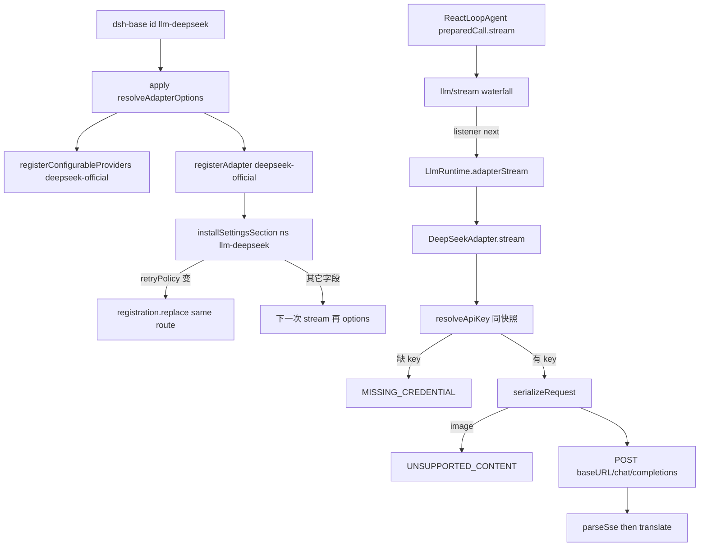

> `@deepseek-ai/dsh-llm-deepseek` 是 **host 面** 的 DeepSeek chat-completions Provider：`apply` 始终 `registerAdapter(['deepseek-official'], adapter)`。这是 shipped 默认对话路由，不是 pi-ai catalog 里的 `deepseek`，也不是 `ctx.llm` 本身。

DSH 是 Cordis 组合运行时（`profile → bundle → agent preset`），不是「又一个 coding agent」。capability seam 是 Definition / Provider / Consumer。本包坐在 **host 面**（和 `ctx.llm` / `ctx.settings` / `ctx.credentials` 同一层），不进 agent-preset 的 tools / persona / isolate 树。调用方用 `GenerateOptions.provider` 选路由；仓库里没有 `ctx.llm.route`。进入模型请求的 `provider` / `model` 必须能从 session log 的 `request/header` 重建（`model-visible ⟺ logged`）。默认产品路径是本地 Web GUI（`dsh web`），本仓没有 shipped TUI 包。

## 能回答的问题

- `deepseek-official` 是谁在什么时候 `registerAdapter` 的？缺 `DEEPSEEK_API_KEY` 会不会让插件 load 失败？
- settings 命名空间 `llm-deepseek` 改 base URL / catalog / key 要不要重注册？什么变化才会 `replace`？
- 未列入 catalog 的 model id 能不能发请求？图片块为什么在 serialize 就被拒？
- 这条路由和 pi-ai catalog 名 `deepseek` 差在哪？两家抢 `deepseek-official` 会怎样？
- `agent-default-model` 的默认 `provider` 怎么对上这条 adapter？`searchProvider: deepseek-official` 是不是本包？
- `llm/stream` waterfall 谁必须 `next()`？本行有没有 isolate？

## 职责边界

本包 `@deepseek-ai/dsh-llm-deepseek` 拥有： [E: packages/llm/llm-deepseek/package.json:2]

- Cordis plugin 名 `llm-deepseek`，`inject = ['llm']`。 [E: packages/llm/llm-deepseek/src/index.ts:41] [E: packages/llm/llm-deepseek/src/index.ts:42]
- 唯一 provider 字符串 `deepseek-official`。`apply` 把它写进 `LlmRuntime` 私有 `adapters` map；没有 `ctx.llm.route`。 [E: packages/llm/llm-deepseek/src/index.ts:47] [E: packages/llm/llm-deepseek/src/index.ts:256] [E: packages/llm/llm/src/index.ts:285]
- `DeepSeekAdapter`：`fetch` + SSE 的 chat-completions 实现。 [E: packages/llm/llm-deepseek/src/adapter.ts:158]
- 连接事实解析 `resolveAdapterOptions`（endpoint / catalog / thinking 默认 / 已 resolve 的 `retryPolicy`）。配置只带 credential **引用** `apiKeyEnv`，不带字面 key。 [E: packages/llm/llm-deepseek/src/index.ts:184] [E: packages/llm/llm-deepseek/src/adapter.ts:58]
- settings 命名空间 `llm-deepseek`：整段 = 一个 profile（directory 的 `settingsPath: []`）。 [E: packages/llm/llm-deepseek/src/index.ts:44] [E: packages/llm/llm-deepseek/src/index.ts:252]
- 文本-only 序列化与 SSE 翻译（`serializeRequest` / `parseSse` / `translate`）。

本包 **不** 拥有：

- `ctx.llm` 服务、`registerAdapter` 合同、`llm/stream` waterfall、`prepareCall` — [subsys.llm.service](./service.md)。
- retry **执行**（`agent/request-error`）— [subsys.llm.retry](./retry.md)。本包只通过 `providerRetryPolicy` 交出策略值。 [E: packages/llm/llm-deepseek/src/adapter.ts:167]
- 默认「下一个新 Agent」的 `provider` / `model` 选择 — [subsys.core.agent-default-model](../core/agent-default-model.md)。`dsh-base` 把那一行的 `provider` 写成 `deepseek-official`，所以默认对话走本路由。 [E: packages/bundle/base/cordis.patch.yml:66]
- pi-ai 多协议 adapter、catalog 名 `deepseek`、dormant 零 route — [subsys.llm.pi-ai](./pi-ai.md)。
- Web 搜索。`searchProvider: deepseek-official` 是 `@deepseek-ai/dsh-web` + `@deepseek-ai/dsh-web-search-deepseek`，另一条 seam、另一套 endpoint。 [E: packages/bundle/base/cordis.patch.yml:407] [E: packages/bundle/base/cordis.patch.yml:409] [E: packages/web/web-search-deepseek/src/provider.ts:27]
- session `request/header`、`deriveMessages()`、turn/step — [spine.turn-and-step](../../spine/turn-and-step.md)。
- Models 页字段表与用户可见文案 — [surface.providers.deepseek](../../surface/providers/deepseek.md)（T1，planned）。

preset **不**挂本包。四个 shipped `agent.cordis.yml` 末条分别是 `str-replace-editor` / `tool-web` / `tool-presentation` / `tool-skill`，没有 `id: llm-deepseek`。`dsh-base` 无条件 insert `id: llm-deepseek`，manifest 依赖 `@deepseek-ai/dsh-llm-deepseek`。 [E: apps/cli/config/agent-presets/minimal/agent.cordis.yml:59] [E: apps/cli/config/agent-presets/standard/agent.cordis.yml:247] [E: apps/cli/config/agent-presets/code/agent.cordis.yml:259] [E: apps/cli/config/agent-presets/cordis/agent.cordis.yml:261] [E: packages/bundle/base/cordis.patch.yml:450] [E: packages/bundle/base/package.json:64]

## 关键文件

| 路径 | 角色 |
|---|---|
| `packages/llm/llm-deepseek/src/index.ts` | `apply`：解析 options、始终注册 `deepseek-official`、叠 `llm-deepseek` settings |
| `packages/llm/llm-deepseek/src/adapter.ts` | `DeepSeekAdapter`：每请求冻连接事实 + key，`fetch` `/chat/completions` |
| `packages/llm/llm-deepseek/src/serialize.ts` | harness `Message` → wire；拒绝 image；thinking / effort 解析 |
| `packages/llm/llm-deepseek/src/sse.ts` | SSE 分帧；必须看到字面 `[DONE]` |
| `packages/llm/llm-deepseek/src/translate.ts` | wire chunk → `StreamChunk`；`finish` / `usage` 推迟到 `[DONE]` |
| `packages/llm/llm-deepseek/tests/adapter.spec.ts` | 注册、无 key 仍 load、catalog 直通、HTTP 码、idle watchdog |
| `packages/llm/llm-deepseek/tests/dynamic-config.spec.ts` | settings 热更新；只有 `retryPolicy` 触发 `replace` |
| `packages/bundle/base/cordis.patch.yml` | host 行 `id: llm-deepseek`（无内联 key / endpoint）与默认 `agent-default-model` |
| `packages/bundle/web-app/cordis.patch.yml` | 末条 `id: agent-presets`，不重挂本包 |
| `packages/bundle/headless/cordis.patch.yml` | 末条 `id: headless-runner`，不重挂本包 |
| `apps/cli/config/agent-presets/{minimal,standard,code,cordis}/agent.cordis.yml` | shipped preset 成员；无 `id: llm-deepseek` |
| `packages/settings/settings-file/src/index.ts` | 用户文档默认 `$DSH_HOME/settings.yaml` |
| `packages/core/agent-default-model/src/index.ts` | 默认对话选择的 owner；composition `provider` 指向本路由 |

## 数据模型

四个名字不要混：yml `id: llm-deepseek`、包 `@deepseek-ai/dsh-llm-deepseek`、settings ns `llm-deepseek`、route 键 `deepseek-official`。

| 符号 | 关键字段 | 含义 |
|---|---|---|
| `PROVIDER` | `'deepseek-official'` | 本插件唯一 adapter route |
| `Config` | `apiKeyEnv?`、`baseURL?`、`thinking?`、`reasoningEffort?`、`maxTokens?`、`models?`、`retryPolicy?`、`streamIdleTimeoutMs?` | 组合行与 settings 整段同一 shape；**没有**字面 `apiKey` |
| `DeepSeekConnectionOptions` | `baseURL`、`apiKeyEnv`、`defaults`、`models`、`retryPolicy`、… | 一次 `resolveAdapterOptions` 的快照；endpoint 与 key 引用同行 |
| `DeepSeekCatalogModel` | `id`、`name?`、`contextWindow?`、`maxTokens?` | 给 selector 的 **advisory** 列表；未列出的 id 仍可请求 |
| directory 条目 | `settingsNs: 'llm-deepseek'`、`settingsPath: []` | 整段 settings = 一个 profile（pi-ai 是 `providers.<id>`） |

默认 catalog 是 `deepseek-v4-flash` / `deepseek-v4-pro`。 [E: packages/llm/llm-deepseek/src/index.ts:50] [E: packages/llm/llm-deepseek/src/index.ts:51] 缺 `baseURL` 时：组合值 → 启动环境里的 `DEEPSEEK_BASE_URL` → `https://api.deepseek.com`。 [E: packages/llm/llm-deepseek/src/index.ts:104] [E: packages/llm/llm-deepseek/src/index.ts:185] [E: packages/llm/llm-deepseek/src/index.ts:186] `apiKeyEnv` 默认 `DEEPSEEK_API_KEY`。 [E: packages/llm/llm-deepseek/src/index.ts:45]

adapter 常量：`DEFAULT_CONTEXT_WINDOW = 1_000_000`、`DEFAULT_MAX_TOKENS = 256_000`、idle `300_000` ms。 [E: packages/llm/llm-deepseek/src/adapter.ts:91] [E: packages/llm/llm-deepseek/src/adapter.ts:93] [E: packages/llm/llm-deepseek/src/adapter.ts:89] thinking 开着时 advertised efforts 是 `off` / `high` / `max`，缺配置时 `defaultEffort` 落到 `high`。 [E: packages/llm/llm-deepseek/src/adapter.ts:98] [E: packages/llm/llm-deepseek/src/adapter.ts:208]

## 控制流

1. `dsh-base` 在 host 根 insert `id: llm-deepseek`，`name: '@deepseek-ai/dsh-llm-deepseek'`，**没有** `config:` 块，也没有 `isolate:`。同一次 insert 里 `id: agent-default-model` 写 `provider: deepseek-official`、`model: deepseek-v4-flash`。`dsh-web-app` 末条是 `id: agent-presets`，`dsh-headless` 末条是 `id: headless-runner`，四个 shipped preset 末条是 tool 行，都**不**再挂本包。 [E: packages/bundle/base/cordis.patch.yml:63] [E: packages/bundle/base/cordis.patch.yml:66] [E: packages/bundle/base/cordis.patch.yml:450] [E: packages/bundle/base/cordis.patch.yml:451] [E: packages/bundle/web-app/cordis.patch.yml:422] [E: packages/bundle/headless/cordis.patch.yml:31] [E: apps/cli/config/agent-presets/standard/agent.cordis.yml:247]

2. Loader 调 `apply@packages/llm/llm-deepseek/src/index.ts`。构造时立刻 `options()` 一次：`resolveAdapterOptions` 校验 catalog / thinking / bounds，失败则 **load 抛错、不注册**。这一步只解析连接事实，不读 API key。 [E: packages/llm/llm-deepseek/src/index.ts:200] [E: packages/llm/llm-deepseek/src/index.ts:223] [E: packages/llm/llm-deepseek/src/index.ts:161]

3. `apply` 建一个 `DeepSeekAdapter`，先 `registerConfigurableProviders([{ provider: 'deepseek-official', displayName: 'DeepSeek', settingsNs: 'llm-deepseek', settingsPath: [] }])`，再 **无条件** `ctx.llm.registerAdapter([PROVIDER], adapter)`。`PROVIDER` 写死为 `'deepseek-official'`，没有「零 route」分支。这和 `llm-pi-ai` 相反：后者 `routes.length === 0` 时直接 `return`，不 `registerAdapter`。 [E: packages/llm/llm-deepseek/src/index.ts:251] [E: packages/llm/llm-deepseek/src/index.ts:256] [E: packages/llm/llm-pi-ai/src/index.ts:266]

4. `installSettingsSection@packages/settings/settings/src/index.ts` 用 `ctx.inject(['settings'], …)` 包住整段 wiring：没挂 `ctx.settings` 时这段 `inject` 不跑，`current` 一直指向组合 entry。挂上时 composition `config` 当 `base`，`setSource` 换成 live `scope.get()`；`onChange` 只调本包的 `ensureRegistrationFacts`。用户文档在 `$DSH_HOME/settings.yaml`（`settings-file` 的 `resolveSpec`），整段 `llm-deepseek:` 经 `mergeLayers` 叠到 `base` 上。 [E: packages/settings/settings/src/index.ts:870] [E: packages/settings/settings/src/index.ts:872] [E: packages/settings/settings/src/index.ts:875] [E: packages/settings/settings/src/index.ts:297] [E: packages/settings/settings-file/src/index.ts:56] [E: packages/llm/llm-deepseek/src/index.ts:270] [E: packages/llm/llm-deepseek/src/index.ts:274]

5. `ensureRegistrationFacts@packages/llm/llm-deepseek/src/index.ts` 用 `deepEqualJson` 比新旧 `retryPolicy`。只有策略变了才 `registration.replace(['deepseek-official'])`——同一 adapter 实例、一次同步 `commitRoutes`，观察者看不到空窗口。base URL / models / thinking **不**重注册：下一次 `options()` 会读到新快照。 [E: packages/llm/llm-deepseek/src/index.ts:260] [E: packages/llm/llm-deepseek/src/index.ts:266] [E: packages/llm/llm-deepseek/tests/dynamic-config.spec.ts:140] [E: packages/llm/llm-deepseek/tests/dynamic-config.spec.ts:148] [E: packages/llm/llm-deepseek/tests/dynamic-config.spec.ts:149]

6. 默认对话路由从这里接上。`AgentDefaultModelConfig.currentSelection()` 在 composition 下是 `{ provider: 'deepseek-official', model: 'deepseek-v4-flash' }`。`ReactLoopAgent.step` 走 `preparedCall?.stream(request) ?? this.loopCtx.llm.stream(request)`；`GenerateOptions.provider` 必须是 `'deepseek-official'` 才命中本 adapter。 [E: packages/core/agent-default-model/tests/agent-default-model.spec.ts:47] [E: packages/core/agent-loop/src/agent.ts:345] [E: packages/llm/llm-deepseek/tests/assemble.ts:20]

7. **waterfall 必须 `next()`。** `LlmRuntime.streamWithRegistration` 把 innermost 设成 `adapterStream`。`Events.waterfall@vendor/cordis/src/events.ts` 把最后一个参数当 innermost `next`：listener 不调用传入的 `next()` 就不会 `cbs.shift()`，内层和 `adapterStream` 全部停住，`DeepSeekAdapter.stream` 一次都不会跑。本包 **不** 自己挂 `llm/stream`。 [E: packages/llm/llm/src/index.ts:921] [E: packages/llm/llm/src/index.ts:925] [E: vendor/cordis/src/events.ts:237] [E: vendor/cordis/src/events.ts:238]

8. `adapterStream@packages/llm/llm/src/index.ts` 用 `options.provider` 查私有 `adapters` map（缺键 → `NO_ADAPTER`）。未 `prepareCall` 的裸 `stream` 会先 `resolveCallFor`：把 `DeepSeekAdapter.resolveModel` 的 `defaultMaxTokens` / 默认 `reasoningEffort` 填进本次请求。loop 路径则用 `prepareCall` 冻住的那份。 [E: packages/llm/llm/src/index.ts:849] [E: packages/llm/llm/src/index.ts:851] [E: packages/llm/llm/src/index.ts:818]

9. `DeepSeekAdapter.stream@packages/llm/llm-deepseek/src/adapter.ts` **每个 stream 调用解析一次**：`options()` 出连接快照，再 `resolveApiKey(connection)` 解同一代的 bearer。进行中的流不再读 settings。有 `ctx.credentials` 就 `credentials.resolve(apiKeyEnv)`；否则读启动环境里同名变量。两边都空 → `LlmError` `MISSING_CREDENTIAL`，**不是** load 失败。 [E: packages/llm/llm-deepseek/src/adapter.ts:220] [E: packages/llm/llm-deepseek/src/adapter.ts:221] [E: packages/llm/llm-deepseek/src/index.ts:244] [E: packages/llm/llm-deepseek/tests/adapter.spec.ts:917] [E: packages/llm/llm-deepseek/tests/adapter.spec.ts:923]

10. `request` 调 `serializeRequest(options, connection.defaults)`，再 `fetch(`${baseURL}/chat/completions`)`。`session-title` 强制 `thinking: 'disabled'`。assistant 历史的 `content` 永远是字符串（纯 tool-call 发 `""`，从不 `null`）。`reasoning_content` 只在 **带 tool-call** 的 assistant 回合回放。 [E: packages/llm/llm-deepseek/src/adapter.ts:279] [E: packages/llm/llm-deepseek/src/adapter.ts:301] [E: packages/llm/llm-deepseek/src/serialize.ts:38] [E: packages/llm/llm-deepseek/src/serialize.ts:95] [E: packages/llm/llm-deepseek/src/serialize.ts:99]

11. `assertTextOnly` 在任何 flatten 之前走 `contentHasImage`：core image block → `UNSUPPORTED_CONTENT`。未知 declaration-merged 块类型被 `flattenText` 丢掉（只拼 `type === 'text'`）。catalog 未列出的 model id 仍按文本模型 resolve，`inputModalities: ['text']`，请求照发。 [E: packages/llm/llm-deepseek/src/serialize.ts:58] [E: packages/llm/llm-deepseek/src/serialize.ts:65] [E: packages/llm/llm-deepseek/src/serialize.ts:66] [E: packages/llm/llm-deepseek/tests/serialize.spec.ts:139] [E: packages/llm/llm-deepseek/tests/serialize.spec.ts:146] [E: packages/llm/llm-deepseek/src/adapter.ts:190] [E: packages/llm/llm-deepseek/tests/adapter.spec.ts:787]

12. 2xx 且有 body 时 `yield* translate(parseSse(response.body, onComment))`。`parseSse` 在流结束却没有字面 `[DONE]` 时抛 `STREAM_CLOSED`。`translate` 把 `finish` / `usage` / `block-end` 攒到 `[DONE]`；`stop` 且一个 block 都没开 → `EMPTY_RESPONSE`。 [E: packages/llm/llm-deepseek/src/adapter.ts:344] [E: packages/llm/llm-deepseek/src/sse.ts:39] [E: packages/llm/llm-deepseek/src/translate.ts:110] [E: packages/llm/llm-deepseek/src/translate.ts:113]

13. **isolate。** 本行是 host 服务，yml 不写 `isolate`。`ctx.llm` 是进程级单例；本 adapter 的 registration 绑在 `apply` fiber 上，fiber `dispose` 卸掉 route（HMR 安全）。不要把 `@deepseek-ai/dsh-llm-deepseek` 再挂进 preset：会跟 host 抢同一 `deepseek-official` 键，`registerAdapter` 抛 `DUPLICATE_ADAPTER`。 [E: packages/llm/llm-deepseek/tests/adapter.spec.ts:632] [E: packages/llm/llm/src/index.ts:380]

## 设计动机

- **默认对话必须始终有一条活 route。** first-boot 可以没有 key，但 Models 页和 `listModels('deepseek-official')` 必须看得见 catalog。所以 load 只校验连接事实，把 `MISSING_CREDENTIAL` 留到请求。 [E: packages/llm/llm-deepseek/tests/adapter.spec.ts:920] [E: packages/llm/llm-deepseek/tests/adapter.spec.ts:921]
- **和 pi-ai catalog 名刻意不同。** pi-ai 的 `catalogProviderIds()` 就是安装目录 `getBuiltinProviders()`；其中 `deepseek` 在 directory 里 `declared: false`。settings 写出 `providers.deepseek` 才变成 adapter route。本包占用 `deepseek-official`，两家能并排挂。若有人给 pi-ai 写 `providers.deepseek-official`，directory `replace` 被拒，旧条目继续服务。 [I] [E: packages/llm/llm-pi-ai/src/catalog.ts:141] [E: packages/llm/llm-pi-ai/tests/catalog.spec.ts:153] [E: packages/llm/llm-pi-ai/tests/dynamic-config.spec.ts:80] [E: packages/llm/llm-pi-ai/tests/catalog.spec.ts:910]
- **retryPolicy 是唯一注册期捕获的事实。** `LlmRuntime.prepareRoutes` 在 `registerAdapter` / `replace` 时读 `providerRetryPolicy`。其它连接事实走 thunk，改完立刻作用于下一请求，不必让观察者看见 route 消失。 [E: packages/llm/llm/src/index.ts:387]
- **连接事实与 key 同一代。** `resolveApiKey` 吃的是这次 `options()` 返回的 snapshot，不能拿新 key 打旧 gateway。schema 通过但 resolver 失败的 settings（例如重复 catalog id）整代丢弃，继续用 last-good。 [E: packages/llm/llm-deepseek/src/index.ts:220] [E: packages/llm/llm-deepseek/tests/dynamic-config.spec.ts:183]
- **文本路由先拒图。** 未列入 catalog 的模型如果把 modality 标成 unknown，host 会收下并持久化 image，serialize 再炸。`resolveModel` 对 pass-through 也写死 `inputModalities: ['text']`。 [E: packages/llm/llm-deepseek/src/adapter.ts:190]

## Gotcha

- **没有 `ctx.llm.route`。** route = `adapters` map 的 provider 字符串。调用方写 `GenerateOptions.provider: 'deepseek-official'`。
- **`deepseek` ≠ `deepseek-official`。** 前者是 pi-ai catalog / 可选 settings profile 键；后者是本包写死的默认对话路由。混用会打到另一家，或 `NO_ADAPTER`。
- **无 key 也能 load。** 测试钉死 `listProviders` / `listModels` 在空 `DEEPSEEK_API_KEY` 下成功，第一次 `stream` 才 `MISSING_CREDENTIAL`。guidance 同时点名 credentials 服务和 `export DEEPSEEK_API_KEY`。 [E: packages/llm/llm-deepseek/tests/adapter.spec.ts:920] [E: packages/llm/llm-deepseek/tests/adapter.spec.ts:921] [E: packages/llm/llm-deepseek/tests/adapter.spec.ts:931]
- **只有 `retryPolicy` 变化会 `replace`。** 改 `baseURL` / `models` / thinking 不会发空拓扑；测试观察 `llm/adapters-updated` 在策略更新时仍是 `[['deepseek-official']]`。 [E: packages/llm/llm-deepseek/tests/dynamic-config.spec.ts:148] [E: packages/llm/llm-deepseek/tests/dynamic-config.spec.ts:149]
- **坏 settings 保 last-good 整包。** 一次 snapshot 同时改 URL 又复制 catalog id：请求仍打旧 endpoint、用旧 key，被拒的那一代什么都不贡献。 [E: packages/llm/llm-deepseek/tests/dynamic-config.spec.ts:183]
- **`thinking: disabled` 时 `high` / `max` 在 I/O 前失败。** resolver 禁止这样的组合 config；请求级 `reasoningEffort` 则 `UNSUPPORTED_REASONING_EFFORT`，mock server 0 次命中。 [E: packages/llm/llm-deepseek/src/index.ts:165] [E: packages/llm/llm-deepseek/tests/adapter.spec.ts:241] [E: packages/llm/llm-deepseek/tests/adapter.spec.ts:243]
- **serialize 拒绝图片，跳过未知块。** 不要指望 flatten 会默默丢掉 image。
- **keyless 请求不写 `.anonymous-user-id`。** user id 只在真正拿到 key、准备打 HTTP 时才 `getOrCreateAnonymousUserId`。 [E: packages/llm/llm-deepseek/tests/dynamic-config.spec.ts:90]
- **搜索同名不同包。** `dsh-web-search-deepseek` 的 `DEEPSEEK_PROVIDER_ID` 也是 `'deepseek-official'`，默认 endpoint 是 `https://api.deepseek.com/anthropic/v1`，不是本 adapter 的 `PUBLIC_BASE_URL`。换掉本 adapter 不会换搜索实现。 [E: packages/web/web-search-deepseek/src/provider.ts:27] [E: packages/web/web-search-deepseek/src/provider.ts:35]
- **pi-ai 抢 `deepseek-official` 会被拒。** 测试先以 `settingsNs: 'llm-deepseek'` 占住该 directory 键，再写 `providers.deepseek-official`：`settingsNs` 仍是 `llm-deepseek`，旧条目继续服务。 [E: packages/llm/llm-pi-ai/tests/catalog.spec.ts:892] [E: packages/llm/llm-pi-ai/tests/catalog.spec.ts:910]
- **idle watchdog ≠ 调用方 abort。** 超时码 `TIMEOUT`；`options.signal` abort 码 `ABORTED`；裸 `fetch` 失败码 `TRANSPORT`。 [E: packages/llm/llm-deepseek/src/adapter.ts:250] [E: packages/llm/llm-deepseek/src/adapter.ts:255] [E: packages/llm/llm-deepseek/src/adapter.ts:316]
- **wire helpers 不在包根。** `serializeRequest` / `parseSse` / `translate` / `httpErrorCode` 都不是 `@deepseek-ai/dsh-llm-deepseek` 的导出。 [E: packages/llm/llm-deepseek/tests/adapter.spec.ts:614]

## Seam 三角

| 角色 | 包 / 符号 | ctx 键 | bundle / preset 行 |
|---|---|---|---|
| Definition | `@deepseek-ai/dsh-llm` 的 `LlmRuntime` / `LlmAdapter` / `registerAdapter` | `llm` | **host** `dsh-base`：`id: llm`。preset **不**挂 |
| Provider | 本包 `apply` + `DeepSeekAdapter`；route 键 `deepseek-official` | 无独立 ctx 键（写进 `ctx.llm` 的 `adapters`） | **host** `dsh-base`：`id: llm-deepseek`（无 `config`、无 `isolate`）。**无** preset 行 |
| Consumer | `ReactLoopAgent`（`preparedCall.stream` / `ctx.llm.stream`）；`agent-default-model` 默认 `provider`；Web Models 页读 directory | `llm`；`agentDefaultModel` | host `id: agent-loop`、`id: agent-default-model`（`provider: deepseek-official`）。搜索 **不是** 本 adapter 的 Consumer |

换掉 Provider（patch 掉 `id: llm-deepseek`，或另写一个插件占同一 `deepseek-official` 键）会带走默认对话 HTTP。不会带走 `ctx.llm` 缝，也不会带走 `searchProvider: deepseek-official` 的搜索包。换掉 `id: settings` 只失去 live overlay，composition 行仍能解析环境里的 `DEEPSEEK_API_KEY` / `DEEPSEEK_BASE_URL`。

## Sources

- packages/llm/llm-deepseek/src/adapter.ts
- packages/llm/llm-deepseek/src/serialize.ts
- packages/llm/llm-deepseek/src/index.ts
- packages/llm/llm-deepseek/src/sse.ts
- packages/llm/llm-deepseek/src/translate.ts
- packages/llm/llm-deepseek/tests/adapter.spec.ts
- packages/llm/llm-deepseek/tests/dynamic-config.spec.ts
- packages/llm/llm-deepseek/tests/serialize.spec.ts
- packages/llm/llm-deepseek/tests/assemble.ts
- packages/llm/llm-deepseek/package.json
- packages/bundle/base/cordis.patch.yml
- packages/bundle/base/package.json
- packages/core/agent-default-model/src/index.ts
- packages/core/agent-default-model/tests/agent-default-model.spec.ts
- packages/core/agent-loop/src/agent.ts
- packages/llm/llm/src/index.ts
- packages/llm/llm-pi-ai/src/catalog.ts
- packages/llm/llm-pi-ai/src/index.ts
- packages/llm/llm-pi-ai/tests/dynamic-config.spec.ts
- packages/llm/llm-pi-ai/tests/catalog.spec.ts
- packages/settings/settings/src/index.ts
- packages/settings/settings-file/src/index.ts
- packages/bundle/web-app/cordis.patch.yml
- packages/bundle/headless/cordis.patch.yml
- apps/cli/config/agent-presets/minimal/agent.cordis.yml
- apps/cli/config/agent-presets/standard/agent.cordis.yml
- apps/cli/config/agent-presets/code/agent.cordis.yml
- apps/cli/config/agent-presets/cordis/agent.cordis.yml
- packages/web/web-search-deepseek/src/provider.ts
- vendor/cordis/src/events.ts

## 相关

- [spine.overview](../../spine/overview.md) — Cordis 组合运行时、host 面 vs agent-preset 面、默认 `ctx.llm` 走 `deepseek-official`
- [subsys.llm.service](./service.md) — `ctx.llm` Definition：`registerAdapter`、私有 `adapters` map、`llm/stream` waterfall、`prepareCall`
- [subsys.llm.pi-ai](./pi-ai.md) — 始终加载、零 adapter route 直到 Settings 写 profile；catalog 名 `deepseek`
- [subsys.core.agent-default-model](../core/agent-default-model.md) — 未来新 Agent 的默认 `ModelSelection`；composition `provider: deepseek-official`
- [surface.providers.deepseek](../../surface/providers/deepseek.md) — T1 官方路由可见面（planned）
- [spine.turn-and-step](../../spine/turn-and-step.md) — loop 如何 `prepareCall` / `stream` 并把 chunk 记进 session
- [subsys.llm.retry](./retry.md) — `agent/request-error` 上执行本包交出的 `retryPolicy`
- [subsys.composition.bundle-base](../composition/bundle-base.md) — host insert 含 `id: llm-deepseek`，无 isolate
